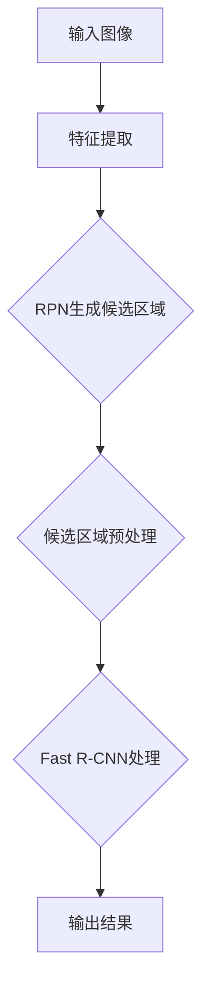

                 

### Faster R-CNN 原理与代码实例讲解

#### 关键词：
- Faster R-CNN
- 物体检测
- 卷积神经网络
- 区域建议网络（RPN）
- 实际代码实现

##### 摘要：
本文将深入探讨 Faster R-CNN（Region-based Convolutional Neural Network）的原理，并通过实际代码实例讲解其实现过程。我们将逐步分析 Faster R-CNN 的架构、核心算法原理，以及如何在实践中应用这一算法。通过本文的学习，您将全面了解 Faster R-CNN 的基本概念和操作步骤，并能够实际编写和解读相关代码。

---

#### 1. 背景介绍

物体检测（Object Detection）是计算机视觉领域的一个重要课题。它旨在从图像或视频中检测出多个感兴趣的目标对象，并对其位置、大小和类别进行标注。随着深度学习技术的不断发展，基于卷积神经网络（CNN）的物体检测方法逐渐成为主流。Faster R-CNN 是其中一个代表性算法，由 Ross Girshick 等人在 2015 年提出。

Faster R-CNN 相比于之前的物体检测算法具有以下几个显著优势：
1. **实时性**：相较于其他复杂算法，Faster R-CNN 能够实现较为快速的检测速度。
2. **准确度**：通过引入区域建议网络（RPN），Faster R-CNN 能够提高检测的准确性。
3. **端到端训练**：Faster R-CNN 采用端到端训练方式，简化了模型训练过程。

#### 2. 核心概念与联系

##### 2.1 Faster R-CNN 架构

Faster R-CNN 的核心架构包括两个主要部分：区域建议网络（RPN）和 Fast R-CNN。

1. **区域建议网络（RPN）**：
   RPN 的主要功能是生成候选区域（Proposal），这些候选区域被认为是潜在的目标对象。具体来说，RPN 在卷积特征图上滑动窗口，并对每个位置预测一组边框（anchor）及其类别概率。通过训练，RPN 能够自动学习到如何从大量背景候选框中筛选出真正的目标候选框。

2. **Fast R-CNN**：
   Fast R-CNN 负责对 RPN 生成的候选区域进行精确分类和定位。它采用全连接层（Fully Connected Layer）对候选区域进行特征提取，并输出边界框（Bounding Box）和类别概率。Fast R-CNN 的优点在于其简洁高效，但缺点是处理速度较慢。

##### 2.2 Faster R-CNN 的工作流程

Faster R-CNN 的工作流程可以概括为以下步骤：

1. **输入图像**：输入一幅图像。
2. **特征提取**：使用卷积神经网络提取图像特征。
3. **RPN 生成的候选区域**：在特征图上滑动窗口，生成候选区域。
4. **候选区域预处理**：对候选区域进行缩放、平移等预处理，使其符合网络的输入要求。
5. **Fast R-CNN 处理**：对预处理后的候选区域进行分类和定位。
6. **输出结果**：输出检测结果，包括边界框和类别概率。

##### 2.3 Mermaid 流程图

以下是一个简单的 Mermaid 流程图，用于描述 Faster R-CNN 的工作流程：

---

在接下来的章节中，我们将进一步探讨 Faster R-CNN 的核心算法原理，并通过实际代码实例讲解其实现过程。请继续阅读。|>

