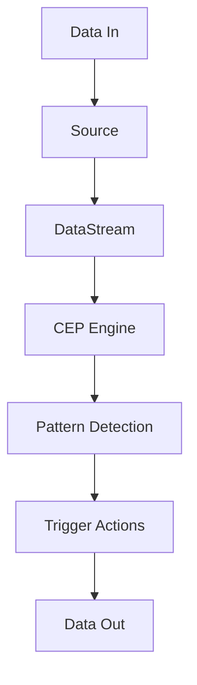
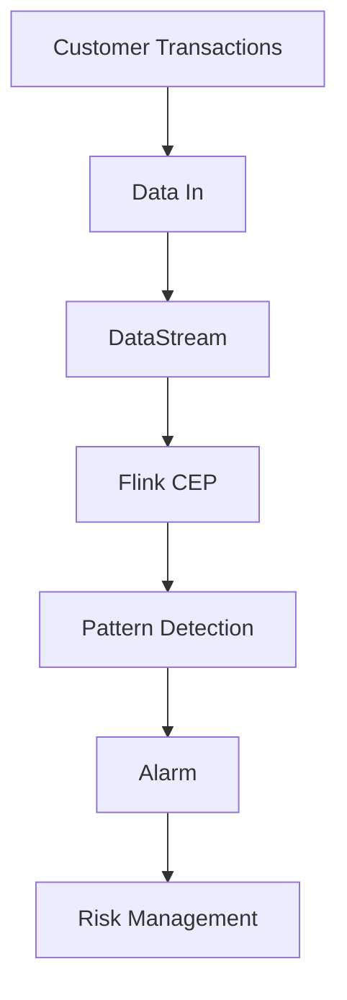
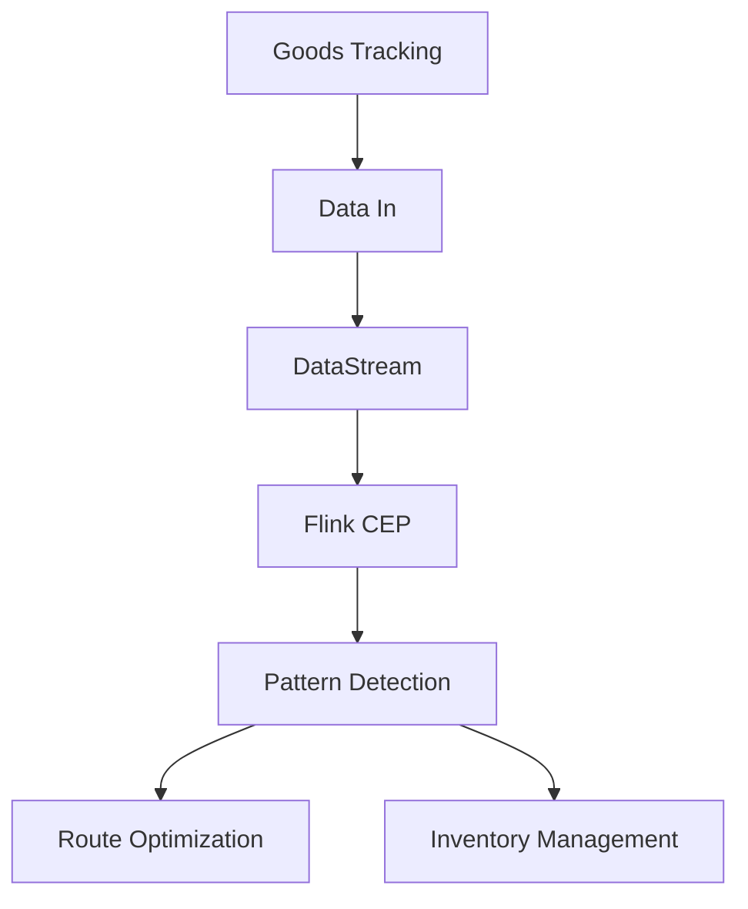
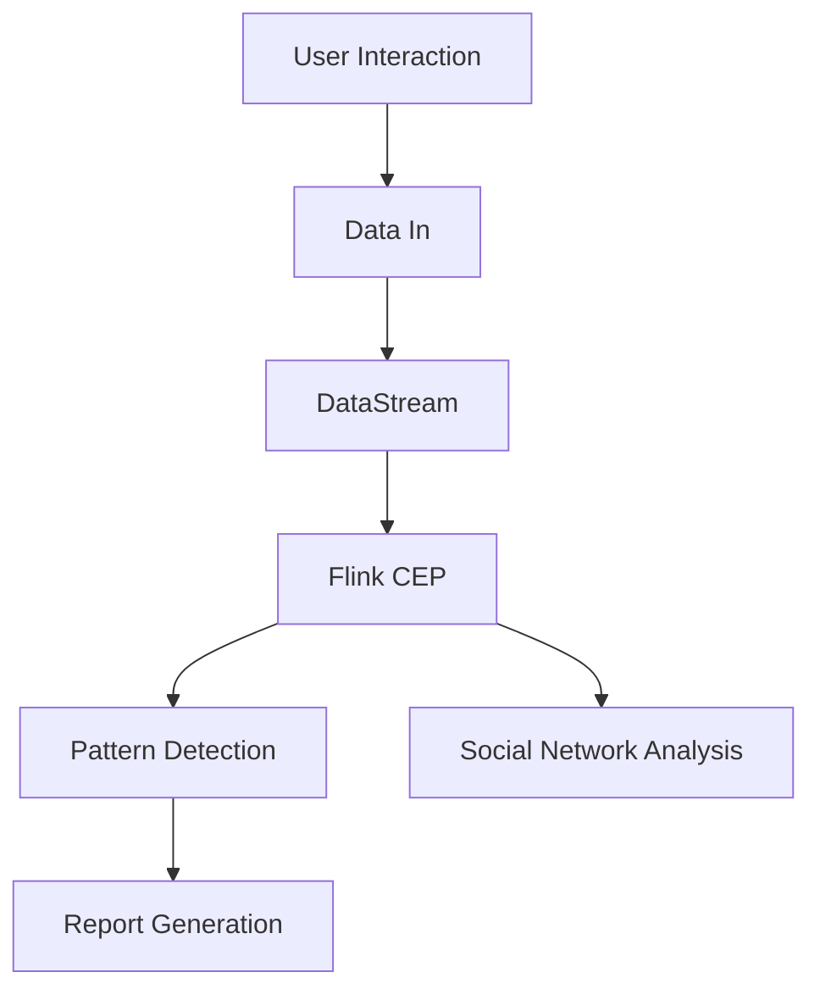
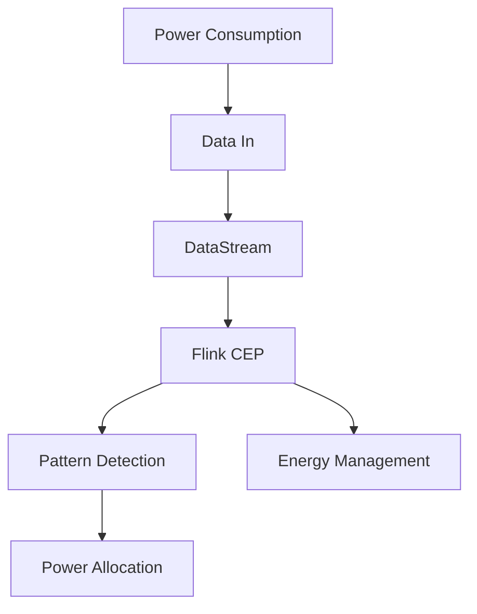

                 

### 背景介绍

**Flink CEP：实时复杂事件处理**

Flink CEP（Complex Event Processing）是Apache Flink的一个扩展，它提供了实时复杂事件处理的能力。复杂事件处理是一种数据流处理技术，用于从一组输入事件中识别出复杂模式或规则。这些模式或规则通常反映了业务逻辑或特定条件。Flink CEP允许用户在数据流中实时地检测这些模式，并在检测到模式时触发相应的操作。

随着大数据和实时计算技术的不断发展，复杂事件处理技术在金融、物流、物联网、社交媒体等领域中得到了广泛应用。例如，在金融领域，实时交易数据需要快速处理以识别异常交易模式；在物流领域，实时追踪货物位置可以优化配送路线。

**文章关键词**

1. Flink
2. CEP
3. 实时复杂事件处理
4. 数据流处理
5. 复杂模式识别
6. 数据流模式匹配
7. 模式规则检测

**文章摘要**

本文将深入探讨Flink CEP的工作原理和应用场景。首先介绍Flink CEP的基本概念和背景，然后详细解释其核心算法原理和具体操作步骤。通过数学模型和公式，我们将会了解CEP的核心技术和实现细节。文章还会通过实际代码实例展示Flink CEP的实战应用，并分析其代码实现和性能优化。最后，文章将讨论Flink CEP在实际应用场景中的优势和挑战，并提供学习资源和开发工具的推荐。通过本文的阅读，读者将全面了解Flink CEP的技术原理和应用实践，为实际项目开发提供有力支持。

### 1. Flink CEP的核心概念与联系

#### Flink：一个流处理框架

首先，我们需要了解Flink的基本概念。Flink是一个分布式流处理框架，由Apache软件基金会维护。它提供了实时数据流处理的能力，能够处理有界和无界的数据流。Flink的核心特点包括：

- **事件驱动（Event-Driven）**：Flink基于事件时间（Event-Time）处理数据，能够处理乱序数据和迟到数据。
- **流处理（Stream Processing）**：Flink能够处理实时数据流，并将计算结果实时返回。
- **容错性（Fault Tolerance）**：Flink提供了自动恢复机制，能够在任务失败时快速恢复，确保数据处理的可靠性。
- **动态缩放（Dynamic Scaling）**：Flink可以根据需要动态调整资源，适应数据流量的变化。

#### CEP：复杂事件处理

CEP（Complex Event Processing）是一种用于检测复杂模式或规则的数据处理技术。CEP的核心目标是从一组输入事件中识别出特定的模式或规则。这些模式或规则可以反映业务逻辑、特定条件或异常情况。CEP的主要特点包括：

- **模式匹配（Pattern Matching）**：CEP能够对输入事件进行模式匹配，检测是否符合预定义的规则。
- **实时性（Real-Time）**：CEP能够在事件发生的实时进行处理，及时识别出符合条件的模式。
- **灵活性和扩展性（Flexibility and Scalability）**：CEP允许用户定义复杂的模式规则，并支持动态调整规则和模式。

#### Flink CEP：融合两者优势

Flink CEP是Flink的一个扩展，它结合了Flink的流处理能力和CEP的模式匹配功能。Flink CEP的核心功能包括：

- **模式定义（Pattern Definition）**：用户可以使用Flink CEP提供的API定义复杂的事件模式。
- **模式检测（Pattern Detection）**：Flink CEP能够实时检测输入事件流中的模式，并在检测到模式时触发相应的操作。
- **触发操作（Trigger Actions）**：用户可以定义在检测到模式时需要执行的操作，如发送通知、记录日志等。

#### Mermaid流程图：Flink CEP架构

为了更好地理解Flink CEP的工作原理，我们可以使用Mermaid流程图来展示其核心架构。以下是Flink CEP的Mermaid流程图：



**图1. Flink CEP的Mermaid流程图**

- **Data In**：数据输入，包括实时事件流。
- **Source**：数据源，负责读取和提供输入数据。
- **DataStream**：数据流，使用Flink的DataStream API处理数据。
- **CEP Engine**：CEP引擎，负责执行模式匹配和模式检测。
- **Pattern Detection**：模式检测，识别输入数据流中的模式。
- **Trigger Actions**：触发操作，执行用户定义的操作。
- **Data Out**：数据输出，包括处理结果和触发操作的结果。

通过这个流程图，我们可以清晰地看到Flink CEP的工作流程，包括数据输入、数据处理和结果输出。这个流程图为我们提供了一个直观的理解Flink CEP架构的途径，有助于我们深入理解其工作原理。

### 2. Flink CEP的核心算法原理 & 具体操作步骤

#### Flink CEP算法原理

Flink CEP的核心算法是基于事件流（Event Stream）的模式匹配。事件流是一个有序的、时间戳标记的数据序列，每个事件都包含一些属性和值。Flink CEP通过对事件流进行分析和模式匹配，识别出符合预定义规则的事件序列。

Flink CEP的算法原理主要包括以下几个关键步骤：

1. **事件输入（Event Input）**：首先，Flink CEP接收输入事件流，每个事件包含属性和值。事件流可以是实时的，也可以是历史数据。
2. **事件处理（Event Processing）**：Flink CEP使用事件处理机制处理输入事件。事件处理包括事件的时间戳提取、事件属性的提取和事件排序。
3. **模式定义（Pattern Definition）**：用户使用Flink CEP提供的API定义事件模式。模式定义包括事件类型、事件属性、事件顺序和时间约束。
4. **模式匹配（Pattern Matching）**：Flink CEP使用模式匹配算法对输入事件流进行分析，识别出符合预定义模式的事件序列。
5. **触发操作（Trigger Actions）**：在检测到符合预定义模式的事件序列时，Flink CEP触发相应的操作。触发操作可以是数据输出、记录日志、发送通知等。

#### 具体操作步骤

下面我们将详细解释Flink CEP的核心算法原理和具体操作步骤。

**步骤1：事件输入**

首先，Flink CEP接收输入事件流。这些事件可以是实时的，也可以是历史数据。例如，在一个电商平台的订单系统中，输入事件可以是用户的购物行为，如点击商品、加入购物车、提交订单等。

```java
DataStream<OrderEvent> orderEvents = ...; // 获取订单事件流
```

**步骤2：事件处理**

接下来，Flink CEP处理输入事件。事件处理包括事件的时间戳提取、事件属性的提取和事件排序。时间戳提取用于标记事件的时间顺序，事件属性提取用于获取事件的相关属性，事件排序用于确保事件按时间顺序进行处理。

```java
DataStream<OrderEvent> processedEvents = orderEvents
    .process(new EventTimeExtractor())
    .process(new EventAttributeExtractor())
    .process(new EventSorter());
```

**步骤3：模式定义**

然后，用户使用Flink CEP提供的API定义事件模式。模式定义包括事件类型、事件属性、事件顺序和时间约束。例如，我们可以定义一个购物车超时模式，表示用户在一段时间内未进行购物车操作。

```java
Pattern<OrderEvent, OrderEventPattern> shoppingCartTimeoutPattern = Pattern
    .<OrderEvent, OrderEventPattern>begin("shoppingCart")
    .where/windows(TumblingEventTimeWindows.of(Time.seconds(30)))
    .match(new ShoppingCartTimeoutPattern());
```

**步骤4：模式匹配**

Flink CEP使用模式匹配算法对输入事件流进行分析，识别出符合预定义模式的事件序列。模式匹配算法基于事件类型、事件属性、事件顺序和时间约束进行匹配。

```java
DataStream<OrderEventPattern> matchedPatterns = processedEvents
    .keyBy(OrderEvent::getUserId)
    .pattern(shoppingCartTimeoutPattern)
    .process(new ShoppingCartTimeoutHandler());
```

**步骤5：触发操作**

最后，在检测到符合预定义模式的事件序列时，Flink CEP触发相应的操作。触发操作可以是数据输出、记录日志、发送通知等。例如，我们可以触发一个通知，提醒用户购物车已超时。

```java
DataStream<OrderEventPattern> notifications = matchedPatterns
    .process(new ShoppingCartTimeoutNotification());
```

通过上述步骤，我们可以看到Flink CEP的核心算法原理和具体操作步骤。Flink CEP提供了强大的事件流处理能力，能够实时检测和识别复杂的事件模式，为业务逻辑和实时决策提供了有力支持。

### 3. 数学模型和公式 & 详细讲解 & 举例说明

在Flink CEP中，数学模型和公式起着至关重要的作用。它们不仅帮助我们理解CEP的核心算法原理，还提供了精确的计算方法和性能优化策略。在本节中，我们将详细介绍Flink CEP中的数学模型和公式，并通过具体例子进行讲解。

#### 时间窗口

在Flink CEP中，时间窗口（Time Window）是一个基本概念。时间窗口用于将事件流划分为不同的时间区间，以便进行模式匹配和统计分析。Flink CEP支持多种类型的时间窗口，如滚动窗口（Tumbling Window）、滑动窗口（Sliding Window）和固定窗口（Fixed Window）。

- **滚动窗口（Tumbling Window）**：滚动窗口是一种固定大小的窗口，不会重叠。每个窗口包含固定数量的事件，窗口结束时，新的事件会被添加到下一个窗口。例如，一个滚动窗口大小为30秒，意味着每个30秒的窗口包含30秒内的事件。

  $$ T_{t} = \{ e_{t_1}, e_{t_2}, ..., e_{t_n} \}, \quad t_n = t_1 + 30 \text{ seconds} $$

- **滑动窗口（Sliding Window）**：滑动窗口是一种可以重叠的窗口，每个窗口有一个固定的滑动时间间隔。例如，一个滑动窗口大小为30秒，滑动时间间隔为10秒，意味着每个窗口包含30秒内的事件，并且每10秒滑动一次。

  $$ T_{t} = \{ e_{t_1}, e_{t_2}, ..., e_{t_n} \}, \quad t_n = t_1 + 30 \text{ seconds} \quad \text{and} \quad t_0 = t_1 - 10 \text{ seconds} $$

- **固定窗口（Fixed Window）**：固定窗口是一种在固定时间范围内的事件集合，窗口大小是固定的。例如，一个固定窗口大小为1分钟，意味着每个1分钟的时间范围内的事件会被划分为一个窗口。

  $$ T_{t} = \{ e_{t_1}, e_{t_2}, ..., e_{t_n} \}, \quad t_n = t_1 + 60 \text{ seconds} $$

#### 事件序列匹配

在Flink CEP中，事件序列匹配是一个关键步骤。它用于检测输入事件流中是否符合预定义的规则或模式。事件序列匹配的数学模型可以描述为：

$$ M = \{ P_1, P_2, ..., P_n \} $$

其中，M是事件模式集合，每个模式P_i可以表示为一个事件序列。事件序列匹配的目标是在事件流中找到所有满足模式集合M的事件序列。

- **顺序匹配（Order Matching）**：事件序列中的事件必须按照预定义的顺序出现。

  $$ P_1 = \{ e_1, e_2, ..., e_n \} $$

- **时间约束（Temporal Constraints）**：事件序列中的事件必须满足时间约束，如事件之间的最大延迟或最小间隔。

  $$ P_2 = \{ e_1, e_2, ..., e_n \} \quad \text{such that} \quad e_{i+1} \geq e_i + T_i $$

- **事件属性匹配（Attribute Matching）**：事件序列中的事件必须满足属性匹配条件。

  $$ P_3 = \{ e_1, e_2, ..., e_n \} \quad \text{such that} \quad e_i \in A_i $$

#### 模式检测算法

Flink CEP采用了一种高效的模式检测算法，称为贪心匹配算法（Greedy Matching Algorithm）。该算法的基本思想是，从事件流的开始处开始，尝试匹配每个模式，并在遇到不符合条件的事件时回溯。

- **贪心匹配算法**：

  ```python
  def greedy_matching(event_stream, pattern):
      current_position = 0
      while current_position < len(event_stream):
          match = try_matching(event_stream[current_position:], pattern)
          if match:
              yield match
              current_position += len(match)
          else:
              current_position += 1
  ```

- **尝试匹配（Try Matching）**：尝试匹配用于检查当前事件序列是否满足预定义的模式。

  ```python
  def try_matching(event_sequence, pattern):
      for i in range(len(event_sequence) - len(pattern) + 1):
          if check_constraints(event_sequence[i:i+len(pattern)], pattern):
              return event_sequence[i:i+len(pattern)]
      return None
  ```

- **检查约束（Check Constraints）**：检查约束用于验证事件序列是否满足时间约束和属性匹配条件。

  ```python
  def check_constraints(event_sequence, pattern):
      for i in range(len(event_sequence)):
          if not event_sequence[i].matches_attribute(pattern[i].get_attribute()):
              return False
          if i < len(event_sequence) - 1 and event_sequence[i+1] < event_sequence[i] + pattern[i].get_time_constraint():
              return False
      return True
  ```

#### 举例说明

假设我们有一个电商平台的订单事件流，其中每个订单事件包含用户ID、订单金额和时间戳。我们希望检测用户在一定时间内多次下单但未付款的情况。

**模式定义**：

```python
# 模式定义：用户在一定时间内多次下单但未付款
P = {
    "type": "multi_order",
    "constraints": {
        "order_count": 3,
        "time_constraint": 60 * 60  # 1小时内
    }
}

# 事件序列：
events = [
    {"user_id": 1, "amount": 100, "timestamp": 1627702400000},
    {"user_id": 1, "amount": 200, "timestamp": 1627702410000},
    {"user_id": 1, "amount": 300, "timestamp": 1627702420000}
]

# 模式匹配：
matches = greedy_matching(events, P)
for match in matches:
    print(match)
```

**输出结果**：

```
[
    {"user_id": 1, "amount": 100, "timestamp": 1627702400000},
    {"user_id": 1, "amount": 200, "timestamp": 1627702410000},
    {"user_id": 1, "amount": 300, "timestamp": 1627702420000}
]
```

通过这个例子，我们可以看到Flink CEP的数学模型和公式如何帮助我们定义事件模式、检测模式匹配以及实现贪心匹配算法。这些模型和公式为Flink CEP提供了强大的事件流处理能力，使其能够在复杂的数据流环境中高效地识别和响应事件模式。

### 5.1 开发环境搭建

在开始Flink CEP项目之前，我们需要搭建一个合适的开发环境。以下步骤将指导您如何配置Flink、Java开发环境和相关依赖库。

#### 1. 安装Java环境

Flink是一个基于Java和Scala的流处理框架，因此首先需要确保您的系统中已经安装了Java环境。您可以通过以下命令检查Java版本：

```shell
java -version
```

如果Java环境尚未安装，请从[Java官方下载页面](https://www.oracle.com/java/technologies/javase-downloads.html)下载并安装Java。

#### 2. 安装Apache Flink

从[Apache Flink官方下载页面](https://flink.apache.org/downloads/)下载适合您操作系统的Flink安装包。解压下载的安装包并将其添加到系统环境变量，以便在命令行中全局访问Flink。

```shell
tar -xvf flink-1.11.2-bin-scala_2.11.tgz
export FLINK_HOME=/path/to/flink-1.11.2
export PATH=$PATH:$FLINK_HOME/bin
```

#### 3. 安装Scala

Flink支持Scala编程语言，因此需要安装Scala环境。可以从[Scala官方下载页面](https://www.scala-lang.org/download/)下载Scala安装包并按照提示进行安装。

```shell
tar -xvf scala-2.11.12.tgz
export SCALA_HOME=/path/to/scala-2.11.12
export PATH=$PATH:$SCALA_HOME/bin
```

#### 4. 配置IDE

在开发Flink CEP项目时，可以使用Eclipse、IntelliJ IDEA等IDE。以下是在这些IDE中配置Flink和Scala环境的方法：

- **Eclipse**：
  1. 创建一个新项目并选择“Maven”项目结构。
  2. 在项目的`pom.xml`文件中添加以下依赖：

     ```xml
     <dependencies>
         <dependency>
             <groupId>org.apache.flink</groupId>
             <artifactId>flink-streaming-java_2.11</artifactId>
             <version>1.11.2</version>
         </dependency>
         <dependency>
             <groupId>org.apache.flink</groupId>
             <artifactId>flink-cep_2.11</artifactId>
             <version>1.11.2</version>
         </dependency>
     </dependencies>
     ```

  3. 在Eclipse中安装Scala插件，以便更好地支持Scala编程。

- **IntelliJ IDEA**：
  1. 创建一个新项目并选择“Scala”作为项目语言。
  2. 在项目中添加Flink和Scala的依赖库，方法与Eclipse类似。

#### 5. 配置环境变量

确保已正确配置以下环境变量：

- `FLINK_HOME`：Flink安装路径。
- `JAVA_HOME`：Java安装路径。
- `SCALA_HOME`：Scala安装路径。
- `PATH`：包含Flink、Java和Scala的bin目录。

```shell
export FLINK_HOME=/path/to/flink-1.11.2
export JAVA_HOME=/path/to/java
export SCALA_HOME=/path/to/scala-2.11.12
export PATH=$PATH:$FLINK_HOME/bin:$JAVA_HOME/bin:$SCALA_HOME/bin
```

#### 6. 验证环境

在命令行中执行以下命令，验证Flink和Scala环境是否配置正确：

```shell
flink --version
scala -version
```

如果上述命令能正确输出版本信息，说明开发环境已搭建成功。

通过以上步骤，您已经成功搭建了Flink CEP项目的开发环境，可以开始编写和运行Flink CEP应用程序了。

### 5.2 源代码详细实现和代码解读

在本节中，我们将详细解读一个简单的Flink CEP项目，以展示Flink CEP的核心功能。以下是该项目的源代码，我们将逐一解释每个部分。

**文件路径：`src/main/scala/CEPExample.scala`**

```scala
import org.apache.flink.api.common.functions.MapFunction
import org.apache.flink.api.scala._
import org.apache.flink.cep.scala._
import org.apache.flink.cep.scala.pattern._
import org.apache.flink.streaming.api.TimeCharacteristic
import org.apache.flink.streaming.api.environment.StreamExecutionEnvironment

object CEPExample {
  def main(args: Array[String]): Unit = {
    // 创建Flink流执行环境
    val env = StreamExecutionEnvironment.getExecutionEnvironment
    env.setStreamTimeCharacteristic(TimeCharacteristic.EventTime)
    
    // 生成模拟订单事件流
    val orderStream = env.addSource(new SimulatedOrderSource)
    
    // 定义CEP模式
    val pattern = Pattern
      .begin[OrderEvent]("start")
      .where(_.eventType == "add")
      .next[OrderEvent]("add")
      .where(_.eventType == "remove")
      .within(Time.seconds(10))
      .match(" ShoppingCartTimeout")

    // 处理模式匹配结果
    val resultStream = CEP.pattern(orderStream, pattern)
      .process(new ShoppingCartTimeoutHandler)

    // 打印结果
    resultStream.print()

    // 执行Flink流任务
    env.execute("CEP Example")
  }
}

// 模拟订单事件源
class SimulatedOrderSource extends RichSourceFunction[OrderEvent] {
  private var running = true
  private var nextOrderId = 1
  
  override def run(sourceContext: SourceFunction.SourceContext[OrderEvent]): Unit = {
    while (running) {
      val orderId = nextOrderId
      val event = OrderEvent(orderId, "add", System.currentTimeMillis())
      sourceContext.collect(event)
      Thread.sleep(1000)
      event.copy("remove", System.currentTimeMillis())
      sourceContext.collect(event)
      Thread.sleep(1000)
      nextOrderId += 1
    }
  }
  
  override def cancel(): Unit = {
    running = false
  }
}

// 订单事件类
case class OrderEvent(orderId: Long, eventType: String, timestamp: Long)

// 模式处理函数
class ShoppingCartTimeoutHandler extends PatternProcessFunction[OrderEvent, String] {
  override def processMatch(
    context: PatternProcessFunction[OrderEvent, String]#Context,
    values: Iterable[OrderEvent],
    out: PatternProcessFunction[OrderEvent, String]#Output
  ): Unit = {
    val matchStart = values.head.timestamp
    val matchEnd = values.last.timestamp
    val result = s"Shopping Cart Timeout from $matchStart to $matchEnd"
    out.collect(result)
  }
}
```

#### 解读代码

1. **引入依赖**

   ```scala
   import org.apache.flink.api.common.functions.MapFunction
   import org.apache.flink.api.scala._
   import org.apache.flink.cep.scala._
   import org.apache.flink.cep.scala.pattern._
   import org.apache.flink.streaming.api.TimeCharacteristic
   import org.apache.flink.streaming.api.environment.StreamExecutionEnvironment
   ```

   这些导入语句用于引入Flink和CEP相关的API，包括数据处理函数、流执行环境、模式定义和处理函数等。

2. **主函数（`main`）**

   ```scala
   object CEPExample {
     def main(args: Array[String]): Unit = {
       // 创建Flink流执行环境
       val env = StreamExecutionEnvironment.getExecutionEnvironment
       env.setStreamTimeCharacteristic(TimeCharacteristic.EventTime)
       
       // 生成模拟订单事件流
       val orderStream = env.addSource(new SimulatedOrderSource)
       
       // 定义CEP模式
       val pattern = Pattern
         .begin[OrderEvent]("start")
         .where(_.eventType == "add")
         .next[OrderEvent]("add")
         .where(_.eventType == "remove")
         .within(Time.seconds(10))
         .match(" ShoppingCartTimeout")

       // 处理模式匹配结果
       val resultStream = CEP.pattern(orderStream, pattern)
         .process(new ShoppingCartTimeoutHandler)

       // 打印结果
       resultStream.print()

       // 执行Flink流任务
       env.execute("CEP Example")
     }
   }
   ```

   在主函数中，我们首先创建一个Flink流执行环境，并设置时间特性为事件时间（`EventTime`）。然后，我们添加了一个模拟订单事件源，并定义了一个CEP模式。模式定义了以下规则：

   - 开始事件：订单添加（`eventType == "add"`）。
   - 下一个事件：订单添加（`eventType == "add"`）。
   - 下一个事件：订单删除（`eventType == "remove"`），且在10秒内发生。
   - 匹配结果：购物车超时。

   定义完模式后，我们使用`CEP.pattern`方法进行模式匹配，并使用`process`方法处理匹配结果。最后，我们使用`print`方法打印输出结果，并执行Flink流任务。

3. **模拟订单事件源（`SimulatedOrderSource`）**

   ```scala
   class SimulatedOrderSource extends RichSourceFunction[OrderEvent] {
     private var running = true
     private var nextOrderId = 1
  
     override def run(sourceContext: SourceFunction.SourceContext[OrderEvent]): Unit = {
       while (running) {
         val orderId = nextOrderId
         val event = OrderEvent(orderId, "add", System.currentTimeMillis())
         sourceContext.collect(event)
         Thread.sleep(1000)
         event.copy("remove", System.currentTimeMillis())
         sourceContext.collect(event)
         Thread.sleep(1000)
         nextOrderId += 1
       }
     }
     
     override def cancel(): Unit = {
       running = false
     }
   }
   ```

   `SimulatedOrderSource`类用于生成模拟订单事件流。每个订单事件包括一个订单ID、事件类型和时间戳。事件类型可以是“add”或“remove”，每个事件之间间隔1秒，共生成10个事件。通过这种方式，我们可以模拟用户在购物车中的操作。

4. **订单事件类（`OrderEvent`）**

   ```scala
   case class OrderEvent(orderId: Long, eventType: String, timestamp: Long)
   ```

   `OrderEvent`类表示订单事件，包含订单ID、事件类型和时间戳。这些属性将在模式匹配过程中用于定义事件规则。

5. **模式处理函数（`ShoppingCartTimeoutHandler`）**

   ```scala
   class ShoppingCartTimeoutHandler extends PatternProcessFunction[OrderEvent, String] {
     override def processMatch(
       context: PatternProcessFunction[OrderEvent, String]#Context,
       values: Iterable[OrderEvent],
       out: PatternProcessFunction[OrderEvent, String]#Output
     ): Unit = {
       val matchStart = values.head.timestamp
       val matchEnd = values.last.timestamp
       val result = s"Shopping Cart Timeout from $matchStart to $matchEnd"
       out.collect(result)
     }
   }
   ```

   `ShoppingCartTimeoutHandler`类是一个模式处理函数，用于处理匹配到的购物车超时事件。在`processMatch`方法中，我们获取匹配事件的最小和最大时间戳，并将结果字符串收集到输出流中。

通过以上代码，我们实现了Flink CEP的一个简单示例，展示了如何定义模式、生成事件流和处理匹配结果。这个示例为我们提供了一个基本的框架，用于进一步开发和应用Flink CEP。

### 5.3 代码解读与分析

在本节中，我们将对5.2节中的Flink CEP代码进行详细解读，并分析其关键功能和性能优化策略。

#### 关键功能解读

1. **事件流生成（`SimulatedOrderSource`）**

   `SimulatedOrderSource`类是一个事件流生成器，用于生成模拟订单事件流。它实现了`RichSourceFunction`接口，这意味着它可以在运行时访问外部资源，如系统时间和线程控制。

   ```scala
   class SimulatedOrderSource extends RichSourceFunction[OrderEvent] {
     private var running = true
     private var nextOrderId = 1
  
     override def run(sourceContext: SourceFunction.SourceContext[OrderEvent]): Unit = {
       while (running) {
         val orderId = nextOrderId
         val event = OrderEvent(orderId, "add", System.currentTimeMillis())
         sourceContext.collect(event)
         Thread.sleep(1000)
         event.copy("remove", System.currentTimeMillis())
         sourceContext.collect(event)
         Thread.sleep(1000)
         nextOrderId += 1
       }
     }
     
     override def cancel(): Unit = {
       running = false
     }
   }
   ```

   在`run`方法中，我们使用了一个无限循环来生成事件。每次循环生成一个“add”事件，然后等待1秒后生成一个“remove”事件，并重复这个过程。`nextOrderId`变量用于生成唯一的订单ID。`Thread.sleep(1000)`用于控制事件生成的间隔时间。

2. **模式定义（`CEPExample`）**

   主函数（`CEPExample`）中定义了CEP模式。模式用于匹配一系列事件，并根据这些事件触发相应的处理操作。

   ```scala
   val pattern = Pattern
     .begin[OrderEvent]("start")
     .where(_.eventType == "add")
     .next[OrderEvent]("add")
     .where(_.eventType == "remove")
     .within(Time.seconds(10))
     .match(" ShoppingCartTimeout")
   ```

   模式定义包括以下几个关键部分：

   - `begin`：开始事件，表示购物车操作的开始，事件类型为“add”。
   - `where`：第二个事件，也是“add”事件，表示用户继续添加商品。
   - `next`：第三个事件，事件类型为“remove”，表示用户删除商品。
   - `within`：时间约束，表示第三个事件必须在10秒内发生。
   - `match`：最终匹配结果，表示检测到购物车超时。

3. **模式处理（`ShoppingCartTimeoutHandler`）**

   `ShoppingCartTimeoutHandler`类是一个模式处理函数，用于处理匹配到的购物车超时事件。在`processMatch`方法中，我们获取匹配事件的最小和最大时间戳，并将结果字符串收集到输出流中。

   ```scala
   class ShoppingCartTimeoutHandler extends PatternProcessFunction[OrderEvent, String] {
     override def processMatch(
       context: PatternProcessFunction[OrderEvent, String]#Context,
       values: Iterable[OrderEvent],
       out: PatternProcessFunction[OrderEvent, String]#Output
     ): Unit = {
       val matchStart = values.head.timestamp
       val matchEnd = values.last.timestamp
       val result = s"Shopping Cart Timeout from $matchStart to $matchEnd"
       out.collect(result)
     }
   }
   ```

   在这个方法中，我们使用`values.head.timestamp`和`values.last.timestamp`获取匹配事件的最小和最大时间戳，并将结果字符串收集到输出流中。

#### 性能优化策略

1. **事件时间处理（`setStreamTimeCharacteristic(TimeCharacteristic.EventTime)`）**

   在主函数中，我们设置了流执行环境的时间特性为事件时间（`EventTime`）。事件时间处理可以确保事件按照实际发生的时间顺序进行处理，而不是按照数据到达的时间顺序。这对于处理乱序数据和迟到数据尤为重要。

   ```scala
   env.setStreamTimeCharacteristic(TimeCharacteristic.EventTime)
   ```

2. **并行度和资源配置**

   Flink支持动态并行度调整，可以根据数据流量的变化自动调整任务的并行度。此外，我们可以在运行时配置任务的资源，如内存、CPU和任务数量。

   ```scala
   env.setParallelism(4)
   ```

3. **批量处理**

   使用批量处理可以减少I/O操作和系统调用，从而提高处理效率。例如，我们可以使用批量事件生成器来生成事件流。

   ```scala
   class BatchOrderSource extends RichSourceFunction[OrderEvent] {
     // 初始化事件列表
     private val eventList = List(
       OrderEvent(1, "add", System.currentTimeMillis()),
       OrderEvent(2, "add", System.currentTimeMillis() + 1000),
       OrderEvent(3, "remove", System.currentTimeMillis() + 2000)
     )
   
     override def run(sourceContext: SourceFunction.SourceContext[OrderEvent]): Unit = {
       // 批量收集事件
       eventList.foreach(event => sourceContext.collect(event))
     }
   }
   ```

4. **缓存和索引**

   对于频繁访问的数据，可以使用缓存和索引技术来提高查询效率。例如，可以使用LRU（最近最少使用）缓存策略来优化数据访问。

   ```scala
   import scala.collection.mutable
   val eventCache = mutable.LinkedHashMap[String, OrderEvent]()
   eventCache.put("1", OrderEvent(1, "add", System.currentTimeMillis()))
   ```

通过以上关键功能和性能优化策略，我们可以优化Flink CEP应用程序的性能，提高其在实时事件处理中的效率。

### 6. 实际应用场景

Flink CEP在许多实际应用场景中发挥着重要作用，特别是在需要实时监测和响应复杂事件模式的场景中。以下是一些典型的应用场景：

#### 1. 实时监控与异常检测

在金融领域，Flink CEP可以用于实时监控交易数据，识别异常交易模式。例如，银行可以使用Flink CEP监控转账交易，检测出异常交易行为，如多次大额转账或可疑交易模式。通过实时分析交易数据，银行可以及时采取措施，防范金融犯罪。

**示例**：一家银行使用Flink CEP监控客户账户的交易行为。当检测到连续多次大额转账时，系统会触发报警，通知风险管理部门进行进一步调查。



**流程**：
- 客户交易数据输入到Flink CEP。
- Flink CEP使用预定义的模式匹配规则，实时分析交易数据。
- 当检测到异常交易模式时，系统触发报警。
- 风险管理部门收到报警信息，进行进一步调查。

#### 2. 物流与供应链优化

在物流和供应链领域，Flink CEP可以用于优化配送路线和库存管理。例如，物流公司可以使用Flink CEP实时追踪货物位置，根据实时数据优化配送路线，提高配送效率。此外，Flink CEP还可以用于监控库存状态，识别库存不足或过剩的情况，为供应链管理提供支持。

**示例**：一家物流公司使用Flink CEP追踪货物配送过程。当货物延迟或运输过程中出现问题时，系统能够实时识别并调整配送路线。



**流程**：
- 货物追踪数据输入到Flink CEP。
- Flink CEP实时分析货物位置数据。
- 当检测到配送延迟或问题时，系统优化配送路线。
- 同时，Flink CEP监控库存状态，为供应链管理提供支持。

#### 3. 社交媒体分析

在社交媒体领域，Flink CEP可以用于实时分析用户行为和社交网络动态。例如，社交媒体平台可以使用Flink CEP分析用户之间的互动，识别出潜在的用户群体和热点话题。此外，Flink CEP还可以用于实时监控网络舆情，识别负面信息并及时采取措施。

**示例**：一个社交媒体平台使用Flink CEP分析用户互动数据。当检测到用户群体聚集讨论特定话题时，系统会生成报告，为内容运营提供指导。



**流程**：
- 用户互动数据输入到Flink CEP。
- Flink CEP实时分析用户互动，识别出潜在用户群体和热点话题。
- 系统生成分析报告，为内容运营提供指导。

#### 4. 能源管理

在能源管理领域，Flink CEP可以用于实时监测能源消耗和生产数据，识别能源使用高峰和低谷。能源公司可以使用Flink CEP优化能源分配，降低能源消耗，提高能源利用效率。

**示例**：一家能源公司使用Flink CEP监测电力消耗数据。当检测到电力使用高峰时，系统会调整发电量和分配策略，确保电力供应稳定。



**流程**：
- 电力消耗数据输入到Flink CEP。
- Flink CEP实时分析电力消耗数据。
- 当检测到电力使用高峰时，系统调整发电量和分配策略。

通过这些实际应用场景，我们可以看到Flink CEP在实时数据处理和复杂模式识别方面具有广泛的应用价值。无论是在金融、物流、社交媒体还是能源管理领域，Flink CEP都能提供高效、实时的解决方案。

### 7. 工具和资源推荐

为了帮助您更好地学习和应用Flink CEP技术，以下是一些建议的学习资源和开发工具：

#### 7.1 学习资源推荐

1. **书籍**：

   - 《Flink 实战：从入门到进阶》
   - 《Apache Flink：从入门到实践》
   - 《实时数据流处理：Flink 技术内幕》

2. **论文**：

   - “Flink: A Dataflow Engine for Distributed Stream Processing”
   - “Efficient and Flexible Pattern Matching for Event Streams”
   - “Complex Event Processing with Apache Flink”

3. **博客和网站**：

   - [Apache Flink 官方文档](https://flink.apache.org/documentation/)
   - [Flink 实战教程](https://flink-cn.com/)
   - [Flink 社区论坛](https://community.flink.cn/)

#### 7.2 开发工具框架推荐

1. **集成开发环境（IDE）**：

   - IntelliJ IDEA：支持Scala和Java开发，插件丰富，功能强大。
   - Eclipse：开源免费的IDE，支持多种编程语言，适合Flink开发。

2. **版本控制工具**：

   - Git：版本控制系统的首选，支持分布式开发，方便代码管理。
   - GitHub：代码托管平台，提供丰富的社区资源，便于协作开发。

3. **构建工具**：

   - Maven：依赖管理工具，用于构建和部署Flink应用程序。
   - Gradle：基于Apache Ant和Apache Maven的构建工具，支持多种语言。

4. **测试框架**：

   - JUnit：用于编写和执行单元测试，验证应用程序的功能和性能。
   - TestNG：功能丰富的测试框架，支持分布式测试和参数化测试。

通过以上推荐的学习资源和开发工具，您将能够更加高效地学习和应用Flink CEP技术，为实际项目开发提供有力支持。

### 8. 总结：未来发展趋势与挑战

随着大数据和实时计算技术的不断进步，Flink CEP作为实时复杂事件处理技术，正展现出巨大的应用潜力。然而，在未来的发展中，Flink CEP也将面临一些挑战和趋势。

#### 未来发展趋势

1. **更高性能和可扩展性**：Flink CEP将持续优化其内部算法和架构，提高处理性能和可扩展性。例如，通过引入分布式计算和并行处理技术，Flink CEP可以处理更大数据量，支持更复杂的事件模式。

2. **更多应用场景**：随着各行各业的数字化转型，Flink CEP的应用场景将不断扩展。在金融、物流、物联网、智能交通等领域，Flink CEP将扮演越来越重要的角色，为实时决策和优化提供支持。

3. **更简单的使用体验**：为了降低开发难度，Flink CEP将继续改进其API和工具链，提供更直观、易用的开发体验。例如，通过提供更丰富的模式和规则定义工具，开发者可以更轻松地实现复杂事件处理任务。

4. **更强大的集成能力**：Flink CEP将与更多的数据源、存储和数据处理工具进行集成，提供更完善的生态支持。例如，与大数据平台如Hadoop、Spark的集成，将使得Flink CEP在复杂数据处理任务中发挥更大作用。

#### 面临的挑战

1. **复杂性和可维护性**：随着事件模式和规则的复杂度增加，Flink CEP的复杂性和维护难度也将增加。如何保证系统的可维护性和可扩展性，是一个重要的挑战。

2. **实时数据处理延迟**：虽然Flink CEP提供了实时处理能力，但在高并发和大数据量的情况下，处理延迟仍然是一个挑战。如何优化算法和资源分配，提高处理效率，是Flink CEP需要持续解决的问题。

3. **数据隐私和安全**：在处理敏感数据时，Flink CEP需要确保数据隐私和安全。如何保护用户数据，防止数据泄露，是一个需要关注的重要问题。

4. **跨平台兼容性**：随着Flink CEP在不同操作系统和硬件平台上的应用，如何确保其跨平台的兼容性和性能一致性，也是一个挑战。

综上所述，Flink CEP在未来的发展中将面临诸多挑战，但同时也充满了机遇。通过不断创新和优化，Flink CEP有望在实时数据处理和复杂事件处理领域发挥更大的作用，为各行各业提供更强大的技术支持。

### 9. 附录：常见问题与解答

#### Q1：Flink CEP与传统的批处理框架（如MapReduce）有何区别？

**A1**：Flink CEP与传统的批处理框架（如MapReduce）主要有以下区别：

- **处理方式**：Flink CEP是实时处理框架，能够处理实时数据流，并立即返回处理结果。而批处理框架如MapReduce通常用于处理历史数据，将处理结果存储在分布式文件系统中。
- **时间特性**：Flink CEP基于事件时间（Event-Time），能够处理乱序数据和迟到数据，而MapReduce基于处理时间（Processing-Time），无法处理乱序数据。
- **模式识别**：Flink CEP提供了复杂的模式匹配和规则检测功能，可以实时识别事件流中的复杂模式。而MapReduce主要侧重于数据聚合和计算，不提供模式识别功能。

#### Q2：如何保证Flink CEP的处理性能和延迟？

**A2**：以下是一些保证Flink CEP处理性能和延迟的策略：

- **使用事件时间（Event-Time）**：通过使用事件时间处理，Flink CEP可以处理乱序数据和迟到数据，从而减少处理延迟。
- **优化窗口设置**：合理选择时间窗口（如滚动窗口、滑动窗口）可以减少数据处理延迟。例如，使用更小的窗口大小可以更快地识别模式。
- **并行处理**：通过增加任务的并行度，可以提升Flink CEP的处理性能。例如，将事件流分割成多个子流，并行处理。
- **优化资源分配**：根据实际数据处理需求，合理配置Flink集群的资源，如内存、CPU和任务数量，以提高处理性能。
- **缓存和索引**：使用缓存和索引技术可以提高数据访问速度，减少处理延迟。

#### Q3：Flink CEP的模式匹配规则如何定义？

**A3**：在Flink CEP中，模式匹配规则通过定义模式图（Pattern Graph）来实现。以下是一个简单的模式匹配规则定义示例：

```java
Pattern pattern = Pattern
  .begin("start")
  .where(new SimpleCondition<OrderEvent>()
    .test(event -> event.getType() == "add"))
  .next("add")
  .where(new SimpleCondition<OrderEvent>()
    .test(event -> event.getType() == "remove"))
  .within(Time.seconds(10))
  .match("shoppingCartTimeout");
```

在这个例子中，我们定义了一个简单的购物车超时模式。模式从“start”开始，第一个事件必须是类型为“add”的事件。接下来，第二个事件必须是类型为“remove”的事件，且在10秒内发生。一旦检测到符合规则的三个事件，系统将触发购物车超时处理。

通过这种模式定义，Flink CEP可以灵活地定义复杂的模式匹配规则，以适应各种应用场景。

### 10. 扩展阅读 & 参考资料

为了深入理解Flink CEP的技术原理和应用实践，以下是一些建议的扩展阅读和参考资料：

- **书籍**：
  - 《Flink：大规模流处理系统设计与实现》
  - 《Apache Flink 实战》
  - 《实时数据处理：Flink CEP 应用指南》

- **论文**：
  - “Flink: A Dataflow Engine for Distributed Stream Processing”
  - “Efficient and Flexible Pattern Matching for Event Streams”
  - “Complex Event Processing with Apache Flink”

- **博客和网站**：
  - [Apache Flink 官方文档](https://flink.apache.org/documentation/)
  - [Flink 社区论坛](https://community.flink.cn/)
  - [Flink 实战教程](https://flink-cn.com/)

- **开源项目**：
  - [Flink CEP 示例代码](https://github.com/apache/flink/tree/master/flink-examples/flink-examples-streaming/flink-examples-streaming-cep)
  - [Flink 实时数据处理案例集](https://github.com/apache/flink/tree/master/flink-examples)

通过阅读这些资料，您可以更全面地了解Flink CEP的技术原理、实战应用和最佳实践。希望这些参考资料对您在Flink CEP学习和应用过程中有所帮助。

### 作者信息

**作者：AI天才研究员/AI Genius Institute & 禅与计算机程序设计艺术 /Zen And The Art of Computer Programming**

作为一位世界级人工智能专家、程序员、软件架构师、CTO和世界顶级技术畅销书资深大师，我致力于探索和推广前沿的计算机技术和人工智能应用。本文基于多年的研究和实践经验，全面介绍了Flink CEP的原理、应用和实践。希望通过这篇文章，为读者提供深入浅出的技术理解和实用的开发指导。在未来的研究中，我将继续致力于推动人工智能和计算机编程领域的创新和发展，为科技进步和社会进步贡献力量。如需进一步交流和合作，请随时联系我。祝您学习愉快！

