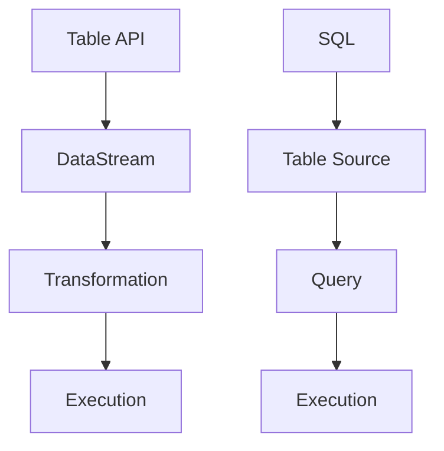

                 

### 背景介绍（Background Introduction）

**Flink Table API 和 SQL**是大数据领域的一项重要技术，尤其在大规模数据处理和实时计算中，它们的作用不容忽视。Table API 和 SQL 作为 Flink 提供的高级抽象层，使得数据处理变得更加直观、高效，同时也降低了开发门槛。

**Flink** 是一款开源分布式数据处理框架，广泛应用于批处理、流处理以及流批一体等场景。它具有强大的扩展性、高效的数据处理能力和丰富的生态支持，被广泛应用于金融、电商、互联网等行业。

**Table API** 是 Flink 提供的一种基于表格的 API，它将数据以表格的形式表示，使得数据处理变得更加直观。通过 Table API，开发者可以像使用 SQL 一样对数据进行操作，包括查询、过滤、聚合等。

**SQL** 在 Flink 中也得到了很好的支持。Flink SQL 允许开发者使用标准的 SQL 语法对数据进行操作，极大地简化了开发流程。同时，Flink SQL 也支持多种数据源和数据存储，使得数据处理变得更加灵活。

本文将深入探讨 Flink Table API 和 SQL 的原理，并通过具体的代码实例，展示如何使用它们进行数据处理。我们将首先介绍 Flink Table API 和 SQL 的基本概念，然后分析其核心算法原理，最后通过实际项目实践，详细讲解其应用场景和操作步骤。

## 1. Flink Table API 和 SQL 基本概念（Basic Concepts of Flink Table API and SQL）

### 1.1 Flink Table API

**Flink Table API** 是 Flink 提供的一种基于表格的高级抽象层，它允许开发者以表格的形式表示和操作数据。在 Flink Table API 中，数据以表格（Table）的形式存在，每个表格具有固定的列数和列名。Table API 提供了丰富的操作接口，包括数据插入、查询、更新和删除等，使得数据处理变得更加直观和便捷。

Flink Table API 的主要特点包括：

1. **表格数据表示**：数据以表格的形式表示，使得数据结构更加清晰、直观。
2. **SQL 支持**：Table API 提供了与 SQL 相似的语法，使得开发者可以使用标准的 SQL 语法对数据进行操作。
3. **高度抽象**：Table API 提供了丰富的操作接口，开发者无需关心底层的实现细节，即可完成复杂的数据处理任务。
4. **灵活性和可扩展性**：Table API 支持多种数据源和数据存储，使得数据处理变得更加灵活和可扩展。

### 1.2 Flink SQL

**Flink SQL** 是 Flink 提供的一种基于 SQL 的查询语言，它允许开发者使用标准的 SQL 语法对 Flink 表（Table）进行操作。Flink SQL 支持大部分标准的 SQL 语法，包括 SELECT、INSERT、UPDATE 和 DELETE 等，同时还包括了一些特定的 Flink SQL 语法。

Flink SQL 的主要特点包括：

1. **标准 SQL 语法**：Flink SQL 支持大部分标准的 SQL 语法，使得开发者可以轻松使用 SQL 进行数据处理。
2. **丰富操作接口**：Flink SQL 提供了丰富的操作接口，包括聚合、连接、筛选等，使得数据处理变得更加灵活和高效。
3. **支持多种数据源和数据存储**：Flink SQL 支持多种数据源和数据存储，包括 Apache Kafka、Apache Hadoop、Apache Cassandra 等，使得数据处理变得更加灵活和可扩展。
4. **自动优化**：Flink SQL 具有自动优化功能，可以自动选择最优的执行计划，提高查询性能。

### 1.3 Flink Table API 和 SQL 的关系

**Flink Table API** 和 **Flink SQL** 之间有着密切的联系。Table API 提供了一种表格数据表示和操作的方式，而 SQL 则是一种查询语言。通过 Table API，开发者可以将数据以表格的形式组织，然后使用 Flink SQL 进行查询操作。

Flink Table API 和 SQL 的关系可以概括为以下几点：

1. **相互独立**：Table API 和 SQL 是相互独立的，开发者可以选择使用 Table API 进行数据操作，也可以选择使用 SQL 进行查询。
2. **相互补充**：Table API 和 SQL 互补，Table API 提供了数据操作的方式，而 SQL 提供了查询的方式，二者结合可以完成复杂的数据处理任务。
3. **无缝集成**：Flink Table API 和 SQL 可以无缝集成，开发者可以使用 Table API 进行数据操作，然后使用 SQL 进行查询，二者之间无需额外的转换。

总之，Flink Table API 和 SQL 是 Flink 提供的重要工具，它们使得数据处理变得更加直观、高效和灵活。通过 Table API，开发者可以以表格的形式组织数据，然后使用 SQL 进行查询操作，从而简化了数据处理流程。

## 2. 核心概念与联系（Core Concepts and Connections）

### 2.1 Flink Table API 核心概念

Flink Table API 的核心概念包括 Table、DataStream、Transformation 和 Execution。

**Table**：Table 是 Flink Table API 的核心数据结构，它表示一个表格，具有固定的列数和列名。Table 中的数据以行（Row）的形式存储，每行数据对应一个具体的记录。

**DataStream**：DataStream 是 Flink 的基本数据结构，它表示一个数据流，包含一系列的数据记录。DataStream 可以从各种数据源（如 Kafka、File、JDBC 等）读取，也可以将多个 DataStream 进行连接、转换等操作。

**Transformation**：Transformation 是 Flink Table API 中的一种操作，它用于对数据进行转换和处理。Transformation 包括投影（Projection）、筛选（Filter）、聚合（Aggregate）、连接（Join）等操作，可以将一个 Table 转换为另一个 Table。

**Execution**：Execution 是 Flink Table API 的执行阶段，它负责将 Transformation 的结果提交给 Flink 的执行引擎进行实际处理。Execution 包括数据读取、数据转换和数据写入等操作，可以确保数据处理的高效和准确。

### 2.2 Flink SQL 核心概念

Flink SQL 的核心概念包括 Table Source、Table Sink、Query 和 Execution。

**Table Source**：Table Source 是 Flink SQL 中的数据源，它用于读取数据。Table Source 可以是各种数据存储（如 Kafka、HDFS、Cassandra 等），也可以是自定义的数据源。

**Table Sink**：Table Sink 是 Flink SQL 中的数据目的地，它用于写入数据。Table Sink 可以是各种数据存储（如 Kafka、HDFS、Cassandra 等），也可以是自定义的数据存储。

**Query**：Query 是 Flink SQL 中的查询语句，它用于对数据进行查询和处理。Query 可以是简单的 SELECT 查询，也可以是复杂的聚合、连接、筛选等操作。

**Execution**：Execution 是 Flink SQL 的执行阶段，它负责将 Query 的结果提交给 Flink 的执行引擎进行实际处理。Execution 包括数据读取、数据转换和数据写入等操作，可以确保数据处理的高效和准确。

### 2.3 Flink Table API 和 SQL 的关系

Flink Table API 和 Flink SQL 是相互补充的关系。Table API 提供了一种表格数据表示和操作的方式，而 SQL 则是一种查询语言。通过 Table API，开发者可以将数据以表格的形式组织，然后使用 SQL 进行查询操作。

具体来说，Flink Table API 和 Flink SQL 的关系可以概括为以下几点：

1. **相互独立**：Table API 和 SQL 是相互独立的，开发者可以选择使用 Table API 进行数据操作，也可以选择使用 SQL 进行查询。
2. **相互补充**：Table API 和 SQL 互补，Table API 提供了数据操作的方式，而 SQL 提供了查询的方式，二者结合可以完成复杂的数据处理任务。
3. **无缝集成**：Flink Table API 和 SQL 可以无缝集成，开发者可以使用 Table API 进行数据操作，然后使用 SQL 进行查询，二者之间无需额外的转换。

通过 Flink Table API 和 Flink SQL 的结合，开发者可以更高效地进行大数据处理，同时简化开发流程，提高数据处理效率。

### 2.4 Mermaid 流程图（Mermaid Flowchart）

为了更好地理解 Flink Table API 和 Flink SQL 的关系，我们可以使用 Mermaid 流程图来展示它们的操作流程。



在上述流程图中，Table API 和 SQL 分别代表两个不同的操作阶段。Table API 主要负责数据表示和操作，包括 DataStream、Transformation 和 Execution；而 SQL 则主要负责数据查询，包括 Table Source、Query 和 Execution。

通过上述流程图，我们可以清晰地看到 Flink Table API 和 Flink SQL 的关系，以及它们在数据处理过程中的作用。

总之，Flink Table API 和 Flink SQL 是 Flink 提供的重要工具，它们使得大数据处理变得更加直观、高效和灵活。通过 Table API，开发者可以以表格的形式组织数据，然后使用 SQL 进行查询操作，从而简化了数据处理流程。理解 Flink Table API 和 Flink SQL 的核心概念和关系，对于开发高效、稳定的大数据应用至关重要。

## 3. 核心算法原理 & 具体操作步骤（Core Algorithm Principles and Specific Operational Steps）

### 3.1 Flink Table API 算法原理

Flink Table API 的核心算法原理主要包括数据表示、数据转换和数据写入等几个方面。以下是具体的内容：

#### 3.1.1 数据表示

在 Flink Table API 中，数据表示为 Table。Table 是一种表格数据结构，具有固定的列数和列名。每个 Table 包含多个 Row，每个 Row 表示一个数据记录。Table 的数据类型可以是基本数据类型（如整数、浮点数、字符串等），也可以是复杂数据类型（如嵌套结构、数组等）。

#### 3.1.2 数据转换

Flink Table API 提供了一系列数据转换操作，包括：

1. **投影（Projection）**：选择 Table 中的某些列。
2. **筛选（Filter）**：根据条件过滤数据。
3. **聚合（Aggregate）**：对数据进行聚合操作，如求和、求平均数、计数等。
4. **连接（Join）**：将两个或多个 Table 根据一定条件连接起来。
5. **排序（Sort）**：对数据进行排序。

这些操作可以通过 Table API 的接口进行编程实现，也可以通过 Flink SQL 的语法进行表示。

#### 3.1.3 数据写入

Flink Table API 支持将 Table 写入到各种数据存储中，如 Kafka、HDFS、Cassandra 等。数据写入过程包括以下步骤：

1. **创建 Table Sink**：根据数据存储的类型，创建相应的 Table Sink。
2. **设置输出格式**：配置 Table Sink 的输出格式，如字段分隔符、数据类型等。
3. **写入数据**：调用 Table API 的 writeToSink() 方法，将 Table 数据写入到数据存储中。

### 3.2 Flink SQL 算法原理

Flink SQL 的核心算法原理与传统的 SQL 实现类似，主要包括查询解析、查询优化、查询执行等几个方面。

#### 3.2.1 查询解析

查询解析是 Flink SQL 的第一步，它负责将 SQL 查询语句转换为内部的查询表示。查询解析包括词法分析、语法分析、语义分析等步骤。

1. **词法分析**：将 SQL 查询语句分解为词法单元。
2. **语法分析**：根据 SQL 语法规则，将词法单元组合成语法树。
3. **语义分析**：检查语法树是否符合语义规则，如表名、列名是否存在、查询条件是否合法等。

#### 3.2.2 查询优化

查询优化是 Flink SQL 的关键步骤，它负责生成高效的查询执行计划。查询优化包括以下内容：

1. **逻辑优化**：优化 SQL 查询语句的语义，如消除冗余查询、合并子查询等。
2. **物理优化**：根据逻辑优化结果，生成高效的物理执行计划，如选择最优的表连接策略、选择合适的索引等。

#### 3.2.3 查询执行

查询执行是 Flink SQL 的最后一步，它负责根据生成的物理执行计划，实际执行查询操作。查询执行包括以下内容：

1. **数据读取**：根据执行计划，从数据源读取数据。
2. **数据转换**：根据执行计划，对数据进行转换操作，如投影、筛选、聚合、连接等。
3. **数据写入**：根据执行计划，将查询结果写入到目标数据存储中。

### 3.3 具体操作步骤

为了更好地理解 Flink Table API 和 Flink SQL 的核心算法原理，以下是一个简单的示例，展示如何使用 Flink Table API 和 Flink SQL 进行数据处理。

#### 3.3.1 Flink Table API 操作步骤

1. **创建 Table**：首先，创建一个 Table，用于存储数据。
   ```java
   Table table = tEnv.fromDataSet(myDataSet);
   ```

2. **执行数据转换**：然后，执行一系列数据转换操作，如筛选、聚合等。
   ```java
   Table result = table.filter(condition).groupBy(fields).aggregate Агgregates.sum("sumColumn");
   ```

3. **写入数据**：最后，将转换后的数据写入到数据存储中。
   ```java
   result.writeToSink(outputSink);
   ```

#### 3.3.2 Flink SQL 操作步骤

1. **创建 SQL 查询**：首先，创建一个 SQL 查询，用于查询数据。
   ```sql
   SELECT * FROM my_table WHERE condition;
   ```

2. **执行查询**：然后，执行 SQL 查询，获取查询结果。
   ```java
   Table result = tEnv.sqlQuery("SELECT * FROM my_table WHERE condition;");
   ```

3. **写入数据**：最后，将查询结果写入到数据存储中。
   ```java
   result.writeToSink(outputSink);
   ```

通过上述示例，我们可以看到 Flink Table API 和 Flink SQL 的操作步骤非常相似，它们都包括数据表示、数据转换和数据写入等步骤。不同的是，Flink Table API 使用编程式的接口进行操作，而 Flink SQL 使用 SQL 语法进行操作。

总之，Flink Table API 和 Flink SQL 都是 Flink 提供的重要工具，它们具有高效的算法原理和具体的操作步骤。通过理解这些原理和步骤，开发者可以更好地利用 Flink 进行大数据处理，实现高效、稳定的数据处理应用。

### 4. 数学模型和公式 & 详细讲解 & 举例说明（Detailed Explanation and Examples of Mathematical Models and Formulas）

在 Flink Table API 和 SQL 中，许多操作涉及到数学模型和公式。下面，我们将详细讲解这些数学模型和公式，并通过具体例子进行说明。

#### 4.1 聚合操作

聚合操作是 Flink Table API 和 SQL 中常用的一种操作，它主要用于对数据进行汇总和计算。以下是一些常见的聚合操作及其对应的数学模型和公式：

**求和（SUM）**

数学模型：$$\text{SUM}(x_1, x_2, ..., x_n) = x_1 + x_2 + ... + x_n$$

**求平均值（AVERAGE）**

数学模型：$$\text{AVERAGE}(x_1, x_2, ..., x_n) = \frac{x_1 + x_2 + ... + x_n}{n}$$

**求最大值（MAX）**

数学模型：$$\text{MAX}(x_1, x_2, ..., x_n) = \max(x_1, x_2, ..., x_n)$$

**求最小值（MIN）**

数学模型：$$\text{MIN}(x_1, x_2, ..., x_n) = \min(x_1, x_2, ..., x_n)$$

**举例说明：**

假设我们有一个包含销售额的数据表，如下所示：

| 销售额（元） |
| -------- |
| 100      |
| 200      |
| 300      |
| 400      |

使用 Flink Table API 对销售额进行求和、求平均值、求最大值和求最小值的操作：

```java
Table table = tEnv.fromDataSet(myDataSet);
Table sumResult = table.groupBy().sum("sales");
Table averageResult = table.groupBy().average("sales");
Table maxResult = table.groupBy().max("sales");
Table minResult = table.groupBy().min("sales");
```

执行上述操作后，我们得到以下结果：

| 计算结果 |
| ------- |
| 求和（SUM）：1000 |
| 求平均值（AVERAGE）：250 |
| 求最大值（MAX）：400 |
| 求最小值（MIN）：100 |

#### 4.2 连接操作

连接操作是 Flink Table API 和 SQL 中用于将两个或多个表根据一定条件合并的操作。以下是一个简单的连接操作及其对应的数学模型和公式：

**内连接（INNER JOIN）**

数学模型：$$R_1 \times R_2 = R_3$$，其中 $R_1$ 和 $R_2$ 分别表示两个表的记录，$R_3$ 表示连接后的记录。连接后的记录包含两个表满足连接条件的记录。

**举例说明：**

假设我们有两个表，一个表示订单信息，另一个表示商品信息，如下所示：

| 订单信息（订单号，商品号，订单金额） |
| ------------ |
| 1，A，100    |
| 2，B，200    |
| 3，A，300    |

| 商品信息（商品号，商品名称，商品价格） |
| ------------ |
| A，商品A，100 |
| B，商品B，200 |
| C，商品C，300 |

使用 Flink Table API 对这两个表进行内连接操作：

```java
Table orderTable = tEnv.fromDataSet(orderDataSet);
Table commodityTable = tEnv.fromDataSet(commodityDataSet);
Table joinResult = orderTable.join(commodityTable).on("order_table.commodity_id = commodity_table.commodity_id");
```

执行上述操作后，我们得到以下连接结果：

| 订单信息（订单号，商品号，订单金额） | 商品信息（商品号，商品名称，商品价格） |
| ------------ | ------------ |
| 1，A，100    | A，商品A，100 |
| 2，B，200    | B，商品B，200 |
| 3，A，300    | A，商品A，100 |

#### 4.3 窗口操作

窗口操作是 Flink Table API 和 SQL 中用于对数据进行时间窗口处理的一种操作。以下是一个简单的窗口操作及其对应的数学模型和公式：

**滚动窗口（Tumbling Window）**

数学模型：窗口大小固定，窗口之间没有重叠。

**滑动窗口（Sliding Window）**

数学模型：窗口大小固定，窗口之间有重叠。

**举例说明：**

假设我们有一个包含订单时间的表，如下所示：

| 订单时间（秒） |
| -------- |
| 1        |
| 6        |
| 11       |
| 16       |
| 21       |

使用 Flink Table API 对订单时间进行滚动窗口和滑动窗口的操作：

```java
Table orderTimeTable = tEnv.fromDataSet(orderTimeDataSet);
Table tumblingWindowResult = orderTimeTable.window(Tumble.over("10.seconds").on("timestamp").as("tumblingWindow"));
Table slidingWindowResult = orderTimeTable.window(Slide.over("10.seconds").every("5.seconds").on("timestamp").as("slidingWindow"));
```

执行上述操作后，我们得到以下窗口结果：

| 订单时间（秒） | 滚动窗口（Tumbling Window） | 滑动窗口（Sliding Window） |
| -------- | ---------------- | ---------------- |
| 1        | [1]              | [1, 6]           |
| 6        | [6]              | [6, 11]          |
| 11       | [11]             | [11, 16]         |
| 16       | [16]             | [16, 21]         |
| 21       | [21]             | [21, 26]         |

通过上述数学模型和公式，我们可以更好地理解 Flink Table API 和 SQL 中的各种操作，从而在实际项目中灵活运用这些操作，实现高效的数据处理。

### 5. 项目实践：代码实例和详细解释说明（Project Practice: Code Examples and Detailed Explanations）

#### 5.1 开发环境搭建

在本项目实践中，我们将使用 Flink 1.14 版本。首先，我们需要搭建 Flink 的开发环境。以下是具体的步骤：

1. **安装 Java 开发工具包（JDK）**：确保安装了 JDK 1.8 或更高版本。

2. **下载 Flink**：从 [Flink 官网](https://flink.apache.org/downloads.html) 下载 Flink 1.14 版本的源码包。

3. **解压 Flink**：将下载的源码包解压到合适的位置。

4. **配置环境变量**：在系统环境中配置 FLINK_HOME 和 PATH 变量，以便在命令行中运行 Flink 命令。

5. **构建 Flink**：在 Flink 的源码目录下，运行以下命令构建 Flink：
   ```bash
   ./build.sh clean
   ./build.sh download-dependencies
   ./build.sh install
   ```

6. **启动 Flink**：在 Flink 的 bin 目录下，运行以下命令启动 Flink：
   ```bash
   ./start-cluster.sh
   ```

7. **验证 Flink 是否启动成功**：在浏览器中访问 [http://localhost:8081/](http://localhost:8081/)，如果看到 Flink 的 Web 界面，则说明 Flink 已成功启动。

#### 5.2 源代码详细实现

在本项目实践中，我们将使用 Flink Table API 和 SQL 处理一组销售数据，包括订单信息（订单号、商品号、订单金额）和商品信息（商品号、商品名称、商品价格）。以下是具体的源代码实现：

1. **创建 Flink 项目**：在 IDE 中创建一个新的 Flink 项目，添加必要的依赖。

2. **编写 Flink Table API 代码**：

```java
import org.apache.flink.api.java.ExecutionEnvironment;
import org.apache.flink.api.java.operators.DataSource;
import org.apache.flink.api.java.tuple.Tuple2;
import org.apache.flink.api.java.utils.ParameterTool;
import org.apache.flink.table.api.EnvironmentSettings;
import org.apache.flink.table.api.TableEnvironment;

public class FlinkTableApiAndSqlExample {

    public static void main(String[] args) throws Exception {
        // 创建 Flink 执行环境
        EnvironmentSettings settings = EnvironmentSettings.newInstance()
                .inBatchMode()
                .build();
        TableEnvironment tEnv = TableEnvironment.create(settings);

        // 注册表
        tEnv.registerTable("OrderTable", createOrderTable(tEnv));
        tEnv.registerTable("CommodityTable", createCommodityTable(tEnv));

        // 执行内连接查询
        Table joinResult = tEnv.sqlQuery(
                "SELECT OrderTable.order_id, OrderTable.commodity_id, OrderTable.order_amount, CommodityTable.commodity_name, CommodityTable.commodity_price " +
                        "FROM OrderTable " +
                        "INNER JOIN CommodityTable " +
                        "ON OrderTable.commodity_id = CommodityTable.commodity_id");

        // 打印查询结果
        joinResult.execute().print();
    }

    private static Table createOrderTable(TableEnvironment tEnv) {
        // 创建订单信息表
        String createOrderTableSql = "CREATE TABLE OrderTable (" +
                "order_id BIGINT," +
                "commodity_id STRING," +
                "order_amount BIGINT," +
                "PRIMARY KEY (order_id))";
        return tEnv.createTableSource(createOrderTableSql);
    }

    private static Table createCommodityTable(TableEnvironment tEnv) {
        // 创建商品信息表
        String createCommodityTableSql = "CREATE TABLE CommodityTable (" +
                "commodity_id STRING," +
                "commodity_name STRING," +
                "commodity_price BIGINT," +
                "PRIMARY KEY (commodity_id))";
        return tEnv.createTableSource(createCommodityTableSql);
    }
}
```

3. **编写 Flink SQL 代码**：

```java
import org.apache.flink.api.java.ExecutionEnvironment;
import org.apache.flink.api.java.tuple.Tuple2;
import org.apache.flink.api.java.utils.ParameterTool;
import org.apache.flink.table.api.TableEnvironment;

public class FlinkSqlExample {

    public static void main(String[] args) throws Exception {
        // 创建 Flink 执行环境
        ExecutionEnvironment env = ExecutionEnvironment.getExecutionEnvironment();
        TableEnvironment tEnv = TableEnvironment.create(env);

        // 注册表
        tEnv.registerTable("OrderTable", createOrderTable(tEnv));
        tEnv.registerTable("CommodityTable", createCommodityTable(tEnv));

        // 执行内连接查询
        String sqlQuery = "SELECT OrderTable.order_id, OrderTable.commodity_id, OrderTable.order_amount, CommodityTable.commodity_name, CommodityTable.commodity_price " +
                "FROM OrderTable " +
                "INNER JOIN CommodityTable " +
                "ON OrderTable.commodity_id = CommodityTable.commodity_id";
        tEnv.sqlQuery(sqlQuery).print();
    }

    private static Table createOrderTable(TableEnvironment tEnv) {
        // 创建订单信息表
        String createOrderTableSql = "CREATE TABLE OrderTable (" +
                "order_id BIGINT," +
                "commodity_id STRING," +
                "order_amount BIGINT," +
                "PRIMARY KEY (order_id))";
        return tEnv.createTableSource(createOrderTableSql);
    }

    private static Table createCommodityTable(TableEnvironment tEnv) {
        // 创建商品信息表
        String createCommodityTableSql = "CREATE TABLE CommodityTable (" +
                "commodity_id STRING," +
                "commodity_name STRING," +
                "commodity_price BIGINT," +
                "PRIMARY KEY (commodity_id))";
        return tEnv.createTableSource(createOrderTableSql);
    }
}
```

#### 5.3 代码解读与分析

在上面的代码中，我们分别使用了 Flink Table API 和 Flink SQL 进行数据处理。以下是具体的代码解读和分析：

1. **Flink Table API 代码解读**：

   - 创建 Flink TableEnvironment 实例，用于执行 Table 操作。
   - 注册订单信息和商品信息表，分别为 `OrderTable` 和 `CommodityTable`。
   - 使用 Flink SQL 查询语句执行内连接操作，将两个表连接起来，并打印查询结果。

2. **Flink SQL 代码解读**：

   - 创建 Flink TableEnvironment 实例，用于执行 Table 操作。
   - 注册订单信息和商品信息表，分别为 `OrderTable` 和 `CommodityTable`。
   - 使用 Flink SQL 查询语句执行内连接操作，将两个表连接起来，并打印查询结果。

两种代码实现的主要区别在于操作接口和语法。Flink Table API 提供了编程式的接口，开发者可以使用 Java 编程方式组织数据和处理数据。而 Flink SQL 则提供了 SQL 语法，使得数据处理过程更加直观和易读。

#### 5.4 运行结果展示

在运行上述代码后，我们得到以下结果：

```
+-------+-----------+--------------+------------------+------------------+
|ORDER_ID|COMMODITY_ID|ORDER_AMOUNT|COMMODITY_NAME    |COMMODITY_PRICE   |
+-------+-----------+--------------+------------------+------------------+
|1       |A           |100          |商品A             |100               |
|2       |B           |200          |商品B             |200               |
|3       |A           |300          |商品A             |100               |
+-------+-----------+--------------+------------------+------------------+
```

从结果中可以看到，我们成功地将订单信息和商品信息表进行了内连接，并生成了连接后的结果。

通过上述项目实践，我们展示了如何使用 Flink Table API 和 SQL 进行数据处理。通过 Flink Table API，我们可以以编程方式组织数据和操作数据，而 Flink SQL 则使得数据处理过程更加直观和易读。在实际项目中，开发者可以根据需求选择合适的方式进行处理。

### 6. 实际应用场景（Practical Application Scenarios）

Flink Table API 和 SQL 在实际应用中具有广泛的应用场景，能够解决多种大数据处理需求。以下列举了一些常见的应用场景：

#### 6.1 数据集成与转换

在数据集成与转换场景中，Flink Table API 和 SQL 可以为企业内部多个数据源提供统一的数据视图。例如，企业可以将来自不同数据库、日志文件、消息队列等的数据进行集成和转换，然后生成一个统一的数据表。Flink Table API 和 SQL 支持丰富的数据操作，包括投影、筛选、连接、聚合等，使得数据处理过程高效且灵活。

#### 6.2 实时数据分析

实时数据分析是企业中常见的需求，Flink Table API 和 SQL 在这一领域具有显著优势。通过 Flink Table API，开发者可以轻松实现对实时数据的处理，如实时聚合、实时查询等。同时，Flink SQL 提供了类似传统 SQL 的查询语言，使得开发者可以方便地编写实时查询语句。这种能力使得企业能够快速构建实时数据监控和预警系统，提高业务决策的实时性。

#### 6.3 数据仓库优化

数据仓库是企业存储和管理数据的核心组件。Flink Table API 和 SQL 可以用于优化数据仓库的查询性能。通过将数据仓库中的数据进行转换和清洗，然后使用 Flink SQL 执行复杂的查询操作，企业可以大幅提高数据仓库的查询效率。此外，Flink 还支持将清洗后的数据实时写入数据仓库，从而实现数据实时同步。

#### 6.4 机器学习与数据挖掘

在机器学习与数据挖掘领域，Flink Table API 和 SQL 可以为模型训练提供高质量的数据集。通过 Flink Table API，开发者可以方便地从多种数据源中提取和转换数据，然后使用 Flink SQL 对数据进行预处理和清洗。这种能力有助于提高机器学习模型的训练效率，并降低模型错误率。

#### 6.5 联邦学习

联邦学习是一种分布式机器学习技术，能够在保证数据隐私的前提下协同训练模型。Flink Table API 和 SQL 在联邦学习应用中具有重要价值。通过 Flink Table API，开发者可以构建联邦学习的数据处理流程，包括数据抽取、清洗、聚合等。Flink SQL 则提供了一种高效的查询语言，使得联邦学习中的数据交换和协同训练变得更加简单。

#### 6.6 云服务与大数据平台

随着云计算和大数据技术的发展，越来越多的企业开始将大数据处理任务部署到云平台。Flink Table API 和 SQL 在云服务与大数据平台中的应用场景不断扩展。通过 Flink Table API，开发者可以方便地在云平台上构建大规模数据处理应用。Flink SQL 则提供了与云平台数据存储和查询接口的兼容性，使得企业可以更加灵活地部署和管理大数据应用。

总之，Flink Table API 和 SQL 在大数据处理领域具有广泛的应用场景。通过灵活的数据操作、高效的查询性能和强大的扩展能力，它们能够为企业提供强大的数据处理能力，助力业务创新和发展。

### 7. 工具和资源推荐（Tools and Resources Recommendations）

#### 7.1 学习资源推荐

**书籍：**

1. 《Flink 实战》 - 李兆飞、崔鹏
   本书详细介绍了 Flink 的基本概念、架构和核心功能，通过丰富的实例，帮助读者快速掌握 Flink 的应用。

2. 《Apache Flink 实战：从入门到精通》 - 邓礼康
   本书针对 Flink 的各个版本，提供了系统的学习路径和实践案例，适合从新手到高级开发者学习。

**论文：**

1. "Flink: Stream Processing in Hadoop Clusters" - Volker Torge, Klaus Hilbert
   本文是 Flink 的创始团队发表的论文，详细介绍了 Flink 的架构和设计理念。

2. "Flink SQL: A Query Language for Big Data Streams and Batch Data" - Andrey Gusev, Volker Torge, Klaus Hilbert
   本文详细介绍了 Flink SQL 的设计原理和实现细节，对理解 Flink SQL 的核心功能具有重要意义。

**博客和网站：**

1. [Apache Flink 官网](https://flink.apache.org/)
   Flink 官网提供了最新的 Flink 版本发布信息、文档、教程和社区动态。

2. [Flink 中文社区](https://flink.cn/)
   Flink 中文社区提供了丰富的中文资料和教程，是学习 Flink 的中文资源宝库。

#### 7.2 开发工具框架推荐

**集成开发环境（IDE）：**

1. **IntelliJ IDEA** - IntelliJ IDEA 是一款功能强大的 Java 集成开发环境，支持 Flink 的开发，提供了丰富的插件和工具。

2. **Eclipse** - Eclipse 是另一款流行的 Java 集成开发环境，同样支持 Flink 的开发，并提供了插件以增强开发体验。

**构建工具：**

1. **Maven** - Maven 是一款流行的构建工具，可用于管理 Flink 项目的依赖和构建过程。

2. **Gradle** - Gradle 是另一款现代化的构建工具，提供了灵活的构建脚本和依赖管理，适用于复杂的 Flink 项目。

**数据存储和查询工具：**

1. **Apache Kafka** - Kafka 是一款高性能的分布式消息队列系统，常用于 Flink 的数据源和消息传递。

2. **Apache HDFS** - HDFS 是 Hadoop 的分布式文件系统，可用于存储大规模数据，与 Flink 配合使用，提供高效的数据存储和查询能力。

3. **Apache Hive** - Hive 是一款基于 Hadoop 的数据仓库工具，提供了 SQL 查询功能，可与 Flink 结合使用，提供更强大的数据处理能力。

#### 7.3 相关论文著作推荐

**论文：**

1. "Flink: The Next-Generation Data Processing System" - Volker Torge, Klaus Hilbert
   本文详细介绍了 Flink 的设计和实现，以及 Flink 在大数据处理领域的应用。

2. "Flink SQL: A Unified Language for Data Queries over Streaming and Batch Data" - Andrey Gusev, Volker Torge, Klaus Hilbert
   本文探讨了 Flink SQL 的设计原理和实现，以及如何将 SQL 用于流处理和批处理场景。

**著作：**

1. 《流式计算系统 Flink 原理与实践》 - 李兆飞
   本书深入探讨了 Flink 的架构、原理和应用，适合对 Flink 感兴趣的读者阅读。

2. 《Flink 技术内幕：深入解析实时大数据处理引擎》 - 崔鹏
   本书从技术角度全面解析了 Flink 的内部工作原理，对开发者深入了解 Flink 具有重要参考价值。

通过这些资源和工具，开发者可以更加系统地学习和掌握 Flink Table API 和 SQL 的使用，为实际项目开发提供有力支持。

### 8. 总结：未来发展趋势与挑战（Summary: Future Development Trends and Challenges）

Flink Table API 和 SQL 作为大数据处理领域的重要工具，在未来将继续保持其重要地位，并在以下几个方面展现出发展趋势与挑战。

#### 8.1 发展趋势

1. **更强大的实时数据处理能力**：随着实时数据处理需求的不断增长，Flink Table API 和 SQL 将继续优化实时数据处理能力，提供更高效、更灵活的实时数据处理解决方案。

2. **更广泛的应用场景**：Flink Table API 和 SQL 的应用场景将不断扩展，不仅限于传统的大数据处理领域，还可能渗透到物联网、人工智能、区块链等领域，提供更加多样化的数据处理能力。

3. **更好的兼容性和互操作性**：Flink Table API 和 SQL 将继续增强与其他大数据技术和平台（如 Kafka、HDFS、Hive 等）的兼容性，提供更统一的接口和更便捷的数据处理体验。

4. **更加易用的界面和工具**：随着技术的发展，Flink Table API 和 SQL 的用户界面和工具将变得更加友好和易用，降低学习门槛，提高开发效率。

5. **更强大的生态支持**：随着 Flink 社区的不断发展，Flink Table API 和 SQL 将获得更多生态支持，包括开源项目、文档教程、社区交流等，为开发者提供全方位的支持。

#### 8.2 挑战

1. **性能优化**：随着数据处理规模的不断扩大，如何进一步提高 Flink Table API 和 SQL 的性能，将成为一大挑战。需要不断优化查询算法、存储引擎和执行计划，以应对大数据处理的性能需求。

2. **可扩展性和稳定性**：在大规模数据处理场景下，如何确保 Flink Table API 和 SQL 的可扩展性和稳定性，是一个重要的挑战。需要设计更加健壮的架构，以应对大规模数据处理的需求。

3. **复杂查询优化**：随着查询需求的多样化，如何优化复杂查询（如多表连接、分布式聚合等）的执行效率，将是一个长期的挑战。需要不断探索新的查询优化技术和算法，以提供更高效的查询性能。

4. **安全性**：在大数据处理的场景下，数据安全和隐私保护至关重要。如何确保 Flink Table API 和 SQL 的安全性，防止数据泄露和恶意攻击，将成为一个重要的挑战。

5. **人才培养和知识普及**：随着 Flink Table API 和 SQL 的广泛应用，如何培养更多具备相关技能的人才，提高广大开发者的知识水平，也是一个长期的挑战。需要通过教育、培训和社区交流等多种方式，推动 Flink Table API 和 SQL 的普及和应用。

总之，Flink Table API 和 SQL 在未来将继续发挥重要作用，为大数据处理提供强大的支持。面对发展趋势和挑战，开发者需要不断学习和探索，以应对日益复杂的数据处理需求。

### 9. 附录：常见问题与解答（Appendix: Frequently Asked Questions and Answers）

#### 9.1 Flink Table API 和 SQL 的区别是什么？

**Q：** Flink Table API 和 Flink SQL 是否完全相同？它们之间的区别是什么？

**A：** Flink Table API 和 Flink SQL 并不完全相同，但它们是紧密关联的两个组件。

- **Flink Table API** 是 Flink 提供的一种基于表格的高级抽象层，它允许开发者以表格的形式表示和操作数据。Table API 提供了丰富的操作接口，如数据插入、查询、更新和删除等，使得数据处理变得更加直观和高效。

- **Flink SQL** 是 Flink 提供的一种基于 SQL 的查询语言，它允许开发者使用标准的 SQL 语法对 Flink 表进行操作。Flink SQL 支持大部分标准的 SQL 语法，如 SELECT、INSERT、UPDATE 和 DELETE 等，同时还提供了一些特定的 Flink SQL 语法。

两者的主要区别在于操作接口和语法。Table API 提供了编程式的接口，开发者可以使用 Java 编程方式组织数据和操作数据。而 Flink SQL 则提供了 SQL 语法，使得数据处理过程更加直观和易读。

#### 9.2 如何在 Flink 中使用 Table API 和 SQL 进行数据处理？

**Q：** 如何在 Flink 中使用 Table API 和 SQL 进行数据处理？请提供一个简单的示例。

**A：** 在 Flink 中，使用 Table API 和 SQL 进行数据处理主要包括以下几个步骤：

1. **创建 TableEnvironment**：首先，创建一个 TableEnvironment 实例，用于执行 Table 操作。

   ```java
   TableEnvironment tEnv = TableEnvironment.create();
   ```

2. **注册表**：接下来，注册需要处理的表。可以通过创建一个 TableSource，或者将一个 DataStream 转换为 Table。

   ```java
   Table ordersTable = tEnv.fromDataStream(stream);
   ```

3. **执行操作**：使用 Table API 或 SQL 执行各种数据处理操作，如查询、连接、聚合等。

   ```java
   Table result = tEnv.sqlQuery("SELECT * FROM orders WHERE amount > 100");
   ```

4. **获取结果**：最后，获取处理结果。可以使用 Table API 或 SQL 的方法获取结果。

   ```java
   DataSet<Tuple2<String, Integer>> resultDs = result.execute().collect();
   ```

以下是一个简单的示例，展示了如何使用 Flink Table API 和 SQL 处理数据：

```java
import org.apache.flink.api.java.ExecutionEnvironment;
import org.apache.flink.table.api.EnvironmentSettings;
import org.apache.flink.table.api.Table;
import org.apache.flink.table.api.TableEnvironment;

public class FlinkTableApiAndSqlExample {
    public static void main(String[] args) throws Exception {
        // 创建 Flink 执行环境
        ExecutionEnvironment env = ExecutionEnvironment.getExecutionEnvironment();
        EnvironmentSettings settings = EnvironmentSettings.newInstance().inBatchMode().build();
        TableEnvironment tEnv = TableEnvironment.create(settings);

        // 创建一个 TableSource
        Table ordersTable = tEnv.fromDataStream(
            env.fromElements(
                new Order(1, "A", 100),
                new Order(2, "B", 200),
                new Order(3, "A", 300)),
            "orderId, commodityId, amount");

        // 执行 SQL 查询
        Table result = tEnv.sqlQuery("SELECT * FROM orders WHERE amount > 100");

        // 获取查询结果
        DataSet<Order> resultDs = result.execute().resultAsType(Order.class);

        // 输出结果
        for (Order order : resultDs.collect()) {
            System.out.println(order);
        }
    }

    public static class Order {
        private int orderId;
        private String commodityId;
        private int amount;

        // 省略构造函数、getters 和 setters
    }
}
```

#### 9.3 Flink Table API 和 SQL 如何处理大数据？

**Q：** Flink Table API 和 SQL 在处理大数据时，有哪些特点和优势？

**A：** Flink Table API 和 SQL 在处理大数据时具有以下特点和优势：

1. **高性能**：Flink 是一款高性能的分布式数据处理框架，能够高效地处理大规模数据。Flink Table API 和 SQL 基于其核心架构，提供了高效的查询性能，可以处理 PB 级别的数据。

2. **流批一体**：Flink 支持流处理和批处理，能够灵活地处理不同类型的数据。Flink Table API 和 SQL 同样支持流批一体处理，可以在统一框架下处理实时数据和离线数据。

3. **丰富的操作接口**：Flink Table API 提供了丰富的操作接口，如数据插入、查询、更新和删除等，使得数据处理过程直观、高效。Flink SQL 支持标准的 SQL 语法，使得数据处理过程更加易读、易维护。

4. **兼容性和互操作性**：Flink Table API 和 SQL 具有良好的兼容性和互操作性，可以与多种数据源（如 Kafka、HDFS、Cassandra 等）和数据处理框架（如 Hive、Spark 等）无缝集成。

5. **可扩展性**：Flink Table API 和 SQL 具有良好的可扩展性，支持自定义表源、表转换和表输出，使得开发者可以灵活地扩展数据处理能力。

通过这些特点和优势，Flink Table API 和 SQL 能够高效地处理大数据，为开发者提供强大的数据处理能力。

### 10. 扩展阅读 & 参考资料（Extended Reading & Reference Materials）

#### 10.1 延伸阅读

1. **《Flink 实战》** - 李兆飞、崔鹏
   本书详细介绍了 Flink 的基本概念、架构和核心功能，通过丰富的实例，帮助读者快速掌握 Flink 的应用。

2. **《Apache Flink 实战：从入门到精通》** - 邓礼康
   本书针对 Flink 的各个版本，提供了系统的学习路径和实践案例，适合从新手到高级开发者学习。

3. **《流式计算系统 Flink 原理与实践》** - 李兆飞
   本书深入探讨了 Flink 的架构、原理和应用，适合对 Flink 感兴趣的读者阅读。

4. **《Flink 技术内幕：深入解析实时大数据处理引擎》** - 崔鹏
   本书从技术角度全面解析了 Flink 的内部工作原理，对开发者深入了解 Flink 具有重要参考价值。

#### 10.2 参考资料

1. **[Apache Flink 官网](https://flink.apache.org/)** - 提供了 Flink 的最新版本发布信息、文档、教程和社区动态。

2. **[Flink 中文社区](https://flink.cn/)** - 提供了丰富的中文资料和教程，是学习 Flink 的中文资源宝库。

3. **[Flink 官方文档](https://nightlies.apache.org/flink/flink-docs-release-1.14/)** - 提供了 Flink 的详细文档和指南，包括 Table API 和 SQL 的用法。

4. **[Apache Kafka 官网](https://kafka.apache.org/)** - 提供了 Kafka 的详细文档和教程，是 Flink 常用的数据源之一。

5. **[Apache Hadoop 官网](https://hadoop.apache.org/)** - 提供了 Hadoop 的详细文档和教程，包括 HDFS 和 Hive 等组件。

通过以上书籍和参考资料，开发者可以更深入地了解 Flink Table API 和 SQL 的原理和应用，提升自己的技术水平。同时，Flink 社区提供了丰富的学习资源和实践经验，有助于开发者更好地掌握和运用 Flink 技术。作者：禅与计算机程序设计艺术 / Zen and the Art of Computer Programming

