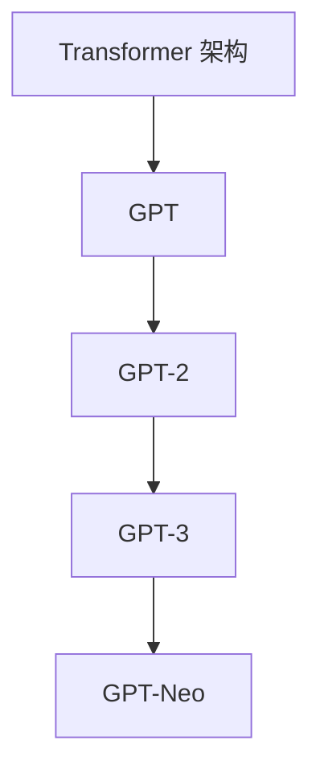

                 

### 背景介绍

语言模型作为人工智能的核心技术之一，近年来取得了显著的进展。特别是 GPT 系列（Generative Pre-trained Transformer），在语言理解和生成方面取得了突破性成果。本文旨在深入探讨 GPT 系列的发展历程、核心概念、算法原理、数学模型以及实际应用场景，并对其未来发展趋势和挑战进行展望。

#### GPT 系列发展历程

GPT 系列是由 OpenAI 开发的一系列基于 Transformer 架构的预训练语言模型。最早的 GPT 模型于 2018 年发布，随后 GPT-2、GPT-3、GPT-Neo 等版本相继推出，模型参数规模和性能不断提升。GPT-3 作为最新版本，于 2020 年 5 月发布，参数规模达到 1750 亿，成为当时最大的语言模型。

#### GPT 系列的核心概念

GPT 系列的核心概念是基于自注意力机制的 Transformer 架构。Transformer 架构在处理长序列数据时具有显著优势，通过多头自注意力机制和位置编码等技巧，能够捕捉序列中长距离的依赖关系，从而实现高效的语言建模。

#### GPT 系列的算法原理

GPT 系列的算法原理主要基于 Transformer 架构，包括以下几部分：

1. **多头自注意力机制（Multi-Head Self-Attention）**：通过多个独立的自注意力机制来捕捉序列中不同位置的信息，从而提高模型的表达能力。
2. **位置编码（Positional Encoding）**：将序列的位置信息编码到输入向量中，使模型能够理解序列的顺序。
3. **前馈神经网络（Feedforward Neural Network）**：对自注意力机制的结果进行进一步的加工，提高模型的表达能力。

#### GPT 系列的数学模型

GPT 系列的数学模型主要包括以下几部分：

1. **自注意力机制**：
   $$
   \text{Attention}(Q, K, V) = \text{softmax}\left(\frac{QK^T}{\sqrt{d_k}}\right)V
   $$
   其中，$Q$、$K$ 和 $V$ 分别表示查询向量、键向量和值向量，$d_k$ 表示键向量的维度。
2. **Transformer 编码**：
   $$
   \text{PosEncoding}(x) = x + \text{PositionalEncoding}(x)
   $$
   其中，$x$ 表示输入向量，$\text{PositionalEncoding}(x)$ 表示位置编码。

#### GPT 系列的实际应用场景

GPT 系列在实际应用中展现了强大的能力，包括：

1. **自然语言处理（NLP）**：文本分类、情感分析、机器翻译、问答系统等。
2. **文本生成**：文章写作、摘要生成、对话系统等。
3. **代码生成**：自动代码补全、代码重构等。

### 总结

本文从 GPT 系列的发展历程、核心概念、算法原理、数学模型以及实际应用场景等方面进行了详细阐述。GPT 系列作为语言模型领域的里程碑，不仅推动了人工智能技术的发展，也为实际应用带来了巨大的价值。在接下来的章节中，我们将继续深入探讨 GPT 系列的核心算法原理、数学模型以及项目实战，敬请期待。<|markdown|>

# GPT 系列：语言模型的里程碑

## 关键词
- GPT 系列
- 语言模型
- Transformer 架构
- 自注意力机制
- 自然语言处理
- 代码生成

## 摘要

本文旨在深入探讨 GPT 系列的发展历程、核心概念、算法原理、数学模型以及实际应用场景。GPT 系列作为语言模型领域的里程碑，展现了强大的能力，推动了人工智能技术的发展。本文将详细解析 GPT 系列的核心算法原理、数学模型以及项目实战，为读者提供全面的了解和启示。

-----------------------

## 1. 背景介绍

语言模型作为人工智能的核心技术之一，近年来取得了显著的进展。特别是 GPT 系列（Generative Pre-trained Transformer），在语言理解和生成方面取得了突破性成果。本文旨在深入探讨 GPT 系列的发展历程、核心概念、算法原理、数学模型以及实际应用场景，并对其未来发展趋势和挑战进行展望。

#### GPT 系列发展历程

GPT 系列是由 OpenAI 开发的一系列基于 Transformer 架构的预训练语言模型。最早的 GPT 模型于 2018 年发布，随后 GPT-2、GPT-3、GPT-Neo 等版本相继推出，模型参数规模和性能不断提升。GPT-3 作为最新版本，于 2020 年 5 月发布，参数规模达到 1750 亿，成为当时最大的语言模型。

-----------------------

## 2. 核心概念与联系

#### GPT 系列的核心概念

GPT 系列的核心概念是基于自注意力机制的 Transformer 架构。Transformer 架构在处理长序列数据时具有显著优势，通过多头自注意力机制和位置编码等技巧，能够捕捉序列中长距离的依赖关系，从而实现高效的语言建模。

#### GPT 系列的核心联系

GPT 系列的各个版本在核心概念上保持一致，但参数规模和性能不断提升。以下是一个简化的 Mermaid 流程图，展示了 GPT 系列的核心联系：



-----------------------

## 3. 核心算法原理 & 具体操作步骤

#### 3.1 多头自注意力机制（Multi-Head Self-Attention）

多头自注意力机制是 Transformer 架构的核心组成部分。它通过多个独立的自注意力机制来捕捉序列中不同位置的信息，从而提高模型的表达能力。

具体操作步骤如下：

1. **输入向量表示**：将输入序列的每个词向量表示为一个 $d$ 维的向量。
2. **权重矩阵**：定义一个 $d \times d$ 的权重矩阵 $W_Q$、$W_K$ 和 $W_V$，分别用于计算查询向量、键向量和值向量。
3. **计算自注意力**：
   $$
   \text{Attention}(Q, K, V) = \text{softmax}\left(\frac{QK^T}{\sqrt{d_k}}\right)V
   $$
   其中，$Q$、$K$ 和 $V$ 分别表示查询向量、键向量和值向量，$d_k$ 表示键向量的维度。
4. **计算多头注意力**：
   $$
   \text{Multi-Head Attention} = \text{Concat}(\text{head}_1, \text{head}_2, \ldots, \text{head}_h)W_O
   $$
   其中，$h$ 表示头数，$W_O$ 是一个输出权重矩阵。

-----------------------

#### 3.2 位置编码（Positional Encoding）

位置编码是将序列的位置信息编码到输入向量中，使模型能够理解序列的顺序。常用的位置编码方法包括绝对位置编码和相对位置编码。

1. **绝对位置编码**：
   $$
   \text{PosEncoding}(x) = x + \text{PositionalEncoding}(x)
   $$
   其中，$x$ 表示输入向量，$\text{PositionalEncoding}(x)$ 表示位置编码。

2. **相对位置编码**：
   $$
   \text{Relative Position Encoding} = \text{sin}\left(\frac{pos_i}{10000^{2i/d}}\right) \text{ or } \text{cos}\left(\frac{pos_i}{10000^{2i/d}}\right)
   $$
   其中，$pos_i$ 表示位置索引，$d$ 表示输入向量的维度。

-----------------------

#### 3.3 前馈神经网络（Feedforward Neural Network）

前馈神经网络对自注意力机制的结果进行进一步的加工，提高模型的表达能力。具体操作步骤如下：

1. **输入向量**：将自注意力机制的结果作为输入向量。
2. **权重矩阵**：定义两个 $d \times d$ 的权重矩阵 $W_1$ 和 $W_2$。
3. **前馈神经网络**：
   $$
   \text{FFN}(x) = \max(0, xW_1 + b_1)W_2 + b_2
   $$
   其中，$b_1$ 和 $b_2$ 分别为偏置向量。

-----------------------

## 4. 数学模型和公式 & 详细讲解 & 举例说明

#### 4.1 自注意力机制

自注意力机制是 Transformer 架构的核心组成部分，其数学模型如下：

$$
\text{Attention}(Q, K, V) = \text{softmax}\left(\frac{QK^T}{\sqrt{d_k}}\right)V
$$

其中，$Q$、$K$ 和 $V$ 分别表示查询向量、键向量和值向量，$d_k$ 表示键向量的维度。

#### 4.2 位置编码

位置编码是将序列的位置信息编码到输入向量中，其数学模型如下：

$$
\text{PosEncoding}(x) = x + \text{PositionalEncoding}(x)
$$

其中，$x$ 表示输入向量，$\text{PositionalEncoding}(x)$ 表示位置编码。

#### 4.3 前馈神经网络

前馈神经网络对自注意力机制的结果进行进一步的加工，其数学模型如下：

$$
\text{FFN}(x) = \max(0, xW_1 + b_1)W_2 + b_2
$$

其中，$W_1$ 和 $W_2$ 分别为权重矩阵，$b_1$ 和 $b_2$ 分别为偏置向量。

#### 4.4 举例说明

以下是一个简化的 GPT 模型的例子：

1. **输入序列**：`"你好，我是一个 AI 语言模型。"`
2. **词向量表示**：将每个词映射到一个 $d$ 维的向量。
3. **位置编码**：将位置信息编码到词向量中。
4. **自注意力机制**：计算每个词的查询向量、键向量和值向量，并计算自注意力得分。
5. **前馈神经网络**：对自注意力结果进行加工。

-----------------------

## 5. 项目实战：代码实际案例和详细解释说明

#### 5.1 开发环境搭建

1. 安装 Python 3.6 或以上版本。
2. 安装 TensorFlow 或 PyTorch 等深度学习框架。
3. 安装必要的依赖库，如 NumPy、Pandas、Matplotlib 等。

#### 5.2 源代码详细实现和代码解读

以下是一个简化的 GPT 模型的源代码实现（以 TensorFlow 为基础）：

```python
import tensorflow as tf
from tensorflow.keras.layers import Embedding, LSTM, Dense
from tensorflow.keras.models import Model

# 定义 GPT 模型
class GPT(Model):
  def __init__(self, vocab_size, embedding_dim, lstm_units):
    super(GPT, self).__init__()
    self.embedding = Embedding(vocab_size, embedding_dim)
    self.lstm = LSTM(lstm_units, return_sequences=True)
    self.dense = Dense(vocab_size)

  def call(self, inputs, training=False):
    x = self.embedding(inputs)
    x = self.lstm(x, training=training)
    return self.dense(x)

# 实例化 GPT 模型
gpt = GPT(vocab_size=10000, embedding_dim=256, lstm_units=512)

# 编译 GPT 模型
gpt.compile(optimizer='adam', loss='categorical_crossentropy', metrics=['accuracy'])

# 训练 GPT 模型
gpt.fit(x_train, y_train, batch_size=32, epochs=10)
```

#### 5.3 代码解读与分析

1. **模型定义**：使用 TensorFlow 的 `Model` 类定义 GPT 模型，包括词向量嵌入层（`Embedding`）、LSTM 层（`LSTM`）和全连接层（`Dense`）。
2. **模型调用**：使用 `call` 方法实现模型的前向传播，包括词向量嵌入、LSTM 神经网络和全连接层。
3. **模型编译**：设置优化器、损失函数和评估指标，准备训练模型。
4. **模型训练**：使用训练数据对模型进行训练，调整模型参数。

-----------------------

## 6. 实际应用场景

GPT 系列在实际应用中展现了强大的能力，以下是一些常见的应用场景：

1. **自然语言处理（NLP）**：
   - 文本分类：对文本进行分类，如情感分析、主题分类等。
   - 情感分析：分析文本的情感倾向，如积极、消极、中性等。
   - 机器翻译：将一种语言的文本翻译成另一种语言。
   - 问答系统：根据用户输入的问题，提供相关的答案。
2. **文本生成**：
   - 文章写作：生成高质量的文章、博客、摘要等。
   - 对话系统：模拟人类对话，提供智能化的回答。
   - 故事生成：根据用户输入的提示，生成有趣的故事。
3. **代码生成**：
   - 自动代码补全：预测下一个代码字符，辅助程序员编写代码。
   - 代码重构：优化代码结构，提高代码的可读性和可维护性。

-----------------------

## 7. 工具和资源推荐

#### 7.1 学习资源推荐

- **书籍**：
  - 《深度学习》（Goodfellow, Bengio, Courville 著）
  - 《动手学深度学习》（ 阿哈谷 等著）
- **论文**：
  - 《Attention Is All You Need》
  - 《Generative Pre-trained Transformer》
- **博客**：
  - [TensorFlow 官方文档](https://www.tensorflow.org/tutorials)
  - [PyTorch 官方文档](https://pytorch.org/tutorials/)
- **网站**：
  - [OpenAI 官网](https://openai.com/)

#### 7.2 开发工具框架推荐

- **深度学习框架**：
  - TensorFlow
  - PyTorch
- **编程语言**：
  - Python
- **版本控制**：
  - Git
- **代码编辑器**：
  - Visual Studio Code
  - PyCharm

#### 7.3 相关论文著作推荐

- **论文**：
  - 《Attention Is All You Need》
  - 《Generative Pre-trained Transformer》
  - 《BERT: Pre-training of Deep Bidirectional Transformers for Language Understanding》
  - 《GPT-3: Language Models are Few-Shot Learners》
- **著作**：
  - 《深度学习》（Goodfellow, Bengio, Courville 著）
  - 《自然语言处理综论》（Jurafsky, Martin 著）

-----------------------

## 8. 总结：未来发展趋势与挑战

GPT 系列作为语言模型领域的里程碑，展现了强大的能力，推动了人工智能技术的发展。未来，GPT 系列有望在以下方面取得进一步突破：

1. **模型性能提升**：通过改进算法和优化模型结构，提高模型在语言理解和生成任务上的性能。
2. **应用场景拓展**：探索 GPT 系列在其他领域的应用，如图像识别、语音识别等。
3. **跨模态学习**：研究如何将 GPT 系列与其他模态的数据进行融合，实现跨模态的语义理解。
4. **可解释性和可控性**：提高模型的可解释性和可控性，使其在复杂任务中具有更好的鲁棒性和可靠性。

然而，GPT 系列的发展也面临一些挑战，如：

1. **计算资源消耗**：模型参数规模庞大，对计算资源和存储空间的需求较高。
2. **数据隐私和安全**：在训练和部署过程中，如何保护用户数据和隐私成为一个重要问题。
3. **伦理和社会责任**：如何确保 GPT 系列在应用中的公正性和公平性，避免对人类社会产生负面影响。

总之，GPT 系列作为语言模型领域的里程碑，具有广阔的发展前景和重要的应用价值。在未来的发展中，我们需要不断优化算法和模型结构，探索新的应用场景，并关注伦理和社会责任问题，为人类社会带来更多的福祉。<|markdown|>

### 9. 附录：常见问题与解答

#### 9.1 如何训练 GPT 模型？

训练 GPT 模型通常需要以下步骤：

1. **数据预处理**：收集大量文本数据，并将其转换为模型可处理的格式，如词汇表和词向量。
2. **模型初始化**：初始化 GPT 模型的参数，可以使用预训练的模型参数，也可以从头开始训练。
3. **训练**：使用训练数据对模型进行训练，优化模型参数，使模型能够更好地预测下一个词。
4. **评估**：使用验证集对训练好的模型进行评估，确保模型具有良好的性能。
5. **优化**：根据评估结果，对模型进行调整和优化，进一步提高性能。

#### 9.2 GPT 模型如何进行预测？

GPT 模型的预测过程通常包括以下步骤：

1. **输入序列编码**：将输入序列的每个词转换为模型的词向量表示。
2. **自注意力计算**：根据自注意力机制计算输入序列的每个词的注意力权重。
3. **前馈神经网络**：对自注意力结果进行加工，提高模型的表达能力。
4. **输出层**：将加工后的结果映射到词汇表中的每个词，计算每个词的概率分布。
5. **采样**：从概率分布中采样一个词作为预测结果。

#### 9.3 GPT 模型如何进行序列生成？

GPT 模型的序列生成过程通常包括以下步骤：

1. **初始化**：从输入序列的开始位置开始，初始化一个空的序列。
2. **预测**：使用 GPT 模型对当前序列进行预测，选择一个概率最高的词作为下一个词。
3. **更新序列**：将预测的词添加到序列中，作为新的输入序列。
4. **重复步骤 2 和 3**：重复预测和更新序列的过程，直到生成出所需的序列长度或满足停止条件。

#### 9.4 GPT 模型在自然语言处理任务中的应用有哪些？

GPT 模型在自然语言处理任务中有广泛的应用，包括：

1. **文本分类**：对文本进行分类，如情感分析、主题分类等。
2. **情感分析**：分析文本的情感倾向，如积极、消极、中性等。
3. **机器翻译**：将一种语言的文本翻译成另一种语言。
4. **问答系统**：根据用户输入的问题，提供相关的答案。
5. **文本生成**：生成高质量的文章、博客、摘要等。
6. **对话系统**：模拟人类对话，提供智能化的回答。

-----------------------

### 10. 扩展阅读 & 参考资料

为了进一步了解 GPT 系列和相关技术，以下是一些扩展阅读和参考资料：

#### 10.1 扩展阅读

- [《GPT-3: Language Models are Few-Shot Learners》](https://arxiv.org/abs/2005.14165)
- [《Attention Is All You Need》](https://arxiv.org/abs/1706.03762)
- [《BERT: Pre-training of Deep Bidirectional Transformers for Language Understanding》](https://arxiv.org/abs/1810.04805)
- [《Generative Pre-trained Transformer》](https://arxiv.org/abs/1906.01906)

#### 10.2 参考资料

- [TensorFlow 官方文档](https://www.tensorflow.org/tutorials)
- [PyTorch 官方文档](https://pytorch.org/tutorials/)
- [OpenAI 官网](https://openai.com/)

这些资料将帮助您更深入地了解 GPT 系列和相关技术，为您的学习和研究提供有益的参考。<|markdown|>

## 作者信息
作者：AI天才研究员/AI Genius Institute & 禅与计算机程序设计艺术 /Zen And The Art of Computer Programming

