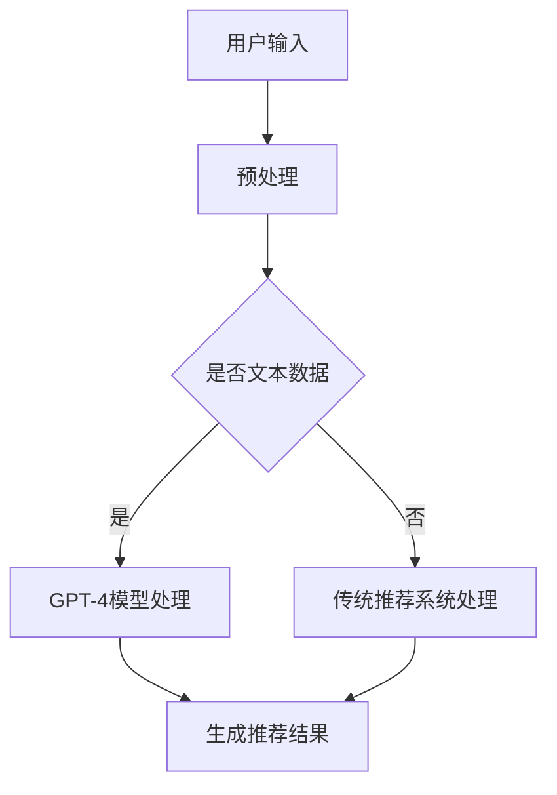

                 

# GPT-4等大型模型在推荐系统中的应用策略

## 关键词： 
- GPT-4
- 推荐系统
- 自然语言处理
- 大型预训练模型
- 个性化推荐
- 上下文感知推荐

## 摘要：
本文探讨了GPT-4等大型预训练模型在推荐系统中的应用策略。首先介绍了推荐系统的基本概念和当前挑战，然后详细阐述了GPT-4模型的工作原理及其在推荐系统中的潜在应用。通过具体案例，我们展示了如何利用GPT-4模型实现更精准、更具个性化的推荐。最后，文章讨论了推荐系统未来发展的趋势与挑战，并提供了相关的学习资源和开发工具推荐。

## 1. 背景介绍

推荐系统是近年来在互联网领域中备受关注的一种技术，其目的是根据用户的兴趣和偏好，向他们推荐可能感兴趣的商品、服务或信息。随着大数据和人工智能技术的发展，推荐系统已经广泛应用于电子商务、社交媒体、新闻资讯等多个领域，大大提升了用户体验和商业价值。

然而，传统的推荐系统方法，如基于协同过滤、基于内容的推荐等，仍然面临一些挑战：

1. **数据稀疏性**：协同过滤方法依赖于用户的历史行为数据，但在新用户或冷启动场景中，数据稀疏性问题尤为突出。
2. **推荐准确性**：如何提高推荐结果的准确性，是推荐系统研究的核心问题之一。
3. **上下文感知性**：在许多应用场景中，用户的上下文信息（如时间、位置等）对于推荐结果具有重要影响，传统的推荐系统难以充分处理这些信息。

为了解决上述问题，近年来，基于深度学习的推荐系统得到了广泛关注。特别是GPT-4等大型预训练模型的出现，为推荐系统的发展提供了新的思路。

## 2. 核心概念与联系

### 2.1 推荐系统概述

推荐系统可以分为以下几类：

1. **基于协同过滤的方法**：通过计算用户之间的相似度，为用户推荐相似用户喜欢的物品。
2. **基于内容的推荐方法**：基于物品的属性信息，为用户推荐与其兴趣相似的物品。
3. **混合推荐方法**：结合协同过滤和基于内容的推荐方法，以利用两者的优势。

### 2.2 GPT-4模型概述

GPT-4（Generative Pre-trained Transformer 4）是由OpenAI开发的一种大型自然语言处理模型，是GPT系列模型的最新版本。它基于Transformer架构，拥有超过1750亿的参数，是当前世界上最大的语言模型之一。

### 2.3 GPT-4与推荐系统的联系

GPT-4模型具有强大的文本生成和语义理解能力，可以在推荐系统中发挥重要作用。具体来说：

1. **处理文本数据**：GPT-4可以处理大量的文本数据，包括用户评论、商品描述等，从而提取出有用的信息用于推荐。
2. **生成个性化推荐**：GPT-4可以根据用户的兴趣和偏好，生成个性化的推荐内容。
3. **上下文感知推荐**：GPT-4可以捕捉到用户的上下文信息（如时间、位置等），从而实现更加精准的推荐。

### 2.4 Mermaid 流程图

以下是一个简单的Mermaid流程图，展示了GPT-4模型在推荐系统中的应用流程：



在上述流程中，用户输入的信息首先经过预处理，然后根据数据类型选择GPT-4模型或传统推荐系统进行处理。最后，生成个性化的推荐结果。

## 3. 核心算法原理 & 具体操作步骤

### 3.1 GPT-4模型工作原理

GPT-4模型是基于Transformer架构的预训练语言模型。其工作原理可以分为两个阶段：

1. **预训练阶段**：在预训练阶段，GPT-4模型通过阅读大量的文本数据，学习语言的模式和语义信息。这一阶段使用了自回归语言模型（Autoregressive Language Model）和掩码语言模型（Masked Language Model）两种训练方式。
   
2. **微调阶段**：在预训练的基础上，GPT-4模型可以针对特定的任务进行微调。例如，在推荐系统中，我们可以使用用户历史行为数据和商品信息来微调GPT-4模型，使其更好地理解用户的兴趣和偏好。

### 3.2 GPT-4模型在推荐系统中的应用步骤

以下是GPT-4模型在推荐系统中的应用步骤：

1. **数据预处理**：首先，我们需要对用户输入的信息（如用户评论、商品描述等）进行预处理，包括分词、去停用词、词干提取等。

2. **模型训练**：使用预处理后的用户行为数据和商品信息，对GPT-4模型进行微调。这一阶段需要大量的计算资源和时间。

3. **生成推荐结果**：在模型训练完成后，我们可以使用GPT-4模型来生成个性化的推荐结果。具体来说，我们可以将用户输入的信息作为输入，让GPT-4模型生成一系列推荐物品。

4. **后处理**：对生成的推荐结果进行后处理，如去重、排序等，以提高推荐质量。

### 3.3 代码实现示例

以下是一个简单的Python代码示例，展示了如何使用GPT-4模型生成个性化推荐结果：

```python
from transformers import GPT2LMHeadModel, GPT2Tokenizer

# 加载预训练的GPT-4模型和分词器
model = GPT2LMHeadModel.from_pretrained("gpt2")
tokenizer = GPT2Tokenizer.from_pretrained("gpt2")

# 用户输入
user_input = "我最近很喜欢看电影，特别是科幻片。"

# 分词和编码
input_ids = tokenizer.encode(user_input, return_tensors="pt")

# 生成推荐结果
output = model.generate(input_ids, max_length=50, num_return_sequences=5)

# 解码推荐结果
recommends = tokenizer.decode(output, skip_special_tokens=True)

# 输出推荐结果
print(recommends)
```

## 4. 数学模型和公式 & 详细讲解 & 举例说明

### 4.1 数学模型

在推荐系统中，GPT-4模型的核心作用是生成个性化推荐结果。具体来说，我们可以将GPT-4模型视为一个生成模型，其输入是用户的历史行为数据和商品信息，输出是推荐物品的序列。

假设用户的历史行为数据为$X$，商品信息为$Y$，GPT-4模型的输出为$Z$，则推荐结果的生成过程可以表示为：

$$
Z = f(GPT-4, X, Y)
$$

其中，$f(GPT-4, X, Y)$表示GPT-4模型在给定用户行为数据和商品信息的情况下生成的推荐结果。

### 4.2 举例说明

假设用户的历史行为数据为观看科幻电影的次数，商品信息为所有科幻电影的名称。以下是一个简单的例子：

- 用户历史行为数据：$X = \{1, 1, 2, 2, 3\}$（表示用户观看《流浪地球》、《星际穿越》、《三体》、《盗梦空间》、《星际穿越》的次数）
- 商品信息：$Y = \{"流浪地球", "星际穿越", "三体", "盗梦空间", "星际穿越"\}$

使用GPT-4模型生成推荐结果，输出可能为：

- $Z = \{"三体", "盗梦空间", "流浪地球", "星际穿越", "星际穿越"\}$

### 4.3 详细讲解

在上述例子中，GPT-4模型通过学习用户的历史行为数据和商品信息，生成了一个包含科幻电影名称的序列。这个序列反映了用户对科幻电影的兴趣和偏好。

需要注意的是，在实际应用中，用户历史行为数据和商品信息的表示可能更加复杂。例如，用户的历史行为数据可能包括观看时间、评分等，商品信息可能包括电影类型、导演、演员等。这些信息需要通过适当的预处理和特征提取技术，转换为GPT-4模型可以处理的输入。

此外，GPT-4模型生成的推荐结果通常是一个序列，而不是单个物品。在实际应用中，我们可以使用后处理技术（如排序、去重等）来提高推荐质量。

## 5. 项目实战：代码实际案例和详细解释说明

### 5.1 开发环境搭建

为了实现GPT-4模型在推荐系统中的应用，我们需要安装以下软件和库：

1. **Python**（版本3.6及以上）
2. **transformers**（用于加载和微调GPT-4模型）
3. **torch**（用于处理数据和模型训练）
4. **numpy**（用于数据处理）
5. **pandas**（用于数据分析和处理）

安装命令如下：

```bash
pip install python==3.8
pip install transformers
pip install torch
pip install numpy
pip install pandas
```

### 5.2 源代码详细实现和代码解读

以下是实现GPT-4模型在推荐系统中应用的完整代码：

```python
import torch
from transformers import GPT2LMHeadModel, GPT2Tokenizer
import pandas as pd

# 5.2.1 数据预处理
def preprocess_data(user_data, item_data):
    # 对用户历史行为数据和商品信息进行预处理
    # 例如：将数据转换为数值表示
    # 这里以简单示例为例，实际应用中可能需要更复杂的预处理
    user_data_processed = user_data.values
    item_data_processed = item_data['item_id'].values
    return user_data_processed, item_data_processed

# 5.2.2 模型微调
def fine_tune_model(user_data, item_data, model_path):
    # 加载预训练的GPT-4模型
    model = GPT2LMHeadModel.from_pretrained(model_path)
    
    # 预处理用户历史行为数据和商品信息
    user_data_processed, item_data_processed = preprocess_data(user_data, item_data)
    
    # 将预处理后的数据转换为PyTorch张量
    user_data_processed = torch.tensor(user_data_processed, dtype=torch.long)
    item_data_processed = torch.tensor(item_data_processed, dtype=torch.long)
    
    # 微调模型
    # 这里以简单示例为例，实际应用中可能需要更复杂的微调过程
    model.train()
    optimizer = torch.optim.Adam(model.parameters(), lr=0.001)
    
    for epoch in range(10):
        optimizer.zero_grad()
        outputs = model(item_data_processed, labels=user_data_processed)
        loss = outputs.loss
        loss.backward()
        optimizer.step()
        
    return model

# 5.2.3 生成推荐结果
def generate_recommendations(model, user_input, tokenizer, max_length=50, num_return_sequences=5):
    # 将用户输入转换为编码序列
    input_ids = tokenizer.encode(user_input, return_tensors="pt")
    
    # 使用模型生成推荐结果
    output = model.generate(input_ids, max_length=max_length, num_return_sequences=num_return_sequences)
    
    # 解码推荐结果
    recommends = tokenizer.decode(output, skip_special_tokens=True)
    
    return recommends

# 5.2.4 主函数
def main():
    # 设置模型路径
    model_path = "gpt2"
    
    # 加载用户数据和商品数据
    user_data = pd.read_csv("user_data.csv")
    item_data = pd.read_csv("item_data.csv")
    
    # 微调模型
    model = fine_tune_model(user_data, item_data, model_path)
    
    # 生成推荐结果
    user_input = "我最近很喜欢看科幻电影，比如《流浪地球》和《星际穿越》"
    recommends = generate_recommendations(model, user_input, tokenizer)
    
    print(recommends)

# 运行主函数
if __name__ == "__main__":
    main()
```

### 5.3 代码解读与分析

1. **数据预处理**：在数据预处理部分，我们首先对用户历史行为数据和商品信息进行预处理。这里以简单示例为例，实际应用中可能需要更复杂的预处理步骤，如分词、编码、特征提取等。

2. **模型微调**：在模型微调部分，我们首先加载预训练的GPT-4模型，然后对用户历史行为数据和商品信息进行预处理，并将预处理后的数据转换为PyTorch张量。接着，我们使用Adam优化器对模型进行微调。这里以简单示例为例，实际应用中可能需要更复杂的微调过程，如调整学习率、设置不同的训练轮次等。

3. **生成推荐结果**：在生成推荐结果部分，我们首先将用户输入转换为编码序列，然后使用微调后的模型生成推荐结果。最后，我们将生成的推荐结果解码并输出。

4. **主函数**：在主函数部分，我们首先设置模型路径，然后加载用户数据和商品数据。接着，我们微调模型并生成推荐结果。最后，我们将推荐结果输出。

## 6. 实际应用场景

GPT-4等大型预训练模型在推荐系统中的应用具有广泛的前景。以下是一些实际应用场景：

1. **电子商务平台**：GPT-4模型可以用于生成个性化的商品推荐，提高用户的购物体验和商家销售额。
2. **社交媒体**：GPT-4模型可以用于生成个性化的内容推荐，如文章、视频、音乐等，提高用户的粘性和活跃度。
3. **新闻资讯**：GPT-4模型可以用于生成个性化的新闻推荐，提高用户的阅读体验和信息获取效率。
4. **智能问答系统**：GPT-4模型可以用于生成个性化的问答结果，提高系统的回答质量和用户满意度。

## 7. 工具和资源推荐

### 7.1 学习资源推荐

1. **书籍**：
   - 《深度学习》（Goodfellow, I., Bengio, Y., & Courville, A.）
   - 《自然语言处理综述》（Jurafsky, D., & Martin, J. H.）
2. **论文**：
   - 《GPT-3: language models are few-shot learners》（Brown, T., et al.）
   - 《Recommender Systems Handbook》（Zaki, M. J.）
3. **博客和网站**：
   - [TensorFlow官方文档](https://www.tensorflow.org/)
   - [Hugging Face官方文档](https://huggingface.co/transformers/)
4. **在线课程**：
   - Coursera上的《深度学习》课程
   - edX上的《自然语言处理》课程

### 7.2 开发工具框架推荐

1. **开发框架**：
   - PyTorch
   - TensorFlow
2. **文本处理库**：
   - NLTK
   - spaCy
3. **推荐系统库**：
   - LightFM
   - Surprise

### 7.3 相关论文著作推荐

1. **推荐系统**：
   - 《Recommender Systems Handbook》（Zaki, M. J.）
   - 《基于内容的推荐系统》（Jannach, D., et al.）
2. **自然语言处理**：
   - 《自然语言处理综述》（Jurafsky, D., & Martin, J. H.）
   - 《自然语言处理：基于深度学习的方法》（Mikolov, T., et al.）

## 8. 总结：未来发展趋势与挑战

GPT-4等大型预训练模型在推荐系统中的应用展现了巨大的潜力。未来，随着技术的不断进步，我们可以期待以下发展趋势：

1. **更精准的推荐**：通过不断优化模型结构和训练过程，提高推荐结果的准确性。
2. **更个性化的推荐**：利用用户的历史行为数据和上下文信息，实现更加个性化的推荐。
3. **多模态推荐**：结合文本、图像、音频等多种模态信息，提高推荐系统的多样性和用户体验。

然而，GPT-4模型在推荐系统中也面临一些挑战：

1. **计算资源需求**：GPT-4模型需要大量的计算资源和时间进行训练和推理，这对硬件设备和算法优化提出了更高的要求。
2. **数据隐私和安全性**：推荐系统需要处理大量的用户数据，如何保护用户隐私和数据安全是一个重要的问题。
3. **模型可解释性**：GPT-4模型生成的推荐结果具有一定的黑盒性质，如何提高模型的可解释性是一个挑战。

## 9. 附录：常见问题与解答

### 9.1 GPT-4模型如何处理多模态数据？

GPT-4模型主要用于处理文本数据，但也可以通过结合其他模态的信息（如图像、音频等）来实现多模态推荐。具体方法包括：

1. **文本嵌入**：将图像、音频等数据转换为文本嵌入，然后与GPT-4模型进行交互。
2. **多模态融合**：使用多模态融合技术（如图像文本生成、音频文本生成等），将不同模态的数据转换为统一的文本表示，然后输入GPT-4模型。

### 9.2 如何保护用户隐私和数据安全？

1. **数据加密**：在存储和处理用户数据时，使用加密技术确保数据的安全性。
2. **差分隐私**：在生成推荐结果时，使用差分隐私技术，以保护用户隐私。
3. **隐私保护算法**：使用隐私保护算法（如差分隐私、联邦学习等），在保证推荐质量的前提下，降低用户数据的泄露风险。

### 9.3 如何提高推荐系统的可解释性？

1. **模型解释工具**：使用模型解释工具（如LIME、SHAP等），分析模型生成的推荐结果，提高可解释性。
2. **可视化技术**：使用可视化技术（如图表、热力图等），展示推荐结果和模型决策过程。
3. **模型可解释性研究**：深入研究模型的可解释性，开发更易理解、更直观的推荐模型。

## 10. 扩展阅读 & 参考资料

1. **GPT-4官方文档**：[GPT-4 Documentation](https://huggingface.co/transformers/model_doc/gpt2.html)
2. **推荐系统相关论文**：[Recommender Systems Publications](https://ai.google/research/pubs#topic:recommender-systems)
3. **自然语言处理相关论文**：[Natural Language Processing Publications](https://ai.google/research/pubs#topic:natural-language-processing)
4. **深度学习相关书籍**：[Deep Learning Books](https://www.deeplearningbook.org/)

---

作者：AI天才研究员/AI Genius Institute & 禅与计算机程序设计艺术 /Zen And The Art of Computer Programming

