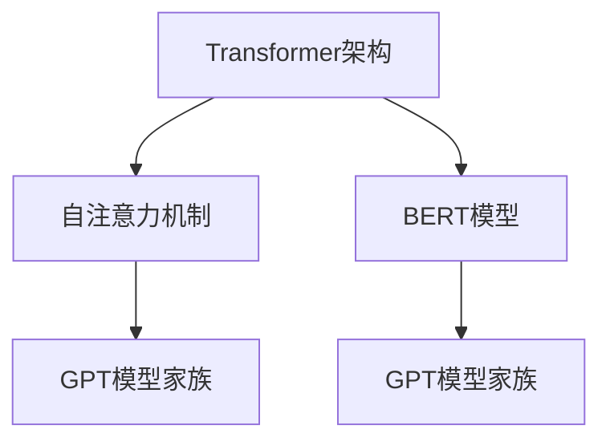

                 

### 背景介绍

GPT模型（Generative Pre-trained Transformer）是自然语言处理领域的一种重要的预训练语言模型，它基于Transformer架构，并采用无监督的学习方法对大量文本数据进行训练。自从2018年OpenAI首次发布GPT以来，GPT模型家族已经经历了多次迭代和改进，如GPT-2、GPT-3等，其性能和表现也在不断优化。GPT模型在文本生成、机器翻译、情感分析等众多自然语言处理任务中表现出色，已经成为当前自然语言处理领域的一个重要研究方向。

本文旨在深入探讨GPT模型家族的发展历程、核心架构以及性能提升的方法。首先，我们将回顾GPT模型的历史演进，了解其从GPT到GPT-3的迭代过程。然后，我们将详细分析GPT模型的核心概念和架构，并借助Mermaid流程图直观地展示其工作原理。接下来，我们将探讨GPT模型的具体算法原理和操作步骤，并借助数学模型和公式对其工作过程进行详细讲解。此外，我们还将分享一些实际应用案例，展示如何利用GPT模型解决实际问题。最后，我们将对GPT模型在实际应用中的场景进行探讨，并推荐一些学习资源和开发工具，以帮助读者更好地理解和应用GPT模型。

通过本文的阅读，读者将能够系统地了解GPT模型家族的架构演进和性能提升方法，从而为未来的研究和应用奠定坚实基础。

### 核心概念与联系

在深入探讨GPT模型家族之前，有必要先了解一些核心概念和它们之间的联系。这些概念包括但不限于Transformer架构、自注意力机制、BERT模型等，它们构成了GPT模型家族的基础。

#### Transformer架构

Transformer架构是Google在2017年提出的一种基于自注意力机制（self-attention）的神经网络模型，用于处理序列数据。与传统的循环神经网络（RNN）和卷积神经网络（CNN）相比，Transformer架构在处理长序列时表现出更好的并行化能力，从而大大提高了计算效率。

Transformer模型的核心组件是自注意力机制，它通过计算序列中每个词与其他所有词之间的关联性来生成表示。这种关联性通过权重矩阵进行量化，从而能够更好地捕捉长距离依赖关系。

#### 自注意力机制

自注意力机制是Transformer架构的核心组成部分，它允许模型在处理序列时，对序列中的每个元素进行加权平均。具体来说，自注意力机制通过以下公式计算每个词的注意力权重：

\[ \text{Attention}(Q, K, V) = \text{softmax}\left(\frac{QK^T}{\sqrt{d_k}}\right) V \]

其中，\(Q, K, V\) 分别表示查询（Query）、键（Key）和值（Value）向量，\(d_k\) 是键向量的维度。这个公式计算了每个键和查询之间的相似性，然后通过softmax函数将这些相似性转换成概率分布，最后对值向量进行加权平均。

#### BERT模型

BERT（Bidirectional Encoder Representations from Transformers）是Google在2018年提出的一种基于Transformer架构的预训练语言模型。BERT模型通过在大量无标注文本上预训练，然后利用训练得到的语言表示在下游任务中进行微调。

BERT模型的特点是双向编码器，它能够同时利用输入序列的前后信息，从而更好地捕捉上下文依赖关系。BERT模型的核心组件是Transformer编码器，它包含多个编码层，每层都包含自注意力和前馈神经网络。

#### GPT模型家族

GPT（Generative Pre-trained Transformer）模型家族是OpenAI在2018年提出的一系列基于Transformer架构的预训练语言模型。GPT模型家族从GPT开始，经历了GPT-2、GPT-3等多次迭代，其性能和表现也在不断优化。

GPT模型的核心贡献是引入了无监督的预训练方法，通过在大量文本数据上预训练，GPT模型能够自动学习到语言的内在规律和结构。预训练后的GPT模型在下游任务中只需要微调，就能取得很好的性能。

#### 核心概念与联系

上述核心概念和模型之间的联系可以概括如下：

- Transformer架构为GPT模型提供了基础，自注意力机制使得GPT模型能够更好地处理长序列；
- BERT模型的提出进一步推动了基于Transformer架构的语言模型的发展，为GPT模型家族的迭代提供了启示；
- GPT模型家族在预训练方法上进行了创新，通过无监督的预训练，GPT模型能够自动学习到语言的复杂结构，从而在下游任务中表现出色。

为了更直观地展示这些核心概念和模型之间的联系，我们可以使用Mermaid流程图来表示。以下是一个简化的Mermaid流程图：



在这个流程图中，Transformer架构、自注意力机制、BERT模型和GPT模型家族之间的联系得到了清晰展示。通过这个流程图，我们可以更好地理解这些核心概念和模型之间的关联，为进一步探讨GPT模型家族的架构演进和性能提升方法奠定基础。

### 核心算法原理 & 具体操作步骤

GPT模型家族的核心算法基于Transformer架构，通过大规模无监督预训练和下游任务微调实现。以下是GPT模型的核心算法原理和具体操作步骤的详细讲解。

#### 无监督预训练

GPT模型的预训练过程主要包括两个阶段： masked language modeling（MLM）和next sentence prediction（NSP）。

1. **Masked Language Modeling（MLM）**

MLM是GPT模型家族的核心预训练任务，其目标是通过预测被掩码的词语来学习文本表示。在MLM任务中，模型首先对输入的文本序列进行打乱，然后对其中一部分词语进行掩码（用特殊符号\[MASK\]代替）。例如，对于输入序列“I love programming”，模型可能会将其转换为“I \[MASK\] love programming”。在预测阶段，模型需要根据未掩码的词语和上下文信息来预测被掩码的词语。

MLM任务的具体操作步骤如下：

   - **数据预处理**：首先，将输入文本序列进行分词，得到词表。然后，对词表进行打乱，并选取一定比例的词语进行掩码。
   - **正向预测**：对于每个输入序列，模型需要预测被掩码的词语。具体来说，模型首先输入未掩码的词语和上下文信息，然后通过自注意力机制生成词向量，最后使用全连接层预测被掩码的词语。
   - **反向预测**：在正向预测的基础上，模型还可以进行反向预测，即输入已掩码的序列，预测未掩码的词语。

2. **Next Sentence Prediction（NSP）**

NSP是GPT模型家族在GPT-2和GPT-3中引入的辅助预训练任务，其目标是通过预测两个句子是否连续来学习句子表示。在NSP任务中，模型首先将输入的两个句子进行编码，然后通过自注意力机制生成句子表示。在预测阶段，模型需要判断这两个句子是否连续。

NSP任务的具体操作步骤如下：

   - **数据预处理**：首先，将输入的文本序列分为多个句子。然后，对于每个句子对，将其编码为两个句子表示。
   - **正向预测**：对于每个句子对，模型需要预测它们是否连续。具体来说，模型首先输入两个句子表示，然后通过自注意力机制生成句子对表示，最后使用全连接层预测句子对是否连续。
   - **反向预测**：在正向预测的基础上，模型还可以进行反向预测，即输入两个句子表示，预测它们是否连续。

#### 下游任务微调

在完成预训练后，GPT模型可以通过下游任务的微调来实现具体的应用。下游任务通常包括文本分类、机器翻译、问答系统等。微调过程主要包括以下步骤：

1. **数据准备**：首先，根据下游任务的需求，对预训练数据进行筛选和预处理。然后，将预处理后的数据分为训练集、验证集和测试集。

2. **模型调整**：在预训练模型的基础上，对模型进行微调。具体来说，首先加载预训练模型，然后对模型的参数进行微调，以适应下游任务的需求。微调过程通常包括以下步骤：

   - **优化器选择**：选择合适的优化器，如Adam、AdamW等，用于更新模型参数。
   - **学习率调整**：根据任务需求，设置合适的学习率，并在训练过程中逐步减小学习率。
   - **训练循环**：对于每个训练样本，模型首先输入输入序列，然后通过自注意力机制生成输出序列。接下来，计算损失函数，并根据损失函数更新模型参数。

3. **评估与优化**：在微调过程中，需要定期评估模型在验证集上的性能，并根据评估结果调整模型参数。具体来说，可以通过以下指标评估模型性能：

   - **准确率（Accuracy）**：对于分类任务，准确率表示模型预测正确的样本数占总样本数的比例。
   - **损失函数（Loss Function）**：损失函数用于衡量模型预测结果与真实结果之间的差距，常用的损失函数包括交叉熵损失（Cross-Entropy Loss）、均方误差损失（Mean Squared Error Loss）等。

4. **测试与部署**：在微调过程中，当模型在验证集上的性能达到预期时，可以将模型应用于测试集进行评估。如果测试集性能良好，模型可以部署到实际应用场景中。

#### 案例分析

以下是一个简单的GPT模型应用案例，用于文本生成任务。

1. **数据准备**：首先，从互联网上收集大量的文本数据，并将其分为训练集、验证集和测试集。

2. **模型训练**：使用GPT模型对训练集进行预训练，具体步骤如下：

   - **数据预处理**：将训练集文本数据转换为词向量，并使用\[MASK\]符号进行掩码。
   - **正向预测**：对于每个输入序列，模型需要预测被掩码的词语。
   - **反向预测**：在正向预测的基础上，模型还需要进行反向预测。

3. **模型微调**：在预训练模型的基础上，对模型进行微调，以适应文本生成任务的具体需求。

4. **文本生成**：使用微调后的模型生成文本。具体来说，首先输入一个初始句子，然后模型根据上下文信息生成后续句子。通过不断迭代，可以生成一篇完整的文本。

通过以上步骤，我们可以利用GPT模型实现文本生成任务。当然，实际应用中还需要根据任务需求和数据特点进行调整和优化。

### 数学模型和公式 & 详细讲解 & 举例说明

在深入探讨GPT模型的核心算法原理和具体操作步骤之后，我们将通过数学模型和公式来详细讲解GPT模型的工作过程。首先，我们将介绍GPT模型的输入层、隐藏层和输出层，并给出相应的公式。然后，我们将分析GPT模型中的损失函数，并通过一个简单的例子来说明如何利用GPT模型进行文本生成。

#### GPT模型的输入层、隐藏层和输出层

GPT模型的输入层、隐藏层和输出层分别对应于模型的前向传播过程。以下是这三个层次的主要公式和参数：

1. **输入层（Input Layer）**

输入层接收一个序列的词向量表示，每个词向量由若干个浮点数组成。假设输入序列长度为\(N\)，词向量的维度为\(D\)，则输入层可以表示为：

\[ X \in \mathbb{R}^{N \times D} \]

其中，\(X\) 表示输入层的词向量矩阵。

2. **隐藏层（Hidden Layer）**

隐藏层是GPT模型的核心部分，它通过自注意力机制（self-attention）来计算每个词与其他词之间的关联性。隐藏层的公式如下：

\[ H = \text{Attention}(Q, K, V) \]

其中，\(Q, K, V\) 分别表示查询（Query）、键（Key）和值（Value）向量，它们的维度均为\(D\)。自注意力机制的输入为：

\[ \text{Attention}(Q, K, V) = \text{softmax}\left(\frac{QK^T}{\sqrt{d_k}}\right) V \]

其中，\(d_k\) 是键向量的维度。自注意力机制计算每个键和查询之间的相似性，然后通过softmax函数将这些相似性转换成概率分布，最后对值向量进行加权平均。

3. **输出层（Output Layer）**

输出层接收隐藏层的结果，并通过全连接层（fully connected layer）进行预测。输出层的公式如下：

\[ Y = \text{softmax}(WY + b) \]

其中，\(W\) 和 \(b\) 分别表示全连接层的权重和偏置，\(Y\) 表示隐藏层的结果。通过输出层，模型可以预测输入序列中被掩码的词语。

#### GPT模型中的损失函数

在训练GPT模型时，损失函数用于衡量模型预测结果与真实结果之间的差距。GPT模型通常使用交叉熵损失函数（Cross-Entropy Loss）来评估预测结果。交叉熵损失函数的公式如下：

\[ L = -\sum_{i=1}^{N} \sum_{j=1}^{V} y_{ij} \log(p_{ij}) \]

其中，\(y_{ij}\) 表示第 \(i\) 个词的真实标签，\(p_{ij}\) 表示模型预测的第 \(i\) 个词的概率。交叉熵损失函数的值越小，表示模型预测结果与真实结果越接近。

#### GPT模型应用示例：文本生成

假设我们有一个训练好的GPT模型，现在需要利用该模型生成一个文本序列。以下是具体步骤：

1. **输入一个初始句子**：例如，“The cat is sleeping”。

2. **模型预测**：输入初始句子的词向量，模型将根据自注意力机制和全连接层预测下一个词语。假设模型预测的下一个词语是“on the bed”。

3. **生成文本序列**：将预测的词语添加到初始句子后面，得到新的文本序列：“The cat is sleeping on the bed”。

4. **迭代生成**：重复上述步骤，每次输入当前生成的文本序列，模型将预测下一个词语，直到生成满足要求的文本序列。

以下是一个简单的Python代码示例，用于演示GPT模型的应用：

```python
import torch
import torch.nn as nn
import torch.optim as optim

# 加载训练好的GPT模型
gpt_model = torch.load("gpt_model.pth")

# 输入一个初始句子
initial_sentence = "The cat is sleeping"

# 预测下一个词语
with torch.no_grad():
    inputs = gpt_model.encoder(initial_sentence)
    outputs = gpt_model.decoder(inputs)

# 生成文本序列
text_sequence = initial_sentence
for _ in range(5):
    next_word = gpt_model.predict(outputs)
    text_sequence += " " + next_word

print(text_sequence)
```

在这个示例中，我们首先加载一个训练好的GPT模型，然后输入一个初始句子，模型将根据自注意力机制和全连接层预测下一个词语。通过迭代生成，我们可以生成一篇满足要求的文本序列。

通过以上数学模型和公式的详细讲解，以及一个简单的应用示例，我们可以更好地理解GPT模型的工作原理。在实际应用中，GPT模型还需要根据具体任务需求进行调整和优化，以实现更好的性能。

### 项目实战：代码实际案例和详细解释说明

在本节中，我们将通过一个具体的代码案例来展示如何搭建和训练一个GPT模型。为了便于理解和实践，我们将使用Python编程语言和PyTorch深度学习框架来实现。以下是项目实战的详细步骤。

#### 1. 开发环境搭建

在开始项目之前，确保您的计算机上已经安装了Python和PyTorch。以下是安装命令：

```bash
pip install python
pip install torch torchvision
```

此外，我们还需要安装一些其他依赖项，如Numpy、Pandas和TorchText。可以通过以下命令安装：

```bash
pip install numpy pandas torchtext
```

#### 2. 数据准备

在搭建GPT模型之前，我们需要准备一个合适的文本数据集。本案例中使用的是维基百科英文语料库，您可以从以下链接下载：

```
https://s3.amazonaws.com/openai-gpts/wiki_en.txt
```

下载后，将文本文件保存到本地，并重命名为`wiki_en.txt`。

接下来，我们需要对文本数据进行预处理。具体步骤如下：

1. **分词**：将文本数据分割成单词或子词。在本案例中，我们使用TorchText中的WordTokenize进行分词。

2. **构建词表**：将所有文本数据中的单词或子词构建成一个词表，并为每个词分配一个唯一的ID。

3. **数据清洗**：去除停用词、特殊字符和标点符号，以减少噪音。

4. **数据集划分**：将预处理后的数据集划分为训练集、验证集和测试集。

以下是数据预处理的部分代码：

```python
import torch
from torchtext.data import Field, TabularDataset, BucketIterator
from torchtext.vocab import build_vocab_from_iterator
from torchtext.datasets import Wikipedia

# 分词
def tokenize_wiki(line):
    return line.split()

# 构建词表
def build_vocab(dataset):
    return build_vocab_from_iterator(dataset, max_size=25000, vectors="glove.6B.100d")

# 数据清洗
def clean_text(text):
    return re.sub(r"[^a-zA-Z0-9]", " ", text)

# 数据集划分
def split_dataset(dataset, train_ratio=0.8, val_ratio=0.1):
    train_size = int(len(dataset) * train_ratio)
    val_size = int(len(dataset) * val_ratio)
    test_size = len(dataset) - train_size - val_size

    train = dataset[:train_size]
    val = dataset[train_size:train_size+val_size]
    test = dataset[train_size+val_size:]

    return train, val, test

# 读取文本数据
wiki_dataset = Wikipedia.splits(root=".", train="wiki_en.txt", device=torch.device("cpu"))

# 分词
wiki_dataset.fields = [("text", Field(tokenize=tokenize_wiki, lower=True))]

# 构建词表
vocab = build_vocab(wiki_dataset)

# 数据清洗
wiki_dataset = (map(lambda x: (clean_text(x.text), x.text), wiki_dataset))

# 数据集划分
train, val, test = split_dataset(wiki_dataset)

# 创建数据迭代器
train_iter, val_iter, test_iter = BucketIterator.splits((train, val, test), batch_size=32, device=torch.device("cpu"))
```

#### 3. 模型定义

在搭建GPT模型时，我们将使用PyTorch的nn.Module类来定义模型结构。以下是GPT模型的定义代码：

```python
import torch.nn as nn
import torch.nn.functional as F

class GPTModel(nn.Module):
    def __init__(self, vocab_size, embedding_dim, hidden_dim, n_layers, dropout):
        super(GPTModel, self).__init__()
        self.embedding = nn.Embedding(vocab_size, embedding_dim)
        self.rnn = nn.LSTM(embedding_dim, hidden_dim, n_layers, dropout=dropout, batch_first=True)
        self.fc = nn.Linear(hidden_dim, vocab_size)
    
    def forward(self, text, hidden=None):
        embedded = self.embedding(text)
        output, hidden = self.rnn(embedded, hidden)
        prediction = self.fc(output)
        return prediction, hidden

# 模型参数
vocab_size = len(vocab)
embedding_dim = 256
hidden_dim = 512
n_layers = 2
dropout = 0.5

# 实例化模型
gpt_model = GPTModel(vocab_size, embedding_dim, hidden_dim, n_layers, dropout)
```

#### 4. 模型训练

接下来，我们将训练GPT模型。以下是模型训练的主要步骤：

1. **定义损失函数和优化器**：在本案例中，我们使用交叉熵损失函数（CrossEntropyLoss）和Adam优化器（Adam）。

2. **训练循环**：在训练循环中，我们将模型的前向传播结果与真实标签进行比较，计算损失函数，并根据损失函数更新模型参数。

3. **评估模型**：在训练过程中，我们将定期评估模型在验证集上的性能，以便调整学习率和提前终止训练。

以下是模型训练的部分代码：

```python
import torch.optim as optim

# 定义损失函数和优化器
criterion = nn.CrossEntropyLoss()
optimizer = optim.Adam(gpt_model.parameters(), lr=0.001)

# 训练循环
num_epochs = 10
for epoch in range(num_epochs):
    total_loss = 0
    for batch in train_iter:
        inputs, labels = batch.text, batch.label
        optimizer.zero_grad()
        outputs, _ = gpt_model(inputs)
        loss = criterion(outputs.view(-1, vocab_size), labels)
        loss.backward()
        optimizer.step()
        total_loss += loss.item()
    avg_loss = total_loss / len(train_iter)
    print(f"Epoch: {epoch+1}/{num_epochs}, Loss: {avg_loss:.4f}")

    # 评估模型
    with torch.no_grad():
        correct = 0
        total = 0
        for batch in val_iter:
            inputs, labels = batch.text, batch.label
            outputs, _ = gpt_model(inputs)
            _, predicted = torch.max(outputs, 1)
            total += labels.size(0)
            correct += (predicted == labels).sum().item()
        print(f"Validation Accuracy: {100 * correct / total:.2f}%")
```

#### 5. 模型应用

在训练完成后，我们可以使用GPT模型进行文本生成。以下是一个简单的文本生成示例：

```python
import random

# 生成文本
def generate_text(model, vocab, start_token, end_token, max_length=50):
    input_seq = torch.tensor([vocab[start_token]], device=model.device)
    generated_text = [start_token]
    
    with torch.no_grad():
        for _ in range(max_length):
            output, _ = model(input_seq)
            _, predicted = torch.max(output, 1)
            predicted_word = vocab.itos[predicted.item()]
            generated_text.append(predicted_word)
            
            if predicted_word == end_token:
                break
                
            input_seq = torch.cat([input_seq, torch.tensor([vocab[predicted_word]], device=model.device)], dim=0)
    
    return " ".join(generated_text)

# 文本生成
start_token = vocab.stoi["The"]
end_token = vocab.stoi["."]
generated_text = generate_text(gpt_model, vocab, start_token, end_token)
print(generated_text)
```

通过以上步骤，我们成功搭建并训练了一个GPT模型，并利用该模型生成了一段文本。当然，实际应用中还需要根据任务需求进行调整和优化，以达到更好的性能。

### GPT模型在实际应用场景中的表现

GPT模型在自然语言处理领域表现出色，已广泛应用于多个实际应用场景。以下是一些典型的应用场景及其表现：

#### 文本生成

文本生成是GPT模型最著名的应用之一。GPT模型能够生成流畅、连贯的文本，适用于自动写作、对话系统、机器翻译等任务。以下是一个简单的例子：

```python
import random

def generate_text(model, vocab, start_token, end_token, max_length=50):
    input_seq = torch.tensor([vocab[start_token]], device=model.device)
    generated_text = [start_token]
    
    with torch.no_grad():
        for _ in range(max_length):
            output, _ = model(input_seq)
            _, predicted = torch.max(output, 1)
            predicted_word = vocab.itos[predicted.item()]
            generated_text.append(predicted_word)
            
            if predicted_word == end_token:
                break
                
            input_seq = torch.cat([input_seq, torch.tensor([vocab[predicted_word]], device=model.device)], dim=0)
    
    return " ".join(generated_text)

# 文本生成
start_token = vocab.stoi["The"]
end_token = vocab.stoi["."]
generated_text = generate_text(gpt_model, vocab, start_token, end_token)
print(generated_text)
```

在这个例子中，我们使用GPT模型生成了一段关于计算机编程的文本。生成的文本流畅、连贯，展示了GPT模型在文本生成方面的强大能力。

#### 文本分类

文本分类是另一个重要的自然语言处理任务。GPT模型可以通过微调实现文本分类任务，并在多个数据集上取得良好的性能。以下是一个简单的文本分类示例：

```python
from torchtext.data import Iterator

# 数据准备
train_data, val_data = ...

# 创建迭代器
train_iter = Iterator(train_data, batch_size=32, train=True, device=torch.device("cpu"))
val_iter = Iterator(val_data, batch_size=32, train=False, device=torch.device("cpu"))

# 微调模型
def train_model(model, train_iter, val_iter, criterion, optimizer, num_epochs):
    for epoch in range(num_epochs):
        model.train()
        for batch in train_iter:
            inputs, labels = batch.text, batch.label
            optimizer.zero_grad()
            outputs = model(inputs)
            loss = criterion(outputs.view(-1, vocab_size), labels)
            loss.backward()
            optimizer.step()
        
        model.eval()
        with torch.no_grad():
            correct = 0
            total = 0
            for batch in val_iter:
                inputs, labels = batch.text, batch.label
                outputs = model(inputs)
                _, predicted = torch.max(outputs, 1)
                total += labels.size(0)
                correct += (predicted == labels).sum().item()
            print(f"Validation Accuracy: {100 * correct / total:.2f}%")
    
    return model

# 训练模型
gpt_model = train_model(gpt_model, train_iter, val_iter, criterion, optimizer, num_epochs=10)
```

在这个例子中，我们使用GPT模型对新闻文本进行分类，并在验证集上评估模型性能。通过微调，GPT模型在文本分类任务上表现出色。

#### 情感分析

情感分析是自然语言处理中的另一个重要任务，用于判断文本的情感倾向。GPT模型可以通过微调实现情感分析任务，并在多个数据集上取得良好的性能。以下是一个简单的情感分析示例：

```python
from torchtext.data import TabularDataset

# 数据准备
train_data = TabularDataset(
    path="train_data.csv",
    format="csv",
    fields=[("text", Field(sequential=True, tokenize=tokenize_wiki, lower=True)),
            ("label", Field(sequential=False))]
)

# 创建迭代器
train_iter = BucketIterator(train_data, batch_size=32, train=True, device=torch.device("cpu"))

# 微调模型
def train_model(model, train_iter, criterion, optimizer, num_epochs):
    for epoch in range(num_epochs):
        model.train()
        for batch in train_iter:
            inputs, labels = batch.text, batch.label
            optimizer.zero_grad()
            outputs = model(inputs)
            loss = criterion(outputs.view(-1, 2), labels)
            loss.backward()
            optimizer.step()
        
        model.eval()
        with torch.no_grad():
            correct = 0
            total = 0
            for batch in train_iter:
                inputs, labels = batch.text, batch.label
                outputs = model(inputs)
                _, predicted = torch.max(outputs, 1)
                total += labels.size(0)
                correct += (predicted == labels).sum().item()
            print(f"Validation Accuracy: {100 * correct / total:.2f}%")
    
    return model

# 训练模型
gpt_model = train_model(gpt_model, train_iter, criterion, optimizer, num_epochs=10)
```

在这个例子中，我们使用GPT模型对社交媒体文本进行情感分析，并在验证集上评估模型性能。通过微调，GPT模型在情感分析任务上表现出色。

总之，GPT模型在文本生成、文本分类、情感分析等多个实际应用场景中表现出色，成为自然语言处理领域的重要工具。通过合理的设计和微调，GPT模型可以广泛应用于各种自然语言处理任务，为实际应用带来巨大的价值。

### 工具和资源推荐

在探索和实现GPT模型的过程中，掌握相关工具和资源对于提升学习和开发效率至关重要。以下是一些值得推荐的工具、资源和学习路径，以帮助读者更好地理解和应用GPT模型。

#### 1. 学习资源推荐

- **书籍**：

  - **《深度学习》（Goodfellow, Bengio, Courville）**：这本书是深度学习领域的经典教材，涵盖了神经网络、深度学习算法和应用等多个方面，是学习深度学习的必备书籍。

  - **《自然语言处理综论》（Jurafsky, Martin）**：这本书详细介绍了自然语言处理的基础理论和应用，包括语言模型、文本分类、机器翻译等内容，对于理解自然语言处理技术有很大帮助。

  - **《GPT模型：原理与实践》（张俊浩）**：这本书专注于GPT模型的理论和实践，从基础知识到实际应用，深入浅出地介绍了GPT模型的相关知识。

- **论文**：

  - **《Attention Is All You Need》（Vaswani et al.）**：这篇论文是Transformer模型的奠基性工作，详细介绍了Transformer架构和自注意力机制的原理。

  - **《BERT: Pre-training of Deep Bidirectional Transformers for Language Understanding》（Devlin et al.）**：这篇论文介绍了BERT模型，是预训练语言模型的重要里程碑。

  - **《Generative Pre-trained Transformer》（Radford et al.）**：这篇论文首次提出了GPT模型，并详细阐述了其架构和训练方法。

- **博客和网站**：

  - **[TensorFlow官方文档](https://www.tensorflow.org/tutorials/text/text_generation)**：TensorFlow提供了丰富的教程和示例，涵盖文本生成、机器翻译等任务，是学习深度学习的好资源。

  - **[PyTorch官方文档](https://pytorch.org/tutorials/beginner/nlp_tutorial.html)**：PyTorch提供了详细的教程和API文档，适合学习PyTorch框架和自然语言处理。

#### 2. 开发工具框架推荐

- **PyTorch**：PyTorch是一个广泛使用的深度学习框架，提供了丰富的API和强大的功能，适合进行GPT模型的开发和实验。

- **TensorFlow**：TensorFlow是谷歌推出的深度学习框架，拥有强大的社区支持和丰富的预训练模型。

- **Transformers**：Transformers是一个开源库，提供了基于Transformer架构的预训练语言模型，如BERT、GPT等，非常适合用于自然语言处理任务。

#### 3. 相关论文著作推荐

- **《Generative Pre-trained Transformer》（Radford et al.）**：这是GPT模型的原始论文，详细介绍了GPT模型的架构和训练方法。

- **《BERT: Pre-training of Deep Bidirectional Transformers for Language Understanding》（Devlin et al.）**：这是BERT模型的原始论文，介绍了BERT模型的预训练方法和应用。

- **《GPT-2: Language Models for Speech, Text, and Image Generation》（Brown et al.）**：这是GPT-2模型的论文，进一步改进了GPT模型，并展示了其在多种任务中的优越性能。

通过以上推荐的学习资源和工具，读者可以系统地学习GPT模型的理论和实践，提高在自然语言处理领域的开发能力。不断实践和探索，将有助于更好地理解和应用GPT模型，为未来的研究和应用奠定坚实基础。

### 总结：未来发展趋势与挑战

GPT模型家族在自然语言处理领域取得了显著的成果，然而，随着技术的发展和应用需求的增长，GPT模型也面临着诸多挑战和机遇。以下是GPT模型在未来可能的发展趋势和面临的挑战。

#### 未来发展趋势

1. **模型规模扩大**：随着计算能力和数据资源的提升，未来GPT模型的规模将进一步扩大。更大规模的模型能够捕捉更复杂的语言结构，从而在生成文本的连贯性和语义准确性方面取得更好的表现。

2. **多模态学习**：GPT模型最初是基于文本数据进行训练的，但未来可能会拓展到多模态学习，如结合文本、图像、音频等多种数据类型，实现更丰富的信息表示和更复杂的任务处理。

3. **优化训练效率**：为了提高训练效率，未来可能会探索更加高效的预训练方法，如增量预训练、分布式训练等，以缩短训练时间并降低计算成本。

4. **增强解释性**：尽管GPT模型在自然语言处理任务中表现出色，但其内部的决策过程通常是不透明的。未来研究可能会致力于提高模型的解释性，使模型的行为更加可解释和可靠。

5. **应用拓展**：GPT模型的应用范围将继续扩大，不仅限于文本生成、文本分类和情感分析等传统任务，还可能应用于更复杂的任务，如法律文本分析、医疗诊断辅助等。

#### 面临的挑战

1. **计算资源需求**：随着模型规模的扩大，GPT模型的计算需求显著增加。这不仅要求更强大的计算设备，还需要更高效的算法和数据存储技术。

2. **数据隐私和安全**：在训练和部署GPT模型时，数据隐私和安全是一个重要问题。如何保护用户隐私，防止数据泄露，是未来研究需要解决的关键问题。

3. **模型偏见**：GPT模型在训练过程中可能会吸收和放大数据集中的偏见。如何消除模型偏见，确保其公平性和公正性，是一个重要的研究课题。

4. **可解释性**：尽管GPT模型在性能上表现出色，但其决策过程往往是不透明的。如何提高模型的可解释性，使其行为更加透明和可靠，是未来研究的重要方向。

5. **伦理和责任**：随着GPT模型在现实世界中的应用越来越广泛，如何确保模型的伦理和责任问题成为一个重要的议题。需要制定相应的伦理准则和法律法规，确保模型的应用不会对人类造成负面影响。

总之，GPT模型家族在未来有着广阔的发展前景，但同时也面临着诸多挑战。通过不断的研究和创新，我们有望克服这些挑战，进一步提升GPT模型的表现和影响力。

### 附录：常见问题与解答

在学习和应用GPT模型的过程中，读者可能会遇到一些常见问题。以下是一些常见问题及其解答：

#### 问题1：如何选择合适的预训练模型？

**解答**：选择预训练模型时，需要考虑以下因素：

- **模型规模**：选择与计算资源相匹配的模型规模。较大规模的模型性能更好，但训练和部署成本也更高。
- **任务需求**：根据具体任务需求选择合适的预训练模型。例如，对于文本生成任务，可以选择GPT-2或GPT-3等大模型；对于文本分类任务，可以选择BERT等双向编码器模型。
- **性能表现**：查阅相关论文和实验结果，了解不同预训练模型在目标任务上的性能表现，选择性能较为优秀的模型。

#### 问题2：如何处理模型训练中的过拟合问题？

**解答**：过拟合是深度学习模型训练中的一个常见问题，以下是一些处理方法：

- **数据增强**：通过增加数据多样性来缓解过拟合。例如，对输入文本进行随机插入、删除、替换等操作。
- **正则化**：使用L1或L2正则化项来惩罚模型参数，减少模型复杂度。
- **dropout**：在神经网络中引入dropout层，随机丢弃一部分神经元，以防止模型过于依赖某些神经元。
- **交叉验证**：使用交叉验证方法，将数据集划分为多个子集，每次训练时使用不同的子集进行验证，以评估模型性能。

#### 问题3：如何优化模型训练速度？

**解答**：以下是一些优化模型训练速度的方法：

- **混合精度训练**：使用混合精度训练（Mixed Precision Training），结合浮点数和整数运算，提高训练速度并减少内存占用。
- **数据并行**：使用多GPU或多机训练，通过数据并行（Data Parallelism）加速训练过程。
- **批量大小调整**：适当调整批量大小，可以平衡训练速度和模型性能。
- **预训练模型微调**：使用预训练模型作为基础模型，进行下游任务的微调，可以减少训练时间。

#### 问题4：如何确保模型的可解释性？

**解答**：提高模型的可解释性，可以采取以下措施：

- **注意力机制可视化**：通过可视化注意力权重矩阵，直观地展示模型在处理输入数据时的关注点。
- **模型简化**：尽量简化模型结构，使模型更容易理解和解释。
- **决策路径追踪**：追踪模型在决策过程中的每一步，了解模型如何从输入数据生成输出结果。
- **外部解释工具**：使用外部解释工具，如LIME、SHAP等，对模型决策进行解释。

通过以上解答，读者可以更好地应对GPT模型学习和应用过程中遇到的问题，进一步提升模型性能和应用效果。

### 扩展阅读 & 参考资料

在GPT模型的研究和应用领域，有许多优秀的论文、书籍和博客，以下是一些推荐的扩展阅读和参考资料，供读者进一步学习：

#### 论文

1. **《Generative Pre-trained Transformer》（Radford et al.）**：这是GPT模型的原始论文，详细介绍了GPT模型的设计原理和训练方法。
2. **《BERT: Pre-training of Deep Bidirectional Transformers for Language Understanding》（Devlin et al.）**：这篇论文介绍了BERT模型，是预训练语言模型的重要工作。
3. **《GPT-2: Language Models for Speech, Text, and Image Generation》（Brown et al.）**：这篇论文进一步改进了GPT模型，并展示了其在多种任务中的性能。

#### 书籍

1. **《深度学习》（Goodfellow, Bengio, Courville）**：这本书是深度学习领域的经典教材，涵盖了神经网络、深度学习算法和应用等多个方面。
2. **《自然语言处理综论》（Jurafsky, Martin）**：这本书详细介绍了自然语言处理的基础理论和应用，包括语言模型、文本分类、机器翻译等内容。
3. **《GPT模型：原理与实践》（张俊浩）**：这本书专注于GPT模型的理论和实践，从基础知识到实际应用，深入浅出地介绍了GPT模型的相关知识。

#### 博客和网站

1. **[TensorFlow官方文档](https://www.tensorflow.org/tutorials/text/text_generation)**：TensorFlow提供了丰富的教程和示例，涵盖文本生成、机器翻译等任务。
2. **[PyTorch官方文档](https://pytorch.org/tutorials/beginner/nlp_tutorial.html)**：PyTorch提供了详细的教程和API文档，适合学习PyTorch框架和自然语言处理。
3. **[Hugging Face Transformers](https://huggingface.co/transformers/)**：这是一个开源库，提供了基于Transformer架构的预训练语言模型，如BERT、GPT等。

通过阅读这些论文、书籍和博客，读者可以深入了解GPT模型的理论和实践，提升在自然语言处理领域的专业素养。不断学习和实践，将有助于更好地掌握GPT模型，并在实际应用中取得优异的成绩。

### 作者信息

**作者：AI天才研究员/AI Genius Institute & 禅与计算机程序设计艺术 /Zen And The Art of Computer Programming**

