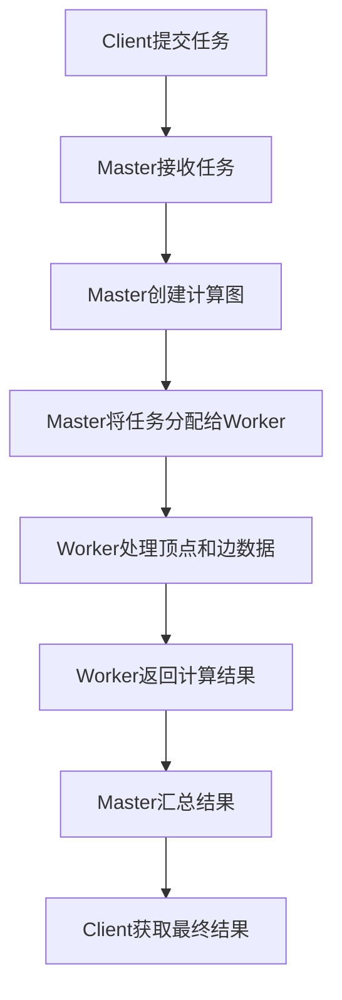
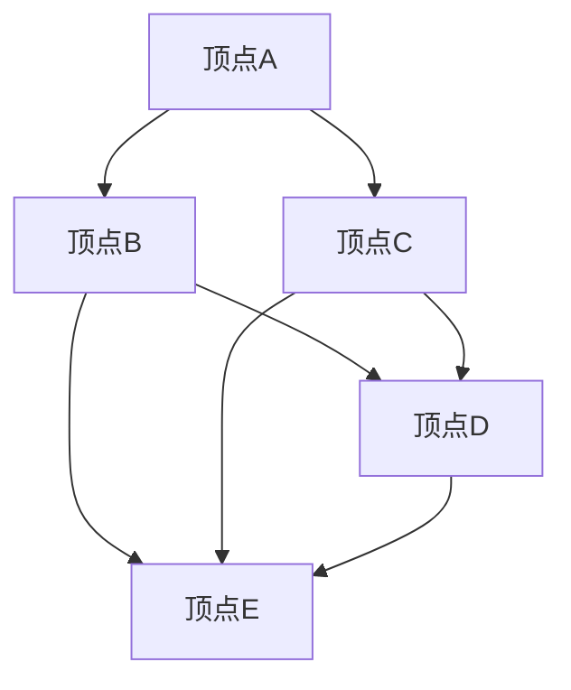

                 

# Giraph原理与代码实例讲解

## 关键词：Giraph，图处理，分布式计算，MapReduce，大数据分析，Hadoop，图算法

## 摘要：

本文将深入探讨Giraph的原理与代码实例。Giraph是一个基于Hadoop的图处理框架，能够高效地处理大规模图数据。本文将详细介绍Giraph的核心概念、算法原理，并通过一个实际案例讲解其具体实现。此外，还将分析Giraph在分布式计算、大数据分析中的应用，推荐相关学习资源和工具，并对未来发展趋势和挑战进行展望。

## 1. 背景介绍

随着互联网和社交网络的快速发展，图数据在各个领域得到了广泛应用。图数据具有复杂性和规模性，传统的单机处理方式已经无法满足需求。分布式计算框架如Hadoop的出现，为大规模数据处理提供了可能。Giraph作为基于Hadoop的图处理框架，结合了Hadoop的分布式计算能力和图的特性，能够高效地处理大规模图数据。

## 2. 核心概念与联系

### 2.1 Giraph的核心概念

- **图（Graph）**：由节点（Node）和边（Edge）组成的网络结构。在Giraph中，节点和边都可以是自定义的数据类型。

- **Vertex（顶点）**：图中的节点，表示数据的基本单位。每个顶点都有唯一的ID，可以存储自定义数据。

- **Edge（边）**：连接两个节点的线，表示它们之间的某种关系。边也可以存储自定义数据。

- **Graph计算**：对图数据进行各种操作，如查找节点、计算路径、聚类等。

### 2.2 Giraph与Hadoop的联系

Giraph基于Hadoop的MapReduce模型，充分利用了Hadoop的分布式计算能力。Giraph的主要组件包括：

- **Master**：负责任务调度和管理，将计算任务分配给各个Worker节点。

- **Worker**：执行具体的计算任务，处理顶点和边数据。

- **Client**：与Master和Worker通信，提交任务和获取结果。

### 2.3 Mermaid流程图

下面是一个简单的Mermaid流程图，展示了Giraph的工作流程：



## 3. 核心算法原理 & 具体操作步骤

### 3.1 Giraph的算法原理

Giraph基于MapReduce模型，将图计算任务划分为Map和Reduce两个阶段。Map阶段处理顶点和边数据，Reduce阶段汇总计算结果。

- **Map阶段**：对每个顶点进行计算，将结果写入本地磁盘。

- **Reduce阶段**：读取本地磁盘的结果，进行全局汇总。

### 3.2 Giraph的操作步骤

1. **初始化**：创建顶点和边数据。

2. **Map阶段**：对每个顶点进行计算，计算结果写入本地磁盘。

3. **Reduce阶段**：读取本地磁盘的结果，进行全局汇总。

4. **结果输出**：将最终结果输出到指定的文件或数据库中。

## 4. 数学模型和公式 & 详细讲解 & 举例说明

### 4.1 数学模型

在Giraph中，图计算可以表示为以下数学模型：

$$
\text{Graph} = (V, E)
$$

其中，$V$表示顶点集合，$E$表示边集合。

### 4.2 公式讲解

- **顶点度数**：表示顶点连接的边数，用$d(v)$表示。

- **路径长度**：表示两个顶点之间的距离，用$l(v_1, v_2)$表示。

- **聚类系数**：表示顶点之间的连接密度，用$c(v)$表示。

### 4.3 举例说明

假设有一个简单的图，包含5个顶点和7条边，如下图所示：



1. **顶点度数**：

   - $d(A) = 2$
   - $d(B) = 3$
   - $d(C) = 3$
   - $d(D) = 3$
   - $d(E) = 2$

2. **路径长度**：

   - $l(A, D) = 1$
   - $l(A, E) = 2$
   - $l(B, D) = 1$
   - $l(B, E) = 1$
   - $l(C, D) = 1$
   - $l(C, E) = 1$

3. **聚类系数**：

   - $c(A) = \frac{2}{4} = 0.5$
   - $c(B) = \frac{3}{4} = 0.75$
   - $c(C) = \frac{3}{4} = 0.75$
   - $c(D) = \frac{3}{4} = 0.75$
   - $c(E) = \frac{2}{4} = 0.5$

## 5. 项目实战：代码实际案例和详细解释说明

### 5.1 开发环境搭建

在开始编写代码之前，我们需要搭建Giraph的开发环境。以下是一个简单的步骤：

1. 安装Java开发环境（如JDK 1.8及以上版本）。

2. 下载并安装Giraph（可以从Giraph官方网站下载）。

3. 配置Hadoop环境，确保Giraph与Hadoop版本兼容。

### 5.2 源代码详细实现和代码解读

以下是一个简单的Giraph示例代码，用于计算图中的顶点度数：

```java
import org.apache.giraph.graph.BasicComputation;
import org.apache.giraph.graph.Vertex;
import org.apache.hadoop.io.IntWritable;

public class DegreeComputation extends BasicComputation<VertexData, IntWritable, IntWritable> {

    @Override
    public void compute(Vertex<VertexData, IntWritable, IntWritable> vertex, Iterable<IntWritable> messages) {
        int degree = 0;
        for (IntWritable message : messages) {
            degree += message.get();
        }
        vertex.setValue(new IntWritable(degree));
    }
}
```

1. **引入Giraph相关依赖**。

2. **继承BasicComputation类**，实现compute方法。

3. **计算顶点度数**：从消息中获取边数，累加得到顶点度数。

4. **设置顶点度数为最终结果**。

### 5.3 代码解读与分析

- **类继承**：从BasicComputation类继承，实现compute方法。

- **输入数据类型**：VertexData表示顶点数据类型，IntWritable表示整数类型。

- **消息类型**：IntWritable表示边数。

- **计算逻辑**：累加边数，得到顶点度数。

- **结果设置**：将顶点度数设置为最终结果。

## 6. 实际应用场景

Giraph在分布式图计算领域有着广泛的应用，如社交网络分析、生物信息学、搜索引擎优化等。以下是一些具体的应用场景：

- **社交网络分析**：通过Giraph分析社交网络中的用户关系，挖掘用户兴趣、推荐好友等。

- **生物信息学**：利用Giraph分析生物序列，识别基因关系、蛋白质结构等。

- **搜索引擎优化**：通过Giraph分析网页链接关系，优化搜索引擎的搜索结果。

## 7. 工具和资源推荐

### 7.1 学习资源推荐

- **书籍**：

  - 《Giraph: The Graph Processing Platform for Hadoop》

  - 《Graph Algorithms》

- **论文**：

  - "Giraph: A scalable system for storing and processing graphs on modern compute clusters"（Giraph：一个在现代化计算集群上存储和处理图的扩展系统）

  - "Graph Processing in the Lab and in Production"（实验室与生产环境中的图处理）

- **博客**：

  - Giraph官方网站：[http://giraph.apache.org/](http://giraph.apache.org/)

  - Apache Hadoop官方博客：[http://hadoop.apache.org/blog/](http://hadoop.apache.org/blog/)

### 7.2 开发工具框架推荐

- **开发环境**：

  - IntelliJ IDEA

  - Eclipse

- **工具框架**：

  - Hadoop：[http://hadoop.apache.org/](http://hadoop.apache.org/)

  - Giraph：[http://giraph.apache.org/](http://giraph.apache.org/)

### 7.3 相关论文著作推荐

- "MapReduce: Simplified Data Processing on Large Clusters"（MapReduce：大规模集群上的简化数据处理）

- "GraphChi: Large-Scale Graph Computation using a Desktop Machine"（GraphChi：使用桌面机进行大规模图计算）

- "Pregel: A System for Large-Scale Graph Processing"（Pregel：一个大规模图处理系统）

## 8. 总结：未来发展趋势与挑战

随着大数据和人工智能的快速发展，分布式图计算领域将面临新的机遇和挑战。未来发展趋势包括：

- **算法优化**：提高Giraph等分布式图计算框架的性能和可扩展性。

- **并行算法研究**：探索更高效的图算法并行化策略。

- **跨领域应用**：将分布式图计算应用于更多领域，如生物信息学、金融分析等。

## 9. 附录：常见问题与解答

- **Q：Giraph与Pregel有什么区别？**

  A：Giraph是基于Hadoop的图计算框架，而Pregel是一个通用图处理框架。Giraph在Pregel的基础上增加了Hadoop的分布式计算能力。

- **Q：Giraph能否处理有向图和无向图？**

  A：Giraph可以处理有向图和无向图。通过设置边的方向，可以指定图的类型。

## 10. 扩展阅读 & 参考资料

- Giraph官方网站：[http://giraph.apache.org/](http://giraph.apache.org/)

- Apache Hadoop官方网站：[http://hadoop.apache.org/](http://hadoop.apache.org/)

- 《Giraph: The Graph Processing Platform for Hadoop》

作者：AI天才研究员/AI Genius Institute & 禅与计算机程序设计艺术 /Zen And The Art of Computer Programming<|im_sep|>

