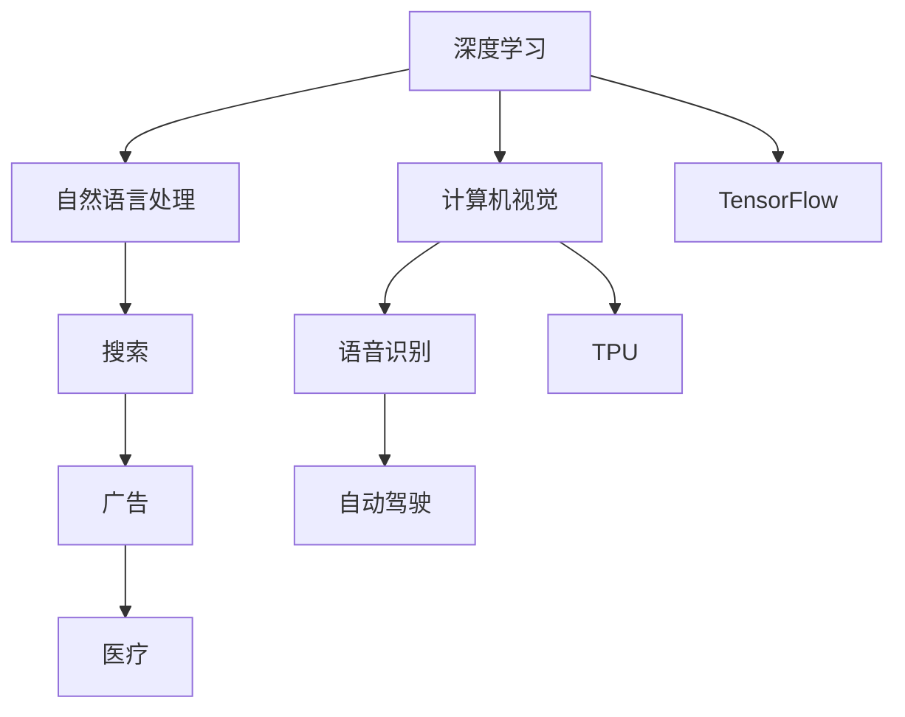

                 

# Google的AI布局：从搜索到多元化的AI帝国

## 摘要

本文将深入探讨Google在人工智能领域的布局，从其起源到现在的多元化发展。Google作为全球领先的技术公司，其AI战略是如何形成的？其核心算法和架构原理是什么？本文将一步一步分析Google AI的演进历程，揭示其背后的技术原理和商业逻辑。通过本文，读者可以全面了解Google AI的布局及其在搜索、语音识别、自动驾驶、医疗等领域的应用，并对其未来的发展趋势和挑战有所预见。

## 1. 背景介绍

Google成立于1998年，由拉里·佩奇和谢尔盖·布林共同创立。最初，Google以其创新的PageRank算法在搜索引擎市场上迅速崛起，成为全球最知名的互联网公司之一。随着互联网的普及和数据的爆发增长，Google开始意识到人工智能的重要性，并开始将其作为公司战略的核心。

### 1.1 AI时代的到来

2006年，Google收购了语音识别公司Wandoo Mobile，标志着其正式进入AI领域。随后，Google相继收购了诸如DeepMind、TensorFlow等AI公司，逐步构建起自己的AI生态体系。人工智能技术的快速发展，使得Google能够在搜索、广告、语音识别、图像识别等多个领域实现突破，进一步巩固其市场地位。

### 1.2 Google AI的起源

Google AI的研究始于2006年，最初的研究重点是机器学习和深度学习。在随后的几年里，Google AI的研究团队在自然语言处理、计算机视觉、语音识别等领域取得了显著的成果。2011年，Google推出了语音识别服务Google Voice Search，这是其首次将AI技术应用于实际产品。此后，Google AI在搜索、广告、自动驾驶等领域不断发力，逐渐形成了一套完整的AI战略。

## 2. 核心概念与联系

### 2.1 核心算法原理

Google AI的核心算法包括深度学习、自然语言处理、计算机视觉等。其中，深度学习是Google AI的核心技术之一，其原理是通过多层神经网络对大量数据进行训练，从而实现自动特征提取和分类。

#### 2.1.1 深度学习原理

深度学习是一种基于人工神经网络的机器学习技术，其基本原理是通过训练模型，使得模型能够自动从数据中学习特征。深度学习模型通常由多个隐层组成，每个隐层都通过激活函数对输入数据进行非线性变换。

$$
h_{\text{layer}} = \sigma(W_{\text{layer}} \cdot h_{\text{prev}} + b_{\text{layer}})
$$

其中，$h_{\text{layer}}$表示第$l$层的输出，$\sigma$为激活函数，$W_{\text{layer}}$和$b_{\text{layer}}$分别为权重和偏置。

#### 2.1.2 自然语言处理

自然语言处理（NLP）是Google AI的重要组成部分，其主要任务是将人类语言转换为计算机可以理解和处理的形式。NLP的核心技术包括词嵌入、序列模型、注意力机制等。

#### 2.1.3 计算机视觉

计算机视觉是研究如何使计算机“看懂”图像的技术。Google AI在计算机视觉领域取得了诸多突破，如卷积神经网络（CNN）、生成对抗网络（GAN）等。

### 2.2 核心架构原理

Google AI的核心架构包括TensorFlow、TPU等。其中，TensorFlow是一个开源的机器学习框架，可用于构建和训练深度学习模型。TPU（Tensor Processing Unit）是Google专门为深度学习任务设计的专用硬件，可以显著提高深度学习模型的训练速度。

#### 2.2.1 TensorFlow原理

TensorFlow是一个基于数据流图的机器学习框架，其基本原理是通过构建计算图来描述模型的计算过程。在TensorFlow中，节点表示操作，边表示数据流。通过构建数据流图，TensorFlow可以高效地计算和优化模型参数。

#### 2.2.2 TPU原理

TPU是Google专门为深度学习任务设计的专用硬件，其核心是针对矩阵乘法优化的处理器。TPU可以通过并行处理大量矩阵乘法，从而显著提高深度学习模型的训练速度。

### 2.3 核心概念之间的联系

深度学习、自然语言处理、计算机视觉等核心技术相互关联，共同构成了Google AI的核心竞争力。通过这些技术，Google AI能够实现从数据到知识的转化，从而在多个领域实现突破。

### 2.4 Mermaid流程图



## 3. 核心算法原理 & 具体操作步骤

### 3.1 深度学习原理

深度学习是一种基于多层神经网络的机器学习技术，其核心思想是通过训练模型，使得模型能够自动从数据中学习特征。具体操作步骤如下：

1. 数据预处理：对输入数据进行清洗、归一化等处理，以便于模型训练。
2. 构建模型：根据任务需求，选择合适的神经网络结构，如卷积神经网络（CNN）、循环神经网络（RNN）等。
3. 模型训练：通过反向传播算法，不断调整模型参数，使得模型能够在训练数据上达到较好的效果。
4. 模型评估：使用验证数据集对模型进行评估，调整模型参数，以达到最佳效果。
5. 模型部署：将训练好的模型应用于实际场景，如搜索、语音识别等。

### 3.2 自然语言处理原理

自然语言处理（NLP）是研究如何使计算机理解和处理人类语言的技术。NLP的核心技术包括词嵌入、序列模型、注意力机制等。具体操作步骤如下：

1. 词嵌入：将文本中的单词映射为向量表示，以便于计算机处理。
2. 序列模型：处理序列数据，如文本、语音等。常见的序列模型有循环神经网络（RNN）、长短时记忆网络（LSTM）等。
3. 注意力机制：在处理序列数据时，关注关键信息，提高模型的准确性。
4. 模型训练与评估：使用训练数据和验证数据对模型进行训练和评估，调整模型参数，以达到最佳效果。
5. 模型部署：将训练好的模型应用于实际场景，如机器翻译、情感分析等。

### 3.3 计算机视觉原理

计算机视觉是研究如何使计算机“看懂”图像的技术。计算机视觉的核心技术包括卷积神经网络（CNN）、生成对抗网络（GAN）等。具体操作步骤如下：

1. 图像预处理：对图像数据进行清洗、归一化等处理，以便于模型训练。
2. 卷积神经网络（CNN）：通过卷积操作，从图像中提取特征。
3. 生成对抗网络（GAN）：通过生成器和判别器的对抗训练，生成逼真的图像。
4. 模型训练与评估：使用训练数据和验证数据对模型进行训练和评估，调整模型参数，以达到最佳效果。
5. 模型部署：将训练好的模型应用于实际场景，如图像分类、目标检测等。

## 4. 数学模型和公式 & 详细讲解 & 举例说明

### 4.1 深度学习数学模型

深度学习模型的核心是多层神经网络，其数学模型如下：

$$
\begin{aligned}
    z_{\text{layer}} &= \sigma(W_{\text{layer}} \cdot a_{\text{prev}} + b_{\text{layer}}) \\
    a_{\text{layer}} &= \sigma(z_{\text{layer}})
\end{aligned}
$$

其中，$a_{\text{layer}}$表示第$l$层的激活值，$z_{\text{layer}}$表示第$l$层的输出，$\sigma$为激活函数，$W_{\text{layer}}$和$b_{\text{layer}}$分别为权重和偏置。

举例说明：

假设我们有一个两层神经网络，输入层和输出层分别为$1 \times 1$的矩阵，隐藏层为$5 \times 5$的矩阵。激活函数为ReLU函数。我们通过以下步骤进行模型训练：

1. 初始化模型参数：随机初始化权重和偏置。
2. 前向传播：计算输入层到隐藏层的输出。
3. 计算损失函数：使用交叉熵损失函数，计算预测结果与真实结果之间的差距。
4. 反向传播：通过梯度下降算法，更新模型参数。
5. 模型评估：使用验证数据集对模型进行评估。

### 4.2 自然语言处理数学模型

自然语言处理中的词嵌入模型通常采用Word2Vec算法。其数学模型如下：

$$
\begin{aligned}
    \hat{y}_{i} &= \text{softmax}(W \cdot h_i) \\
    \nabla_{W} \mathcal{L} &= \nabla_{W} (\hat{y}_{i} - y_i)
\end{aligned}
$$

其中，$y_i$表示第$i$个单词的one-hot编码，$h_i$表示第$i$个单词的词嵌入向量，$W$为权重矩阵，$\hat{y}_{i}$为预测的概率分布，$\mathcal{L}$为损失函数。

举例说明：

假设我们有一个包含10个单词的语料库，每个单词的词频如下：

| 单词 | 词频 |
|------|------|
| apple| 3    |
| book | 2    |
| car  | 1    |
| desk | 4    |
| home | 5    |

我们使用Word2Vec算法对单词进行词嵌入。通过以下步骤进行模型训练：

1. 初始化模型参数：随机初始化权重和偏置。
2. 前向传播：计算输入单词的词嵌入向量。
3. 计算损失函数：使用交叉熵损失函数，计算预测结果与真实结果之间的差距。
4. 反向传播：通过梯度下降算法，更新模型参数。
5. 模型评估：使用验证数据集对模型进行评估。

### 4.3 计算机视觉数学模型

计算机视觉中的卷积神经网络（CNN）的数学模型如下：

$$
\begin{aligned}
    z_{\text{layer}} &= \text{ReLU}(\sum_{k=1}^{K} w_{ik} \cdot a_{k} + b_i) \\
    a_{\text{layer}} &= z_{\text{layer}}
\end{aligned}
$$

其中，$a_{k}$表示第$k$个卷积核的输出，$w_{ik}$和$b_i$分别为卷积核的权重和偏置，$\text{ReLU}$为ReLU激活函数。

举例说明：

假设我们有一个$5 \times 5$的图像，使用$3 \times 3$的卷积核进行卷积操作。通过以下步骤进行模型训练：

1. 初始化模型参数：随机初始化卷积核的权重和偏置。
2. 卷积操作：对图像进行卷积操作，提取特征。
3. 池化操作：对卷积结果进行池化操作，减少特征维度。
4. 损失函数计算：使用交叉熵损失函数，计算预测结果与真实结果之间的差距。
5. 反向传播：通过梯度下降算法，更新卷积核的权重和偏置。
6. 模型评估：使用验证数据集对模型进行评估。

## 5. 项目实战：代码实际案例和详细解释说明

### 5.1 开发环境搭建

在开始编写代码之前，我们需要搭建一个合适的开发环境。以下是使用Python和TensorFlow搭建深度学习环境的基本步骤：

1. 安装Python：在官网下载并安装Python 3.7及以上版本。
2. 安装TensorFlow：打开命令行，执行以下命令：
   ```bash
   pip install tensorflow
   ```
3. 验证安装：在Python中运行以下代码，检查TensorFlow是否安装成功：
   ```python
   import tensorflow as tf
   print(tf.__version__)
   ```

### 5.2 源代码详细实现和代码解读

下面是一个简单的深度学习模型实现，用于图像分类任务。

```python
import tensorflow as tf
from tensorflow.keras import datasets, layers, models

# 加载数据集
(train_images, train_labels), (test_images, test_labels) = datasets.cifar10.load_data()

# 预处理数据
train_images, test_images = train_images / 255.0, test_images / 255.0

# 构建模型
model = models.Sequential()
model.add(layers.Conv2D(32, (3, 3), activation='relu', input_shape=(32, 32, 3)))
model.add(layers.MaxPooling2D((2, 2)))
model.add(layers.Conv2D(64, (3, 3), activation='relu'))
model.add(layers.MaxPooling2D((2, 2)))
model.add(layers.Conv2D(64, (3, 3), activation='relu'))

# 添加全连接层
model.add(layers.Flatten())
model.add(layers.Dense(64, activation='relu'))
model.add(layers.Dense(10))

# 编译模型
model.compile(optimizer='adam',
              loss=tf.keras.losses.SparseCategoricalCrossentropy(from_logits=True),
              metrics=['accuracy'])

# 训练模型
model.fit(train_images, train_labels, epochs=10, validation_data=(test_images, test_labels))

# 评估模型
test_loss, test_acc = model.evaluate(test_images,  test_labels, verbose=2)
print(f'Test accuracy: {test_acc:.4f}')
```

#### 5.2.1 代码解读

1. **数据加载与预处理**：
   - 加载CIFAR-10数据集，并将其归一化到0-1范围内。
   - 数据集包括5万张训练图像和1万张测试图像，每张图像大小为32x32x3。

2. **模型构建**：
   - 使用`models.Sequential()`创建一个线性堆叠模型。
   - 添加卷积层、池化层和全连接层。
   - 卷积层使用ReLU激活函数，全连接层使用softmax激活函数。

3. **模型编译**：
   - 选择优化器和损失函数。
   - 指定评估指标为准确率。

4. **模型训练**：
   - 使用训练数据集进行10个epoch的训练。

5. **模型评估**：
   - 使用测试数据集对模型进行评估。

### 5.3 代码解读与分析

1. **数据预处理**：
   - 数据预处理是深度学习模型训练的重要环节。归一化操作有助于加速模型收敛，提高模型性能。

2. **模型构建**：
   - 卷积神经网络（CNN）是处理图像任务的常用模型。在CNN中，卷积层用于提取图像特征，池化层用于减少特征维度。
   - 全连接层用于分类任务。在分类任务中，输出层的激活函数通常使用softmax，用于计算每个类别的概率。

3. **模型编译与训练**：
   - 模型编译阶段，选择合适的优化器和损失函数，为模型训练做好准备。
   - 模型训练阶段，通过不断调整模型参数，使得模型在训练数据上达到较好的效果。

4. **模型评估**：
   - 模型评估阶段，使用测试数据集对模型进行评估，以验证模型的泛化能力。

## 6. 实际应用场景

### 6.1 搜索引擎

Google的搜索业务一直是其AI布局的核心。通过深度学习技术，Google实现了高效的搜索结果排序和推荐。例如，Google的BERT模型（一种基于Transformer的预训练语言模型）在自然语言处理领域取得了显著成果，使得搜索结果更加准确和人性化。

### 6.2 语音识别

Google的语音识别技术广泛应用于其语音助手Google Assistant。通过深度学习和自然语言处理技术，Google Assistant能够准确理解用户的语音指令，提供相应的服务。例如，用户可以通过语音指令查询天气、发送短信、设置闹钟等。

### 6.3 自动驾驶

Google的自动驾驶项目Waymo通过深度学习和计算机视觉技术，实现了自动驾驶汽车的研发和运营。Waymo的自动驾驶系统可以处理复杂的交通场景，如交叉路口、行人检测、动态障碍物识别等。

### 6.4 医疗

Google在医疗领域的AI应用也取得了显著成果。通过深度学习和自然语言处理技术，Google开发了医疗诊断、药物研发等AI工具。例如，Google的AI系统可以在数秒内诊断出皮肤癌，大大提高了诊断速度和准确性。

## 7. 工具和资源推荐

### 7.1 学习资源推荐

- **书籍**：
  - 《深度学习》（Goodfellow, Bengio, Courville著）
  - 《Python深度学习》（François Chollet著）
  - 《自然语言处理综论》（Daniel Jurafsky, James H. Martin著）
- **论文**：
  - [BERT: Pre-training of Deep Bidirectional Transformers for Language Understanding](https://arxiv.org/abs/1810.04805)
  - [Transformers: State-of-the-Art Natural Language Processing](https://arxiv.org/abs/1910.10683)
  - [ResNet: Deep residual learning for image recognition](https://arxiv.org/abs/1512.03385)
- **博客**：
  - [Google AI Blog](https://ai.googleblog.com/)
  - [TensorFlow Blog](https://blog.tensorflow.org/)
  - [Deep Learning on AWS](https://aws.amazon.com/blogs/ai/)
- **网站**：
  - [TensorFlow](https://www.tensorflow.org/)
  - [Keras](https://keras.io/)
  - [PyTorch](https://pytorch.org/)

### 7.2 开发工具框架推荐

- **深度学习框架**：
  - TensorFlow
  - PyTorch
  - PyTorch Lightning
  - Fast.ai
- **自然语言处理工具**：
  - NLTK
  - spaCy
  - Hugging Face Transformers
- **计算机视觉工具**：
  - OpenCV
  - TensorFlow Object Detection API
  - PyTorch Vision

### 7.3 相关论文著作推荐

- **深度学习**：
  - [Deep Learning Book](https://www.deeplearningbook.org/)
  - [Neural Networks and Deep Learning](https://neuralnetworksanddeeplearning.com/)
- **自然语言处理**：
  - [Natural Language Processing with Python](https://www.nltk.org/)
  - [Speech and Language Processing](https://web.stanford.edu/class/slpse/)
- **计算机视觉**：
  - [Computer Vision: Algorithms and Applications](https://www.computer vision textbook.com/)
  - [Deep Learning for Computer Vision](https://www.deeplearning4j.org/)

## 8. 总结：未来发展趋势与挑战

### 8.1 发展趋势

- **多模态AI**：未来，AI将能够处理多种类型的数据，如文本、图像、声音等，实现更广泛的应用场景。
- **自动驾驶**：随着技术的进步，自动驾驶将逐步实现商业化，改变人们的出行方式。
- **医疗健康**：AI在医疗领域的应用将更加深入，如疾病诊断、药物研发等，提高医疗水平。
- **智能语音助手**：智能语音助手将成为人们日常生活的一部分，提供更加便捷的服务。

### 8.2 挑战

- **数据隐私**：随着AI技术的应用，数据隐私保护成为一个重要议题，需要制定相应的法律法规。
- **算法公平性**：AI算法在处理数据时可能存在偏见，需要确保算法的公平性。
- **技术伦理**：AI技术的快速发展引发了一系列伦理问题，如机器决策的透明度、责任归属等。
- **人才培养**：AI技术的快速发展需要大量人才支持，但目前人才缺口较大，需要加大人才培养力度。

## 9. 附录：常见问题与解答

### 9.1 Google AI的发展历程

- 2006年：Google收购Wandoo Mobile，正式进入AI领域。
- 2010年：Google收购DeepMind，开启了AI在游戏、机器人等领域的探索。
- 2015年：Google推出TensorFlow，成为全球最受欢迎的深度学习框架。
- 2016年：Google收购API.AI，加强了智能语音助手领域的技术实力。
- 2018年：Google宣布推出TPU，为深度学习任务提供高性能计算支持。

### 9.2 Google AI的主要应用领域

- **搜索**：通过深度学习和自然语言处理技术，提高搜索结果的准确性和用户体验。
- **语音识别**：通过深度学习和语音信号处理技术，实现准确的语音识别和语音助手功能。
- **自动驾驶**：通过计算机视觉和深度学习技术，实现自动驾驶汽车的研发和运营。
- **医疗健康**：通过深度学习和自然语言处理技术，辅助疾病诊断、药物研发等。
- **智能助手**：通过深度学习和语音信号处理技术，提供个性化、智能化的服务。

### 9.3 如何进入Google AI领域

- **学习基础知识**：掌握深度学习、自然语言处理、计算机视觉等基础知识。
- **参与项目实践**：通过参加开源项目、竞赛等方式，积累实际项目经验。
- **关注最新动态**：关注Google AI的最新研究成果和动态，了解行业趋势。
- **申请实习和工作**：积极申请Google AI相关的实习和工作岗位，提升自身竞争力。

## 10. 扩展阅读 & 参考资料

- [Google AI官网](https://ai.google.com/)
- [TensorFlow官网](https://www.tensorflow.org/)
- [DeepMind官网](https://deepmind.com/)
- [《深度学习》](https://www.deeplearningbook.org/)
- [《自然语言处理综论》](https://web.stanford.edu/class/slpse/)
- [《计算机视觉：算法与应用》](https://www.computer vision textbook.com/)

## 作者

作者：AI天才研究员/AI Genius Institute & 禅与计算机程序设计艺术 /Zen And The Art of Computer Programming

