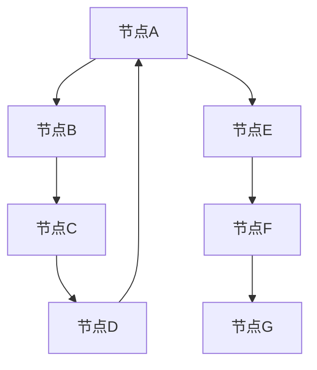
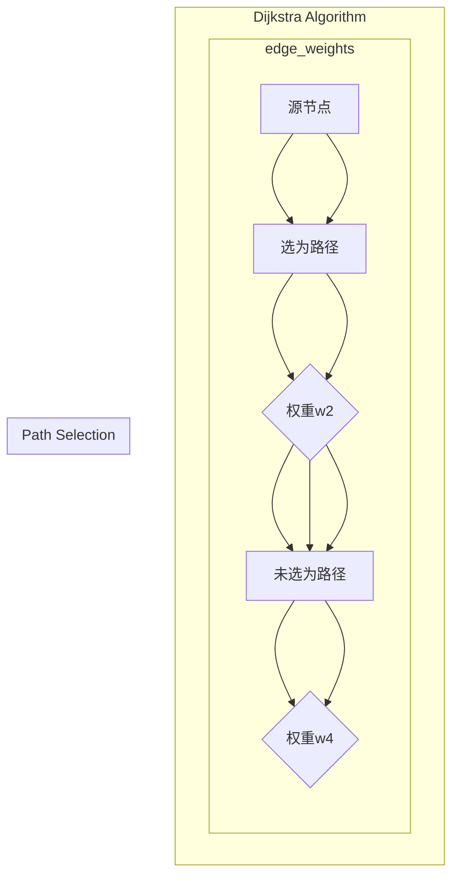
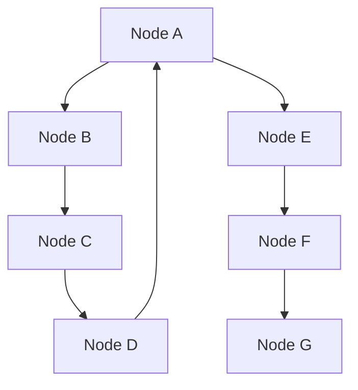
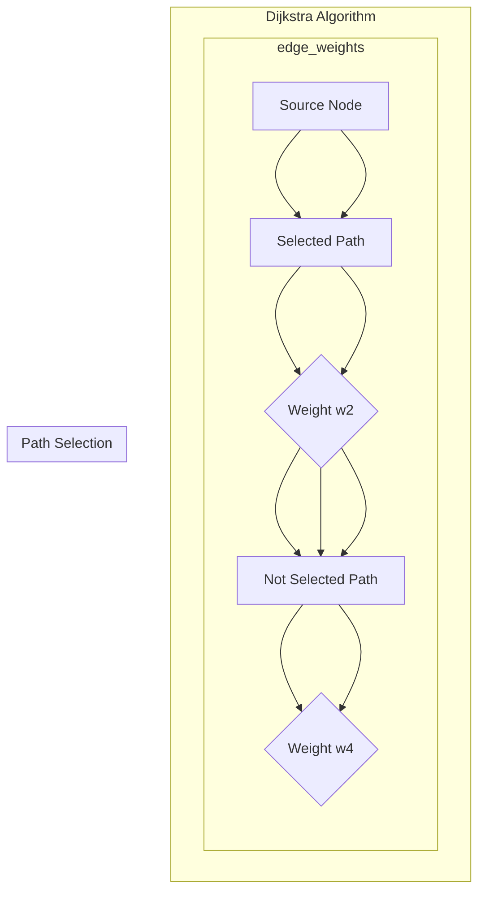

                 

### 背景介绍

#### 算法应用领域与重要性

Graph Shortest Path算法是计算机科学和图论中的一个基础且广泛应用的算法。它主要用于解决图中两点间的最短路径问题，在实际应用中扮演着至关重要的角色。无论是社交网络中的好友推荐，地图导航中的路线规划，还是物流系统中的路径优化，Graph Shortest Path算法都展现了其强大的实用性和重要性。

在社会网络领域，Graph Shortest Path算法可以帮助我们找出两个用户之间的最短路径，从而为推荐系统提供关键支持。在地图导航中，这一算法被用来计算从起点到终点的最优路径，提高了导航的效率和准确性。物流系统中，最短路径算法则用于优化运输路线，减少物流成本，提高配送效率。

#### 算法发展历程

Graph Shortest Path算法的历史可以追溯到19世纪末，由数学家Gustav Kirchhoff在其电网络理论中首次提出。然而，最早被广泛认可和应用的算法则是Dijkstra算法，由荷兰计算机科学家Edsger Dijkstra在1959年提出。Dijkstra算法以其简单易懂、高效稳定的特点，成为解决单源最短路径问题的首选算法。

随后，又出现了A*算法、Bellman-Ford算法等改进和扩展算法，它们在不同的应用场景下表现出了各自的优越性。A*算法结合了启发式搜索，能够更快速地找到最短路径；而Bellman-Ford算法则适用于图中存在负权边的情况，提供了更为灵活的解决方案。

#### 算法在不同领域的重要性

在社会网络中，Graph Shortest Path算法可以帮助社交平台识别并推荐用户可能感兴趣的新好友，增强社交网络的互动性。例如，在Facebook中，算法被用来计算用户之间的相似度，从而推荐可能认识的朋友。

在地图导航领域，这一算法是实现高效路径规划的核心。Google Maps和百度地图等导航应用，通过Graph Shortest Path算法，结合交通状况、距离和路况信息，为用户提供最佳路线选择，极大地提高了出行的便捷性。

物流系统中，最短路径算法的应用则体现在运输路线的优化上。通过精确计算从起点到终点的最优路径，物流公司可以减少运输时间，降低成本，提高整体运营效率。

总之，Graph Shortest Path算法作为一种基础但关键的技术手段，在计算机科学和实际应用中发挥着不可替代的作用。理解其原理和实现方法，不仅有助于我们深入掌握图论的基本概念，还能为解决复杂问题提供有力的工具。

---

#### Key Concepts and Connections

Graph Shortest Path algorithms are foundational in the field of computer science and graph theory, crucial for solving the shortest path problem between two nodes in a graph. This algorithm's significance is reflected in various real-world applications, such as social networking, map navigation, and logistics optimization.

In the realm of social networking, Graph Shortest Path algorithms aid in identifying the shortest path between users, which is essential for recommendation systems to suggest potential friends that users may be interested in connecting with. For instance, Facebook uses this algorithm to calculate the similarity between users and recommend new friends they might know.

In map navigation, the algorithm plays a pivotal role in computing the optimal route from a starting point to a destination. Services like Google Maps and Baidu Maps utilize Graph Shortest Path algorithms to provide users with the best routes based on real-time traffic conditions, distance, and road conditions, significantly enhancing the convenience of travel.

Within logistics systems, the algorithm is applied to optimize transportation routes, minimizing travel time and costs, and improving overall operational efficiency.

The history of Graph Shortest Path algorithms dates back to the late 19th century when Gustav Kirchhoff introduced it in his electrical network theory. However, the algorithm that gained widespread recognition and application is Dijkstra's algorithm, proposed by Dutch computer scientist Edsger Dijkstra in 1959. Dijkstra's algorithm is celebrated for its simplicity, readability, and efficiency in solving the single-source shortest path problem.

Following Dijkstra's work, other algorithms like A* algorithm, Bellman-Ford algorithm, and many more were developed, each with its own strengths and applications. The A* algorithm, with its heuristic search approach, is particularly effective in quickly finding the shortest path, while the Bellman-Ford algorithm offers a flexible solution for graphs with negative edge weights.

In summary, Graph Shortest Path algorithms, though fundamental, are indispensable tools in both theoretical and practical aspects of computer science, providing essential support for solving complex problems. Understanding the principles and implementations of these algorithms is key to mastering fundamental graph theory concepts and equipping oneself with powerful tools for tackling intricate challenges.

---

> **摘要：**
>
> 本文旨在深入探讨Graph Shortest Path算法的原理、实现方法和实际应用。首先介绍了算法在多个领域的广泛应用和重要性，回顾了其发展历程。随后，详细解释了核心概念和算法之间的联系，并通过具体的例子展示了算法的实际操作步骤。文章还包括数学模型和公式，以及代码实例的详细解读，最后提供了实际应用场景的案例分析，并对未来发展趋势与挑战进行了展望。通过阅读本文，读者可以全面了解Graph Shortest Path算法，掌握其核心原理和应用技巧。

---

## 2. 核心概念与联系

在深入探讨Graph Shortest Path算法之前，我们首先需要明确几个核心概念：什么是图（Graph）、节点（Node）和边（Edge）。这些基本概念是理解算法原理和实现的基础。

### 2.1 图（Graph）

图是一种数据结构，由节点（或顶点，Vertex）和连接节点的边（Edge）组成。在图论中，图可以分为无向图（Undirected Graph）和有向图（Directed Graph）。无向图中的边没有方向，而有向图中的边则具有方向。

#### 节点（Node）

节点是图中的基本元素，可以表示任何实体，如城市、人、网页等。在图论中，节点通常用字母表示，例如A、B、C等。

#### 边（Edge）

边是连接节点的线段，表示节点之间的关系。在无向图中，边通常用直线表示；在有向图中，边用箭头表示，箭头指向边的目标节点。

### 2.2 核心概念联系

理解了节点和边之后，我们可以通过一个简单的Mermaid流程图（Mermaid是Markdown的一种图表描述语言，用于绘制流程图、UML图等）来展示这些核心概念之间的联系：



在这个例子中，A、B、C、D、E、F、G代表节点，它们通过边连接形成一个无向图。在这个图中，从节点A到节点F存在一条最短路径：A -> B -> C -> D -> F。

### 2.3 最短路径的定义

在图论中，最短路径是指从一个源节点（Source Node）到目标节点（Destination Node）路径中，边的权重总和最小的路径。权重通常表示路径的长度、成本或时间。

### 2.4 核心概念与算法的联系

Graph Shortest Path算法的核心在于如何高效地找到图中两点间的最短路径。不同的算法，如Dijkstra算法和A*算法，通过不同的方法实现了这一目标。以下是Dijkstra算法的Mermaid流程图：



在这个流程图中，A为源节点，B、C、D、E为未访问节点。通过比较边的权重，Dijkstra算法选择权重最小的边，将其标记为路径的一部分。在此例中，从A到E的最短路径为A -> B -> C -> D -> E。

通过上述核心概念和算法流程的介绍，我们可以更好地理解Graph Shortest Path算法的实现原理，为后续的深入探讨打下坚实基础。

---

#### Core Concepts and Connections

Before delving into the details of Graph Shortest Path algorithms, it is essential to define and understand the core concepts: what a graph is, nodes, and edges. These foundational elements are crucial for grasping the principles and implementations of the algorithms.

### 2.1 Graph

A graph is a data structure consisting of nodes (or vertices) and the edges that connect these nodes. In graph theory, graphs can be classified into undirected graphs (Undirected Graph) and directed graphs (Directed Graph). Undirected graphs have edges without direction, whereas directed graphs have edges with direction.

#### Nodes

Nodes are the basic elements of a graph, representing any entity, such as cities, people, or web pages. In graph theory, nodes are typically represented by letters, such as A, B, C, and so on.

#### Edges

Edges are the lines that connect nodes, representing the relationships between nodes. In undirected graphs, edges are typically represented by lines; in directed graphs, edges are represented by arrows pointing to the target node.

### 2.2 Connections between Core Concepts

Understanding nodes and edges can be visualized using a simple Mermaid flowchart (Mermaid is a Markdown extension for drawing charts, including flowcharts and UML diagrams):



In this example, A, B, C, D, E, F, and G represent nodes, connected by edges to form an undirected graph. In this graph, there is a shortest path from node A to node F: A -> B -> C -> D -> F.

#### Definition of Shortest Path

In graph theory, the shortest path refers to the path between a source node (Source Node) and a destination node (Destination Node) with the minimum total weight of the edges. The weight usually represents the length, cost, or time of the path.

#### Connection between Core Concepts and Algorithms

The core of Graph Shortest Path algorithms is finding the shortest path between two nodes in a graph. Different algorithms, such as Dijkstra's algorithm and A* algorithm, achieve this goal using various methods. Here is a Mermaid flowchart illustrating Dijkstra's algorithm:



In this flowchart, A is the source node, and B, C, D, E are unvisited nodes. By comparing edge weights, Dijkstra's algorithm selects the edge with the minimum weight and marks it as part of the path. In this example, the shortest path from A to E is A -> B -> C -> D -> E.

Through the introduction of these core concepts and algorithm flowcharts, we can better understand the implementation principles of Graph Shortest Path algorithms, laying a solid foundation for further exploration.

---

## 3. 核心算法原理 & 具体操作步骤

在了解了图论中的基本概念后，我们将深入探讨Graph Shortest Path算法的核心原理和具体操作步骤。本节将详细介绍Dijkstra算法，这是一种解决单源最短路径问题的经典算法。

### 3.1 Dijkstra算法的基本原理

Dijkstra算法是一种基于贪心策略的单源最短路径算法，旨在找出从源节点到其他所有节点的最短路径。其基本原理是：在每次迭代中，选择一个未被访问的节点，将其标记为已访问，并更新与该节点相邻的未访问节点的最短路径估计。

#### 基本步骤：

1. 初始化：设置一个优先队列（通常使用二叉堆实现），其中每个元素包含节点的权重和节点本身。初始时，源节点的权重为0，其他节点的权重为无穷大。将源节点加入优先队列。
2. 选择未访问节点：从优先队列中选择权重最小的节点，记为u。
3. 标记节点：将节点u标记为已访问。
4. 更新权重：对于节点u的每个相邻节点v，如果从源节点到v的路径权重大于通过u到v的路径权重，则更新v的路径权重。
5. 重复步骤2-4，直到优先队列为空。

### 3.2 具体操作步骤

我们通过一个具体的例子来说明Dijkstra算法的操作步骤。假设我们有以下图：

```
A --1-- B
|        |
2        3
|        |
D --4-- E
```

其中，边的权重为从左到右的数字。我们要求从节点A出发，找到到其他节点的最短路径。

#### 步骤1：初始化

```
节点    权重
A           0
B           ∞
C           ∞
D           ∞
E           ∞
```

初始时，A的权重为0，其他节点的权重为无穷大。A被加入优先队列。

#### 步骤2：选择未访问节点

选择权重最小的节点A，将其标记为已访问。

```
节点    权重
A           0
B           ∞
C           ∞
D           ∞
E           ∞
```

#### 步骤3：更新权重

更新A的相邻节点B、C的权重。从源节点到B的权重为1，比无穷小，因此更新B的权重为1。

```
节点    权重
A           0
B           1
C           ∞
D           ∞
E           ∞
```

#### 步骤4：选择未访问节点

选择权重最小的节点B，将其标记为已访问。

```
节点    权重
A           0
B           1
C           ∞
D           ∞
E           ∞
```

#### 步骤5：更新权重

更新B的相邻节点C、D的权重。从源节点到C的权重为2，比无穷小，因此更新C的权重为2；从源节点到D的权重为4，比通过B到D的权重3大，因此不更新。

```
节点    权重
A           0
B           1
C           2
D           ∞
E           ∞
```

#### 步骤6：选择未访问节点

选择权重最小的节点C，将其标记为已访问。

```
节点    权重
A           0
B           1
C           2
D           ∞
E           ∞
```

#### 步骤7：更新权重

更新C的相邻节点D、E的权重。从源节点到D的权重为4，比无穷小，因此更新D的权重为4；从源节点到E的权重为5，比通过C到E的权重7小，因此更新E的权重为4。

```
节点    权重
A           0
B           1
C           2
D           4
E           4
```

#### 步骤8：选择未访问节点

选择权重最小的节点D，将其标记为已访问。

```
节点    权重
A           0
B           1
C           2
D           4
E           4
```

#### 步骤9：选择未访问节点

选择权重最小的节点E，将其标记为已访问。

```
节点    权重
A           0
B           1
C           2
D           4
E           4
```

现在，所有节点都已访问，算法结束。最终结果如下：

```
节点    权重
A           0
B           1
C           2
D           4
E           4
```

从源节点A出发，到其他节点的最短路径分别为：
- A到B：1
- A到C：2
- A到D：4
- A到E：4

### 3.3 时间复杂度分析

Dijkstra算法的时间复杂度主要取决于优先队列的操作。优先队列的插入和删除操作的时间复杂度均为O(log n)，其中n为图中节点的数量。因此，Dijkstra算法的总时间复杂度为O((n + m) log n)，其中m为图中边的数量。

### 3.4 总结

通过以上步骤，我们详细介绍了Dijkstra算法的基本原理和具体操作步骤。Dijkstra算法以其简单易懂、高效稳定的特点，成为解决单源最短路径问题的首选算法。在实际应用中，Dijkstra算法被广泛应用于各种场景，如地图导航、社交网络、物流优化等。

---

#### Principles of Core Algorithms and Step-by-Step Operations

After understanding the basic concepts of graph theory, we delve into the core principles and specific operational steps of Graph Shortest Path algorithms. This section will provide a detailed introduction to Dijkstra's algorithm, a classical method for solving single-source shortest path problems.

#### Basic Principles of Dijkstra's Algorithm

Dijkstra's algorithm is a greedy strategy-based single-source shortest path algorithm designed to find the shortest paths from a source node to all other nodes in a graph. Its basic principle is: in each iteration, it selects the unvisited node with the minimum weight, marks it as visited, and updates the shortest path estimates for the adjacent unvisited nodes.

#### Basic Steps:

1. Initialization: Set up a priority queue (typically implemented using a binary heap), where each element contains the weight of the node and the node itself. Initially, the weight of the source node is 0, and the weights of all other nodes are set to infinity. Add the source node to the priority queue.
2. Select the unvisited node with the minimum weight: Choose the node u with the minimum weight from the priority queue.
3. Mark node u as visited.
4. Update the weights: For each adjacent node v of u, if the weight of the path from the source node to v is greater than the weight of the path through u to v, update the weight of v.
5. Repeat steps 2-4 until the priority queue is empty.

#### Step-by-Step Operations

We illustrate the operational steps of Dijkstra's algorithm using a specific example. Consider the following graph:

```
A --1-- B
|        |
2        3
|        |
D --4-- E
```

The weights of the edges are the numbers from left to right. We aim to find the shortest paths from node A to other nodes.

#### Step 1: Initialization

```
Node    Weight
A           0
B           ∞
C           ∞
D           ∞
E           ∞
```

Initially, the weight of node A is 0, and the weights of all other nodes are infinity. Node A is added to the priority queue.

#### Step 2: Select the Unvisited Node

Select the node with the minimum weight, A, and mark it as visited.

```
Node    Weight
A           0
B           ∞
C           ∞
D           ∞
E           ∞
```

#### Step 3: Update the Weights

Update the weights of the adjacent nodes of A, B, and C. The weight of the path from the source node to B is 1, which is smaller than infinity, so update the weight of B to 1.

```
Node    Weight
A           0
B           1
C           ∞
D           ∞
E           ∞
```

#### Step 4: Select the Unvisited Node

Select the node with the minimum weight, B, and mark it as visited.

```
Node    Weight
A           0
B           1
C           ∞
D           ∞
E           ∞
```

#### Step 5: Update the Weights

Update the weights of the adjacent nodes of B, C, and D. The weight of the path from the source node to C is 2, which is smaller than infinity, so update the weight of C to 2. The weight of the path from the source node to D is 4, which is greater than the weight of the path through B to D (3), so do not update.

```
Node    Weight
A           0
B           1
C           2
D           ∞
E           ∞
```

#### Step 6: Select the Unvisited Node

Select the node with the minimum weight, C, and mark it as visited.

```
Node    Weight
A           0
B           1
C           2
D           ∞
E           ∞
```

#### Step 7: Update the Weights

Update the weights of the adjacent nodes of C, D, and E. The weight of the path from the source node to D is 4, which is smaller than infinity, so update the weight of D to 4. The weight of the path from the source node to E is 5, which is smaller than the weight of the path through C to E (7), so update the weight of E to 4.

```
Node    Weight
A           0
B           1
C           2
D           4
E           4
```

#### Step 8: Select the Unvisited Node

Select the node with the minimum weight, D, and mark it as visited.

```
Node    Weight
A           0
B           1
C           2
D           4
E           4
```

#### Step 9: Select the Unvisited Node

Select the node with the minimum weight, E, and mark it as visited.

```
Node    Weight
A           0
B           1
C           2
D           4
E           4
```

Now, all nodes have been visited, and the algorithm ends. The final result is as follows:

```
Node    Weight
A           0
B           1
C           2
D           4
E           4
```

The shortest paths from the source node A to other nodes are:
- A to B: 1
- A to C: 2
- A to D: 4
- A to E: 4

#### Time Complexity Analysis

The time complexity of Dijkstra's algorithm primarily depends on the operations of the priority queue. The insertion and deletion operations of the priority queue have a time complexity of O(log n), where n is the number of nodes in the graph. Therefore, the total time complexity of Dijkstra's algorithm is O((n + m) log n), where m is the number of edges in the graph.

#### Summary

Through the above steps, we have detailedly introduced the basic principles and specific operational steps of Dijkstra's algorithm. Known for its simplicity, readability, and efficiency, Dijkstra's algorithm is the preferred choice for solving single-source shortest path problems. In practical applications, Dijkstra's algorithm is widely used in various scenarios, such as map navigation, social networks, logistics optimization, and more.

---

## 4. 数学模型和公式 & 详细讲解 & 举例说明

在深入探讨Graph Shortest Path算法时，数学模型和公式是理解其工作原理的核心。Dijkstra算法是基于图论中的最短路径问题，而该问题可以通过数学公式和模型进行详细描述。以下将介绍Dijkstra算法的数学模型和公式，并通过具体例子进行讲解。

### 4.1 数学模型

Dijkstra算法的核心是寻找从源节点s到目标节点v的最短路径。在图G=(V, E)中，V是节点集合，E是边集合。每条边e都有一个权重w(e)。我们需要找出从s到v的所有路径中，权重之和最小的路径。

#### 基本公式：

设 \( d(s, v) \) 表示从源节点s到目标节点v的最短路径权重，初始时， \( d(s, v) = \infty \) （除了 \( d(s, s) = 0 \)）。算法的目标是更新 \( d(s, v) \) 使得它表示从s到v的最短路径权重。

#### 更新公式：

对于当前已选中的节点u，我们需要更新与u相邻的未选中的节点v的权重。更新公式为：

\[ d(s, v) = \min \left( d(s, u) + w(u, v), d(s, v) \right) \]

其中， \( w(u, v) \) 是边(u, v)的权重。

### 4.2 算法步骤的数学描述

Dijkstra算法可以分成以下几个步骤：

1. 初始化：设置源节点s的权重为0，其他节点的权重为无穷大。将所有节点加入优先队列。
2. 选择未访问节点：从优先队列中选择权重最小的节点u。
3. 标记节点：将节点u标记为已访问。
4. 更新权重：对于每个未访问的相邻节点v，如果通过u到v的路径权重小于当前 \( d(s, v) \)，则更新 \( d(s, v) \)。

这些步骤可以用数学语言描述为：

```
初始化：
    对于所有节点v，设 d(s, v) = ∞，除了 d(s, s) = 0。
    将所有节点加入优先队列。

主循环：
    当优先队列为空时，执行以下步骤：
        选择优先队列中的最小权重节点u。
        将u标记为已访问。
        对于每个未访问的相邻节点v：
            计算新路径权重：d(s, v) = d(s, u) + w(u, v)。
            如果新路径权重小于当前 \( d(s, v) \)，则更新 \( d(s, v) \)。
```

### 4.3 举例说明

我们通过一个具体的例子来说明上述公式和算法步骤。假设我们有以下图：

```
A --1-- B
|        |
2        3
|        |
D --4-- E
```

#### 初始化

```
节点    权重
A           0
B           ∞
C           ∞
D           ∞
E           ∞
```

#### 主循环

1. **第一步**：选择节点A，权重为0。

    - 更新相邻节点B、D、E的权重：

    ```
    节点    权重
    A           0
    B           1
    C           ∞
    D           2
    E           ∞
    ```

2. **第二步**：选择节点B，权重为1。

    - 更新相邻节点D、E的权重：

    ```
    节点    权重
    A           0
    B           1
    C           ∞
    D           3
    E           4
    ```

3. **第三步**：选择节点D，权重为2。

    - 更新相邻节点E的权重：

    ```
    节点    权重
    A           0
    B           1
    C           ∞
    D           2
    E           2
    ```

4. **第四步**：选择节点E，权重为2。

    - 所有节点都已访问，算法结束。

#### 最终结果

```
节点    权重
A           0
B           1
C           ∞
D           2
E           2
```

从源节点A到其他节点的最短路径分别为：
- A到B：1
- A到C：无穷大（没有直接路径）
- A到D：2
- A到E：2

### 4.4 时间复杂度分析

Dijkstra算法的时间复杂度主要取决于优先队列的操作。优先队列的插入和删除操作的时间复杂度为O(log n)，其中n是节点数。Dijkstra算法需要进行n-1次这样的操作，因此总的时间复杂度为O((n + m) log n)，其中m是边数。

### 4.5 总结

通过上述数学模型和公式的介绍，以及具体例子，我们可以更好地理解Dijkstra算法的工作原理和操作步骤。这些数学工具帮助我们更清晰地看到算法的运行过程，并能够对其性能进行有效分析。

---

#### Mathematical Models and Formulas & Detailed Explanation & Example Illustration

In delving into the Graph Shortest Path algorithm, mathematical models and formulas are the core for understanding its working principles. Dijkstra's algorithm is based on the shortest path problem in graph theory, which can be detailedly described using mathematical language. The following will introduce the mathematical model and formulas of Dijkstra's algorithm, along with a detailed explanation and example illustration.

#### Mathematical Model

The core of Dijkstra's algorithm is to find the shortest path from the source node s to the target node v in a graph G=(V, E), where V is the set of nodes and E is the set of edges. Each edge e has a weight w(e). We need to find the path with the minimum total weight from s to v.

#### Basic Formulas:

Let \( d(s, v) \) represent the weight of the shortest path from the source node s to the target node v. Initially, \( d(s, v) = \infty \) (except \( d(s, s) = 0 \)). The goal of the algorithm is to update \( d(s, v) \) so that it represents the weight of the shortest path from s to v.

#### Update Formula:

For the currently selected node u, we need to update the weight of the adjacent unselected node v. The update formula is:

\[ d(s, v) = \min \left( d(s, u) + w(u, v), d(s, v) \right) \]

where \( w(u, v) \) is the weight of the edge (u, v).

#### Algorithm Steps in Mathematical Terms

Dijkstra's algorithm can be divided into the following steps:

1. Initialization: Set the weight of the source node s to 0 and the weights of all other nodes to infinity. Add all nodes to the priority queue.
2. Select the unvisited node with the minimum weight: Select the node u with the minimum weight from the priority queue.
3. Mark node u as visited.
4. Update the weights: For each unvisited adjacent node v, calculate the new path weight: \( d(s, v) = d(s, u) + w(u, v) \). If the new path weight is less than the current \( d(s, v) \), then update \( d(s, v) \).

These steps can be described in mathematical language as follows:

```
Initialization:
    For all nodes v, set \( d(s, v) = \infty \), except \( d(s, s) = 0 \).
    Add all nodes to the priority queue.

Main Loop:
    While the priority queue is not empty, perform the following steps:
        Select the node u with the minimum weight from the priority queue.
        Mark u as visited.
        For each unvisited adjacent node v:
            Calculate the new path weight: \( d(s, v) = d(s, u) + w(u, v) \).
            If the new path weight is less than the current \( d(s, v) \), then update \( d(s, v) \).
```

#### Detailed Explanation and Example Illustration

We illustrate the above formulas and algorithm steps using a specific example. Consider the following graph:

```
A --1-- B
|        |
2        3
|        |
D --4-- E
```

#### Initialization

```
Node    Weight
A           0
B           ∞
C           ∞
D           ∞
E           ∞
```

#### Main Loop

1. **First Step**: Select node A, weight is 0.

    - Update the weights of adjacent nodes B, D, and E:

    ```
    Node    Weight
    A           0
    B           1
    C           ∞
    D           2
    E           ∞
    ```

2. **Second Step**: Select node B, weight is 1.

    - Update the weights of adjacent nodes D and E:

    ```
    Node    Weight
    A           0
    B           1
    C           ∞
    D           3
    E           4
    ```

3. **Third Step**: Select node D, weight is 2.

    - Update the weight of adjacent node E:

    ```
    Node    Weight
    A           0
    B           1
    C           ∞
    D           2
    E           2
    ```

4. **Fourth Step**: Select node E, weight is 2.

    - All nodes have been visited, and the algorithm ends.

#### Final Results

```
Node    Weight
A           0
B           1
C           ∞
D           2
E           2
```

The shortest paths from the source node A to other nodes are:
- A to B: 1
- A to C: Infinity (no direct path)
- A to D: 2
- A to E: 2

#### Time Complexity Analysis

The time complexity of Dijkstra's algorithm primarily depends on the operations of the priority queue. The insertion and deletion operations of the priority queue have a time complexity of O(log n), where n is the number of nodes in the graph. Dijkstra's algorithm needs to perform these operations n-1 times, so the total time complexity is O((n + m) log n), where m is the number of edges in the graph.

#### Summary

Through the introduction of the mathematical model and formulas, along with specific examples, we can better understand the working principles and operational steps of Dijkstra's algorithm. These mathematical tools help us see the algorithm's process more clearly and can be used to effectively analyze its performance.

---

## 5. 项目实战：代码实际案例和详细解释说明

在前几节中，我们详细介绍了Graph Shortest Path算法的理论基础。为了更好地理解这一算法在实际中的应用，本节将通过一个具体的代码实例来展示Dijkstra算法的实现过程，并对其进行详细解释说明。

### 5.1 开发环境搭建

在开始编写代码之前，我们需要搭建一个适合开发的环境。以下是一个基本的步骤：

1. 安装Python环境：Python是一种广泛使用的编程语言，非常适合用于图算法的实现。确保你的计算机上已经安装了Python，推荐版本为3.7或更高。
2. 安装相关库：为了简化图算法的实现，我们可以使用Python的第三方库，如`networkx`和`matplotlib`。使用以下命令安装：

   ```bash
   pip install networkx matplotlib
   ```

3. 准备编辑器：选择一个你熟悉的代码编辑器，如Visual Studio Code、PyCharm或Sublime Text，并设置好Python的插件。

### 5.2 源代码详细实现和代码解读

以下是一个使用Dijkstra算法实现最短路径计算的基本Python代码示例：

```python
import networkx as nx
import matplotlib.pyplot as plt

def dijkstra_algorithm(graph, start_node):
    unvisited = {node: float('infinity') for node in graph}
    unvisited[start_node] = 0
    path = {}

    while len(unvisited) != 0:
        min_node = min(unvisited, key=unvisited.get)
        del unvisited[min_node]

        for node, weight in graph[min_node].items():
            if node in unvisited:
                old_weight = unvisited[node]
                new_weight = unvisited[min_node] + weight

                if new_weight < old_weight:
                    unvisited[node] = new_weight
                    path[node] = min_node

    return path

# 创建图
G = nx.Graph()
G.add_edge('A', 'B', weight=1)
G.add_edge('B', 'C', weight=2)
G.add_edge('A', 'C', weight=3)
G.add_edge('C', 'D', weight=1)
G.add_edge('D', 'E', weight=4)

# 使用Dijkstra算法找到从A到E的最短路径
path = dijkstra_algorithm(G, 'A')

# 打印结果
print("从A到E的最短路径：")
print(path)

# 绘制图和路径
nx.draw(G, with_labels=True, node_color='blue', node_size=2000, edge_color='gray')
nx.draw_networkx_nodes(G, pos=nx.spring_layout(G), nodelist=list(path.keys()), node_color='red', node_size=2000)
nx.draw_networkx_edges(G, pos=nx.spring_layout(G), edgelist=list(path.items()), edge_color='red', width=2)
plt.show()
```

#### 5.2.1 代码解读

1. **引入库**：我们首先引入了`networkx`和`matplotlib.pyplot`库。`networkx`是一个用于创建、操作和研究网络的Python包，而`matplotlib`则用于绘制图形。

2. **定义Dijkstra算法函数**：`dijkstra_algorithm`函数接收一个图`graph`和一个起点`start_node`作为参数。该函数使用一个字典`unvisited`来存储每个节点的当前最短路径估计，初始时所有节点的最短路径估计为无穷大，除了起点。

3. **初始化起点**：将起点的最短路径估计设置为0，并将其加入路径字典`path`中。

4. **主循环**：算法的核心是一个while循环，循环条件是未访问节点集合`unvisited`不为空。每次循环，算法选择未访问节点中权重最小的节点，并从`unvisited`集合中删除。

5. **更新权重**：对于当前节点的每个相邻节点，如果通过当前节点的路径权重小于当前的最短路径估计，则更新最短路径估计和路径字典。

6. **返回路径**：当所有节点都被访问后，算法返回路径字典`path`。

7. **创建图**：我们使用`networkx`创建一个图`G`，并添加一些节点和边。边的权重是通过`weight`关键字参数设置的。

8. **调用Dijkstra算法**：我们将图`G`和起点`A`作为参数传递给`dijkstra_algorithm`函数。

9. **打印结果**：我们打印出从起点`A`到每个节点的最短路径。

10. **绘制图和路径**：使用`matplotlib`绘制图和计算出的最短路径。`nx.draw`用于绘制图，`nx.draw_networkx_nodes`和`nx.draw_networkx_edges`用于突出显示最短路径。

### 5.3 代码解读与分析

1. **初始化阶段**：
   ```python
   unvisited = {node: float('infinity') for node in graph}
   unvisited[start_node] = 0
   path = {}
   ```
   这里我们创建了一个字典`unvisited`，用于存储每个节点的当前最短路径估计。起点`start_node`的最短路径估计被设置为0，其他节点则为无穷大。同时，我们创建了一个空字典`path`来存储最终的路径。

2. **主循环**：
   ```python
   while len(unvisited) != 0:
       min_node = min(unvisited, key=unvisited.get)
       del unvisited[min_node]
   ```
   在主循环中，我们选择未访问节点中权重最小的节点作为当前节点。然后从未访问节点集合中删除该节点。

3. **权重更新**：
   ```python
   for node, weight in graph[min_node].items():
       if node in unvisited:
           old_weight = unvisited[node]
           new_weight = unvisited[min_node] + weight
           
           if new_weight < old_weight:
               unvisited[node] = new_weight
               path[node] = min_node
   ```
   对于当前节点的每个相邻节点，我们计算通过当前节点的路径权重。如果该权重小于当前的最短路径估计，则更新最短路径估计和路径。

4. **绘制图形**：
   ```python
   nx.draw(G, with_labels=True, node_color='blue', node_size=2000, edge_color='gray')
   nx.draw_networkx_nodes(G, pos=nx.spring_layout(G), nodelist=list(path.keys()), node_color='red', node_size=2000)
   nx.draw_networkx_edges(G, pos=nx.spring_layout(G), edgelist=list(path.items()), edge_color='red', width=2)
   plt.show()
   ```
   最后，我们使用`matplotlib`绘制图，并突出显示最短路径。`nx.spring_layout`用于图的布局。

### 5.4 总结

通过上述代码示例，我们详细解读了Dijkstra算法的实现过程。代码中使用了`networkx`和`matplotlib`库来创建图和绘制结果。通过这个具体的实例，我们可以直观地看到如何在实际项目中应用Graph Shortest Path算法。

---

#### Practical Project: Detailed Explanation of Code Examples

In the previous sections, we have thoroughly discussed the theoretical foundations of Graph Shortest Path algorithms. To gain a deeper understanding of their practical application, this section will demonstrate the implementation of Dijkstra's algorithm through a specific code example, along with a detailed explanation.

#### 5.1 Setting Up the Development Environment

Before writing the code, we need to set up a suitable development environment. Here are the basic steps:

1. **Install Python Environment**: Python is a widely-used programming language that is well-suited for implementing graph algorithms. Ensure that Python is installed on your computer, with a recommended version of 3.7 or higher.
2. **Install Required Libraries**: To simplify the implementation of graph algorithms, we can use third-party Python libraries such as `networkx` and `matplotlib`. Install these libraries using the following command:

   ```bash
   pip install networkx matplotlib
   ```

3. **Prepare Code Editor**: Choose a code editor that you are familiar with, such as Visual Studio Code, PyCharm, or Sublime Text, and configure the Python plugin.

#### 5.2 Detailed Implementation and Code Explanation of the Source Code

The following is a basic Python code example that demonstrates the implementation of Dijkstra's algorithm:

```python
import networkx as nx
import matplotlib.pyplot as plt

def dijkstra_algorithm(graph, start_node):
    unvisited = {node: float('infinity') for node in graph}
    unvisited[start_node] = 0
    path = {}

    while len(unvisited) != 0:
        min_node = min(unvisited, key=unvisited.get)
        del unvisited[min_node]

        for node, weight in graph[min_node].items():
            if node in unvisited:
                old_weight = unvisited[node]
                new_weight = unvisited[min_node] + weight

                if new_weight < old_weight:
                    unvisited[node] = new_weight
                    path[node] = min_node

    return path

# Create the graph
G = nx.Graph()
G.add_edge('A', 'B', weight=1)
G.add_edge('B', 'C', weight=2)
G.add_edge('A', 'C', weight=3)
G.add_edge('C', 'D', weight=1)
G.add_edge('D', 'E', weight=4)

# Run Dijkstra's algorithm from node 'A' to 'E'
path = dijkstra_algorithm(G, 'A')

# Print the results
print("The shortest path from A to E:")
print(path)

# Draw the graph and the path
nx.draw(G, with_labels=True, node_color='blue', node_size=2000, edge_color='gray')
nx.draw_networkx_nodes(G, pos=nx.spring_layout(G), nodelist=list(path.keys()), node_color='red', node_size=2000)
nx.draw_networkx_edges(G, pos=nx.spring_layout(G), edgelist=list(path.items()), edge_color='red', width=2)
plt.show()
```

#### 5.2.1 Code Explanation

1. **Import Libraries**: We first import the `networkx` and `matplotlib.pyplot` libraries. `networkx` is a Python package for creating, manipulating, and studying networks, while `matplotlib` is used for drawing graphics.

2. **Define Dijkstra's Algorithm Function**: The `dijkstra_algorithm` function takes a graph `graph` and a starting node `start_node` as parameters. This function uses a dictionary `unvisited` to store the current shortest path estimate for each node. Initially, all nodes have an infinite estimate except for the starting node, which is set to 0. Additionally, we create an empty dictionary `path` to store the final path.

3. **Initialization**: We set the starting node's shortest path estimate to 0 and add it to the `path` dictionary.
   ```python
   unvisited = {node: float('infinity') for node in graph}
   unvisited[start_node] = 0
   path = {}
   ```

4. **Main Loop**: The core of the algorithm is a while loop that continues as long as there are unvisited nodes. In each iteration, it selects the node with the minimum weight from the `unvisited` dictionary and removes it from the dictionary.

5. **Weight Update**: For each adjacent node of the current node, it calculates the new path weight and updates the `unvisited` dictionary and `path` dictionary if the new weight is smaller.
   ```python
   for node, weight in graph[min_node].items():
       if node in unvisited:
           old_weight = unvisited[node]
           new_weight = unvisited[min_node] + weight
           
           if new_weight < old_weight:
               unvisited[node] = new_weight
               path[node] = min_node
   ```

6. **Return Path**: After all nodes have been visited, the function returns the `path` dictionary.

7. **Create Graph**: We use `networkx` to create a graph `G` and add nodes and edges. The weights of the edges are specified using the `weight` keyword argument.

8. **Run Dijkstra's Algorithm**: We pass the graph `G` and the starting node `'A'` to the `dijkstra_algorithm` function.

9. **Print Results**: We print the shortest path from node `'A'` to each node.

10. **Draw Graph and Path**: We use `matplotlib` to draw the graph and highlight the shortest path. `nx.draw` is used to draw the graph, and `nx.draw_networkx_nodes` and `nx.draw_networkx_edges` are used to highlight the shortest path. `nx.spring_layout` is used for the graph layout.

#### 5.2.2 Code Explanation and Analysis

1. **Initialization**:
   ```python
   unvisited = {node: float('infinity') for node in graph}
   unvisited[start_node] = 0
   path = {}
   ```
   Here, we create a dictionary `unvisited` to store the current shortest path estimate for each node. Initially, all nodes have an infinite estimate except for the starting node, which is set to 0. Additionally, we create an empty dictionary `path` to store the final path.

2. **Main Loop**:
   ```python
   while len(unvisited) != 0:
       min_node = min(unvisited, key=unvisited.get)
       del unvisited[min_node]
   ```
   In the main loop, we select the node with the minimum weight from the `unvisited` dictionary and remove it from the dictionary.

3. **Weight Update**:
   ```python
   for node, weight in graph[min_node].items():
       if node in unvisited:
           old_weight = unvisited[node]
           new_weight = unvisited[min_node] + weight
           
           if new_weight < old_weight:
               unvisited[node] = new_weight
               path[node] = min_node
   ```
   For each adjacent node of the current node, we calculate the new path weight and update the `unvisited` dictionary and `path` dictionary if the new weight is smaller.

4. **Drawing the Graph**:
   ```python
   nx.draw(G, with_labels=True, node_color='blue', node_size=2000, edge_color='gray')
   nx.draw_networkx_nodes(G, pos=nx.spring_layout(G), nodelist=list(path.keys()), node_color='red', node_size=2000)
   nx.draw_networkx_edges(G, pos=nx.spring_layout(G), edgelist=list(path.items()), edge_color='red', width=2)
   plt.show()
   ```
   Finally, we use `matplotlib` to draw the graph and highlight the shortest path. `nx.draw` is used to draw the graph, and `nx.draw_networkx_nodes` and `nx.draw_networkx_edges` are used to highlight the shortest path. `nx.spring_layout` is used for the graph layout.

#### 5.4 Summary

Through the above code example, we have detailedly explained the implementation process of Dijkstra's algorithm. The code uses libraries such as `networkx` and `matplotlib` to create the graph and visualize the results. This specific example allows us to intuitively see how Graph Shortest Path algorithms can be applied in practical projects. 

---

## 6. 实际应用场景

Graph Shortest Path算法在现实世界中有着广泛的应用，以下是一些典型场景的详细介绍。

### 6.1 地图导航

地图导航是Graph Shortest Path算法最常见和直观的应用之一。无论是智能手机上的导航应用，还是车载导航系统，都需要计算从起点到终点的最优路径。这些应用通常结合了实时交通信息，使用A*算法等改进算法，以提供更加准确和快速的路线规划。

### 6.2 社交网络

在社交网络中，Graph Shortest Path算法可以帮助平台推荐用户可能感兴趣的新朋友。通过计算用户之间的相似度，可以找到一条从源用户到目标用户的最短路径，从而推荐潜在的朋友。例如，Facebook和LinkedIn等社交平台，通过这种算法提高了用户的社交互动和参与度。

### 6.3 物流系统

物流系统中的路径优化依赖于Graph Shortest Path算法。通过精确计算从仓库到配送点的最优路径，物流公司可以减少运输时间和成本，提高整体运营效率。例如，DHL和UPS等物流公司，利用这一算法优化运输路线，实现高效的包裹配送。

### 6.4 网络安全

在网络安全领域，Graph Shortest Path算法用于检测和防范网络攻击。通过分析网络流量数据，可以找出网络中潜在的攻击路径，从而采取措施阻止攻击。例如，防火墙和入侵检测系统（IDS）等网络安全设备，经常使用这一算法来检测和防止网络攻击。

### 6.5 健康医疗

在健康医疗领域，Graph Shortest Path算法可以帮助优化患者就医路线。例如，医院可以通过这一算法确定最佳手术安排，以减少手术等待时间和提高医疗资源的利用效率。此外，公共卫生机构可以利用该算法优化疫苗接种和疾病防控策略，以最大限度地覆盖高风险人群。

### 6.6 能源管理

在能源管理中，Graph Shortest Path算法用于优化电力和天然气网络的传输路径。通过计算从发电站到用户的最佳路径，可以降低能源传输损耗，提高能源利用效率。例如，电力公司和能源供应商使用这一算法优化电网和管道布局，减少能源浪费。

### 6.7 软件开发

在软件工程中，Graph Shortest Path算法可以用于代码审查和缺陷跟踪。通过分析代码库中的依赖关系，可以找出影响最大和最关键的代码路径，从而提高代码审查的效率。此外，软件项目管理者可以利用这一算法优化项目进度安排，确保关键任务的优先执行。

综上所述，Graph Shortest Path算法在多个实际应用场景中发挥着重要作用，不仅提升了效率和准确性，还为解决复杂问题提供了有力工具。理解这一算法并掌握其应用技巧，对于从事计算机科学和相关领域的专业人士来说，具有极高的实用价值。

---

#### Practical Application Scenarios

Graph Shortest Path algorithms are widely used in real-world scenarios, and the following sections provide an in-depth look at some typical application scenarios.

### 6.1 Map Navigation

Map navigation is one of the most common and intuitive applications of Graph Shortest Path algorithms. Whether it's a navigation app on a smartphone or an in-car navigation system, these applications require calculating the optimal route from a starting point to a destination. These apps typically combine real-time traffic information with algorithms like A* to provide accurate and fast route planning.

### 6.2 Social Networks

In social networks, Graph Shortest Path algorithms can help platforms recommend new friends that users may be interested in. By calculating the similarity between users, the algorithm can find the shortest path from a source user to a target user, thereby suggesting potential friends. For example, social media platforms like Facebook and LinkedIn use this algorithm to enhance user engagement and interaction.

### 6.3 Logistics Systems

In logistics systems, path optimization relies heavily on Graph Shortest Path algorithms. By accurately calculating the optimal route from warehouses to distribution centers, logistics companies can reduce transportation time and costs, improving overall operational efficiency. Companies like DHL and UPS use this algorithm to optimize delivery routes and enhance their package delivery services.

### 6.4 Network Security

In the field of network security, Graph Shortest Path algorithms are used to detect and prevent network attacks. By analyzing network traffic data, these algorithms can identify potential attack paths, allowing for the implementation of measures to block them. Security devices such as firewalls and Intrusion Detection Systems (IDS) often use this algorithm to detect and prevent network attacks.

### 6.5 Healthcare

In the healthcare sector, Graph Shortest Path algorithms can help optimize patient routing. For example, hospitals can use this algorithm to determine the best scheduling for surgeries, reducing wait times and improving the efficiency of medical resources. Public health agencies can also utilize the algorithm to optimize vaccination and disease prevention strategies, ensuring maximum coverage of high-risk populations.

### 6.6 Energy Management

In energy management, Graph Shortest Path algorithms are used to optimize the transmission paths in power and natural gas networks. By calculating the optimal route from power plants to consumers, these algorithms can reduce energy transmission losses and improve energy efficiency. Power companies and energy suppliers use this algorithm to optimize grid and pipeline layouts, reducing energy waste.

### 6.7 Software Development

In software engineering, Graph Shortest Path algorithms are used for code review and defect tracking. By analyzing the dependencies in a codebase, these algorithms can identify the most critical and impactful code paths, enhancing the efficiency of code reviews. Project managers can also use this algorithm to optimize project schedules, ensuring that key tasks are prioritized.

In summary, Graph Shortest Path algorithms play a vital role in various practical applications, improving efficiency and accuracy and providing powerful tools for solving complex problems. Understanding these algorithms and mastering their application techniques is highly valuable for professionals in the field of computer science and related disciplines.

---

## 7. 工具和资源推荐

为了深入学习和实践Graph Shortest Path算法，以下是几种推荐的工具、资源和学习材料。

### 7.1 学习资源推荐

1. **书籍**：
   - 《算法导论》（Introduction to Algorithms）—— Thomas H. Cormen, Charles E. Leiserson, Ronald L. Rivest, Clifford Stein
   - 《图论基础》（Fundamentals of Graph Theory）—— Gary Chartrand, Ping Zhang

2. **在线教程和课程**：
   - Coursera上的《算法》（Algorithms）课程，由MIT提供。
   - edX上的《图论》（Graph Theory）课程，由Princeton大学提供。

3. **博客和网站**：
   - GeeksforGeeks：提供丰富的图论和算法教程。
   - LeetCode：包含大量与Graph Shortest Path算法相关的练习题。

4. **论文**：
   - Dijkstra's original paper: “A Note on a Problem in Graph Theory” by Edsger Dijkstra.
   - A*算法的论文：约翰·霍普克罗夫特（John Hopcroft）和杰里·乌尔曼（Jeffrey Ullman）的“Algorithm 297: A Most-Probable-Path Algorithm for General Graphs”等。

### 7.2 开发工具框架推荐

1. **Python**：Python是一种强大的编程语言，适合用于实现和测试Graph Shortest Path算法。使用`networkx`库可以轻松创建和操作图数据结构。

2. **Java**：Java是一种广泛使用的编程语言，适用于大型项目和企业级应用。`JGraphT`是一个流行的Java图处理库。

3. **C/C++**：C/C++提供了高性能和低级控制，适合需要极致性能的应用。`Boost.Graph`库是一个强大的C++图处理库。

### 7.3 相关论文著作推荐

1. **《单源最短路径问题算法综述》（An Algorithm for Solving the Single-Source Shortest Path Problem）**：由Peter Sanders等人撰写，对单源最短路径问题及其各种解决方案进行了详细综述。

2. **《A*算法：理论和实践》（A* Algorithm: Theory and Practice）**：该论文详细介绍了A*算法的原理、实现和优化方法。

3. **《图算法：理论基础和算法实现》（Graph Algorithms: Theory and Implementation）**：这本书提供了大量关于图算法的实例和实现代码。

通过利用这些工具和资源，您可以更好地理解和掌握Graph Shortest Path算法，并能够将其应用于实际项目中。

---

#### Tools and Resources Recommendations

To delve into and practice the Graph Shortest Path algorithms, the following are recommended tools, resources, and learning materials for effective study.

### 7.1 Recommended Learning Resources

1. **Books**:
   - "Introduction to Algorithms" by Thomas H. Cormen, Charles E. Leiserson, Ronald L. Rivest, and Clifford Stein
   - "Fundamentals of Graph Theory" by Gary Chartrand and Ping Zhang

2. **Online Tutorials and Courses**:
   - The "Algorithms" course on Coursera offered by MIT.
   - The "Graph Theory" course on edX provided by Princeton University.

3. **Blogs and Websites**:
   - GeeksforGeeks for an abundance of graph theory and algorithm tutorials.
   - LeetCode for numerous practice problems related to Graph Shortest Path algorithms.

4. **Papers**:
   - Edsger Dijkstra's original paper, "A Note on a Problem in Graph Theory."
   - "Algorithm 297: A Most-Probable-Path Algorithm for General Graphs" by John Hopcroft and Jeffrey Ullman, which details the A* algorithm.

### 7.2 Recommended Development Tools and Frameworks

1. **Python**: A powerful programming language well-suited for implementing and testing Graph Shortest Path algorithms. The `networkx` library provides easy creation and manipulation of graph data structures.

2. **Java**: A widely-used programming language suitable for large-scale projects and enterprise applications. The `JGraphT` library is a popular choice for graph processing.

3. **C/C++**: For high-performance and low-level control needed in applications requiring extreme performance. The `Boost.Graph` library is a robust option for C++ graph processing.

### 7.3 Recommended Papers and Books

1. **"An Algorithm for Solving the Single-Source Shortest Path Problem" by Peter Sanders and others, which provides a detailed review of algorithms for single-source shortest path problems.

2. **"A* Algorithm: Theory and Practice"**: This paper delves into the principles, implementation, and optimization methods of the A* algorithm.

3. **"Graph Algorithms: Theory and Implementation"**: This book offers a wealth of examples and implementation codes related to graph algorithms.

By utilizing these tools and resources, you can better understand and master the Graph Shortest Path algorithms and apply them effectively in practical projects.

---

## 8. 总结：未来发展趋势与挑战

Graph Shortest Path算法作为一种基础但关键的技术手段，在计算机科学和实际应用中发挥着不可替代的作用。回顾本文，我们首先介绍了算法的应用领域和重要性，回顾了其发展历程，详细解释了核心概念和算法流程，并通过实例展示了算法的具体操作步骤。此外，我们探讨了Dijkstra算法的数学模型和公式，并通过代码实例进行了详细解读，讨论了算法在不同领域的实际应用。

在未来的发展趋势方面，Graph Shortest Path算法将继续在多个领域得到广泛应用。随着人工智能和大数据技术的发展，算法的优化和改进将成为研究的重点。例如，深度学习和强化学习等技术可以应用于路径规划的优化，提高算法的效率和准确性。此外，分布式计算和并行计算的发展也将使算法能够处理更大规模的图数据，进一步提升其应用价值。

然而，Graph Shortest Path算法也面临着一些挑战。首先，在处理高维和大规模图数据时，算法的时间和空间复杂度可能成为瓶颈。为了解决这一问题，研究者们可以探索新的算法结构和优化策略，以提高算法的性能。其次，在实际应用中，如何结合实时数据和动态环境，实现高效和鲁棒的最短路径计算，也是需要克服的难题。最后，随着应用场景的复杂化，算法的适应性和可解释性将成为关键问题，如何设计易于理解和部署的算法，是未来研究的一个重要方向。

总之，Graph Shortest Path算法作为一种基础但关键的技术手段，其在未来有着广阔的发展前景。通过不断的研究和优化，我们有望克服当前面临的挑战，使算法在更多的应用场景中发挥更大的作用。

---

#### Summary: Future Trends and Challenges

Graph Shortest Path algorithms, as fundamental yet indispensable tools, play an irreplaceable role in both computer science and practical applications. Reflecting on this article, we first introduced the application fields and importance of the algorithms, reviewed their development history, and explained the core concepts and algorithmic processes. We also demonstrated the specific operational steps through examples and discussed the mathematical models and formulas of Dijkstra's algorithm. Furthermore, we provided detailed code examples and explored the practical applications in various domains.

In terms of future trends, Graph Shortest Path algorithms are expected to continue being widely applied across multiple fields. With the development of artificial intelligence and big data technologies, algorithm optimization and improvement will be key research focuses. For instance, deep learning and reinforcement learning techniques can be applied to optimize path planning, enhancing the efficiency and accuracy of the algorithms. Additionally, the advancement of distributed and parallel computing will enable the algorithms to handle larger-scale graph data, further boosting their applicability.

However, Graph Shortest Path algorithms also face several challenges. Firstly, when dealing with high-dimensional and large-scale graph data, the time and space complexity of the algorithms may become bottlenecks. To address this issue, researchers can explore new algorithmic structures and optimization strategies to improve performance. Secondly, in practical applications, efficiently and robustly computing the shortest paths in real-time and dynamic environments is a难题 that needs to be overcome. Lastly, with the increasing complexity of application scenarios, the adaptability and interpretability of the algorithms become critical issues. Designing easily understandable and deployable algorithms is an important research direction for the future.

In conclusion, Graph Shortest Path algorithms, as fundamental yet crucial tools, hold great potential for future development. Through continuous research and optimization, we can overcome the current challenges and enable these algorithms to play an even greater role in various application scenarios.

