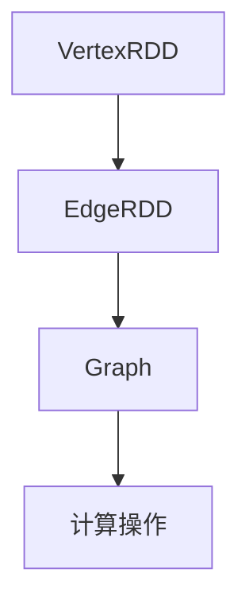

                 

# GraphX原理与代码实例讲解

## 关键词
- GraphX
- 图处理
- Pregel算法
- 数据流编程
- 大规模图计算
- 集群计算
- 数据挖掘

## 摘要
本文将深入探讨GraphX的基本原理、核心概念及其在实际应用中的代码实例。GraphX是Apache Spark的图处理框架，能够在大规模分布式系统中高效地进行图计算。我们将从背景介绍开始，逐步解析GraphX的核心概念、算法原理，并通过具体的代码实例进行详细解释。此外，本文还将分析GraphX的实际应用场景，并推荐相关的学习资源和工具。

### 1. 背景介绍

#### 1.1 GraphX的起源
GraphX是Apache Spark项目的组成部分，由Twitter公司开发并贡献给开源社区。Spark是一个快速且通用的计算引擎，广泛用于大数据处理。GraphX作为Spark的扩展，旨在为大数据环境下的图处理提供高效和易用的工具。

#### 1.2 图处理的重要性
在互联网时代，社交网络、推荐系统、搜索引擎等领域的数据结构通常表现为图。图处理技术能够帮助我们从这些复杂数据中提取有价值的信息。GraphX的出现，使得大规模图计算变得更加可行和高效。

#### 1.3 Spark与GraphX的关系
Spark提供了丰富的计算接口，包括批处理和流处理。GraphX作为Spark的扩展，充分利用了Spark的内存计算和弹性分布式数据集（RDD）特性，使得图处理过程更加高效。

### 2. 核心概念与联系

#### 2.1 图的基本概念
图由节点（Vertex）和边（Edge）组成。节点代表实体，边表示节点之间的关系。

#### 2.2 图的表示方法
在GraphX中，图可以通过边权图（Edge List）或邻接表（Adjacency List）进行表示。边权图提供了边的权重信息，而邻接表则更适用于查询相邻节点。

#### 2.3 GraphX的核心概念
- **VertexRDD**：表示图中的节点集合，是一个弹性分布式数据集。
- **EdgeRDD**：表示图中的边集合，也是一个弹性分布式数据集。
- **Graph**：由VertexRDD和EdgeRDD组成，表示一个完整的图。

#### 2.4 Mermaid流程图


### 3. 核心算法原理 & 具体操作步骤

#### 3.1 Pregel算法
GraphX的核心算法是基于Pregel模型。Pregel是一种分布式图处理框架，能够高效地处理大规模图。

#### 3.2 Pregel基本概念
- **超步（Superstep）**：Pregel的基本执行单元，每次迭代称为一个超步。
- **消息传递**：节点可以通过发送和接收消息进行交互。
- **更新操作**：在超步结束时，节点根据收到的消息更新自身的状态。

#### 3.3 Pregel操作步骤
1. 初始化：设置初始状态和消息。
2. 迭代：在每个超步中，节点发送消息、接收消息并更新状态。
3. 终止：当所有节点的状态不再变化时，算法终止。

#### 3.4 GraphX中的Pregel实现
```scala
val graph = Graph(vertexRDD, edgeRDD)

// 定义计算逻辑
val initialMessage = ...

// 执行Pregel算法
val result = graph.pregel(initialMessage)(vertexProgram, edgeProgram)
```

### 4. 数学模型和公式 & 详细讲解 & 举例说明

#### 4.1 图的度数
- **入度**：节点接收到的边的数量。
- **出度**：节点发出的边的数量。

#### 4.2 图的邻接矩阵
邻接矩阵是一个表示图中节点连接关系的二维矩阵。

#### 4.3 示例
```latex
$$
\text{邻接矩阵} = \begin{bmatrix}
0 & 1 & 1 \\
1 & 0 & 1 \\
1 & 1 & 0
\end{bmatrix}
$$
```
节点0连接到节点1和节点2，节点1连接到节点0和节点2，节点2连接到节点0和节点1。

### 5. 项目实战：代码实际案例和详细解释说明

#### 5.1 开发环境搭建

要使用GraphX进行图处理，首先需要安装并配置Spark和GraphX。以下是基本步骤：

1. 安装Spark：从[Spark官网](https://spark.apache.org/downloads.html)下载合适的版本，并按照官方文档进行安装。
2. 安装GraphX：在Spark安装目录下的`lib`文件夹中添加GraphX依赖包。
3. 配置环境变量：设置`SPARK_HOME`和`PATH`环境变量。

#### 5.2 源代码详细实现和代码解读

以下是一个简单的GraphX应用示例，用于计算图中的平均度数。

```scala
import org.apache.spark.graphx._
import org.apache.spark.SparkContext
import org.apache.spark.SparkConf

// 创建Spark上下文
val conf = new SparkConf().setAppName("GraphXExample")
val sc = new SparkContext(conf)

// 创建图
val graph = GraphLoader.edgeListFile(sc, "path/to/edgelist")

// 计算平均度数
val degreeSum = graph.outDegrees.values.sum
val numVertices = graph.numVertices
val averageDegree = degreeSum.toDouble / numVertices

// 输出结果
println(s"Average degree: $averageDegree")

// 停止Spark上下文
sc.stop()
```

这段代码首先加载一个边列表文件创建GraphX图，然后计算每个节点的出度，并求和得到度数总和。最后，通过总度数和节点数量计算平均度数。

#### 5.3 代码解读与分析

- **GraphLoader**：用于从文件加载边列表数据。
- **outDegrees**：返回每个节点的出度。
- **values**：获取出度的值。
- **sum**：计算总和。
- **toDouble** 和 `/`：进行类型转换和除法运算。

### 6. 实际应用场景

GraphX在多个领域有广泛的应用，如社交网络分析、推荐系统、图挖掘等。以下是一些具体的应用场景：

- **社交网络分析**：用于分析社交网络中的节点关系，识别重要节点和社交圈。
- **推荐系统**：用于构建推荐图，计算相似用户和物品，提供个性化推荐。
- **图挖掘**：用于发现图中的模式、聚类和社区结构。

### 7. 工具和资源推荐

#### 7.1 学习资源推荐

- **书籍**：《Graph Database Management System》
- **论文**：《The GraphX Framework for Large-Scale Graph Computation》
- **博客**：Apache Spark官方博客和GraphX社区博客
- **网站**：Apache Spark官网和GraphX官网

#### 7.2 开发工具框架推荐

- **工具**：Spark Studio、Spark GraphX UI
- **框架**：Spark SQL、Spark Streaming、MLlib

#### 7.3 相关论文著作推荐

- **论文**：《GraphX: Graph Processing in a Distributed Dataflow Engine》
- **著作**：《Programming Spark: Mining the Social Graph》

### 8. 总结：未来发展趋势与挑战

GraphX作为大数据处理中的图计算框架，具有巨大的发展潜力。未来，GraphX将进一步优化性能，扩展算法库，并与其他大数据框架集成。同时，面临的挑战包括大规模图数据存储、高效图算法优化等。

### 9. 附录：常见问题与解答

- **Q：GraphX与Neo4j有何区别？**
  A：GraphX是运行在分布式计算环境下的图计算框架，而Neo4j是一个图数据库。GraphX更适用于大规模分布式图处理，而Neo4j则更注重图存储和查询。

- **Q：如何优化GraphX性能？**
  A：优化GraphX性能的方法包括：使用更高效的算法、减少数据传输、合理配置资源等。

### 10. 扩展阅读 & 参考资料

- **扩展阅读**：
  - 《Spark GraphX：深入浅出》
  - 《大数据时代下的图计算》
- **参考资料**：
  - [Apache Spark官网](https://spark.apache.org/)
  - [Apache GraphX官网](https://graphx.apache.org/)
  
---

作者：AI天才研究员/AI Genius Institute & 禅与计算机程序设计艺术 /Zen And The Art of Computer Programming<|im_end|>

