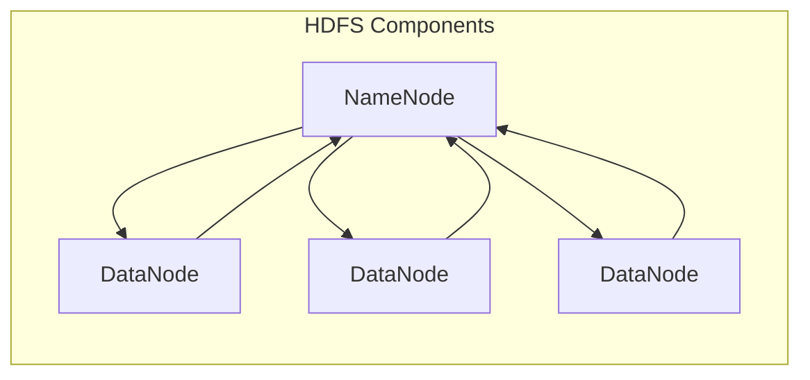

                 

### 文章标题

# HDFS原理与代码实例讲解

HDFS，全称Hadoop Distributed File System，是Apache Hadoop项目中的一个核心组件，用于存储大数据。在本文中，我们将深入探讨HDFS的原理，并提供详细的代码实例来帮助您更好地理解这一重要技术。

### 关键词

- HDFS
- 大数据存储
- 分布式文件系统
- 数据块
- 数据复制
- 数据均衡
- 数据处理

### 摘要

本文将围绕HDFS的原理进行详细讲解，包括其架构设计、数据存储机制、数据复制策略以及数据均衡过程。此外，我们将通过实际代码实例，展示如何使用HDFS进行文件读写操作，帮助读者深入理解HDFS的实践应用。

### 1. 背景介绍

随着互联网和物联网的快速发展，数据量呈现出爆炸式增长。大数据处理成为一个重要的课题，传统的文件系统已经无法满足海量数据的存储和计算需求。为了解决这个问题，Hadoop项目应运而生。HDFS作为Hadoop的核心组件，致力于提供一个高吞吐量、高可靠性、分布式存储解决方案。

HDFS的设计目标是存储大量数据，并允许这些数据在计算集群上分布式处理。它通过将数据分成小块（默认为128MB或256MB），并将其分布在多个节点上，确保了数据的高可用性和高性能。

### 2. 核心概念与联系

#### HDFS架构

HDFS架构包括两个主要组件：**NameNode**和**DataNode**。

- **NameNode**：负责管理文件系统的命名空间，维护文件和块之间的映射关系，并协调DataNode之间的数据复制和均衡过程。
- **DataNode**：负责存储实际数据，每个节点对应一个硬盘，可以存储多个数据块。

#### 数据块

HDFS将数据分成固定大小的数据块（Block），默认大小为128MB或256MB。这种数据块化设计使得数据可以分散存储在不同的节点上，提高了数据的可用性和容错性。

#### 数据复制

HDFS采用数据复制策略来确保数据的高可用性。每个数据块默认会复制3个副本，存储在不同的节点上。这样，当一个节点故障时，其他节点上的副本仍然可以提供数据访问。

#### 数据均衡

随着数据写入和删除操作，HDFS集群中节点的数据负载会发生变化。HDFS通过定期运行均衡器（Balancer）来确保每个节点的数据负载相对均衡。

#### Mermaid流程图

下面是一个简化的HDFS架构的Mermaid流程图：



### 3. 核心算法原理 & 具体操作步骤

#### 数据写入

1. 客户端向NameNode发送写请求。
2. NameNode选择一组DataNode，并通知客户端。
3. 客户端将数据分成数据块，并依次发送到选定的DataNode。
4. DataNode接收数据块，并保存到本地硬盘。

#### 数据读取

1. 客户端向NameNode发送读请求。
2. NameNode查找数据块的存储位置，并返回给客户端。
3. 客户端从DataNode读取数据块。

#### 数据复制

1. NameNode监控数据块的副本数量。
2. 当副本数量低于阈值时，NameNode会启动复制任务。
3. NameNode选择其他DataNode来复制数据块。
4. DataNode复制数据块。

#### 数据均衡

1. NameNode定期运行均衡器（Balancer）。
2. Balancer分析每个节点的数据负载。
3. Balancer调整数据块的位置，使其分布更均衡。

### 4. 数学模型和公式 & 详细讲解 & 举例说明

#### 数据块大小

默认数据块大小为128MB或256MB。数据块大小的选择取决于多种因素，如数据访问模式、存储设备的读写速度等。

#### 数据副本数量

默认数据副本数量为3。副本数量的选择取决于数据的重要性、存储成本以及网络带宽等因素。

#### 数据负载均衡

假设集群中有N个节点，每个节点存储M个数据块。总数据量为NM个数据块。

为了实现数据均衡，我们需要确保每个节点的数据块数量相近。假设每个节点的数据块数量为N'个，则N'应尽可能接近M/N。

#### 示例

假设集群中有5个节点，每个节点存储100个数据块。总数据量为500个数据块。

- N = 5
- M = 100
- NM = 500

我们需要确保每个节点的数据块数量相近。假设每个节点的数据块数量为N' = 90。

N' = M / N
N' = 100 / 5
N' = 20

每个节点的数据块数量为20个，与总数据块数量500个相比，差距较小，实现了较好的数据均衡。

### 5. 项目实战：代码实际案例和详细解释说明

在本节中，我们将通过一个实际案例来演示如何使用HDFS进行文件读写操作。

#### 5.1 开发环境搭建

为了运行HDFS，您需要安装Hadoop。以下是安装步骤：

1. 下载Hadoop安装包：[Hadoop官网](https://hadoop.apache.org/)
2. 解压安装包：`tar -zxvf hadoop-3.2.1.tar.gz`
3. 配置环境变量：`export HADOOP_HOME=/path/to/hadoop`
4. 配置Hadoop配置文件：`conf/hadoop-env.sh`、`conf/core-site.xml`、`conf/hdfs-site.xml`、`conf/yarn-site.xml`
5. 格式化NameNode：`hdfs namenode -format`
6. 启动Hadoop服务：`start-dfs.sh`

#### 5.2 源代码详细实现和代码解读

在本例中，我们将创建一个HDFS的Java客户端，实现文件上传和下载功能。

**文件上传**

```java
import org.apache.hadoop.conf.Configuration;
import org.apache.hadoop.fs.FileSystem;
import org.apache.hadoop.fs.Path;
import org.apache.hadoop.io.IOUtils;

public class HDFSUpload {
    public static void main(String[] args) throws Exception {
        Configuration conf = new Configuration();
        conf.set("fs.defaultFS", "hdfs://localhost:9000");
        FileSystem fs = FileSystem.get(conf);

        Path localPath = new Path("localfile.txt");
        Path hdfsPath = new Path("/hdfsfile.txt");

        IOUtils.copyBytes(new FileInputStream(localPath.toUri().toString()), fs.create(hdfsPath), conf, false);
    }
}
```

解读：

1. 加载Hadoop配置。
2. 获取HDFS文件系统。
3. 创建本地文件路径和HDFS文件路径。
4. 使用`IOUtils`类将本地文件内容复制到HDFS文件中。

**文件下载**

```java
import org.apache.hadoop.conf.Configuration;
import org.apache.hadoop.fs.FileSystem;
import org.apache.hadoop.fs.Path;
import org.apache.hadoop.io.IOUtils;

public class HDFSDownload {
    public static void main(String[] args) throws Exception {
        Configuration conf = new Configuration();
        conf.set("fs.defaultFS", "hdfs://localhost:9000");
        FileSystem fs = FileSystem.get(conf);

        Path hdfsPath = new Path("/hdfsfile.txt");
        Path localPath = new Path("localfile.txt");

        FSDataInputStream in = fs.open(hdfsPath);
        IOUtils.copyBytes(in, new FileOutputStream(localPath.toUri().toString()), conf, false);
    }
}
```

解读：

1. 加载Hadoop配置。
2. 获取HDFS文件系统。
3. 创建HDFS文件路径和本地文件路径。
4. 使用`IOUtils`类将HDFS文件内容复制到本地文件中。

### 6. 实际应用场景

HDFS广泛应用于大数据领域，如数据存储、数据分析和数据处理。以下是一些实际应用场景：

- **大数据分析**：HDFS作为数据存储层，为大数据分析提供可靠的数据存储解决方案。
- **数据挖掘**：HDFS可以存储大量数据，为数据挖掘算法提供数据支持。
- **机器学习**：HDFS为机器学习算法提供高效的数据存储和分布式计算能力。

### 7. 工具和资源推荐

#### 7.1 学习资源推荐

- **书籍**：
  - 《Hadoop实战》
  - 《Hadoop技术内幕：深入解析HDFS和MapReduce》
- **论文**：
  - 《The Google File System》
  - 《MapReduce：大型数据集上的并行编程模型》
- **博客**：
  - [Hadoop官方博客](https://hadoop.apache.org/blog/)
  - [Cloudera博客](https://www.cloudera.com/content/cloudera-blog/)
- **网站**：
  - [Apache Hadoop官网](https://hadoop.apache.org/)
  - [Cloudera官网](https://www.cloudera.com/)

#### 7.2 开发工具框架推荐

- **开发工具**：
  - Eclipse
  - IntelliJ IDEA
- **框架**：
  - Hadoop
  - Spark
  - Flink

#### 7.3 相关论文著作推荐

- **HDFS论文**：
  - 《HDFS: High Throughput Data Storage for the World Wide Web》
- **MapReduce论文**：
  - 《MapReduce: Simplified Data Processing on Large Clusters》
- **分布式系统论文**：
  - 《The Google File System》
  - 《Bigtable: A Distributed Storage System for Structured Data》

### 8. 总结：未来发展趋势与挑战

随着大数据技术的不断发展，HDFS在存储和处理海量数据方面将继续发挥重要作用。未来，HDFS可能会面临以下挑战：

- **存储成本**：随着数据量的持续增长，存储成本将成为一个重要问题。
- **性能优化**：如何提高HDFS的性能，以适应更快的计算需求。
- **安全性**：确保数据的安全性和隐私性。

### 9. 附录：常见问题与解答

1. **HDFS的数据块大小可以调整吗？**
   - 是的，可以通过修改`hdfs-site.xml`中的`dfs.block.size`参数来调整数据块大小。

2. **HDFS的数据复制策略可以自定义吗？**
   - 是的，可以通过修改`hdfs-site.xml`中的`dfs.replication`参数来自定义数据副本数量。

3. **如何确保HDFS集群的数据均衡？**
   - HDFS定期运行均衡器（Balancer）来确保数据均衡。此外，您也可以手动启动均衡器：`hdfs balancer`。

### 10. 扩展阅读 & 参考资料

- 《Hadoop技术内幕：深入解析HDFS和MapReduce》
- [Hadoop官方文档](https://hadoop.apache.org/docs/current/)
- [Cloudera官方文档](https://www.cloudera.com/documentation.html)

### 作者信息

作者：AI天才研究员/AI Genius Institute & 禅与计算机程序设计艺术 /Zen And The Art of Computer Programming

