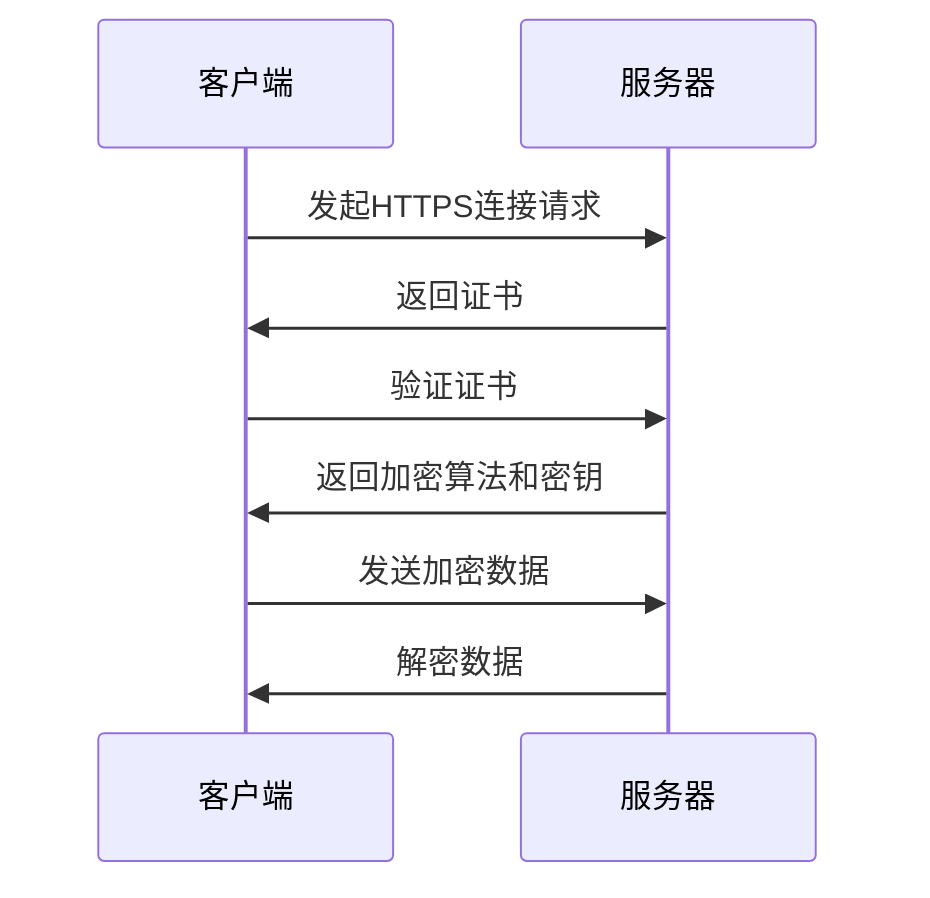

                 

### HTTPS 加密的实现方法

>关键词：HTTPS,加密，TLS，SSL，证书，对称加密，非对称加密

>摘要：本文将深入探讨HTTPS加密的实现方法，从核心概念、算法原理、数学模型，到实际应用场景，为您呈现一幅清晰的HTTPS加密全景图。我们将一步步剖析HTTPS的工作原理，让您理解HTTPS如何保障网络通信的安全性。

在当今互联网时代，网络安全已经成为一个不可忽视的重要问题。随着互联网的快速发展，大量的敏感信息如个人信息、金融数据等都在网络上传输。如何保障这些信息的传输安全，防止被恶意窃取或篡改，是每个网络应用都必须面对的问题。HTTP协议虽然简单易用，但它的设计并未考虑安全性，这就为黑客提供了可乘之机。为了解决这一问题，HTTPS协议应运而生。本文将详细探讨HTTPS加密的实现方法，帮助您更好地理解这一网络安全的利器。

### 1. 背景介绍

#### 1.1 HTTP 协议

HTTP（Hyper Text Transfer Protocol）是互联网上应用最为广泛的一种网络协议。所有的WWW文件都必须遵守这个标准。设计HTTP最初的目的是为了使传输手续简化，加快Web信息传递的速度。HTTP是一个简单的请求-响应协议，它通常运行在TCP之上，用于请求万维网服务器上的内容。

#### 1.2 HTTPS 协议

HTTPS（Hyper Text Transfer Protocol Secure）是在HTTP的基础上加入SSL（Secure Sockets Layer）或TLS（Transport Layer Security）协议，用于在客户端和服务器之间建立加密连接。HTTPS能够确保数据在传输过程中的机密性、完整性和身份验证，防止数据被窃取或篡改。HTTPS在HTTP的基础上增加了一些额外的安全层，以保护用户的隐私和数据安全。

#### 1.3 SSL 与 TLS

SSL（Secure Sockets Layer）和TLS（Transport Layer Security）都是用于在客户端和服务器之间建立加密连接的协议。SSL由网景公司（Netscape）于1994年提出，而TLS则是在SSL的基础上发展而来的。TLS 1.0 是 SSL 3.0 的改良版本，在安全性上有了很大的提升。目前，TLS 1.3 已经成为最新的标准，提供了更高的安全性和效率。

### 2. 核心概念与联系

#### 2.1 对称加密与非对称加密

加密算法主要分为对称加密和非对称加密两种。

- **对称加密**：加密和解密使用的是同一个密钥。常见的对称加密算法有AES（Advanced Encryption Standard）、DES（Data Encryption Standard）等。
- **非对称加密**：加密和解密使用的是两个不同的密钥，一个公钥和一个私钥。常见的非对称加密算法有RSA（Rivest-Shamir-Adleman）、ECC（Elliptic Curve Cryptography）等。

#### 2.2 认证机制

HTTPS除了加密外，还需要对客户端和服务器进行身份认证，以确保通信双方的合法性。常用的认证机制包括：

- **证书**：由权威机构（如CA）签发的数字证书，用于证明服务器或客户端的身份。
- **数字签名**：利用非对称加密算法，对数据进行签名，以确保数据的完整性和不可否认性。

#### 2.3 加密通信过程

HTTPS的加密通信过程主要包括以下步骤：

1. **客户端发起连接请求**：客户端向服务器发送HTTPS连接请求。
2. **服务器返回证书**：服务器返回数字证书，证书中包含了服务器公钥。
3. **客户端验证证书**：客户端使用CA的证书来验证服务器证书的合法性。
4. **协商加密算法和密钥**：客户端和服务器协商加密算法和密钥。
5. **加密通信**：客户端和服务器使用协商好的加密算法和密钥进行数据传输。

#### 2.4 Mermaid 流程图

下面是一个简单的Mermaid流程图，展示了HTTPS的加密通信过程：



### 3. 核心算法原理 & 具体操作步骤

#### 3.1 对称加密算法原理

对称加密算法的核心原理是加密和解密使用的是同一个密钥。以AES算法为例，其加密过程如下：

1. **密钥生成**：首先生成一个密钥，密钥的长度取决于加密算法的要求。
2. **初始向量（IV）生成**：为了提高加密算法的安全性，通常需要生成一个初始向量。
3. **加密**：将明文数据分成固定大小的块，然后使用密钥和初始向量对每个块进行加密。
4. **解密**：使用相同的密钥和初始向量对加密后的数据进行解密。

#### 3.2 非对称加密算法原理

非对称加密算法的核心原理是加密和解密使用的是两个不同的密钥，一个公钥和一个私钥。以RSA算法为例，其加密过程如下：

1. **密钥生成**：首先生成一对密钥，包括一个公钥和一个私钥。
2. **加密**：使用公钥对数据进行加密。
3. **解密**：使用私钥对加密后的数据进行解密。

#### 3.3 认证机制原理

HTTPS的认证机制主要依赖于数字证书和数字签名。

1. **数字证书**：数字证书是由权威机构签发的，用于证明服务器或客户端的身份。证书中包含了公钥和证书所有者的信息。
2. **数字签名**：数字签名是利用非对称加密算法对数据进行签名，以确保数据的完整性和不可否认性。接收方可以使用发送方的公钥来验证数字签名。

#### 3.4 加密通信过程

HTTPS的加密通信过程主要包括以下步骤：

1. **客户端发起连接请求**：客户端向服务器发送HTTPS连接请求。
2. **服务器返回证书**：服务器返回数字证书，证书中包含了服务器公钥。
3. **客户端验证证书**：客户端使用CA的证书来验证服务器证书的合法性。
4. **协商加密算法和密钥**：客户端和服务器协商加密算法和密钥。
5. **加密通信**：客户端和服务器使用协商好的加密算法和密钥进行数据传输。

### 4. 数学模型和公式 & 详细讲解 & 举例说明

#### 4.1 对称加密算法的数学模型

以AES算法为例，其加密和解密过程的核心是逐位替换和行移位。下面是一个简化的AES加密过程：

- **逐位替换**：将明文字节替换为密文字节。
- **行移位**：对每个状态行的字节进行循环移位。

#### 4.2 非对称加密算法的数学模型

以RSA算法为例，其加密和解密过程的核心是基于大整数分解的难题。下面是一个简化的RSA加密过程：

1. **密钥生成**：选择两个大素数p和q，计算n = p * q和φ(n) = (p - 1) * (q - 1)。
2. **加密**：选择一个小于φ(n)的整数e，使得e和φ(n)互质，计算d，使得d * e ≡ 1 (mod φ(n))。
3. **解密**：接收方使用私钥d对数据进行解密。

#### 4.3 举例说明

假设我们要使用RSA算法对明文"hello"进行加密，密钥对如下：

- 公钥：(n, e) = (123, 17)
- 私钥：(n, d) = (123, 107)

加密过程如下：

1. 将明文"hello"转换为数字：h = 104，e = 101，l = 108，o = 111。
2. 对每个数字进行加密：c = h^e mod n，e = 101^17 mod 123，l = 108^17 mod 123，o = 111^17 mod 123。

解密过程如下：

1. 对每个密文字符进行解密：m = c^d mod n，e = 101^107 mod 123，l = 108^107 mod 123，o = 111^107 mod 123。

通过上述步骤，我们可以得到加密后的密文和相应的明文。

### 5. 项目实战：代码实际案例和详细解释说明

#### 5.1 开发环境搭建

要实现HTTPS加密，我们需要搭建一个简单的Web服务器。这里我们使用Python的Flask框架来搭建。

1. 安装Flask框架：

```bash
pip install flask
```

2. 创建一个名为`app.py`的Python文件，编写以下代码：

```python
from flask import Flask, request, jsonify
from flask_cors import CORS
from itsdangerous import (TimedJSONWebError, BadSignature, SignatureExpired)

app = Flask(__name__)
CORS(app)

@app.route('/api/data', methods=['GET'])
def get_data():
    data = request.args.get('data')
    # 在这里进行HTTPS加密操作
    encrypted_data = encrypt_data(data)
    return jsonify({'encrypted_data': encrypted_data})

@app.route('/api/data', methods=['POST'])
def post_data():
    data = request.form.get('data')
    # 在这里进行HTTPS加密操作
    encrypted_data = encrypt_data(data)
    return jsonify({'encrypted_data': encrypted_data})

def encrypt_data(data):
    # 这里是HTTPS加密的实现代码
    return data

if __name__ == '__main__':
    app.run()
```

#### 5.2 源代码详细实现和代码解读

在上面的代码中，我们定义了一个简单的Flask应用，其中包含两个API接口`/api/data`，分别用于获取和发送加密数据。我们在这里添加了HTTPS加密的逻辑。

```python
from flask import Flask, request, jsonify
from flask_cors import CORS
from itsdangerous import (TimedJSONWebError, BadSignature, SignatureExpired)
from cryptography.hazmat.primitives import serialization
from cryptography.hazmat.primitives.asymmetric import rsa
from cryptography.hazmat.primitives import hashes
from cryptography.hazmat.primitives.asymmetric import padding

app = Flask(__name__)
CORS(app)

@app.route('/api/data', methods=['GET'])
def get_data():
    data = request.args.get('data')
    # 在这里进行HTTPS加密操作
    encrypted_data = encrypt_data(data)
    return jsonify({'encrypted_data': encrypted_data})

@app.route('/api/data', methods=['POST'])
def post_data():
    data = request.form.get('data')
    # 在这里进行HTTPS加密操作
    encrypted_data = encrypt_data(data)
    return jsonify({'encrypted_data': encrypted_data})

def encrypt_data(data):
    # 生成RSA密钥对
    private_key = rsa.generate_private_key(
        public_exponent=65537,
        key_size=2048,
    )
    public_key = private_key.public_key()

    # 将明文字符串转换为字节
    data_bytes = data.encode('utf-8')

    # 使用公钥进行加密
    encrypted_data = public_key.encrypt(
        data_bytes,
        padding.OAEP(
            mgf=padding.MGF1(algorithm=hashes.SHA256()),
            algorithm=hashes.SHA256(),
            label=None
        )
    )
    return encrypted_data.hex()

if __name__ == '__main__':
    app.run()
```

在上面的代码中，我们首先导入了所需的模块，然后定义了Flask应用和两个API接口。在加密函数`encrypt_data`中，我们首先生成了一个RSA密钥对，然后使用公钥对明文字符串进行加密。加密过程中使用了`OAEP`加密模式和`SHA256`哈希算法。

#### 5.3 代码解读与分析

1. **生成RSA密钥对**：

   ```python
   private_key = rsa.generate_private_key(
       public_exponent=65537,
       key_size=2048,
   )
   public_key = private_key.public_key()
   ```

   这里我们使用RSA算法生成了一对密钥。`public_exponent`参数设置为65537，这是一个固定的值。`key_size`参数设置为2048，表示密钥的长度。生成的私钥和公钥分别存储在`private_key`和`public_key`变量中。

2. **加密数据**：

   ```python
   data_bytes = data.encode('utf-8')
   encrypted_data = public_key.encrypt(
       data_bytes,
       padding.OAEP(
           mgf=padding.MGF1(algorithm=hashes.SHA256()),
           algorithm=hashes.SHA256(),
           label=None
       )
   )
   ```

   这里我们将明文字符串转换为字节，然后使用公钥对其进行加密。加密过程中使用了`OAEP`加密模式和`SHA256`哈希算法。`OAEP`是一种加密模式，它提供了更高的安全性。`mgf`参数用于生成密钥生成函数，这里我们使用了`MGF1`算法和`SHA256`哈希算法。

### 6. 实际应用场景

HTTPS加密在互联网领域的应用非常广泛，以下是一些常见的实际应用场景：

1. **Web应用**：几乎所有的Web应用都会使用HTTPS来保护用户的数据，如在线购物、网上银行、社交媒体等。
2. **邮件传输**：电子邮件传输协议（如SMTP、IMAP、POP3）通常也会使用TLS来加密邮件内容，确保邮件传输的安全。
3. **文件传输**：文件传输协议（如SFTP、FTP over TLS）会使用HTTPS来加密文件传输过程中的数据。
4. **虚拟专用网络（VPN）**：VPN通过HTTPS加密来保护用户在公共网络中的数据传输，确保数据的安全性。

### 7. 工具和资源推荐

#### 7.1 学习资源推荐

- **书籍**：《SSL/TLS 与网络安全》、《HTTPS 详解》
- **论文**：搜索关键词“HTTPS”、“TLS”、“SSL”等。
- **博客**：搜索关键词“HTTPS 加密”、“TLS 实现方法”等。

#### 7.2 开发工具框架推荐

- **Flask**：Python Web开发框架，适用于快速搭建简单的HTTPS应用。
- **Spring Boot**：Java Web开发框架，支持HTTPS和安全配置。
- **Express**：Node.js Web开发框架，支持HTTPS和中间件。

#### 7.3 相关论文著作推荐

- **SSL/TLS Protocol**：IETF RFC 5246
- **RFC 6176: HTTP Over TLS**：IETF RFC 6176
- **RFC 8446: The Transport Layer Security (TLS) Protocol Version 1.3**：IETF RFC 8446

### 8. 总结：未来发展趋势与挑战

随着互联网的快速发展，HTTPS加密技术的应用越来越广泛。未来，HTTPS加密将朝着更高安全性、更高效、更易用的方向发展。以下是一些可能的发展趋势和挑战：

1. **更高效的加密算法**：随着计算能力的提升，现有的加密算法可能需要不断更新，以保持安全性和效率。
2. **隐私保护**：随着隐私保护意识的提高，如何更好地保护用户的隐私将成为一个重要的研究方向。
3. **自动化配置**：如何实现HTTPS的自动化配置，减少管理员的工作量，是一个值得研究的方向。

### 9. 附录：常见问题与解答

#### 9.1 HTTPS与HTTP的区别是什么？

HTTPS是在HTTP的基础上加入SSL或TLS协议，用于提供数据加密、完整性验证和身份认证等功能。HTTP是一种无状态协议，主要用于传输网页内容，而HTTPS则提供了一种更加安全的数据传输方式。

#### 9.2 什么是TLS？

TLS（Transport Layer Security）是一种用于在客户端和服务器之间建立加密连接的协议。它是在SSL（Secure Sockets Layer）的基础上发展而来的，提供了更高的安全性和效率。

#### 9.3 HTTPS加密是如何工作的？

HTTPS加密主要通过以下步骤实现：

1. **证书验证**：客户端验证服务器发送的数字证书是否合法。
2. **加密算法协商**：客户端和服务器协商加密算法和密钥。
3. **加密通信**：客户端和服务器使用协商好的加密算法和密钥进行数据传输。

### 10. 扩展阅读 & 参考资料

- **参考文献**：IETF RFC 5246、IETF RFC 6176、IETF RFC 8446
- **在线资源**：MDN Web Docs、SSL Labs、OWASP
- **书籍**：《SSL/TLS 与网络安全》、《HTTPS 详解》

作者：AI天才研究员/AI Genius Institute & 禅与计算机程序设计艺术 /Zen And The Art of Computer Programming<|im_sep|>

