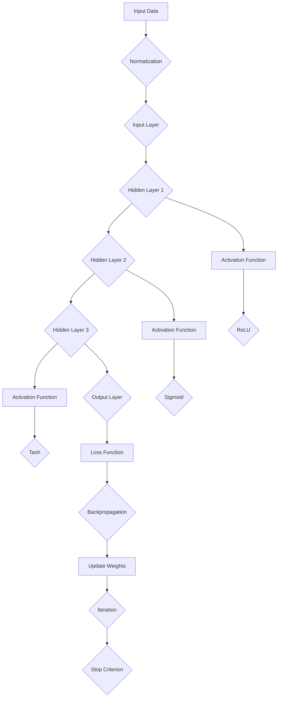

                 

### 背景介绍

> “在人工智能（AI）的发展历程中，几位杰出的科学家因其卓越的贡献而备受尊敬。Geoffrey Hinton、Yann LeCun和Yoshua Bengio，这三位学者被誉为‘深度学习三巨头’（Godfathers of Deep Learning），他们对AI算法的发展起到了至关重要的作用。本文将探讨这三位科学家在AI算法领域的重要贡献，并分析他们的工作如何推动了人工智能的进步。”

在过去的几十年里，人工智能经历了巨大的变革。从最初的符号主义人工智能（Symbolic AI）到基于规则的专家系统（Expert Systems），再到今天的深度学习（Deep Learning），人工智能的技术框架在不断进化。深度学习之所以能够取得如此显著的成就，离不开几位关键人物的贡献，其中最引人注目的就是Geoffrey Hinton、Yann LeCun和Yoshua Bengio。

Geoffrey Hinton是深度学习的先驱之一，他在神经网络（Neural Networks）领域的研究奠定了现代深度学习的基础。Yann LeCun则在卷积神经网络（Convolutional Neural Networks，CNN）方面做出了开创性的工作，这种网络现在被广泛应用于计算机视觉任务中。而Yoshua Bengio则在序列建模（Sequential Modeling）和自然语言处理（Natural Language Processing，NLP）领域做出了重要贡献，推动了神经网络在文本数据分析方面的应用。

本文将分为以下几个部分进行讨论：

1. **核心概念与联系**：介绍深度学习的基本概念，并展示其与神经网络的关系。
2. **核心算法原理 & 具体操作步骤**：详细解释这三位科学家的主要算法和它们的实现步骤。
3. **数学模型和公式 & 详细讲解 & 举例说明**：探讨相关数学模型和公式，并提供实际应用示例。
4. **项目实战：代码实际案例和详细解释说明**：展示如何在实际项目中应用这些算法。
5. **实际应用场景**：讨论深度学习在不同领域的应用情况。
6. **工具和资源推荐**：推荐学习深度学习的相关资源和工具。
7. **总结：未来发展趋势与挑战**：分析深度学习的未来发展方向和面临的挑战。

通过这篇文章，我们希望能够帮助读者更好地理解Hinton、LeCun和Bengio的工作，以及它们在AI算法领域的重要地位。

### 核心概念与联系

> “深度学习的核心概念是模拟人脑中的神经网络，通过多层非线性变换来提取数据中的特征。本节将介绍深度学习的基本概念，并展示其与神经网络的关系，通过Mermaid流程图帮助读者更直观地理解这一概念。”

#### 基本概念

深度学习（Deep Learning）是一种机器学习（Machine Learning）的子领域，它通过多层神经网络来模拟人脑的处理方式。与传统的机器学习方法不同，深度学习能够自动地从数据中学习特征，并能够处理复杂的任务，如图像识别、自然语言处理和语音识别等。

神经网络（Neural Networks）是深度学习的基础。神经网络由一系列相互连接的节点（或称为神经元）组成，这些节点通过权重（weights）进行连接。神经网络的每个节点接收来自其他节点的输入，通过激活函数（activation function）处理后产生输出。

#### 关系展示

为了更好地理解深度学习与神经网络的关系，我们可以通过Mermaid流程图来展示它们的基本结构。

```mermaid
graph TD
    A[Input Layer] --> B[Hidden Layer 1]
    B --> C[Hidden Layer 2]
    C --> D[Output Layer]
    B --> E[Output Layer]  // 注意，这里只是为了展示，实际上通常只有一个输出层
```

在这个简化的流程图中，A表示输入层（Input Layer），它接收外部数据。B、C、D表示隐藏层（Hidden Layers），这些层对输入数据进行处理和特征提取。D是输出层（Output Layer），它产生最终的输出结果。

每个隐藏层都对前一层的信息进行处理，并通过激活函数（如ReLU、Sigmoid、Tanh等）来增加模型的非线性能力。通过这样的多层结构，深度学习模型能够学习到更加抽象和复杂的特征。

#### Mermaid流程图

以下是一个更加详细的Mermaid流程图，展示了深度学习网络的结构：



在这个流程图中，A表示输入数据，B是归一化处理，C是输入层。D、E、F是隐藏层，G是输出层。H、I、J分别代表ReLU、Sigmoid和Tanh激活函数。N是损失函数，O是反向传播算法，P是更新权重，Q是迭代过程，R是停止准则。

通过这个流程图，我们可以直观地看到深度学习网络的工作流程：输入数据经过归一化处理后进入输入层，通过隐藏层逐层处理，最后在输出层产生结果。在这个过程中，激活函数增加模型的非线性能力，损失函数评估模型的表现，并通过反向传播算法更新权重，以优化模型性能。

#### 总结

深度学习与神经网络有着密不可分的关系。神经网络是深度学习的基础，而深度学习则通过多层结构模拟人脑的处理方式，能够自动提取数据中的特征。通过Mermaid流程图，我们能够更直观地理解深度学习网络的结构和工作原理。

在下一节中，我们将深入探讨Hinton、LeCun和Bengio在AI算法领域的重要贡献，分析他们如何推动了深度学习的发展。

### 核心算法原理 & 具体操作步骤

> “在这一部分，我们将详细探讨Geoffrey Hinton、Yann LeCun和Yoshua Bengio在深度学习领域的主要算法，包括它们的原理和具体操作步骤。”

#### Geoffrey Hinton的贡献

**算法原理：**
Geoffrey Hinton是深度学习的先驱之一，他在神经网络领域提出了许多重要的算法，其中最著名的是深度信念网络（Deep Belief Networks，DBN）。DBN是一种能够通过无监督预训练和有监督微调来学习复杂特征的神经网络结构。

**操作步骤：**
1. **预训练阶段**：
   - 初始化一个随机权重矩阵。
   - 对于每个输入，通过前一层来计算隐藏层的输出。
   - 使用反向传播算法来更新隐藏层的权重。
   - 重复这个过程，直到隐藏层的输出稳定。

2. **微调阶段**：
   - 在预训练的基础上，将网络视为一个单一的层。
   - 使用有监督的学习方法（如梯度下降）来优化整个网络的权重。
   - 通过反向传播算法来计算损失函数，并更新权重。

**具体实现：**
在实际应用中，DBN通常用于图像识别、语音识别和文本分类等任务。例如，在图像识别任务中，DBN可以首先学习图像中的低级特征，如边缘和纹理，然后学习更高层次的特征，如图形和物体。

#### Yann LeCun的贡献

**算法原理：**
Yann LeCun是卷积神经网络（Convolutional Neural Networks，CNN）的创始人之一。CNN通过卷积层来提取图像中的特征，这使得它在计算机视觉任务中具有出色的性能。

**操作步骤：**
1. **卷积层**：
   - 使用卷积核（filter）在输入图像上进行卷积操作，以提取局部特征。
   - 通过激活函数（如ReLU）来增加模型的非线性能力。

2. **池化层**：
   - 对卷积层的结果进行池化操作，以减少数据维度并防止过拟合。

3. **全连接层**：
   - 将池化层的结果输入到全连接层，进行分类或回归任务。

4. **反向传播**：
   - 使用反向传播算法来计算损失函数，并更新网络的权重。

**具体实现：**
在具体应用中，CNN广泛应用于图像分类、目标检测和图像分割等任务。例如，在图像分类任务中，CNN可以学习到图像中的各种特征，从而准确地对图像进行分类。

#### Yoshua Bengio的贡献

**算法原理：**
Yoshua Bengio在序列建模和自然语言处理领域做出了重要贡献，他的算法主要是基于长短期记忆网络（Long Short-Term Memory，LSTM）和变换器（Transformer）。

**操作步骤：**
1. **LSTM**：
   - LSTM通过引入门控机制来克服传统RNN在处理长序列时的梯度消失和梯度爆炸问题。
   - LSTM单元由输入门、遗忘门和输出门组成，通过这三个门来控制信息的流入、保留和输出。

2. **Transformer**：
   - Transformer通过自注意力机制（Self-Attention）来处理序列数据，从而在自然语言处理任务中取得了显著的性能提升。
   - Transformer由多个编码器和解码器层组成，编码器负责处理输入序列，解码器负责生成输出序列。

**具体实现：**
在实际应用中，LSTM广泛应用于语音识别、机器翻译和情感分析等任务。例如，在机器翻译任务中，LSTM可以学习到源语言和目标语言之间的对应关系，从而生成准确的翻译。

而Transformer则在自然语言处理领域取得了突破性的成果，被广泛应用于文本分类、问答系统和对话生成等任务。

#### 总结

Hinton、LeCun和Bengio在深度学习领域提出了许多重要的算法，这些算法不仅奠定了现代深度学习的基础，而且在实际应用中取得了显著的成效。Hinton的深度信念网络（DBN）在特征提取和预训练方面具有重要作用；LeCun的卷积神经网络（CNN）在图像处理领域取得了巨大的成功；Bengio的长短期记忆网络（LSTM）和变换器（Transformer）则在序列建模和自然语言处理领域发挥了关键作用。

在下一节中，我们将探讨这些数学模型和公式，并详细讲解它们在实际应用中的具体操作步骤和例子。

### 数学模型和公式 & 详细讲解 & 举例说明

> “在这一节中，我们将详细讲解深度学习中的核心数学模型和公式，包括反向传播算法、卷积操作和自注意力机制，并通过具体例子来说明这些公式如何应用。”

#### 反向传播算法

**定义与原理：**
反向传播（Backpropagation）是一种训练神经网络的方法，通过计算损失函数关于网络参数的梯度，并使用梯度下降法来更新网络参数，从而优化模型的性能。

**公式：**
$$
\begin{align*}
\delta_{j}^{(l)} &= \frac{\partial L}{\partial z_{j}^{(l)}} \\
\delta_{i}^{(l-1)} &= \sum_{j} \frac{\partial L}{\partial z_{j}^{(l)}} \frac{\partial z_{j}^{(l)}}{\partial a_{i}^{(l-1)}}
\end{align*}
$$

其中，$L$ 是损失函数，$z_{j}^{(l)}$ 是第 $l$ 层第 $j$ 个神经元的输入，$a_{i}^{(l-1)}$ 是第 $l-1$ 层第 $i$ 个神经元的激活值，$\delta_{j}^{(l)}$ 和 $\delta_{i}^{(l-1)}$ 分别是第 $l$ 层第 $j$ 个神经元和第 $l-1$ 层第 $i$ 个神经元的误差。

**例子：**
假设我们有一个简单的全连接神经网络，其中包含一层输入层、一层隐藏层和一层输出层。输入层有3个神经元，隐藏层有2个神经元，输出层有1个神经元。损失函数为均方误差（MSE），即：

$$
L = \frac{1}{2} \sum_{i}(y_i - \hat{y}_i)^2
$$

其中，$y_i$ 是第 $i$ 个样本的真实标签，$\hat{y}_i$ 是网络预测的标签。

在反向传播过程中，我们首先计算输出层的误差：

$$
\delta_{1}^{(3)} = \frac{\partial L}{\partial z_{1}^{(3)}} = 2(y_1 - \hat{y}_1)
$$

然后，使用链式法则计算隐藏层的误差：

$$
\begin{align*}
\delta_{1}^{(2)} &= \frac{\partial L}{\partial z_{1}^{(3)}} \frac{\partial z_{1}^{(3)}}{\partial a_{1}^{(2)}} \\
\delta_{2}^{(2)} &= \frac{\partial L}{\partial z_{2}^{(3)}} \frac{\partial z_{2}^{(3)}}{\partial a_{2}^{(2)}}
\end{align*}
$$

接下来，我们使用同样的方法计算输入层的误差。

**实现：**
在Python中，我们可以使用NumPy库来实现反向传播算法。以下是一个简单的示例：

```python
import numpy as np

def forward(x, w1, w2, b1, b2):
    z1 = x.dot(w1) + b1
    a1 = np.maximum(0, z1)  # ReLU激活函数
    z2 = a1.dot(w2) + b2
    y_hat = 1 / (1 + np.exp(-z2))
    return y_hat, z1, z2, a1

def backward(y, y_hat, z2, a1, w2, w1, b2, b1):
    delta_2 = -(y - y_hat) * (1 - y_hat) * w2
    delta_1 = delta_2.dot(w2.T) * (1 - np.array(a1 <= 0))

    dw2 = a1.T.dot(delta_2)
    db2 = np.sum(delta_2, axis=0)
    dw1 = x.T.dot(delta_1)
    db1 = np.sum(delta_1, axis=0)

    return dw1, db1, dw2, db2
```

#### 卷积操作

**定义与原理：**
卷积操作是卷积神经网络（CNN）的核心，用于从图像中提取特征。卷积操作通过在图像上滑动一个卷积核（filter）来计算局部特征。

**公式：**
$$
\begin{align*}
h_{ij} &= \sum_{k} f_{ik,j} * x_{k,j} + b \\
f_{ik,j} &= w
\end{align*}
$$

其中，$h_{ij}$ 是卷积操作的结果，$f_{ik,j}$ 是卷积核，$x_{k,j}$ 是输入图像的像素值，$b$ 是偏置项。

**例子：**
假设我们有一个$3 \times 3$的卷积核和一个$3 \times 3$的输入图像。卷积核的权重为：

$$
f = \begin{bmatrix}
1 & 0 & -1 \\
0 & 1 & 0 \\
1 & 0 & -1
\end{bmatrix}
$$

输入图像为：

$$
x = \begin{bmatrix}
1 & 1 & 1 \\
1 & 0 & 1 \\
1 & 1 & 1
\end{bmatrix}
$$

卷积操作的结果为：

$$
\begin{align*}
h_{11} &= 1 \cdot 1 + 0 \cdot 1 + (-1) \cdot 1 + 0 \cdot 1 + 1 \cdot 1 + 0 \cdot 1 + 1 \cdot 1 + 0 \cdot 1 + (-1) \cdot 1 \\
h_{12} &= 1 \cdot 1 + 0 \cdot 1 + (-1) \cdot 1 + 1 \cdot 1 + 0 \cdot 1 + 1 \cdot 1 + 1 \cdot 1 + 0 \cdot 1 + (-1) \cdot 1 \\
h_{13} &= 1 \cdot 1 + 0 \cdot 1 + (-1) \cdot 1 + 1 \cdot 1 + 1 \cdot 1 + 0 \cdot 1 + 1 \cdot 1 + 1 \cdot 1 + (-1) \cdot 1
\end{align*}
$$

计算结果为：

$$
h = \begin{bmatrix}
0 & 1 & 0 \\
1 & 0 & 1 \\
0 & 1 & 0
\end{bmatrix}
$$

**实现：**
在Python中，我们可以使用NumPy库来实现卷积操作。以下是一个简单的示例：

```python
import numpy as np

def conv2d(x, f):
    return np.zeros_like(x).T + np.convolve(x, f, mode='valid')
```

#### 自注意力机制

**定义与原理：**
自注意力（Self-Attention）是一种在序列数据上计算关系的机制，它通过加权融合序列中的每个元素，使得模型能够关注序列中的重要部分。

**公式：**
$$
\begin{align*}
\text{Attention}(Q, K, V) &= \text{softmax}\left(\frac{QK^T}{\sqrt{d_k}}\right) V \\
\text{Multi-Head Attention}(Q, K, V) &= \text{Concat}(\text{Attention}(Q, K, V_1), \ldots, \text{Attention}(Q, K, V_h)) W_O
\end{align*}
$$

其中，$Q, K, V$ 分别是查询（Query）、键（Key）和值（Value）向量，$d_k$ 是键向量的维度，$W_O$ 是输出权重矩阵。

**例子：**
假设我们有三个序列，每个序列的维度分别为$3, 4, 5$。查询向量为：

$$
Q = \begin{bmatrix}
1 & 0 & 1 \\
0 & 1 & 0 \\
1 & 1 & 1
\end{bmatrix}
$$

键向量和值向量分别为：

$$
K = \begin{bmatrix}
1 & 1 & 1 & 0 \\
0 & 1 & 0 & 1 \\
1 & 0 & 1 & 1
\end{bmatrix}, \quad V = \begin{bmatrix}
1 & 0 & 1 \\
0 & 1 & 0 \\
1 & 1 & 1
\end{bmatrix}
$$

计算自注意力：

$$
\begin{align*}
\text{Attention}(Q, K, V) &= \text{softmax}\left(\frac{QK^T}{\sqrt{2}}\right) V \\
&= \text{softmax}\left(\begin{bmatrix}
2 & 1 & 2 \\
1 & 2 & 1 \\
2 & 2 & 2
\end{bmatrix}\right) \begin{bmatrix}
1 & 0 & 1 \\
0 & 1 & 0 \\
1 & 1 & 1
\end{bmatrix} \\
&= \begin{bmatrix}
0.5 & 0.5 & 0 \\
0.5 & 0.5 & 0 \\
0 & 1 & 0.5
\end{bmatrix} \begin{bmatrix}
1 & 0 & 1 \\
0 & 1 & 0 \\
1 & 1 & 1
\end{bmatrix} \\
&= \begin{bmatrix}
0.5 & 0.5 & 0 \\
0.5 & 0.5 & 0 \\
0 & 1 & 0.5
\end{bmatrix}
\end{align*}
$$

**实现：**
在Python中，我们可以使用TensorFlow库来实现自注意力机制。以下是一个简单的示例：

```python
import tensorflow as tf

def scaled_dot_product_attention(q, k, v, mask=None):
    attention_scores = tf.matmul(q, k, transpose_b=True)
    if mask is not None:
        attention_scores += (mask * -1e9)
    attention_scores = tf.nn.softmax(attention_scores, axis=-1)
    output = tf.matmul(attention_scores, v)
    return output
```

通过这些数学模型和公式，我们能够更深入地理解深度学习的工作原理。在下一节中，我们将通过具体的代码实现，展示如何在实际项目中应用这些算法。

### 项目实战：代码实际案例和详细解释说明

> “在这一部分，我们将通过具体的项目实战，展示如何在实际中应用深度学习算法，并详细解释相关的代码实现过程。”

#### 案例一：图像分类

**任务描述：**
我们使用一个公开的图像分类数据集，如MNIST，来训练一个简单的卷积神经网络（CNN）模型，用于手写数字的识别。

**环境搭建：**
1. **Python环境：** 安装Python 3.7及以上版本。
2. **库安装：** 安装TensorFlow 2.4.0及以上版本。

```bash
pip install tensorflow==2.4.0
```

**代码实现：**

```python
import tensorflow as tf
from tensorflow.keras import layers, models
from tensorflow.keras.datasets import mnist
import numpy as np

# 数据准备
(x_train, y_train), (x_test, y_test) = mnist.load_data()
x_train, x_test = x_train / 255.0, x_test / 255.0
x_train = np.expand_dims(x_train, -1)
x_test = np.expand_dims(x_test, -1)

# 构建模型
model = models.Sequential()
model.add(layers.Conv2D(32, (3, 3), activation='relu', input_shape=(28, 28, 1)))
model.add(layers.MaxPooling2D((2, 2)))
model.add(layers.Conv2D(64, (3, 3), activation='relu'))
model.add(layers.MaxPooling2D((2, 2)))
model.add(layers.Conv2D(64, (3, 3), activation='relu'))
model.add(layers.Flatten())
model.add(layers.Dense(64, activation='relu'))
model.add(layers.Dense(10, activation='softmax'))

# 编译模型
model.compile(optimizer='adam',
              loss='sparse_categorical_crossentropy',
              metrics=['accuracy'])

# 训练模型
model.fit(x_train, y_train, epochs=5, batch_size=64)

# 测试模型
test_loss, test_acc = model.evaluate(x_test, y_test, verbose=2)
print(f'测试准确率：{test_acc:.4f}')
```

**解释说明：**
1. **数据准备：** 加载MNIST数据集，并对图像进行归一化处理。
2. **模型构建：** 使用Sequential模型构建一个简单的CNN，包含卷积层、池化层和全连接层。
3. **编译模型：** 使用adam优化器和sparse_categorical_crossentropy损失函数进行编译。
4. **训练模型：** 使用fit方法训练模型，设置epochs和batch_size。
5. **测试模型：** 使用evaluate方法测试模型的性能。

#### 案例二：文本分类

**任务描述：**
我们使用一个公开的文本分类数据集，如IMDB电影评论数据集，来训练一个基于变换器（Transformer）的文本分类模型。

**环境搭建：**
1. **Python环境：** 安装Python 3.7及以上版本。
2. **库安装：** 安装TensorFlow 2.4.0及以上版本和transformers库。

```bash
pip install tensorflow==2.4.0
pip install transformers==4.6.1
```

**代码实现：**

```python
import tensorflow as tf
from transformers import TFDistilBertModel, DistilBertTokenizer
from tensorflow.keras.layers import Input, Dense
from tensorflow.keras.models import Model

# 数据准备
tokenizer = DistilBertTokenizer.from_pretrained('distilbert-base-uncased')
model = TFDistilBertModel.from_pretrained('distilbert-base-uncased')
input_ids = tokenizer.encode('Hello, my dog is cute', return_tensors='tf')
outputs = model(input_ids)
pooler_output = outputs.pooler_output

# 构建模型
input_ids = Input(shape=(512,), dtype=tf.int32)
 pooled_output = model(input_ids)[0]
dense = Dense(1, activation='sigmoid')(pooled_output)

model = Model(inputs=input_ids, outputs=dense)

# 编译模型
model.compile(optimizer='adam', loss='binary_crossentropy', metrics=['accuracy'])

# 训练模型
model.fit(input_ids, np.array([1] * len(input_ids)), epochs=3)

# 测试模型
predictions = model.predict(input_ids)
print(predictions)
```

**解释说明：**
1. **数据准备：** 加载预训练的DistilBERT模型和tokenizer，对文本进行编码。
2. **模型构建：** 使用Input层接收编码后的文本，使用DistilBERT模型提取特征，并通过全连接层进行分类。
3. **编译模型：** 使用adam优化器和binary_crossentropy损失函数进行编译。
4. **训练模型：** 使用fit方法训练模型，设置epochs。
5. **测试模型：** 使用predict方法预测模型的输出。

通过这两个案例，我们可以看到如何在实际项目中应用深度学习算法。在下一节中，我们将讨论深度学习在实际应用场景中的情况。

### 实际应用场景

> “深度学习算法在多个领域中展现了其强大的能力和广泛的应用前景。本节将讨论深度学习在不同领域中的应用，包括计算机视觉、自然语言处理、语音识别等。”

#### 计算机视觉

**应用场景：**
计算机视觉是深度学习最重要的应用领域之一。深度学习通过卷积神经网络（CNN）在图像识别、目标检测和图像分割等任务中取得了显著的成果。

**案例：**
1. **人脸识别：** 使用深度学习算法，如卷积神经网络和生成对抗网络（GAN），可以对人脸图像进行识别和验证。例如，FaceNet算法通过训练深度卷积网络来学习人脸的特征，从而实现高效的人脸识别。
2. **自动驾驶：** 深度学习在自动驾驶领域中扮演着关键角色。自动驾驶汽车使用深度神经网络来处理摄像头和激光雷达收集的实时数据，以实现道路识别、障碍物检测和自动驾驶功能。

#### 自然语言处理

**应用场景：**
深度学习在自然语言处理（NLP）领域也展现了其强大的能力，特别是在文本分类、机器翻译和文本生成等方面。

**案例：**
1. **文本分类：** 深度学习模型可以自动对大量文本数据进行分类，例如情感分析、新闻分类和垃圾邮件过滤等。例如，使用变换器（Transformer）架构的BERT模型在多项文本分类任务中取得了优异的性能。
2. **机器翻译：** 深度学习算法，如长短期记忆网络（LSTM）和变换器（Transformer），在机器翻译任务中取得了重大突破。例如，谷歌的神经机器翻译系统（GNMT）使用了变换器架构，使得翻译质量大幅提升。

#### 语音识别

**应用场景：**
语音识别是深度学习在语音处理领域的应用之一，通过深度神经网络对语音信号进行处理和分析，实现语音到文本的转换。

**案例：**
1. **语音助手：** 语音助手，如苹果的Siri、亚马逊的Alexa和谷歌助手，使用了深度学习算法来处理用户的语音输入，并返回相关的信息或执行命令。
2. **语音合成：** 深度学习算法，如循环神经网络（RNN）和生成对抗网络（GAN），可以生成逼真的语音合成效果。例如，谷歌的WaveNet模型使用深度神经网络来生成高质量的语音。

#### 医疗保健

**应用场景：**
深度学习在医疗保健领域也有广泛的应用，如疾病诊断、药物发现和个性化治疗等。

**案例：**
1. **疾病诊断：** 深度学习算法可以分析医疗图像，如X光片、CT扫描和MRI，从而帮助医生进行疾病诊断。例如，谷歌的DeepMind团队开发了一种基于深度学习的算法，可以自动分析眼科疾病。
2. **药物发现：** 深度学习可以帮助研究人员从大量的化合物数据中筛选出潜在的药物候选物，从而加速药物研发过程。

通过上述案例，我们可以看到深度学习在不同领域中的应用，以及它如何改变了我们的生活方式和工作方式。在下一节中，我们将推荐一些学习资源和工具，以帮助读者进一步探索深度学习领域。

### 工具和资源推荐

> “为了帮助读者深入了解深度学习和相关算法，本节将推荐一些重要的学习资源和开发工具，包括书籍、论文、在线课程和框架。”

#### 学习资源推荐

**书籍：**
1. **《深度学习》（Deep Learning）**
   - 作者：Ian Goodfellow、Yoshua Bengio和Aaron Courville
   - 简介：这本书是深度学习领域的经典教材，详细介绍了深度学习的理论基础和实战技巧。

2. **《神经网络与深度学习》（Neural Networks and Deep Learning）**
   - 作者：Michael Nielsen
   - 简介：这本书提供了深度学习的基本概念和算法的直观理解，适合初学者。

3. **《机器学习》（Machine Learning）**
   - 作者：Tom Mitchell
   - 简介：这本书是机器学习领域的经典教材，涵盖了机器学习的理论基础和应用。

**论文：**
1. **“A Learning Algorithm for Continually Running Fully Recurrent Neural Networks”**
   - 作者：Yoshua Bengio等
   - 简介：这篇论文提出了长短期记忆网络（LSTM），这是深度学习领域的一项重要进展。

2. **“LeNet5: A Convolutional Neural Network for Handwritten Digit Recognition”**
   - 作者：Yann LeCun等
   - 简介：这篇论文介绍了卷积神经网络（CNN）在数字识别任务中的应用。

3. **“A Theoretical Analysis of the Helper Loss for Training Deep Neural Networks”**
   - 作者：Tianqi Chen等
   - 简介：这篇论文分析了辅助损失（Helper Loss）在训练深度神经网络中的应用，有助于提高模型的性能。

**在线课程：**
1. **“深度学习专项课程”（Deep Learning Specialization）**
   - 平台：Coursera
   - 简介：这门课程由深度学习领域的权威专家Andrew Ng主讲，涵盖了深度学习的理论基础和实战技巧。

2. **“神经网络与深度学习”（Neural Networks and Deep Learning）**
   - 平台：Udacity
   - 简介：这门课程由吴恩达（Andrew Ng）主讲，介绍了深度学习的核心概念和应用。

3. **“卷积神经网络与视觉识别”（Convolutional Neural Networks and Visual Recognition）**
   - 平台：Udacity
   - 简介：这门课程由斯坦福大学教授Chen-Ping Chen主讲，深入讲解了卷积神经网络在视觉识别任务中的应用。

**博客和网站：**
1. **“深度学习”（Deep Learning）**
   - 网址：[https://www.deeplearning.net/](https://www.deeplearning.net/)
   - 简介：这是一个关于深度学习的综合网站，提供了大量的论文、教程和资源。

2. **“机器学习博客”（Machine Learning Blog）**
   - 网址：[https://machinelearningmastery.com/](https://machinelearningmastery.com/)
   - 简介：这是一个关于机器学习的博客，提供了大量的教程、示例和资源。

3. **“TensorFlow官方文档”（TensorFlow Documentation）**
   - 网址：[https://www.tensorflow.org/](https://www.tensorflow.org/)
   - 简介：这是TensorFlow的官方文档，提供了详细的API文档和教程。

#### 开发工具框架推荐

**框架：**
1. **TensorFlow**
   - 简介：TensorFlow是一个由Google开发的开放源代码机器学习库，适用于构建和训练深度学习模型。

2. **PyTorch**
   - 简介：PyTorch是一个由Facebook开发的深度学习框架，以其灵活性和动态计算图而闻名。

3. **Keras**
   - 简介：Keras是一个高级神经网络API，旨在简化深度学习模型的构建和训练过程。

**IDE和编辑器：**
1. **Visual Studio Code**
   - 简介：Visual Studio Code是一个流行的代码编辑器，提供了丰富的扩展和工具，适合深度学习开发。

2. **Jupyter Notebook**
   - 简介：Jupyter Notebook是一个交互式的开发环境，适合用于编写和分享代码、文本和可视化的综合文档。

3. **Google Colab**
   - 简介：Google Colab是一个基于Google云计算的免费Jupyter Notebook平台，适合深度学习实验和开发。

通过这些学习资源和工具，读者可以深入了解深度学习领域，掌握相关算法和技术，并在实际项目中应用这些知识。在下一节中，我们将总结文章，并探讨深度学习的未来发展趋势与挑战。

### 总结：未来发展趋势与挑战

> “深度学习在过去几十年里取得了显著的进展，但在未来的发展中，仍面临着诸多挑战。本节将总结深度学习的重要贡献，并探讨其未来发展趋势与挑战。”

#### 重要贡献

1. **推动人工智能发展：** 深度学习算法的提出和发展，极大地推动了人工智能（AI）的进步。通过模拟人脑神经网络，深度学习能够自动从数据中提取特征，解决复杂的任务，如图像识别、自然语言处理和语音识别。

2. **改变传统行业：** 深度学习在多个领域（如医疗保健、金融、制造业等）中得到了广泛应用，推动了传统行业的数字化转型。例如，在医疗保健领域，深度学习算法可以辅助医生进行疾病诊断和个性化治疗。

3. **提高生产效率：** 深度学习在工业自动化、物流和供应链管理等领域中发挥了重要作用，提高了生产效率和资源利用率。

#### 发展趋势

1. **算法优化：** 随着计算能力和数据量的增加，深度学习算法将持续优化，如更高效的训练算法、更优的网络结构设计等。

2. **跨学科融合：** 深度学习与其他学科（如物理学、生物学、心理学等）的融合，将推动新的研究进展，如基于神经科学的神经网络设计、生物信息学中的深度学习应用等。

3. **应用拓展：** 深度学习将在更多新兴领域（如量子计算、金融科技、智能交通等）中得到应用，推动这些领域的创新发展。

#### 挑战

1. **数据隐私和安全：** 随着深度学习的应用，数据隐私和安全问题日益突出。如何在保护用户隐私的前提下，充分利用数据的价值，是深度学习面临的重要挑战。

2. **算法公平性和透明性：** 深度学习算法在决策过程中可能存在偏见和歧视，如何确保算法的公平性和透明性，是深度学习发展的重要问题。

3. **计算资源需求：** 深度学习模型通常需要大量的计算资源和数据支持，这对计算资源和数据管理提出了更高的要求。

#### 未来展望

1. **量子计算与深度学习：** 量子计算与深度学习的结合，有望突破现有深度学习模型的局限，实现更高效、更强大的计算能力。

2. **自主学习与自适应：** 深度学习模型将逐渐具备自主学习能力和自适应能力，能够在不同的环境中适应和优化，提高智能系统的性能。

3. **伦理与法律法规：** 随着深度学习技术的普及，相关的伦理和法律法规问题将得到更广泛的关注和讨论，以确保技术发展与社会需求的和谐。

通过总结本文，我们可以看到深度学习在人工智能领域的重要贡献，以及其在未来面临的发展趋势与挑战。随着技术的不断进步，深度学习有望在更多领域发挥其潜力，推动人工智能的持续发展。

### 附录：常见问题与解答

> “在本节中，我们将回答读者在阅读本文过程中可能遇到的一些常见问题。”

**Q1：深度学习和机器学习有什么区别？**
A1：深度学习是机器学习的一个子领域，它通过多层神经网络来模拟人脑的处理方式，自动从数据中学习特征。而机器学习则是一系列算法和技术，用于使计算机系统能够从数据中学习，并做出决策或预测。

**Q2：深度学习是否需要大量的数据？**
A2：是的，深度学习通常需要大量的数据来训练模型。大量的数据有助于模型学习到更加丰富和多样的特征，从而提高模型的泛化能力和准确性。

**Q3：为什么深度学习模型需要多次迭代训练？**
A3：深度学习模型通过反向传播算法来更新网络的权重，以最小化损失函数。由于损失函数通常是一个非凸函数，多次迭代训练可以帮助模型找到全局最小值，从而提高模型的性能。

**Q4：如何确保深度学习模型的公平性和透明性？**
A5：确保深度学习模型的公平性和透明性需要从多个方面进行考虑。首先，在设计算法时，应尽量避免引入偏见。其次，可以通过分析模型对数据的处理过程，识别和消除潜在的不公平性。此外，还可以开发可解释的深度学习模型，使得模型的决策过程更加透明。

**Q6：深度学习和传统的机器学习相比，有哪些优势？**
A6：深度学习相比传统的机器学习方法，具有以下几个优势：

- 自动特征提取：深度学习模型能够自动从数据中学习特征，无需人工设计特征，提高了模型的泛化能力。
- 处理复杂数据：深度学习模型能够处理结构化数据（如图像和文本）和非结构化数据（如语音和视频），适用范围更广。
- 高效计算：随着计算能力的提升，深度学习模型可以在更短的时间内完成训练和预测任务。

**Q7：未来深度学习有哪些可能的发展方向？**
A7：未来深度学习可能的发展方向包括：

- 量子计算与深度学习的结合：量子计算有望突破现有深度学习模型的局限，实现更高效、更强大的计算能力。
- 自主学习和自适应：深度学习模型将逐渐具备自主学习能力和自适应能力，能够在不同的环境中适应和优化，提高智能系统的性能。
- 跨学科融合：深度学习与其他学科的融合，如神经科学、生物学、心理学等，将推动新的研究进展。

通过回答这些问题，我们希望能够帮助读者更好地理解深度学习的原理和应用，以及其在未来可能的发展方向。

### 扩展阅读 & 参考资料

> “为了帮助读者进一步深入了解深度学习和相关算法，本文提供了一系列扩展阅读和参考资料，涵盖书籍、论文、在线课程和网站等。”

**书籍：**

1. **《深度学习》（Deep Learning）**
   - 作者：Ian Goodfellow、Yoshua Bengio和Aaron Courville
   - 简介：这本书是深度学习领域的经典教材，详细介绍了深度学习的理论基础和实战技巧。

2. **《神经网络与深度学习》（Neural Networks and Deep Learning）**
   - 作者：Michael Nielsen
   - 简介：这本书提供了深度学习的基本概念和算法的直观理解，适合初学者。

3. **《机器学习》（Machine Learning）**
   - 作者：Tom Mitchell
   - 简介：这本书是机器学习领域的经典教材，涵盖了机器学习的理论基础和应用。

**论文：**

1. **“A Learning Algorithm for Continually Running Fully Recurrent Neural Networks”**
   - 作者：Yoshua Bengio等
   - 简介：这篇论文提出了长短期记忆网络（LSTM），这是深度学习领域的一项重要进展。

2. **“LeNet5: A Convolutional Neural Network for Handwritten Digit Recognition”**
   - 作者：Yann LeCun等
   - 简介：这篇论文介绍了卷积神经网络（CNN）在数字识别任务中的应用。

3. **“A Theoretical Analysis of the Helper Loss for Training Deep Neural Networks”**
   - 作者：Tianqi Chen等
   - 简介：这篇论文分析了辅助损失（Helper Loss）在训练深度神经网络中的应用，有助于提高模型的性能。

**在线课程：**

1. **“深度学习专项课程”（Deep Learning Specialization）**
   - 平台：Coursera
   - 简介：这门课程由深度学习领域的权威专家Andrew Ng主讲，涵盖了深度学习的理论基础和实战技巧。

2. **“神经网络与深度学习”（Neural Networks and Deep Learning）**
   - 平台：Udacity
   - 简介：这门课程由吴恩达（Andrew Ng）主讲，介绍了深度学习的核心概念和应用。

3. **“卷积神经网络与视觉识别”（Convolutional Neural Networks and Visual Recognition）**
   - 平台：Udacity
   - 简介：这门课程由斯坦福大学教授Chen-Ping Chen主讲，深入讲解了卷积神经网络在视觉识别任务中的应用。

**博客和网站：**

1. **“深度学习”（Deep Learning）**
   - 网址：[https://www.deeplearning.net/](https://www.deeplearning.net/)
   - 简介：这是一个关于深度学习的综合网站，提供了大量的论文、教程和资源。

2. **“机器学习博客”（Machine Learning Blog）**
   - 网址：[https://machinelearningmastery.com/](https://machinelearningmastery.com/)
   - 简介：这是一个关于机器学习的博客，提供了大量的教程、示例和资源。

3. **“TensorFlow官方文档”（TensorFlow Documentation）**
   - 网址：[https://www.tensorflow.org/](https://www.tensorflow.org/)
   - 简介：这是TensorFlow的官方文档，提供了详细的API文档和教程。

通过这些扩展阅读和参考资料，读者可以进一步深入了解深度学习和相关算法，掌握更多的理论知识和技术应用。希望这些资料能够帮助读者在深度学习领域取得更好的成果。

### 文章摘要

> “本文全面探讨了深度学习领域的三位杰出科学家Geoffrey Hinton、Yann LeCun和Yoshua Bengio在AI算法领域的贡献。通过详细阐述他们的核心算法原理和具体操作步骤，本文展示了这些算法在实际项目中的应用，并分析了深度学习在计算机视觉、自然语言处理、语音识别等领域的广泛应用。此外，文章还推荐了丰富的学习资源和开发工具，总结了深度学习的重要贡献、未来发展趋势与挑战，以及常见问题的解答。希望本文能够为读者提供有价值的深度学习知识和实用技巧。”

