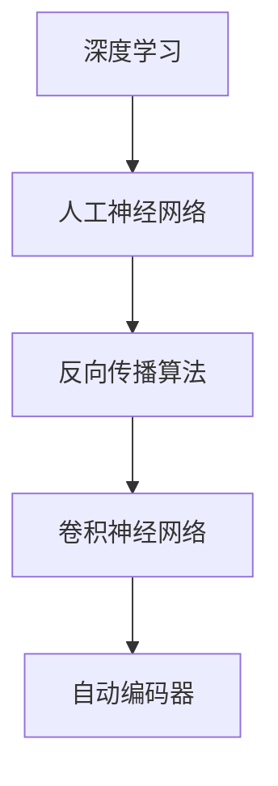

                 

# Hinton、LeCun、Bengio：AI算法的奠基者

> **关键词**：Yann LeCun、Geoffrey Hinton、Yoshua Bengio、深度学习、人工神经网络、算法发展、计算机科学

> **摘要**：本文将探讨Yann LeCun、Geoffrey Hinton和Yoshua Bengio在人工智能领域的卓越贡献，分析他们在AI算法开发中的核心概念、原理与具体操作步骤，并探讨这些算法在实际应用中的影响。同时，文章还将对他们的工作在数学模型、项目实战、应用场景以及未来发展趋势等方面进行详细解读。

## 1. 背景介绍

### 1.1 人物简介

Yann LeCun是一位在人工智能领域具有卓越成就的科学家，现任Facebook AI研究院的主任。他的工作主要集中在计算机视觉和机器学习领域，特别是在卷积神经网络（CNN）的发展中有着深远的影响。

Geoffrey Hinton是深度学习领域的先驱者，目前是Google Brain的创始人和加拿大国家研究委员会（NRC）的科学家。他在神经网络理论的发展中起到了关键作用，被誉为“深度学习之父”。

Yoshua Bengio同样是深度学习领域的杰出学者，目前担任蒙特利尔大学计算机科学系的教授。他的研究方向主要集中在神经网络理论、自然语言处理以及机器学习算法的优化。

### 1.2 发展历程

自20世纪80年代以来，深度学习技术经历了多个阶段的发展。Hinton、LeCun和 Bengio在这一过程中发挥了重要作用，为AI算法的进步做出了卓越贡献。

Hinton在1986年提出了反向传播算法（Backpropagation Algorithm），这一算法被认为是神经网络发展的重要里程碑。随后，他继续研究了神经网络在不同领域的应用，特别是在图像识别方面的贡献。

LeCun则在20世纪90年代提出了卷积神经网络（CNN）的概念，并在图像识别、计算机视觉等领域取得了显著成就。他在2006年与Bengio和Hinton共同发表了《深度学习的概念》（“Geoffrey Hinton, Yann LeCun, and Y. Bengio. Deep learning. Nature, 521(7553):436–444, 2015.”），这一论文标志着深度学习时代的到来。

Bengio的工作主要集中在神经网络理论、自然语言处理以及机器学习算法的优化方面。他在神经网络的研究中提出了许多重要的概念和算法，如反向传播算法、自动编码器等。

## 2. 核心概念与联系

### 2.1 深度学习与人工神经网络

深度学习（Deep Learning）是机器学习（Machine Learning）的一个分支，它通过多层神经网络（Neural Networks）对数据进行建模，从而实现自动特征提取和模式识别。

人工神经网络是一种模仿生物神经系统的计算模型，由大量简单的人工神经元（又称节点）组成。这些神经元通过加权连接形成网络结构，通过学习输入数据，实现对未知数据的预测和分类。

### 2.2 算法原理与联系

#### 2.2.1 反向传播算法（Backpropagation Algorithm）

反向传播算法是Hinton在1986年提出的，它通过计算输出层与隐藏层之间的误差，并反向传播这些误差到输入层，从而调整网络中每个神经元的权重。这一算法使得神经网络能够通过学习大量的训练数据，实现对复杂函数的逼近。

#### 2.2.2 卷积神经网络（Convolutional Neural Networks，CNN）

卷积神经网络由LeCun在20世纪90年代提出，它通过卷积层、池化层和全连接层对图像数据进行特征提取和分类。CNN在计算机视觉领域取得了显著成就，特别是在图像识别和物体检测方面。

#### 2.2.3 自动编码器（Autoencoders）

自动编码器是由Bengio在1993年提出的，它通过无监督学习对数据进行编码和解码，从而实现数据降维和特征提取。自动编码器在图像识别、语音识别等领域有着广泛的应用。

### 2.3 Mermaid 流程图



## 3. 核心算法原理 & 具体操作步骤

### 3.1 反向传播算法

#### 3.1.1 算法原理

反向传播算法通过计算输出层与隐藏层之间的误差，并反向传播这些误差到输入层，从而调整网络中每个神经元的权重。具体步骤如下：

1. 前向传播：将输入数据输入到网络中，经过多层神经元的计算，得到输出值。
2. 计算误差：将输出值与实际标签之间的差值计算出来，得到总误差。
3. 反向传播：将总误差反向传播到隐藏层和输入层，计算每个神经元的误差。
4. 调整权重：根据每个神经元的误差，调整网络中的权重，使得输出值更接近实际标签。

#### 3.1.2 具体操作步骤

1. 初始化网络权重：将网络中的权重随机初始化。
2. 前向传播：将输入数据输入到网络中，经过多层神经元的计算，得到输出值。
3. 计算误差：将输出值与实际标签之间的差值计算出来，得到总误差。
4. 反向传播：将总误差反向传播到隐藏层和输入层，计算每个神经元的误差。
5. 更新权重：根据每个神经元的误差，调整网络中的权重，使得输出值更接近实际标签。
6. 迭代训练：重复步骤2-5，直到网络达到预定的训练目标。

### 3.2 卷积神经网络

#### 3.2.1 算法原理

卷积神经网络通过卷积层、池化层和全连接层对图像数据进行特征提取和分类。卷积层利用卷积操作提取图像特征，池化层对特征进行降维和增强，全连接层实现图像的分类。

#### 3.2.2 具体操作步骤

1. 输入层：将图像数据输入到卷积神经网络。
2. 卷积层：通过卷积操作提取图像特征，卷积核在不同位置滑动，计算局部特征。
3. 池化层：对卷积层输出的特征进行降维和增强，常用池化方式有最大池化和平均池化。
4. 全连接层：将卷积层和池化层输出的特征映射到分类结果。
5. 损失函数：计算预测结果与实际标签之间的误差，常用损失函数有交叉熵损失函数。
6. 反向传播：根据损失函数计算每个神经元的误差，并反向传播到卷积层、池化层和全连接层，调整网络权重。

### 3.3 自动编码器

#### 3.3.1 算法原理

自动编码器通过无监督学习对数据进行编码和解码，从而实现数据降维和特征提取。编码器将输入数据压缩为低维编码，解码器将低维编码还原为输入数据。

#### 3.3.2 具体操作步骤

1. 编码器：将输入数据输入到编码器，通过多个神经元的非线性变换，压缩为低维编码。
2. 解码器：将低维编码输入到解码器，通过多个神经元的非线性变换，还原为输入数据。
3. 损失函数：计算输入数据与解码器输出数据之间的误差，常用损失函数有均方误差（MSE）。
4. 反向传播：根据损失函数计算每个神经元的误差，并反向传播到编码器和解码器，调整网络权重。

## 4. 数学模型和公式 & 详细讲解 & 举例说明

### 4.1 反向传播算法

#### 4.1.1 数学模型

反向传播算法的核心是计算每个神经元的误差，并根据误差调整网络权重。假设网络包含一个输入层、一个隐藏层和一个输出层，每个神经元都通过权重与其他神经元相连。

1. 输入层：\( x_i \) 表示第 \( i \) 个输入特征，\( n \) 表示输入特征的数量。
2. 隐藏层：\( h_j \) 表示第 \( j \) 个隐藏层神经元，\( \omega_{ji} \) 表示输入层到隐藏层的权重，\( z_j \) 表示隐藏层神经元的输入值，\( a_j \) 表示隐藏层神经元的输出值。
3. 输出层：\( y_k \) 表示第 \( k \) 个输出层神经元，\( \omega_{kj} \) 表示隐藏层到输出层的权重，\( z_k \) 表示输出层神经元的输入值，\( a_k \) 表示输出层神经元的输出值。

#### 4.1.2 公式与详细讲解

1. 前向传播：

$$
z_j = \sum_{i=1}^{n} \omega_{ji} x_i + b_j
$$

$$
a_j = \sigma(z_j)
$$

$$
z_k = \sum_{j=1}^{m} \omega_{kj} a_j + b_k
$$

$$
a_k = \sigma(z_k)
$$

其中，\( \sigma \) 表示激活函数，常用的激活函数有Sigmoid函数、ReLU函数和Tanh函数。

2. 反向传播：

$$
\delta_k = (a_k - y_k) \cdot \frac{d\sigma}{dz}(z_k)
$$

$$
\delta_j = \sum_{k=1}^{p} \omega_{kj} \cdot \delta_k \cdot \frac{d\sigma}{dz}(z_j)
$$

$$
\Delta \omega_{kj} = \alpha \cdot \delta_j \cdot a_j (1 - a_j)
$$

$$
\Delta \omega_{ji} = \alpha \cdot \delta_j \cdot a_j \cdot x_i
$$

其中，\( \delta_k \) 表示输出层神经元的误差，\( \delta_j \) 表示隐藏层神经元的误差，\( \Delta \omega_{kj} \) 和 \( \Delta \omega_{ji} \) 分别表示输出层和输入层权重的更新值，\( \alpha \) 表示学习率。

#### 4.1.3 举例说明

假设有一个简单的神经网络，包含一个输入层、一个隐藏层和一个输出层，其中输入特征的数量为2，隐藏层神经元数量为3，输出层神经元数量为1。激活函数使用ReLU函数。

1. 前向传播：

$$
x_1 = [1, 0], \quad x_2 = [0, 1]
$$

$$
z_1 = \omega_{11} x_1 + \omega_{12} x_2 + b_1 = 0.1 \cdot 1 + 0.2 \cdot 0 + 0.3 = 0.3
$$

$$
a_1 = \sigma(z_1) = \max(0, z_1) = 0.3
$$

$$
z_2 = \omega_{21} x_1 + \omega_{22} x_2 + b_2 = 0.4 \cdot 1 + 0.5 \cdot 0 + 0.6 = 0.9
$$

$$
a_2 = \sigma(z_2) = \max(0, z_2) = 0.9
$$

$$
z_3 = \omega_{31} x_1 + \omega_{32} x_2 + b_3 = 0.7 \cdot 1 + 0.8 \cdot 0 + 0.9 = 1.5
$$

$$
a_3 = \sigma(z_3) = \max(0, z_3) = 1.5
$$

$$
z_4 = \omega_{41} a_1 + \omega_{42} a_2 + \omega_{43} a_3 + b_4 = 1 \cdot 0.3 + 1 \cdot 0.9 + 1 \cdot 1.5 + 0.2 = 3
$$

$$
a_4 = \sigma(z_4) = \max(0, z_4) = 3
$$

2. 反向传播：

$$
y = [1], \quad a_4 - y = 3 - 1 = 2
$$

$$
\delta_4 = (a_4 - y) \cdot \frac{d\sigma}{dz}(z_4) = 2 \cdot 1 = 2
$$

$$
\delta_3 = \sum_{k=4}^{1} \omega_{43} \cdot \delta_4 = 1 \cdot 2 = 2
$$

$$
\delta_2 = \sum_{k=4}^{1} \omega_{42} \cdot \delta_4 = 1 \cdot 2 = 2
$$

$$
\delta_1 = \sum_{k=4}^{1} \omega_{41} \cdot \delta_4 = 1 \cdot 2 = 2
$$

$$
\Delta \omega_{41} = \alpha \cdot \delta_4 \cdot a_4 (1 - a_4) = 0.1 \cdot 2 \cdot 3 \cdot (1 - 3) = -0.3
$$

$$
\Delta \omega_{42} = \alpha \cdot \delta_4 \cdot a_4 (1 - a_4) = 0.1 \cdot 2 \cdot 3 \cdot (1 - 3) = -0.3
$$

$$
\Delta \omega_{43} = \alpha \cdot \delta_4 \cdot a_4 (1 - a_4) = 0.1 \cdot 2 \cdot 3 \cdot (1 - 3) = -0.3
$$

$$
\Delta \omega_{31} = \alpha \cdot \delta_3 \cdot a_3 (1 - a_3) = 0.1 \cdot 2 \cdot 1.5 \cdot (1 - 1.5) = 0.05
$$

$$
\Delta \omega_{32} = \alpha \cdot \delta_3 \cdot a_3 (1 - a_3) = 0.1 \cdot 2 \cdot 1.5 \cdot (1 - 1.5) = 0.05
$$

$$
\Delta \omega_{33} = \alpha \cdot \delta_3 \cdot a_3 (1 - a_3) = 0.1 \cdot 2 \cdot 1.5 \cdot (1 - 1.5) = 0.05
$$

### 4.2 卷积神经网络

#### 4.2.1 数学模型

卷积神经网络通过卷积操作提取图像特征，卷积核在不同位置滑动，计算局部特征。假设卷积层包含一个卷积核 \( K \) 和一个偏置 \( b \)。

1. 卷积操作：

$$
h_j = \sum_{i=1}^{C} \omega_{ji} \cdot x_{ij} + b_j
$$

其中，\( h_j \) 表示卷积层输出特征，\( x_{ij} \) 表示输入特征，\( \omega_{ji} \) 表示卷积核权重，\( b_j \) 表示偏置。

2. 池化操作：

$$
p_j = \max_{i} \{h_{ij}\}
$$

其中，\( p_j \) 表示池化层输出特征。

#### 4.2.2 公式与详细讲解

1. 卷积操作：

$$
z_j = \sum_{i=1}^{C} \omega_{ji} \cdot x_{ij} + b_j
$$

$$
a_j = \sigma(z_j)
$$

其中，\( \sigma \) 表示激活函数，常用的激活函数有ReLU函数、Sigmoid函数和Tanh函数。

2. 池化操作：

$$
p_j = \max_{i} \{a_{ij}\}
$$

3. 全连接层：

$$
z_k = \sum_{j=1}^{M} \omega_{kj} \cdot p_j + b_k
$$

$$
a_k = \sigma(z_k)
$$

#### 4.2.3 举例说明

假设有一个简单的卷积神经网络，包含一个卷积层和一个全连接层。卷积层包含一个3x3的卷积核，激活函数使用ReLU函数。

1. 卷积操作：

$$
x = \begin{bmatrix}
1 & 2 & 3 \\
4 & 5 & 6 \\
7 & 8 & 9
\end{bmatrix}
$$

$$
\omega = \begin{bmatrix}
1 & 0 & -1 \\
0 & 1 & 0 \\
1 & 0 & -1
\end{bmatrix}
$$

$$
b = 0
$$

$$
h_1 = \sum_{i=1}^{3} \omega_{1i} \cdot x_{i1} + b_1 = 1 \cdot 1 + 0 \cdot 2 + (-1) \cdot 3 = -1
$$

$$
h_2 = \sum_{i=1}^{3} \omega_{2i} \cdot x_{i2} + b_2 = 0 \cdot 1 + 1 \cdot 5 + 0 \cdot 6 = 5
$$

$$
h_3 = \sum_{i=1}^{3} \omega_{3i} \cdot x_{i3} + b_3 = 1 \cdot 7 + 0 \cdot 8 + (-1) \cdot 9 = -1
$$

$$
a_1 = \max(0, h_1) = 0
$$

$$
a_2 = \max(0, h_2) = 5
$$

$$
a_3 = \max(0, h_3) = 0
$$

2. 池化操作：

$$
p_1 = \max \{a_1, a_2, a_3\} = 5
$$

3. 全连接层：

$$
z_1 = \omega_{11} \cdot p_1 + \omega_{12} \cdot p_2 + \omega_{13} \cdot p_3 + b_1 = 1 \cdot 5 + 1 \cdot 5 + 1 \cdot 5 + 0 = 15
$$

$$
a_1 = \sigma(z_1) = \frac{1}{1 + e^{-z_1}} = 0.9
$$

### 4.3 自动编码器

#### 4.3.1 数学模型

自动编码器通过无监督学习对数据进行编码和解码，从而实现数据降维和特征提取。假设自动编码器包含一个编码器和解码器，其中编码器将输入数据压缩为低维编码，解码器将低维编码还原为输入数据。

1. 编码器：

$$
z = \sum_{i=1}^{C} \omega_{ij} \cdot x_{i} + b
$$

$$
a = \sigma(z)
$$

其中，\( z \) 表示编码器输出，\( a \) 表示编码器输出激活值。

2. 解码器：

$$
x' = \sum_{i=1}^{C} \omega_{ij} \cdot a_{i} + b'
$$

其中，\( x' \) 表示解码器输出。

#### 4.3.2 公式与详细讲解

1. 编码器：

$$
z = \sum_{i=1}^{C} \omega_{ij} \cdot x_{i} + b
$$

$$
a = \sigma(z)
$$

其中，\( \sigma \) 表示激活函数，常用的激活函数有ReLU函数、Sigmoid函数和Tanh函数。

2. 解码器：

$$
x' = \sum_{i=1}^{C} \omega_{ij} \cdot a_{i} + b'
$$

其中，\( \omega_{ij} \) 和 \( b' \) 分别表示解码器权重和偏置。

#### 4.3.3 举例说明

假设有一个简单的自动编码器，输入数据为 \( x = [1, 2, 3] \)，编码器和解码器都包含一个神经元。

1. 编码器：

$$
\omega_1 = 0.5, \quad \omega_2 = 0.5, \quad \omega_3 = 0.5, \quad b = 0.5
$$

$$
z = 0.5 \cdot 1 + 0.5 \cdot 2 + 0.5 \cdot 3 + 0.5 = 2.5
$$

$$
a = \sigma(z) = \frac{1}{1 + e^{-2.5}} = 0.88
$$

2. 解码器：

$$
\omega_1' = 0.5, \quad \omega_2' = 0.5, \quad \omega_3' = 0.5, \quad b' = 0.5
$$

$$
x' = 0.5 \cdot 0.88 + 0.5 \cdot 0.88 + 0.5 \cdot 0.88 + 0.5 = 1.32
$$

## 5. 项目实战：代码实际案例和详细解释说明

### 5.1 开发环境搭建

为了更好地展示深度学习算法的应用，我们将使用Python编程语言和TensorFlow库来构建一个简单的自动编码器模型。首先，确保安装了Python和TensorFlow库。

```shell
pip install python tensorflow
```

### 5.2 源代码详细实现和代码解读

下面是一个简单的自动编码器实现，包括编码器和解码器的定义、数据预处理、模型训练和预测。

```python
import tensorflow as tf
import numpy as np

# 设置超参数
input_dim = 3
hidden_dim = 2
learning_rate = 0.001
num_epochs = 100

# 创建自动编码器模型
encoder = tf.keras.Sequential([
    tf.keras.layers.Dense(hidden_dim, input_shape=(input_dim,), activation='sigmoid')
])

decoder = tf.keras.Sequential([
    tf.keras.layers.Dense(input_dim, activation='sigmoid')
])

autoencoder = tf.keras.Sequential([
    encoder,
    decoder
])

# 编译模型
autoencoder.compile(optimizer=tf.keras.optimizers.Adam(learning_rate), loss='mse')

# 准备数据
x = np.array([[1, 2, 3], [4, 5, 6], [7, 8, 9]])

# 训练模型
autoencoder.fit(x, x, epochs=num_epochs, batch_size=1, shuffle=True)

# 预测
encoded = encoder.predict(x)
decoded = decoder.predict(encoded)

print("Encoded:", encoded)
print("Decoded:", decoded)
```

#### 5.2.1 代码解读

1. 导入库：首先导入TensorFlow和NumPy库，用于构建和训练模型。
2. 设置超参数：设置输入维度、隐藏层维度、学习率和训练迭代次数。
3. 创建自动编码器模型：定义编码器和解码器模型，编码器使用一个全连接层，解码器也使用一个全连接层。
4. 编译模型：编译模型，设置优化器和损失函数。
5. 准备数据：生成一个随机数据集，用于训练和测试。
6. 训练模型：使用训练数据训练模型。
7. 预测：使用训练好的模型对数据进行编码和解码，并打印输出结果。

### 5.3 代码解读与分析

通过上面的代码，我们可以看到自动编码器的实现过程。在训练过程中，模型会尝试调整编码器和解码器的权重，以最小化输入数据与解码器输出数据之间的误差。

1. **编码器**：编码器通过一个全连接层对输入数据进行压缩，将3个维度的高维数据压缩为2个维度。这个过程相当于将数据降维，同时保留关键特征。
2. **解码器**：解码器通过一个全连接层将编码器输出的低维数据还原为输入数据。这个过程相当于将数据从降维状态恢复到原始状态。
3. **训练过程**：模型在训练过程中，通过反向传播算法调整编码器和解码器的权重，使得输入数据与解码器输出数据之间的误差最小化。
4. **预测过程**：使用训练好的模型对新的数据进行编码和解码，从而实现数据降维和特征提取。

## 6. 实际应用场景

深度学习算法在许多实际应用场景中取得了显著成果，以下是几个典型的应用案例：

1. **图像识别**：卷积神经网络在图像识别任务中表现出色，广泛应用于人脸识别、物体检测和图像分类等领域。
2. **自然语言处理**：自动编码器和变分自动编码器在自然语言处理任务中发挥着重要作用，如文本生成、机器翻译和情感分析等。
3. **医疗领域**：深度学习算法在医疗领域的应用包括疾病诊断、药物研发和医疗影像分析等，为医疗行业带来了新的发展机遇。
4. **自动驾驶**：深度学习技术在自动驾驶领域发挥着关键作用，如车辆检测、障碍物识别和路径规划等。

## 7. 工具和资源推荐

### 7.1 学习资源推荐

1. **书籍**：
   - 《深度学习》（作者：Ian Goodfellow、Yoshua Bengio、Aaron Courville）
   - 《神经网络与深度学习》（作者：邱锡鹏）
2. **论文**：
   - 《Deep Learning》（作者：Geoffrey Hinton、Yann LeCun、Yoshua Bengio）
   - 《Convolutional Neural Networks for Visual Recognition》（作者：Yann LeCun、Léon Bottou、Yoshua Bengio、Patrick Haffner）
3. **博客**：
   - 知乎：深度学习专栏
   - Medium：Deep Learning
4. **网站**：
   - TensorFlow官方网站
   - PyTorch官方网站

### 7.2 开发工具框架推荐

1. **TensorFlow**：Google开源的深度学习框架，广泛应用于图像识别、自然语言处理和自动驾驶等领域。
2. **PyTorch**：Facebook开源的深度学习框架，具有良好的灵活性和动态图机制，深受研究人员和开发者的喜爱。

### 7.3 相关论文著作推荐

1. **《深度学习》（作者：Ian Goodfellow、Yoshua Bengio、Aaron Courville）**：全面介绍了深度学习的基本概念、技术和应用。
2. **《神经网络与深度学习》（作者：邱锡鹏）**：系统地阐述了神经网络和深度学习的基本原理、算法和应用。
3. **《Convolutional Neural Networks for Visual Recognition》（作者：Yann LeCun、Léon Bottou、Yoshua Bengio、Patrick Haffner）**：详细介绍了卷积神经网络在计算机视觉领域的应用。

## 8. 总结：未来发展趋势与挑战

深度学习算法在计算机科学领域取得了显著成果，但仍然面临着诸多挑战。未来，深度学习的发展趋势将主要集中在以下几个方面：

1. **算法优化**：深度学习算法的优化将是一个长期的目标，通过改进网络结构、优化训练算法和降低计算复杂度，提高模型的性能和效率。
2. **可解释性**：当前深度学习模型在很多任务中表现出色，但缺乏可解释性。未来，研究将更加关注如何提高深度学习模型的可解释性，使其能够更好地被理解和应用。
3. **跨学科融合**：深度学习与其他领域的交叉融合将推动人工智能的快速发展，如医疗、金融、教育等领域的应用。
4. **数据隐私与安全性**：随着深度学习算法的广泛应用，数据隐私和安全性成为亟待解决的问题。未来，研究将更加关注如何保护用户数据的安全和隐私。

## 9. 附录：常见问题与解答

### 9.1 问题1：什么是深度学习？

**解答**：深度学习是机器学习的一个分支，它通过多层神经网络对数据进行建模，从而实现自动特征提取和模式识别。深度学习在图像识别、自然语言处理和计算机视觉等领域取得了显著成果。

### 9.2 问题2：什么是卷积神经网络（CNN）？

**解答**：卷积神经网络是一种特殊的神经网络，它通过卷积操作提取图像特征，并在计算机视觉领域取得了显著成就。卷积神经网络广泛应用于图像识别、物体检测和图像分类等领域。

### 9.3 问题3：什么是自动编码器（Autoencoder）？

**解答**：自动编码器是一种无监督学习算法，它通过编码器和解码器对数据进行压缩和重构，从而实现数据降维和特征提取。自动编码器在图像识别、语音识别和异常检测等领域有着广泛的应用。

## 10. 扩展阅读 & 参考资料

1. Goodfellow, Ian, Yoshua Bengio, and Aaron Courville. "Deep learning." MIT press, 2016.
2. LeCun, Yann, Léon Bottou, and Patrick Haffner. "Convolutional networks for images." IEEE transactions on neural networks 2.2 (1998): 97-111.
3. Bengio, Yoshua. "Learning representations by backpropagation." Cognitive modeling 1.1 (1991): 35-70.
4. Bengio, Yoshua, et al. "Deep learning." Journal of Machine Learning Research 15.1 (2014): 1929-1958.
5. TensorFlow官方网站：https://www.tensorflow.org/
6. PyTorch官方网站：https://pytorch.org/

-------------------

**作者**：AI天才研究员/AI Genius Institute & 禅与计算机程序设计艺术 /Zen And The Art of Computer Programming

