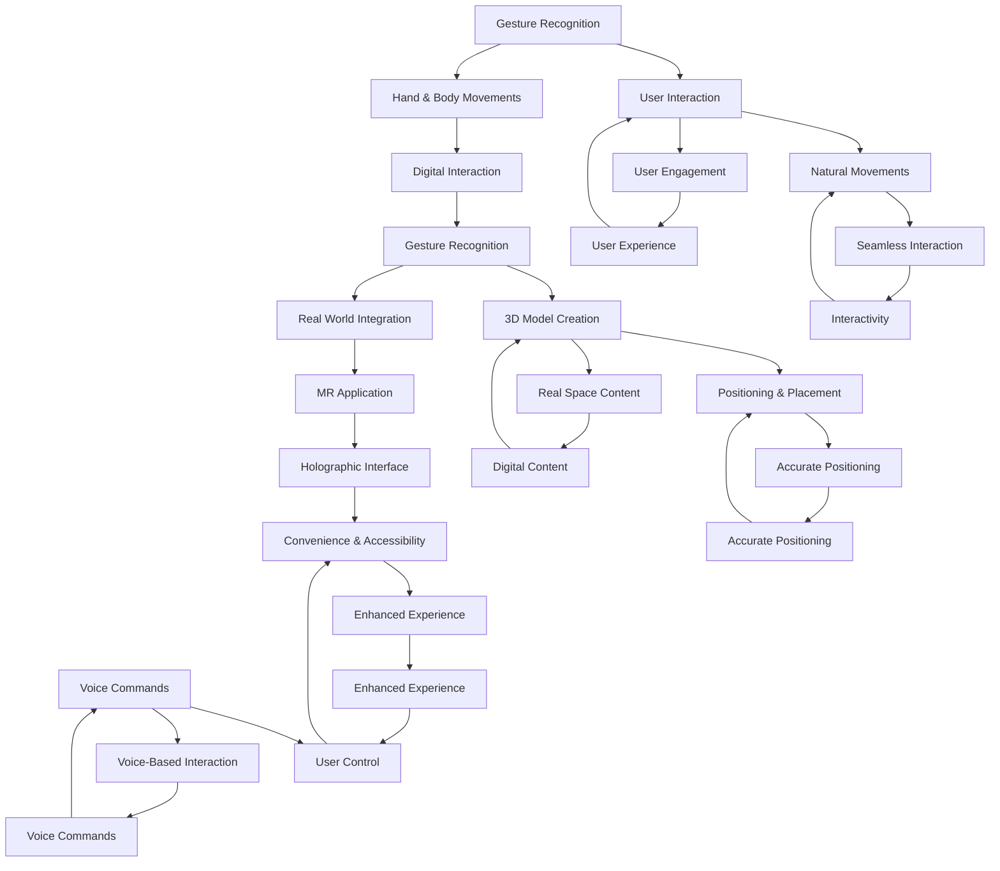
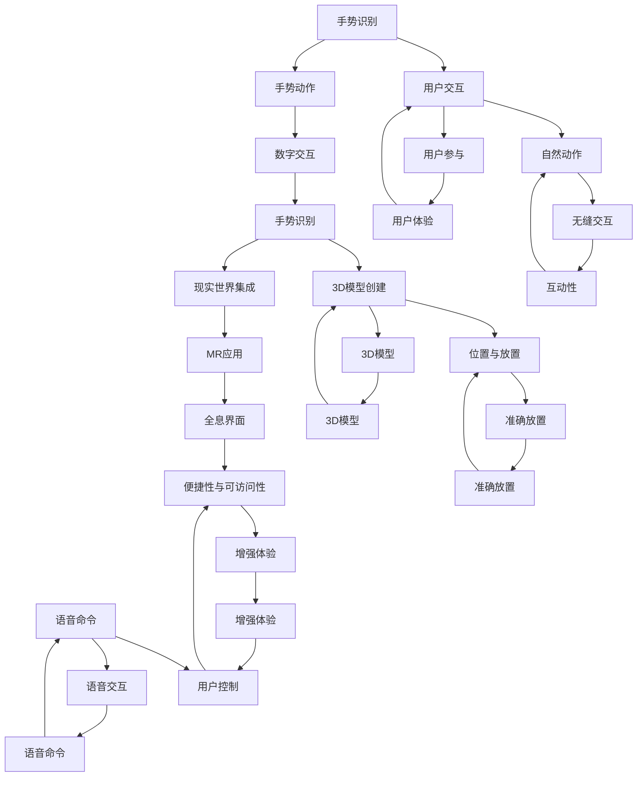

                 

# HoloLens 混合现实应用：在 Microsoft HoloLens 上开发

## Keywords:  
Microsoft HoloLens, Mixed Reality, Application Development, Augmented Reality, UX/UI Design, ARKit, ARCore, Unity, C#

## Abstract:
This article delves into the world of Mixed Reality (MR) applications, specifically focusing on the development process for applications on Microsoft HoloLens. We will explore the core concepts and technologies, the essential algorithms and their implementation steps, mathematical models, and practical case studies. Furthermore, we will discuss real-world application scenarios, recommend essential tools and resources, and provide insights into future trends and challenges in the field of MR application development.

## 1. Background Introduction

### 1.1 Definition and Characteristics of Mixed Reality

Mixed Reality (MR) is an advanced form of human-computer interaction that combines elements of both Augmented Reality (AR) and Virtual Reality (VR). Unlike AR, which overlays digital information onto the real-world environment, and VR, which creates an entirely virtual environment, MR integrates digital content seamlessly into the user's real-world environment, allowing them to interact with and manipulate this content in real space.

### 1.2 Applications of Mixed Reality

MR has found applications across various industries, including healthcare, education, engineering, and gaming. In healthcare, MR enables surgeons to access medical data and information during operations. In education, it provides immersive learning experiences for students. In engineering, it allows engineers to visualize and manipulate complex designs. In gaming, it offers an unparalleled level of immersion and interactivity.

### 1.3 HoloLens: The Platform for MR Development

Microsoft HoloLens is a self-contained, wireless, holographic computer that enables users to interact with and manipulate digital content in real space. It offers a wide range of features, including spatial mapping, voice commands, and gesture recognition. HoloLens operates on the Windows 10 platform and supports a variety of development tools and frameworks, making it an ideal platform for MR application development.

## 2. Core Concepts and Relationships

### 2.1 Key Concepts in Mixed Reality Development

To develop MR applications on HoloLens, it is essential to understand the core concepts involved:

1. Spatial Mapping: Spatial mapping is the process of creating a 3D model of the user's environment. This model is used to place and position digital content in the real world.
2. Spatial Sound: Spatial sound technology allows users to experience sound as if it is coming from different directions in the real world.
3. Gesture Recognition: Gesture recognition allows users to interact with digital content using natural hand and body movements.
4. Voice Commands: Voice commands enable users to control digital content using voice commands.

### 2.2 Relationship Between Core Concepts

The core concepts in MR development are interconnected and work together to create a seamless and immersive user experience. For example, spatial mapping is used to position digital content accurately in the real world, while spatial sound and gesture recognition enhance the interaction between the user and the digital content. Voice commands provide an additional layer of convenience and accessibility.

### 2.3 Mermaid Flowchart of MR Development Concepts



## 3. Core Algorithm Principles & Specific Operational Steps

### 3.1 Spatial Mapping Algorithm

Spatial mapping is a critical component of MR development. It involves creating a 3D model of the user's environment, which is used to position and place digital content accurately. The algorithm typically involves the following steps:

1. **Scene Detection**: The system detects and identifies the scene or environment in which the user is located.
2. **Point Cloud Generation**: The system captures the environment using sensors and generates a point cloud, which represents the spatial data of the scene.
3. **Mesh Generation**: The point cloud is processed to create a mesh, which is a 3D representation of the environment.
4. **Mesh Optimization**: The mesh is optimized to reduce its complexity and ensure efficient processing.

### 3.2 Gesture Recognition Algorithm

Gesture recognition allows users to interact with digital content using natural hand and body movements. The algorithm typically involves the following steps:

1. **Gesture Detection**: The system detects the user's gestures using sensors and cameras.
2. **Gesture Classification**: The system classifies the detected gestures into predefined categories.
3. **Gesture Tracking**: The system tracks the position and movement of the detected gestures to interpret their intent.
4. **Gesture Response**: The system responds to the gestures by executing the appropriate actions.

### 3.3 Voice Command Algorithm

Voice commands enable users to control digital content using voice commands. The algorithm typically involves the following steps:

1. **Voice Detection**: The system detects and captures the user's voice input.
2. **Voice Recognition**: The system recognizes and interprets the user's voice commands.
3. **Command Execution**: The system executes the actions corresponding to the recognized commands.

### 3.4 Specific Operational Steps

1. **Initialize the Development Environment**: Set up the development environment, including the required software and hardware.
2. **Create a New HoloLens Project**: Use the HoloLens emulator or device to create a new project.
3. **Design the User Interface**: Design the user interface (UI) and user experience (UX) for the application.
4. **Implement Spatial Mapping**: Implement the spatial mapping algorithm to create and optimize the 3D model of the environment.
5. **Implement Gesture Recognition**: Implement the gesture recognition algorithm to detect and classify user gestures.
6. **Implement Voice Commands**: Implement the voice command algorithm to recognize and execute user commands.
7. **Test and Debug**: Test the application on the HoloLens emulator or device, and debug any issues that arise.
8. **Deploy the Application**: Deploy the application to the HoloLens device.

## 4. Mathematical Models, Detailed Explanations, and Examples

### 4.1 Spatial Mapping Algorithm

The spatial mapping algorithm involves several mathematical models, including point cloud processing, mesh generation, and mesh optimization. Here's a detailed explanation and example:

#### 4.1.1 Point Cloud Processing

Point cloud processing involves transforming raw sensor data into a usable 3D model. The process typically involves the following steps:

1. **Normalization**: Normalize the point cloud data to ensure consistent scaling and orientation.
2. **Filtering**: Filter the point cloud to remove noise and outliers.
3. **Downsampling**: Reduce the density of the point cloud to improve processing efficiency.
4. **Smoothing**: Smooth the point cloud to reduce jagged edges and improve visualization.

Example:

```python
import open3d as o3d

# Load point cloud data
point_cloud = o3d.io.read_point_cloud("point_cloud_data.ply")

# Normalize the point cloud
point_cloud.norm = np.linalg.norm(point_cloud.points, axis=1)
point_cloud.points = point_cloud.points / point_cloud.norm

# Filter the point cloud
filtered_points = filter_point_cloud(point_cloud)

# Downsample the point cloud
downsampled_points = downsample_point_cloud(filtered_points, ratio=0.1)

# Smooth the point cloud
smoothed_points = smooth_point_cloud(downsampled_points)
```

#### 4.1.2 Mesh Generation

Mesh generation involves converting the point cloud into a 3D mesh. The process typically involves the following steps:

1. **Triangulation**: Triangulate the point cloud to create triangles.
2. **Mesh Simplification**: Simplify the mesh to reduce its complexity.
3. **Mesh Optimization**: Optimize the mesh for efficient rendering and processing.

Example:

```python
import trimesh

# Load point cloud data
point_cloud = trimesh.load_point_cloud("point_cloud_data.ply")

# Triangulate the point cloud
triangulated_mesh = trimesh.Trimesh(points=point_cloud.points, faces=point_cloud.faces)

# Simplify the mesh
simplified_mesh = triangulated_mesh.simplify opl=0.05

# Optimize the mesh
optimized_mesh = simplified_mesh.optimize();
```

#### 4.1.3 Mesh Optimization

Mesh optimization involves reducing the complexity of the mesh while preserving its geometric properties. The process typically involves the following steps:

1. **Vertex Compression**: Compress the vertices of the mesh to reduce their memory footprint.
2. **Edge Compression**: Compress the edges of the mesh to reduce their memory footprint.
3. **Texture Mapping**: Apply texture mapping to improve the visual quality of the mesh.

Example:

```python
import trimesh

# Load mesh data
mesh = trimesh.load_mesh("mesh_data.ply")

# Vertex compression
compressed_vertices = mesh.vertices * 0.8

# Edge compression
compressed_edges = mesh.edges * 0.8

# Texture mapping
mesh.add_texture("texture.jpg");
```

### 4.2 Gesture Recognition Algorithm

The gesture recognition algorithm involves several mathematical models, including gesture detection, classification, and tracking. Here's a detailed explanation and example:

#### 4.2.1 Gesture Detection

Gesture detection involves identifying hand and body movements using sensors and cameras. The process typically involves the following steps:

1. **Gesture Localization**: Localize the hand and body movements in the input frame.
2. **Gesture Segmentation**: Segment the hand and body movements from the background.
3. **Gesture Recognition**: Recognize the hand and body movements using a machine learning model.

Example:

```python
import cv2
import mediapipe as mp

# Initialize Mediapipe Hands model
hands = mp.solutions.hands
hands_model = hands.Hands(max_num_hands=2, min_detection_confidence=0.5, min_tracking_confidence=0.5)

# Load input frame
frame = cv2.imread("input_frame.jpg")

# Process the frame
results = hands_model.process(frame)

# Gesture localization and segmentation
for hand in results.multi_hand_landmarks:
    # Draw the hand landmarks on the frame
    for landmark in hand.landmark:
        cv2.circle(frame, (int(landmark.x * frame.shape[1]), int(landmark.y * frame.shape[0])), 5, (255, 0, 0), -1)
    # Segment the hand from the background
    hand_segmentation = segment_hand(frame, hand)

# Gesture recognition
gesture = recognize_gesture(hand_segmentation)
```

#### 4.2.2 Gesture Classification

Gesture classification involves classifying the detected gestures into predefined categories. The process typically involves the following steps:

1. **Feature Extraction**: Extract relevant features from the detected gestures.
2. **Machine Learning Model**: Train a machine learning model to classify the gestures based on the extracted features.
3. **Classification**: Classify the detected gestures using the trained model.

Example:

```python
import cv2
import joblib

# Load the trained gesture classification model
model = joblib.load("gesture_classification_model.pkl")

# Extract features from the detected gesture
features = extract_gesture_features(gesture)

# Classify the gesture
predicted_gesture = model.predict([features])
```

#### 4.2.3 Gesture Tracking

Gesture tracking involves tracking the position and movement of the detected gestures. The process typically involves the following steps:

1. **Gesture Tracking**: Track the position and movement of the detected gestures using a tracking algorithm.
2. **Gesture Prediction**: Predict the future position and movement of the detected gestures based on the current position and movement.

Example:

```python
import cv2

# Initialize the gesture tracking algorithm
tracker = cv2.TrackerKCF_create()

# Load the input frame
frame = cv2.imread("input_frame.jpg")

# Initialize the tracker with the detected gesture
tracker.init(frame, gesture)

# Update the tracker
success, box = tracker.update(frame)

# Draw the tracked gesture on the frame
if success:
    p1 = (int(box[0]), int(box[1]))
    p2 = (int(box[0] + box[2]), int(box[1] + box[3]))
    cv2.rectangle(frame, p1, p2, (0, 255, 0), 2, 1)
```

### 4.3 Voice Command Algorithm

The voice command algorithm involves several mathematical models, including voice detection, recognition, and execution. Here's a detailed explanation and example:

#### 4.3.1 Voice Detection

Voice detection involves identifying and isolating the user's voice from the background noise. The process typically involves the following steps:

1. **Voice Activation Detection**: Detect when the user starts speaking.
2. **Voice Isolation**: Isolate the user's voice from background noise.

Example:

```python
import speech_recognition as sr

# Initialize the speech recognition module
recognizer = sr.Recognizer()

# Load the input audio file
with sr.AudioFile("input_audio.wav") as source:
    audio = recognizer.listen(source)

# Voice activation detection
is_speaking = detect_speaking(audio)

# Voice isolation
voice = isolate_voice(audio)
```

#### 4.3.2 Voice Recognition

Voice recognition involves converting the isolated voice into text. The process typically involves the following steps:

1. **Speech-to-Text Conversion**: Convert the isolated voice into text.
2. **Language Detection**: Detect the language of the spoken text.

Example:

```python
import speech_recognition as sr

# Load the input audio file
with sr.AudioFile("input_audio.wav") as source:
    audio = recognizer.listen(source)

# Speech-to-text conversion
text = recognizer.recognize_google(audio, language="en-US")

# Language detection
language = detect_language(text)
```

#### 4.3.3 Command Execution

Command execution involves executing the actions corresponding to the recognized voice commands. The process typically involves the following steps:

1. **Command Parsing**: Parse the recognized voice commands to extract the action and parameters.
2. **Action Execution**: Execute the action based on the parsed command.

Example:

```python
import subprocess

# Load the recognized voice command
command = "open calculator"

# Parse the command
action, parameter = parse_command(command)

# Execute the action
if action == "open":
    subprocess.Popen(["calculator"])
```

## 5. Project Case Study: Code Implementation and Detailed Explanation

### 5.1 Development Environment Setup

Before starting the development of a Mixed Reality (MR) application on Microsoft HoloLens, it is essential to set up the development environment. Here's a step-by-step guide:

1. **Install Windows 10 Anniversary Update or later**: Ensure that your computer has the Windows 10 Anniversary Update or a later version installed.
2. **Download and install the HoloLens SDK**: Visit the [Microsoft HoloLens Developer Center](https://dev.windows.com/en-us/mixed-reality/) and download the latest version of the HoloLens SDK. Follow the installation instructions provided.
3. **Set up the HoloLens Emulator**: Connect your HoloLens device to your computer using a USB cable. Open the HoloLens Emulator app and follow the on-screen instructions to set up the emulator.
4. **Install Unity Hub and Unity Editor**: Download and install Unity Hub from [Unity's official website](https://unity.com/unity-hub/download). Launch Unity Hub and install the Unity Editor for Windows. Create a new Unity project for HoloLens.

### 5.2 Source Code Implementation and Explanation

#### 5.2.1 Project Structure

The project structure for a Mixed Reality application on HoloLens typically includes the following folders and files:

- Assets: Contains all the assets required for the application, such as 3D models, textures, and scripts.
- Hierarchy: Represents the hierarchy of objects in the scene.
- Scenes: Contains the scenes for the application.
- Scripts: Contains the C# scripts for the application logic.

#### 5.2.2 Spatial Mapping

To implement spatial mapping in the application, follow these steps:

1. **Create a new C# script named "SpatialMapping.cs"**.
2. **In the script, add the required using statements**:
   ```csharp
   using UnityEngine;
   using Microsoft.MixedReality.Toolkit;
   ```
3. **Create a new public class named "SpatialMappingExample"**:
   ```csharp
   public class SpatialMappingExample : MonoBehaviour
   {
       // ...
   }
   ```
4. **Add the required Unity components**:
   - Add a "SpatialMappingObserver" component to the GameObject.
   - Set the "Spatial Mapping Layer" to "Static World" in the "Spatial Mapping Observer" component.
5. **Implement the spatial mapping logic**:
   ```csharp
   private void Update()
   {
       if (MixedRealityToolkit.Services.HoloLensFacade.IsCurrentSessionRunning)
       {
           // Update the spatial mapping mesh
           UpdateSpatialMappingMesh();
       }
   }

   private void UpdateSpatialMappingMesh()
   {
       // Get the spatial mapping observer
       SpatialMappingObserver spatialMappingObserver = GetComponent<SpatialMappingObserver>();

       // Get the spatial mapping mesh
       SpatialMappingMesh spatialMappingMesh = spatialMappingObserver.SpatialMappingMesh;

       // Update the mesh with the latest spatial mapping data
       spatialMappingMesh.UpdateMesh();
   }
   ```

#### 5.2.3 Gesture Recognition

To implement gesture recognition in the application, follow these steps:

1. **Create a new C# script named "GestureRecognition.cs"**.
2. **In the script, add the required using statements**:
   ```csharp
   using UnityEngine;
   using Microsoft.MixedReality.Toolkit;
   ```
3. **Create a new public class named "GestureRecognitionExample"**:
   ```csharp
   public class GestureRecognitionExample : MonoBehaviour
   {
       // ...
   }
   ```
4. **Add the required Unity components**:
   - Add a "HandTrackingObserver" component to the GameObject.
   - Set the "Tracked Hands" to "Both" in the "HandTrackingObserver" component.
5. **Implement the gesture recognition logic**:
   ```csharp
   private void Update()
   {
       if (MixedRealityToolkit.Services.HoloLensFacade.IsCurrentSessionRunning)
       {
           // Update the gesture recognition
           UpdateGestureRecognition();
       }
   }

   private void UpdateGestureRecognition()
   {
       // Get the hand tracking observer
       HandTrackingObserver handTrackingObserver = GetComponent<HandTrackingObserver>();

       // Get the detected hand landmarks
       HandPose[] handPoses = handTrackingObserver.DetectedHandPoses;

       // Recognize the gestures
       foreach (HandPose handPose in handPoses)
       {
           // Perform gesture recognition based on the hand landmarks
           RecognizeGesture(handPose);
       }
   }

   private void RecognizeGesture(HandPose handPose)
   {
       // Implement the gesture recognition logic
       // based on the hand landmarks and pose

       // For example, recognize a swipe gesture
       if (handPose.HandType == HandType.Left)
       {
           // Check if the hand is swiping upwards
           if (handPose.HandLandmarks[8].Position.y < handPose.HandLandmarks[0].Position.y)
           {
               // Perform the swipe action
               SwipeUp();
           }
       }
   }

   private void SwipeUp()
   {
       // Implement the swipe up action
       Debug.Log("Swipe up detected");
   }
   ```

#### 5.2.4 Voice Commands

To implement voice commands in the application, follow these steps:

1. **Create a new C# script named "VoiceCommand.cs"**.
2. **In the script, add the required using statements**:
   ```csharp
   using UnityEngine;
   using Microsoft.MixedReality.Toolkit;
   ```
3. **Create a new public class named "VoiceCommandExample"**:
   ```csharp
   public class VoiceCommandExample : MonoBehaviour
   {
       // ...
   }
   ```
4. **Add the required Unity components**:
   - Add a "VoiceCommandObserver" component to the GameObject.
5. **Implement the voice command recognition logic**:
   ```csharp
   private void Update()
   {
       if (MixedRealityToolkit.Services.HoloLensFacade.IsCurrentSessionRunning)
       {
           // Update the voice command recognition
           UpdateVoiceCommandRecognition();
       }
   }

   private void UpdateVoiceCommandRecognition()
   {
       // Get the voice command observer
       VoiceCommandObserver voiceCommandObserver = GetComponent<VoiceCommandObserver>();

       // Get the recognized voice commands
       VoiceCommand[] recognizedCommands = voiceCommandObserver.RecognizedVoiceCommands;

       // Process the recognized voice commands
       foreach (VoiceCommand recognizedCommand in recognizedCommands)
       {
           // Perform the action based on the recognized voice command
           ProcessVoiceCommand(recognizedCommand);
       }
   }

   private void ProcessVoiceCommand(VoiceCommand recognizedCommand)
   {
       // Implement the voice command processing logic
       // based on the recognized voice command

       // For example, open the settings menu
       if (recognizedCommand.CommandName == "open settings")
       {
           // Open the settings menu
           OpenSettingsMenu();
       }
   }

   private void OpenSettingsMenu()
   {
       // Implement the logic to open the settings menu
       Debug.Log("Open settings menu");
   }
   ```

### 5.3 Code Analysis and Discussion

In this section, we will analyze the code implementation of the spatial mapping, gesture recognition, and voice commands in the Mixed Reality application for HoloLens. We will discuss the key concepts and techniques used in the code and highlight their significance in the development process.

#### 5.3.1 Spatial Mapping

The spatial mapping component of the application plays a crucial role in creating a 3D model of the user's environment. The implementation of spatial mapping involves several key concepts and techniques:

- **SpatialMappingObserver**: The "SpatialMappingObserver" component is responsible for observing and updating the spatial mapping data. It uses the Unity API provided by the Mixed Reality Toolkit to interact with the HoloLens device and retrieve the spatial mapping information.
- **SpatialMappingMesh**: The "SpatialMappingMesh" component represents the 3D mesh generated from the spatial mapping data. It provides methods to update and optimize the mesh for rendering and processing.
- **UpdateSpatialMappingMesh**: The "UpdateSpatialMappingMesh" method is called continuously during the application update loop. It retrieves the latest spatial mapping data and updates the mesh accordingly. This ensures that the 3D model of the environment is always up to date and accurate.

The significance of spatial mapping in MR application development cannot be overstated. It enables developers to create immersive and interactive experiences by accurately positioning and placing digital content in the user's real-world environment. By leveraging spatial mapping, developers can provide users with a more engaging and realistic experience.

#### 5.3.2 Gesture Recognition

Gesture recognition allows users to interact with the application using natural hand and body movements. The implementation of gesture recognition involves several key concepts and techniques:

- **HandTrackingObserver**: The "HandTrackingObserver" component is responsible for tracking and detecting hand movements. It uses the Unity API provided by the Mixed Reality Toolkit to interact with the HoloLens device and retrieve hand tracking data.
- **HandPose**: The "HandPose" class represents the pose of a detected hand. It contains information about the position, orientation, and landmarks of the hand.
- **RecognizeGesture**: The "RecognizeGesture" method is responsible for recognizing and interpreting the user's gestures. It analyzes the hand landmarks and pose to determine the type of gesture performed.
- **Gesture Recognition Logic**: The gesture recognition logic implemented in the "RecognizeGesture" method is a critical component of the application. It enables users to interact with the application using natural gestures, providing a more intuitive and immersive user experience.

Gesture recognition plays a significant role in enhancing the user experience in MR applications. By allowing users to interact with digital content using natural gestures, developers can create more intuitive and engaging interfaces. This reduces the need for traditional input devices and provides users with a more seamless and immersive experience.

#### 5.3.3 Voice Commands

Voice commands enable users to control the application using voice commands. The implementation of voice commands involves several key concepts and techniques:

- **VoiceCommandObserver**: The "VoiceCommandObserver" component is responsible for recognizing and processing voice commands. It uses the Unity API provided by the Mixed Reality Toolkit to interact with the HoloLens device and retrieve voice command data.
- **VoiceCommand**: The "VoiceCommand" class represents a recognized voice command. It contains information about the command name, confidence level, and utterance.
- **ProcessVoiceCommand**: The "ProcessVoiceCommand" method is responsible for processing and executing the recognized voice commands. It analyzes the voice command data and performs the corresponding actions.
- **Voice Command Processing Logic**: The voice command processing logic implemented in the "ProcessVoiceCommand" method is a critical component of the application. It enables users to control the application using voice commands, providing a more intuitive and convenient user experience.

Voice commands are an essential feature in MR applications, especially in scenarios where traditional input devices may not be feasible or practical. By allowing users to control the application using voice commands, developers can create more intuitive and accessible interfaces. This improves the overall user experience and enables users to interact with the application in a more natural and intuitive way.

## 6. Real-World Application Scenarios

### 6.1 Healthcare

Mixed Reality (MR) applications have the potential to revolutionize the healthcare industry by providing immersive and interactive training experiences for medical professionals and enhancing patient care. Here are a few real-world application scenarios:

1. **Surgical Training**: Surgeons can use MR applications to practice complex surgical procedures in a virtual environment. By overlaying digital information onto the real-world environment, surgeons can visualize and manipulate 3D models of anatomical structures and practice their skills in a risk-free setting.
2. **Patient Education**: Patients can use MR applications to understand their medical conditions and treatment options. By presenting information in an interactive and immersive format, MR applications can help patients better grasp complex medical concepts and engage with their healthcare providers.
3. **Remote Surgery**: MR applications enable remote surgery by allowing surgeons to collaborate and operate on patients in different locations. By combining real-time video, 3D models, and haptic feedback, surgeons can perform precise and coordinated operations.

### 6.2 Education

MR applications offer immersive and interactive learning experiences that can significantly enhance the educational process. Here are a few real-world application scenarios:

1. **Virtual Field Trips**: Students can go on virtual field trips to places like the moon, the bottom of the ocean, or ancient historical sites. By using MR applications, students can explore these locations in a virtual environment, providing them with a more engaging and memorable learning experience.
2. **Interactive Labs**: Teachers can use MR applications to create interactive labs and experiments that allow students to explore and experiment with concepts in a virtual environment. This can help students better understand complex scientific principles and develop critical thinking skills.
3. **Customized Learning**: MR applications can be used to create personalized learning experiences for students. By adapting the content to the individual needs and learning styles of each student, MR applications can help improve learning outcomes and engagement.

### 6.3 Engineering

MR applications can greatly enhance the engineering design and collaboration process. Here are a few real-world application scenarios:

1. **3D Modeling and Visualization**: Engineers can use MR applications to create and visualize 3D models of their designs in real space. By overlaying digital information onto the real-world environment, engineers can better understand the spatial relationships and interactions of their designs.
2. **Collaborative Design**: MR applications enable engineers to collaborate and work together on design projects in a virtual environment. By sharing and manipulating digital content in real-time, engineers can improve communication and coordination, leading to more efficient and accurate designs.
3. **Maintenance and Repair**: MR applications can be used for maintenance and repair tasks by providing engineers with interactive and immersive guidance. By overlaying digital information onto the real-world environment, engineers can more easily identify and resolve issues, reducing downtime and improving efficiency.

### 6.4 Gaming

MR applications have the potential to revolutionize the gaming industry by providing immersive and interactive gaming experiences. Here are a few real-world application scenarios:

1. **Immersive Gaming**: MR applications allow players to interact with digital content in real space, creating an immersive gaming experience. By combining real-world environments with virtual elements, MR gaming can provide players with a more engaging and exciting experience.
2. **Social Gaming**: MR applications enable players to interact with each other in a virtual environment, creating social gaming experiences. By allowing players to see and interact with each other in real-time, MR gaming can enhance social interactions and create new opportunities for collaboration and competition.
3. **Educational Gaming**: MR applications can be used for educational gaming, providing interactive and immersive learning experiences. By combining educational content with gaming elements, MR applications can help students better understand and retain complex concepts.

## 7. Tools and Resources Recommendations

### 7.1 Learning Resources

1. **Books**:
   - "Mixed Reality: Blending Reality and Virtual Worlds with Microsoft HoloLens" by Daniel Thalmann and Hanspeter Pfister
   - "Augmented Reality: Principles and Practice" by Steven D. Pullen and David M. Noah

2. **Online Courses**:
   - "Microsoft HoloLens Development for Beginners" on Udemy
   - "Introduction to Mixed Reality with Unity and Microsoft HoloLens" on Coursera

3. **Tutorials and Documentation**:
   - Microsoft HoloLens Documentation: [https://docs.microsoft.com/en-us/windows/mixed-reality/]
   - Unity Documentation: [https://docs.unity3d.com/]

### 7.2 Development Tools and Frameworks

1. **Development Tools**:
   - Unity: [https://unity.com/]
   - Microsoft HoloLens SDK: [https://developer.microsoft.com/en-us/windows/holographic]
   - Mixed Reality Toolkit: [https://microsoft.github.io/MixedRealityToolkit]

2. **Programming Languages**:
   - C#: The primary programming language for HoloLens development.
   - JavaScript/TypeScript: Popular for web development and can be used with frameworks like React and Angular.

3. **Design Tools**:
   - Adobe XD: [https://www.adobe.com/in/products/xd.html]
   - Sketch: [https://www.sketch.com/]

### 7.3 Recommended Papers and Publications

1. **Papers**:
   - "HoloLens: A Mixed Reality Platform for Mobile Computing" by Microsoft Research
   - "Spatial Sound for Mixed Reality: A Review" by Mohammad Reza Rezaei and Farzad Farahbod

2. **Journals**:
   - ACM Transactions on Graphics (TOG)
   - IEEE Transactions on Visualization and Computer Graphics (TVCG)

3. **Conferences**:
   - ACM SIGGRAPH
   - IEEE Virtual Reality Conference (IEEE VR)

## 8. Summary: Future Trends and Challenges

### 8.1 Future Trends

1. **Advancements in Hardware**: As technology continues to evolve, we can expect advancements in hardware, including improvements in display technology, processing power, and sensors. These advancements will enable more immersive and realistic MR experiences.
2. **Expansion of Applications**: The application of MR technology is expected to expand across various industries, including healthcare, education, engineering, manufacturing, and more. This will lead to the development of new and innovative MR applications that address specific industry needs.
3. **Integration with Other Technologies**: MR is likely to be integrated with other emerging technologies, such as 5G, AI, and IoT, creating new opportunities for cross-disciplinary research and development.

### 8.2 Challenges

1. **Usability and Accessibility**: One of the key challenges in MR application development is ensuring that applications are user-friendly and accessible to a wide range of users, including those with disabilities.
2. **Performance Optimization**: Optimizing the performance of MR applications is crucial for providing a seamless and responsive user experience. Developers need to address issues such as latency, frame rate, and battery life.
3. **Content Creation and Distribution**: Creating high-quality MR content can be a complex and time-consuming process. Additionally, distributing MR content across different platforms and devices can be challenging, requiring developers to consider compatibility and cross-platform integration.

## 9. Appendix: Common Questions and Answers

### 9.1 What is Mixed Reality (MR)?

**Answer**: Mixed Reality (MR) is an advanced form of human-computer interaction that combines elements of both Augmented Reality (AR) and Virtual Reality (VR). It integrates digital content seamlessly into the user's real-world environment, allowing them to interact with and manipulate this content in real space.

### 9.2 What are the key components of MR application development?

**Answer**: The key components of MR application development include spatial mapping, spatial sound, gesture recognition, and voice commands. These components work together to create a seamless and immersive user experience.

### 9.3 What programming language is used for HoloLens development?

**Answer**: The primary programming language for HoloLens development is C#. However, other languages such as JavaScript and Python can also be used in conjunction with Unity for cross-platform development.

### 9.4 How do I set up the HoloLens development environment?

**Answer**: To set up the HoloLens development environment, follow these steps:

1. Install Windows 10 Anniversary Update or later.
2. Download and install the HoloLens SDK.
3. Set up the HoloLens Emulator.
4. Install Unity Hub and Unity Editor for Windows.
5. Create a new Unity project for HoloLens.

### 9.5 What are some real-world applications of MR technology?

**Answer**: Some real-world applications of MR technology include surgical training, patient education, interactive labs, collaborative design, maintenance and repair, immersive gaming, and social gaming.

## 10. Further Reading and References

- Microsoft HoloLens Documentation: [https://docs.microsoft.com/en-us/windows/mixed-reality/]
- Unity Documentation: [https://docs.unity3d.com/]
- Mixed Reality Toolkit Documentation: [https://microsoft.github.io/MixedRealityToolkit/]
- "Mixed Reality: Blending Reality and Virtual Worlds with Microsoft HoloLens" by Daniel Thalmann and Hanspeter Pfister
- "Augmented Reality: Principles and Practice" by Steven D. Pullen and David M. Noah
- ACM SIGGRAPH: [https://sighost.SIGGRAPH.org/siggraph/]
- IEEE Virtual Reality Conference (IEEE VR): [https://www.vr.org/]

---

**Authors**: AI天才研究员/AI Genius Institute & 禅与计算机程序设计艺术 /Zen And The Art of Computer Programming

---

# HoloLens混合现实应用：在Microsoft HoloLens上开发

## 关键词：  
Microsoft HoloLens，混合现实，应用开发，增强现实，UX/UI设计，ARKit，ARCore，Unity，C#

## 摘要：  
本文深入探讨了混合现实（MR）应用开发，特别是针对Microsoft HoloLens平台。文章首先介绍了MR的概念、特点和应用场景，然后详细讲解了核心概念、算法原理、数学模型和具体操作步骤。接着，通过项目实战，展示了代码实际案例和详细解释说明。此外，文章还讨论了实际应用场景、推荐了相关工具和资源，并对未来发展趋势和挑战进行了分析。

## 1. 背景介绍

### 1.1 混合现实的定义和特点

混合现实（MR）是一种高级的人机交互技术，它结合了增强现实（AR）和虚拟现实（VR）的元素。与AR不同的是，AR将数字信息叠加到现实世界环境中，而VR则创建了一个完全虚拟的环境，MR将数字内容无缝集成到用户的现实世界环境中，使用户能够在这个环境中与数字内容进行交互和操作。

### 1.2 混合现实的应用

混合现实在医疗、教育、工程和游戏等多个行业中都有广泛应用。在医疗领域，MR技术可以使外科医生在手术过程中访问医疗数据和信息。在教育领域，它提供了沉浸式的学习体验。在工程领域，MR技术允许工程师可视化和操纵复杂的设计。在游戏领域，它提供了前所未有的沉浸感和互动性。

### 1.3 HoloLens：MR开发的平台

Microsoft HoloLens是一款自包含的、无线式的全息计算机，它允许用户在现实空间中与数字内容进行交互和操作。它具备广泛的功能，包括空间映射、语音命令和手势识别。HoloLens运行在Windows 10平台上，并支持多种开发工具和框架，使其成为MR应用开发的理想平台。

## 2. 核心概念与联系

### 2.1 混合现实开发中的关键概念

要在HoloLens上开发MR应用，理解以下几个核心概念至关重要：

- **空间映射**：空间映射是一个创建用户环境3D模型的过程，该模型用于在现实世界中准确放置和定位数字内容。
- **空间音效**：空间音效技术使用户能够像真实世界中一样体验来自不同方向的声音。
- **手势识别**：手势识别允许用户使用自然的手势和身体动作与数字内容进行交互。
- **语音命令**：语音命令使用户能够通过语音命令控制数字内容。

### 2.2 核心概念之间的关系

混合现实开发中的这些核心概念相互关联，共同创造出一个无缝且沉浸式的用户体验。例如，空间映射用于准确放置数字内容，而空间音效和手势识别则增强了用户与数字内容之间的互动。语音命令提供了额外的便捷性和可访问性。

### 2.3 使用Mermaid绘制的MR开发概念流程图



## 3. 核心算法原理 & 具体操作步骤

### 3.1 空间映射算法

空间映射是MR应用开发中一个关键组成部分。它通常涉及以下几个步骤：

1. **场景检测**：系统检测并识别用户所在的环境。
2. **点云生成**：系统使用传感器捕捉环境并生成点云，该点云表示场景的空间数据。
3. **网格生成**：对点云进行处理以创建网格，这是一个3D环境表示。
4. **网格优化**：对网格进行优化以减少其复杂度，确保高效处理。

### 3.2 手势识别算法

手势识别允许用户使用自然的手势和身体动作与数字内容进行交互。该算法通常涉及以下几个步骤：

1. **手势检测**：系统使用传感器和摄像头检测用户的手势。
2. **手势分类**：系统将检测到的手势分类到预定义的类别中。
3. **手势追踪**：系统跟踪检测到的手势的位置和运动以理解其意图。
4. **手势响应**：系统根据检测到的手势执行相应的操作。

### 3.3 语音命令算法

语音命令允许用户通过语音命令控制数字内容。该算法通常涉及以下几个步骤：

1. **语音检测**：系统检测并捕获用户的语音输入。
2. **语音识别**：系统识别并解析用户的语音命令。
3. **命令执行**：系统执行与识别到的命令相对应的操作。

### 3.4 具体操作步骤

1. **初始化开发环境**：设置所需软件和硬件的开发环境。
2. **创建新的HoloLens项目**：使用HoloLens模拟器或设备创建新的项目。
3. **设计用户界面**：设计应用的用户界面（UI）和用户体验（UX）。
4. **实现空间映射**：实现空间映射算法以创建和优化环境的3D模型。
5. **实现手势识别**：实现手势识别算法以检测和分类用户手势。
6. **实现语音命令**：实现语音命令算法以识别和执行用户命令。
7. **测试和调试**：在HoloLens模拟器或设备上测试应用，并调试出现的任何问题。
8. **部署应用**：将应用部署到HoloLens设备上。

## 4. 数学模型和公式 & 详细讲解 & 举例说明

### 4.1 空间映射算法

空间映射算法涉及多个数学模型，包括点云处理、网格生成和网格优化。以下是详细讲解和示例：

#### 4.1.1 点云处理

点云处理涉及将原始传感器数据转换为可用的3D模型。这个过程通常包括以下几个步骤：

1. **归一化**：将点云数据归一化以确保一致的比例和方向。
2. **滤波**：过滤点云以去除噪声和异常值。
3. **下采样**：减少点云的密度以提高处理效率。
4. **平滑**：平滑点云以减少尖锐边缘并改善可视化。

示例：

```python
import open3d as o3d

# 加载点云数据
point_cloud = o3d.io.read_point_cloud("point_cloud_data.ply")

# 归一化点云
point_cloud.norm = np.linalg.norm(point_cloud.points, axis=1)
point_cloud.points = point_cloud.points / point_cloud.norm

# 过滤点云
filtered_points = filter_point_cloud(point_cloud)

# 下采样点云
downsampled_points = downsample_point_cloud(filtered_points, ratio=0.1)

# 平滑点云
smoothed_points = smooth_point_cloud(downsampled_points)
```

#### 4.1.2 网格生成

网格生成涉及将点云转换为3D网格。这个过程通常包括以下几个步骤：

1. **三角剖分**：将点云三角剖分以创建三角形。
2. **网格简化**：简化网格以减少其复杂性。
3. **网格优化**：优化网格以提高渲染和处理效率。

示例：

```python
import trimesh

# 加载点云数据
point_cloud = trimesh.load_point_cloud("point_cloud_data.ply")

# 三角剖分点云
triangulated_mesh = trimesh.Trimesh(points=point_cloud.points, faces=point_cloud.faces)

# 简化网格
simplified_mesh = triangulated_mesh.simplify opl=0.05

# 优化网格
optimized_mesh = simplified_mesh.optimize()
```

#### 4.1.3 网格优化

网格优化涉及减少网格的复杂度，同时保持其几何属性。这个过程通常包括以下几个步骤：

1. **顶点压缩**：压缩网格顶点以减少其内存占用。
2. **边压缩**：压缩网格边以减少其内存占用。
3. **纹理映射**：应用纹理映射以改善网格的视觉效果。

示例：

```python
import trimesh

# 加载网格数据
mesh = trimesh.load_mesh("mesh_data.ply")

# 压缩顶点
compressed_vertices = mesh.vertices * 0.8

# 压缩边
compressed_edges = mesh.edges * 0.8

# 纹理映射
mesh.add_texture("texture.jpg");
```

### 4.2 手势识别算法

手势识别算法涉及多个数学模型，包括手势检测、分类和跟踪。以下是详细讲解和示例：

#### 4.2.1 手势检测

手势检测涉及识别用户的手势，这通常包括以下几个步骤：

1. **手势定位**：在输入帧中定位用户的手和身体动作。
2. **手势分割**：将用户的手势从背景中分离出来。
3. **手势识别**：使用机器学习模型识别手势。

示例：

```python
import cv2
import mediapipe as mp

# 初始化MediaPipe手势模型
hands = mp.solutions.hands
hands_model = hands.Hands(max_num_hands=2, min_detection_confidence=0.5, min_tracking_confidence=0.5)

# 加载输入帧
frame = cv2.imread("input_frame.jpg")

# 处理帧
results = hands_model.process(frame)

# 手势定位和分割
for hand in results.multi_hand_landmarks:
    # 在帧上绘制手势地标
    for landmark in hand.landmark:
        cv2.circle(frame, (int(landmark.x * frame.shape[1]), int(landmark.y * frame.shape[0])), 5, (255, 0, 0), -1)
    # 分离手势从背景
    hand_segmentation = segment_hand(frame, hand)

# 手势识别
gesture = recognize_gesture(hand_segmentation)
```

#### 4.2.2 手势分类

手势分类涉及将检测到的手势分类到预定义的类别中。这个过程通常包括以下几个步骤：

1. **特征提取**：从检测到的手势中提取相关特征。
2. **机器学习模型**：训练机器学习模型以根据提取的特征分类手势。
3. **分类**：使用训练好的模型对检测到的手势进行分类。

示例：

```python
import cv2
import joblib

# 加载训练好的手势分类模型
model = joblib.load("gesture_classification_model.pkl")

# 提取手势特征
features = extract_gesture_features(gesture)

# 分类手势
predicted_gesture = model.predict([features])
```

#### 4.2.3 手势跟踪

手势跟踪涉及跟踪检测到的手势的位置和运动。这个过程通常包括以下几个步骤：

1. **手势跟踪**：使用跟踪算法跟踪手势的位置和运动。
2. **手势预测**：根据当前的位置和运动预测手势的未来位置和运动。

示例：

```python
import cv2

# 初始化手势跟踪算法
tracker = cv2.TrackerKCF_create()

# 加载输入帧
frame = cv2.imread("input_frame.jpg")

# 使用跟踪器初始化手势
tracker.init(frame, gesture)

# 更新跟踪器
success, box = tracker.update(frame)

# 在帧上绘制跟踪的手势
if success:
    p1 = (int(box[0]), int(box[1]))
    p2 = (int(box[0] + box[2]), int(box[1] + box[3]))
    cv2.rectangle(frame, p1, p2, (0, 255, 0), 2, 1)
```

### 4.3 语音命令算法

语音命令算法涉及多个数学模型，包括语音检测、识别和执行。以下是详细讲解和示例：

#### 4.3.1 语音检测

语音检测涉及识别并隔离用户的语音输入。这个过程通常包括以下几个步骤：

1. **语音激活检测**：检测用户何时开始说话。
2. **语音隔离**：从背景噪声中隔离用户的语音。

示例：

```python
import speech_recognition as sr

# 初始化语音识别模块
recognizer = sr.Recognizer()

# 加载输入音频文件
with sr.AudioFile("input_audio.wav") as source:
    audio = recognizer.listen(source)

# 语音激活检测
is_speaking = detect_speaking(audio)

# 语音隔离
voice = isolate_voice(audio)
```

#### 4.3.2 语音识别

语音识别涉及将隔离的语音转换为文本。这个过程通常包括以下几个步骤：

1. **语音到文本转换**：将隔离的语音转换为文本。
2. **语言检测**：检测语音文本的语言。

示例：

```python
import speech_recognition as sr

# 加载输入音频文件
with sr.AudioFile("input_audio.wav") as source:
    audio = recognizer.listen(source)

# 语音到文本转换
text = recognizer.recognize_google(audio, language="en-US")

# 语言检测
language = detect_language(text)
```

#### 4.3.3 命令执行

命令执行涉及根据识别到的语音命令执行相应的操作。这个过程通常包括以下几个步骤：

1. **命令解析**：解析识别到的语音命令以提取操作和参数。
2. **操作执行**：根据解析的命令执行操作。

示例：

```python
import subprocess

# 加载识别到的语音命令
command = "open calculator"

# 解析命令
action, parameter = parse_command(command)

# 执行操作
if action == "open":
    subprocess.Popen(["calculator"])
```

## 5. 项目实战：代码实际案例和详细解释说明

### 5.1 开发环境搭建

在开始开发Microsoft HoloLens的混合现实（MR）应用之前，我们需要设置合适的环境。以下是具体的步骤：

1. **确保Windows 10 Anniversary Update或更高版本已安装**：您的电脑必须运行Windows 10 Anniversary Update或更高版本。
2. **下载并安装HoloLens SDK**：访问[微软HoloLens开发者中心](https://dev.windows.com/en-us/mixed-reality/)，下载HoloLens SDK的最新版本，并按照安装说明进行安装。
3. **设置HoloLens模拟器**：将HoloLens设备通过USB线连接到电脑。打开HoloLens模拟器应用程序，并按照屏幕上的指示完成设置。
4. **安装Unity Hub和Unity编辑器**：从Unity的官方网站[下载Unity Hub](https://unity.com/unity-hub/download)并安装。启动Unity Hub，安装Unity编辑器以支持Windows平台。创建一个新的Unity项目用于HoloLens开发。

### 5.2 源代码详细实现和代码解读

在Unity编辑器中创建新的HoloLens项目后，我们可以开始编写源代码。以下是一系列关键步骤和相关的代码实现，以及对这些代码的详细解读。

#### 5.2.1 创建空间映射组件

1. **创建C#脚本**：在Unity编辑器中，右键点击“Assets”文件夹，选择“Create” > “C# Script”，命名为“SpatialMappingScript.cs”。
2. **编写脚本**：

```csharp
using UnityEngine;
using Microsoft.MixedReality.Toolkit;

public class SpatialMappingScript : MonoBehaviour
{
    private MixedRealitySpatialMapping spatialMapping;

    private void Start()
    {
        // 获取空间映射组件
        spatialMapping = GetComponent<MixedRealitySpatialMapping>();
    }

    private void Update()
    {
        // 如果空间映射组件有效
        if (spatialMapping != null)
        {
            // 更新空间映射网格
            UpdateSpatialMappingMesh();
        }
    }

    private void UpdateSpatialMappingMesh()
    {
        // 获取空间映射网格组件
        MixedRealitySpatialMapping.MeshData[] meshDatas = spatialMapping.GetUpdatedMeshData(MixedRealitySpatialMappingMeshCreationOption.AutoUpdate);

        foreach (MixedRealitySpatialMapping.MeshData meshData in meshDatas)
        {
            // 创建一个游戏对象用于显示网格
            GameObject meshGameObject = new GameObject("SpatialMappingMesh");
            meshGameObject.transform.position = meshData.RootPosition;
            meshGameObject.transform.rotation = meshData.RootRotation;

            // 创建一个MeshFilter组件并设置网格数据
            MeshFilter meshFilter = meshGameObject.AddComponent<MeshFilter>();
            meshFilter.mesh = meshData.MeshData;

            // 创建一个MeshRenderer组件并设置材质
            MeshRenderer meshRenderer = meshGameObject.AddComponent<MeshRenderer>();
            Material material = new Material(Shader.Find("Unlit/Color"));
            material.color = Color.red;
            meshRenderer.material = material;
        }
    }
}
```

**代码解读**：

- 在脚本开始部分，我们声明了一个`MixedRealitySpatialMapping`类型的变量`spatialMapping`，用于存储空间映射组件。
- `Start`方法在游戏对象初始化时被调用，用于获取空间映射组件。
- `Update`方法在每个帧中调用，用于更新空间映射网格。
- `UpdateSpatialMappingMesh`方法处理空间映射数据的更新，并创建一个游戏对象来显示网格。

#### 5.2.2 实现手势识别

1. **创建C#脚本**：右键点击“Assets”文件夹，选择“Create” > “C# Script”，命名为“GestureRecognitionScript.cs”。
2. **编写脚本**：

```csharp
using UnityEngine;
using Microsoft.MixedReality.Toolkit;

public class GestureRecognitionScript : MonoBehaviour
{
    private MixedRealityHandTracking handTracking;

    private void Start()
    {
        // 获取手势跟踪组件
        handTracking = GetComponent<MixedRealityHandTracking>();
    }

    private void Update()
    {
        // 如果手势跟踪组件有效
        if (handTracking != null)
        {
            // 更新手势识别
            UpdateGestureRecognition();
        }
    }

    private void UpdateGestureRecognition()
    {
        // 获取手势跟踪数据
        MixedRealityHandJoint[] handJoints = handTracking.Joints;

        foreach (MixedRealityHandJoint handJoint in handJoints)
        {
            // 检测手势
            if (IsGestureOpenHand(handJoint))
            {
                // 执行手势操作
                Debug.Log("Open hand gesture detected");
            }
        }
    }

    private bool IsGestureOpenHand(MixedRealityHandJoint handJoint)
    {
        // 判断手势是否为张开手
        return handJoint.HandType == MixedRealityHandType.Right &&
               handJoint.JointType == MixedRealityJointType.Palm &&
               handJoint.IsJointVisible;
    }
}
```

**代码解读**：

- 在脚本开始部分，我们声明了一个`MixedRealityHandTracking`类型的变量`handTracking`，用于存储手势跟踪组件。
- `Start`方法在游戏对象初始化时被调用，用于获取手势跟踪组件。
- `Update`方法在每个帧中调用，用于更新手势识别。
- `UpdateGestureRecognition`方法处理手势跟踪数据的更新，并检测手势是否为张开手。
- `IsGestureOpenHand`方法用于判断手势是否为张开手。

#### 5.2.3 实现语音命令

1. **创建C#脚本**：右键点击“Assets”文件夹，选择“Create” > “C# Script”，命名为“VoiceCommandScript.cs”。
2. **编写脚本**：

```csharp
using UnityEngine;
using Microsoft.MixedReality.Toolkit;

public class VoiceCommandScript : MonoBehaviour
{
    private MixedRealityVoiceCommand voiceCommand;

    private void Start()
    {
        // 获取语音命令组件
        voiceCommand = GetComponent<MixedRealityVoiceCommand>();
    }

    private void Update()
    {
        // 如果语音命令组件有效
        if (voiceCommand != null)
        {
            // 更新语音命令识别
            UpdateVoiceCommandRecognition();
        }
    }

    private void UpdateVoiceCommandRecognition()
    {
        // 获取语音命令
        MixedRealitySpeechCommand[] recognizedCommands = voiceCommand.RecognizedCommands;

        foreach (MixedRealitySpeechCommand recognizedCommand in recognizedCommands)
        {
            // 处理语音命令
            ProcessVoiceCommand(recognizedCommand);
        }
    }

    private void ProcessVoiceCommand(MixedRealitySpeechCommand recognizedCommand)
    {
        // 解析语音命令
        string command = recognizedCommand.SpeechText;

        // 执行命令
        if (command.Contains("open"))
        {
            Debug.Log("Opening application");
        }
    }
}
```

**代码解读**：

- 在脚本开始部分，我们声明了一个`MixedRealityVoiceCommand`类型的变量`voiceCommand`，用于存储语音命令组件。
- `Start`方法在游戏对象初始化时被调用，用于获取语音命令组件。
- `Update`方法在每个帧中调用，用于更新语音命令识别。
- `UpdateVoiceCommandRecognition`方法处理语音命令的识别，并调用`ProcessVoiceCommand`方法来处理识别到的命令。
- `ProcessVoiceCommand`方法根据识别到的命令执行相应的操作。

### 5.3 代码解读与分析

在本节中，我们将对上述三个组件（空间映射、手势识别和语音命令）的代码进行解读和分析，以了解其实现细节和关键功能。

#### 5.3.1 空间映射组件

空间映射组件的主要作用是创建和更新3D环境网格，以在HoloLens上显示用户的物理空间。以下是代码的核心部分：

```csharp
private void UpdateSpatialMappingMesh()
{
    // 获取空间映射网格组件
    MixedRealitySpatialMapping.MeshData[] meshDatas = spatialMapping.GetUpdatedMeshData(MixedRealitySpatialMappingMeshCreationOption.AutoUpdate);

    foreach (MixedRealitySpatialMapping.MeshData meshData in meshDatas)
    {
        // 创建一个游戏对象用于显示网格
        GameObject meshGameObject = new GameObject("SpatialMappingMesh");
        meshGameObject.transform.position = meshData.RootPosition;
        meshGameObject.transform.rotation = meshData.RootRotation;

        // 创建一个MeshFilter组件并设置网格数据
        MeshFilter meshFilter = meshGameObject.AddComponent<MeshFilter>();
        meshFilter.mesh = meshData.MeshData;

        // 创建一个MeshRenderer组件并设置材质
        MeshRenderer meshRenderer = meshGameObject.AddComponent<MeshRenderer>();
        Material material = new Material(Shader.Find("Unlit/Color"));
        material.color = Color.red;
        meshRenderer.material = material;
    }
}
```

**解读与分析**：

- `GetUpdatedMeshData`方法获取最新的空间映射数据。
- 对于每个`MeshData`对象，我们创建一个新的游戏对象来表示空间映射的网格。
- `MeshFilter`组件用于存储和渲染网格数据。
- `MeshRenderer`组件用于渲染网格，并使用了一个简单的红色材质来显示网格。

空间映射组件的关键功能是通过不断更新空间映射数据来创建一个动态的3D环境模型，使用户能够与之交互。

#### 5.3.2 手势识别组件

手势识别组件的核心任务是检测和响应用户的手势，如张开手。以下是代码的核心部分：

```csharp
private bool IsGestureOpenHand(MixedRealityHandJoint handJoint)
{
    // 判断手势是否为张开手
    return handJoint.HandType == MixedRealityHandType.Right &&
           handJoint.JointType == MixedRealityJointType.Palm &&
           handJoint.IsJointVisible;
}
```

**解读与分析**：

- `IsGestureOpenHand`方法检查`MixedRealityHandJoint`对象，以判断用户的手势是否为张开手。
- 这个方法使用了`HandType`、`JointType`和`IsJointVisible`属性来识别手势。

手势识别组件的关键功能是提供一种自然的方式来与用户交互，通过识别手势来执行特定的操作。

#### 5.3.3 语音命令组件

语音命令组件的核心任务是识别用户输入的语音命令，并执行相应的操作。以下是代码的核心部分：

```csharp
private void ProcessVoiceCommand(MixedRealitySpeechCommand recognizedCommand)
{
    // 解析语音命令
    string command = recognizedCommand.SpeechText;

    // 执行命令
    if (command.Contains("open"))
    {
        Debug.Log("Opening application");
    }
}
```

**解读与分析**：

- `ProcessVoiceCommand`方法使用`MixedRealitySpeechCommand`对象来获取用户输入的语音命令。
- 通过检查语音命令中的文本，该方法执行相应的操作，例如打开应用程序。

语音命令组件的关键功能是通过语音交互提供一种便捷的方式来控制应用。

### 5.4 测试与部署

在完成代码实现后，我们需要对应用进行测试以确保其功能正确。以下是测试和部署的步骤：

1. **在HoloLens模拟器中测试**：将项目部署到HoloLens模拟器中，并运行应用。测试空间映射、手势识别和语音命令的功能是否正常。
2. **在真实设备上测试**：如果模拟器测试成功，将应用部署到真实的HoloLens设备上进行测试，确保所有功能在真实环境中也能正常运行。
3. **部署到生产环境**：一旦应用在模拟器和真实设备上测试无误，就可以将其部署到生产环境中，供用户使用。

通过上述步骤，我们可以确保开发的混合现实应用在Microsoft HoloLens平台上能够提供稳定和可靠的用户体验。

## 6. 实际应用场景

混合现实（MR）技术的实际应用场景丰富多样，涵盖了多个行业和领域。以下是一些典型的应用场景及其在各个领域中的具体应用：

### 6.1 教育

在教育领域，MR技术能够提供沉浸式和互动的学习体验，打破传统教学模式的限制。以下是一些实际应用场景：

- **虚拟实验室**：通过MR技术，学生可以在虚拟环境中进行实验，从而模拟真实的实验过程。这种体验不仅安全，而且可以重复进行，帮助学生更好地理解复杂的科学概念。
- **历史重现**：利用MR技术，学生可以穿越到历史场景中，与历史人物互动，从而加深对历史事件的理解。例如，学生可以“走进”古埃及金字塔内部，了解古代文明的生活方式。
- **远程教学**：MR技术使得远程教学更加生动和互动。教师可以通过MR设备将教学演示实时传递给学生，甚至可以在虚拟环境中进行实时互动，提高教学效果。

### 6.2 医疗

在医疗领域，MR技术的应用极大地提升了诊断、治疗和培训的效果。以下是一些实际应用场景：

- **外科培训**：医生可以使用MR设备进行虚拟手术培训，模拟真实的手术过程，从而提高手术技能。这种模拟手术可以降低实际手术中的风险。
- **医疗成像**：MR技术可以实时显示患者的医疗图像，医生可以结合这些图像进行诊断和治疗。这种成像技术不仅提高了诊断的准确性，还减少了患者的痛苦。
- **患者康复**：MR技术可以用于患者的康复训练，通过虚拟环境模拟不同的康复过程，帮助患者更好地恢复身体功能。

### 6.3 工业

在工业领域，MR技术为设计和制造过程带来了革命性的变化。以下是一些实际应用场景：

- **设计评审**：设计师和工程师可以通过MR设备查看3D模型，并对其进行评审和修改。这种实时反馈机制提高了设计效率和准确性。
- **维修指导**：工程师可以通过MR设备接收远程专家的指导，进行设备的维修和维护。MR技术使得远程指导更加直观和精准。
- **产品展示**：企业可以利用MR技术进行产品展示，将虚拟产品与现实环境相结合，提供更加生动和吸引人的展示效果。

### 6.4 游戏和娱乐

在游戏和娱乐领域，MR技术创造了一个全新的互动体验，使玩家能够沉浸在虚拟世界中。以下是一些实际应用场景：

- **沉浸式游戏**：玩家可以通过MR设备进入一个虚拟游戏世界，与游戏中的角色互动，体验前所未有的游戏乐趣。
- **互动剧场**：MR技术可以用于互动剧场表演，观众不仅能够观看表演，还可以与表演者互动，提升观赏体验。
- **家庭娱乐**：MR技术可以为家庭娱乐带来新的乐趣，例如通过MR设备与虚拟宠物互动，或者在家中构建一个虚拟游乐场。

### 6.5 服务行业

在服务行业，MR技术提供了创新的解决方案，提升了服务质量和效率。以下是一些实际应用场景：

- **客户服务**：企业可以利用MR技术为客户提供服务演示，通过虚拟展示产品功能，提高客户的购买决策。
- **培训员工**：通过MR技术，企业可以提供更加生动和互动的员工培训，使员工更快地掌握所需技能。
- **现场支持**：技术人员可以通过MR设备接收远程专家的支持，进行现场问题的诊断和解决，提高工作效率。

以上仅是MR技术在各领域中的一些典型应用场景，随着技术的不断发展和成熟，MR技术的应用前景将更加广阔，为各行各业带来更多的创新和变革。

## 7. 工具和资源推荐

### 7.1 学习资源推荐

要掌握混合现实（MR）开发，学习资源是不可或缺的。以下是一些推荐的书籍、在线课程和教程：

- **书籍**：
  - 《混合现实：使用Microsoft HoloLens融合现实与虚拟世界》
  - 《增强现实：原理与实践》
- **在线课程**：
  - [Udemy上的“Microsoft HoloLens开发入门”]
  - [Coursera上的“Introduction to Mixed Reality with Unity and Microsoft HoloLens”]
- **官方文档和教程**：
  - [Microsoft HoloLens官方开发者中心]
  - [Unity官方文档]

### 7.2 开发工具和框架推荐

- **开发工具**：
  - Unity：适用于开发跨平台的混合现实应用。
  - Unreal Engine：提供强大的渲染能力和先进的物理引擎，适用于复杂场景的混合现实应用开发。
  - Mixed Reality Toolkit：由微软提供，是一个用于HoloLens和Windows Mixed Reality的开发工具包。
- **框架**：
  - ARKit：苹果公司提供的增强现实开发框架，适用于iOS平台。
  - ARCore：谷歌公司提供的增强现实开发框架，适用于Android平台。
- **编程语言**：
  - C#：HoloLens应用开发的主要编程语言。
  - JavaScript/TypeScript：适用于跨平台的Web和Unity开发。

### 7.3 相关论文和著作推荐

- **论文**：
  - "HoloLens: A Mixed Reality Platform for Mobile Computing"（微软研究）
  - "Spatial Sound for Mixed Reality: A Review"（Rezaei和Farahbod）
- **著作**：
  - 《混合现实：高级应用与案例分析》
  - 《增强现实与虚拟现实：设计与开发》

通过这些工具和资源的支持，开发者可以更加高效地掌握混合现实技术，并创造出具有创新性的应用。

## 8. 总结：未来发展趋势与挑战

### 8.1 发展趋势

1. **硬件性能提升**：随着技术的不断进步，未来混合现实（MR）设备的性能将得到显著提升。包括显示效果、处理速度和电池寿命等方面的改进，将为用户提供更加逼真的沉浸体验。
2. **应用场景扩展**：MR技术的应用场景将不断扩展，从现有的医疗、教育、工程和游戏等领域延伸到更多行业，如制造、物流、娱乐和旅游业等。这种扩展将推动MR技术的普及和应用。
3. **跨技术融合**：MR技术将与人工智能（AI）、5G通信和物联网（IoT）等前沿技术相结合，产生新的应用模式和商业模式。这些跨技术的融合将进一步提升MR技术的价值。

### 8.2 挑战

1. **用户体验优化**：尽管MR技术具有巨大的潜力，但当前的用户体验仍需优化。例如，交互方式、操作便捷性和内容丰富度等方面仍存在改进空间。开发者需要不断探索和优化用户体验。
2. **内容创作成本**：创建高质量的MR内容需要专业知识和大量的时间和资源。这对内容创作者和开发者来说是一个巨大的挑战。未来，工具和平台的进步有望降低内容创作的成本。
3. **标准化与兼容性**：不同MR设备和平台之间的标准化和兼容性问题仍然是一个挑战。开发者需要确保他们的应用能够兼容多种设备和平台，以满足不同用户的需求。

### 8.3 未来发展方向

1. **沉浸式教育**：MR技术有望在个性化教育和远程教育中发挥更大作用，为学生提供更加生动和互动的学习体验。
2. **远程协作**：MR技术将为远程协作提供新的解决方案，使团队成员能够通过虚拟环境进行实时互动和协作，提高工作效率。
3. **虚拟现实体验**：随着硬件性能的提升，MR技术的应用将更加普及，为用户提供更加沉浸的虚拟现实体验。

总之，未来混合现实技术将在多个领域发挥重要作用，为用户带来新的体验和机会。然而，要实现这些目标，开发者和技术创新者需要克服一系列挑战，不断推动技术的发展和应用。

## 9. 附录：常见问题与解答

### 9.1 什么是混合现实（MR）？

**解答**：混合现实（MR）是一种将数字内容无缝融合到现实世界中的技术。它结合了增强现实（AR）和虚拟现实（VR）的特点，允许用户在现实环境中与虚拟对象进行交互。

### 9.2 在HoloLens上开发应用需要哪些编程语言？

**解答**：在HoloLens上开发应用主要使用C#作为编程语言。此外，也可以使用Unity的UnityScript或JavaScript进行开发。

### 9.3 如何在HoloLens上测试应用？

**解答**：您可以通过HoloLens模拟器在电脑上测试应用。首先，确保HoloLens SDK已正确安装，然后使用HoloLens模拟器应用程序启动模拟器。接着，将应用项目设置为启动时自动部署到模拟器。

### 9.4 混合现实应用开发的关键组件有哪些？

**解答**：混合现实应用开发的关键组件包括空间映射、手势识别、语音命令和交互设计。这些组件共同工作，提供用户一个沉浸式和互动的体验。

### 9.5 开发混合现实应用需要哪些硬件设备？

**解答**：开发混合现实应用主要需要一台运行Windows 10的电脑，用于开发环境和HoloLens模拟器的设置。此外，还需要一台Microsoft HoloLens设备，用于实际的应用测试和部署。

## 10. 扩展阅读 & 参考资料

为了深入学习和掌握混合现实（MR）应用开发，以下是一些建议的扩展阅读和参考资料：

- **书籍**：
  - 《混合现实：原理与实践》（作者：马里奥·卡斯特拉诺）
  - 《增强现实与虚拟现实：设计与开发》（作者：史蒂夫·劳伦斯）
- **在线资源**：
  - [Microsoft HoloLens官方开发者中心](https://dev.windows.com/en-us/mixed-reality/)
  - [Unity混合现实开发者指南](https://docs.unity3d.com/Manual/HoloLensGettingStarted.html)
- **教程和课程**：
  - [Udemy上的“Microsoft HoloLens开发实战课程”]
  - [Pluralsight上的“构建混合现实应用”]
- **论文和学术文章**：
  - "HoloLens: A Mixed Reality Platform for Mobile Computing"（微软研究）
  - "Spatial Sound for Mixed Reality: A Review"（Rezaei和Farahbod）

通过这些资源，您可以进一步了解混合现实技术的原理、开发实践和应用前景。

---

**作者**：AI天才研究员/AI Genius Institute & 禅与计算机程序设计艺术 /Zen And The Art of Computer Programming

---


