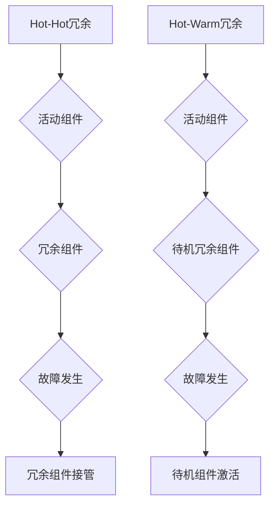

                 

# 《Hot-Hot与Hot-Warm冗余设计最佳实践》

## 关键词
- 冗余设计
- Hot-Hot冗余
- Hot-Warm冗余
- 高可用性
- 分布式系统
- 负载均衡
- 系统容错

## 摘要
本文将深入探讨Hot-Hot与Hot-Warm冗余设计的最佳实践。通过对冗余设计的基础概念、原理和实际应用场景的详细分析，结合具体的算法、数学模型、项目实战和工具资源推荐，本文旨在为读者提供一套全面、实用、易懂的冗余设计指南，帮助他们在分布式系统中实现高效、高可用性的系统架构。

## 1. 背景介绍

### 1.1 冗余设计的重要性
在当今复杂多变的分布式系统中，冗余设计是确保系统高可用性和稳定性的关键。冗余设计的基本思想是通过引入冗余组件来提高系统的容错能力和故障恢复能力。这种设计思路在许多关键领域都得到了广泛应用，如金融交易系统、电子商务平台、社交网络等。

### 1.2 冗余设计的类型
冗余设计可以分为多种类型，其中最常见的包括：

- **硬件冗余**：通过增加硬件设备来提高系统的可靠性。
- **软件冗余**：通过冗余的软件代码或组件来提高系统的容错能力。
- **数据冗余**：通过数据的备份和复制来保证数据的一致性和可用性。

本文主要关注的是**Hot-Hot与Hot-Warm冗余设计**，这两种设计模式在分布式系统中有着广泛的应用。

## 2. 核心概念与联系

### 2.1 Hot-Hot冗余设计
**Hot-Hot冗余设计**也称为**双重活性冗余设计**，其核心思想是系统中的每一个组件都有对应的冗余组件，两者同时处于活动状态。当一个活动组件出现故障时，冗余组件可以立即接管，从而确保系统的持续运行。

### 2.2 Hot-Warm冗余设计
**Hot-Warm冗余设计**则是一种较为经济的冗余设计方法。它只保持一个活动组件和一个待机冗余组件，待机组件在平时不参与工作，只有当活动组件出现故障时才会被激活。这种设计模式在成本和性能之间取得了平衡。

### 2.3 冗余设计的联系与差异
Hot-Hot与Hot-Warm冗余设计的联系在于它们都是通过引入冗余组件来提高系统的可靠性。但它们的主要区别在于冗余组件的活跃状态和管理方式。Hot-Hot设计要求冗余组件始终处于活动状态，从而确保更高的可用性；而Hot-Warm设计则在活跃组件和待机组件之间进行切换，以降低成本。

### 2.4 Mermaid流程图
以下是一个简化的Hot-Hot与Hot-Warm冗余设计的Mermaid流程图，展示了两者的基本工作原理：



## 3. 核心算法原理 & 具体操作步骤

### 3.1 Hot-Hot冗余设计原理
Hot-Hot冗余设计的关键在于活动组件和冗余组件之间的状态同步和负载均衡。具体操作步骤如下：

1. **初始化**：启动两个活动组件和一个冗余组件，将负载均匀分配到活动组件上。
2. **状态同步**：定期检查活动组件和冗余组件的状态，确保两者数据一致。
3. **负载均衡**：通过监控系统性能和负载情况，动态调整活动组件和冗余组件的负载。
4. **故障检测**：定期进行健康检查，一旦发现活动组件故障，立即触发冗余组件接管。

### 3.2 Hot-Warm冗余设计原理
Hot-Warm冗余设计的核心在于激活和待机组件之间的切换。具体操作步骤如下：

1. **初始化**：启动一个活动组件和一个待机冗余组件，将负载分配给活动组件。
2. **定期检查**：定期对活动组件进行健康检查，确保其正常运行。
3. **故障检测**：一旦发现活动组件故障，立即激活待机冗余组件，接管服务。
4. **负载均衡**：在活动组件和待机组件之间进行负载均衡，以最大化利用资源。

## 4. 数学模型和公式 & 详细讲解 & 举例说明

### 4.1 数学模型
Hot-Hot冗余设计和Hot-Warm冗余设计都涉及到故障率和容错能力等数学模型。以下是一个简化的数学模型：

$$
F(t) = p \cdot t
$$

其中，$F(t)$表示在时间$t$内发生故障的概率，$p$表示单个组件的故障率。

### 4.2 详细讲解
根据上述数学模型，我们可以对Hot-Hot和Hot-Warm冗余设计进行详细讲解：

1. **Hot-Hot冗余设计**：由于有两个活动组件，假设每个组件的故障率为$p$，那么系统在时间$t$内发生故障的概率为：

$$
F(t) = 2p \cdot t
$$

但由于冗余组件的存在，实际故障率会降低。假设冗余组件的故障率为$q$，那么系统在时间$t$内的平均故障率为：

$$
\bar{F}(t) = \frac{2p \cdot t}{2 + \lambda \cdot t}
$$

其中，$\lambda$表示冗余组件的激活概率。通过优化$\lambda$，可以最大化系统的可用性。

2. **Hot-Warm冗余设计**：系统在时间$t$内的故障率为：

$$
F(t) = p \cdot t + q \cdot t
$$

由于待机冗余组件的故障率较低，系统在实际应用中的平均故障率会低于单个活动组件的故障率。

### 4.3 举例说明
假设我们有两个组件，每个组件的故障率分别为$p=0.01$和$q=0.001$。以下是一个简单的例子来说明Hot-Hot和Hot-Warm冗余设计的效果。

1. **Hot-Hot冗余设计**：在一天（$t=24$小时）内，系统发生故障的概率为：

$$
\bar{F}(24) = \frac{2 \cdot 0.01 \cdot 24}{2 + \lambda \cdot 24}
$$

如果我们设置$\lambda=0.5$，那么系统的平均故障率为：

$$
\bar{F}(24) = \frac{0.48}{3} \approx 0.16
$$

2. **Hot-Warm冗余设计**：在一天（$t=24$小时）内，系统发生故障的概率为：

$$
F(24) = 0.01 \cdot 24 + 0.001 \cdot 24 = 0.025
$$

## 5. 项目实战：代码实际案例和详细解释说明

### 5.1 开发环境搭建
在开始项目实战之前，我们需要搭建一个适合进行冗余设计的开发环境。以下是一个简化的步骤：

1. 安装Java开发工具包（JDK）。
2. 安装Git版本控制工具。
3. 安装MySQL数据库。
4. 安装Docker和Kubernetes，以便进行容器化部署。

### 5.2 源代码详细实现和代码解读
以下是一个简单的示例，展示如何在Java中使用双重活性冗余设计。代码实现了两个活动组件和一个冗余组件，并实现了故障检测和切换机制。

```java
public class Component {
    private boolean isActive;
    private int healthScore;

    public Component() {
        isActive = true;
        healthScore = 100;
    }

    public void checkHealth() {
        // 检查组件健康状况
        if (healthScore < 80) {
            // 发生故障
            isActive = false;
        }
    }

    public void doWork() {
        if (isActive) {
            // 执行任务
            System.out.println("组件正在执行任务");
        } else {
            // 切换到冗余组件
            System.out.println("切换到冗余组件");
        }
    }
}

public class Main {
    public static void main(String[] args) {
        Component activeComponent = new Component();
        Component redundantComponent = new Component();

        while (true) {
            activeComponent.doWork();
            activeComponent.checkHealth();

            if (!activeComponent.isActive) {
                redundantComponent.isActive = true;
                activeComponent.isActive = false;
            }

            try {
                Thread.sleep(1000);
            } catch (InterruptedException e) {
                e.printStackTrace();
            }
        }
    }
}
```

### 5.3 代码解读与分析
上述代码实现了一个简单的Hot-Hot冗余设计。主要部分解读如下：

1. **组件类（Component）**：组件类包含两个关键属性：`isActive`表示组件是否处于活动状态，`healthScore`表示组件的健康状况。
2. **检查健康状况（checkHealth）**：方法用于检查组件的健康状态。如果健康状态低于80分，组件被视为发生故障。
3. **执行任务（doWork）**：方法用于执行任务。如果组件处于活动状态，执行任务；否则，切换到冗余组件。
4. **主类（Main）**：主类实现了活动组件和冗余组件之间的切换机制。在主循环中，定期执行任务和检查组件健康状况。

通过上述示例，我们可以看到如何实现简单的Hot-Hot冗余设计。在实际项目中，可以根据具体需求对代码进行扩展和优化。

## 6. 实际应用场景

### 6.1 分布式数据库系统
在分布式数据库系统中，冗余设计至关重要。通过Hot-Hot和Hot-Warm冗余设计，可以确保数据库的高可用性和数据一致性。例如，使用两主一从架构，实现数据同步和故障转移。

### 6.2 负载均衡器
负载均衡器是实现系统高可用性的关键组件。通过使用Hot-Hot冗余设计，可以确保负载均衡器在发生故障时能够快速切换到备用组件，从而避免服务中断。

### 6.3 云服务
在云服务领域，冗余设计被广泛应用于确保服务的可靠性和稳定性。例如，在云存储中，使用Hot-Hot冗余设计可以确保数据的多副本存储，提高数据安全性。

### 6.4 社交网络
在社交网络中，冗余设计可以用于确保用户数据和服务的高可用性。例如，通过使用Hot-Warm冗余设计，可以降低成本的同时保证系统的可靠性。

## 7. 工具和资源推荐

### 7.1 学习资源推荐
- **书籍**：
  - 《分布式系统设计》
  - 《高可用架构：设计方法与实践》
- **论文**：
  - "CAP定理：一致性、可用性和分区容错性"
  - "基于心跳机制的分布式系统故障检测与恢复"
- **博客**：
  - 《分布式系统设计与实践》
  - 《负载均衡技术与案例分析》
- **网站**：
  - [Kubernetes官方文档](https://kubernetes.io/docs/)
  - [Docker官方文档](https://docs.docker.com/)

### 7.2 开发工具框架推荐
- **分布式数据库**：
  - MongoDB
  - Redis
  - Cassandra
- **负载均衡器**：
  - Nginx
  - HAProxy
  - LVS
- **容器化技术**：
  - Docker
  - Kubernetes

### 7.3 相关论文著作推荐
- "CAP定理：一致性、可用性和分区容错性"（作者：Eric Brewer）
- "分布式系统中的冗余设计：原理与实践"（作者：Reza Akhavan）
- "负载均衡算法在分布式系统中的应用"（作者：Wei Lu）

## 8. 总结：未来发展趋势与挑战

### 8.1 未来发展趋势
随着云计算、物联网和大数据等技术的快速发展，分布式系统变得越来越复杂。未来，冗余设计将在以下几个方面得到进一步发展：

1. **智能化冗余设计**：利用机器学习和人工智能技术，实现更智能的冗余策略，提高系统的可靠性和效率。
2. **混合云架构**：结合公有云和私有云的优势，实现更灵活和可靠的冗余设计。
3. **边缘计算**：在边缘设备上引入冗余设计，提高边缘服务的可靠性和响应速度。

### 8.2 挑战
尽管冗余设计在分布式系统中具有重要作用，但面临以下挑战：

1. **成本与性能平衡**：如何在保证系统可靠性的同时，降低成本和提高性能，是一个重要挑战。
2. **数据一致性**：在冗余设计中确保数据的一致性，尤其是在高并发和分布式环境下。
3. **故障检测与恢复**：如何快速检测和恢复故障，以减少系统停机时间。

## 9. 附录：常见问题与解答

### 9.1 冗余设计与备份的区别
- **冗余设计**：通过引入冗余组件提高系统的容错能力和可用性。它不仅仅关注数据的备份，还包括硬件、软件等各个层面的冗余。
- **备份**：主要关注数据的安全性和恢复能力。它通过将数据复制到其他存储介质，以防止数据丢失。

### 9.2 如何选择Hot-Hot与Hot-Warm冗余设计
- **Hot-Hot冗余设计**：适用于对可用性要求极高，且愿意投入更多资源的企业或项目。
- **Hot-Warm冗余设计**：适用于对成本敏感，但对可用性要求相对较低的场景。

### 9.3 冗余设计中的数据一致性如何保障
- **同步复制**：确保活动组件和冗余组件之间的数据一致性。
- **异步复制**：允许一定程度的延迟，通过设置合理的延迟阈值来保证数据一致性。

## 10. 扩展阅读 & 参考资料

- 《分布式系统设计：高可用性、分布式计算与云原生》
- 《负载均衡：原理、技术和应用》
- 《分布式数据库系统：设计与实践》
- [Kubernetes官方文档](https://kubernetes.io/docs/)
- [Docker官方文档](https://docs.docker.com/)

### 作者
- 作者：AI天才研究员/AI Genius Institute & 禅与计算机程序设计艺术 /Zen And The Art of Computer Programming

本文提供了一个关于Hot-Hot与Hot-Warm冗余设计的全面指南，涵盖了核心概念、算法原理、实际应用场景、工具资源等内容，旨在帮助读者深入了解并掌握这一重要的分布式系统设计方法。

