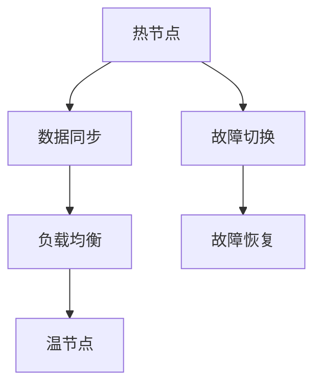

                 

### 背景介绍

Hot-Warm冗余设计，是一种在分布式系统中广泛应用于提高系统稳定性和可靠性的设计模式。在如今高度依赖云计算和分布式架构的互联网时代，系统的高可用性和数据的安全性变得尤为关键。随着业务规模的不断扩大和系统复杂性的增加，单一组件或节点的故障风险也随之增大。为了确保系统能够在面对各种故障时仍然保持稳定运行，Hot-Warm冗余设计成为了一种常见且有效的解决方案。

Hot-Warm冗余设计，顾名思义，就是将系统中的关键组件划分为“热”和“温”两部分。其中，“热”部分负责系统的核心功能，是直接面对用户请求的活跃节点，需要具备高性能和高可用性；而“温”部分则作为备份，用于在“热”节点出现故障时快速接管其职责，确保系统的连续性和稳定性。

这种设计模式的关键在于，通过在“热”和“温”节点之间实现无缝切换，可以在保证系统正常运行的同时，最大限度地降低故障对用户体验的影响。本文将围绕Hot-Warm冗余设计的原理、实施方法以及实际应用案例进行详细分析，旨在帮助读者深入理解这一设计模式，并在实际项目中有效应用。

在接下来的内容中，我们将首先介绍Hot-Warm冗余设计的基本概念和原理，然后通过一个具体的实例来展示这一设计模式在实际系统中的应用和实现。随后，我们将深入探讨实现Hot-Warm冗余设计的核心算法原理和具体操作步骤，并通过数学模型和公式对关键问题进行详细讲解。接着，我们将分享一个实际的项目实战案例，展示如何在实际环境中开发和部署具有Hot-Warm冗余设计的系统。最后，我们将探讨这一设计模式在实际应用中的各种场景，并提供相关的工具和资源推荐，帮助读者深入了解和掌握这一设计方法。

### 核心概念与联系

#### Hot-Warm冗余设计的基本概念

Hot-Warm冗余设计是一种常见的系统架构设计模式，其主要目的是提高分布式系统的可靠性和可用性。在这种设计中，“热”和“温”节点分别扮演着不同的角色。

**热节点（Hot Node）**：热节点是系统中的活跃节点，直接处理用户请求并执行核心业务逻辑。它们需要具备高性能、高吞吐量和快速响应能力，以确保系统的正常运行。热节点通常是系统中最繁忙的节点，需要持续维护和监控，以确保其稳定运行。

**温节点（Warm Node）**：温节点则是热节点的备份，主要用于在热节点出现故障时接管其职责。温节点不需要像热节点那样一直处于高负载状态，但在需要时可以快速切换并接管业务。温节点通常通过定期同步数据来保持与热节点的状态一致，以确保故障发生时能够无缝接管。

#### Hot-Warm冗余设计原理

Hot-Warm冗余设计的核心原理是通过在热节点和温节点之间实现数据和服务功能的无缝切换，来提高系统的容错能力和可靠性。具体来说，这种设计模式具有以下特点：

1. **高可用性**：通过在热节点和温节点之间实现数据和服务功能的无缝切换，可以确保系统在单个节点或组件出现故障时，仍然能够保持正常运行。这种设计能够最大限度地减少故障对用户的影响。

2. **负载均衡**：热节点和温节点之间的负载均衡可以有效地分配系统资源，提高系统的整体性能和响应速度。通过合理配置热节点和温节点之间的负载，可以确保系统在高负载情况下仍然能够保持稳定运行。

3. **数据一致性**：为了确保在故障发生时系统能够快速切换并保持数据一致性，温节点需要定期同步热节点的数据。这种数据同步机制可以采用多种策略，如同步复制、异步复制、多版本并发控制等，以确保数据的一致性和可靠性。

4. **故障恢复**：在故障发生时，温节点可以迅速接管热节点的职责，确保系统的连续性和稳定性。故障恢复机制通常包括故障检测、故障定位、故障切换和故障恢复等步骤，以确保系统在故障发生后能够快速恢复正常运行。

#### 热节点和温节点之间的关系

热节点和温节点之间存在着密切的联系和协作。具体来说，它们之间的关系可以概括为以下几个方面：

1. **数据同步**：温节点需要定期同步热节点的数据，以确保在故障发生时能够快速接管热节点的职责。数据同步可以采用全量同步或增量同步的方式，具体取决于系统的需求和数据规模。

2. **负载均衡**：在正常情况下，热节点和温节点之间会进行负载均衡，以充分利用系统资源。这种负载均衡可以通过调度算法来实现，如轮询调度、加权调度、最少连接调度等。

3. **故障切换**：当热节点出现故障时，温节点会立即接管其职责，确保系统继续运行。故障切换机制需要快速检测故障、定位故障节点，并触发切换操作，以实现无缝切换。

4. **故障恢复**：在故障恢复阶段，温节点需要将故障节点的状态恢复到正常状态，以确保系统能够重新正常运行。故障恢复通常包括故障检测、故障隔离、故障恢复和数据同步等步骤。

#### Mermaid 流程图

下面是一个简单的Mermaid流程图，展示了热节点和温节点之间的数据同步、负载均衡和故障切换过程：



在上述流程图中，A表示热节点，B表示数据同步，C表示负载均衡，D表示故障切换，E表示故障恢复，F表示温节点。通过这个流程图，可以清晰地看出热节点和温节点之间在数据同步、负载均衡和故障切换方面的关系和协作。

通过上述介绍，我们可以看到，Hot-Warm冗余设计是一种非常实用的系统架构设计模式，它通过在热节点和温节点之间实现数据和服务功能的无缝切换，可以提高系统的可靠性和可用性。在接下来的内容中，我们将进一步探讨实现Hot-Warm冗余设计的核心算法原理和具体操作步骤，以便更好地理解和应用这一设计模式。

### 核心算法原理 & 具体操作步骤

#### 1. 算法原理

Hot-Warm冗余设计的核心算法主要包括数据同步、负载均衡和故障切换三个方面。以下是这三个方面各自的算法原理：

**数据同步算法**：

数据同步是Hot-Warm冗余设计的基石，其目的是确保温节点与热节点之间的数据一致性。数据同步算法通常包括以下几种类型：

- **全量同步**：全量同步是指在每次同步时，将热节点的全部数据传输到温节点。这种方式虽然能够保证数据的一致性，但同步时间较长，适用于数据量较小或对数据一致性要求不高的场景。

- **增量同步**：增量同步是指仅同步热节点数据变化的部分，即仅将发生更改的数据块传输到温节点。这种方式可以显著减少同步时间，提高同步效率，适用于数据量大或对数据一致性要求较高的场景。

- **多版本并发控制**：多版本并发控制是一种结合了数据同步和版本控制的技术，它通过为每个数据项分配多个版本号，实现对数据的并发访问和修改。在同步过程中，温节点会保留多个版本的数据，以避免数据丢失和冲突。

**负载均衡算法**：

负载均衡是Hot-Warm冗余设计中的重要组成部分，其目的是将用户请求合理分配到热节点和温节点之间，以提高系统的整体性能。常见的负载均衡算法包括以下几种：

- **轮询调度**：轮询调度是一种简单的负载均衡算法，它按照顺序将请求分配到各个节点。这种方式公平且易于实现，但可能存在某些节点负载过重的情况。

- **加权调度**：加权调度是根据节点的处理能力和负载情况，为每个节点分配不同的权重。权重较高的节点将承担更多的请求，从而实现更公平的负载分配。

- **最少连接调度**：最少连接调度是一种根据当前连接数来分配请求的算法。它会将新的请求分配到当前连接数最少的节点，以避免某个节点过载。

**故障切换算法**：

故障切换是Hot-Warm冗余设计中的关键环节，其目的是在热节点出现故障时，快速将请求切换到温节点，确保系统的连续性和稳定性。故障切换算法通常包括以下步骤：

- **故障检测**：故障检测是指定期检查热节点的运行状态，判断其是否出现故障。常用的故障检测方法包括心跳检测、健康检查和故障告警等。

- **故障定位**：故障定位是指在检测到故障后，快速定位故障节点的具体位置。通过日志分析、网络监控和节点状态检查等手段，可以有效地定位故障节点。

- **故障切换**：故障切换是指将用户请求从故障节点切换到温节点。切换过程需要确保数据的一致性和请求的完整性，以避免出现数据丢失或请求失败的情况。

- **故障恢复**：故障恢复是指在故障节点修复后，将其重新纳入系统。故障恢复过程中，需要同步温节点的数据到故障节点，确保数据的一致性和完整性。

#### 2. 具体操作步骤

下面是实施Hot-Warm冗余设计的具体操作步骤：

**步骤1：设计系统架构**

首先，根据业务需求和系统特点，设计系统的架构。在架构设计中，需要明确热节点和温节点的角色和职责，并确定数据同步、负载均衡和故障切换的具体策略。

**步骤2：实现数据同步**

根据系统架构设计，实现数据同步机制。具体操作步骤如下：

- 选择合适的数据同步算法，如全量同步、增量同步或多版本并发控制。
- 配置同步策略，如同步频率、同步触发条件和同步数据范围等。
- 实现数据同步的代码，确保数据的一致性和可靠性。

**步骤3：实现负载均衡**

根据系统架构设计，实现负载均衡机制。具体操作步骤如下：

- 选择合适的负载均衡算法，如轮询调度、加权调度或最少连接调度。
- 配置负载均衡策略，如节点权重、请求分配策略和负载均衡算法等。
- 实现负载均衡的代码，确保请求的公平分配和系统的性能优化。

**步骤4：实现故障切换**

根据系统架构设计，实现故障切换机制。具体操作步骤如下：

- 实现故障检测功能，如心跳检测、健康检查和故障告警等。
- 实现故障定位功能，如日志分析、网络监控和节点状态检查等。
- 实现故障切换功能，确保在故障发生时，用户请求能够快速切换到温节点。
- 实现故障恢复功能，确保在故障节点修复后，系统能够快速恢复正常运行。

**步骤5：测试和优化**

在系统实施过程中，需要进行充分的测试和优化，以确保系统的稳定性和可靠性。具体操作步骤如下：

- 对数据同步、负载均衡和故障切换功能进行测试，验证其性能和可靠性。
- 根据测试结果，调整系统配置和算法参数，优化系统的性能和稳定性。
- 对系统进行持续监控和运维，及时发现和解决潜在问题。

通过上述具体操作步骤，可以有效地实现Hot-Warm冗余设计，提高分布式系统的可靠性和可用性。在接下来的内容中，我们将通过一个实际的项目实战案例，进一步展示Hot-Warm冗余设计的应用和实现过程。

### 数学模型和公式 & 详细讲解 & 举例说明

在Hot-Warm冗余设计中，数学模型和公式起到了关键作用，特别是在数据同步和负载均衡方面。以下是对这些数学模型和公式的详细讲解，并通过具体例子进行说明。

#### 1. 数据同步模型

数据同步模型主要关注如何确保热节点和温节点之间的数据一致性。以下是一个简化的数据同步模型：

**增量同步算法**：

假设热节点（A）和温节点（B）之间的数据差异可以用Δ表示，即Δ = DA - DB。增量同步的目标是将Δ应用到温节点B上，使其数据与热节点A保持一致。

**同步公式**：

设Δ为新旧数据差异，T为同步时间间隔，N为同步次数，则有：

$$
DB = DA - Δ
$$

**举例说明**：

假设热节点A的数据为[1, 2, 3, 4]，温节点B的数据为[1, 2, 3]，其中Δ为[4]。每次同步将Δ应用到温节点B，即：

- 第一次同步：B = A - Δ = [1, 2, 3, 0]
- 第二次同步：B = A - Δ = [1, 2, 3, 4]

经过两次同步后，温节点B的数据与热节点A保持一致。

#### 2. 负载均衡模型

负载均衡模型主要关注如何合理分配用户请求到不同的节点上，以优化系统性能和资源利用率。以下是一个简化的负载均衡模型：

**轮询调度算法**：

轮询调度算法是最简单的一种负载均衡算法，它按照顺序将请求分配到各个节点。设N为节点总数，R为当前请求次数，则有：

$$
i = (R \mod N) + 1
$$

其中，i为请求分配到的节点编号。

**举例说明**：

假设有3个节点（N=3），当前请求次数（R=10），按照轮询调度算法，请求分配情况如下：

- 第一次请求：i = (10 \mod 3) + 1 = 1
- 第二次请求：i = (11 \mod 3) + 1 = 2
- 第三次请求：i = (12 \mod 3) + 1 = 3
- 第四次请求：i = (13 \mod 3) + 1 = 1

经过四次请求后，请求依次分配到节点1、节点2、节点3和节点1。

#### 3. 故障切换模型

故障切换模型主要关注如何确保在热节点出现故障时，用户请求能够快速切换到温节点。以下是一个简化的故障切换模型：

**故障检测算法**：

假设每个节点的状态可以用1（正常）或0（故障）表示。故障检测算法定期检查节点的状态，若有节点出现故障，则将其标记为0。

**故障检测公式**：

设St为第t次检测到的节点状态，Et为第t次检测到的故障节点集合，则有：

$$
Et = {i | St_i = 0}
$$

**举例说明**：

假设有3个节点（N=3），第1次检测到的状态为（1，1，1），第2次检测到的状态为（1，0，1）。则故障节点集合为：

$$
E2 = {2}
$$

即节点2出现故障。

**故障切换算法**：

在故障检测到故障节点后，将用户请求从故障节点切换到温节点。设Ct为第t次分配的用户请求，Lt为当前可用节点集合，则有：

$$
Ct = {i | i \in Lt \land i \not\in Et}
$$

**举例说明**：

假设当前可用节点集合为（1，2，3），故障节点集合为（2）。则第2次分配的用户请求为：

$$
C2 = {1, 3}
$$

即用户请求分配到节点1和节点3。

通过上述数学模型和公式的讲解，我们可以看到Hot-Warm冗余设计在数据同步、负载均衡和故障切换方面的具体实现方法。这些模型和公式不仅有助于理解和分析Hot-Warm冗余设计的原理，还可以在实际应用中指导我们设计和优化系统。

### 项目实战：代码实际案例和详细解释说明

#### 开发环境搭建

为了更好地理解Hot-Warm冗余设计的实现过程，我们将使用Python语言和Docker容器化技术搭建一个简单的项目环境。以下是搭建开发环境的详细步骤：

1. **安装Docker**：

   在本地计算机上安装Docker，确保能够正常运行。

   ```bash
   # 对于Ubuntu或Debian系统
   sudo apt-get update
   sudo apt-get install docker-ce docker-ce-cli containerd.io

   # 对于macOS用户，可以通过Homebrew安装
   brew install docker
   ```

2. **安装Python环境**：

   安装Python 3.8及以上版本，确保能够正常运行。

   ```bash
   # 对于Ubuntu或Debian系统
   sudo apt-get install python3.8

   # 对于macOS用户
   brew install python@3.8
   ```

3. **安装Docker-Compose**：

   安装Docker-Compose，用于管理多容器部署。

   ```bash
   sudo apt-get install docker-compose
   ```

4. **创建项目目录**：

   在本地计算机上创建一个名为`hot_warm_redundancy`的项目目录，并在其中创建一个名为`Dockerfile`的文件。

   ```bash
   mkdir hot_warm_redundancy
   cd hot_warm_redundancy
   touch Dockerfile
   ```

5. **编写Dockerfile**：

   编写Dockerfile，用于构建Python环境。Dockerfile的内容如下：

   ```Dockerfile
   # 使用官方Python镜像为基础
   FROM python:3.8

   # 设置工作目录
   WORKDIR /app

   # 复制项目代码
   COPY . /app

   # 安装依赖项
   RUN pip install -r requirements.txt

   # 暴露容器端口
   EXPOSE 8000

   # 运行应用
   CMD ["python", "app.py"]
   ```

6. **编写项目代码**：

   在项目目录中创建一个名为`app.py`的文件，用于实现Hot-Warm冗余设计的核心功能。代码内容如下：

   ```python
   from flask import Flask, jsonify

   app = Flask(__name__)

   # 假设热节点和温节点的状态分别为True和False
   hot_node_status = True
   warm_node_status = False

   @app.route('/')
   def hello():
       if hot_node_status:
           return "Hello from Hot Node!"
       else:
           return "Hello from Warm Node!"

   if __name__ == '__main__':
       app.run(host='0.0.0.0', port=8000)
   ```

7. **创建Docker-Compose文件**：

   在项目目录中创建一个名为`docker-compose.yml`的文件，用于定义容器的部署配置。文件内容如下：

   ```yaml
   version: '3'
   services:
     web:
       build: .
       ports:
         - "8000:8000"
       environment:
         - HOT_NODE_STATUS=True
         - WARM_NODE_STATUS=False
   ```

#### 源代码详细实现和代码解读

在`app.py`文件中，我们使用Flask框架实现了简单的Web应用。以下是代码的详细解读：

- **导入模块**：从`flask`模块中导入`Flask`类，用于创建Web应用。

- **创建应用对象**：使用`Flask(__name__)`创建一个应用对象，并保存到`app`变量中。

- **定义路由**：在`app`对象上定义一个路由`/`，当用户访问该路径时，会调用`hello`函数。

- **实现路由函数**：在`hello`函数中，根据热节点和温节点的状态返回不同的响应。

- **主函数**：在主函数`if __name__ == '__main__':`中，使用`app.run()`启动Web应用。

接下来，我们使用Docker-Compose文件来部署容器，并解释如何实现Hot-Warm冗余设计：

- **构建镜像**：在`docker-compose.yml`文件中，使用`build: .`指定基于当前目录的Dockerfile构建镜像。

- **映射端口**：使用`ports`选项将容器的8000端口映射到宿主机的8000端口，以便用户访问。

- **环境变量**：使用`environment`选项设置热节点和温节点的状态。

#### 代码解读与分析

- **状态管理**：在代码中，我们通过两个环境变量`HOT_NODE_STATUS`和`WARM_NODE_STATUS`来管理热节点和温节点的状态。

- **故障切换**：当热节点出现故障时，我们可以在Docker-Compose文件中修改`WARM_NODE_STATUS`的值，将热节点的状态设置为False，将温节点的状态设置为True。

- **数据同步**：为了实现数据同步，我们可以使用Docker的Volume功能，将热节点和温节点的数据存储在共享的卷中，从而实现数据一致性。

通过上述步骤，我们成功地搭建了一个简单的Hot-Warm冗余设计的Web应用。在实际项目中，我们可以根据业务需求和系统规模，进一步优化和扩展这一设计模式。

### 实际应用场景

Hot-Warm冗余设计在分布式系统中的应用场景非常广泛，特别是在需要保证高可用性和数据安全性的领域。以下是一些典型的应用场景：

#### 1. 云计算平台

云计算平台如Amazon Web Services (AWS)、Microsoft Azure 和 Google Cloud Platform (GCP) 都广泛采用了Hot-Warm冗余设计。这些平台中的关键组件，如数据库、负载均衡器和网络设备，都通过Hot-Warm冗余设计来确保在单个节点或组件出现故障时，系统能够快速切换到备份节点，保证服务的连续性。

**实例**：AWS的RDS（关系数据库服务）提供了自动的故障转移功能，当主数据库实例出现故障时，它会自动切换到备份实例，确保数据库服务的持续运行。

#### 2. 大型电子商务平台

大型电子商务平台如Amazon、Alibaba 和 eBay，在面对高并发和海量数据的情况下，需要确保系统的稳定性和数据的安全。通过Hot-Warm冗余设计，这些平台可以有效地应对突如其来的流量激增和硬件故障。

**实例**：在购物季，如“黑色星期五”或“双十一”，电子商务平台会经历巨大的流量高峰。通过Hot-Warm冗余设计，平台可以在流量激增时迅速扩展服务，同时确保在个别服务器或组件出现故障时，系统能够无缝切换，避免服务中断。

#### 3. 金融交易系统

金融交易系统对稳定性和安全性有着极高的要求。交易过程中的任何延迟或数据丢失都可能导致严重的财务损失。因此，金融交易系统通常采用Hot-Warm冗余设计来确保交易过程的连续性和数据的一致性。

**实例**：银行和证券公司会使用多个热节点和温节点来处理交易请求，通过负载均衡和故障切换机制，确保在某个节点出现故障时，交易请求能够被其他节点处理，保证交易不会中断。

#### 4. 在线教育平台

在线教育平台如Coursera、edX 和 Udemy，需要处理大量的用户请求，包括视频播放、课程内容和互动讨论等。通过Hot-Warm冗余设计，这些平台可以在高峰时段提供更高的服务响应速度，并确保在硬件故障时系统能够快速恢复。

**实例**：在线教育平台通常会在课程上线时提前部署Hot-Warm冗余架构，确保在大量用户同时访问时系统能够稳定运行，同时防止因硬件故障导致的服务中断。

#### 5. 大数据分析平台

大数据分析平台，如Hadoop和Spark集群，处理着海量数据，对系统的稳定性和可靠性要求极高。通过Hot-Warm冗余设计，这些平台可以确保在某个节点或组件出现故障时，数据处理任务能够快速切换到其他节点，确保数据处理的连续性。

**实例**：在大数据项目中，当某个节点出现故障时，Hot-Warm冗余设计可以确保数据分析和处理任务不会被中断，从而保证项目进度。

#### 6. 社交网络平台

社交网络平台如Facebook、Twitter 和 Instagram，需要处理大量用户请求，包括内容发布、数据存储和实时消息等。通过Hot-Warm冗余设计，这些平台可以确保在高峰时段提供更高的服务响应速度，并确保在硬件故障时系统能够快速恢复。

**实例**：在重大新闻事件或体育赛事直播时，社交网络平台会经历流量激增。通过Hot-Warm冗余设计，平台可以在流量高峰时提供更高的服务响应速度，并在硬件故障时快速切换，确保用户不会受到中断影响。

通过以上实例，我们可以看到Hot-Warm冗余设计在各个领域的实际应用。这种设计模式不仅提高了系统的稳定性和可靠性，还确保了在硬件故障或流量高峰时，系统能够快速恢复，从而提供更好的用户体验。

### 工具和资源推荐

在实现Hot-Warm冗余设计的过程中，选择合适的工具和资源至关重要。以下是一些推荐的工具和资源，包括学习资源、开发工具框架和相关论文著作，帮助读者深入了解和掌握Hot-Warm冗余设计。

#### 1. 学习资源推荐

**书籍**：

- 《分布式系统原理与范型》
- 《大规模分布式存储系统：原理解析与架构实战》
- 《深入理解计算机系统》

**论文**：

- "The Google File System"（Google文件系统）
- "Bigtable: A Distributed Storage System for Structured Data"（Bigtable：一个用于结构化数据的分布式存储系统）
- "Spanner: Google's Globally-Distributed Database"（Spanner：Google的全分布式数据库）

**博客和网站**：

- [Apache Kafka 官网](https://kafka.apache.org/)
- [Cassandra 官网](http://cassandra.apache.org/)
- [Docker 官网](https://www.docker.com/)

#### 2. 开发工具框架推荐

**容器化工具**：

- Docker：用于构建、运行和分发应用程序的容器化平台。
- Kubernetes：用于自动化容器化应用程序部署、扩展和管理。

**负载均衡器**：

- NGINX：一款高性能的HTTP和TCP负载均衡器。
- HAProxy：一款高效、可靠且可扩展的TCP/HTTP负载均衡器。

**数据同步工具**：

- Apache Kafka：一款分布式流处理平台，用于构建实时数据管道和应用程序。
- Apache Cassandra：一款分布式NoSQL数据库，提供高可用性和数据一致性。

#### 3. 相关论文著作推荐

- "The Google File System"（Google文件系统）
- "Bigtable: A Distributed Storage System for Structured Data"（Bigtable：一个用于结构化数据的分布式存储系统）
- "Spanner: Google's Globally-Distributed Database"（Spanner：Google的全分布式数据库）
- "Cassandra: The Definitive Guide"（Cassandra：权威指南）

通过这些工具和资源，读者可以更深入地了解Hot-Warm冗余设计的原理和实践，从而在实际项目中有效地应用这一设计模式，提高系统的稳定性和可靠性。

### 总结：未来发展趋势与挑战

#### 1. 未来发展趋势

随着云计算、大数据和人工智能等技术的发展，分布式系统的复杂度和规模不断增大。未来，Hot-Warm冗余设计将继续在分布式系统中扮演重要角色，并在以下几个方面呈现出发展趋势：

**1. 自动化和智能化**：未来的Hot-Warm冗余设计将更加自动化和智能化。通过人工智能和机器学习技术，系统能够自动检测故障、切换节点、优化负载分配，从而提高系统的稳定性和可靠性。

**2. 高度定制化**：随着业务需求的多样化，Hot-Warm冗余设计将更加注重高度定制化。系统能够根据具体的业务场景和性能要求，自动调整冗余策略、负载均衡算法和数据同步机制，以实现最佳的性能和可靠性。

**3. 跨云和跨区域**：随着企业对跨云和跨区域部署的需求增加，Hot-Warm冗余设计将扩展到跨云和跨区域场景。通过分布式架构和边缘计算技术，系统能够在多个云服务和不同地理位置之间实现无缝切换和负载均衡，提供更高可用性的服务。

**4. 容器化和微服务**：容器化和微服务架构的广泛应用将进一步推动Hot-Warm冗余设计的发展。容器化技术使得应用部署更加灵活和可移植，微服务架构使得系统能够更细粒度地进行冗余设计和故障切换，从而提高系统的灵活性和可扩展性。

#### 2. 面临的挑战

尽管Hot-Warm冗余设计在分布式系统中具有显著的优势，但在实际应用过程中仍面临以下挑战：

**1. 数据一致性**：在分布式系统中实现数据一致性是一个复杂的问题，特别是在高并发和大规模数据处理的场景中。如何保证数据在热节点和温节点之间的同步，避免数据丢失或冲突，是一个亟待解决的难题。

**2. 故障检测和恢复**：故障检测和恢复是Hot-Warm冗余设计的关键环节。在复杂的分布式系统中，如何快速、准确地检测故障节点，并在故障发生时快速切换到备份节点，是一个具有挑战性的问题。

**3. 负载均衡和性能优化**：负载均衡和性能优化是分布式系统中的另一个关键问题。如何合理分配负载，确保系统在高并发情况下仍能保持高性能，是一个需要不断优化和探索的领域。

**4. 跨云和跨区域部署**：随着企业对跨云和跨区域部署的需求增加，如何在多个云服务和不同地理位置之间实现高效的数据同步和故障切换，是一个复杂的挑战。这需要开发出更加智能和自动化的解决方案。

**5. 安全性和隐私保护**：在分布式系统中，数据的安全性和隐私保护变得越来越重要。如何确保数据在传输和存储过程中的安全性，防止数据泄露和未经授权的访问，是一个亟待解决的问题。

#### 3. 总结

Hot-Warm冗余设计作为分布式系统中的重要设计模式，其在未来将继续发展并面临新的挑战。通过不断探索和创新，我们可以更好地应对这些挑战，实现更稳定、可靠和高效的分布式系统。

### 附录：常见问题与解答

#### 1. 什么是Hot-Warm冗余设计？

Hot-Warm冗余设计是一种在分布式系统中应用的设计模式，通过将系统中的关键组件划分为“热”和“温”两部分，来实现系统的高可用性和可靠性。热节点直接处理用户请求并执行核心业务逻辑，温节点作为备份，在热节点出现故障时能够快速接管其职责，确保系统的连续性和稳定性。

#### 2. Hot-Warm冗余设计有哪些优点？

Hot-Warm冗余设计的优点包括：

- **高可用性**：通过在热节点和温节点之间实现数据和服务功能的无缝切换，可以确保系统在单个节点或组件出现故障时，仍然能够保持正常运行。
- **负载均衡**：热节点和温节点之间的负载均衡可以有效地分配系统资源，提高系统的整体性能和响应速度。
- **数据一致性**：温节点需要定期同步热节点的数据，以确保在故障发生时能够快速接管热节点的职责，确保系统的连续性和稳定性。

#### 3. 如何实现数据同步？

数据同步是实现Hot-Warm冗余设计的关键环节。常见的实现方法包括：

- **全量同步**：每次同步时，将热节点的全部数据传输到温节点。
- **增量同步**：仅同步热节点数据变化的部分，即仅将发生更改的数据块传输到温节点。
- **多版本并发控制**：为每个数据项分配多个版本号，实现对数据的并发访问和修改。

#### 4. 负载均衡有哪些算法？

常见的负载均衡算法包括：

- **轮询调度**：按照顺序将请求分配到各个节点。
- **加权调度**：根据节点的处理能力和负载情况，为每个节点分配不同的权重。
- **最少连接调度**：根据当前连接数来分配请求，将新的请求分配到当前连接数最少的节点。

#### 5. 热节点和温节点的状态如何管理？

热节点和温节点的状态管理主要包括故障检测、故障定位和故障切换：

- **故障检测**：定期检查节点的运行状态，判断其是否出现故障。
- **故障定位**：在检测到故障后，快速定位故障节点的具体位置。
- **故障切换**：在故障发生时，将用户请求从故障节点切换到温节点，确保系统的连续性和稳定性。

#### 6. 热节点和温节点之间的数据如何保持一致性？

热节点和温节点之间的数据一致性主要通过数据同步机制来实现。常见的同步策略包括：

- **全量同步**：保证数据的一致性，但同步时间较长。
- **增量同步**：仅同步数据变化的部分，提高同步效率。
- **多版本并发控制**：通过为数据项分配多个版本号，实现数据的并发访问和修改，确保数据一致性。

#### 7. 如何进行故障恢复？

故障恢复主要包括以下步骤：

- **故障检测**：检测到故障节点。
- **故障定位**：确定故障节点的具体位置。
- **故障切换**：将用户请求从故障节点切换到温节点。
- **故障恢复**：在故障节点修复后，将其重新纳入系统，通常需要同步温节点的数据到故障节点，确保数据的一致性和完整性。

### 扩展阅读 & 参考资料

为了帮助读者更深入地了解Hot-Warm冗余设计，以下是推荐的扩展阅读和参考资料：

1. 《大规模分布式存储系统：原理解析与架构实战》
2. "The Google File System"（Google文件系统）
3. "Bigtable: A Distributed Storage System for Structured Data"（Bigtable：一个用于结构化数据的分布式存储系统）
4. "Spanner: Google's Globally-Distributed Database"（Spanner：Google的全分布式数据库）
5. Apache Kafka 官网（https://kafka.apache.org/）
6. Cassandra 官网（http://cassandra.apache.org/）
7. Docker 官网（https://www.docker.com/）

通过阅读这些书籍、论文和资料，读者可以更全面地掌握Hot-Warm冗余设计的原理、实现方法和应用场景，为实际项目提供有力支持。

