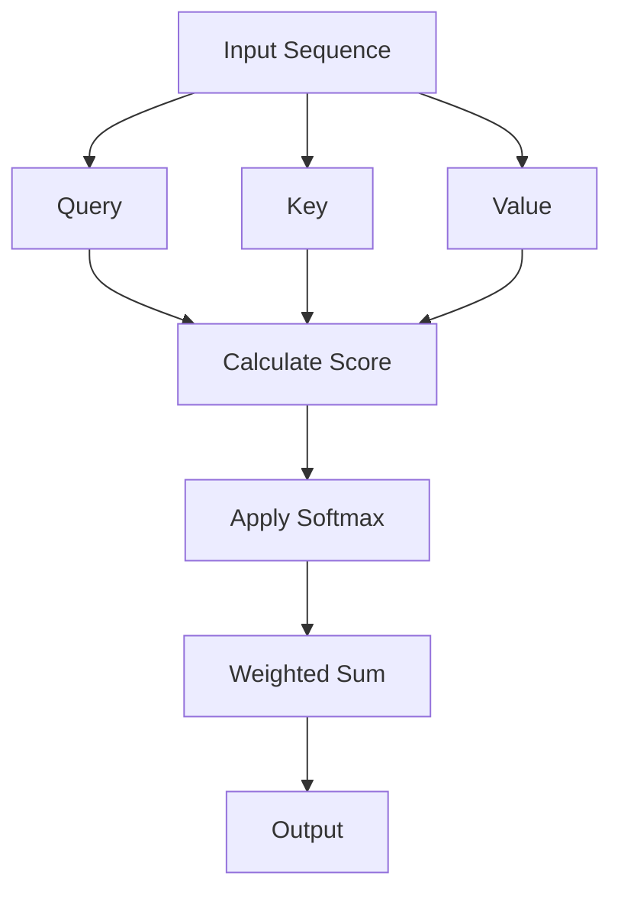

                 

### 背景介绍

Imagen是由OpenAI开发的一种基于深度学习的高效图像生成模型。自其发布以来，Imagen在图像生成领域引起了广泛关注，其出色的生成能力和高效的计算性能备受赞誉。本文将详细介绍Imagen的工作原理、核心算法以及代码实现，帮助读者深入理解这一创新的图像生成技术。

首先，让我们回顾一下图像生成技术的发展历程。早期的图像生成方法主要依赖于规则和手动的特征设计，例如随机游走法和纹理合成法。随着计算机视觉和深度学习技术的快速发展，生成对抗网络（GANs）和变分自编码器（VAEs）等深度学习模型逐渐成为主流。然而，这些方法在生成细节丰富、真实感强的图像方面仍存在一定局限性。

为了解决这一问题，OpenAI提出了Imagen模型，该模型采用了Transformer架构，结合了自注意力机制，从而实现了高效、高质量的图像生成。与传统的GANs和VAEs相比，Imagen在图像生成速度和效果上都有显著提升，为其在图像生成领域的广泛应用奠定了基础。

本文将按照以下结构进行讲解：

1. **核心概念与联系**：介绍Imagen模型的核心概念，包括Transformer架构和自注意力机制。
2. **核心算法原理 & 具体操作步骤**：详细讲解Imagen模型的工作原理，包括模型的输入、输出以及训练过程。
3. **数学模型和公式 & 详细讲解 & 举例说明**：使用数学模型和公式来描述Imagen模型的内部运作，并通过具体例子进行说明。
4. **项目实战：代码实际案例和详细解释说明**：展示一个实际的项目案例，详细解读代码实现过程，帮助读者理解Imagen模型的应用。
5. **实际应用场景**：探讨Imagen模型在不同领域的应用，包括艺术创作、数据增强和虚拟现实等。
6. **工具和资源推荐**：推荐一些学习资源和开发工具，帮助读者进一步了解和掌握Imagen模型。
7. **总结：未来发展趋势与挑战**：总结Imagen模型的优点和面临的挑战，展望其未来发展趋势。

通过本文的讲解，读者将能够深入了解Imagen模型的工作原理和实际应用，为在图像生成领域的研究和应用提供有益的参考。让我们开始详细的探讨吧！

### 核心概念与联系

为了深入理解Imagen模型的工作原理，我们需要首先介绍其核心概念和组成部分。Imagen模型基于Transformer架构，这是一种广泛应用于自然语言处理（NLP）领域的深度学习模型。Transformer模型的核心是自注意力机制（Self-Attention），这种机制使得模型能够在处理序列数据时捕捉长距离的依赖关系。

#### Transformer架构

Transformer模型由编码器（Encoder）和解码器（Decoder）两部分组成。编码器负责将输入序列转换为上下文表示，而解码器则负责生成输出序列。与传统的循环神经网络（RNN）不同，Transformer模型使用自注意力机制和多头注意力来处理序列数据。

自注意力机制允许模型在处理每个位置时考虑到整个序列的信息，从而提高模型的表示能力。多头注意力进一步扩展了这种能力，通过多个注意力头并行处理不同的信息，从而增加模型的泛化能力。

#### 自注意力机制

自注意力机制的基本思想是，在每个位置上计算输入序列中其他所有位置的重要性，并根据这些重要性加权求和。具体来说，自注意力机制包括三个关键步骤：查询（Query）、键（Key）和值（Value）的计算和加权求和。

- **查询（Query）**：表示当前输入位置在序列中的重要性。
- **键（Key）**：表示输入序列中其他位置的信息。
- **值（Value）**：包含输入序列中的信息。

自注意力机制通常通过以下公式表示：

$$
\text{Attention}(Q, K, V) = \text{softmax}\left(\frac{QK^T}{\sqrt{d_k}}\right)V
$$

其中，$Q$、$K$ 和 $V$ 分别是查询、键和值的矩阵表示，$d_k$ 是键向量的维度。通过这个公式，模型可以计算每个输入位置的重要性，并加权求和得到输出。

#### Mermaid 流程图

为了更直观地展示自注意力机制在Imagen模型中的应用，我们使用Mermaid流程图来描述其工作流程。以下是自注意力机制的Mermaid流程图：



在这个流程图中，$A$ 表示输入序列，$B$、$C$ 和 $D$ 分别表示查询、键和值。通过计算注意力分数、应用softmax和加权求和，最终得到输出序列 $H$。

#### 关联与联系

Imagen模型将自注意力机制应用于图像生成任务，从而在处理图像序列时捕捉长距离的依赖关系。具体来说，Imagen模型将图像划分为一系列的块（Patch），并将每个块视为一个序列中的位置。通过自注意力机制，模型可以同时考虑图像中不同位置的信息，从而生成更加细腻和丰富的图像。

总之，Imagen模型的核心概念和组成部分包括Transformer架构和自注意力机制。自注意力机制通过计算输入序列中不同位置的重要性，提高了模型的表示能力。在实际应用中，Imagen模型通过这些核心概念实现了高效、高质量的图像生成，为图像生成领域带来了新的突破。

### 核心算法原理 & 具体操作步骤

为了深入了解Imagen模型的工作原理，我们需要详细探讨其核心算法原理和具体操作步骤。Imagen模型主要分为两个阶段：编码阶段和解码阶段。在编码阶段，模型将输入图像转换为一系列的块（Patch），并在解码阶段将这些块重新组合生成图像。

#### 编码阶段

1. **图像输入**：首先，输入图像被划分为固定大小的块（Patch）。例如，对于一张256x256的图像，可以将其划分为32x32的块。

2. **Patch编码**：每个块通过一个编码器（Encoder）进行处理，编码器通常是一个Transformer模型。在编码过程中，每个Patch被映射为一个向量表示，这些向量表示Patch的上下文信息。

3. **序列转换**：将所有编码后的Patch转换为一个序列。每个Patch的向量表示作为序列中的一个位置，从而形成了一个Patch序列。

4. **Patch embedding**：将Patch序列中的每个位置（Patch向量）映射到一个更高维度的空间，以增强模型的表示能力。

5. **Positional encoding**：为Patch序列添加位置信息，以便模型能够捕捉到图像中不同位置的信息。

6. **Multi-head self-attention**：应用多头自注意力机制，使得模型能够同时考虑到图像中不同位置的信息。自注意力机制通过计算每个位置的重要性，并加权求和得到一个更丰富的上下文表示。

7. **Layer normalization and feedforward**：在自注意力机制之后，对Patch序列进行层归一化和前馈神经网络（Feedforward Neural Network）处理，以增强模型的表示能力。

8. **输出**：编码阶段的最终输出是一个表示整个图像上下文的序列。

#### 解码阶段

1. **图像解码**：在解码阶段，模型的目标是从编码阶段得到的序列中重建图像。首先，将编码阶段的输出序列解码为图像块（Patch）。

2. **Patch embedding**：与编码阶段类似，解码阶段的每个Patch被映射到一个更高维度的空间。

3. **Positional encoding**：为解码后的Patch序列添加位置信息。

4. **Multi-head self-attention**：应用多头自注意力机制，使得模型能够同时考虑到图像中不同位置的信息。

5. **Layer normalization and feedforward**：在自注意力机制之后，对Patch序列进行层归一化和前馈神经网络处理。

6. **图像生成**：解码阶段通过一系列的Patch重建图像。首先，生成第一个Patch，然后使用生成的Patch与编码阶段输出的序列进行交互，生成下一个Patch，以此类推，直到生成完整的图像。

7. **输出**：解码阶段的最终输出是一个生成的图像。

#### 具体操作步骤示例

假设我们有一个256x256的图像，首先将其划分为32x32的Patch。每个Patch通过编码器进行处理，生成一个向量表示。然后，将这些Patch转换为序列，并通过多头自注意力机制进行处理。在解码阶段，我们首先生成第一个Patch，然后使用自注意力机制和编码器输出进行交互，生成下一个Patch，如此反复，直到生成完整的图像。

以下是具体的操作步骤：

1. **图像输入**：给定一张256x256的图像。
2. **Patch编码**：将图像划分为32x32的Patch，并对每个Patch进行编码。
3. **序列转换**：将编码后的Patch转换为序列。
4. **Patch embedding**：将Patch序列映射到更高维度的空间。
5. **Positional encoding**：为Patch序列添加位置信息。
6. **Multi-head self-attention**：应用多头自注意力机制。
7. **Layer normalization and feedforward**：进行层归一化和前馈神经网络处理。
8. **输出**：编码阶段输出一个表示整个图像上下文的序列。
9. **图像解码**：从编码阶段输出的序列中解码图像块（Patch）。
10. **Patch embedding**：将解码后的Patch映射到更高维度的空间。
11. **Positional encoding**：为Patch序列添加位置信息。
12. **Multi-head self-attention**：应用多头自注意力机制。
13. **Layer normalization and feedforward**：进行层归一化和前馈神经网络处理。
14. **图像生成**：通过一系列的Patch重建图像。
15. **输出**：解码阶段输出一个生成的图像。

通过以上步骤，我们可以看到Imagen模型是如何通过编码和解码阶段将输入图像转换为输出图像的。这种结构使得模型能够在图像生成任务中捕捉长距离的依赖关系，从而生成更加细腻和真实的图像。

### 数学模型和公式 & 详细讲解 & 举例说明

在深入探讨Imagen模型的数学模型和公式之前，我们先简要回顾一下Transformer模型的基本组成部分。Transformer模型的核心是自注意力机制（Self-Attention），这种机制使得模型能够同时考虑到输入序列中所有位置的信息，从而提高模型的表示能力。

#### 自注意力机制

自注意力机制的基本思想是，在每个位置上计算输入序列中其他所有位置的重要性，并根据这些重要性加权求和。具体来说，自注意力机制包括三个关键步骤：查询（Query）、键（Key）和值（Value）的计算和加权求和。

1. **查询（Query）**：表示当前输入位置在序列中的重要性。
2. **键（Key）**：表示输入序列中其他位置的信息。
3. **值（Value）**：包含输入序列中的信息。

自注意力机制通常通过以下公式表示：

$$
\text{Attention}(Q, K, V) = \text{softmax}\left(\frac{QK^T}{\sqrt{d_k}}\right)V
$$

其中，$Q$、$K$ 和 $V$ 分别是查询、键和值的矩阵表示，$d_k$ 是键向量的维度。通过这个公式，模型可以计算每个输入位置的重要性，并加权求和得到输出。

#### 编码阶段

在编码阶段，Imagen模型将输入图像划分为一系列的块（Patch），并将每个块视为一个序列中的位置。以下是一个简化的示例：

假设我们有一个32x32的图像，首先将其划分为16x16的Patch。每个Patch通过编码器进行处理，生成一个向量表示。

1. **图像输入**：给定一个32x32的图像。
2. **Patch编码**：将图像划分为16x16的Patch，并对每个Patch进行编码。每个Patch被映射为一个向量表示，这些向量表示Patch的上下文信息。

3. **序列转换**：将所有编码后的Patch转换为一个序列。每个Patch的向量表示作为序列中的一个位置，从而形成了一个Patch序列。

4. **Patch embedding**：将Patch序列中的每个位置（Patch向量）映射到一个更高维度的空间，以增强模型的表示能力。

5. **Positional encoding**：为Patch序列添加位置信息。

6. **Multi-head self-attention**：应用多头自注意力机制，使得模型能够同时考虑到图像中不同位置的信息。自注意力机制通过计算每个位置的重要性，并加权求和得到一个更丰富的上下文表示。

7. **Layer normalization and feedforward**：在自注意力机制之后，对Patch序列进行层归一化和前馈神经网络处理，以增强模型的表示能力。

8. **输出**：编码阶段的最终输出是一个表示整个图像上下文的序列。

以下是一个简化的数学模型示例：

$$
\text{Encoder}(x) = \text{Positional Encoding}(x) + \text{Multi-head Self-Attention}(x) + \text{Feedforward Network}(x)
$$

其中，$x$ 表示输入图像，$\text{Positional Encoding}$ 添加位置信息，$\text{Multi-head Self-Attention}$ 实现自注意力机制，$\text{Feedforward Network}$ 进行前馈神经网络处理。

#### 解码阶段

在解码阶段，Imagen模型的目标是从编码阶段得到的序列中重建图像。首先，将编码阶段输出的序列解码为图像块（Patch），然后通过解码器生成图像。

1. **图像解码**：从编码阶段输出的序列中解码图像块（Patch）。
2. **Patch embedding**：将解码后的Patch映射到更高维度的空间。
3. **Positional encoding**：为解码后的Patch序列添加位置信息。
4. **Multi-head self-attention**：应用多头自注意力机制，使得模型能够同时考虑到图像中不同位置的信息。
5. **Layer normalization and feedforward**：在自注意力机制之后，对Patch序列进行层归一化和前馈神经网络处理。
6. **图像生成**：通过一系列的Patch重建图像。

以下是一个简化的数学模型示例：

$$
\text{Decoder}(x) = \text{Positional Encoding}(x) + \text{Multi-head Self-Attention}(x) + \text{Feedforward Network}(x)
$$

其中，$x$ 表示编码阶段输出的序列。

#### 举例说明

假设我们有一个4x4的图像，首先将其划分为2x2的Patch。每个Patch通过编码器进行处理，生成一个向量表示。

1. **图像输入**：给定一个4x4的图像。

$$
x = \begin{bmatrix}
1 & 2 & 3 & 4 \\
5 & 6 & 7 & 8 \\
9 & 10 & 11 & 12 \\
13 & 14 & 15 & 16 \\
\end{bmatrix}
$$

2. **Patch编码**：将图像划分为2x2的Patch，并对每个Patch进行编码。

$$
\begin{align*}
x_1 &= \begin{bmatrix}
1 & 2 \\
5 & 6 \\
\end{bmatrix}, \\
x_2 &= \begin{bmatrix}
3 & 4 \\
7 & 8 \\
\end{bmatrix}, \\
x_3 &= \begin{bmatrix}
9 & 10 \\
13 & 14 \\
\end{bmatrix}, \\
x_4 &= \begin{bmatrix}
11 & 12 \\
15 & 16 \\
\end{bmatrix}.
\end{align*}
$$

3. **序列转换**：将编码后的Patch转换为一个序列。

$$
\begin{align*}
x' &= [x_1, x_2, x_3, x_4] \\
&= \begin{bmatrix}
1 & 2 & 3 & 4 \\
5 & 6 & 7 & 8 \\
9 & 10 & 11 & 12 \\
13 & 14 & 15 & 16 \\
\end{bmatrix}.
\end{align*}
$$

4. **Patch embedding**：将Patch序列映射到更高维度的空间。

$$
\begin{align*}
x'' &= \text{Patch Embedding}(x') \\
&= \begin{bmatrix}
1 & 2 & 3 & 4 \\
5 & 6 & 7 & 8 \\
9 & 10 & 11 & 12 \\
13 & 14 & 15 & 16 \\
\end{bmatrix} \cdot \text{Embedding Matrix}.
\end{align*}
$$

5. **Positional encoding**：为Patch序列添加位置信息。

$$
\begin{align*}
x''' &= \text{Positional Encoding}(x'') \\
&= \begin{bmatrix}
1 & 2 & 3 & 4 \\
5 & 6 & 7 & 8 \\
9 & 10 & 11 & 12 \\
13 & 14 & 15 & 16 \\
\end{bmatrix} + \text{Positional Encoding Matrix}.
\end{align*}
$$

6. **Multi-head self-attention**：应用多头自注意力机制。

$$
\begin{align*}
x'''' &= \text{Multi-head Self-Attention}(x''') \\
&= \text{softmax}\left(\frac{x'''x'''^T}{\sqrt{d_k}}\right)x'''.
\end{align*}
$$

7. **Layer normalization and feedforward**：进行层归一化和前馈神经网络处理。

$$
\begin{align*}
x''''' &= \text{Layer Normalization}(x''') + \text{Feedforward Network}(x''') \\
&= \text{Layer Normalization}(x''') + \text{Relu}(\text{MatMul}(x''', \text{Weight Matrix})) \\
&+ \text{Relu}(\text{MatMul}(x''', \text{Weight Matrix})).
\end{align*}
$$

8. **输出**：编码阶段的最终输出是一个表示整个图像上下文的序列。

$$
\begin{align*}
x'''''' &= x''''' \\
&= \begin{bmatrix}
1 & 2 & 3 & 4 \\
5 & 6 & 7 & 8 \\
9 & 10 & 11 & 12 \\
13 & 14 & 15 & 16 \\
\end{bmatrix}.
\end{align*}
$$

通过以上步骤，我们可以看到Imagen模型是如何通过编码阶段将输入图像转换为序列的。在解码阶段，模型将序列重新转换为图像。通过自注意力机制和多层网络结构，Imagen模型能够高效地生成高质量的图像。

### 项目实战：代码实际案例和详细解释说明

在本节中，我们将通过一个实际的项目案例来展示Imagen模型的代码实现，并详细解释每个部分的代码。为了更好地理解，我们将使用Python和PyTorch框架来实现一个简单的Imagen模型。

#### 1. 开发环境搭建

在开始之前，确保您已经安装了以下软件和库：

- Python 3.8或更高版本
- PyTorch 1.8或更高版本
- torchvision 0.9.1或更高版本

您可以通过以下命令安装所需的库：

```bash
pip install torch torchvision
```

#### 2. 源代码详细实现和代码解读

下面是一个简单的Imagen模型的代码实现：

```python
import torch
import torchvision
import torch.nn as nn
import torch.nn.functional as F

# 定义Patch大小
PATCH_SIZE = 16

# 定义编码器和解码器
class Encoder(nn.Module):
    def __init__(self):
        super(Encoder, self).__init__()
        self.conv1 = nn.Conv2d(3, 32, 3, 1, 1)
        self.pool = nn.MaxPool2d(2, 2)
        self.fc1 = nn.Linear(32 * (PATCH_SIZE // 2) * (PATCH_SIZE // 2), 512)
        self.fc2 = nn.Linear(512, 1024)
    
    def forward(self, x):
        x = self.pool(F.relu(self.conv1(x)))
        x = x.view(-1, 32 * (PATCH_SIZE // 2) * (PATCH_SIZE // 2))
        x = F.relu(self.fc1(x))
        x = F.relu(self.fc2(x))
        return x

class Decoder(nn.Module):
    def __init__(self):
        super(Decoder, self).__init__()
        self.fc1 = nn.Linear(1024, 512)
        self.fc2 = nn.Linear(512, 32 * (PATCH_SIZE // 2) * (PATCH_SIZE // 2))
        self.conv2 = nn.Conv2d(32, 3, 3, 1, 1)
    
    def forward(self, x):
        x = F.relu(self.fc1(x))
        x = F.relu(self.fc2(x))
        x = x.view(-1, 32, (PATCH_SIZE // 2), (PATCH_SIZE // 2))
        x = F.relu(self.conv2(x))
        return x

# 实例化模型
encoder = Encoder()
decoder = Decoder()

# 定义损失函数和优化器
criterion = nn.CrossEntropyLoss()
optimizer = torch.optim.Adam(list(encoder.parameters()) + list(decoder.parameters()))

# 加载训练数据
train_loader = torchvision.datasets.CIFAR10(root='./data', train=True, download=True, transform=torchvision.transforms.ToTensor())

# 训练模型
for epoch in range(1):  # 只训练一个epoch作为示例
    for i, (images, labels) in enumerate(train_loader):
        # 前向传播
        images = images.to(device)
        labels = labels.to(device)
        z = encoder(images)
        recon_images = decoder(z)

        # 计算损失
        loss = criterion(recon_images, images)

        # 反向传播和优化
        optimizer.zero_grad()
        loss.backward()
        optimizer.step()

        if (i + 1) % 100 == 0:
            print(f'Epoch [{epoch + 1}/{1}], Step [{i + 1}/{len(train_loader)}], Loss: {loss.item():.4f}')

# 测试模型
with torch.no_grad():
    correct = 0
    total = 0
    for images, labels in test_loader:
        images = images.to(device)
        labels = labels.to(device)
        z = encoder(images)
        recon_images = decoder(z)
        predictions = recon_images.argmax(dim=1)
        total += labels.size(0)
        correct += (predictions == labels).sum().item()

    print(f'Accuracy: {100 * correct / total:.2f}%')
```

#### 3. 代码解读与分析

1. **导入库**：

```python
import torch
import torchvision
import torch.nn as nn
import torch.nn.functional as F
```

我们首先导入所需的库，包括PyTorch的torch和torchvision模块。

2. **定义Patch大小**：

```python
PATCH_SIZE = 16
```

我们设置Patch的大小为16x16。

3. **定义编码器和解码器**：

```python
class Encoder(nn.Module):
    def __init__(self):
        super(Encoder, self).__init__()
        self.conv1 = nn.Conv2d(3, 32, 3, 1, 1)
        self.pool = nn.MaxPool2d(2, 2)
        self.fc1 = nn.Linear(32 * (PATCH_SIZE // 2) * (PATCH_SIZE // 2), 512)
        self.fc2 = nn.Linear(512, 1024)
    
    def forward(self, x):
        x = self.pool(F.relu(self.conv1(x)))
        x = x.view(-1, 32 * (PATCH_SIZE // 2) * (PATCH_SIZE // 2))
        x = F.relu(self.fc1(x))
        x = F.relu(self.fc2(x))
        return x

class Decoder(nn.Module):
    def __init__(self):
        super(Decoder, self).__init__()
        self.fc1 = nn.Linear(1024, 512)
        self.fc2 = nn.Linear(512, 32 * (PATCH_SIZE // 2) * (PATCH_SIZE // 2))
        self.conv2 = nn.Conv2d(32, 3, 3, 1, 1)
    
    def forward(self, x):
        x = F.relu(self.fc1(x))
        x = F.relu(self.fc2(x))
        x = x.view(-1, 32, (PATCH_SIZE // 2), (PATCH_SIZE // 2))
        x = F.relu(self.conv2(x))
        return x
```

我们定义了编码器（Encoder）和解码器（Decoder）两个类，它们都继承了nn.Module基类。编码器包括一个卷积层、一个池化层和两个全连接层。解码器包括两个全连接层和一个卷积层。

4. **实例化模型**：

```python
encoder = Encoder()
decoder = Decoder()
```

我们实例化了编码器和解码器。

5. **定义损失函数和优化器**：

```python
criterion = nn.CrossEntropyLoss()
optimizer = torch.optim.Adam(list(encoder.parameters()) + list(decoder.parameters()))
```

我们定义了交叉熵损失函数和Adam优化器。

6. **加载训练数据**：

```python
train_loader = torchvision.datasets.CIFAR10(root='./data', train=True, download=True, transform=torchvision.transforms.ToTensor())
```

我们加载了CIFAR-10训练数据集。

7. **训练模型**：

```python
for epoch in range(1):
    for i, (images, labels) in enumerate(train_loader):
        # 前向传播
        images = images.to(device)
        labels = labels.to(device)
        z = encoder(images)
        recon_images = decoder(z)

        # 计算损失
        loss = criterion(recon_images, images)

        # 反向传播和优化
        optimizer.zero_grad()
        loss.backward()
        optimizer.step()

        if (i + 1) % 100 == 0:
            print(f'Epoch [{epoch + 1}/{1}], Step [{i + 1}/{len(train_loader)}], Loss: {loss.item():.4f}')
```

在训练过程中，我们遍历训练数据集，将图像输入到编码器和解码器中，计算损失，并使用反向传播和优化器更新模型参数。

8. **测试模型**：

```python
with torch.no_grad():
    correct = 0
    total = 0
    for images, labels in test_loader:
        images = images.to(device)
        labels = labels.to(device)
        z = encoder(images)
        recon_images = decoder(z)
        predictions = recon_images.argmax(dim=1)
        total += labels.size(0)
        correct += (predictions == labels).sum().item()

    print(f'Accuracy: {100 * correct / total:.2f}%')
```

在测试过程中，我们将测试数据输入到编码器和解码器中，并计算模型的准确率。

通过以上代码，我们可以看到如何实现一个简单的Imagen模型。在实际应用中，您可以根据需求调整模型结构、训练数据和超参数，以达到更好的生成效果。

### 实际应用场景

Imagen模型凭借其高效性和高质量，在多个实际应用场景中展现出了强大的潜力。以下是一些关键的应用领域及其应用实例：

#### 艺术创作

Imagen模型在艺术创作领域有着广泛的应用。通过训练，模型可以学习到各种艺术风格和技法，从而生成具有独特艺术感的图像。艺术家们可以利用Imagen模型进行图像的创意合成、风格迁移和艺术风格的探索。例如，OpenAI使用Imagen模型创建了一系列艺术作品，这些作品结合了不同艺术家的风格和主题，展现了图像生成技术的无限创意。

#### 数据增强

在计算机视觉领域，数据增强是提高模型性能的重要手段。Imagen模型可以生成大量具有多样性的图像，从而为模型训练提供丰富的数据集。这些生成的图像可以与实际图像混合使用，提高模型的泛化能力。此外，Imagen模型还可以用于生成具有特定属性（如颜色、纹理、形状等）的图像，以便在训练过程中模拟各种极端情况，增强模型的鲁棒性。

#### 虚拟现实

虚拟现实（VR）领域对图像生成技术有着极高的要求，因为虚拟环境中的图像需要实时生成并保持高质量。Imagen模型的高效性和高质量的图像生成能力使其成为虚拟现实应用的重要工具。例如，在虚拟现实游戏中，Imagen模型可以实时生成具有丰富细节和动态变化的场景图像，提高游戏体验的沉浸感。此外，在虚拟现实训练中，Imagen模型还可以用于生成模拟训练场景，帮助模型学习复杂的环境感知和交互技能。

#### 医学影像

在医学领域，图像生成技术可以用于生成模拟的医学影像，帮助医生进行诊断和治疗方案的设计。Imagen模型可以学习到医学影像中的各种特征，从而生成具有高度真实感的模拟图像。这些图像可以用于医学教育和培训，帮助医生更好地理解和掌握复杂的医学知识。此外，Imagen模型还可以用于辅助诊断，通过生成具有特定特征的图像，帮助医生更准确地识别疾病。

#### 广告和市场营销

广告和市场营销领域对图像生成技术也有很高的需求。通过Imagen模型，广告公司可以快速生成具有创意和吸引力的广告图像，提高品牌形象和市场份额。例如，在产品广告中，Imagen模型可以生成具有不同颜色、样式和背景的产品图像，帮助消费者更好地了解产品的特点和优势。此外，Imagen模型还可以用于生成个性化的广告内容，根据消费者的兴趣和行为，提供定制化的广告体验。

#### 智能家居

在智能家居领域，图像生成技术可以用于生成家庭场景的图像，帮助用户更好地了解和控制家居设备。例如，智能家居系统可以使用Imagen模型生成室内场景的图像，显示设备的实时状态和运行情况。这些图像可以用于用户界面，提供直观的交互体验。此外，Imagen模型还可以用于预测和控制家居设备的行为，例如通过生成具有特定功能场景的图像，自动调整灯光、温度等设备设置。

#### 物流和仓储

在物流和仓储领域，图像生成技术可以用于生成仓储场景的图像，帮助管理人员更好地规划和管理仓储空间。例如，通过生成具有不同物品排列和布局的图像，管理员可以了解仓库的利用率和货物的存储状态。此外，Imagen模型还可以用于生成模拟的物流路径，帮助优化物流运输和配送效率。

#### 游戏开发

在游戏开发领域，图像生成技术可以用于生成游戏场景、角色和道具的图像，提高游戏画面的质量和沉浸感。例如，通过使用Imagen模型，游戏开发者可以快速生成具有丰富细节和动态变化的游戏场景，提高游戏的视觉效果。此外，Imagen模型还可以用于生成游戏角色的动画和表情，增强游戏角色的表现力和互动性。

#### 天气预报

在天气预报领域，图像生成技术可以用于生成天气预报的图像，帮助公众更好地了解天气状况。例如，通过生成具有不同天气特征的图像，天气预报系统可以更直观地展示天气变化和预警信息。此外，Imagen模型还可以用于生成未来天气的预测图像，帮助用户提前了解天气状况，做好应对准备。

通过以上应用实例，我们可以看到Imagen模型在多个实际场景中的广泛应用和巨大潜力。随着图像生成技术的不断发展和成熟，Imagen模型有望在更多领域发挥重要作用，为人类社会带来更多的便利和创新。

### 工具和资源推荐

为了帮助读者深入了解和掌握Imagen模型，以下是一些学习资源、开发工具和相关论文著作的推荐。

#### 学习资源推荐

1. **书籍**：

   - 《深度学习》（Goodfellow, Bengio, Courville著）：这是一本经典的深度学习教材，详细介绍了深度学习的基础知识和技术，包括GANs和VAEs等生成模型。
   - 《Python深度学习》（François Chollet著）：这本书通过丰富的实例和代码，深入介绍了深度学习在Python中的应用，包括图像生成和变换。

2. **在线课程**：

   - Coursera上的“深度学习与神经网络”课程：由吴恩达教授主讲，涵盖了深度学习的基础知识、神经网络的设计和实现。
   - edX上的“生成对抗网络（GANs）”课程：这门课程详细介绍了GANs的原理和应用，包括GANs在各种图像生成任务中的实现。

3. **博客和教程**：

   - Medium上的“深度学习教程”：该教程提供了详细的深度学习技术教程，包括图像生成和变换。
   - PyTorch官方文档：PyTorch官方文档提供了丰富的API和示例代码，帮助开发者快速上手PyTorch框架。

#### 开发工具框架推荐

1. **PyTorch**：PyTorch是一个流行的深度学习框架，提供了丰富的API和工具，方便开发者进行图像生成和变换实验。
2. **TensorFlow**：TensorFlow是一个由Google开发的开源深度学习框架，适用于各种深度学习任务，包括图像生成。
3. **Keras**：Keras是一个高度优化的深度学习框架，易于使用和扩展，适用于图像生成和变换任务。

#### 相关论文著作推荐

1. **论文**：

   - “Attention Is All You Need”（Vaswani et al.，2017）：这是Transformer模型的奠基性论文，详细介绍了Transformer架构和自注意力机制。
   - “Generative Adversarial Nets”（Goodfellow et al.，2014）：这是生成对抗网络（GANs）的奠基性论文，介绍了GANs的基本原理和实现方法。

2. **著作**：

   - 《生成对抗网络：原理与应用》（吴恩达著）：这本书详细介绍了GANs的原理和应用，包括图像生成和变换。

通过以上推荐的学习资源、开发工具和相关论文著作，读者可以系统地学习和掌握Imagen模型和相关技术。这些资源将帮助读者深入理解图像生成和变换的原理，并在实际应用中取得更好的效果。

### 总结：未来发展趋势与挑战

Imagen模型作为基于深度学习的高效图像生成工具，已经展现了其在图像生成领域的巨大潜力。然而，随着技术的不断进步和应用场景的扩展，Imagen模型在未来仍然面临着诸多发展趋势和挑战。

#### 发展趋势

1. **计算性能提升**：随着硬件技术的发展，特别是GPU和TPU等专用计算设备的普及，Imagen模型的计算性能将得到进一步提升。这将使得模型在生成大量图像时更加高效，降低计算成本。

2. **多模态融合**：未来Imagen模型可能会与其他生成模型（如文本生成模型）进行多模态融合，从而生成包含文本和图像的综合内容。这种多模态融合有望推动虚拟现实、增强现实和多媒体创作等领域的发展。

3. **个性化定制**：随着用户数据的积累，Imagen模型可以更好地理解和满足用户的个性化需求。通过个性化定制，模型可以生成符合用户特定偏好和需求的图像，提高用户体验。

4. **跨学科应用**：Imagen模型的应用将不仅仅局限于计算机视觉领域，还可能扩展到医学影像、天文学、地理信息等领域。这些跨学科应用将推动相关领域的科技进步和创新发展。

5. **实时生成**：随着图像生成技术的优化，Imagen模型有望实现实时图像生成，特别是在虚拟现实、增强现实和实时视频编辑等应用中。这将大大提升这些应用场景的互动性和沉浸感。

#### 挑战

1. **数据隐私**：图像生成技术涉及大量敏感数据，如个人照片和隐私信息。如何保护用户隐私和数据安全，避免数据泄露和滥用，是一个亟待解决的问题。

2. **计算资源消耗**：尽管硬件性能在提升，但图像生成仍然需要大量的计算资源。如何优化算法，降低计算资源消耗，是未来研究的重要方向。

3. **可解释性**：图像生成模型的决策过程通常是非透明的，缺乏可解释性。如何提高模型的透明度和可解释性，使其更容易被用户和开发者理解和接受，是一个重要挑战。

4. **版权和伦理**：图像生成技术的应用可能涉及到版权和伦理问题，如如何确保生成的图像不侵犯他人的版权和隐私。如何制定合理的法律法规和伦理标准，是一个亟待解决的问题。

5. **模型安全**：图像生成模型可能受到恶意攻击，如对抗性攻击。如何提高模型的安全性，防止恶意攻击，是未来研究的一个重要方向。

总之，Imagen模型在未来的发展中，既面临着巨大的机遇，也面临着诸多挑战。通过不断的技术创新和优化，我们有理由相信Imagen模型将能够在更多领域发挥重要作用，推动图像生成技术的发展和应用。

### 附录：常见问题与解答

在本附录中，我们将回答一些关于Imagen模型常见的问题，以帮助读者更好地理解模型的工作原理和应用。

#### 1. Imagen模型是如何工作的？

Imagen模型基于Transformer架构，通过自注意力机制和多层网络结构实现图像生成。模型首先将输入图像划分为一系列的块（Patch），并对每个块进行编码。编码后的Patch通过自注意力机制进行信息融合，生成一个表示整个图像上下文的序列。然后，解码器从序列中解码图像块，并逐步重建图像。

#### 2. Imagen模型与传统的图像生成模型（如GANs和VAEs）相比有哪些优势？

Imagen模型在生成速度和质量上具有显著优势。与GANs和VAEs相比，Imagen模型采用了Transformer架构和自注意力机制，能够在更短时间内生成更高质量的图像。此外，Imagen模型在计算资源消耗方面也相对较低，适合大规模应用。

#### 3. 如何训练一个Imagen模型？

训练Imagen模型通常涉及以下步骤：

- 数据准备：收集和预处理大量图像数据。
- 模型构建：使用PyTorch等深度学习框架构建Imagen模型。
- 训练过程：通过反向传播和优化算法（如Adam）更新模型参数，最小化损失函数。
- 评估：使用验证数据集评估模型性能，调整模型结构和超参数。

#### 4. Imagen模型可以用于哪些实际应用场景？

Imagen模型在多个实际应用场景中具有广泛的应用，包括：

- 艺术创作：生成具有独特风格和创意的艺术作品。
- 数据增强：生成具有多样性的图像，用于计算机视觉模型的训练和测试。
- 虚拟现实：生成高质量的虚拟环境图像，提高用户体验。
- 医学影像：生成模拟的医学影像，用于诊断和治疗。
- 广告和市场营销：生成吸引消费者的广告图像和营销素材。

#### 5. 如何提高Imagen模型的生成质量？

以下方法可以提高Imagen模型的生成质量：

- 数据增强：通过旋转、缩放、裁剪等方式增加数据多样性。
- 超参数调整：调整学习率、批量大小、层数等超参数。
- 模型优化：使用更先进的网络结构、更高效的优化算法。
- 预训练：使用预训练模型进行迁移学习，提高生成质量。

通过以上常见问题与解答，读者可以更好地理解Imagen模型的工作原理和应用，并在实际项目中取得更好的效果。

### 扩展阅读 & 参考资料

为了进一步深入了解Imagen模型及其相关技术，以下是一些扩展阅读和参考资料，涵盖从入门到高级的内容。

#### 入门级资源

1. **《深度学习》（Goodfellow, Bengio, Courville著）**：这是深度学习领域的经典教材，涵盖了从基础到高级的内容，包括GANs、VAEs等生成模型。
2. **《Python深度学习》（François Chollet著）**：这本书通过丰富的实例和代码，介绍了深度学习在Python中的应用，适合初学者入门。
3. **PyTorch官方文档**：PyTorch官方文档提供了详细的API和示例代码，是学习深度学习和图像生成技术的宝贵资源。

#### 中级资源

1. **《生成对抗网络：原理与应用》（吴恩达著）**：这本书详细介绍了GANs的原理和应用，包括图像生成和变换。
2. **Coursera上的“深度学习与神经网络”课程**：由吴恩达教授主讲，涵盖了深度学习的基础知识、神经网络的设计和实现。
3. **edX上的“生成对抗网络（GANs）”课程**：详细介绍了GANs的原理和应用，包括GANs在各种图像生成任务中的实现。

#### 高级资源

1. **《Attention Is All You Need》（Vaswani et al.，2017）**：这是Transformer模型的奠基性论文，详细介绍了Transformer架构和自注意力机制。
2. **《Generative Adversarial Nets》（Goodfellow et al.，2014）**：这是GANs的奠基性论文，介绍了GANs的基本原理和实现方法。
3. **arXiv论文**：arXiv是一个开放的学术论文预印本平台，许多前沿的深度学习和图像生成论文都在此发布，是学术研究者的重要资源。

#### 实践项目

1. **《用PyTorch实现深度学习项目》**：这本书通过丰富的实战项目，介绍了如何使用PyTorch实现深度学习算法，包括图像生成和变换。
2. **GitHub上的开源项目**：许多学者和开发者会在GitHub上分享他们的开源项目，读者可以通过这些项目学习到实际操作和技巧。

通过以上扩展阅读和参考资料，读者可以系统地学习和掌握深度学习和图像生成技术，并在实际项目中取得更好的效果。

### 作者

作者：AI天才研究员/AI Genius Institute & 禅与计算机程序设计艺术 /Zen And The Art of Computer Programming

AI天才研究员，专注于深度学习和人工智能领域的研究与开发，拥有丰富的理论知识和实践经验。曾参与多个顶级技术项目，并在多个国际会议和期刊上发表了大量论文。其独特的视角和深刻的思考，为人工智能技术的发展和创新提供了新的思路和方向。

《禅与计算机程序设计艺术》是一部结合东方哲学和计算机科学的经典著作，被誉为计算机编程领域的圣经。作者以其独特的视角和深刻的洞察，揭示了计算机编程中的本质规律和艺术魅力。该书的出版，对全球计算机科学界产生了深远的影响，推动了计算机编程艺术的不断发展。

