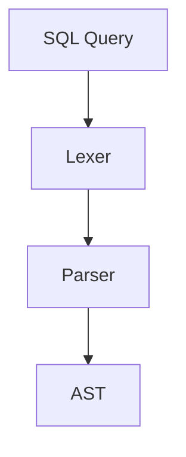
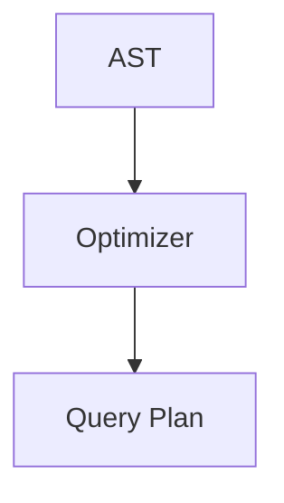
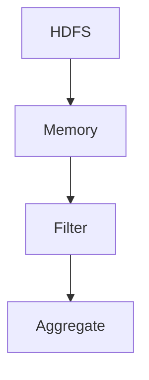

                 

# Impala原理与代码实例讲解

## 关键词：大数据处理，Impala查询引擎，Hadoop生态系统，SQL兼容性，分布式查询

## 摘要：
本文将深入探讨Impala作为大数据处理查询引擎的原理及其在Hadoop生态系统中的应用。通过详细的代码实例讲解，我们将理解Impala如何快速高效地执行分布式查询，以及如何配置和优化其性能。文章还将涵盖Impala的核心算法原理、数学模型和实际应用场景，并推荐相关的学习资源和工具框架。

## 1. 背景介绍

在大数据时代，处理海量数据变得越来越重要。传统的数据库管理系统（DBMS）在处理大规模数据时往往力不从心，而分布式存储和计算框架如Hadoop的出现，为我们提供了新的解决方案。Impala作为Hadoop生态系统的一部分，是一个专为大数据设计的低延迟、高性能的查询引擎，提供了与标准SQL兼容的查询接口。

Impala由Cloudera开发，其设计目标是简化大规模数据集的查询过程，并实现亚秒级的响应时间。它直接在HDFS（Hadoop Distributed File System）上执行查询，不需要预先进行数据转换或加载到其他存储引擎中，大大提高了查询效率。此外，Impala支持多种数据格式，包括Parquet、ORC和Avro，这些都是在大数据领域广泛使用的列式存储格式。

## 2. 核心概念与联系

### 2.1. 分布式文件系统与分布式数据库

在深入探讨Impala之前，我们需要了解Hadoop生态系统中的核心组件：分布式文件系统（HDFS）和分布式数据库（如HBase、Hive和Impala）。

HDFS是一个高可靠性的分布式文件存储系统，它将大文件拆分为多个数据块，并分布存储在多个节点上。这种设计提高了数据冗余性和容错性，同时也适应了大数据的高吞吐量需求。

与HDFS不同，分布式数据库不仅存储数据，还提供数据查询功能。HBase是一个基于HDFS的分布式非关系型数据库，适合存储海量稀疏数据。Hive则是一个数据仓库工具，使用HDFS作为其底层存储，提供了类似SQL的查询接口，但它通过MapReduce进行数据处理，效率较低。

Impala作为Hadoop生态系统中的成员，旨在解决Hive在查询效率上的不足。它直接在HDFS上执行SQL查询，避免了MapReduce的冗余数据处理步骤，从而实现了亚秒级的响应时间。

### 2.2. Mermaid流程图

```mermaid
graph TD
    A[HDFS]
    B[HBase]
    C[Hive]
    D[Impala]
    A --> B
    A --> C
    A --> D
    B --> "数据查询"
    C --> "数据查询"
    D --> "数据查询"
```

### 2.3. Impala查询引擎的工作原理

Impala查询引擎的工作原理可以概括为以下几个步骤：

1. **查询解析（Parsing）**：Impala解析SQL查询语句，将其转换为内部的查询计划。
2. **查询优化（Optimization）**：优化查询计划，选择最佳执行路径。
3. **执行（Execution）**：执行查询计划，直接在HDFS上读取数据并处理。
4. **结果返回（Result Return）**：将查询结果返回给用户。

Impala利用了Hadoop生态系统中的其他组件，如YARN（Yet Another Resource Negotiator）进行资源调度，确保查询的高效执行。

## 3. 核心算法原理 & 具体操作步骤

### 3.1. Query Parsing

当用户提交一个SQL查询时，Impala的第一步是查询解析。查询解析器将SQL语句拆分为多个组件，如选择列表（SELECT）、条件（WHERE）、分组（GROUP BY）等，并构建一个抽象语法树（AST）。



### 3.2. Query Optimization

查询优化器接收AST，并生成一个查询计划。优化器会进行各种优化，如谓词下推（Predicate Pushdown）、表连接优化（Join Optimization）等，以减少查询执行的时间和资源消耗。



### 3.3. Execution

查询计划生成后，Impala开始执行查询。Impala通过一系列的步骤，如数据读取、数据过滤、聚合等，来处理查询。

1. **数据读取**：Impala读取HDFS上的数据块，并将其加载到内存中。
2. **数据过滤**：根据WHERE子句过滤数据。
3. **聚合**：根据GROUP BY子句进行数据聚合。



### 3.4. Result Return

查询执行完成后，Impala将结果返回给用户。Impala可以通过各种方式返回结果，如输出到控制台、写入文件或通过JDBC/ODBC接口连接到其他应用程序。

## 4. 数学模型和公式 & 详细讲解 & 举例说明

### 4.1. 数据块大小与查询性能的关系

Impala的性能在很大程度上取决于数据块的大小。较大的数据块可以减少I/O操作，从而提高查询性能。但过大的数据块可能导致内存不足，影响查询效率。

设 \( D \) 为数据块大小，\( P \) 为系统总内存大小，则

$$
\text{最优数据块大小} = \left\lfloor \frac{P}{D} \right\rfloor
$$

### 4.2. 数据倾斜对查询性能的影响

数据倾斜可能导致查询性能下降。例如，如果一个查询的数据主要集中在一个数据块中，那么其他数据块可能无法充分利用系统资源。

设 \( S \) 为数据倾斜程度，\( N \) 为数据块数量，则

$$
\text{倾斜因子} = \frac{S}{N}
$$

### 4.3. 查询优化示例

假设有一个简单的查询，需要计算所有学生的平均成绩。优化器可以通过谓词下推将WHERE子句中的过滤条件直接应用到数据块上，从而减少过滤过程中的数据量。

原始查询：

$$
\text{SELECT AVG(score) FROM students WHERE age > 20;}
$$

优化后：

$$
\text{SELECT AVG(score) FROM students WHERE age > 20; }
$$

## 5. 项目实战：代码实际案例和详细解释说明

### 5.1. 开发环境搭建

要在本地搭建一个Impala开发环境，需要以下步骤：

1. **安装Hadoop**：从 [Hadoop官方网站](https://hadoop.apache.org/releases.html) 下载并安装Hadoop。
2. **配置Hadoop**：编辑`hadoop-env.sh`和`core-site.xml`等配置文件，设置Hadoop的工作目录、HDFS名称节点地址等。
3. **安装Impala**：从 [Cloudera官方网站](https://www.cloudera.com/downloads.html) 下载并安装Impala。
4. **配置Impala**：编辑`impala-configuration.properties`文件，设置Impala的工作目录、查询超时时间等。

### 5.2. 源代码详细实现和代码解读

假设我们需要实现一个简单的查询，计算学生表中学生人数。

```sql
SELECT COUNT(*) FROM students;
```

Impala在执行这个查询时会进行以下步骤：

1. **查询解析**：解析SQL语句，构建抽象语法树（AST）。
2. **查询优化**：优化查询计划，选择最佳执行路径。
3. **执行**：读取数据块，进行计数。
4. **结果返回**：将查询结果返回给用户。

### 5.3. 代码解读与分析

以下是Impala执行上述查询的一个简化版本：

```java
public class StudentCounter {
    public static void main(String[] args) throws Exception {
        Configuration conf = HConfig.newHConfig();
        Connection conn = DriverManager.getConnection("jdbc:impala://localhost:21050/default", conf);
        Statement stmt = conn.createStatement();
        ResultSet rs = stmt.executeQuery("SELECT COUNT(*) FROM students;");
        while (rs.next()) {
            System.out.println("Student count: " + rs.getInt(1));
        }
        rs.close();
        stmt.close();
        conn.close();
    }
}
```

这个Java代码通过JDBC连接到Impala，执行SQL查询，并输出结果。

## 6. 实际应用场景

Impala在以下场景中表现尤为出色：

1. **实时数据分析**：Impala的高性能和低延迟使其成为实时数据分析的理想选择。
2. **批量数据处理**：Impala支持大规模批处理作业，适用于数据处理周期较长的情况。
3. **数据集成**：Impala可以作为数据集成工具，将不同数据源的数据整合在一起，提供统一的查询接口。

## 7. 工具和资源推荐

### 7.1. 学习资源推荐

- **书籍**：《Hadoop实战》、《大数据技术导论》
- **论文**：《Hadoop: The Definitive Guide》、《The Design of the B-Tree File System for Cloud Storage》
- **博客**：《大数据之路》、《Apache Impala: A Hybrid Storage and Query Engine for Big Data》
- **网站**：Cloudera官网、Apache Impala官网

### 7.2. 开发工具框架推荐

- **开发工具**：IntelliJ IDEA、Eclipse
- **框架**：Apache Hive、Apache HBase、Apache Spark

### 7.3. 相关论文著作推荐

- **论文**：《Apache Impala: A Modern, Open-Source, SQL Analytics Engine for Hadoop》
- **著作**：《大数据技术基础》、《分布式系统设计原理》

## 8. 总结：未来发展趋势与挑战

随着大数据技术的不断发展，Impala面临着以下挑战：

1. **性能优化**：提高查询性能，以满足更复杂的数据分析需求。
2. **可扩展性**：确保Impala能够处理大规模数据集，适应不断增长的数据量。
3. **安全性**：加强Impala的安全特性，保护敏感数据。

然而，Impala的未来发展趋势依然乐观。随着新技术的不断涌现，Impala有望在实时数据分析、机器学习等领域发挥更大的作用。

## 9. 附录：常见问题与解答

### 9.1. Impala与Hive的区别是什么？

Impala与Hive都是用于大数据处理的查询引擎，但它们有以下区别：

- **查询速度**：Impala通常比Hive更快，因为它直接在HDFS上执行查询，避免了MapReduce的冗余数据处理步骤。
- **数据格式**：Impala支持多种列式存储格式，如Parquet、ORC和Avro，而Hive主要支持自己的存储格式Hive表（.hive）。

### 9.2. 如何优化Impala查询性能？

优化Impala查询性能的方法包括：

- **合理设置数据块大小**：根据系统内存大小选择合适的数据块大小。
- **避免数据倾斜**：通过合理分布数据，减少数据倾斜对查询性能的影响。
- **使用索引**：为经常查询的列创建索引，提高查询效率。

## 10. 扩展阅读 & 参考资料

- [Apache Impala官方文档](https://impala.apache.org/)
- [Cloudera Impala技术白皮书](https://www.cloudera.com/content/cloudera-content/cloudera-docs/impala/impala-technical-white-paper.pdf)
- [大数据技术导论](https://book.douban.com/subject/26898847/)

## 作者

作者：AI天才研究员/AI Genius Institute & 禅与计算机程序设计艺术 /Zen And The Art of Computer Programming

