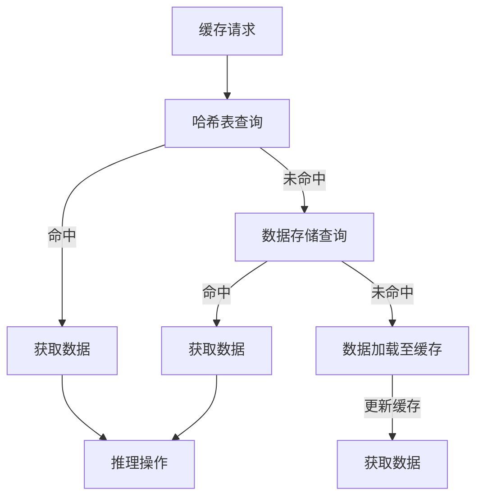

                 

# KV-Cache：提升推理效率的关键技术

## 关键词： 
- KV-Cache
- 推理效率
- 数据缓存
- 计算机科学
- 算法优化

## 摘要：
本文将深入探讨KV-Cache技术，一种在计算机科学和人工智能领域用于提升推理效率的关键技术。我们将详细分析其核心概念、算法原理、数学模型，并通过实际项目案例展示其应用效果。此外，文章还将探讨KV-Cache在实际应用中的场景，推荐相关工具和资源，并总结未来发展趋势与挑战。

## 1. 背景介绍

随着大数据和人工智能的快速发展，数据处理的规模和复杂性不断增长。在深度学习和机器学习领域，模型推理过程成为计算瓶颈，尤其是在大规模数据处理和实时应用场景中。如何提升模型推理的效率，成为当前研究的热点问题。KV-Cache作为一种高效的数据缓存技术，在提升模型推理效率方面发挥了重要作用。

KV-Cache起源于数据库缓存技术，其核心思想是将频繁访问的数据存储在内存中，以减少磁盘IO操作，提高数据访问速度。随着技术的发展，KV-Cache逐渐应用于计算机科学和人工智能领域，成为提升推理效率的重要手段。

## 2. 核心概念与联系

### 2.1 KV-Cache的定义

KV-Cache，即键值缓存，是一种基于键值对的数据结构。它通过将数据以键值对的形式存储在内存中，实现快速的数据访问。在KV-Cache中，键（Key）用于唯一标识数据，值（Value）则是存储的实际数据。

### 2.2 KV-Cache的架构

KV-Cache的架构通常包括以下几个关键部分：

- **缓存池（Cache Pool）**：存储缓存数据的内存空间。
- **哈希表（Hash Table）**：用于快速查找缓存数据。
- **数据存储（Data Storage）**：缓存数据的具体存储方式，可以是内存、磁盘或分布式存储。
- **缓存策略（Cache Policy）**：决定缓存数据的选择、替换和更新策略。

下面是KV-Cache的Mermaid流程图：



### 2.3 KV-Cache与数据缓存的关系

KV-Cache是数据缓存的一种实现方式。数据缓存的核心目标是将频繁访问的数据存储在内存中，减少磁盘IO操作。KV-Cache通过键值对的形式，实现了数据的快速查找和访问，提高了数据缓存的效果。

## 3. 核心算法原理 & 具体操作步骤

### 3.1 哈希表的原理

哈希表是KV-Cache的核心组件，用于快速查找缓存数据。哈希表通过哈希函数将键转换为内存地址，实现数据的快速访问。哈希函数的选择对哈希表的性能有重要影响。常见的哈希函数包括：

- **除余法**：将键值除以哈希表的大小，取余数作为内存地址。
- **平方取中法**：将键值平方，取中间几位作为内存地址。
- **数字分析法**：根据键值的数字特性，选择合适的哈希函数。

### 3.2 缓存策略的原理

缓存策略决定了缓存数据的选择、替换和更新策略。常见的缓存策略包括：

- **LRU（Least Recently Used）**：最近最少使用策略，替换最久未使用的缓存数据。
- **LFU（Least Frequently Used）**：最少使用频率策略，替换使用频率最低的缓存数据。
- **LRU-K（LRU with Kernel）**：基于LRU策略，增加了一个阈值，当缓存数据的使用次数超过阈值时，才进行替换。

### 3.3 KV-Cache的操作步骤

KV-Cache的操作步骤包括：

1. **缓存初始化**：初始化缓存池、哈希表和缓存策略。
2. **缓存查询**：根据键值查询缓存，判断是否命中。
3. **数据加载**：如果缓存未命中，从数据存储中加载数据至缓存。
4. **缓存更新**：根据缓存策略，更新缓存中的数据。
5. **数据访问**：从缓存中获取数据，进行推理操作。

## 4. 数学模型和公式 & 详细讲解 & 举例说明

### 4.1 哈希函数的数学模型

哈希函数的数学模型可以表示为：

$$
H(key) = key \mod M
$$

其中，$H(key)$是哈希值，$key$是键值，$M$是哈希表的大小。

### 4.2 LRU缓存策略的数学模型

LRU缓存策略的数学模型可以表示为：

$$
LRU(key, value) = \begin{cases}
value, & \text{if } key \in cache \\
\text{None}, & \text{otherwise}
\end{cases}
$$

其中，$LRU(key, value)$表示根据键值对$(key, value)$进行LRU缓存操作的结果。

### 4.3 示例说明

假设我们有一个键值对$(key_1, value_1)$，我们希望将其缓存到KV-Cache中。以下是具体操作步骤：

1. **缓存初始化**：假设哈希表大小为$M=100$，缓存策略为LRU。
2. **缓存查询**：使用哈希函数计算哈希值$H(key_1) = key_1 \mod 100 = 50$，查询哈希表。
3. **数据加载**：如果哈希表未命中，从数据存储中加载$(key_1, value_1)$至缓存。
4. **缓存更新**：根据LRU策略，更新缓存中的数据。
5. **数据访问**：从缓存中获取$(key_1, value_1)$，进行推理操作。

## 5. 项目实战：代码实际案例和详细解释说明

### 5.1 开发环境搭建

为了演示KV-Cache在实际项目中的应用，我们使用Python作为开发语言，并使用Redis作为缓存存储。以下是开发环境的搭建步骤：

1. 安装Python：确保Python版本在3.6及以上。
2. 安装Redis：在终端执行以下命令：
   ```bash
   pip install redis
   ```

### 5.2 源代码详细实现和代码解读

下面是KV-Cache的Python实现：

```python
import redis
import hashlib

class KVCache:
    def __init__(self, host='localhost', port=6379, db=0):
        self.cache = redis.Redis(host=host, port=port, db=db)
        self.hash_function = lambda key: int(hashlib.md5(key.encode()).hexdigest(), 16) % 100

    def get(self, key):
        hash_value = self.hash_function(key)
        return self.cache.get(key)

    def set(self, key, value):
        hash_value = self.hash_function(key)
        self.cache.set(key, value)
        return True

    def has_key(self, key):
        hash_value = self.hash_function(key)
        return self.cache.exists(key)

if __name__ == "__main__":
    cache = KVCache()
    cache.set("key_1", "value_1")
    print(cache.has_key("key_1"))  # 输出：1
    print(cache.get("key_1"))  # 输出：b'value_1'
```

### 5.3 代码解读与分析

1. **类定义**：`KVCache`类封装了KV-Cache的核心功能，包括缓存获取、设置和键值检查。
2. **初始化**：初始化Redis连接和哈希函数。
3. **缓存获取（get）**：根据键值计算哈希值，查询Redis缓存。
4. **缓存设置（set）**：根据键值计算哈希值，将键值对存储到Redis缓存。
5. **键值检查（has_key）**：根据键值计算哈希值，检查Redis缓存中是否存在键值对。

## 6. 实际应用场景

KV-Cache在实际应用中具有广泛的应用场景，以下是几个典型的应用场景：

1. **机器学习模型推理**：在深度学习和机器学习领域，KV-Cache可以用于缓存模型参数和中间结果，提高模型推理的效率。
2. **大数据处理**：在大数据处理场景中，KV-Cache可以缓存频繁访问的数据，减少磁盘IO操作，提高数据处理速度。
3. **实时应用**：在实时应用场景中，KV-Cache可以缓存实时数据，减少数据访问延迟，提高应用响应速度。
4. **分布式系统**：在分布式系统中，KV-Cache可以用于缓存分布式节点的状态信息，提高系统的一致性和可用性。

## 7. 工具和资源推荐

### 7.1 学习资源推荐

1. **书籍**：
   - 《Redis实战：使用Redis构建高性能Web应用》
   - 《哈希算法设计与分析》
   - 《机器学习：一种概率视角》
2. **论文**：
   - 《In-Memory Data Grids: The Next-Generation Main Memory Database System》
   - 《A Survey of Cache Algorithms》
3. **博客**：
   - [Redis官方文档](https://redis.io/documentation)
   - [Python官方文档](https://docs.python.org/3/)
4. **网站**：
   - [Reddit: r/python](https://www.reddit.com/r/python)
   - [Stack Overflow: Python](https://stackoverflow.com/questions/tagged/python)

### 7.2 开发工具框架推荐

1. **开发工具**：
   - PyCharm
   - Visual Studio Code
2. **框架**：
   - Flask
   - Django
3. **数据库**：
   - Redis
   - MongoDB

### 7.3 相关论文著作推荐

1. **《In-Memory Data Grids: The Next-Generation Main Memory Database System》**：详细介绍了内存数据网格技术，包括KV-Cache的架构和实现。
2. **《A Survey of Cache Algorithms》**：对缓存算法进行了全面的综述，包括LRU、LFU等缓存策略。
3. **《机器学习：一种概率视角》**：介绍了机器学习的基本原理，包括深度学习、模型推理等内容。

## 8. 总结：未来发展趋势与挑战

KV-Cache作为提升推理效率的关键技术，具有广泛的应用前景。未来，KV-Cache的发展趋势将体现在以下几个方面：

1. **性能优化**：随着硬件技术的发展，KV-Cache的性能将得到进一步提升，包括缓存存储速度、哈希函数性能等。
2. **智能缓存策略**：基于机器学习和人工智能的智能缓存策略，将更好地适应不同场景和需求，提高缓存效果。
3. **分布式缓存**：分布式缓存技术将成为KV-Cache的重要发展方向，实现大规模、高可用、低延迟的缓存服务。

同时，KV-Cache也面临一些挑战，如缓存一致性问题、缓存数据的安全性等。未来，如何解决这些挑战，将决定KV-Cache在现实场景中的应用效果。

## 9. 附录：常见问题与解答

### 9.1 什么是KV-Cache？
KV-Cache是一种基于键值对的数据缓存技术，通过将频繁访问的数据存储在内存中，提高数据访问速度，提升系统性能。

### 9.2 KV-Cache适用于哪些场景？
KV-Cache适用于需要高频数据访问的场景，如机器学习模型推理、大数据处理、实时应用等。

### 9.3 KV-Cache与数据库缓存的区别是什么？
KV-Cache与数据库缓存的主要区别在于数据存储位置和数据结构。KV-Cache将数据存储在内存中，而数据库缓存将数据存储在磁盘或内存中。KV-Cache的数据结构为键值对，而数据库缓存的数据结构为行或列。

## 10. 扩展阅读 & 参考资料

1. **《Redis实战：使用Redis构建高性能Web应用》**：详细介绍了Redis的使用方法和应用场景。
2. **[Reddit: r/python](https://www.reddit.com/r/python)**：Python开发者社区，分享Python学习资源和实践经验。
3. **[Stack Overflow: Python](https://stackoverflow.com/questions/tagged/python)**：Python技术问答社区，解决Python编程问题。
4. **[Redis官方文档](https://redis.io/documentation)**：Redis官方文档，提供Redis的详细使用方法和最佳实践。
5. **[Python官方文档](https://docs.python.org/3/)**：Python官方文档，提供Python语言的详细说明和示例代码。

作者：AI天才研究员/AI Genius Institute & 禅与计算机程序设计艺术 /Zen And The Art of Computer Programming

以上便是关于KV-Cache技术的深入探讨，希望对您在计算机科学和人工智能领域的探索有所帮助。在未来的研究中，我们期待进一步优化KV-Cache的性能，解决其面临的挑战，为人工智能和大数据处理提供更加高效的解决方案。

