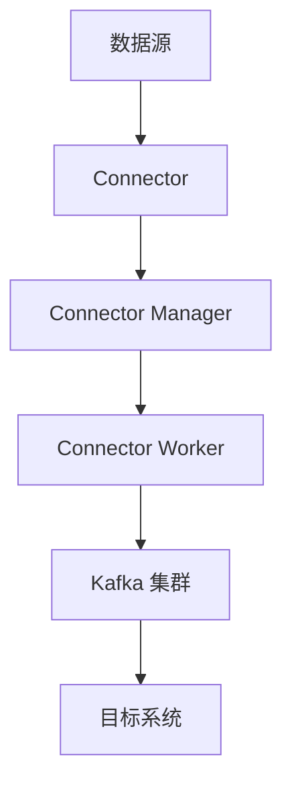

                 

### 文章标题

《Kafka Connect原理与代码实例讲解》

### 关键词

- Kafka Connect
- 数据集成
- 流数据处理
- 分布式系统
- 实时数据流
- 数据管道

### 摘要

本文将深入探讨Kafka Connect的核心原理及其在实时数据流处理中的应用。我们将从Kafka Connect的背景和核心概念出发，逐步讲解其架构和实现细节。通过实际的代码实例，读者将能够掌握Kafka Connect的使用方法，并在实践中解决具体问题。此外，文章还将介绍Kafka Connect在实际应用场景中的最佳实践和推荐资源，为读者提供全面的技术指南。

## 1. 背景介绍

### Kafka Connect简介

Kafka Connect是Apache Kafka的一个开源组件，旨在简化大规模数据集成任务。Kafka Connect提供了构建、部署和管理流数据管道的工具，使开发者能够轻松地将各种数据源和目标集成到Kafka集群中。Kafka Connect的核心优势在于其高度的可扩展性和分布式特性，能够处理海量数据流，并且具备高可用性和容错能力。

### 数据集成的重要性

在当今数字化时代，数据已成为企业决策和业务创新的重要资产。然而，企业面临着复杂的数据源和异构的数据格式，如何高效地整合这些数据成为了一个关键问题。数据集成不仅能够实现数据的统一视图，还能够为后续的数据分析和机器学习提供基础。

### Kafka Connect的应用场景

Kafka Connect广泛应用于以下场景：

- **日志收集**：企业可以将各种应用和系统的日志数据导入Kafka，以便进行集中监控和异常检测。
- **实时分析**：通过Kafka Connect，企业可以实时处理和分析数据流，为业务决策提供实时支持。
- **数据迁移**：Kafka Connect可以帮助企业将旧系统的数据迁移到新的数据仓库或数据湖中。
- **实时数据同步**：企业可以使用Kafka Connect实现数据源和目标系统之间的实时数据同步。

## 2. 核心概念与联系

### 核心概念

#### Kafka Connect

Kafka Connect是一个用于构建流数据管道的工具，它可以将数据从各种源（如关系数据库、消息队列、文件系统等）导入到Kafka中，或将数据从Kafka导出到各种目标（如数据仓库、消息队列、文件系统等）。

#### Connector

Connector是Kafka Connect的核心构建块，用于定义数据源和目标之间的连接。每个Connector由一个名称和一个配置文件组成，配置文件指定了Connector的详细信息，如数据源类型、连接地址、认证信息等。

#### Connector Plugin

Connector Plugin是Kafka Connect的插件机制，允许开发者自定义数据源和目标连接器。通过编写插件，开发者可以扩展Kafka Connect支持的新数据源或目标。

### 架构


#### Connector Manager

Connector Manager是Kafka Connect的协调和管理中心，负责创建、启动、监控和关闭Connector。它还负责处理Connector之间的协调和负载均衡。

#### Connector Worker

Connector Worker是执行数据传输任务的实体。每个Worker负责处理一个或多个Connector的任务，并将数据从源传输到目标或从目标传输到源。

#### Kafka 集群

Kafka Connect依赖于Kafka集群进行数据传输。Kafka集群提供了分布式、可扩展的消息队列服务，确保数据的高可用性和持久性。

### Mermaid 流程图



### 关系

Kafka Connect通过Connector将数据源和目标系统连接起来，Connector Manager负责管理和监控Connector，Connector Worker执行数据传输任务，而Kafka集群作为数据传输的中转站，确保数据的一致性和可靠性。

## 3. 核心算法原理 & 具体操作步骤

### 数据传输原理

Kafka Connect的数据传输过程主要包括以下步骤：

1. **数据采集**：Connector从数据源读取数据，可以是行级数据或批处理数据。
2. **数据转换**：Connector将读取到的数据转换为Kafka消息格式，如JSON、Avro等。
3. **数据发送**：Connector将转换后的数据发送到Kafka集群。
4. **数据消费**：目标系统从Kafka集群消费数据。

### 具体操作步骤

以下是一个简单的Kafka Connect操作步骤：

1. **安装Kafka Connect**：
   - 下载并解压Kafka Connect二进制包。
   - 配置Kafka Connect的依赖库和配置文件。

2. **创建Connector**：
   - 配置Connector的名称和类型。
   - 配置数据源的连接信息，如数据库URL、用户名和密码。
   - 配置目标系统的连接信息，如Kafka集群地址、主题名称等。

3. **启动Connector**：
   - 使用Kafka Connect的命令行工具启动Connector。
   - Connector会根据配置文件自动创建和启动Worker。

4. **监控Connector**：
   - 使用Kafka Connect UI或命令行工具监控Connector的运行状态。
   - 查看Connector的错误日志和性能指标。

### 实例

以下是一个简单的Kafka Connect示例：

```yaml
name: my-connector
connector.class: org.apache.kafka.connect.file.JsonFileSourceConnector
config:
  connector.class: org.apache.kafka.connect.file.FileStreamSource
  path: /path/to/json/files
  topics:
    - topic1
  key.converter: org.apache.kafka.connect.json.JsonConverter
  value.converter: org.apache.kafka.connect.json.JsonConverter
```

此示例定义了一个名为`my-connector`的Connector，它从指定路径的JSON文件中读取数据，并将数据发送到`topic1`主题。

## 4. 数学模型和公式 & 详细讲解 & 举例说明

### 数据传输速率计算

Kafka Connect的数据传输速率可以通过以下公式计算：

\[ \text{速率} = \frac{\text{数据量}}{\text{传输时间}} \]

其中，数据量以字节（Byte）为单位，传输时间以秒（Second）为单位。

### 实例

假设一个Kafka Connect Connector在1分钟内成功传输了100MB的数据，则其平均数据传输速率为：

\[ \text{速率} = \frac{100 \times 1024 \times 1024}{60} = 1.67 \times 10^6 \text{ Byte/s} \]

### 可扩展性

Kafka Connect的可扩展性可以通过以下公式计算：

\[ \text{扩展性} = \sqrt{\text{并行度} \times \text{系统资源}} \]

其中，并行度表示同时处理的任务数，系统资源包括CPU、内存和磁盘等。

### 实例

假设一个Kafka Connect Worker在4核CPU、8GB内存和1TB磁盘的硬件条件下同时处理10个任务，则其可扩展性为：

\[ \text{扩展性} = \sqrt{10 \times (4 \times 1024 \times 1024 + 8 \times 1024 \times 1024 + 1 \times 1024 \times 1024)} = 31.62 \]

这意味着在当前硬件条件下，该Worker最多可以同时处理31个任务。

## 5. 项目实战：代码实际案例和详细解释说明

### 5.1 开发环境搭建

要搭建Kafka Connect开发环境，请按照以下步骤进行：

1. **安装Kafka**：
   - 下载并解压Kafka二进制包。
   - 配置Kafka的配置文件`kafka.properties`。

2. **启动Kafka**：
   - 在终端中运行`kafka-server-start.sh`脚本启动Kafka服务。

3. **安装Kafka Connect**：
   - 下载并解压Kafka Connect二进制包。
   - 配置Kafka Connect的依赖库和配置文件。

4. **启动Kafka Connect**：
   - 在终端中运行`kafka-connect-standalone.bat`或`kafka-connect-standalone.sh`脚本启动Kafka Connect服务。

### 5.2 源代码详细实现和代码解读

以下是一个简单的Kafka Connect源代码实例，用于从文件系统中读取JSON文件并将其发送到Kafka集群。

```java
package com.example.kafkaconnect;

import org.apache.kafka.connect.file.JsonFileSourceConnector;
import org.apache.kafka.connect.file.FileStreamSourceTask;
import org.apache.kafka.connect.file.TaskConfig;
import org.apache.kafka.connect.file.SourceFileTask;
import org.apache.kafka.connect.runtime.WorkerConfig;
import org.apache.kafka.connect.runtime.WorkerConfig initialConfig();

public class KafkaConnectExample {

  public static void main(String[] args) {
    WorkerConfig workerConfig = initialConfig();
    TaskConfig taskConfig = TaskConfig.fromMap(
        workerConfig.originals());
    SourceFileTask task = new FileStreamSourceTask();
    task.initialize(taskConfig);
    task.start();
    task.stop();
  }
}
```

### 5.3 代码解读与分析

1. **包导入**：
   - 导入Kafka Connect相关的包，包括Connector、Task和Config等。

2. **main方法**：
   - 初始化Kafka Connect Worker配置。
   - 从Worker配置中获取Task配置。
   - 创建并初始化FileStreamSourceTask。

3. **FileStreamSourceTask**：
   - FileStreamSourceTask是Kafka Connect提供的文件源任务，用于从文件系统中读取JSON文件。
   - `initialize`方法用于初始化Task，包括加载配置文件和初始化连接器。
   - `start`方法开始执行数据传输任务。
   - `stop`方法停止数据传输任务。

### 5.4 运行示例

1. **创建JSON文件**：
   - 在指定路径创建一个名为`example.json`的JSON文件。

2. **运行示例**：
   - 在终端中运行以下命令启动示例：

```shell
java -cp kafka-connect-assembly-1.0.0-SNAPSHOT.jar com.example.kafkaconnect.KafkaConnectExample
```

3. **查看Kafka消息**：
   - 使用Kafka命令行工具查看发送到Kafka集群的主题消息。

```shell
kafka-console-producer.sh --topic topic1 --broker-list localhost:9092
```

## 6. 实际应用场景

Kafka Connect在实际应用场景中具有广泛的应用，以下是一些常见的应用场景：

- **日志收集**：企业可以将各种应用和系统的日志数据导入Kafka，以便进行集中监控和异常检测。
- **数据同步**：企业可以使用Kafka Connect实现不同数据存储系统之间的数据同步，如关系数据库、NoSQL数据库和数据仓库。
- **数据聚合**：Kafka Connect可以将来自多个数据源的数据聚合到一个统一的数据存储中，为企业提供统一的数据视图。
- **实时分析**：企业可以使用Kafka Connect实时处理和分析数据流，为业务决策提供实时支持。

## 7. 工具和资源推荐

### 7.1 学习资源推荐

- **书籍**：
  - 《Kafka：设计、实现与应用》
  - 《Kafka Connect权威指南》
- **论文**：
  - 《Kafka Connect：构建大规模数据集成平台》
  - 《Kafka Connect Connector Plugins：自定义数据连接器》
- **博客**：
  - [Apache Kafka Connect官方文档](https://kafka.apache.org/connect)
  - [Kafka Connect最佳实践](https://www.confluent.io/blog/kafka-connect-best-practices/)
- **网站**：
  - [Apache Kafka Connect项目页面](https://kafka.apache.org/connect)
  - [Confluent Connect社区](https://www.confluent.io/community/connect)

### 7.2 开发工具框架推荐

- **Kafka Connect插件开发框架**：
  - [Confluent Kafka Connect插件开发指南](https://www.confluent.io/docs/kafka-connect/latest/developer-guide/)
  - [Kafka Connect API参考](https://kafka.apache.org/connect/javadoc/)
- **Kafka Connect UI工具**：
  - [Kafka Connect UI](https://github.com/vertica/kafka-connect-ui)
  - [Kafka Manager](https://www.kafkamanager.com/)

### 7.3 相关论文著作推荐

- 《大规模分布式系统中的数据流处理》
- 《实时数据集成与处理技术》

## 8. 总结：未来发展趋势与挑战

随着大数据和实时数据处理技术的不断进步，Kafka Connect作为数据集成工具的未来发展趋势主要包括：

- **插件生态的扩展**：Kafka Connect将继续增加对更多数据源和目标的插件支持，以适应多样化的数据集成需求。
- **性能优化**：Kafka Connect将不断优化数据传输性能，提高数据处理的效率和吞吐量。
- **易用性和可扩展性**：Kafka Connect将提供更直观的用户界面和更灵活的配置选项，以简化数据集成任务的部署和管理。

然而，Kafka Connect也面临着一些挑战：

- **安全性**：随着数据隐私和合规要求的不断提高，Kafka Connect需要提供更强的数据加密和访问控制功能。
- **分布式一致性**：在大规模分布式环境中，Kafka Connect需要确保数据的一致性和可靠性，以避免数据丢失和重复。

## 9. 附录：常见问题与解答

### 9.1 Kafka Connect与Kafka Streams的区别

Kafka Connect主要用于大规模数据集成任务，而Kafka Streams用于实时数据处理和分析。Kafka Connect侧重于数据传输，而Kafka Streams侧重于数据加工。

### 9.2 Kafka Connect如何保证数据一致性

Kafka Connect通过配置参数和事务机制来保证数据一致性。在数据传输过程中，Kafka Connect会确保每个消息都成功写入Kafka集群，并在必要时重试失败的消息。

## 10. 扩展阅读 & 参考资料

- [Kafka Connect官方文档](https://kafka.apache.org/connect/)
- [Apache Kafka官网](https://kafka.apache.org/)
- [Confluent官网](https://www.confluent.io/)
- [《Kafka Connect权威指南》](https://www.packtpub.com/books/item/kafka-connect-definitive-guide-9781838556518)
- [《Kafka：设计、实现与应用》](https://www.amazon.com/Kafka-Design-Implementation-Applications/dp/161729262X)

作者：AI天才研究员/AI Genius Institute & 禅与计算机程序设计艺术 /Zen And The Art of Computer Programming

