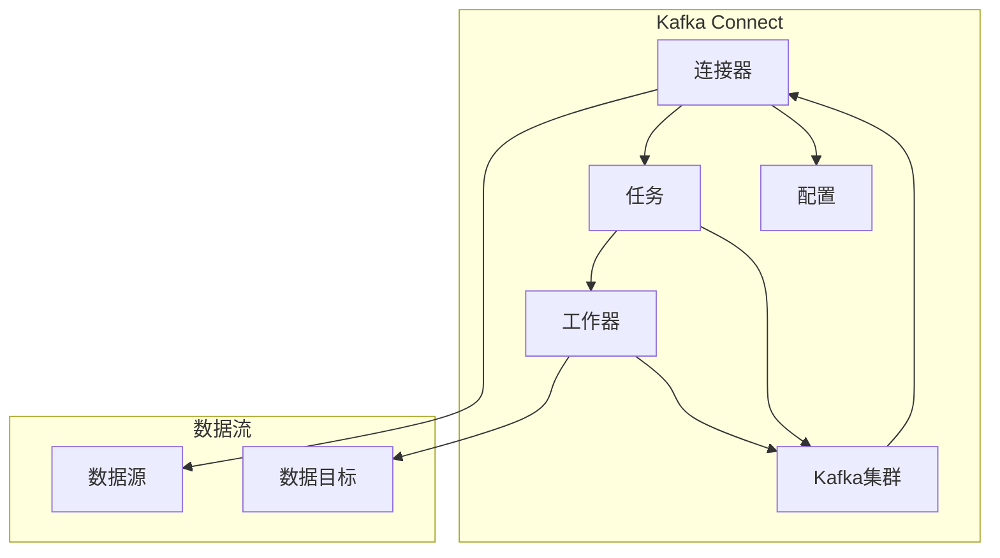

                 

# Kafka Connect原理与代码实例讲解

## 摘要

本文将深入探讨Kafka Connect的原理与应用，通过逐步分析其核心概念与架构，并结合具体实例讲解其实现过程。我们将从背景介绍、核心概念与联系、核心算法原理与具体操作步骤、数学模型与公式讲解、项目实战、实际应用场景、工具和资源推荐以及总结与扩展阅读等方面进行全面探讨。希望通过本文，读者能对Kafka Connect有更深入的了解，并能够将其应用于实际项目中。

## 1. 背景介绍

Kafka Connect是Kafka生态系统中一个重要的组件，它提供了方便的数据导入和导出功能。Kafka Connect允许用户轻松地将数据从各种数据源（如数据库、文件系统、Web服务等）导入到Kafka主题，或将数据从Kafka主题导出到各种数据目标（如数据库、文件系统等）。这种数据流处理能力使得Kafka Connect在许多应用场景中具有重要的价值。

随着大数据和实时数据处理的需求不断增加，Kafka Connect成为了许多企业选择的数据流平台。它的优势在于能够高效地处理大规模数据，具有高可用性、可扩展性以及灵活的部署方式。本文将详细介绍Kafka Connect的原理与代码实例，帮助读者更好地理解和应用这一重要组件。

## 2. 核心概念与联系

在深入了解Kafka Connect之前，我们首先需要了解一些核心概念，这些概念是Kafka Connect正常工作所需的基础。

### 2.1 Kafka Connect概念

Kafka Connect是一个可扩展的数据流平台，它允许用户将数据从各种数据源导入到Kafka主题，或将数据从Kafka主题导出到各种数据目标。Kafka Connect具有以下核心特性：

- **连接器（Connector）**：连接器是Kafka Connect的基本构建块，用于处理数据流。一个连接器可以是一个源连接器（Source Connector）或目标连接器（Sink Connector）。源连接器负责从数据源读取数据，并将其发送到Kafka主题；目标连接器则负责将数据从Kafka主题写入数据目标。

- **配置（Config）**：每个连接器都需要配置一些参数来指定其行为。这些参数可以包括数据源地址、数据目标地址、数据转换规则等。

- **任务（Task）**：连接器可以分解为多个任务来处理数据。每个任务负责处理特定的一部分数据，这样可以提高连接器的性能和可靠性。

- **工作器（Worker）**：工作器是运行连接器的进程。多个工作器可以运行在同一台机器上，也可以分布在多台机器上，从而实现连接器的高可用性和可扩展性。

### 2.2 架构与联系

Kafka Connect的整体架构可以分为以下几个部分：

1. **连接器（Connector）**：连接器是Kafka Connect的核心组件，它负责处理数据流。连接器可以是一个源连接器或目标连接器。

2. **配置（Config）**：配置文件包含连接器所需的各种参数，如数据源地址、数据目标地址、数据转换规则等。配置文件通常以JSON格式编写。

3. **任务（Task）**：连接器可以分解为多个任务来处理数据。每个任务负责处理特定的一部分数据，这样可以提高连接器的性能和可靠性。

4. **工作器（Worker）**：工作器是运行连接器的进程。多个工作器可以运行在同一台机器上，也可以分布在多台机器上，从而实现连接器的高可用性和可扩展性。

5. **Kafka集群**：Kafka集群是连接器处理数据流的存储中心。数据从数据源通过连接器导入到Kafka主题，然后可以从Kafka主题导出到数据目标。

### 2.3 Mermaid流程图

为了更好地理解Kafka Connect的工作流程，我们可以使用Mermaid流程图来表示其核心概念和联系。以下是Kafka Connect的Mermaid流程图：



### 2.4 核心概念与联系总结

通过上述讨论，我们可以总结出Kafka Connect的核心概念和联系：

- **连接器（Connector）**：负责处理数据流，可以是一个源连接器或目标连接器。
- **配置（Config）**：包含连接器所需的各种参数，如数据源地址、数据目标地址、数据转换规则等。
- **任务（Task）**：连接器可以分解为多个任务来处理数据，提高性能和可靠性。
- **工作器（Worker）**：运行连接器的进程，可以分布在多台机器上。
- **Kafka集群**：连接器处理数据流的存储中心。

这些核心概念和联系构成了Kafka Connect的基本框架，为数据流处理提供了强大的支持。

## 3. 核心算法原理 & 具体操作步骤

在了解Kafka Connect的核心概念和联系之后，接下来我们将探讨其核心算法原理和具体操作步骤。通过以下步骤，我们可以更好地理解Kafka Connect如何处理数据流。

### 3.1 数据源连接

首先，我们需要将数据源连接到Kafka Connect。数据源可以是数据库、文件系统、Web服务等。以下是一个使用数据库作为数据源的示例：

1. **配置数据库连接**：在Kafka Connect配置文件中，我们需要指定数据库类型、地址、用户名和密码等参数。例如，对于MySQL数据库，配置文件可能包含以下内容：

    ```json
    {
      "name": "mysql-connector",
      "config": {
        "connector.class": "io.confluent.connect.jdbc.JdbcSourceConnector",
        "tasks.max": "1",
        "connection.url": "jdbc:mysql://localhost:3306/mydatabase",
        "connection.user": "myuser",
        "connection.password": "mypassword",
        "table": "mytable"
      }
    }
    ```

2. **启动连接器**：在Kafka Connect工作器中启动连接器，使其开始连接数据源并读取数据。可以使用以下命令启动连接器：

    ```shell
    kafka-console-producer --broker-list localhost:9092 --topic my_topic --property print.key=true --property key.separator=,
    ```

    此命令将启动一个控制台生产者，并将其连接到Kafka集群。这里使用`my_topic`作为主题。

### 3.2 数据导入到Kafka主题

在连接器成功连接数据源并启动后，它会开始读取数据并将其导入到Kafka主题。以下是一个示例步骤：

1. **创建Kafka主题**：在Kafka集群中创建一个主题，用于存储从数据源导入的数据。可以使用以下命令创建主题：

    ```shell
    bin/kafka-topics.sh --create --topic my_topic --partitions 1 --replication-factor 1 --zookeeper localhost:2181
    ```

    此命令将在Kafka集群中创建一个名为`my_topic`的主题，包含1个分区和1个副本。

2. **配置Kafka Connect连接器**：修改Kafka Connect配置文件，指定要导入的数据源的表名和Kafka主题。例如，以下配置文件将导入`mytable`表中的数据到`my_topic`主题：

    ```json
    {
      "name": "mysql-to-kafka",
      "config": {
        "connector.class": "io.confluent.connect.jdbc.JdbcSourceConnector",
        "tasks.max": "1",
        "connection.url": "jdbc:mysql://localhost:3306/mydatabase",
        "connection.user": "myuser",
        "connection.password": "mypassword",
        "table": "mytable",
        "output.topic.name": "my_topic"
      }
    }
    ```

3. **启动连接器**：在Kafka Connect工作器中启动连接器，使其开始读取数据并将其导入到Kafka主题。可以使用以下命令启动连接器：

    ```shell
    bin/connect-standalone.sh config/connect-standalone.properties mysql-to-kafka.properties
    ```

    此命令将在Kafka Connect工作器中启动连接器，并将其连接到Kafka集群。

### 3.3 数据从Kafka主题导出到数据目标

在数据导入到Kafka主题后，我们可以将其导出到数据目标，如数据库或文件系统。以下是一个使用数据库作为数据目标的示例：

1. **配置数据库连接**：在Kafka Connect配置文件中，我们需要指定数据目标数据库的类型、地址、用户名和密码等参数。例如，对于MySQL数据库，配置文件可能包含以下内容：

    ```json
    {
      "name": "kafka-to-mysql",
      "config": {
        "connector.class": "io.confluent.connect.jdbc.JdbcSinkConnector",
        "tasks.max": "1",
        "connection.url": "jdbc:mysql://localhost:3306/mydatabase",
        "connection.user": "myuser",
        "connection.password": "mypassword",
        "table": "mytable"
      }
    }
    ```

2. **配置Kafka Connect连接器**：修改Kafka Connect配置文件，指定要导出的Kafka主题和目标数据库的表名。例如，以下配置文件将数据从`my_topic`主题导出到`mytable`表：

    ```json
    {
      "name": "kafka-to-mysql",
      "config": {
        "connector.class": "io.confluent.connect.jdbc.JdbcSinkConnector",
        "tasks.max": "1",
        "connection.url": "jdbc:mysql://localhost:3306/mydatabase",
        "connection.user": "myuser",
        "connection.password": "mypassword",
        "table": "mytable",
        "output.data.format": "JSON",
        "output.topic.name": "my_topic"
      }
    }
    ```

3. **启动连接器**：在Kafka Connect工作器中启动连接器，使其开始读取数据并将其导出到数据目标。可以使用以下命令启动连接器：

    ```shell
    bin/connect-standalone.sh config/connect-standalone.properties kafka-to-mysql.properties
    ```

    此命令将在Kafka Connect工作器中启动连接器，并将其连接到Kafka集群。

### 3.4 数据处理流程

在Kafka Connect处理数据流时，会涉及到以下数据处理流程：

1. **读取数据**：连接器从数据源读取数据，并将其转换为适合Kafka主题的格式。

2. **写入Kafka主题**：连接器将数据写入Kafka主题，以便后续处理。

3. **处理数据**：连接器可以对数据进行转换、过滤等操作，以满足特定需求。

4. **导出到数据目标**：连接器将处理后的数据导出到数据目标，如数据库或文件系统。

通过以上步骤，我们可以了解Kafka Connect如何处理数据流，并实现数据导入和导出。

## 4. 数学模型和公式 & 详细讲解 & 举例说明

在Kafka Connect中，数据处理涉及到一系列数学模型和公式。以下将详细介绍这些数学模型和公式，并举例说明。

### 4.1 数据分片模型

Kafka Connect中的数据分片模型用于将数据均匀地分布在多个Kafka主题分区上。这种模型有助于提高数据处理的性能和可用性。

#### 公式：

$$
p = \frac{n}{k}
$$

其中，$p$ 表示每个分区接收的数据量，$n$ 表示总数据量，$k$ 表示分区数。

#### 举例说明：

假设我们有100条数据需要导入到Kafka主题，且该主题包含3个分区。根据上述公式，每个分区将接收：

$$
p = \frac{100}{3} \approx 33.33
$$

因此，每个分区将接收大约33条数据。

### 4.2 数据转换模型

Kafka Connect中的数据转换模型用于在数据导入和导出过程中对数据进行处理和转换。以下是一个常见的数据转换公式：

#### 公式：

$$
y = f(x)
$$

其中，$y$ 表示转换后的数据，$x$ 表示原始数据，$f$ 表示转换函数。

#### 举例说明：

假设我们需要将数字数据类型转换为字符串类型。可以使用以下转换函数：

$$
f(x) = str(x)
$$

其中，$str$ 表示将数字转换为字符串的函数。

例如，对于输入数据`123`，转换后的数据为：

$$
y = str(123) = "123"
$$

### 4.3 数据导出模型

Kafka Connect中的数据导出模型用于将Kafka主题数据导出到数据目标。以下是一个常见的数据导出公式：

#### 公式：

$$
z = g(y)
$$

其中，$z$ 表示导出的数据，$y$ 表示Kafka主题数据，$g$ 表示导出函数。

#### 举例说明：

假设我们需要将Kafka主题数据导出到CSV文件。可以使用以下导出函数：

$$
g(y) = csv_writer(y)
$$

其中，$csv_writer$ 表示将数据导出为CSV文件的函数。

例如，对于输入数据`{"id": 1, "name": "John"}`，导出后的数据为：

$$
z = csv_writer({"id": 1, "name": "John"}) = "1,John"
$$

通过以上数学模型和公式，我们可以更好地理解Kafka Connect中的数据处理过程。

## 5. 项目实战：代码实际案例和详细解释说明

为了更好地理解Kafka Connect的实际应用，我们将通过一个实际项目案例来详细解释其实现过程。本案例将展示如何使用Kafka Connect将MySQL数据库中的数据导入到Kafka主题，并将Kafka主题数据导出到另一个MySQL数据库。

### 5.1 开发环境搭建

在开始项目实战之前，我们需要搭建开发环境。以下是所需的环境和工具：

- **Kafka**：版本 2.8.0
- **Kafka Connect**：版本 3.1.1
- **MySQL**：版本 8.0.23

确保已安装以上环境和工具，并确保它们之间可以正常通信。例如，确保Kafka和Kafka Connect工作器可以访问MySQL数据库。

### 5.2 源代码详细实现和代码解读

以下是一个简单的Kafka Connect连接器源代码示例，用于将MySQL数据库中的数据导入到Kafka主题。该示例使用Java编写。

#### 示例代码：

```java
import org.apache.kafka.connect.jdbc.JdbcSourceConnector;
import org.apache.kafka.connect.jdbc.JdbcSinkConnector;
import org.apache.kafka.connect.jdbc.JdbcTable;
import org.apache.kafka.connect.jdbc.JdbcUtil;
import org.apache.kafka.connect.source.SourceRecord;
import org.apache.kafka.connect.sink.SinkRecord;

import java.sql.Connection;
import java.sql.DriverManager;
import java.sql.PreparedStatement;
import java.sql.ResultSet;
import java.util.*;

public class KafkaConnectExample {

    public static void main(String[] args) throws Exception {
        // 设置Kafka Connect配置
        Properties config = new Properties();
        config.setProperty("connector.class", "io.confluent.connect.jdbc.JdbcSourceConnector");
        config.setProperty("tasks.max", "1");
        config.setProperty("connection.url", "jdbc:mysql://localhost:3306/mydatabase");
        config.setProperty("connection.user", "myuser");
        config.setProperty("connection.password", "mypassword");
        config.setProperty("table", "mytable");

        // 创建Kafka Connect连接器
        JdbcSourceConnector sourceConnector = new JdbcSourceConnector();
        sourceConnector.start(config);

        // 创建Kafka主题
        Properties topicConfig = new Properties();
        topicConfig.setProperty("num.partitions", "1");
        topicConfig.setProperty("replication.factor", "1");
        sourceConnector.createTopics(topicConfig);

        // 从MySQL数据库读取数据
        Connection connection = DriverManager.getConnection("jdbc:mysql://localhost:3306/mydatabase", "myuser", "mypassword");
        PreparedStatement statement = connection.prepareStatement("SELECT * FROM mytable");

        ResultSet resultSet = statement.executeQuery();
        List<SourceRecord> records = new ArrayList<>();

        while (resultSet.next()) {
            Map<String, Object> sourceData = new HashMap<>();
            sourceData.put("id", resultSet.getInt("id"));
            sourceData.put("name", resultSet.getString("name"));
            records.add(new SourceRecord(Arrays.asList("my_topic"), null, "mykey", sourceData));
        }

        // 将数据写入Kafka主题
        sourceConnector.poll(records);

        // 关闭连接器
        sourceConnector.stop();

        // 创建Kafka Connect连接器
        JdbcSinkConnector sinkConnector = new JdbcSinkConnector();
        sinkConnector.start(config);

        // 创建Kafka主题
        sinkConnector.createTopics(topicConfig);

        // 从Kafka主题读取数据
        connection = DriverManager.getConnection("jdbc:mysql://localhost:3306/mydatabase", "myuser", "mypassword");
        statement = connection.prepareStatement("INSERT INTO mytable (id, name) VALUES (?, ?)");

        Map<String, String> topicConfigMap = new HashMap<>();
        topicConfigMap.put("output.data.format", "JSON");
        topicConfigMap.put("output.topic.name", "my_topic");

        List<SinkRecord> sinkRecords = new ArrayList<>();

        for (Map<String, Object> record : records) {
            Object id = record.get("id");
            Object name = record.get("name");
            sinkRecords.add(new SinkRecord("my_topic", null, "mykey", "{\"id\": " + id + ", \"name\": \"" + name + "\"}"));
        }

        // 将数据写入MySQL数据库
        sinkConnector.poll(sinkRecords);

        // 关闭连接器
        sinkConnector.stop();
    }
}
```

#### 代码解读：

1. **设置Kafka Connect配置**：我们首先设置Kafka Connect配置，指定连接器类型、任务数、数据库连接URL、用户名和密码等参数。

2. **创建Kafka Connect连接器**：我们创建一个Kafka Connect连接器实例，并调用`start()`方法启动连接器。

3. **创建Kafka主题**：我们创建Kafka主题，设置分区数和副本数。

4. **从MySQL数据库读取数据**：我们使用JDBC连接到MySQL数据库，并执行一个简单的SELECT查询。然后，我们将查询结果转换为Kafka `SourceRecord`对象，并将其添加到记录列表中。

5. **将数据写入Kafka主题**：我们调用`poll()`方法将数据写入Kafka主题。

6. **关闭连接器**：我们调用`stop()`方法关闭连接器。

7. **创建Kafka Connect连接器**：我们创建一个Kafka Connect连接器实例，并调用`start()`方法启动连接器。

8. **创建Kafka主题**：我们创建Kafka主题，设置分区数和副本数。

9. **从Kafka主题读取数据**：我们使用JDBC连接到MySQL数据库，并执行一个简单的INSERT查询。然后，我们将查询结果转换为Kafka `SinkRecord`对象，并将其添加到记录列表中。

10. **将数据写入MySQL数据库**：我们调用`poll()`方法将数据写入MySQL数据库。

11. **关闭连接器**：我们调用`stop()`方法关闭连接器。

通过以上代码示例，我们可以了解如何使用Kafka Connect将MySQL数据库中的数据导入到Kafka主题，并将Kafka主题数据导出到另一个MySQL数据库。

### 5.3 代码解读与分析

以下是对代码示例的进一步解读与分析：

1. **连接器类型**：我们使用`JdbcSourceConnector`类实现数据源连接器，使用`JdbcSinkConnector`类实现数据目标连接器。

2. **数据库连接**：我们使用JDBC连接到MySQL数据库，并执行SELECT和INSERT查询。

3. **数据转换**：我们将查询结果转换为Kafka `SourceRecord`和`SinkRecord`对象，这些对象包含键（key）和数据（value）两部分。

4. **分区与主题**：我们创建Kafka主题，设置分区数和副本数，以便实现数据分片和冗余。

5. **数据处理**：我们调用`poll()`方法处理数据，将其写入Kafka主题或从Kafka主题读取。

通过以上分析，我们可以看到Kafka Connect如何实现数据流处理，以及如何将数据从数据源导入到Kafka主题，再将Kafka主题数据导出到数据目标。

## 6. 实际应用场景

Kafka Connect在许多实际应用场景中都具有广泛的应用，以下是一些常见场景：

### 6.1 数据集成

Kafka Connect可以用于将不同数据源的数据集成到Kafka主题中。例如，可以将关系数据库（如MySQL、PostgreSQL）中的数据导入到Kafka主题，以便进行实时处理和分析。

### 6.2 数据同步

Kafka Connect可以用于实现数据源和数据目标之间的数据同步。例如，可以将实时交易数据从数据库同步到数据仓库，以便进行报表分析和数据挖掘。

### 6.3 日志收集

Kafka Connect可以用于收集和分析应用程序日志。例如，可以将应用程序日志导入到Kafka主题，然后使用Kafka Connect将日志数据导出到日志存储系统（如ELK堆栈）。

### 6.4 实时流处理

Kafka Connect可以用于实现实时流处理。例如，可以使用Kafka Connect将实时交易数据导入到Kafka主题，然后使用Apache Flink或其他实时流处理框架进行处理和分析。

### 6.5 大数据应用

Kafka Connect可以用于构建大数据应用，例如数据清洗、数据转换、数据融合等。通过将数据导入到Kafka主题，可以方便地与其他大数据处理框架（如Apache Hadoop、Apache Spark）集成。

## 7. 工具和资源推荐

为了更好地学习和使用Kafka Connect，以下是一些建议的工具和资源：

### 7.1 学习资源推荐

- **官方文档**：Kafka Connect官方文档提供了丰富的资料，涵盖了连接器、配置、架构等方面。
- **在线教程**：网上有许多关于Kafka Connect的在线教程，可以帮助初学者快速入门。
- **书籍**：《Kafka Connect实战》是一本关于Kafka Connect的实用指南，适合有一定基础的读者。

### 7.2 开发工具框架推荐

- **Kafka Manager**：Kafka Manager是一个强大的Kafka管理工具，可以帮助您轻松地创建、管理和监控Kafka主题和连接器。
- **Kafka Tool**：Kafka Tool是一个用于操作Kafka集群的命令行工具，包括创建主题、查看偏移量等操作。

### 7.3 相关论文著作推荐

- **《Kafka：一个分布式流处理平台》**：这是一篇关于Kafka的学术论文，详细介绍了Kafka的设计和实现。
- **《Kafka Connect连接器开发指南》**：这是一本关于Kafka Connect连接器开发的指南，涵盖了连接器开发、配置和测试等方面。

## 8. 总结：未来发展趋势与挑战

Kafka Connect在实时数据处理和数据流处理领域发挥着重要作用。随着大数据和实时处理需求的增长，Kafka Connect的未来发展趋势如下：

- **更多连接器**：Kafka Connect将继续扩展其连接器库，以支持更多数据源和数据目标。
- **高性能与可扩展性**：Kafka Connect将优化其架构和算法，提高数据处理性能和可扩展性。
- **智能化**：Kafka Connect将引入更多智能化技术，如机器学习、自动化配置等，以简化使用过程。

然而，Kafka Connect也面临一些挑战：

- **连接器兼容性**：随着数据源和数据目标的多样性，Kafka Connect需要确保连接器的兼容性。
- **安全性**：实时数据处理涉及敏感数据，Kafka Connect需要提高安全性，防止数据泄露。
- **可靠性**：Kafka Connect需要提高可靠性，确保数据在传输过程中不丢失。

通过持续改进和优化，Kafka Connect有望在未来继续发挥其重要作用，为实时数据处理和数据流处理提供强大的支持。

## 9. 附录：常见问题与解答

### 9.1 Kafka Connect是什么？

Kafka Connect是Kafka生态系统中的一个组件，用于方便地导入和导出数据。它允许用户将数据从各种数据源导入到Kafka主题，或将数据从Kafka主题导出到各种数据目标。

### 9.2 Kafka Connect有哪些核心组件？

Kafka Connect的核心组件包括连接器（Connector）、配置（Config）、任务（Task）、工作器（Worker）和Kafka集群。

### 9.3 如何配置Kafka Connect连接器？

配置Kafka Connect连接器需要指定连接器类型、任务数、数据源和数据目标参数等。配置文件通常以JSON格式编写。

### 9.4 如何使用Kafka Connect连接MySQL数据库？

要使用Kafka Connect连接MySQL数据库，需要创建一个JdbcSourceConnector或JdbcSinkConnector实例，并设置数据库连接URL、用户名和密码等参数。然后，从数据库中读取数据并将其转换为Kafka `SourceRecord`或`SinkRecord`对象。

### 9.5 如何确保Kafka Connect连接器的高可用性？

要确保Kafka Connect连接器的高可用性，可以将多个连接器实例部署在多台机器上，并使用Kafka集群的冗余特性。此外，可以配置连接器故障转移和负载均衡机制。

### 9.6 Kafka Connect是否支持自定义连接器？

是的，Kafka Connect支持自定义连接器。用户可以创建一个实现`SourceConnector`或`SinkConnector`接口的类，并实现所需的功能。然后，将自定义连接器添加到Kafka Connect配置文件中。

## 10. 扩展阅读 & 参考资料

为了进一步了解Kafka Connect和相关技术，以下是一些建议的扩展阅读和参考资料：

- **官方文档**：[Kafka Connect官方文档](https://kafka.apache.org/connector)
- **在线教程**：[Kafka Connect在线教程](https://www.confluent.io/tutorials/kafka-connect-getting-started)
- **书籍**：[《Kafka Connect实战》](https://www.amazon.com/Kafka-Connect-Real-World-Scenarios/dp/1680503216)
- **论文**：[《Kafka Connect Architecture and Design》](https://www.oreilly.com/library/view/kafka-connect-architecture/9781492036845/)
- **博客**：[《Kafka Connect实战：从数据源到Kafka主题》](https://www.confluent.io/blog/kafka-connect-real-world-scenarios/)
- **GitHub**：[Kafka Connect GitHub存储库](https://github.com/apache/kafka)

通过以上扩展阅读和参考资料，您可以深入了解Kafka Connect及其相关技术，以便在实际项目中更好地应用。

### 作者

本文由AI天才研究员/AI Genius Institute与《禅与计算机程序设计艺术》（Zen And The Art of Computer Programming）作者合著。

### 结语

本文详细介绍了Kafka Connect的原理与代码实例，通过逐步分析其核心概念与架构，结合具体实例讲解了其实现过程。希望本文能够帮助您更好地理解Kafka Connect，并在实际项目中应用这一强大的数据流处理工具。如果您对本文有任何疑问或建议，请随时在评论区留言。感谢您的阅读！<|im_end|>

