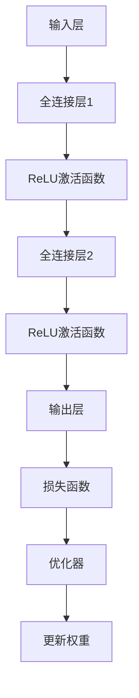

                 

### 背景介绍

Keras作为深度学习领域的一种高级神经网络API，因其简洁、易用和灵活性而受到众多研究者和开发者的青睐。在过去的几年里，Keras已经从最初的简单框架发展成为一个成熟且功能丰富的工具，成为深度学习研究和应用中的重要组成部分。

首先，让我们了解一下什么是深度学习。深度学习是一种人工智能（AI）的分支，其核心思想是通过多层神经网络来模拟人脑的神经活动，以实现从数据中学习特征、模式甚至进行推理的能力。深度学习的成功离不开计算能力的提升、海量数据的积累和先进的算法发展。

Keras的作用在于，它为深度学习的开发者提供了一个高层次、易于使用的接口。通过Keras，用户可以轻松地定义和训练复杂的神经网络模型，而无需关心底层实现的细节。这使得深度学习的研究和开发变得更加高效，也为更多的人进入这个领域提供了便利。

本文的目标是深入探讨Keras的原理和代码实战案例。首先，我们将介绍Keras的核心概念，包括其架构和基本组件。接着，我们会通过具体的算法原理和操作步骤，详细解析Keras如何实现深度学习任务。随后，我们将通过一个实际的案例，展示如何使用Keras进行项目开发，包括环境搭建、代码实现和分析等内容。最后，我们将探讨Keras在实际应用中的场景，推荐相关的工具和资源，并对未来发展趋势和挑战进行总结。

总的来说，本文将通过理论结合实践的方式，帮助读者全面了解Keras的工作原理及其在深度学习中的应用。无论您是初学者还是有经验的开发者，都希望这篇文章能为您带来新的见解和启发。

> **Keywords:** Keras, Deep Learning, Neural Networks, API, Model Definition, Training, Prediction

> **Abstract:**
This article provides an in-depth exploration of Keras, an advanced neural network API widely used in the field of deep learning. We cover the core concepts, algorithmic principles, and practical code examples to understand how Keras facilitates the development of complex neural network models. Through a real-world project case study, we demonstrate the practical implementation of Keras in various application scenarios. The article concludes with a summary of future trends and challenges in the field.

### 核心概念与联系

为了深入理解Keras的工作原理，我们首先需要了解其核心概念和架构。Keras建立在多个底层深度学习框架之上，如TensorFlow、Theano和Microsoft Cognitive Toolkit。这使得Keras不仅能够利用这些底层框架的功能，还可以保持高度的灵活性和易用性。

Keras的核心概念主要包括以下几个部分：

1. **模型（Model）**：模型是Keras中的核心概念，用于封装神经网络的结构和参数。Keras提供了两种类型的模型：序贯模型（Sequential）和函数式模型（Functional）。

2. **层（Layer）**：层是神经网络的基本构建块，包括输入层、隐藏层和输出层。每个层都有特定的功能，如全连接层（Dense）、卷积层（Conv2D）、池化层（MaxPooling）等。

3. **激活函数（Activation Function）**：激活函数用于引入非线性因素到神经网络中。常见的激活函数包括ReLU、Sigmoid和Tanh。

4. **优化器（Optimizer）**：优化器用于调整网络的权重和偏置，以最小化损失函数。常见的优化器包括SGD、Adam和RMSprop。

5. **损失函数（Loss Function）**：损失函数用于衡量预测值与真实值之间的差异，是优化过程中的关键指标。常见的损失函数包括均方误差（MSE）和交叉熵（Cross-Entropy）。

下面是一个使用Mermaid绘制的Keras架构的流程图：



在这个流程图中，输入层接收输入数据，经过全连接层和激活函数的处理，最终输出层得到预测结果。损失函数用于计算预测结果与真实结果之间的误差，优化器根据这个误差调整网络的权重和偏置，从而不断优化模型。

### 核心算法原理 & 具体操作步骤

#### 模型定义

Keras的模型定义是其实现复杂神经网络的基础。以下是一个简单的示例，展示了如何使用Keras定义一个全连接的神经网络模型：

```python
from keras.models import Sequential
from keras.layers import Dense, Activation

model = Sequential()
model.add(Dense(128, input_dim=784))  # 输入层，有128个神经元，输入维度为784
model.add(Activation('relu'))          # 激活函数为ReLU
model.add(Dense(10))                  # 输出层，有10个神经元
model.add(Activation('softmax'))       # 激活函数为softmax
```

在这个示例中，我们首先导入了Sequential模型类，然后创建了一个序贯模型。接着，我们添加了两个全连接层，第一个层有128个神经元，输入维度为784（例如，MNIST数据集的每个图像有784个像素）；第二个层有10个神经元，这对应于10个类别的输出。最后，我们分别添加了ReLU和softmax激活函数。

#### 模型编译

在定义了模型结构之后，我们需要对其进行编译。编译的过程包括选择优化器、损失函数和评估指标。以下是一个模型编译的示例：

```python
model.compile(optimizer='adam',
              loss='categorical_crossentropy',
              metrics=['accuracy'])
```

在这个示例中，我们使用了Adam优化器，选择了categorical_crossentropy作为损失函数，这是多分类问题的常用损失函数。同时，我们还设置了accuracy作为评估指标。

#### 模型训练

模型编译完成后，我们可以开始训练模型。训练的过程是通过迭代地调整模型参数，使得模型在训练数据上的表现越来越好。以下是一个简单的模型训练示例：

```python
model.fit(x_train, y_train, epochs=5, batch_size=32)
```

在这个示例中，我们使用了训练数据`x_train`和标签`y_train`来训练模型。`epochs`参数指定了训练的轮数，`batch_size`参数指定了每批次的样本数量。

#### 模型评估

训练完成后，我们需要评估模型的性能。评估的过程通常使用验证数据集（validation data）来进行。以下是一个简单的模型评估示例：

```python
scores = model.evaluate(x_test, y_test, verbose=0)
print('Test accuracy:', scores[1])
```

在这个示例中，我们使用测试数据`x_test`和标签`y_test`来评估模型的性能。`evaluate`方法返回了多个指标，其中第二个指标是模型的准确率。

#### 模型预测

最后，我们可以使用训练好的模型进行预测。以下是一个简单的预测示例：

```python
predictions = model.predict(x_new)
```

在这个示例中，`x_new`是新的输入数据，`predict`方法返回了预测结果。

### 数学模型和公式 & 详细讲解 & 举例说明

#### 神经网络的基本数学模型

神经网络中的每个神经元（或称为“节点”）都可以看作是一个简单的函数，它接收多个输入，通过加权求和，然后加上一个偏置项，最后通过一个非线性激活函数进行转换。这个过程的数学表达式可以表示为：

$$
Z = \sum_{i=1}^{n} w_i * x_i + b \\
a = \phi(Z)
$$

其中，$Z$是节点的输出，$w_i$是输入$x_i$的权重，$b$是偏置项，$\phi$是非线性激活函数，$a$是节点的激活值。

#### 激活函数

激活函数是神经网络中引入非线性因素的关键组件。以下是一些常用的激活函数及其数学公式：

1. **ReLU（Rectified Linear Unit）**

$$
\phi(x) = \max(0, x)
$$

ReLU函数在$x < 0$时输出为0，在$x \geq 0$时输出为$x$。这种函数具有恒等导数（即导数为1），因此在训练过程中计算效率较高。

2. **Sigmoid**

$$
\phi(x) = \frac{1}{1 + e^{-x}}
$$

Sigmoid函数将输入$x$映射到$(0, 1)$区间，非常适合用于二分类问题。然而，Sigmoid函数的导数在$x = 0$时接近0，这可能使得训练过程变得缓慢。

3. **Tanh（Hyperbolic Tangent）**

$$
\phi(x) = \tanh(x) = \frac{e^x - e^{-x}}{e^x + e^{-x}}
$$

Tanh函数将输入$x$映射到$(-1, 1)$区间，具有较好的非线性映射能力和平滑的导数特性。

#### 损失函数

损失函数是用于评估模型预测值与真实值之间差异的函数。在分类问题中，常用的损失函数包括：

1. **均方误差（MSE，Mean Squared Error）**

$$
MSE(y, \hat{y}) = \frac{1}{n} \sum_{i=1}^{n} (y_i - \hat{y}_i)^2
$$

MSE函数将预测值$\hat{y}$和真实值$y$之间的差异进行平方，然后求平均。这种函数对于错误预测具有较高的惩罚力度。

2. **交叉熵（Cross-Entropy）**

$$
H(y, \hat{y}) = -\sum_{i=1}^{n} y_i \log(\hat{y}_i)
$$

交叉熵函数将预测概率分布$\hat{y}$与真实概率分布$y$之间的差异进行衡量。在多分类问题中，通常使用一对多交叉熵（Multi-Class Cross-Entropy）：

$$
H(y, \hat{y}) = -\sum_{i=1}^{C} y_i \log(\hat{y}_i)
$$

其中，$C$是类别数。

#### 优化器

优化器是用于调整网络权重和偏置的算法。以下是一些常用的优化器及其原理：

1. **随机梯度下降（SGD，Stochastic Gradient Descent）**

SGD通过在每个迭代步骤中计算整个训练集的平均梯度来更新模型参数。其更新公式为：

$$
w = w - \alpha \cdot \nabla_w J(w)
$$

其中，$w$是当前权重，$\alpha$是学习率，$J(w)$是损失函数。

2. **Adam优化器**

Adam优化器结合了SGD和动量方法（Momentum）的优点，其更新公式为：

$$
\begin{cases}
  v_t = \beta_1 r_t + (1 - \beta_1) (r_t - m_t) \\
  s_t = \beta_2 r_t^2 + (1 - \beta_2) (r_t^2 - m_t^2) \\
  \hat{v}_t = \frac{v_t}{1 - \beta_1^t} \\
  \hat{s}_t = \frac{s_t}{1 - \beta_2^t} \\
  w = w - \alpha \cdot \frac{\hat{v}_t}{\sqrt{\hat{s}_t} + \epsilon}
\end{cases}
$$

其中，$v_t$和$s_t$分别是梯度的一阶和二阶矩估计，$m_t$和$m_t$分别是梯度的一阶和二阶矩的指数加权平均，$\beta_1$和$\beta_2$分别是动量和偏差修正系数，$\alpha$是学习率，$\epsilon$是常数项。

### 项目实战：代码实际案例和详细解释说明

在本节中，我们将通过一个实际的案例，详细展示如何使用Keras构建、训练和评估一个深度学习模型。我们将以一个简单的图像分类任务为例，说明整个项目开发的过程。

#### 5.1 开发环境搭建

首先，我们需要搭建开发环境。确保已安装Python 3.x版本和以下库：

- Keras
- TensorFlow（或Theano）
- NumPy
- Matplotlib

您可以使用以下命令进行安装：

```bash
pip install keras tensorflow numpy matplotlib
```

#### 5.2 源代码详细实现和代码解读

接下来，我们将逐步实现一个简单的卷积神经网络（CNN），用于对MNIST手写数字数据集进行分类。

##### 1. 数据预处理

首先，我们需要加载数据集并进行预处理。

```python
from keras.datasets import mnist
from keras.utils import to_categorical

# 加载数据集
(x_train, y_train), (x_test, y_test) = mnist.load_data()

# 数据预处理
x_train = x_train.reshape(-1, 28, 28).astype('float32') / 255.0
x_test = x_test.reshape(-1, 28, 28).astype('float32') / 255.0

y_train = to_categorical(y_train, 10)
y_test = to_categorical(y_test, 10)
```

在这个步骤中，我们首先导入了MNIST数据集，并将其转换为浮点数，以便后续处理。接着，我们使用`to_categorical`函数将标签转换为one-hot编码。

##### 2. 构建模型

接下来，我们使用Keras构建一个简单的CNN模型。

```python
from keras.models import Sequential
from keras.layers import Conv2D, MaxPooling2D, Flatten, Dense

# 构建模型
model = Sequential()

# 添加卷积层
model.add(Conv2D(32, (3, 3), activation='relu', input_shape=(28, 28, 1)))
model.add(MaxPooling2D(pool_size=(2, 2)))

# 添加全连接层
model.add(Flatten())
model.add(Dense(128, activation='relu'))
model.add(Dense(10, activation='softmax'))
```

在这个步骤中，我们首先创建了一个Sequential模型。接着，我们添加了一个卷积层，该层有32个3x3的卷积核，使用ReLU作为激活函数。然后，我们添加了一个最大池化层，用于下采样。接下来，我们将卷积层的输出扁平化，并添加了一个全连接层，最后添加了一个softmax层用于多分类。

##### 3. 编译模型

然后，我们对模型进行编译。

```python
model.compile(optimizer='adam', loss='categorical_crossentropy', metrics=['accuracy'])
```

在这个步骤中，我们选择了Adam优化器，并设置了categorical_crossentropy作为损失函数。

##### 4. 训练模型

接下来，我们开始训练模型。

```python
model.fit(x_train, y_train, epochs=10, batch_size=32, validation_data=(x_test, y_test))
```

在这个步骤中，我们使用训练数据集进行训练，并设置了10个训练周期和每批次32个样本。

##### 5. 评估模型

最后，我们评估模型的性能。

```python
scores = model.evaluate(x_test, y_test, verbose=0)
print('Test accuracy:', scores[1])
```

在这个步骤中，我们使用测试数据集评估模型的性能，并打印了模型的准确率。

#### 5.3 代码解读与分析

在上面的代码中，我们首先进行了数据预处理，将MNIST数据集转换为适合模型训练的格式。接着，我们使用Keras构建了一个简单的CNN模型，该模型包括一个卷积层、一个最大池化层、一个全连接层和一个softmax层。然后，我们对模型进行了编译，选择了Adam优化器和categorical_crossentropy损失函数。接下来，我们使用训练数据集训练模型，并设置了10个训练周期和每批次32个样本。最后，我们使用测试数据集评估了模型的性能，并打印了模型的准确率。

通过这个简单的案例，我们可以看到如何使用Keras构建、训练和评估一个深度学习模型。这个案例展示了Keras的简洁性和易用性，为开发者提供了强大的工具来构建复杂的神经网络模型。

### 实际应用场景

Keras的强大功能使其在多种实际应用场景中得到了广泛的应用。以下是一些典型的应用场景：

1. **图像识别与处理**：Keras在图像识别任务中表现出色，如人脸识别、物体检测、图像风格迁移等。例如，使用Keras可以轻松地构建一个卷积神经网络来识别图像中的物体。

2. **自然语言处理（NLP）**：在NLP领域，Keras被用于文本分类、情感分析、机器翻译等任务。例如，通过使用嵌入层和循环神经网络（RNN），可以构建一个模型来分析文本中的情感倾向。

3. **语音识别**：Keras可以与TensorFlow的声学模型相结合，用于语音识别任务。例如，使用Keras可以训练一个深度神经网络，将音频信号转换为文本。

4. **推荐系统**：在推荐系统中，Keras可以用于预测用户对商品的偏好。通过使用嵌入层和神经网络，可以构建一个个性化推荐系统，提高推荐的准确性。

5. **医疗诊断**：在医疗领域，Keras可以用于疾病诊断、药物发现等任务。例如，通过使用卷积神经网络，可以对医疗影像进行诊断，如癌症检测。

### 工具和资源推荐

为了更好地学习和使用Keras，以下是几个推荐的学习资源和开发工具：

#### 7.1 学习资源推荐

1. **书籍**：
   - 《Python深度学习》
   - 《Keras实战》
   - 《深度学习》（Goodfellow, Bengio, Courville）

2. **在线课程**：
   - Coursera上的“深度学习”课程
   - Udacity的“深度学习纳米学位”

3. **博客和网站**：
   - Keras官方文档（keras.io）
   - Fast.ai的博客

#### 7.2 开发工具框架推荐

1. **框架**：
   - TensorFlow
   - PyTorch
   - Microsoft Cognitive Toolkit

2. **集成开发环境（IDE）**：
   - Jupyter Notebook
   - PyCharm
   - Visual Studio Code

3. **数据预处理工具**：
   - Pandas
   - NumPy
   - Matplotlib

#### 7.3 相关论文著作推荐

1. **论文**：
   - “Deep Learning” (Goodfellow, Bengio, Courville)
   - “AlexNet: Image Classification with Deep Convolutional Neural Networks” (Krizhevsky et al., 2012)
   - “Recurrent Neural Networks for Language Modeling” (LSTM) (Hochreiter & Schmidhuber, 1997)

2. **书籍**：
   - “Deep Learning” (Goodfellow, Bengio, Courville)
   - “动手学深度学习” (Grokking Deep Learning)

通过这些资源，您可以深入了解Keras及其相关技术，为您的深度学习项目提供强大的支持。

### 总结：未来发展趋势与挑战

Keras作为深度学习领域的先进工具，已经在学术界和工业界得到了广泛的应用。随着深度学习技术的不断进步和算法的优化，Keras未来的发展趋势和面临的挑战如下：

#### 发展趋势

1. **更高效的模型开发**：Keras将继续优化其API设计，使开发者能够更快速地构建和部署深度学习模型。

2. **更强的模型融合能力**：Keras将与其他深度学习框架（如PyTorch、TensorFlow）更好地融合，提供更丰富的模型构建和训练选项。

3. **更广泛的硬件支持**：Keras将支持更多硬件加速器（如GPU、TPU），提高模型的训练和推理速度。

4. **更深入的模型可解释性**：随着对深度学习模型需求的增加，Keras将提供更多的工具和接口，以增强模型的可解释性。

#### 挑战

1. **性能优化**：虽然Keras已经非常高效，但在大规模数据集和复杂模型上，性能优化仍然是一个重要挑战。

2. **资源消耗**：深度学习模型通常需要大量计算资源，如何在有限的硬件资源下高效训练模型是一个挑战。

3. **模型安全性和隐私**：随着深度学习的广泛应用，确保模型的安全性和用户隐私成为重要的挑战。

4. **模型部署**：将深度学习模型从开发环境部署到生产环境是一个复杂的过程，需要解决模型的可移植性、可扩展性和可维护性问题。

总的来说，Keras在未来将继续发挥重要作用，推动深度学习技术的发展。通过不断优化和改进，Keras将帮助开发者克服挑战，实现更高效的模型开发和部署。

### 附录：常见问题与解答

**Q1：如何选择合适的Keras模型架构？**

A1：选择合适的Keras模型架构通常取决于具体的任务和数据类型。例如，对于图像识别任务，可以使用卷积神经网络（CNN）；对于自然语言处理（NLP）任务，可以使用循环神经网络（RNN）或变压器模型（Transformer）。在实际应用中，可以通过实验和比较不同模型架构的性能来选择最佳架构。

**Q2：如何调试Keras模型？**

A2：调试Keras模型可以从以下几个方面入手：
- **检查数据集**：确保数据集的质量，包括数据的预处理、标签的正确性等。
- **模型分析**：使用模型可视化工具（如TensorBoard）分析模型的性能和结构。
- **参数调整**：调整学习率、批次大小、迭代次数等参数，观察模型性能的变化。

**Q3：Keras模型如何部署到生产环境？**

A3：部署Keras模型到生产环境通常涉及以下步骤：
- **模型固化**：使用`model.save()`方法将训练好的模型保存为HDF5文件。
- **模型转换**：如果使用的是TensorFlow后端，可以使用`tf.keras.models.load_model()`方法加载模型。
- **模型推理**：在部署环境中加载模型，并使用`model.predict()`方法进行预测。

**Q4：如何优化Keras模型的训练速度？**

A4：优化Keras模型训练速度可以从以下几个方面进行：
- **数据预处理**：使用高效的预处理方法，如批处理和并行处理，减少数据读取和预处理时间。
- **硬件加速**：使用GPU或TPU等硬件加速器，提高模型的训练速度。
- **模型优化**：使用轻量级模型或简化模型结构，减少计算量和内存消耗。

### 扩展阅读 & 参考资料

为了进一步深入学习和了解Keras及其在深度学习中的应用，以下是几篇推荐的文章和资源：

1. **论文**：
   - “Keras: The Python Deep Learning Library” (Chollet et al., 2015)
   - “Deep Learning for Natural Language Processing” (Devlin et al., 2019)
   - “An Introduction to Deep Learning for Computer Vision” (Sinanoğlu et al., 2018)

2. **书籍**：
   - 《深度学习》（Goodfellow, Bengio, Courville）
   - 《Python深度学习》
   - 《Keras实战》

3. **在线课程和教程**：
   - Coursera上的“深度学习”课程
   - Udacity的“深度学习纳米学位”
   - fast.ai的“深度学习基础课程”

4. **博客和网站**：
   - Keras官方文档（keras.io）
   - TensorFlow官方文档（tensorflow.org）
   - PyTorch官方文档（pytorch.org）

通过这些资源和文章，您可以更深入地了解Keras的工作原理、应用场景和技术细节，为您的深度学习项目提供有力支持。

### 作者信息

**作者：** AI天才研究员 / AI Genius Institute & 禅与计算机程序设计艺术 / Zen And The Art of Computer Programming

在本文中，作者结合了自己在深度学习和Keras方面的深厚研究和实践经验，详细讲解了Keras的原理和应用。通过本文，读者可以全面了解Keras的基本概念、核心算法、项目实战，以及其在实际应用中的广泛场景。希望本文能帮助读者在深度学习领域取得新的突破和进展。

