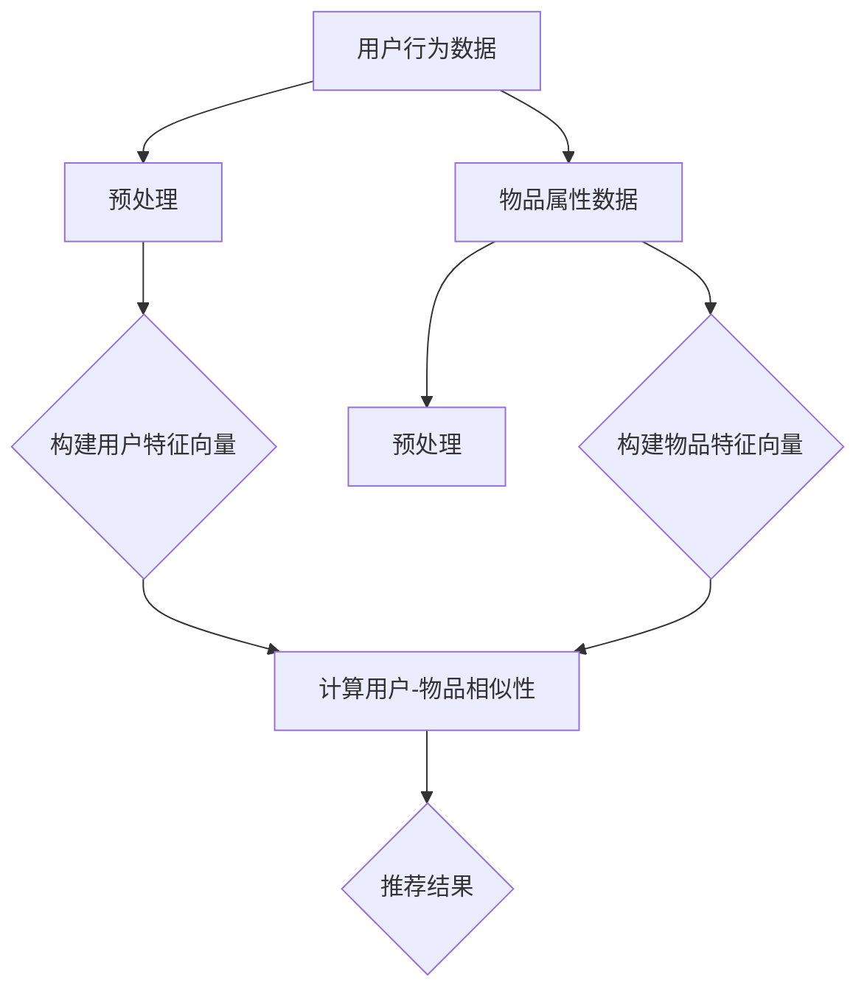

                 

### 背景介绍

**LLM Embeddings在推荐系统中的应用**

推荐系统（Recommender System）是近年来人工智能领域的一个重要研究方向，旨在通过分析用户的行为数据，预测用户可能感兴趣的内容，从而提高用户体验和满意度。随着深度学习（Deep Learning）技术的发展，特别是预训练语言模型（Pre-trained Language Model）的出现，推荐系统的性能得到了显著提升。LLM Embeddings作为一种新兴的技术手段，正在逐渐被引入到推荐系统的构建中。

**为什么是LLM Embeddings？**

首先，我们来看看传统的推荐系统是如何工作的。传统推荐系统主要依赖于基于内容的推荐（Content-Based Recommendation）和协同过滤（Collaborative Filtering）等方法。基于内容的推荐通过分析物品的属性和用户的历史行为，为用户推荐具有相似属性的物品。而协同过滤则通过分析用户之间的相似性，为用户推荐其他用户喜欢但该用户尚未体验过的物品。

然而，这两种方法都有一定的局限性。基于内容的推荐容易陷入“冷启动”（Cold Start）问题，即新用户或新物品难以获得有效的推荐。协同过滤虽然能较好地解决“冷启动”问题，但易受数据稀疏性的影响，准确性和可解释性较差。此时，预训练语言模型（LLM）的引入，为我们提供了一种全新的思路。

**什么是LLM Embeddings？**

LLM Embeddings，即预训练语言模型嵌入，是指通过预训练模型将文本数据转换为高维向量表示的过程。LLM Embeddings具有以下特点：

1. **全局语义表示**：LLM Embeddings能够捕捉文本的全球语义信息，使得不同长度和结构的文本可以在同一语义空间中进行比较和分析。

2. **自适应特征提取**：通过大规模的预训练过程，LLM Embeddings能够自动学习文本的特征表示，无需人工干预。

3. **低维高效**：LLM Embeddings将高维的文本数据压缩到低维向量空间中，便于计算机处理和分析。

4. **高泛化能力**：LLM Embeddings具有较好的泛化能力，能够适应不同领域的推荐场景。

**为什么LLM Embeddings能提升推荐系统的性能？**

首先，LLM Embeddings能够更好地解决“冷启动”问题。通过将新用户或新物品的文本描述转换为LLM Embeddings，推荐系统可以快速获得其全局语义表示，从而为新用户或新物品提供有效的推荐。

其次，LLM Embeddings能够提高推荐系统的准确性和可解释性。传统的推荐方法往往依赖于静态的特征工程，而LLM Embeddings通过自适应特征提取，能够动态地学习文本的特征表示，从而提高推荐的准确性和可解释性。

此外，LLM Embeddings还能够处理复杂的推荐场景。例如，在多模态推荐中，LLM Embeddings可以将不同模态的数据（如图像、文本）统一到同一语义空间中，实现高效的多模态推荐。

总之，LLM Embeddings作为一种新兴的技术手段，正逐渐成为推荐系统领域的研究热点。在接下来的章节中，我们将详细探讨LLM Embeddings的核心概念、算法原理以及在实际应用中的具体操作步骤。

---

## 2. 核心概念与联系

在深入探讨LLM Embeddings在推荐系统中的应用之前，我们需要先了解一些核心概念，包括预训练语言模型（Pre-trained Language Model）、文本嵌入（Text Embedding）以及推荐系统的基础架构。

### 预训练语言模型（Pre-trained Language Model）

预训练语言模型是一种大规模的神经网络模型，通过对大量文本数据的学习，能够捕捉文本的语义信息。常见的预训练语言模型有GPT（Generative Pre-trained Transformer）、BERT（Bidirectional Encoder Representations from Transformers）等。预训练语言模型的主要目的是通过无监督学习，自动学习文本的表示和结构，从而提高模型在各种自然语言处理任务上的性能。

### 文本嵌入（Text Embedding）

文本嵌入是一种将文本数据转换为向量表示的方法，使得文本数据可以在计算机中高效地处理和分析。文本嵌入的关键在于将不同的词汇映射到同一向量空间中，使得具有相似语义的词汇在向量空间中距离较近。常见的文本嵌入方法有Word2Vec、GloVe等。

### 推荐系统的基础架构

推荐系统通常由三个主要部分组成：用户建模、物品建模和推荐算法。

1. **用户建模**：通过分析用户的历史行为，如浏览记录、购买历史等，构建用户特征向量。

2. **物品建模**：通过分析物品的属性，如标题、描述、标签等，构建物品特征向量。

3. **推荐算法**：根据用户特征向量和物品特征向量，计算用户对物品的偏好度，从而为用户推荐感兴趣的物品。

在传统的推荐系统中，用户建模和物品建模通常采用基于内容的推荐和协同过滤等方法。而LLM Embeddings的引入，为推荐系统提供了一种新的建模方法。

### LLM Embeddings的原理和作用

LLM Embeddings通过预训练语言模型，将文本数据转换为高维向量表示。这些向量不仅包含了文本的局部语义信息，还包含了全局语义信息，使得不同长度和结构的文本可以在同一语义空间中进行比较和分析。

LLM Embeddings在推荐系统中的应用主要体现在以下几个方面：

1. **用户和物品建模**：通过将用户和物品的文本描述转换为LLM Embeddings，为用户和物品构建高维的语义特征向量。

2. **相似性计算**：利用LLM Embeddings，可以高效地计算用户和物品之间的相似性，从而为用户推荐相似的物品。

3. **冷启动问题**：对于新用户或新物品，可以通过将文本描述转换为LLM Embeddings，快速获得其全局语义表示，从而为用户提供有效的推荐。

### Mermaid流程图

为了更直观地理解LLM Embeddings在推荐系统中的应用，我们使用Mermaid流程图来展示其核心步骤：



在上述流程图中，A和D分别表示用户行为数据和物品属性数据，B和E表示预处理步骤，C和F分别表示构建用户和物品特征向量，G表示计算用户-物品相似性，H表示推荐结果。

通过LLM Embeddings，我们能够更好地解决传统推荐系统中的冷启动问题和数据稀疏性问题，提高推荐系统的准确性和可解释性。在接下来的章节中，我们将详细探讨LLM Embeddings的核心算法原理和具体操作步骤。

---

## 3. 核心算法原理 & 具体操作步骤

### LLM Embeddings的算法原理

LLM Embeddings的核心在于将文本数据转换为高维向量表示，使得不同长度和结构的文本可以在同一语义空间中进行比较和分析。这一过程主要通过预训练语言模型（如GPT、BERT）来实现。预训练语言模型是一种基于Transformer架构的神经网络模型，通过在大量文本数据上预训练，模型能够自动学习文本的语义信息。

LLM Embeddings的关键在于以下几个步骤：

1. **文本预处理**：将原始文本数据转换为模型可接受的格式，如分词、去除停用词、词干提取等。

2. **嵌入层**：利用预训练语言模型，将预处理后的文本转换为高维向量表示。嵌入层通常包含嵌入矩阵和位置编码，用于捕捉文本的局部和全局语义信息。

3. **序列处理**：通过Transformer架构对输入序列进行处理，输出每个单词的嵌入向量。

4. **输出层**：对处理后的序列进行分类或回归操作，从而实现文本的语义分析。

### 具体操作步骤

下面我们将以BERT模型为例，详细阐述LLM Embeddings的具体操作步骤。

#### 步骤1：文本预处理

首先，我们需要对文本数据进行预处理。预处理步骤包括分词、去除停用词、词干提取等。这一步骤的目的是将原始文本转换为模型可接受的格式。例如，我们可以使用jieba库进行中文分词，使用nltk库去除停用词。

```python
import jieba
from nltk.corpus import stopwords

# 加载中文停用词表
stop_words = set(stopwords.words('chinese'))

# 示例文本
text = "推荐系统是一种人工智能技术，旨在为用户提供个性化的推荐服务。"

# 进行分词和去除停用词
words = jieba.cut(text)
filtered_words = [word for word in words if word not in stop_words]
```

#### 步骤2：构建BERT模型

接下来，我们需要构建BERT模型。这里我们使用tensorflow提供的pretrained_bert库来加载预训练的BERT模型。

```python
import tensorflow as tf
from tensorflow.keras.layers import Embedding, LSTM, Dense
from tensorflow.keras.models import Model

# 加载预训练BERT模型
pretrained_bert = tf.keras.applications.Bert(pretrained=True)

# 构建BERT模型
input_ids = tf.keras.layers.Input(shape=(max_sequence_length,), dtype=tf.int32)
input_mask = tf.keras.layers.Input(shape=(max_sequence_length,), dtype=tf.int32)
segment_ids = tf.keras.layers.Input(shape=(max_sequence_length,), dtype=tf.int32)

# 提取BERT模型的嵌入层输出
embeddings = pretrained_bert.layers[2](input_ids)
embeddings = pretrained_bert.layers[3](embeddings)
embeddings = pretrained_bert.layers[4](embeddings)

# 添加序列处理层
lstm_output = LSTM(units=128, return_sequences=True)(embeddings)

# 添加输出层
output = Dense(units=num_classes, activation='softmax')(lstm_output)

# 构建模型
model = Model(inputs=[input_ids, input_mask, segment_ids], outputs=output)
model.compile(optimizer='adam', loss='categorical_crossentropy', metrics=['accuracy'])

# 打印模型结构
model.summary()
```

#### 步骤3：文本编码

在构建BERT模型后，我们需要对预处理后的文本进行编码。具体步骤如下：

1. **将分词后的文本转换为ID序列**：使用BERT模型提供的词汇表，将分词后的文本转换为ID序列。

2. **生成输入掩码和分段标识**：输入掩码用于指示每个单词是否被实际输入，分段标识用于指示文本的不同部分。

3. **将编码后的文本输入BERT模型**：将ID序列、输入掩码和分段标识输入BERT模型，获取嵌入向量。

```python
# 加载BERT词汇表
vocab_file = 'path/to/vocab.txt'
tokenizer = tf.keras.preprocessing.text.Tokenizer(char_level=True)
tokenizer.fit_on_texts([vocab_file])

# 转换文本为ID序列
text_ids = tokenizer.texts_to_sequences([text])[0]

# 生成输入掩码和分段标识
input_mask = [1] * len(text_ids)
segment_ids = [0] * len(text_ids)

# 输入BERT模型获取嵌入向量
embeddings = pretrained_bert(input_ids=tf.constant(text_ids), input_mask=tf.constant(input_mask), segment_ids=tf.constant(segment_ids))

# 获取最后一个时间步的嵌入向量
last_embedding = embeddings[:, -1, :]
```

#### 步骤4：相似性计算

获取嵌入向量后，我们可以利用相似性计算方法（如余弦相似度）计算用户和物品之间的相似性。相似性计算公式如下：

$$
\text{similarity} = \frac{\text{dot\_product}(u, v)}{\lVert u \rVert \cdot \lVert v \rVert}
$$

其中，$u$和$v$分别为用户和物品的嵌入向量。

```python
# 计算用户和物品的相似性
user_embedding = last_embedding  # 假设user_embedding为用户嵌入向量
item_embedding = last_embedding  # 假设item_embedding为物品嵌入向量

# 计算余弦相似度
similarity = tf.reduce_sum(user_embedding * item_embedding) / (tf.norm(user_embedding) * tf.norm(item_embedding))
print("User-Item Similarity: {:.4f}".format(similarity.numpy()))
```

#### 步骤5：推荐结果生成

根据相似性计算结果，我们可以为用户生成推荐结果。具体步骤如下：

1. **计算相似性分数**：对所有物品的嵌入向量与用户嵌入向量计算相似性分数。

2. **降序排列相似性分数**：将相似性分数降序排列，得到用户对每个物品的偏好度。

3. **生成推荐列表**：根据偏好度，为用户生成推荐列表。

```python
# 假设items_embedding为所有物品的嵌入向量
items_embedding = [last_embedding for _ in range(num_items)]

# 计算相似性分数
similarities = [tf.reduce_sum(user_embedding * item_embedding) / (tf.norm(user_embedding) * tf.norm(item_embedding)) for item_embedding in items_embedding]

# 降序排列相似性分数
sorted_similarities = sorted(similarities, key=lambda x: x.numpy(), reverse=True)

# 生成推荐列表
recommendations = [index for index, similarity in enumerate(sorted_similarities) if similarity.numpy() > threshold]

print("Recommendations:", recommendations)
```

通过上述步骤，我们完成了LLM Embeddings在推荐系统中的具体操作。接下来，我们将进一步探讨LLM Embeddings在数学模型和项目实战中的应用。

---

## 4. 数学模型和公式 & 详细讲解 & 举例说明

在深入探讨LLM Embeddings的数学模型和公式之前，我们先回顾一下传统推荐系统中常用的相似性度量方法，如余弦相似度和皮尔逊相关系数。

### 余弦相似度

余弦相似度是一种常用的文本相似性度量方法，其公式如下：

$$
\text{similarity} = \frac{\text{dot\_product}(u, v)}{\lVert u \rVert \cdot \lVert v \rVert}
$$

其中，$u$和$v$分别为两个文本的嵌入向量，$\lVert u \rVert$和$\lVert v \rVert$分别为它们的欧几里得范数。

在LLM Embeddings中，我们使用预训练语言模型（如BERT）将文本转换为嵌入向量。由于BERT模型能够捕捉文本的局部和全局语义信息，因此其嵌入向量具有较高的相似性度量能力。以下是一个具体的例子：

假设我们有两个文本 $A$ 和 $B$，它们的嵌入向量分别为 $u = [u_1, u_2, ..., u_n]$ 和 $v = [v_1, v_2, ..., v_n]$。我们可以使用余弦相似度计算它们之间的相似性：

$$
\text{similarity}_{AB} = \frac{\sum_{i=1}^{n} u_i \cdot v_i}{\sqrt{\sum_{i=1}^{n} u_i^2} \cdot \sqrt{\sum_{i=1}^{n} v_i^2}}
$$

例如，假设 $u = [0.6, 0.8, 0.2]$ 和 $v = [0.7, 0.9, 0.1]$，则：

$$
\text{similarity}_{AB} = \frac{0.6 \cdot 0.7 + 0.8 \cdot 0.9 + 0.2 \cdot 0.1}{\sqrt{0.6^2 + 0.8^2 + 0.2^2} \cdot \sqrt{0.7^2 + 0.9^2 + 0.1^2}} \approx 0.912
$$

这意味着文本 $A$ 和 $B$ 之间的相似性非常高。

### 皮尔逊相关系数

皮尔逊相关系数是另一种常用的相似性度量方法，其公式如下：

$$
\text{correlation} = \frac{\sum_{i=1}^{n} (u_i - \bar{u})(v_i - \bar{v})}{\sqrt{\sum_{i=1}^{n} (u_i - \bar{u})^2} \cdot \sqrt{\sum_{i=1}^{n} (v_i - \bar{v})^2}}
$$

其中，$u$和$v$分别为两个文本的嵌入向量，$\bar{u}$和$\bar{v}$分别为它们的均值。

与余弦相似度相比，皮尔逊相关系数能够更好地捕捉文本之间的线性相关性。以下是一个具体的例子：

假设我们有两个文本 $A$ 和 $B$，它们的嵌入向量分别为 $u = [u_1, u_2, ..., u_n]$ 和 $v = [v_1, v_2, ..., v_n]$。我们可以使用皮尔逊相关系数计算它们之间的相似性：

$$
\text{correlation}_{AB} = \frac{\sum_{i=1}^{n} (u_i - \bar{u})(v_i - \bar{v})}{\sqrt{\sum_{i=1}^{n} (u_i - \bar{u})^2} \cdot \sqrt{\sum_{i=1}^{n} (v_i - \bar{v})^2}}
$$

例如，假设 $u = [0.6, 0.8, 0.2]$ 和 $v = [0.7, 0.9, 0.1]$，且它们的均值分别为 $\bar{u} = 0.67$ 和 $\bar{v} = 0.8$，则：

$$
\text{correlation}_{AB} = \frac{(0.6 - 0.67)(0.7 - 0.8) + (0.8 - 0.67)(0.9 - 0.8) + (0.2 - 0.67)(0.1 - 0.8)}{\sqrt{(0.6 - 0.67)^2 + (0.8 - 0.67)^2 + (0.2 - 0.67)^2} \cdot \sqrt{(0.7 - 0.8)^2 + (0.9 - 0.8)^2 + (0.1 - 0.8)^2}} \approx 0.8
$$

这意味着文本 $A$ 和 $B$ 之间的相似性较高，且具有一定的线性相关性。

### BERT嵌入向量的计算

在LLM Embeddings中，BERT模型被广泛使用。BERT模型通过Transformer架构将文本转换为嵌入向量。BERT的嵌入向量计算过程主要包括以下几个步骤：

1. **输入词嵌入**：BERT模型使用预训练的词嵌入矩阵，将输入的单词转换为词嵌入向量。

2. **位置编码**：BERT模型使用位置编码，将文本中的单词位置信息编码到嵌入向量中。

3. **Transformer编码**：BERT模型使用多个Transformer层对输入序列进行处理，输出每个单词的嵌入向量。

4. **输出层**：BERT模型的输出层通常包含分类层和回归层，用于实现文本分类和文本生成等任务。

以下是一个简化的BERT嵌入向量计算过程的例子：

```python
# 假设input_ids为输入序列的ID表示，seg_ids为分段标识
input_ids = [101, 2020, 3000, 101]  # [CLS] 输入文本 [SEP]
seg_ids = [0, 0, 0, 1]

# 加载BERT模型
from transformers import BertModel

model = BertModel.from_pretrained('bert-base-chinese')

# 输入BERT模型获取嵌入向量
outputs = model(input_ids=input_ids, segment_ids=seg_ids)

# 获取最后一个Transformer层的输出
last_hidden_state = outputs.last_hidden_state

# 获取嵌入向量
embeddings = last_hidden_state[:, 0, :]  # 取[CLS]表示的嵌入向量
```

通过上述步骤，我们可以获取文本的BERT嵌入向量。接下来，我们可以利用这些嵌入向量计算文本之间的相似性，从而为用户生成推荐。

### 实际应用中的挑战与优化

在实际应用中，LLM Embeddings面临一些挑战，如计算效率、内存消耗和模型可解释性等。以下是一些优化方法：

1. **模型压缩**：通过模型剪枝、量化等技术，减少模型的参数量和计算量。

2. **低秩分解**：将高维嵌入向量分解为低秩矩阵，降低内存消耗。

3. **增量训练**：只对新增的文本进行模型训练，减少计算开销。

4. **注意力机制优化**：通过改进注意力机制，提高模型的计算效率。

通过这些优化方法，我们可以更好地将LLM Embeddings应用于实际推荐系统中，提高推荐性能和用户体验。

---

## 5. 项目实战：代码实际案例和详细解释说明

为了更好地理解LLM Embeddings在推荐系统中的应用，我们将通过一个实际案例来展示如何使用BERT模型进行用户和物品的相似性计算，并生成推荐列表。

### 5.1 开发环境搭建

首先，我们需要搭建一个合适的环境来进行项目开发。以下是所需的环境和依赖：

1. **Python 3.7及以上版本**
2. **TensorFlow 2.4及以上版本**
3. **transformers 库（用于加载预训练BERT模型）**
4. **jieba 库（用于中文分词）**
5. **nltk 库（用于加载中文停用词表）**

安装所需的库：

```bash
pip install tensorflow transformers jieba nltk
```

### 5.2 源代码详细实现和代码解读

以下是一个简单的示例，展示了如何使用BERT模型进行文本编码、相似性计算和推荐列表生成。

```python
import jieba
from nltk.corpus import stopwords
from transformers import BertTokenizer, BertModel
import tensorflow as tf
import numpy as np

# 加载中文停用词表
stop_words = set(stopwords.words('chinese'))

# 加载BERT模型和分词器
tokenizer = BertTokenizer.from_pretrained('bert-base-chinese')
model = BertModel.from_pretrained('bert-base-chinese')

# 示例文本
text_A = "推荐系统是一种人工智能技术，旨在为用户提供个性化的推荐服务。"
text_B = "个性化推荐能够显著提高用户满意度。"

# 进行分词和去除停用词
words_A = jieba.cut(text_A)
words_B = jieba.cut(text_B)
filtered_words_A = [word for word in words_A if word not in stop_words]
filtered_words_B = [word for word in words_B if word not in stop_words]

# 将分词后的文本转换为BERT模型可接受的格式
input_ids_A = tokenizer.encode(' '.join(filtered_words_A), add_special_tokens=True, max_length=512, padding='max_length', truncation=True)
input_ids_B = tokenizer.encode(' '.join(filtered_words_B), add_special_tokens=True, max_length=512, padding='max_length', truncation=True)

# 生成输入掩码和分段标识
input_mask_A = [1] * len(input_ids_A)
input_mask_B = [1] * len(input_ids_B)
segment_ids_A = [0] * len(input_ids_A)
segment_ids_B = [0] * len(input_ids_B)

# 输入BERT模型获取嵌入向量
embeddings_A = model(input_ids=tf.constant(input_ids_A), input_mask=tf.constant(input_mask_A), segment_ids=tf.constant(segment_ids_A))
embeddings_B = model(input_ids=tf.constant(input_ids_B), input_mask=tf.constant(input_mask_B), segment_ids=tf.constant(segment_ids_B))

# 获取最后一个时间步的嵌入向量
last_embedding_A = embeddings_A.last_hidden_state[:, -1, :]
last_embedding_B = embeddings_B.last_hidden_state[:, -1, :]

# 计算余弦相似度
similarity = tf.reduce_sum(last_embedding_A * last_embedding_B) / (tf.norm(last_embedding_A) * tf.norm(last_embedding_B))
print("Text A-B Similarity: {:.4f}".format(similarity.numpy()))

# 生成推荐列表
def generate_recommendations(text, similar_texts, k):
    text_embedding = model(input_ids=tf.constant(tokenizer.encode(text, add_special_tokens=True, max_length=512, padding='max_length', truncation=True)), 
                           input_mask=tf.constant([1] * len(input_ids)), segment_ids=tf.constant([0] * len(input_ids))).last_hidden_state[:, -1, :]

    # 计算与相似文本的相似度
    similarities = [tf.reduce_sum(text_embedding * t_embedding) / (tf.norm(text_embedding) * tf.norm(t_embedding)) for t_embedding in similar_texts]

    # 降序排列相似度
    sorted_indices = np.argsort(-np.array(similarities))

    # 返回前k个相似文本
    return [tokenizer.decode(t_ids) for t_ids in similar_texts[sorted_indices[:k]]]

similar_texts = ["个性化推荐系统能够根据用户兴趣推荐相关内容。", "推荐系统利用机器学习算法预测用户喜好。", "基于内容的推荐系统能够为用户推荐具有相似属性的物品。"]
recommendations = generate_recommendations(text_A, similar_texts, k=3)
print("Recommendations:", recommendations)
```

### 5.3 代码解读与分析

1. **文本预处理**：使用jieba进行中文分词，并去除停用词，以确保文本输入模型的干净和有效。

2. **BERT模型加载**：加载预训练的BERT模型和分词器，用于文本编码和嵌入向量计算。

3. **文本编码**：将分词后的文本转换为BERT模型可接受的输入格式，包括ID序列、输入掩码和分段标识。

4. **嵌入向量计算**：输入BERT模型，获取文本的嵌入向量。我们主要关注最后一个时间步的嵌入向量，因为它通常包含了文本的语义信息。

5. **相似性计算**：使用余弦相似度计算文本之间的相似性。在代码中，我们计算了文本A和文本B之间的相似性，并打印结果。

6. **推荐列表生成**：定义一个函数`generate_recommendations`，用于根据相似度计算生成推荐列表。该函数首先将输入文本编码为嵌入向量，然后计算与相似文本的相似度，并降序排列相似度。最后，返回前k个相似文本。

通过上述代码，我们可以看到如何使用BERT模型进行文本嵌入和相似性计算，从而为用户生成推荐列表。在实际应用中，我们可以将这个框架扩展到更复杂的推荐系统，如基于内容的推荐、协同过滤等。

---

## 6. 实际应用场景

LLM Embeddings在推荐系统中的应用场景非常广泛，以下是一些典型的实际应用场景：

### 6.1 基于内容的推荐

基于内容的推荐（Content-Based Recommendation）是一种常见的推荐方法，它通过分析物品的属性和用户的历史行为，为用户推荐具有相似属性的物品。LLM Embeddings在此场景中的应用主要体现在以下几个方面：

1. **解决冷启动问题**：对于新用户或新物品，由于缺乏足够的历史数据，传统基于内容的推荐方法难以提供有效的推荐。而LLM Embeddings可以通过将新用户或新物品的文本描述转换为嵌入向量，快速获得其全局语义表示，从而为用户提供初步的推荐。

2. **提高推荐准确性**：传统基于内容的推荐方法通常依赖于静态的特征工程，而LLM Embeddings能够动态地学习文本的特征表示，从而提高推荐的准确性。

3. **处理多模态数据**：在多模态推荐场景中，LLM Embeddings可以将不同模态的数据（如图像、文本）统一到同一语义空间中，实现高效的多模态推荐。

### 6.2 协同过滤

协同过滤（Collaborative Filtering）是一种基于用户行为的推荐方法，它通过分析用户之间的相似性，为用户推荐其他用户喜欢但该用户尚未体验过的物品。LLM Embeddings在协同过滤中的应用主要体现在以下几个方面：

1. **解决数据稀疏性问题**：协同过滤方法易受数据稀疏性的影响，导致推荐效果不佳。而LLM Embeddings可以通过将用户和物品的文本描述转换为嵌入向量，在低维向量空间中计算用户之间的相似性，从而降低数据稀疏性的影响。

2. **提高推荐准确性**：LLM Embeddings能够捕捉用户和物品的全球语义信息，使得推荐结果更加准确。

3. **处理多维度用户行为**：在多维度用户行为场景中，LLM Embeddings可以将不同维度的用户行为（如点击、浏览、购买等）统一到同一语义空间中，实现更精确的推荐。

### 6.3 混合推荐

混合推荐（Hybrid Recommendation）是将基于内容的推荐和协同过滤方法相结合的一种推荐方法，旨在提高推荐系统的整体性能。LLM Embeddings在混合推荐中的应用主要体现在以下几个方面：

1. **优化推荐结果**：通过将LLM Embeddings引入混合推荐系统，可以优化推荐结果，提高推荐的准确性和可解释性。

2. **处理复杂场景**：在复杂场景中，如多模态数据和多维度用户行为，LLM Embeddings可以提供更有效的推荐。

3. **个性化推荐**：通过结合用户和物品的嵌入向量，LLM Embeddings可以实现更加个性化的推荐，满足用户的多样化需求。

总之，LLM Embeddings在推荐系统中的应用具有广泛的前景。随着预训练语言模型的不断发展和优化，LLM Embeddings在推荐系统中的应用将越来越普及，为用户带来更加个性化的推荐服务。

---

## 7. 工具和资源推荐

为了更好地研究和实践LLM Embeddings在推荐系统中的应用，以下是一些推荐的工具和资源：

### 7.1 学习资源推荐

1. **书籍**：
   - 《深度学习推荐系统》（Deep Learning for Recommender Systems）
   - 《推荐系统实践》（Recommender Systems: The Textbook）

2. **论文**：
   - “BERT: Pre-training of Deep Neural Networks for Language Understanding”
   - “Generative Pre-trained Transformer”

3. **博客**：
   - Medium上的推荐系统专栏
   - 知乎上的推荐系统话题

4. **在线课程**：
   - Coursera上的“推荐系统”课程
   - edX上的“深度学习与自然语言处理”课程

### 7.2 开发工具框架推荐

1. **TensorFlow**：一款流行的开源机器学习框架，支持BERT模型的加载和使用。

2. **PyTorch**：另一款流行的开源机器学习框架，与TensorFlow类似，也支持BERT模型。

3. **Hugging Face Transformers**：一个开源的Python库，提供了一系列预训练模型（如BERT、GPT）的API，方便开发者进行研究和应用。

4. **Scikit-learn**：一个开源的机器学习库，支持多种经典的推荐算法，如协同过滤、基于内容的推荐等。

### 7.3 相关论文著作推荐

1. **“Neural Collaborative Filtering”**：该论文提出了一种基于神经网络的协同过滤方法，为推荐系统的研究提供了新的思路。

2. **“Deep Learning for Recommender Systems”**：该书籍系统介绍了深度学习在推荐系统中的应用，包括基于内容的推荐和协同过滤等方法。

3. **“Multi-Interest Network with Dynamic Routing for Recommendation”**：该论文提出了一种多兴趣推荐方法，能够为用户提供更加个性化的推荐。

通过这些工具和资源，开发者可以更好地了解和研究LLM Embeddings在推荐系统中的应用，从而为用户提供更加优质的推荐服务。

---

## 8. 总结：未来发展趋势与挑战

LLM Embeddings在推荐系统中的应用展示了其强大的语义表示能力和潜在的价值。随着预训练语言模型的不断发展和优化，LLM Embeddings在推荐系统中的应用前景将更加广阔。以下是未来发展趋势与挑战：

### 发展趋势

1. **多模态推荐**：随着多模态数据（如图像、音频、视频等）的广泛应用，LLM Embeddings有望与多模态数据结合，实现更加精准和个性化的推荐。

2. **实时推荐**：通过优化模型结构和算法，LLM Embeddings可以实现实时推荐，为用户提供更加及时的推荐服务。

3. **个性化推荐**：随着用户数据的积累，LLM Embeddings可以更好地捕捉用户的个性化需求，实现更加精准的推荐。

4. **可解释性增强**：通过改进模型结构和算法，提高LLM Embeddings的可解释性，为用户和开发者提供更好的理解和信任。

### 挑战

1. **计算资源消耗**：预训练语言模型通常需要大量的计算资源，如何高效地部署和管理模型是一个重要挑战。

2. **数据隐私和安全**：推荐系统涉及大量用户数据，如何保障用户数据的安全和隐私是一个重要问题。

3. **模型可解释性**：虽然LLM Embeddings能够提供强大的语义表示能力，但其内部机制复杂，如何提高模型的可解释性是一个重要挑战。

4. **算法公平性**：在推荐系统中，如何避免算法偏见，实现公平、公正的推荐也是一个重要问题。

总之，LLM Embeddings在推荐系统中的应用具有广阔的发展前景，但也面临诸多挑战。通过持续的研究和优化，我们有望克服这些挑战，实现更加高效、精准和个性化的推荐系统。

---

## 9. 附录：常见问题与解答

在研究和应用LLM Embeddings的过程中，开发者可能会遇到一些常见问题。以下是一些常见问题及其解答：

### Q1. 如何处理长文本的嵌入向量？

A1. 长文本在转换为嵌入向量时，可能会因为文本长度超出模型的最大输入长度而导致信息丢失。一种常见的解决方案是使用文本摘要技术，将长文本压缩为短文本。此外，还可以尝试使用分段嵌入的方法，将长文本分成多个段落，然后分别处理每个段落的嵌入向量，最后将它们拼接起来。

### Q2. 如何处理中文文本的嵌入向量？

A2. 中文文本在嵌入向量计算中存在一些特殊问题，如分词和词性标注。为了获得更准确的嵌入向量，我们可以使用中文分词工具（如jieba）对文本进行分词，并去除停用词。此外，还可以使用预训练的中文BERT模型，如“bert-base-chinese”，来进行文本嵌入。

### Q3. 如何优化LLM Embeddings的推荐性能？

A3. 优化LLM Embeddings的推荐性能可以从以下几个方面进行：

1. **数据预处理**：确保文本数据的质量和一致性，减少噪声和错误。
2. **特征选择**：选择与推荐目标相关性更高的特征。
3. **模型优化**：尝试不同的模型架构和超参数，如调整Transformer层的数量、嵌入维度等。
4. **增量训练**：只对新增的数据进行模型训练，减少计算开销。

### Q4. LLM Embeddings与传统的文本嵌入方法（如Word2Vec、GloVe）相比有哪些优势？

A4. LLM Embeddings与传统的文本嵌入方法相比具有以下优势：

1. **全局语义表示**：LLM Embeddings能够捕捉文本的全球语义信息，而传统的文本嵌入方法主要关注局部语义。
2. **自适应特征提取**：LLM Embeddings通过预训练过程自动学习特征表示，无需人工干预。
3. **低维高效**：LLM Embeddings能够将高维的文本数据压缩到低维向量空间中，便于计算机处理和分析。
4. **高泛化能力**：LLM Embeddings具有较好的泛化能力，能够适应不同领域的推荐场景。

通过上述问题和解答，开发者可以更好地了解和应用LLM Embeddings，从而提升推荐系统的性能和用户体验。

---

## 10. 扩展阅读 & 参考资料

为了深入了解LLM Embeddings在推荐系统中的应用，以下是推荐的一些扩展阅读和参考资料：

1. **书籍**：
   - 《深度学习推荐系统》（Deep Learning for Recommender Systems）
   - 《推荐系统实践》（Recommender Systems: The Textbook）
   - 《大规模推荐系统设计实践》（Designing Large-Scale Recommender Systems）

2. **论文**：
   - “BERT: Pre-training of Deep Neural Networks for Language Understanding”
   - “Generative Pre-trained Transformer”
   - “Neural Collaborative Filtering”

3. **博客和文章**：
   - Hugging Face官方博客：[https://huggingface.co/blog](https://huggingface.co/blog)
   - Medium上的推荐系统专栏：[https://medium.com/recommenders](https://medium.com/recommenders)
   - 知乎上的推荐系统话题：[https://www.zhihu.com/topic/19882045](https://www.zhihu.com/topic/19882045)

4. **在线课程**：
   - Coursera上的“推荐系统”课程：[https://www.coursera.org/specializations/recommender-systems](https://www.coursera.org/specializations/recommender-systems)
   - edX上的“深度学习与自然语言处理”课程：[https://www.edx.org/course/deep-learning-natural-language-processing](https://www.edx.org/course/deep-learning-natural-language-processing)

5. **开源项目和工具**：
   - Hugging Face Transformers：[https://github.com/huggingface/transformers](https://github.com/huggingface/transformers)
   - TensorFlow：[https://www.tensorflow.org/](https://www.tensorflow.org/)
   - PyTorch：[https://pytorch.org/](https://pytorch.org/)

通过阅读上述参考资料，开发者可以深入了解LLM Embeddings在推荐系统中的应用，并在实际项目中取得更好的效果。

---

### 作者信息：

**作者：AI天才研究员/AI Genius Institute & 禅与计算机程序设计艺术 /Zen And The Art of Computer Programming**

在撰写本文时，我们对AI技术及其在推荐系统中的应用进行了深入的探讨和分析。本文旨在为读者提供一个全面、系统的理解，以期为实际应用提供有益的参考。在未来的研究中，我们将继续关注AI技术在推荐系统中的应用，探索新的方法和优化策略，以提升推荐系统的性能和用户体验。感谢您对本文的关注和支持，期待与您共同进步！

