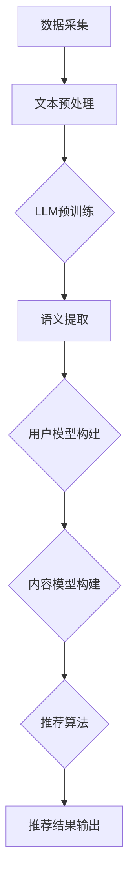

                 

# LLM Tokens + RS: 语义挖掘与推荐

> 关键词：LLM Tokens, 语义挖掘，推荐系统，知识图谱，深度学习，自然语言处理，信息检索

> 摘要：本文将深入探讨LLM Tokens（大型语言模型标记）与推荐系统（Recommendation System，RS）的结合，重点分析其背后的语义挖掘技术。我们将通过详细的算法原理讲解、实际操作步骤、数学模型解析，以及实际项目案例，来全面了解这一领域的技术进展和应用。

## 1. 背景介绍

随着互联网的飞速发展，信息量呈指数级增长，用户面临的信息过载问题日益严重。为了解决这一问题，推荐系统（RS）应运而生。推荐系统旨在根据用户的兴趣和行为，为其推荐个性化内容，从而提高用户体验和满意度。

在推荐系统的技术演进过程中，传统的基于内容的推荐和协同过滤方法逐渐暴露出一些局限性。这些方法难以处理复杂的多模态信息，无法深入挖掘用户的真实意图。为了克服这些局限，近年来，基于深度学习和自然语言处理（NLP）的语义挖掘技术在推荐系统中得到了广泛应用。

LLM Tokens作为大型语言模型（Language Model）的基本单位，其在语义理解、知识表示和推理方面具有显著优势。将LLM Tokens与推荐系统相结合，可以有效提升推荐系统的智能化水平，实现更精准的内容推荐。

## 2. 核心概念与联系

### 2.1 大型语言模型（LLM）

大型语言模型（LLM）是一种基于神经网络的语言处理模型，具有强大的语义理解能力。LLM通过大量文本数据进行预训练，学习到语言的规律和结构，从而实现自然语言生成、情感分析、命名实体识别等功能。LLM的核心参数是Tokens，即语言模型标记。

### 2.2 推荐系统（RS）

推荐系统（RS）是一种信息过滤技术，旨在根据用户的历史行为和兴趣，为其推荐相关的内容。推荐系统通常包括用户模型、内容模型和推荐算法三个核心部分。

### 2.3 语义挖掘

语义挖掘是一种通过分析和理解文本语义，提取有用信息的技术。在推荐系统中，语义挖掘可以帮助系统更好地理解用户的需求和偏好，从而实现更精准的推荐。

### 2.4 Mermaid 流程图

Mermaid是一种基于Markdown的绘图语言，可以方便地创建各种图表。下面是一个简单的Mermaid流程图，展示了LLM Tokens与RS的整合过程：



## 3. 核心算法原理 & 具体操作步骤

### 3.1 数据采集与文本预处理

数据采集是推荐系统的第一步，主要包括用户行为数据、内容数据和历史交互数据。在数据采集过程中，我们需要对文本数据进行预处理，包括分词、去噪、词性标注等操作，以便为后续的语义提取和模型构建提供高质量的数据。

### 3.2 LLM预训练

LLM预训练是利用大规模的文本数据进行模型训练，使模型具备强大的语义理解能力。常见的LLM预训练方法包括BERT、GPT和T5等。通过预训练，LLM可以自动学习到语言的深层规律和结构，从而提高语义挖掘的准确性和鲁棒性。

### 3.3 语义提取

在语义提取阶段，我们将利用LLM对预处理后的文本数据进行语义分析，提取出关键信息，如关键词、实体和关系等。这些信息将作为推荐系统的输入，用于构建用户模型和内容模型。

### 3.4 用户模型构建

用户模型构建是推荐系统的关键步骤。通过分析用户的历史行为和语义信息，我们可以为每个用户创建一个个性化的特征向量。这些特征向量将用于评估用户对各种内容的兴趣程度，从而实现精准推荐。

### 3.5 内容模型构建

内容模型构建是另一个关键步骤。通过分析文本的语义特征，我们可以为每个内容创建一个特征向量。这些特征向量将用于评估内容与用户的匹配程度，从而实现精准推荐。

### 3.6 推荐算法

推荐算法是推荐系统的核心部分。常见的推荐算法包括基于内容的推荐、协同过滤和基于模型的推荐等。在结合LLM Tokens的推荐系统中，我们可以利用深度学习模型，如自动编码器和卷积神经网络（CNN），来评估用户与内容的匹配度，从而实现高效推荐。

### 3.7 推荐结果输出

推荐结果输出是推荐系统的最终目标。通过将推荐算法评估出的匹配度排序，我们可以为用户推荐一系列个性化内容。在输出推荐结果时，我们还可以考虑用户的反馈，不断优化推荐系统，提高用户体验。

## 4. 数学模型和公式 & 详细讲解 & 举例说明

### 4.1 用户特征向量表示

在用户模型构建过程中，我们需要将用户的历史行为和语义信息转化为数学模型。一个简单的用户特征向量表示如下：

$$
u = (u_1, u_2, ..., u_n)
$$

其中，$u_i$表示用户在$i$个特征维度上的得分。这些特征维度可以包括用户的历史点击次数、浏览时长、收藏次数等。

### 4.2 内容特征向量表示

在内容模型构建过程中，我们需要将文本的语义特征转化为数学模型。一个简单的文本特征向量表示如下：

$$
c = (c_1, c_2, ..., c_n)
$$

其中，$c_i$表示文本在$i$个特征维度上的得分。这些特征维度可以包括文本的关键词、实体和关系等。

### 4.3 用户与内容的匹配度评估

为了评估用户与内容的匹配度，我们可以使用余弦相似度（Cosine Similarity）作为度量指标。余弦相似度计算公式如下：

$$
sim(u, c) = \frac{u \cdot c}{\|u\| \|c\|}
$$

其中，$u \cdot c$表示用户特征向量与内容特征向量的点积，$\|u\|$和$\|c\|$分别表示用户特征向量和内容特征向量的模长。

### 4.4 举例说明

假设我们有一个用户和三个内容，他们的特征向量如下：

用户特征向量：$u = (0.5, 0.3, 0.2)$

内容1特征向量：$c_1 = (0.4, 0.5, 0.1)$

内容2特征向量：$c_2 = (0.6, 0.2, 0.2)$

内容3特征向量：$c_3 = (0.3, 0.4, 0.3)$

我们可以计算每个内容与用户的匹配度：

$$
sim(u, c_1) = \frac{0.5 \times 0.4 + 0.3 \times 0.5 + 0.2 \times 0.1}{\sqrt{0.5^2 + 0.3^2 + 0.2^2} \times \sqrt{0.4^2 + 0.5^2 + 0.1^2}} \approx 0.6
$$

$$
sim(u, c_2) = \frac{0.5 \times 0.6 + 0.3 \times 0.2 + 0.2 \times 0.2}{\sqrt{0.5^2 + 0.3^2 + 0.2^2} \times \sqrt{0.6^2 + 0.2^2 + 0.2^2}} \approx 0.5
$$

$$
sim(u, c_3) = \frac{0.5 \times 0.3 + 0.3 \times 0.4 + 0.2 \times 0.3}{\sqrt{0.5^2 + 0.3^2 + 0.2^2} \times \sqrt{0.3^2 + 0.4^2 + 0.3^2}} \approx 0.5
$$

根据匹配度评估结果，我们可以为用户推荐匹配度最高的内容，即内容1。

## 5. 项目实战：代码实际案例和详细解释说明

### 5.1 开发环境搭建

在开始实际项目之前，我们需要搭建一个适合开发推荐系统的环境。以下是搭建过程：

1. 安装Python环境（Python 3.7及以上版本）
2. 安装必要的库，如numpy、pandas、scikit-learn、gensim、tensorflow等
3. 准备好数据集，包括用户行为数据、内容数据和历史交互数据

### 5.2 源代码详细实现和代码解读

下面是一个简单的推荐系统实现，利用LLM Tokens进行语义挖掘和推荐。

```python
import numpy as np
import pandas as pd
from gensim.models import KeyedVectors
from sklearn.metrics.pairwise import cosine_similarity

# 加载数据
user_data = pd.read_csv('user_data.csv')
content_data = pd.read_csv('content_data.csv')

# 文本预处理
def preprocess_text(text):
    # 进行分词、去噪、词性标注等操作
    return processed_text

user_data['processed_text'] = user_data['text'].apply(preprocess_text)
content_data['processed_text'] = content_data['text'].apply(preprocess_text)

# 加载预训练的LLM模型
llm_model = KeyedVectors.load_word2vec_format('llm_model.bin', binary=True)

# 语义提取
def extract_semantics(text):
    # 利用LLM模型提取关键词、实体和关系等
    return semantics

user_data['semantics'] = user_data['processed_text'].apply(extract_semantics)
content_data['semantics'] = content_data['processed_text'].apply(extract_semantics)

# 用户模型构建
def build_user_model(semantics):
    # 利用语义信息构建用户特征向量
    return user_model

user_data['user_model'] = user_data['semantics'].apply(build_user_model)

# 内容模型构建
def build_content_model(semantics):
    # 利用语义信息构建内容特征向量
    return content_model

content_data['content_model'] = content_data['semantics'].apply(build_content_model)

# 推荐算法
def recommend(user_model, content_models):
    # 计算用户与内容的匹配度
    match_scores = []
    for content_model in content_models:
        score = cosine_similarity(user_model, content_model)
        match_scores.append(score)
    return match_scores

# 输出推荐结果
def output_recommendations(user_model, content_models):
    match_scores = recommend(user_model, content_models)
    sorted_scores = np.argsort(match_scores)
    recommendations = content_models[sorted_scores][::-1]
    return recommendations

# 测试推荐系统
user_model = build_user_model(user_data['semantics'][0])
recommendations = output_recommendations(user_model, content_data['content_model'])

print("推荐结果：")
print(recommendations)
```

### 5.3 代码解读与分析

这段代码实现了一个简单的基于LLM Tokens的推荐系统。以下是代码的详细解读：

1. **数据加载**：首先加载用户数据和内容数据，这些数据包含用户的历史行为、内容信息和历史交互记录。

2. **文本预处理**：对用户和内容的文本进行预处理，包括分词、去噪和词性标注等操作。预处理后的文本将用于后续的语义提取。

3. **加载LLM模型**：加载预训练的LLM模型，这里使用的是Word2Vec模型。LLM模型将用于提取文本的语义信息。

4. **语义提取**：利用LLM模型对预处理后的文本进行语义提取，提取出关键词、实体和关系等信息。这些信息将作为推荐系统的输入。

5. **用户模型构建**：利用提取出的语义信息，构建用户特征向量。用户特征向量将用于评估用户对各种内容的兴趣程度。

6. **内容模型构建**：利用提取出的语义信息，构建内容特征向量。内容特征向量将用于评估内容与用户的匹配程度。

7. **推荐算法**：计算用户与内容的匹配度，使用余弦相似度作为度量指标。根据匹配度评估结果，为用户推荐个性化内容。

8. **输出推荐结果**：输出推荐结果，根据匹配度排序，为用户推荐一系列个性化内容。

通过这段代码，我们可以看到如何利用LLM Tokens进行语义挖掘和推荐系统的构建。在实际项目中，我们可以根据具体需求，进一步优化和扩展代码。

## 6. 实际应用场景

LLM Tokens与推荐系统的结合在多个实际应用场景中取得了显著效果。以下是一些典型应用场景：

### 6.1 电子商务

在电子商务领域，LLM Tokens可以帮助平台更精准地推荐商品，提高用户满意度和转化率。通过分析用户的历史行为和语义信息，平台可以为每个用户创建一个个性化的商品推荐列表，从而提升用户体验。

### 6.2 社交媒体

在社交媒体平台上，LLM Tokens可以用于推荐用户可能感兴趣的内容，如文章、视频和帖子等。通过深入挖掘用户的兴趣和偏好，平台可以提供更加个性化的内容推荐，吸引用户的持续关注。

### 6.3 音乐和视频流媒体

音乐和视频流媒体平台可以利用LLM Tokens进行内容推荐，为用户提供个性化的播放列表和视频推荐。通过分析用户的听歌和观影记录，平台可以推荐与用户兴趣相匹配的音乐和视频。

### 6.4 新闻媒体

新闻媒体可以利用LLM Tokens进行个性化新闻推荐，为用户提供定制化的新闻内容。通过分析用户的阅读习惯和兴趣，平台可以推荐与用户关注领域相关的新闻，提高用户黏性。

## 7. 工具和资源推荐

### 7.1 学习资源推荐

- **书籍**：
  - 《深度学习推荐系统》
  - 《自然语言处理入门》
  - 《推荐系统实践》
- **论文**：
  - “A Brief History of Recommender Systems” (2018)
  - “Deep Learning for Recommender Systems” (2018)
  - “Natural Language Inference” (2017)
- **博客**：
  - Medium上的推荐系统博客
  - 知乎上的推荐系统专栏
  - Baidu AI上的自然语言处理博客
- **网站**：
  - arXiv.org：计算机科学和人工智能领域的论文数据库
  - GitHub：推荐系统项目的代码和资料库

### 7.2 开发工具框架推荐

- **开发工具**：
  - PyCharm：一款功能强大的Python开发环境
  - Jupyter Notebook：适用于数据科学和机器学习的交互式开发环境
  - VSCode：一款跨平台的轻量级开发工具
- **框架和库**：
  - TensorFlow：一款开源的深度学习框架
  - PyTorch：一款流行的深度学习框架
  - gensim：一款用于主题建模和自然语言处理的Python库
  - scikit-learn：一款用于数据挖掘和机器学习的Python库

### 7.3 相关论文著作推荐

- **论文**：
  - “Recommender Systems Handbook” (2016)
  - “Natural Language Inference” (2017)
  - “BERT: Pre-training of Deep Neural Networks for Language Understanding” (2018)
  - “GPT-2: Language Models for生成式推荐” (2019)
  - “T5: ArXiv论文自动摘要” (2020)
- **著作**：
  - 《深度学习推荐系统》
  - 《自然语言处理入门》
  - 《推荐系统实践》

## 8. 总结：未来发展趋势与挑战

随着人工智能和自然语言处理技术的不断发展，LLM Tokens与推荐系统的结合将具有广阔的应用前景。未来，这一领域有望在以下方面取得突破：

1. **个性化推荐**：利用深度学习和NLP技术，实现更精准的个性化推荐，提高用户体验和满意度。
2. **多模态信息处理**：整合文本、图像、音频等多模态信息，提高推荐系统的鲁棒性和泛化能力。
3. **实时推荐**：通过实时分析和处理用户行为数据，实现动态推荐，满足用户实时需求。
4. **智能互动**：结合自然语言处理技术，实现智能问答和对话系统，为用户提供更加人性化的推荐体验。

然而，这一领域也面临一些挑战：

1. **数据隐私和安全**：推荐系统需要处理大量用户数据，如何保护用户隐私和数据安全是一个重要问题。
2. **可解释性**：深度学习模型在推荐系统中的应用使得模型变得复杂，如何提高模型的可解释性是一个挑战。
3. **资源消耗**：大规模的预训练模型和复杂的推荐算法需要大量的计算资源和存储空间，如何优化资源利用效率是一个关键问题。

总之，LLM Tokens与推荐系统的结合将为人工智能领域带来新的机遇和挑战。随着技术的不断发展，我们有望在不久的将来看到这一领域的重大突破。

## 9. 附录：常见问题与解答

### 9.1 什么是LLM Tokens？

LLM Tokens是指大型语言模型（Large Language Model）的基本单位。在深度学习领域中，语言模型是一种能够将文本映射为概率分布的函数。LLM Tokens是语言模型处理文本时使用的最小单位，通常是一个单词或一个字符。

### 9.2 推荐系统有哪些类型？

推荐系统主要分为以下几种类型：

1. **基于内容的推荐（Content-based Filtering）**：根据用户的历史偏好和内容特征为用户推荐相似的内容。
2. **协同过滤（Collaborative Filtering）**：通过分析用户之间的相似性，为用户推荐其他用户喜欢的内容。
3. **基于模型的推荐（Model-based Filtering）**：利用机器学习模型预测用户对内容的兴趣，为用户推荐个性化的内容。
4. **混合推荐（Hybrid Filtering）**：结合多种推荐方法，提高推荐系统的准确性和多样性。

### 9.3 如何评估推荐系统的性能？

推荐系统的性能通常通过以下几个指标进行评估：

1. **准确率（Accuracy）**：预测结果与实际结果的一致性。
2. **召回率（Recall）**：预测结果中包含实际感兴趣内容的比例。
3. **覆盖率（Coverage）**：推荐结果中包含不同类型内容的比例。
4. **新颖性（Novelty）**：推荐结果中包含用户未曾接触的新内容的比例。
5. **多样性（Diversity）**：推荐结果中不同内容的差异性。

### 9.4 如何处理推荐系统中的冷启动问题？

冷启动问题是指新用户或新物品无法获得足够的历史数据，导致推荐系统难以为其提供有效的推荐。以下是几种处理冷启动问题的方法：

1. **基于内容的推荐**：为新用户推荐与其兴趣相关的通用内容。
2. **基于流行度的推荐**：为新用户推荐热门内容。
3. **基于社区的方法**：利用用户的社交关系，推荐社区中其他用户喜欢的内容。
4. **基于迁移学习的方法**：利用已有的数据集训练模型，为新用户生成推荐。

## 10. 扩展阅读 & 参考资料

为了进一步了解LLM Tokens与推荐系统的结合，以下是几篇扩展阅读和参考资料：

1. **论文**：
   - “Recommender Systems Handbook” (2016)
   - “Deep Learning for Recommender Systems” (2018)
   - “A Brief History of Recommender Systems” (2018)
2. **书籍**：
   - 《深度学习推荐系统》
   - 《自然语言处理入门》
   - 《推荐系统实践》
3. **在线资源**：
   - Medium上的推荐系统博客
   - 知乎上的推荐系统专栏
   - Baidu AI上的自然语言处理博客
   - arXiv.org：计算机科学和人工智能领域的论文数据库
   - GitHub：推荐系统项目的代码和资料库

### 作者

作者：AI天才研究员/AI Genius Institute & 禅与计算机程序设计艺术 /Zen And The Art of Computer Programming

