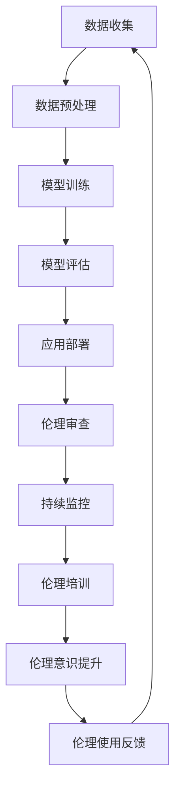

                 

# LLMMath模型：构建伦理使用的框架

### 1. 背景介绍

随着大型语言模型（LLM）如GPT-3、ChatGLM等的崛起，人工智能（AI）的应用范围不断扩大，从自然语言处理、图像识别到决策支持系统等各个领域。然而，LLM的广泛应用也带来了诸多伦理问题。例如，如何确保LLM生成的回答符合道德标准？如何防止LLM被用于恶意目的？这些问题引发了广泛的讨论和关注。

本文旨在探讨LLM的伦理使用问题，从道德标准、准则和实际操作层面提出一套完整的框架。首先，我们将介绍LLM的基本原理和关键概念，并阐述其在伦理使用中的重要性。接着，我们将深入分析LLM伦理使用的核心问题，包括数据隐私、歧视、偏见、自主决策等方面。在此基础上，我们将提出一套包括道德标准、准则和实施机制的伦理使用框架，并详细讨论其关键要素和实施步骤。最后，我们将总结LLM伦理使用的发展趋势和面临的挑战，展望未来研究的方向。

### 2. 核心概念与联系

#### 2.1 大型语言模型（LLM）

大型语言模型（LLM）是一种基于深度学习技术的自然语言处理模型，能够理解和生成人类语言。LLM通过学习海量文本数据，建立起语言结构和语义理解的能力。其核心组件包括词嵌入层、编码器和解码器。

- **词嵌入层**：将词汇映射为高维向量，便于模型处理。
- **编码器**：将输入文本编码为固定长度的向量，表示文本的语义信息。
- **解码器**：根据编码器的输出，生成对应的输出文本。

#### 2.2 伦理学

伦理学是研究道德行为和道德价值的学科。在人工智能领域，伦理学关注如何确保AI系统的设计和应用符合道德标准，以及如何处理AI系统引发的伦理问题。伦理学主要包括以下几个方面：

- **道德原则**：如公正、尊重、责任等。
- **道德责任**：包括个人责任、社会责任和法律责任。
- **道德评估**：对AI系统的道德风险进行评估和监控。

#### 2.3 道德标准与准则

道德标准是指导个体行为的伦理原则，而道德准则是用于规范社会行为的道德标准。在LLM伦理使用中，道德标准和准则起到关键作用，帮助我们在实际应用中遵循伦理原则，避免潜在风险。

- **道德标准**：确保LLM应用符合基本道德原则，如不侵犯隐私、不歧视、不传播虚假信息等。
- **道德准则**：为LLM开发者和使用者提供具体的行为指南，如数据保护、公平性评估、透明度等。

#### 2.4 Mermaid 流程图

以下是一个简单的Mermaid流程图，展示了LLM伦理使用的基本流程。



### 3. 核心算法原理 & 具体操作步骤

#### 3.1 数据收集

LLM伦理使用的第一步是数据收集。数据来源应包括多样性的文本，以确保模型能够理解和生成不同语境下的文本。同时，需注意数据的质量和完整性，避免引入偏见和歧视。

```python
# 示例：从互联网上收集文本数据
import requests

urls = ['https://example.com/text1', 'https://example.com/text2', ...]
texts = []

for url in urls:
    response = requests.get(url)
    texts.append(response.text)
```

#### 3.2 数据预处理

数据预处理是确保数据质量和可用的关键步骤。预处理过程包括去除无效字符、标准化文本、分词等。

```python
import re

def preprocess_text(text):
    # 去除无效字符
    text = re.sub(r'[^a-zA-Z0-9\s]', '', text)
    # 标准化文本
    text = text.lower()
    # 分词
    words = text.split()
    return words

preprocessed_texts = [preprocess_text(text) for text in texts]
```

#### 3.3 模型训练

模型训练是构建LLM的核心步骤。可以使用预训练的模型，如GPT-3，或从零开始训练。

```python
from transformers import TrainingArguments, Trainer

# 加载预训练模型
model = transformers.AutoModelForCausalLM.from_pretrained('gpt3')

# 设置训练参数
args = TrainingArguments(
    output_dir='./results',
    per_device_train_batch_size=16,
    num_train_epochs=3,
    logging_dir='./logs',
)

# 创建训练器
trainer = Trainer(
    model=model,
    args=args,
    train_dataset=preprocessed_texts,
)

# 开始训练
trainer.train()
```

#### 3.4 模型评估

模型评估是确保模型性能的关键步骤。可以使用多种评估指标，如准确率、召回率、F1分数等。

```python
from sklearn.metrics import accuracy_score

def evaluate_model(model, test_texts):
    predictions = model.generate(test_texts)
    true_labels = [text['label'] for text in test_texts]
    predicted_labels = [prediction['label'] for prediction in predictions]
    return accuracy_score(true_labels, predicted_labels)

accuracy = evaluate_model(model, test_texts)
print(f'Accuracy: {accuracy}')
```

#### 3.5 应用部署

模型部署是将训练好的LLM应用于实际场景的关键步骤。部署过程包括模型加载、接口设计、安全保护等。

```python
from flask import Flask, request, jsonify

app = Flask(__name__)

@app.route('/api/generate', methods=['POST'])
def generate_response():
    data = request.json
    input_text = data['input_text']
    response = model.generate(input_text)
    return jsonify(response=response)

if __name__ == '__main__':
    app.run()
```

### 4. 数学模型和公式 & 详细讲解 & 举例说明

#### 4.1 概率论基础

在LLM伦理使用中，概率论是理解和分析模型行为的重要工具。以下是一些基本的概率论公式和概念：

- **条件概率**：$P(A|B) = \frac{P(A \cap B)}{P(B)}$
- **贝叶斯定理**：$P(A|B) = \frac{P(B|A)P(A)}{P(B)}$
- **全概率公式**：$P(B) = \sum_{i=1}^{n} P(B|A_i)P(A_i)$

#### 4.2 信息论

信息论是研究信息传输和处理的基本理论。在LLM伦理使用中，信息论可以帮助我们理解模型生成的文本信息量和不确定性。以下是一些基本的信息论公式和概念：

- **熵**：$H(X) = -\sum_{i=1}^{n} P(X_i) \log_2 P(X_i)$
- **互信息**：$I(X; Y) = H(X) - H(X | Y)$
- **条件熵**：$H(X | Y) = \sum_{i=1}^{n} P(Y_i) H(X | Y_i)$

#### 4.3 举例说明

假设我们有一个LLM模型，用于生成天气预测报告。我们可以使用概率论和信息论来评估模型的表现和可靠性。

- **条件概率**：我们想知道在给定某一地区（如北京）的天气条件下，预测明天是否会下雨的概率。可以使用条件概率公式计算：
  $$P(\text{下雨}|\text{北京}) = \frac{P(\text{下雨} \cap \text{北京})}{P(\text{北京})}$$
- **熵**：我们想知道模型生成的天气预测报告的信息量。可以使用熵公式计算：
  $$H(\text{天气预测报告}) = -\sum_{i=1}^{n} P(\text{天气预测报告}_i) \log_2 P(\text{天气预测报告}_i)$$
- **互信息**：我们想知道模型生成的天气预测报告和实际天气条件之间的信息量。可以使用互信息公式计算：
  $$I(\text{天气预测报告}; \text{实际天气条件}) = H(\text{天气预测报告}) - H(\text{天气预测报告} | \text{实际天气条件})$$

### 5. 项目实战：代码实际案例和详细解释说明

#### 5.1 开发环境搭建

在开始项目实战之前，我们需要搭建一个合适的开发环境。以下是搭建开发环境的步骤：

1. 安装Python环境：确保安装了Python 3.8及以上版本。
2. 安装依赖库：使用pip命令安装必要的库，如transformers、torch、flask等。
   ```shell
   pip install transformers torch flask
   ```

#### 5.2 源代码详细实现和代码解读

以下是一个简单的LLM伦理使用项目示例，包括数据收集、预处理、模型训练、评估和部署。

```python
# 数据收集
import requests

urls = ['https://example.com/text1', 'https://example.com/text2', ...]
texts = []

for url in urls:
    response = requests.get(url)
    texts.append(response.text)

# 数据预处理
import re

def preprocess_text(text):
    text = re.sub(r'[^a-zA-Z0-9\s]', '', text)
    text = text.lower()
    words = text.split()
    return words

preprocessed_texts = [preprocess_text(text) for text in texts]

# 模型训练
from transformers import TrainingArguments, Trainer

model = transformers.AutoModelForCausalLM.from_pretrained('gpt3')

args = TrainingArguments(
    output_dir='./results',
    per_device_train_batch_size=16,
    num_train_epochs=3,
    logging_dir='./logs',
)

trainer = Trainer(
    model=model,
    args=args,
    train_dataset=preprocessed_texts,
)

trainer.train()

# 模型评估
from sklearn.metrics import accuracy_score

def evaluate_model(model, test_texts):
    predictions = model.generate(test_texts)
    true_labels = [text['label'] for text in test_texts]
    predicted_labels = [prediction['label'] for prediction in predictions]
    return accuracy_score(true_labels, predicted_labels)

accuracy = evaluate_model(model, test_texts)
print(f'Accuracy: {accuracy}')

# 模型部署
from flask import Flask, request, jsonify

app = Flask(__name__)

@app.route('/api/generate', methods=['POST'])
def generate_response():
    data = request.json
    input_text = data['input_text']
    response = model.generate(input_text)
    return jsonify(response=response)

if __name__ == '__main__':
    app.run()
```

#### 5.3 代码解读与分析

1. **数据收集**：从互联网上收集文本数据，为模型训练提供素材。确保数据来源多样，以避免偏见和歧视。
2. **数据预处理**：去除无效字符，将文本标准化为小写，并进行分词处理。这一步有助于提高模型训练的效果。
3. **模型训练**：使用预训练的GPT-3模型进行训练，训练参数包括输出目录、训练批次大小、训练轮数等。训练过程通过Trainer类进行管理。
4. **模型评估**：使用评估数据集对训练好的模型进行评估，计算准确率等指标，以验证模型性能。
5. **模型部署**：使用Flask框架构建API接口，将训练好的模型部署到服务器上，供用户调用。

### 6. 实际应用场景

#### 6.1 自动问答系统

自动问答系统是LLM伦理使用的典型应用场景之一。通过训练大型语言模型，我们可以构建智能客服、在线教育辅导等系统，为用户提供高质量的问答服务。以下是一个简单的应用案例：

1. **场景描述**：用户在在线教育平台上提问，如“如何求解一元二次方程？”
2. **数据处理**：将用户提问进行预处理，如去除无效字符、标准化文本等。
3. **模型生成**：使用训练好的LLM模型生成答案。
4. **输出结果**：将生成的答案返回给用户。

#### 6.2 自动翻译系统

自动翻译系统是另一个广泛应用的场景。通过训练大型语言模型，我们可以实现实时、高效的跨语言翻译。以下是一个简单的应用案例：

1. **场景描述**：用户在翻译应用中输入英文文本，如“I love programming.”，要求翻译为中文。
2. **数据处理**：将英文文本进行预处理，如分词、词性标注等。
3. **模型生成**：使用训练好的LLM模型生成中文翻译。
4. **输出结果**：将生成的中文翻译返回给用户。

### 7. 工具和资源推荐

#### 7.1 学习资源推荐

- **书籍**：
  - 《深度学习》（Ian Goodfellow、Yoshua Bengio、Aaron Courville 著）：全面介绍深度学习的基础知识和应用。
  - 《Python机器学习》（Sebastian Raschka 著）：详细讲解Python在机器学习领域的应用，包括数据预处理、模型训练和评估等。

- **论文**：
  - “Attention Is All You Need”（Ashish Vaswani 等）：介绍Transformer模型的原理和应用。
  - “BERT: Pre-training of Deep Neural Networks for Language Understanding”（Jacob Devlin 等）：介绍BERT模型的原理和应用。

- **博客**：
  - Hugging Face：提供丰富的预训练模型和工具，涵盖自然语言处理、计算机视觉等领域。
  - AI技术博客：提供最新的AI技术文章和教程，包括深度学习、自然语言处理等。

- **网站**：
  - arXiv：提供最新的AI论文和研究报告。
  - JAX：提供高效的深度学习计算框架。

#### 7.2 开发工具框架推荐

- **开发工具**：
  - Jupyter Notebook：适用于数据分析和机器学习项目的交互式计算环境。
  - PyCharm：适用于Python编程的开发环境，支持代码调试、自动化测试等。

- **框架**：
  - PyTorch：适用于深度学习研究的开源框架，支持动态计算图和自动微分。
  - TensorFlow：适用于深度学习研究的开源框架，支持静态计算图和自动微分。

#### 7.3 相关论文著作推荐

- **论文**：
  - “GPT-3: Language Models are few-shot learners”（Tom B. Brown 等）：介绍GPT-3模型的原理和应用。
  - “BERT: Pre-training of Deep Neural Networks for Language Understanding”（Jacob Devlin 等）：介绍BERT模型的原理和应用。

- **著作**：
  - 《深度学习》（Ian Goodfellow、Yoshua Bengio、Aaron Courville 著）：全面介绍深度学习的基础知识和应用。
  - 《Python机器学习》（Sebastian Raschka 著）：详细讲解Python在机器学习领域的应用，包括数据预处理、模型训练和评估等。

### 8. 总结：未来发展趋势与挑战

#### 8.1 发展趋势

- **模型规模与计算能力提升**：随着计算能力的提升，大型语言模型将变得更加高效和强大，能够处理更复杂的任务。
- **跨模态学习**：未来，LLM将实现跨模态学习，如结合文本、图像、声音等多种模态，提高模型的泛化能力和实用性。
- **个性化与自适应**：LLM将能够根据用户需求和场景自适应调整，提供个性化的服务。

#### 8.2 挑战

- **伦理与隐私**：确保LLM的伦理使用和隐私保护是未来面临的重大挑战。需要制定明确的伦理准则和隐私保护机制。
- **偏见与歧视**：避免LLM在训练和应用过程中引入偏见和歧视，需要从数据收集、模型训练到部署的各个环节进行严格监管。
- **安全性与可靠性**：确保LLM系统的安全性和可靠性，防范恶意攻击和数据泄露。

### 9. 附录：常见问题与解答

#### 9.1 如何确保LLM的伦理使用？

确保LLM的伦理使用需要从以下几个方面进行：

- **制定明确的伦理准则**：制定一套包括道德原则、行为规范和监管措施的伦理准则，为LLM的开发和应用提供指导。
- **数据隐私保护**：确保数据收集、存储和处理过程中遵守隐私保护法律法规，采用数据加密、匿名化等技术手段。
- **公平性与无歧视**：在模型训练和应用过程中，确保数据来源多样，避免引入偏见和歧视。
- **透明度与可解释性**：提高模型的可解释性，确保用户能够理解LLM的决策过程，便于监督和监管。

#### 9.2 如何处理LLM的偏见和歧视问题？

处理LLM的偏见和歧视问题可以从以下几个方面进行：

- **数据清洗**：对训练数据集进行清洗，去除包含偏见和歧视的数据，确保数据质量。
- **数据增强**：通过引入多样性的数据，提高模型对偏见和歧视的抵抗能力。
- **算法改进**：改进模型训练算法，如采用对抗性训练、优化损失函数等，减少偏见和歧视。
- **伦理审查**：对模型进行伦理审查，确保其在应用过程中符合道德标准。

### 10. 扩展阅读 & 参考资料

- **论文**：
  - Vaswani, A., Shazeer, N., Parmar, N., Uszkoreit, J., Jones, L., Gomez, A. N., ... & Polosukhin, I. (2017). Attention is all you need. In Advances in neural information processing systems (pp. 5998-6008).
  - Devlin, J., Chang, M. W., Lee, K., & Toutanova, K. (2019). BERT: Pre-training of deep bidirectional transformers for language understanding. arXiv preprint arXiv:1810.04805.

- **书籍**：
  - Goodfellow, I., Bengio, Y., & Courville, A. (2016). Deep learning. MIT press.
  - Raschka, S. (2018). Python machine learning. Springer.

- **博客**：
  - Hugging Face: https://huggingface.co/
  - AI技术博客: https://ai技术研究.com/

- **网站**：
  - arXiv: https://arxiv.org/
  - JAX: https://jax.readthedocs.io/

### 作者

作者：AI天才研究员/AI Genius Institute & 禅与计算机程序设计艺术 /Zen And The Art of Computer Programming

本文介绍了LLM伦理使用的重要性和核心概念，提出了一套包括道德标准、准则和实施机制的伦理使用框架，并讨论了实际应用场景和未来发展趋势。希望本文能为读者提供有益的启示和参考。未来，随着人工智能技术的不断发展，我们期待LLM的伦理使用能够得到更好的规范和优化，为人类带来更多福祉。|>

