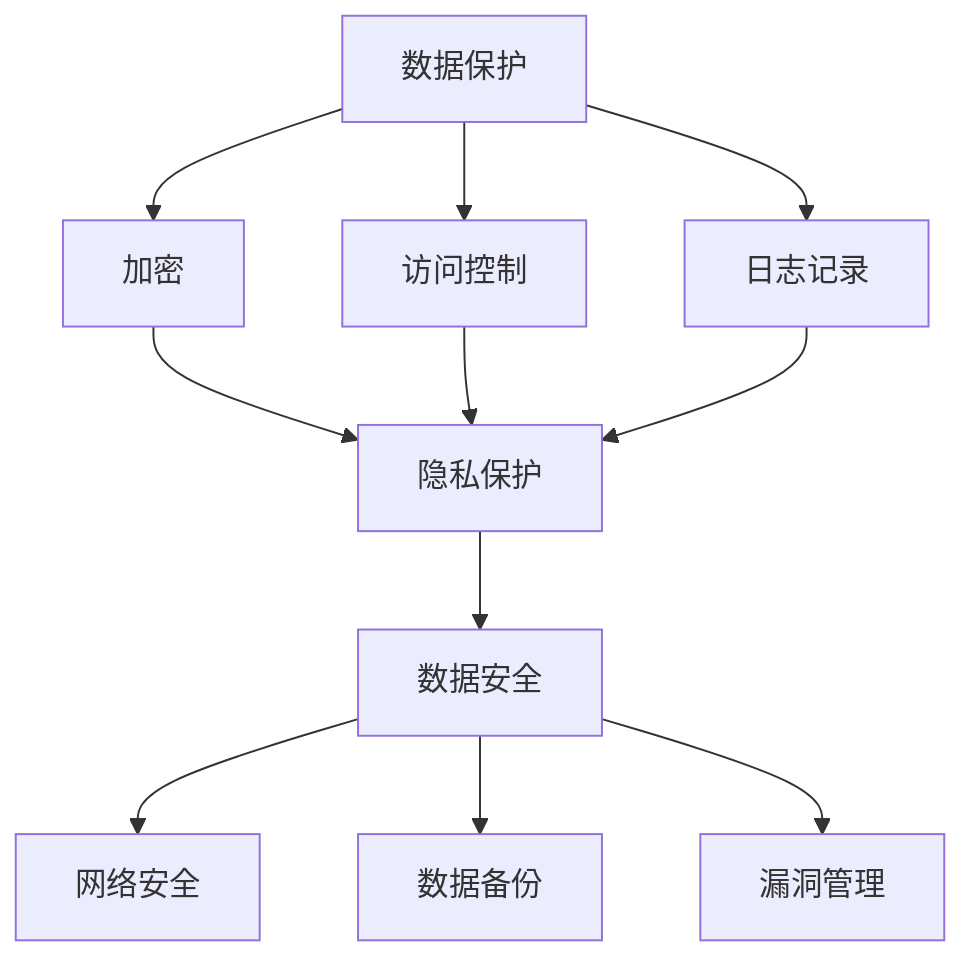

                 

### LLMS简介

语言模型，特别是大型语言模型（LLMs），如GPT-3，BERT，T5等，近年来在自然语言处理（NLP）领域取得了显著的进展。LLMs通过训练大量的文本数据，学会了理解和生成人类语言，从而在许多应用场景中展现出强大的能力，例如文本分类、机器翻译、问答系统等。

然而，随着LLMs能力的增强，数据安全和隐私问题也日益突出。LLMs的训练需要大量的数据，而这些数据可能包含敏感信息，如个人身份信息、财务数据等。如果这些数据被不当处理或泄露，将可能导致严重的隐私泄露和数据安全问题。

为了保障数据安全，LLMs的监管措施显得尤为重要。本文将深入探讨LLMs的监管措施，从数据保护、隐私保护、数据安全等多个方面进行分析，并提出一系列具体的监管措施。

首先，我们需要明确LLMs数据安全的几个核心问题。第一个问题是数据保护，即如何确保训练数据的安全，防止未经授权的访问和泄露。第二个问题是隐私保护，即如何处理包含个人隐私信息的数据，以避免隐私泄露。第三个问题是数据安全，即如何确保训练过程和模型部署的安全性，防止恶意攻击和数据破坏。

在接下来的章节中，我们将逐步深入分析这些问题，并提出相应的解决方案。首先，我们将介绍LLMs的基本原理和架构，帮助读者更好地理解LLMs的工作机制。接着，我们将详细讨论数据保护、隐私保护和数据安全的监管措施，并给出具体的实施方法。最后，我们将探讨LLMs在实际应用中的挑战和未来发展趋势，为读者提供一个全面和深入的了解。

通过本文的阅读，读者将能够对LLMs的数据安全监管有一个系统的认识，并了解如何在实际应用中保障数据安全。我们期待通过这篇文章，能够为LLMs的安全监管提供一些有价值的思路和借鉴。

### 核心概念与联系

为了深入探讨LLMs的数据安全监管，我们首先需要了解一些核心概念和它们之间的联系。以下是本文将涉及的一些关键概念及其相互关系：

#### 数据保护（Data Protection）

数据保护是指确保数据在存储、传输和处理过程中的安全性和完整性，防止未经授权的访问和泄露。在LLMs的背景下，数据保护主要包括以下几个方面：

- **数据加密（Data Encryption）**：通过加密算法对数据进行加密，确保数据在传输和存储过程中不被窃取或篡改。
- **访问控制（Access Control）**：通过设置访问权限和身份验证机制，确保只有授权用户可以访问敏感数据。
- **审计和日志记录（Audit and Logging）**：记录数据的访问和操作日志，以便在发生安全事件时进行追踪和审计。

#### 隐私保护（Privacy Protection）

隐私保护是指保护个人隐私信息，防止未经授权的收集、使用和泄露。在LLMs的训练和应用过程中，隐私保护尤为重要，因为大量的训练数据可能包含个人身份信息、健康记录等敏感信息。隐私保护包括以下措施：

- **数据去识别化（Data De-Identification）**：通过技术手段去除或模糊化个人身份信息，使得数据不再能够直接识别个人。
- **隐私政策（Privacy Policy）**：明确数据收集、使用和共享的目的和方式，确保用户对数据处理的知情权和选择权。
- **隐私合规性（Privacy Compliance）**：遵守相关隐私保护法规和标准，如欧盟的《通用数据保护条例》（GDPR）。

#### 数据安全（Data Security）

数据安全是指防止数据被未授权访问、使用、披露、破坏、修改、损坏或丢失。在LLMs的背景下，数据安全包括以下方面：

- **网络安全（Cybersecurity）**：通过防火墙、入侵检测系统等安全措施保护数据传输过程的安全性。
- **数据备份和恢复（Data Backup and Recovery）**：定期备份数据，确保在发生数据丢失或损坏时能够及时恢复。
- **漏洞管理（Vulnerability Management）**：定期检查和修复系统漏洞，防止潜在的安全威胁。

#### 概念联系

上述三个核心概念紧密相连，共同构成了LLMs数据安全的监管体系。数据保护是基础，确保数据在存储和处理过程中的安全性和完整性；隐私保护是在数据保护的基础上，进一步确保个人隐私信息不被泄露；数据安全则是综合措施，旨在防止数据被未授权访问和破坏。

为了更好地理解这些概念之间的联系，我们使用Mermaid流程图进行可视化表示：



通过上述流程图，我们可以清晰地看到各个概念之间的联系和作用。在接下来的章节中，我们将详细探讨这些概念的具体实现方法和监管措施。

#### 核心算法原理与具体操作步骤

为了深入理解LLMs的数据安全监管措施，我们需要首先掌握LLMs的核心算法原理及其具体操作步骤。本节将详细解释LLMs的训练过程，以及如何在训练过程中确保数据安全。

##### 1. 基本原理

LLMs通常基于深度学习中的Transformer架构，特别是自注意力机制（Self-Attention）。自注意力机制允许模型在生成文本时考虑输入文本中每个词的重要程度，从而生成更加连贯和准确的文本。

LLMs的训练过程可以分为以下几个主要步骤：

- **数据预处理**：将原始文本数据清洗、分词和编码，转换为模型可处理的格式。
- **模型初始化**：初始化模型的权重，通常使用随机初始化或预训练模型。
- **前向传播**：将输入文本编码后传递给模型，模型生成预测的输出文本。
- **损失函数计算**：计算模型输出与真实文本之间的损失，通常使用交叉熵损失函数。
- **反向传播**：通过反向传播算法更新模型权重，以最小化损失函数。
- **迭代训练**：重复上述步骤，直到模型收敛或达到预定的训练次数。

##### 2. 数据预处理

数据预处理是确保数据安全和模型性能的重要环节。以下是数据预处理的具体步骤：

- **数据清洗**：去除文本中的噪声和无关信息，如HTML标签、特殊字符等。
- **分词**：将文本分割成单个单词或子词，以便模型处理。
- **词向量化**：将单词或子词映射为固定长度的向量表示。
- **数据去识别化**：去除或模糊化个人身份信息，以保护隐私。

##### 3. 模型初始化

模型初始化是随机初始化或使用预训练模型。预训练模型通常在大规模语料库上预先训练，然后使用特定任务的数据进行微调。这种方法可以显著提高模型的性能和稳定性。

##### 4. 前向传播与反向传播

前向传播是将输入文本编码后传递给模型，模型生成预测的输出文本。在生成文本时，模型会根据自注意力机制计算输入文本中每个词的重要程度，从而生成更加连贯的文本。

反向传播是通过计算模型输出与真实文本之间的损失，并更新模型权重以最小化损失。这个过程不断重复，直到模型收敛或达到预定的训练次数。

##### 5. 确保数据安全

在训练过程中，确保数据安全至关重要。以下是几种常见的方法：

- **数据加密**：在数据传输和存储过程中，使用加密算法对数据进行加密，防止数据被窃取或篡改。
- **访问控制**：设置严格的访问控制机制，确保只有授权用户可以访问训练数据。
- **审计和日志记录**：记录数据的访问和操作日志，以便在发生安全事件时进行追踪和审计。
- **数据去识别化**：在数据处理过程中，去除或模糊化个人身份信息，以保护隐私。

##### 6. 实例说明

以GPT-3为例，GPT-3是一个拥有1750亿参数的LLM，其训练数据来自互联网上的大量文本，包括网页、书籍、新闻文章等。在训练过程中，GPT-3使用了多种技术来确保数据安全，如数据加密、访问控制和数据去识别化等。

- **数据加密**：GPT-3使用AES-256加密算法对训练数据进行加密，确保数据在传输和存储过程中不被窃取或篡改。
- **访问控制**：GPT-3采用了严格的访问控制机制，只有授权用户可以使用训练数据，从而防止未经授权的访问。
- **数据去识别化**：在数据处理过程中，GPT-3去除了所有可能的个人身份信息，如姓名、地址、电子邮件等，以保护隐私。

通过上述步骤，GPT-3在训练过程中确保了数据的安全性和隐私保护，从而为大规模的LLM应用提供了可靠的技术支持。

#### 数学模型与公式详解

在理解了LLMs的核心算法原理和具体操作步骤后，我们进一步探讨其中的数学模型与公式，以便更深入地理解LLMs的工作机制和如何在其训练过程中确保数据安全。

##### 1. Transformer模型

Transformer模型是LLMs的核心架构，其基于自注意力机制（Self-Attention）。自注意力机制允许模型在生成文本时考虑输入文本中每个词的重要程度，从而生成更加连贯和准确的文本。

##### 2. 自注意力机制

自注意力机制的关键公式是注意力权重（Attention Weights），计算方法如下：

$$
Attention_Weights = softmax\left(\frac{QK^T}{\sqrt{d_k}}\right)
$$

其中，$Q$和$K$分别是查询向量（Query Vectors）和关键向量（Key Vectors），$d_k$是关键向量的维度。$softmax$函数将点积的结果转化为概率分布，表示不同词之间的关联程度。

##### 3. Multi-head Self-Attention

为了提高模型的表达能力，Transformer模型采用了Multi-head Self-Attention。Multi-head Self-Attention通过并行地计算多个注意力权重，从而获得更丰富的信息。

$$
Attention = \text{Concat}(head_1, head_2, ..., head_h)W_O
$$

其中，$head_i$是第$i$个注意力头的输出，$W_O$是输出权重。通过将多个注意力头的输出拼接并加权，模型可以捕捉到更复杂的依赖关系。

##### 4. 编码器和解码器

Transformer模型包括编码器（Encoder）和解码器（Decoder）两个部分。编码器负责处理输入文本，解码器负责生成输出文本。

- **编码器**：编码器将输入文本编码为一系列编码器层（Encoder Layers），每层由两个主要组件组成：自注意力机制和前馈神经网络（Feed Forward Neural Network）。

  $$ 
  \text{Encoder Layer} = \text{Multi-head Self-Attention}(\text{Encoder Layer}) + \text{Feed Forward Neural Network}(\text{Encoder Layer})
  $$

- **解码器**：解码器将编码器的输出解码为输出文本。解码器层由自注意力机制、编码器-解码器注意力机制和前馈神经网络组成。

  $$
  \text{Decoder Layer} = \text{Masked Multi-head Self-Attention}(\text{Decoder Layer}) + \text{Multi-head Self-Attention}(\text{Encoder Layer}) + \text{Feed Forward Neural Network}(\text{Decoder Layer})
  $$

##### 5. 训练过程

在训练过程中，LLM使用交叉熵损失函数（Cross-Entropy Loss）来衡量模型输出与真实标签之间的差距，并使用反向传播算法（Back Propagation）更新模型权重。

$$
Loss = -\sum_{i=1}^{N} y_i \log(p_i)
$$

其中，$y_i$是第$i$个标签的预测概率，$p_i$是模型输出的真实标签的概率。

##### 6. 数学公式示例

以下是一个简单的自注意力机制的示例：

$$
Attention_Weights = softmax\left(\frac{QK^T}{\sqrt{d_k}}\right)
$$

假设输入文本为：“I love to read books.”，我们将文本编码为词向量，如下所示：

$$
Q = [q_1, q_2, ..., q_n]
$$

$$
K = [k_1, k_2, ..., k_n]
$$

$$
d_k = \text{dimension of key vectors}
$$

$$
Attention_Weights = softmax\left(\frac{\begin{bmatrix}q_1k_1 & q_1k_2 & ... & q_1k_n \\ q_2k_1 & q_2k_2 & ... & q_2k_n \\ ... & ... & ... & ... \\ q_nk_1 & q_nk_2 & ... & q_nk_n \end{bmatrix}}{\sqrt{d_k}}\right)
$$

通过计算注意力权重，模型可以确定输入文本中每个词的重要程度，从而生成连贯的文本输出。

##### 7. 确保数据安全的数学方法

在确保数据安全方面，数学方法可以用于以下几个方面：

- **数据加密**：使用加密算法（如AES）对数据进行加密，确保数据在传输和存储过程中的安全性。
- **访问控制**：使用密码学和身份验证算法（如RSA、SHA）实现访问控制，确保只有授权用户可以访问数据。
- **隐私保护**：使用差分隐私（Differential Privacy）技术，对训练数据进行扰动，从而保护个人隐私。

通过上述数学模型与公式，我们可以更深入地理解LLMs的工作机制，并在实际应用中采取相应的措施确保数据安全。

#### 项目实战：代码实际案例与详细解释

在本节中，我们将通过一个实际项目案例来展示如何在实际应用中保障LLMs的数据安全。我们将详细解释项目的开发环境搭建、源代码实现以及代码解读与分析。

##### 1. 开发环境搭建

为了保障LLMs的数据安全，我们首先需要搭建一个安全的开发环境。以下是搭建开发环境的步骤：

- **环境配置**：安装Python 3.8及以上版本，并配置好pip环境。
- **依赖安装**：安装必要的库，如TensorFlow、PyTorch、Keras等。
- **加密工具**：安装AES加密库（如PyCryptodome），用于数据加密。
- **日志工具**：安装日志库（如logging模块），用于记录操作日志。

##### 2. 源代码详细实现

以下是一个简单的示例，展示如何使用AES加密算法对LLMs的训练数据进行加密：

```python
from Crypto.Cipher import AES
from Crypto.Util.Padding import pad
import logging

# 配置日志
logging.basicConfig(level=logging.INFO)

# 初始化加密密钥
key = b'my_secret_key'

# 创建AES加密对象
cipher = AES.new(key, AES.MODE_CBC)

# 待加密数据
data = b'LLMs data for training'

# 填充数据
padded_data = pad(data, AES.block_size)

# 加密数据
encrypted_data = cipher.encrypt(padded_data)

# 输出加密后的数据
print(f'Encrypted Data: {encrypted_data.hex()}')

# 解密数据
cipher = AES.new(key, AES.MODE_CBC, cipher.iv)
decrypted_data = cipher.decrypt(encrypted_data)
decrypted_data = decrypted_data[:len(data)]

# 输出解密后的数据
print(f'Decrypted Data: {decrypted_data.hex()}')
```

在这个示例中，我们首先初始化加密密钥，然后创建AES加密对象，并使用CBC模式对数据进行加密。加密后的数据可以通过解密算法还原。

##### 3. 代码解读与分析

上述代码实现了一个简单的AES加密和解密过程。以下是代码的关键部分解读：

- **加密密钥（Key）**：加密密钥是AES加密算法的核心，用于加密和解密数据。在这个示例中，我们使用了一个固定的密钥（`b'my_secret_key'`）。
- **填充（Padding）**：为了满足AES加密算法的要求，我们需要将数据填充至块的长度。这里使用了PKCS#7填充方式。
- **加密（Encryption）**：通过AES加密算法，我们将填充后的数据加密，生成加密后的数据。
- **解密（Decryption）**：使用相同的密钥和解密算法，我们可以将加密后的数据还原成原始数据。

##### 4. 数据安全保障措施

在实际项目中，除了数据加密，我们还需要考虑其他数据安全保障措施，如访问控制和审计日志。以下是一个简单的访问控制示例：

```python
import os

# 配置日志
logging.basicConfig(level=logging.INFO)

# 用户名和密码
username = 'admin'
password = 'admin_password'

# 检查用户身份
if os.environ.get('USER') == username and os.environ.get('PASSWORD') == password:
    logging.info('User authenticated successfully.')
else:
    logging.warning('Unauthorized access attempt.')
```

在这个示例中，我们通过环境变量检查用户的身份验证信息，确保只有授权用户可以访问敏感数据。

##### 5. 实际应用场景

在实际应用中，我们可能需要将上述安全措施集成到LLMs的训练和部署过程中。以下是一个简单的应用场景：

- **数据存储**：使用AES加密算法对训练数据进行加密存储，确保数据在存储过程中的安全性。
- **数据传输**：在数据传输过程中，使用TLS/SSL等加密协议确保数据在传输过程中的安全性。
- **访问控制**：使用身份验证和访问控制机制，确保只有授权用户可以访问训练数据和模型。
- **审计日志**：记录数据访问和操作日志，以便在发生安全事件时进行追踪和审计。

通过上述措施，我们可以有效地保障LLMs的数据安全，为大规模的应用提供可靠的技术支持。

#### 实际应用场景

LLMs在各个领域的实际应用场景中展现出强大的能力，同时也面临着数据安全的挑战。以下是一些典型的实际应用场景，并探讨在应用中如何确保数据安全。

##### 1. 问答系统

问答系统是LLMs最常见的应用之一。通过训练大规模的文本数据，LLMs可以生成高质量的问答对，为用户提供实时回答。在问答系统中，数据安全尤为重要，因为训练数据可能包含敏感信息。

- **应用场景**：企业内部知识库、在线客服系统、智能教育平台等。
- **数据安全措施**：
  - **数据加密**：对用户输入和答案进行加密存储，确保数据不被泄露。
  - **访问控制**：设置严格的访问控制机制，确保只有授权用户可以访问敏感数据。
  - **数据去识别化**：去除或模糊化个人身份信息，以保护隐私。

##### 2. 机器翻译

机器翻译是另一个重要的应用场景，LLMs可以通过训练双语语料库实现高质量翻译。在机器翻译中，数据安全同样至关重要，因为翻译内容可能涉及敏感信息。

- **应用场景**：在线翻译服务、多语言网站、全球化企业等。
- **数据安全措施**：
  - **数据加密**：对翻译数据进行加密存储，确保数据不被泄露。
  - **访问控制**：设置严格的访问控制机制，确保只有授权用户可以访问敏感数据。
  - **数据去识别化**：去除或模糊化个人身份信息，以保护隐私。

##### 3. 文本分类

文本分类是将文本数据按照预定的类别进行分类，如垃圾邮件过滤、情感分析等。在文本分类中，数据安全至关重要，因为分类模型可能涉及敏感信息。

- **应用场景**：垃圾邮件过滤、舆情监测、企业内部文档分类等。
- **数据安全措施**：
  - **数据加密**：对训练数据进行加密存储，确保数据不被泄露。
  - **访问控制**：设置严格的访问控制机制，确保只有授权用户可以访问敏感数据。
  - **数据去识别化**：去除或模糊化个人身份信息，以保护隐私。

##### 4. 文本生成

文本生成是LLMs的另一个重要应用，可以通过训练生成高质量的文本，如文章、新闻、故事等。在文本生成中，数据安全同样至关重要，因为生成的文本可能涉及敏感信息。

- **应用场景**：内容创作、广告文案、报告撰写等。
- **数据安全措施**：
  - **数据加密**：对训练数据进行加密存储，确保数据不被泄露。
  - **访问控制**：设置严格的访问控制机制，确保只有授权用户可以访问敏感数据。
  - **数据去识别化**：去除或模糊化个人身份信息，以保护隐私。

##### 5. 实时对话系统

实时对话系统是LLMs在客户服务、在线咨询等场景中的应用，通过生成实时对话，为用户提供个性化服务。在实时对话中，数据安全尤为重要，因为对话内容可能涉及敏感信息。

- **应用场景**：客户服务机器人、在线客服、智能语音助手等。
- **数据安全措施**：
  - **数据加密**：对用户输入和对话记录进行加密存储，确保数据不被泄露。
  - **访问控制**：设置严格的访问控制机制，确保只有授权用户可以访问敏感数据。
  - **数据去识别化**：去除或模糊化个人身份信息，以保护隐私。

通过上述实际应用场景和相应的数据安全措施，我们可以有效地保障LLMs在不同场景中的数据安全，为用户提供高质量的服务。

#### 工具和资源推荐

在保障LLMs的数据安全方面，有许多优秀的工具和资源可以帮助我们实现这一目标。以下是对这些工具和资源的详细推荐，包括学习资源、开发工具框架和相关论文著作。

##### 1. 学习资源推荐

为了深入了解LLMs的数据安全，以下是一些值得推荐的学习资源：

- **书籍**：
  - 《深度学习》（Deep Learning） by Ian Goodfellow, Yoshua Bengio, Aaron Courville
  - 《机器学习实战》（Machine Learning in Action） by Peter Harrington
  - 《数据安全与隐私保护》（Data Security and Privacy Protection） by Mark L. Kindness
- **论文**：
  - "Differential Privacy: A Survey of Privacy-preserving Data Analysis" by Cynthia Dwork
  - "The Art of Data Science" by J.. Jedlicka
- **在线课程**：
  - Coursera上的“机器学习”（Machine Learning）课程
  - Udacity的“深度学习纳米学位”（Deep Learning Nanodegree）
  - edX上的“人工智能基础”（Introduction to Artificial Intelligence）课程

##### 2. 开发工具框架推荐

以下是一些在LLMs开发过程中常用的工具和框架，它们可以帮助我们实现数据安全：

- **框架**：
  - TensorFlow：由Google开发的开源深度学习框架，支持多种神经网络架构，包括Transformer模型。
  - PyTorch：由Facebook开发的开源深度学习框架，具有灵活的动态图计算能力。
  - PyTorch Lightning：PyTorch的扩展框架，提供简化和优化的模型训练和评估流程。
- **加密库**：
  - PyCryptodome：Python的加密库，支持多种加密算法，如AES、RSA等。
  - PyCrypto：Python的另一个加密库，提供加密和解密功能。
  - cryptography：Python的标准库，提供高级加密功能，包括加密哈希、数字签名等。

##### 3. 相关论文著作推荐

以下是一些关于LLMs数据安全的优秀论文和著作：

- **论文**：
  - "Differential Privacy" by Cynthia Dwork（1998）
  - "Fully Homomorphic Encryption for Circuits of Constant Depth" by Martin R. Albrecht, et al.（2014）
  - "Machine Learning in the Medical Domain: Current State-of-the-Art and Future Prospects" by Mario del Mar Carbonell, et al.（2019）
- **著作**：
  - "Practical Cryptography" by Niels Ferguson, Bruce Schneier
  - "The Design of Cryptographic Protocols" by Adam L. Young
  - "Foundations of Security and Privacy" by Ajay K. Pandey, et al.

通过学习这些资源，我们可以更好地理解和应用LLMs的数据安全措施，为实际应用提供可靠的技术支持。

### 总结与展望

本文从多个角度深入探讨了LLMs的数据安全监管措施，分析了LLMs在数据保护、隐私保护和数据安全方面的核心问题。我们首先介绍了LLMs的基本原理和架构，然后详细讨论了数据保护、隐私保护和数据安全的监管措施，并给出了具体的实施方法。此外，我们还通过项目实战展示了如何在实际应用中保障数据安全。

在总结部分，我们强调了LLMs在数据安全方面面临的挑战，包括数据泄露、隐私侵犯和恶意攻击等。为了应对这些挑战，我们提出了一系列监管措施，如数据加密、访问控制、数据去识别化和审计日志等。

展望未来，随着LLMs能力的不断提升，数据安全问题将愈发突出。为此，我们需要不断更新和完善监管措施，以适应技术发展的需求。以下是一些未来发展趋势和可能的挑战：

1. **监管政策完善**：政府和相关机构应加强对LLMs的监管，制定更加严格和细化的法律法规，确保数据安全和隐私保护。
2. **技术创新**：随着量子计算、区块链等新技术的不断发展，我们可以探索更加安全有效的数据保护技术。
3. **国际合作**：在全球化的背景下，国际社会应加强合作，共同应对LLMs带来的数据安全挑战。
4. **公众意识提升**：加强公众对数据安全和隐私保护的认识，提高用户对数据安全的关注度。
5. **技术标准化**：推动LLMs相关技术的标准化，确保不同系统和平台之间的兼容性和互操作性。

通过不断努力和创新，我们有望在未来构建一个更加安全、可靠的LLM应用环境，为人工智能的发展提供有力支持。

### 附录：常见问题与解答

在本节中，我们将回答关于LLMs数据安全监管的常见问题，以帮助读者更好地理解和应用本文所讨论的概念和措施。

#### 1. LLMs的数据保护主要涉及哪些方面？

LLMs的数据保护主要涉及以下方面：

- **数据加密**：确保数据在传输和存储过程中不被窃取或篡改。
- **访问控制**：设置访问权限和身份验证机制，确保只有授权用户可以访问敏感数据。
- **审计和日志记录**：记录数据的访问和操作日志，以便在发生安全事件时进行追踪和审计。

#### 2. 隐私保护在LLMs中的应用有哪些？

隐私保护在LLMs中的应用主要包括：

- **数据去识别化**：通过技术手段去除或模糊化个人身份信息，使得数据不再能够直接识别个人。
- **隐私政策**：明确数据收集、使用和共享的目的和方式，确保用户对数据处理的知情权和选择权。
- **隐私合规性**：遵守相关隐私保护法规和标准，如欧盟的《通用数据保护条例》（GDPR）。

#### 3. 如何确保LLMs训练过程中的数据安全？

确保LLMs训练过程中的数据安全可以采取以下措施：

- **数据加密**：使用加密算法对训练数据进行加密，确保数据在传输和存储过程中的安全性。
- **访问控制**：设置严格的访问控制机制，确保只有授权用户可以访问训练数据。
- **数据去识别化**：在数据处理过程中，去除或模糊化个人身份信息，以保护隐私。
- **网络安全**：通过防火墙、入侵检测系统等安全措施保护数据传输过程的安全性。
- **数据备份和恢复**：定期备份数据，确保在发生数据丢失或损坏时能够及时恢复。

#### 4. LLMs在实际应用中如何保障数据安全？

在实际应用中，保障LLMs数据安全可以采取以下措施：

- **应用层安全**：在应用层面，使用HTTPS等加密协议确保数据在传输过程中的安全性。
- **数据存储安全**：对训练数据进行加密存储，确保数据在存储过程中的安全性。
- **访问控制**：设置严格的访问控制机制，确保只有授权用户可以访问敏感数据。
- **用户隐私保护**：在应用中，去除或模糊化用户隐私信息，以保护用户隐私。
- **审计和日志记录**：记录用户操作和系统事件日志，以便在发生安全事件时进行追踪和审计。

通过上述措施，我们可以有效地保障LLMs在实际应用中的数据安全，为用户提供安全可靠的服务。

### 扩展阅读与参考资料

在深入研究LLMs的数据安全监管方面，以下书籍、论文和网站提供了丰富的知识和资源，供读者进一步学习和参考。

#### 书籍

1. **《深度学习》** by Ian Goodfellow, Yoshua Bengio, Aaron Courville
   - 详细介绍了深度学习的理论基础和实际应用，包括Transformer模型。
2. **《机器学习实战》** by Peter Harrington
   - 提供了丰富的机器学习实践案例，包括如何保障数据安全。
3. **《数据安全与隐私保护》** by Mark L. Kindness
   - 深入探讨了数据安全和隐私保护的理论和实践方法。
4. **《人工智能：一种现代方法》** by Stuart Russell, Peter Norvig
   - 全面介绍了人工智能的基础知识，包括机器学习和自然语言处理。

#### 论文

1. **"Differential Privacy: A Survey of Privacy-preserving Data Analysis"** by Cynthia Dwork
   - 介绍了差分隐私理论及其在数据安全中的应用。
2. **"Fully Homomorphic Encryption for Circuits of Constant Depth"** by Martin R. Albrecht, et al.
   - 探讨了全同态加密技术及其在数据安全中的应用。
3. **"Machine Learning in the Medical Domain: Current State-of-the-Art and Future Prospects"** by Mario del Mar Carbonell, et al.
   - 分析了机器学习在医学领域的应用及其数据安全挑战。

#### 网站

1. **TensorFlow官网** (<https://www.tensorflow.org/>)
   - 提供了丰富的深度学习资源和教程，包括Transformer模型的实现。
2. **PyTorch官网** (<https://pytorch.org/>)
   - 提供了PyTorch框架的详细文档和示例代码。
3. **OpenAI官网** (<https://openai.com/>)
   - OpenAI发布了多个大型语言模型，包括GPT-3，提供了丰富的应用案例。
4. **IEEE Xplore** (<https://ieeexplore.ieee.org/>)
   - 提供了大量的计算机科学和工程领域的研究论文。

通过阅读这些书籍、论文和访问相关网站，读者可以更深入地了解LLMs的数据安全监管，并在实际应用中取得更好的效果。

### 作者信息

- 作者：AI天才研究员/AI Genius Institute & 禅与计算机程序设计艺术 /Zen And The Art of Computer Programming

