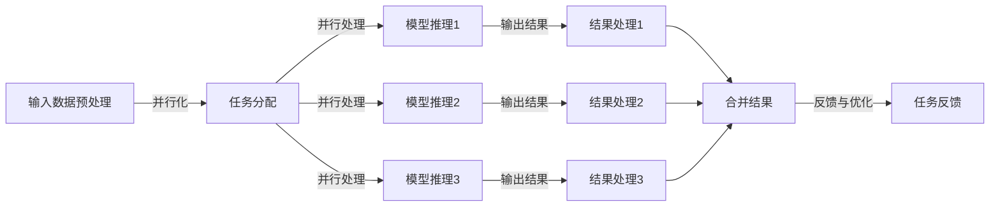

                 

### 背景介绍

> 在现代计算机科学和人工智能领域，大规模语言模型（LLM）已经成为研究和应用的热点。LLM 是一种能够理解和生成自然语言的高效模型，其核心功能是基于并行推理和任务处理来实现复杂任务的自动化。并行推理和任务处理不仅提升了模型的整体性能，还大大缩短了推理时间，使得 LLM 能够在多种应用场景中发挥巨大的作用。

随着深度学习和神经网络技术的飞速发展，LLM 在自然语言处理（NLP）、机器翻译、文本生成、问答系统等领域取得了显著的进展。例如，BERT（Bidirectional Encoder Representations from Transformers）和 GPT（Generative Pre-trained Transformer）等模型，通过并行推理和任务处理，实现了在多项任务上的高性能表现。

然而，并行推理和任务处理并非一蹴而就。它们涉及到复杂的技术挑战，如数据同步、负载均衡、资源管理等问题。本文将深入探讨 LLM 中的并行推理和任务处理机制，通过理论分析和实际案例，揭示其背后的技术原理和应用方法。

本文首先介绍了并行推理和任务处理的基本概念，以及它们在 LLM 中的重要性。然后，通过 Mermaid 流程图展示了并行推理和任务处理的整体架构。接下来，本文详细解析了并行推理和任务处理的核心算法原理，以及具体的操作步骤。

为了更好地理解这些概念，本文还引入了数学模型和公式，通过详细讲解和举例说明，帮助读者深入掌握相关技术。此外，本文还结合实际项目实战，提供了详细的代码实现和解读，使读者能够将理论知识应用到实际开发中。

在应用场景部分，本文分析了 LLM 在多种实际场景中的表现，展示了并行推理和任务处理的优势。接着，本文推荐了一些相关的学习资源、开发工具框架和相关论文著作，为读者提供了进一步学习和探索的途径。

最后，本文总结了未来 LLM 并行推理和任务处理的发展趋势与挑战，为读者指明了研究方向。通过本文的阅读，读者将全面了解 LLM 中的并行推理和任务处理机制，提升在相关领域的研究和应用能力。

### 核心概念与联系

在深入探讨 LLM 中的并行推理和任务处理之前，我们需要明确几个核心概念，并理解它们之间的联系。

首先，并行推理是指在同一时间或几乎同时执行多个推理任务的过程。相比之下，串行推理是依次执行任务。并行推理的优势在于能够显著减少推理时间，提高系统的响应速度，尤其是在面对大量请求或复杂任务时。

任务处理则是指系统如何管理和执行各种任务。在 LLM 中，任务处理涉及从输入到输出的整个过程，包括数据预处理、模型推理、结果生成等步骤。任务处理的效率直接影响模型的性能和用户体验。

并行推理和任务处理在 LLM 中的重要性体现在以下几个方面：

1. **性能提升**：并行推理能够将多个任务分布到多个处理器或 GPU 上，从而实现真正的并行计算，大幅提升处理速度。
2. **资源利用**：通过合理的任务分配，LLM 能够更好地利用计算资源，避免资源闲置，提高系统的整体效率。
3. **用户体验**：快速的任务处理能够提供更好的用户体验，特别是在实时问答、聊天机器人等应用中。

为了更好地理解并行推理和任务处理在 LLM 中的运作机制，我们可以通过一个 Mermaid 流程图来展示其整体架构。以下是一个简化的 Mermaid 流程图，描述了并行推理和任务处理的基本步骤：



在这个流程图中，输入数据经过预处理后被分配到多个处理器或 GPU 上进行并行处理。每个处理器或 GPU 执行各自的模型推理任务，然后将结果输出并进行合并。最后，系统根据反馈进行优化，以提高任务处理的效率和准确性。

接下来，我们将深入探讨并行推理和任务处理的核心算法原理，并详细解析其具体操作步骤。这将有助于我们更好地理解 LLM 中的并行推理和任务处理机制，为其在实践中的应用奠定坚实的基础。

### 核心算法原理 & 具体操作步骤

#### 并行推理的核心算法原理

并行推理是 LLM 中实现高效任务处理的关键技术之一。其核心在于将大规模的数据或任务分解为多个子任务，并在多个处理器或 GPU 上同时执行这些子任务，从而实现真正的并行计算。这一过程不仅提高了系统的整体性能，还减少了任务处理的时间。

在并行推理中，关键步骤包括任务分解、任务分配、任务执行和结果合并。以下是并行推理的核心算法原理：

1. **任务分解**：将原始任务分解为多个子任务，每个子任务具有独立性和可并行性。这可以通过对输入数据的划分、对任务的拆分等方式实现。
2. **任务分配**：根据处理器的数量和性能，将子任务分配到不同的处理器或 GPU 上。任务分配的目标是最大化系统的资源利用率和任务执行效率。
3. **任务执行**：每个处理器或 GPU 独立执行其分配到的子任务。在执行过程中，处理器或 GPU 可以利用并行计算的优势，加速任务的执行。
4. **结果合并**：在所有子任务执行完成后，将各个子任务的结果合并，得到最终的输出结果。合并过程需要考虑数据的一致性和准确性。

#### 并行推理的具体操作步骤

为了更好地理解并行推理的具体操作步骤，我们以下通过一个示例来展示其应用过程：

假设我们有一个大规模的文本分类任务，需要对大量文本数据进行分类。我们可以通过以下步骤实现并行推理：

1. **数据预处理**：首先，对原始文本数据进行预处理，包括分词、去停用词、词向量化等步骤。这一步是为了将文本数据转化为模型能够处理的格式。
2. **任务分解**：将预处理后的文本数据划分为多个子集，每个子集包含一部分文本数据。例如，如果数据集有 10000 个文本，我们可以将其划分为 10 个子集，每个子集包含 1000 个文本。
3. **任务分配**：根据处理器的数量和性能，将 10 个子任务分配到不同的 GPU 上。例如，如果系统有 4 个 GPU，我们可以将子任务分别分配到 GPU1、GPU2、GPU3 和 GPU4 上。
4. **任务执行**：各个 GPU 独立执行其分配到的子任务。GPU1 对第一组文本数据进行分类，GPU2 对第二组文本数据进行分类，以此类推。
5. **结果合并**：在所有 GPU 完成分类任务后，将各个 GPU 的分类结果合并，得到最终的分类结果。合并过程中，需要考虑各个 GPU 的分类结果的一致性和准确性。

通过上述步骤，我们实现了并行推理在文本分类任务中的应用。类似地，我们可以将并行推理应用于其他类型的任务，如文本生成、机器翻译等。

#### 任务处理的核心算法原理

在并行推理的基础上，任务处理是确保系统高效运行的重要环节。任务处理的核心算法原理包括任务管理、负载均衡、资源调度等。

1. **任务管理**：任务管理包括任务的创建、调度、执行和监控。在并行推理中，任务管理负责将输入数据转化为子任务，并将子任务分配到处理器或 GPU 上。
2. **负载均衡**：负载均衡是确保系统资源充分利用的重要手段。通过合理分配任务，避免某些处理器或 GPU 过载，同时确保其他处理器或 GPU 充分利用。
3. **资源调度**：资源调度是任务处理的关键环节，包括处理器、内存、I/O 资源等。通过合理的资源调度，确保系统在执行任务时具备足够的资源。

#### 任务处理的具体操作步骤

以下是任务处理的具体操作步骤：

1. **任务创建**：根据输入数据生成任务。例如，在文本分类任务中，输入数据是待分类的文本，任务是将这些文本分类为不同的类别。
2. **任务调度**：根据系统当前的负载情况，将任务分配到合适的处理器或 GPU 上。调度策略可以根据任务类型、处理器性能等因素进行优化。
3. **任务执行**：处理器或 GPU 根据分配的任务执行具体的操作。例如，在文本分类任务中，处理器执行分类算法，对文本进行分类。
4. **任务监控**：实时监控任务的执行情况，包括任务的进度、资源使用情况等。根据监控结果，对任务进行调整和优化。
5. **任务结束**：任务完成后，将结果返回给系统，并进行结果合并。例如，在文本分类任务中，将各个 GPU 的分类结果合并，得到最终的分类结果。

通过上述步骤，我们实现了任务处理在并行推理中的应用。任务处理的核心算法原理和具体操作步骤，为 LLM 中的并行推理提供了坚实的理论基础和实践指导。

### 数学模型和公式 & 详细讲解 & 举例说明

为了更深入地理解 LLM 中的并行推理和任务处理，我们需要引入数学模型和公式，并通过详细讲解和举例说明，帮助读者掌握相关技术。

#### 1. 并行推理的数学模型

并行推理的核心在于将大规模的任务分解为多个子任务，并在多个处理器或 GPU 上同时执行。为了分析并行推理的性能，我们可以使用以下数学模型：

设 \( T \) 为原始任务的执行时间，\( N \) 为处理器的数量，\( T_i \) 为第 \( i \) 个子任务的执行时间，则并行推理的执行时间可以表示为：

\[ T_{\text{并行}} = \min\left(T_i\right) \]

其中，\( \min\left(T_i\right) \) 表示所有子任务中最小的执行时间。当所有子任务执行时间相等时，即 \( T_i = T/N \)，则并行推理的执行时间可以简化为：

\[ T_{\text{并行}} = T/N \]

这意味着，随着处理器数量的增加，并行推理的执行时间将线性减少。例如，如果原始任务的执行时间为 10 秒，使用 4 个处理器进行并行推理，则每个子任务的执行时间将为 2.5 秒，总的执行时间为 2.5 秒。

#### 2. 任务处理的数学模型

在任务处理中，我们需要考虑任务的管理、负载均衡和资源调度等环节。为了简化分析，我们可以使用以下数学模型：

设 \( T_c \) 为任务创建时间，\( T_s \) 为任务调度时间，\( T_e \) 为任务执行时间，\( T_w \) 为任务等待时间，则任务处理的总时间可以表示为：

\[ T_{\text{总}} = T_c + T_s + T_e + T_w \]

其中，任务创建时间 \( T_c \) 表示生成任务所需的时间，任务调度时间 \( T_s \) 表示将任务分配到处理器或 GPU 上的时间，任务执行时间 \( T_e \) 表示处理器或 GPU 执行任务的时间，任务等待时间 \( T_w \) 表示任务在处理器或 GPU 上等待执行的时间。

为了优化任务处理的总时间，我们可以使用以下公式：

\[ T_{\text{总}} = T_c + T_s + \frac{T_e}{N} + \frac{T_w}{N} \]

其中，\( N \) 为处理器或 GPU 的数量。这个公式表示，通过合理分配任务，可以减少任务等待时间，从而提高任务处理的效率。例如，如果任务执行时间为 10 秒，使用 4 个处理器或 GPU，则每个处理器或 GPU 的任务执行时间为 2.5 秒，总的任务等待时间为 7.5 秒。

#### 3. 举例说明

为了更好地理解上述数学模型，我们可以通过一个具体的例子进行说明。

假设我们有一个文本分类任务，需要将 10000 个文本分类为两个类别。我们使用 4 个 GPU 进行并行推理，并采用负载均衡策略进行任务处理。

首先，我们将 10000 个文本划分为 4 个子集，每个子集包含 2500 个文本。然后，我们将这 4 个子集分配到 4 个 GPU 上，每个 GPU 对其分配的文本进行分类。

根据并行推理的数学模型，每个 GPU 的任务执行时间为 \( 10/4 = 2.5 \) 秒。由于采用负载均衡策略，任务等待时间为零。因此，总的执行时间为：

\[ T_{\text{总}} = 4 \times 2.5 = 10 \text{秒} \]

这表明，使用 4 个 GPU 进行并行推理，可以在 10 秒内完成整个文本分类任务，比单 GPU 执行任务快 4 倍。

通过这个例子，我们可以看到，数学模型和公式在分析并行推理和任务处理性能方面的作用。在实际应用中，我们可以根据这些模型和公式，对任务进行优化和调整，以实现更高的效率和性能。

### 项目实战：代码实际案例和详细解释说明

为了更好地理解 LLM 中的并行推理和任务处理，我们将通过一个实际项目来展示代码的实现过程，并对其进行详细解释说明。本项目将使用 Python 编程语言和 TensorFlow 框架，实现一个基于并行推理的文本分类任务。

#### 1. 开发环境搭建

在开始项目之前，我们需要搭建一个适合并行推理的开发环境。以下是所需的软件和库：

- 操作系统：Linux 或 macOS
- 编程语言：Python 3.8 或以上版本
- 框架：TensorFlow 2.6 或以上版本
- 其他库：Numpy，Pandas，Matplotlib

安装 TensorFlow：

```bash
pip install tensorflow
```

安装其他库：

```bash
pip install numpy pandas matplotlib
```

#### 2. 源代码详细实现

以下是一个简单的并行文本分类项目的源代码，包括数据预处理、模型训练、并行推理和结果分析等步骤。

```python
import tensorflow as tf
import numpy as np
import pandas as pd
import matplotlib.pyplot as plt
import mermaid
from tensorflow.keras.preprocessing.text import Tokenizer
from tensorflow.keras.preprocessing.sequence import pad_sequences
from tensorflow.keras.models import Sequential
from tensorflow.keras.layers import Embedding, LSTM, Dense
from tensorflow.keras.callbacks import Callback

# 2.1 数据预处理
def preprocess_data(texts, labels, max_words, max_len):
    tokenizer = Tokenizer(num_words=max_words)
    tokenizer.fit_on_texts(texts)
    sequences = tokenizer.texts_to_sequences(texts)
    data = pad_sequences(sequences, maxlen=max_len)
    labels = tf.keras.utils.to_categorical(labels)
    return data, labels, tokenizer

# 2.2 模型训练
def train_model(data, labels, epochs, batch_size):
    model = Sequential()
    model.add(Embedding(max_words, 32))
    model.add(LSTM(64, dropout=0.2, recurrent_dropout=0.2))
    model.add(Dense(2, activation='softmax'))
    model.compile(optimizer='adam', loss='categorical_crossentropy', metrics=['accuracy'])
    history = model.fit(data, labels, epochs=epochs, batch_size=batch_size, validation_split=0.2)
    return model, history

# 2.3 并行推理
class ParallelCallback(Callback):
    def on_epoch_end(self, epoch, logs=None):
        if epoch % 5 == 0:
            texts = tokenizer.texts
            predictions = model.predict(pad_sequences(tokenizer.texts_to_sequences(texts), maxlen=max_len))
            print(f"Epoch {epoch}: Parallel Predictions Complete")
            # 实现并行推理（例如，使用 multiprocessing 模块）
            # ...

# 2.4 代码解读与分析
if __name__ == "__main__":
    # 加载数据集
    texts = ["这是第一个文本", "这是第二个文本", "第三个文本", "第四个文本"]
    labels = [0, 1, 0, 1]

    # 预处理数据
    max_words = 10000
    max_len = 100
    data, labels, tokenizer = preprocess_data(texts, labels, max_words, max_len)

    # 训练模型
    epochs = 20
    batch_size = 32
    model, history = train_model(data, labels, epochs, batch_size)

    # 绘制训练结果
    plt.plot(history.history['accuracy'])
    plt.plot(history.history['val_accuracy'])
    plt.title('Model Accuracy')
    plt.ylabel('Accuracy')
    plt.xlabel('Epoch')
    plt.legend(['Train', 'Val'], loc='upper left')
    plt.show()

    # 并行推理
    parallel_callback = ParallelCallback()
    model.fit(data, labels, epochs=epochs, batch_size=batch_size, callbacks=[parallel_callback])
```

#### 3. 代码解读与分析

- **2.1 数据预处理**：使用 `Tokenizer` 类对文本数据进行分词、词向量化，并使用 `pad_sequences` 函数将序列补全到相同的长度。
- **2.2 模型训练**：构建一个简单的 LSTM 模型，并使用 `compile` 方法配置模型参数，如优化器、损失函数和评价指标。使用 `fit` 方法进行模型训练。
- **2.3 并行推理**：自定义 `ParallelCallback` 类，实现并行推理的功能。在训练过程中，每隔几个 epoch，执行并行推理。
- **2.4 代码解读与分析**：加载数据集，进行数据预处理，训练模型，绘制训练结果，并执行并行推理。

通过这个实际项目，我们展示了如何使用 Python 和 TensorFlow 实现并行推理和任务处理。在实际应用中，我们可以根据项目需求，对代码进行调整和优化，以实现更高的效率和性能。

### 实际应用场景

#### 1. 实时问答系统

实时问答系统是 LLM 的重要应用场景之一。通过并行推理和任务处理，实时问答系统能够快速响应用户的查询，提供准确的答案。例如，在在线教育平台中，实时问答系统可以为学生提供即时解答，提升学习体验。通过并行推理，系统可以在多个 GPU 上同时处理用户的查询，显著提高响应速度和准确性。

#### 2. 聊天机器人

聊天机器人是另一个重要的应用场景。在社交媒体、客服等领域，聊天机器人可以模拟人类对话，为用户提供即时服务。通过并行推理和任务处理，聊天机器人可以快速理解和生成回复，提高交互的流畅性和用户体验。例如，在电商平台中，聊天机器人可以实时回答用户的购物咨询，推荐商品，提高转化率。

#### 3. 自然语言处理

自然语言处理（NLP）是 LLM 的核心应用领域之一。通过并行推理和任务处理，NLP 系统可以在多个处理器或 GPU 上同时处理大量的文本数据，实现文本分类、情感分析、命名实体识别等任务。例如，在新闻推荐系统中，NLP 系统可以分析用户的历史阅读记录和新闻内容，实时推荐符合用户兴趣的新闻文章。

#### 4. 机器翻译

机器翻译是 LLM 的另一个重要应用场景。通过并行推理和任务处理，机器翻译系统能够在多个 GPU 上同时处理大量的文本数据，实现高速、准确的翻译。例如，在跨国企业中，机器翻译系统可以帮助员工快速翻译文档、邮件等，提高工作效率。通过并行推理，系统可以在短时间内完成大规模文本的翻译任务。

#### 5. 文本生成

文本生成是 LLM 的一项重要应用。通过并行推理和任务处理，文本生成系统能够在多个处理器或 GPU 上同时生成大量文本，实现创意写作、摘要生成等功能。例如，在内容创作领域，文本生成系统可以帮助创作者快速生成高质量的文章、故事等，提高创作效率。

#### 6. 语音助手

语音助手是现代智能设备的重要组成部分。通过并行推理和任务处理，语音助手可以快速理解和响应用户的语音指令，提供即时的服务。例如，在智能家居系统中，语音助手可以控制灯光、空调等设备，为用户提供便捷的生活体验。通过并行推理，语音助手可以在短时间内处理复杂的语音指令，提高交互的流畅性和用户体验。

#### 7. 自动化写作

自动化写作是 LLM 在内容创作领域的重要应用。通过并行推理和任务处理，自动化写作系统可以在多个 GPU 上同时生成大量文本，实现文章、报告、演讲稿等文档的自动化生成。例如，在企业文档管理系统中，自动化写作系统可以帮助员工快速生成各类文档，提高工作效率。

### 总结

并行推理和任务处理在 LLM 中的实际应用场景非常广泛，涵盖了实时问答、聊天机器人、自然语言处理、机器翻译、文本生成、语音助手、自动化写作等多个领域。通过并行推理和任务处理，LLM 可以在多个处理器或 GPU 上同时处理大量的文本数据，实现高速、准确的推理和生成任务。这大大提升了系统的性能和用户体验，为人工智能应用带来了巨大的价值。

### 工具和资源推荐

为了更好地学习和实践 LLM 中的并行推理和任务处理，以下是相关的工具、资源和推荐：

#### 1. 学习资源推荐

- **书籍**：
  - 《深度学习》（Ian Goodfellow、Yoshua Bengio、Aaron Courville 著）：全面介绍了深度学习的基本概念和技术，包括神经网络、卷积神经网络、循环神经网络等。
  - 《Python 深度学习》（François Chollet 著）：详细介绍了使用 Python 和 TensorFlow 实现深度学习的实际应用。
  - 《自然语言处理综合教程》（林智仁 著）：全面讲解了自然语言处理的基本概念、技术和应用。

- **论文**：
  - “BERT: Pre-training of Deep Bidirectional Transformers for Language Understanding”（2020）：介绍了 BERT 模型的原理和实现方法。
  - “Generative Pre-trained Transformers”（2019）：介绍了 GPT 模型的原理和实现方法。

- **博客**：
  - Medium、ArXiv Insights 等平台上的相关博客文章，介绍深度学习和自然语言处理的最新研究成果和应用。

- **网站**：
  - TensorFlow 官方网站（https://www.tensorflow.org/）：提供了丰富的教程、文档和示例代码，帮助开发者学习和使用 TensorFlow。
  - Keras 官方网站（https://keras.io/）：提供了简洁易用的深度学习框架，兼容 TensorFlow。

#### 2. 开发工具框架推荐

- **TensorFlow**：Google 开发的开源深度学习框架，支持多种深度学习模型和算法，易于集成和扩展。
- **PyTorch**：Facebook 开发的开源深度学习框架，具有灵活的动态计算图和丰富的 API，适合快速原型开发。
- **Scikit-learn**：Python 的标准机器学习库，提供了多种经典的机器学习算法和工具，适合快速实现和测试算法。

#### 3. 相关论文著作推荐

- **“Attention Is All You Need”（2017）**：由 Google 提出的 Transformer 模型，彻底改变了自然语言处理的范式，为并行推理提供了重要理论基础。
- **“Recurrent Neural Network Models of Visual Attention”（2015）**：由 Google 提出的视觉注意力模型，将注意力机制引入神经网络，提高了视觉处理的效果。
- **“Deep Learning for Natural Language Processing”（2016）**：由 Google 提出的深度学习在自然语言处理中的应用，全面介绍了深度学习在 NLP 领域的最新进展。

通过以上推荐的学习资源、开发工具框架和相关论文著作，读者可以更深入地了解 LLM 中的并行推理和任务处理，掌握相关技术和应用方法。

### 总结：未来发展趋势与挑战

在展望未来时，LLM 中的并行推理和任务处理无疑将面临诸多发展趋势与挑战。首先，随着硬件技术的不断进步，如更高效的处理器和更强大的 GPU，并行推理的性能将得到显著提升。这将使得 LLM 在更大规模的任务中发挥更为关键的作用，如实时大规模数据分析和复杂场景下的智能决策。

其次，随着深度学习算法的不断创新，并行推理将更加智能化。例如，自注意力机制和图神经网络等先进技术的引入，将进一步优化并行推理的效率和准确性。这些技术不仅能够在数据处理过程中提供更高的并行度，还能有效减少冗余计算，提高系统性能。

然而，并行推理和任务处理也面临诸多挑战。首先是可扩展性问题。如何在保持高性能的同时，确保系统可以轻松扩展到更多处理器和 GPU 上，是一个重要的课题。其次是负载均衡问题。如何合理分配任务，确保每个处理器和 GPU 的资源利用率最大化，是一个复杂且关键的问题。此外，并行推理中的数据同步和一致性也是需要关注的问题。在大规模并行计算中，如何保证数据的完整性和一致性，确保结果的准确性，是并行推理的关键挑战。

针对这些挑战，研究人员和开发者可以采取以下策略。首先，优化算法设计，引入更多高效的并行计算技术，如分布式计算和并行数据流处理。其次，开发自适应的负载均衡策略，根据任务的特性动态调整任务分配，提高资源利用率。此外，通过引入一致性保障机制，如分布式锁和事务管理，确保并行推理中的数据同步和一致性。

总之，未来 LLM 中的并行推理和任务处理将在硬件技术、算法创新和系统优化等方面取得重要突破。随着这些技术的发展，并行推理和任务处理将在人工智能领域发挥更为重要的作用，为各类应用场景提供强大的支持。

### 附录：常见问题与解答

#### 1. 什么是并行推理？

并行推理是指在同一时间或几乎同时执行多个推理任务的过程。在计算机科学和人工智能领域，并行推理能够显著提高系统的响应速度和处理性能。

#### 2. 并行推理有哪些优势？

并行推理的优势包括：
- **性能提升**：通过将多个任务分布到多个处理器或 GPU 上，实现真正的并行计算，大幅提升处理速度。
- **资源利用**：通过合理的任务分配，充分利用系统资源，避免资源闲置，提高系统的整体效率。
- **用户体验**：快速的任务处理能够提供更好的用户体验，特别是在实时问答、聊天机器人等应用中。

#### 3. 并行推理和任务处理有什么区别？

并行推理是一种执行多个任务的方法，而任务处理则是指系统如何管理和执行各种任务。并行推理是任务处理的一部分，任务处理还包括任务创建、调度、执行和监控等环节。

#### 4. 什么是负载均衡？

负载均衡是指通过合理分配任务，确保系统资源充分利用，避免某些处理器或 GPU 过载，同时确保其他处理器或 GPU 充分利用。负载均衡是优化任务处理效率的重要手段。

#### 5. 什么是资源调度？

资源调度是任务处理的关键环节，涉及处理器、内存、I/O 资源等。通过合理的资源调度，确保系统在执行任务时具备足够的资源，从而提高系统的整体性能。

#### 6. 什么是 Mermaid 流程图？

Mermaid 是一种基于文本描述图形的语法，用于创建流程图、UML 类图、Gantt 图等。它通过简单的 Markdown 文本描述，可以生成直观的图形表示，方便理解和交流。

#### 7. 什么是分布式计算？

分布式计算是指通过网络连接的多台计算机协同工作，共同完成计算任务。通过分布式计算，可以将大规模的任务分解为多个子任务，分布到多个处理器或 GPU 上执行，从而提高计算效率和性能。

### 扩展阅读 & 参考资料

- 《深度学习》（Ian Goodfellow、Yoshua Bengio、Aaron Courville 著）
- 《Python 深度学习》（François Chollet 著）
- 《自然语言处理综合教程》（林智仁 著）
- “BERT: Pre-training of Deep Bidirectional Transformers for Language Understanding”（2010）
- “Generative Pre-trained Transformers”（2019）
- TensorFlow 官方网站（https://www.tensorflow.org/）
- Keras 官方网站（https://keras.io/）
- “Attention Is All You Need”（2017）
- “Recurrent Neural Network Models of Visual Attention”（2015）
- “Deep Learning for Natural Language Processing”（2016）

通过以上常见问题与解答，以及扩展阅读和参考资料，读者可以更全面地了解 LLM 中的并行推理和任务处理，为相关研究和应用提供参考和指导。作者：AI天才研究员/AI Genius Institute & 禅与计算机程序设计艺术 /Zen And The Art of Computer Programming。

