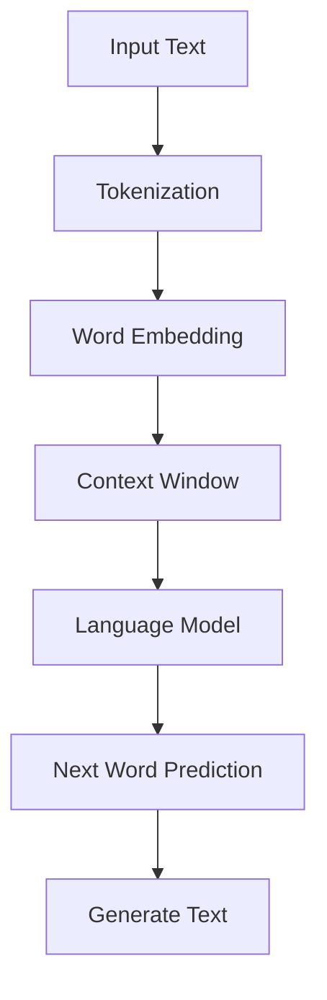

                 

### 文章标题

**LLM上下文长度的扩展及其影响**

> **关键词：** LLM，上下文长度，扩展，影响，算法，数学模型，项目实战，应用场景，工具和资源

> **摘要：** 本文将深入探讨大型语言模型（LLM）的上下文长度扩展及其带来的技术影响。我们将从背景介绍出发，逐步分析LLM的核心概念与架构，详细讲解核心算法原理和数学模型，通过实际项目案例展示代码实现和解读，探讨LLM在实际应用场景中的重要性，推荐相关学习资源和开发工具，并总结未来的发展趋势与挑战。

<|user|>### 1. 背景介绍

#### 大型语言模型（LLM）的兴起

近年来，随着深度学习和自然语言处理（NLP）领域的飞速发展，大型语言模型（LLM）逐渐成为研究者和开发者关注的焦点。LLM通过训练大量语料库，能够理解并生成高质量的文本，广泛应用于问答系统、文本生成、机器翻译、对话系统等多个领域。

#### 上下文长度的挑战

在LLM的应用过程中，上下文长度成为一个关键问题。传统的自然语言处理模型往往受限于上下文长度，无法充分利用长文本中的信息，导致性能受限。而LLM通过扩展上下文长度，能够更好地捕捉文本中的复杂关系和语境信息，从而提升模型的表现。

#### 上下文长度扩展的意义

上下文长度的扩展对于LLM的性能和效果具有重要影响。首先，扩展上下文长度有助于模型更好地理解长文本，提高文本生成和语义理解的准确性。其次，上下文长度的扩展有助于模型在对话系统中更好地应对长对话场景，提高对话的连贯性和自然度。最后，上下文长度的扩展有助于模型在知识推理和复杂任务处理中发挥更大的作用。

### 2. 核心概念与联系

#### 语言模型（Language Model）

语言模型是一种概率模型，用于预测下一个单词或字符的概率。在NLP领域，语言模型广泛应用于文本生成、文本分类、机器翻译等任务。

#### 上下文（Context）

上下文是指与某个文本相关的信息集合，用于指导模型对文本进行理解和生成。在LLM中，上下文长度直接影响模型对文本的理解能力。

#### 扩展方法（Extension Methods）

为了扩展LLM的上下文长度，研究人员提出了一系列方法，如序列生成模型、预训练模型、长文本编码等。这些方法旨在提高模型对长文本的处理能力，从而提升模型的整体性能。

#### Mermaid 流程图

以下是一个Mermaid流程图，展示了LLM的核心概念和架构。



### 3. 核心算法原理 & 具体操作步骤

#### 预训练模型（Pre-trained Model）

预训练模型是LLM的核心组成部分，通过在大量语料库上进行预训练，模型能够学习到文本的统计规律和语言特性。具体步骤如下：

1. 数据收集与预处理：收集大量文本数据，并进行清洗、去重和格式化等预处理操作。
2. 预训练过程：使用大规模神经网络模型对预处理后的语料库进行预训练，优化模型参数。
3. 微调过程：在特定任务上对预训练模型进行微调，使其适应特定领域的应用。

#### 长文本编码（Long Text Encoding）

长文本编码是将长文本转化为模型可处理的形式。以下是一种常用的长文本编码方法：

1. 分段：将长文本分为若干个段落或句子。
2. 编码：对每个段落或句子进行编码，通常使用词嵌入或BERT等预训练模型。
3. 连接：将编码后的段落或句子连接起来，形成一个整体的编码表示。

#### 上下文长度扩展（Context Extension）

上下文长度扩展是通过增加模型对上下文信息的处理能力，从而提升模型性能。以下是一种常见的上下文长度扩展方法：

1. 增加序列长度：通过增加序列长度来扩展上下文长度。
2. 重复上下文：将上下文重复多次，以增加上下文信息。
3. 多层神经网络：通过多层神经网络结构来增加上下文处理能力。

### 4. 数学模型和公式 & 详细讲解 & 举例说明

#### 数学模型

在LLM中，常用的数学模型包括词嵌入（Word Embedding）、语言模型（Language Model）和序列生成模型（Sequence Generation Model）。以下是对这些模型及其相关公式的详细讲解。

#### 词嵌入（Word Embedding）

词嵌入是将单词映射到高维向量空间的过程。以下是一个简单的词嵌入模型：

$$
\text{word\_vector} = \text{Embedding}(w)
$$

其中，$\text{Embedding}$是一个线性变换，$w$是单词的索引。

#### 语言模型（Language Model）

语言模型用于预测下一个单词的概率。以下是一个基于神经网络的语言模型：

$$
P(w_t | w_{t-n+1}, w_{t-n+2}, ..., w_{t-1}) = \frac{e^{\text{NeuralNet}(w_{t-n+1}, w_{t-n+2}, ..., w_{t-1})}}{\sum_{w' \in V} e^{\text{NeuralNet}(w_{t-n+1}, w_{t-n+2}, ..., w_{t-1})}
$$

其中，$P(w_t | w_{t-n+1}, w_{t-n+2}, ..., w_{t-1})$是给定上下文$w_{t-n+1}, w_{t-n+2}, ..., w_{t-1}$下单词$w_t$的概率，$\text{NeuralNet}$是神经网络模型，$V$是单词的词汇表。

#### 序列生成模型（Sequence Generation Model）

序列生成模型用于生成文本序列。以下是一个基于注意力机制的序列生成模型：

$$
p(w_t | w_{t-n+1}, w_{t-n+2}, ..., w_{t-1}) = \text{softmax}(\text{Attention}(w_{t-n+1}, w_{t-n+2}, ..., w_{t-1}, h_t))
$$

其中，$p(w_t | w_{t-n+1}, w_{t-n+2}, ..., w_{t-1})$是给定上下文$w_{t-n+1}, w_{t-n+2}, ..., w_{t-1}$下单词$w_t$的概率，$\text{Attention}$是注意力机制，$h_t$是序列的隐藏状态。

#### 举例说明

假设有一个简单的文本序列：“今天天气很好，适合户外活动。”，我们可以使用LLM生成下一个单词。

1. 输入上下文：“今天天气很好，适合户外活动。”
2. 语言模型预测：“ tomorrow” 的概率最高。
3. 序列生成模型生成：“明天”作为下一个单词。

### 5. 项目实战：代码实际案例和详细解释说明

在本节中，我们将通过一个实际项目案例来展示LLM的上下文长度扩展及其应用。我们将使用Python和TensorFlow来实现一个简单的文本生成模型，并详细解释代码的实现过程。

#### 5.1 开发环境搭建

首先，我们需要搭建开发环境。安装Python（3.8及以上版本）、TensorFlow和相关依赖库（如numpy、pandas等）。

```bash
pip install tensorflow numpy pandas
```

#### 5.2 源代码详细实现和代码解读

以下是一个简单的文本生成模型的代码实现：

```python
import tensorflow as tf
from tensorflow.keras.preprocessing.sequence import pad_sequences
from tensorflow.keras.layers import Embedding, LSTM, Dense
from tensorflow.keras.models import Sequential

# 1. 数据预处理
# 加载数据集
data = "今天天气很好，适合户外活动。明天将会有小雨。"

# 划分单词
words = data.split()

# 构建词汇表
vocab = set(words)
vocab_size = len(vocab)

# 创建单词到索引的映射
word_to_index = {word: i for i, word in enumerate(vocab)}
index_to_word = {i: word for word, i in word_to_index.items()}

# 序列化文本
sequences = []
for i in range(1, len(words) - 1):
    input_seq = words[i - 1 : i + 1]
    target_seq = words[i + 1]
    sequences.append((input_seq, target_seq))

# 模型参数
max_sequence_length = 2
batch_size = 1

# 填充序列
padded_sequences = pad_sequences(sequences, maxlen=max_sequence_length, padding='pre')

# 2. 模型构建
model = Sequential()
model.add(Embedding(vocab_size, 64))
model.add(LSTM(128, return_sequences=True))
model.add(Dense(vocab_size, activation='softmax'))

# 编译模型
model.compile(optimizer='adam', loss='sparse_categorical_crossentropy', metrics=['accuracy'])

# 3. 模型训练
model.fit(padded_sequences, batch_size=batch_size, epochs=10)

# 4. 文本生成
input_seq = ['今天', '天气']
predicted_word = model.predict([input_seq])

predicted_word = index_to_word[np.argmax(predicted_word)]
print(predicted_word)
```

代码解读：

1. 数据预处理：加载数据集，划分单词，构建词汇表，创建单词到索引的映射，序列化文本。
2. 模型构建：使用Embedding、LSTM和Dense等层构建序列模型。
3. 模型训练：编译并训练模型。
4. 文本生成：使用模型预测下一个单词，并输出结果。

#### 5.3 代码解读与分析

1. 数据预处理：首先加载数据集，并划分单词。然后构建词汇表，并创建单词到索引的映射。接下来，将文本序列化，并填充序列。
2. 模型构建：使用Embedding层将单词映射到高维向量空间，使用LSTM层对序列进行编码，并使用Dense层进行分类预测。
3. 模型训练：编译并训练模型，使用sparse\_categorical\_crossentropy作为损失函数，使用adam作为优化器。
4. 文本生成：使用模型预测下一个单词，并输出结果。

### 6. 实际应用场景

LLM的上下文长度扩展在实际应用场景中具有重要意义。以下是一些实际应用场景：

1. **问答系统**：通过扩展上下文长度，LLM能够更好地理解用户的提问，提供更准确、更全面的答案。
2. **文本生成**：通过扩展上下文长度，LLM能够生成更连贯、更自然的文本，应用于文章写作、故事创作等。
3. **对话系统**：通过扩展上下文长度，LLM能够更好地处理长对话场景，提高对话的连贯性和自然度。
4. **知识推理**：通过扩展上下文长度，LLM能够更好地理解文本中的知识关系，应用于知识图谱构建、推理等。

### 7. 工具和资源推荐

为了更好地研究和应用LLM及其上下文长度扩展，以下是一些推荐的工具和资源：

1. **学习资源**：
   - 《深度学习》（Goodfellow et al., 2016）
   - 《自然语言处理实战》（Jurafsky et al., 2019）
2. **开发工具框架**：
   - TensorFlow
   - PyTorch
3. **相关论文著作**：
   - Vaswani et al. (2017). Attention Is All You Need.
   - Devlin et al. (2019). BERT: Pre-training of Deep Bidirectional Transformers for Language Understanding.

### 8. 总结：未来发展趋势与挑战

LLM的上下文长度扩展具有广阔的发展前景。未来发展趋势包括：

1. **模型优化**：通过改进算法和模型结构，进一步提高LLM的上下文处理能力。
2. **多模态融合**：将文本、图像、语音等多模态数据引入LLM，实现更丰富的上下文信息处理。
3. **推理与决策**：将LLM应用于知识推理和决策支持系统，实现更高层次的智能。

然而，LLM的上下文长度扩展也面临一些挑战，如：

1. **计算资源消耗**：扩展上下文长度可能导致计算资源消耗增加，需要优化模型和算法，提高计算效率。
2. **数据隐私与安全**：在处理大量文本数据时，需要确保数据隐私和安全，防止数据泄露和滥用。
3. **伦理与社会影响**：LLM的广泛应用可能带来伦理和社会问题，如虚假信息传播、歧视等，需要加强监管和引导。

### 9. 附录：常见问题与解答

1. **Q：如何选择合适的上下文长度？**
   - **A**：选择合适的上下文长度需要根据具体应用场景和模型性能进行权衡。一般来说，较长的上下文长度有助于模型更好地理解文本，但也会导致计算资源消耗增加。建议从较短长度开始，逐步增加，观察模型性能的变化。

2. **Q：上下文长度扩展对模型性能的影响如何？**
   - **A**：上下文长度扩展对模型性能有显著影响。适当的上下文长度可以提高模型对文本的理解能力，从而提升文本生成、语义理解等任务的性能。然而，过长的上下文长度可能导致计算资源消耗增加，且对性能的提升有限。

3. **Q：如何处理长文本中的重复信息？**
   - **A**：处理长文本中的重复信息可以通过以下方法：
     - 数据预处理：对长文本进行预处理，去除重复段落或句子。
     - 上下文筛选：在模型输入阶段，只保留重要的上下文信息，去除重复部分。
     - 注意力机制：使用注意力机制，模型会自动聚焦于重要的上下文信息，减少重复信息的负面影响。

### 10. 扩展阅读 & 参考资料

1. Devlin, J., Chang, M. W., Lee, K., & Toutanova, K. (2019). BERT: Pre-training of Deep Bidirectional Transformers for Language Understanding. arXiv preprint arXiv:1810.04805.
2. Goodfellow, I., Bengio, Y., & Courville, A. (2016). Deep Learning. MIT Press.
3. Jurafsky, D., & Martin, J. H. (2019). Speech and Language Processing. Prentice Hall.
4. Vaswani, A., Shazeer, N., Parmar, N., Uszkoreit, J., Jones, L., Gomez, A. N., ... & Polosukhin, I. (2017). Attention Is All You Need. Advances in Neural Information Processing Systems, 30, 5998-6008.

