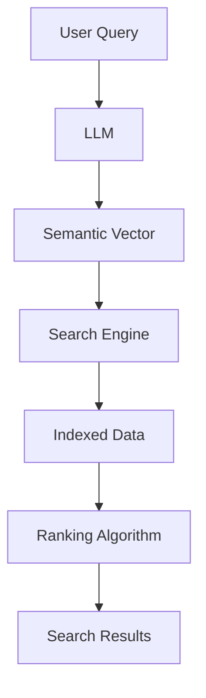
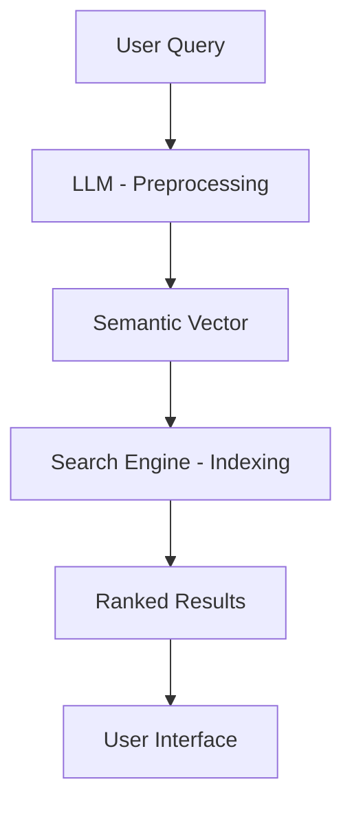

                 

### 背景介绍

#### 1.1 人工智能的发展与应用

人工智能（AI）作为计算机科学的一个重要分支，起源于20世纪50年代，旨在使计算机具备人类智能，解决复杂问题。近年来，随着计算能力的提升、数据量的爆发性增长以及深度学习算法的突破，人工智能在各个领域取得了显著的进展，如自然语言处理（NLP）、计算机视觉、自动驾驶等。

在自然语言处理领域，人工智能技术使得机器可以理解和生成人类语言，大大提升了信息检索、机器翻译、智能客服等应用的效果。而在计算机视觉领域，人工智能技术已经可以识别和分类各种图像，实现人脸识别、物体检测等任务。自动驾驶技术则依赖于计算机视觉和自然语言处理技术，使得自动驾驶汽车能够安全、高效地行驶。

#### 1.2 搜索引擎技术的发展

搜索引擎技术是互联网时代的一个重要创新，它通过算法对海量信息进行索引和排序，使用户能够快速找到所需信息。传统的搜索引擎技术主要依赖于关键词匹配、PageRank算法等，通过分析网页的内容、链接关系等来评估网页的重要性和相关性。

随着互联网的快速发展，信息的爆炸性增长对搜索引擎技术提出了更高的要求。传统的搜索引擎技术存在一些局限性，如对长尾关键词的检索效果不佳、对上下文理解的不足等。因此，近年来，搜索引擎技术也在不断发展和演进，如融入语义分析、实体识别等技术，以提升检索的准确性和用户体验。

#### 1.3 LLM与传统搜索引擎技术的结合

预训练语言模型（LLM，Large Language Model）是近年来人工智能领域的重要突破，如GPT、BERT等模型通过在大量文本数据上进行预训练，具备了强大的语言理解和生成能力。LLM在自然语言处理领域展现了出色的性能，但其应用范围并不仅限于NLP任务。

将LLM与传统搜索引擎技术相结合，可以充分发挥LLM在理解、生成、推理等方面的优势，实现智能检索新模式。LLM可以深入理解用户的查询意图，提供更加精准的搜索结果，而传统搜索引擎则可以负责索引和排序海量数据，两者结合有望解决当前搜索引擎技术面临的诸多挑战。

### 1.4 本文目的

本文旨在探讨LLM与传统搜索引擎技术的结合，分析其核心概念、算法原理、数学模型等，通过实际项目案例和代码解读，展示智能检索新模式的应用效果。同时，本文还将探讨LLM在搜索引擎领域的实际应用场景，介绍相关工具和资源，展望未来发展趋势与挑战。

---

## Background Introduction

#### 1.1 The Development and Application of Artificial Intelligence

Artificial Intelligence (AI), as an important branch of computer science, originated in the 1950s with the aim of enabling computers to possess human-like intelligence and solve complex problems. In recent years, with the advancement of computational power, explosive growth in data volume, and the breakthrough of deep learning algorithms, AI has made significant progress in various fields, such as Natural Language Processing (NLP), computer vision, and autonomous driving.

In the field of NLP, AI technology has enabled machines to understand and generate human language, greatly improving the effectiveness of information retrieval, machine translation, and intelligent customer service. In the field of computer vision, AI technology can now recognize and classify various images, achieving tasks such as face recognition and object detection. Autonomous driving technology relies on computer vision and NLP technology to ensure safe and efficient driving of autonomous vehicles.

#### 1.2 The Development of Search Engine Technology

Search engine technology is an important innovation in the internet era. It uses algorithms to index and rank massive amounts of information, allowing users to quickly find the information they need. Traditional search engine technology mainly relies on keyword matching and PageRank algorithms to analyze the content and link relationships of web pages to assess the importance and relevance of web pages.

With the rapid development of the internet, the explosive growth of information has posed higher requirements for search engine technology. Traditional search engine technology has some limitations, such as poor retrieval effectiveness for long-tail keywords and insufficient understanding of context. Therefore, in recent years, search engine technology has also been evolving, integrating semantic analysis, entity recognition, and other technologies to improve the accuracy and user experience of retrieval.

#### 1.3 The Integration of LLM and Traditional Search Engine Technology

Pre-trained language models (LLM, Large Language Model) are an important breakthrough in the field of AI in recent years, such as GPT, BERT, etc. These models have strong language understanding and generation capabilities after pre-training on large amounts of text data. While LLMs have demonstrated excellent performance in NLP tasks, their applications are not limited to NLP.

Integrating LLM with traditional search engine technology can fully leverage the advantages of LLM in understanding, generation, and reasoning to realize a new intelligent retrieval model. LLM can deeply understand the intent of user queries to provide more accurate search results, while traditional search engines can be responsible for indexing and ranking massive data. The combination of both is expected to address many challenges faced by current search engine technology.

#### 1.4 Purpose of This Article

This article aims to explore the integration of LLM and traditional search engine technology, analyzing its core concepts, algorithm principles, and mathematical models. Through actual project cases and code explanations, this article will demonstrate the effectiveness of the new intelligent retrieval model. Additionally, this article will discuss the practical application scenarios of LLM in the search engine field, introduce relevant tools and resources, and展望 future development trends and challenges.

---

## Background Introduction

#### 1.1 Development and Application of Artificial Intelligence

Artificial intelligence (AI) has evolved significantly since its inception in the 1950s, driven by advancements in computing power, the proliferation of data, and breakthroughs in deep learning algorithms. AI has found applications across diverse fields, including natural language processing (NLP), computer vision, and autonomous driving.

In the realm of NLP, AI technologies have enabled machines to comprehend and generate human language, enhancing the effectiveness of information retrieval, machine translation, and intelligent customer service. Computer vision has benefited greatly from AI advancements, allowing machines to identify and classify various images, enabling applications such as facial recognition and object detection. Autonomous driving technology, which heavily relies on computer vision and NLP, aims to ensure safe and efficient transportation.

#### 1.2 Evolution of Search Engine Technology

Search engine technology has been instrumental in the internet age, utilizing algorithms to index and rank vast amounts of information. Traditional search engines, primarily based on keyword matching and PageRank algorithms, have been effective in analyzing web page content and link structures to evaluate their relevance and importance. However, as the volume of information has exploded, traditional search engines have faced limitations, particularly in their ability to handle long-tail keywords and lack of contextual understanding.

In response, search engine technology has been evolving to incorporate more sophisticated techniques such as semantic analysis and entity recognition, aiming to improve the accuracy and user experience of search results.

#### 1.3 Integration of LLM and Traditional Search Engine Technology

Large Language Models (LLM), such as GPT and BERT, represent a significant leap in AI technology. These models, pre-trained on massive text corpora, exhibit remarkable capabilities in understanding and generating human language. While originally designed for NLP tasks, LLMs have the potential to be integrated with traditional search engine technology to create a new paradigm of intelligent retrieval.

The integration of LLMs with traditional search engines leverages the strengths of both technologies: LLMs can provide deep insights into user queries, offering precise and contextually relevant search results, while traditional search engines can handle the indexing and ranking of vast datasets efficiently.

#### 1.4 Objectives of This Article

This article aims to delve into the integration of LLMs and traditional search engine technology. It will explore the fundamental concepts, algorithmic principles, and mathematical models underpinning this approach. Through real-world project examples and detailed code explanations, the article will illustrate the practical implications of this new intelligent retrieval model. Furthermore, the article will discuss the application scenarios of LLMs in search engines, recommend relevant tools and resources, and outline the future trends and challenges in this evolving field.

---

## Core Concepts and Connections

在深入探讨LLM与传统搜索引擎技术的结合之前，有必要先了解两者的核心概念、原理和架构，以及它们之间的联系。

#### 2.1 LLM的核心概念与架构

预训练语言模型（LLM）的核心在于其大规模的预训练过程。这种模型通常基于深度神经网络，通过对大量文本数据进行无监督预训练，学习到语言的一般规律和模式。LLM的典型架构包括嵌入层（Embedding Layer）、编码器（Encoder）和解码器（Decoder）。以BERT和GPT为例，BERT采用双向编码器架构，能够理解上下文的语境信息，而GPT则侧重于生成任务，具有强大的文本生成能力。

#### 2.2 传统搜索引擎的核心技术与架构

传统搜索引擎的核心技术包括网页爬取、索引构建和排名算法。网页爬取是指通过自动化程序遍历互联网，抓取网页内容，构建一个庞大的网页数据库。索引构建则是对爬取到的网页进行预处理，提取关键词、索引项等，建立索引数据库，以便快速检索。排名算法则是根据网页的内容、链接关系等特征，评估网页的重要性和相关性，为用户提供排序后的搜索结果。

#### 2.3 LLM与传统搜索引擎技术的联系

LLM与传统搜索引擎技术的结合，主要体现在以下几个方面：

1. **查询意图理解**：LLM可以深入理解用户的查询意图，通过自然语言处理技术，将用户输入的查询语句转化为语义丰富的查询向量，为搜索引擎提供更精准的检索依据。

2. **语义相关性计算**：LLM可以计算文档与查询之间的语义相关性，而不仅仅是基于关键词匹配。这有助于提升搜索结果的准确性和用户体验。

3. **个性化搜索**：通过分析用户的查询历史和行为数据，LLM可以为用户提供个性化的搜索结果，满足用户的个性化需求。

4. **问答系统**：LLM可以与搜索引擎结合，构建智能问答系统，为用户提供直接的答案，而不仅仅是检索结果列表。

为了更直观地展示LLM与传统搜索引擎技术的结合，下面将使用Mermaid流程图（Mermaid is a simple markdown language for generating diagrams）来描述这一过程。



在上述流程中，用户输入查询后，LLM将其转化为语义向量，然后提交给搜索引擎，搜索引擎根据索引数据和排名算法生成搜索结果，最终呈现给用户。

#### 2.4 Mermaid流程图描述

以下是具体的Mermaid流程图，用于描述LLM与传统搜索引擎技术的结合过程。请注意，Mermaid流程节点中不要包含括号、逗号等特殊字符，以避免生成错误的流程图。



通过上述流程图，我们可以清晰地看到LLM在查询意图理解和语义相关性计算中的作用，以及与传统搜索引擎技术相结合的优势。

---

## Core Concepts and Connections

Before delving into the integration of LLMs and traditional search engine technologies, it's essential to understand the core concepts, principles, and architectures of both and their interconnections.

#### 2.1 Core Concepts and Architecture of LLMs

The core of Large Language Models (LLMs) lies in their massive pre-training process. These models are typically based on deep neural networks that learn general linguistic patterns and rules from large volumes of unsupervised text data. The typical architecture of LLMs includes an embedding layer, an encoder, and a decoder. For instance, BERT uses a bidirectional encoder architecture to understand contextual information, while GPT focuses on generation tasks with strong text generation capabilities.

#### 2.2 Core Technologies and Architectures of Traditional Search Engines

Traditional search engine technologies revolve around web crawling, indexing, and ranking algorithms. Web crawling involves automated programs traversing the internet to scrape web page content, building a vast database of web pages. Indexing constructs an index database after pre-processing the crawled web pages, extracting keywords and index terms for fast retrieval. Ranking algorithms evaluate the importance and relevance of web pages based on their content and link structures, providing sorted search results to users.

#### 2.3 Connections between LLMs and Traditional Search Engine Technologies

The integration of LLMs and traditional search engine technologies is primarily manifested in the following aspects:

1. **Understanding Query Intent**: LLMs can deeply understand the intent behind user queries, transforming the input queries into semantically rich vectors for more precise retrieval.

2. **Semantic Relevance Calculation**: LLMs can compute the semantic relevance between documents and queries, offering a significant improvement over simple keyword matching.

3. **Personalized Search**: By analyzing user query history and behavior, LLMs can provide personalized search results to meet individual needs.

4. **Question-Answering Systems**: LLMs can be integrated with search engines to build intelligent question-answering systems that provide direct answers to users, rather than just retrieval lists.

To illustrate the integration of LLMs and traditional search engine technologies more visually, we will use a Mermaid flowchart to describe the process.


In the above flowchart, the user's query is processed by the LLM, which then generates a semantic vector. This vector is fed into the search engine, which uses the indexed data and ranking algorithm to generate search results that are presented to the user.

#### 2.4 Mermaid Flowchart Description

Below is a specific Mermaid flowchart that describes the process of integrating LLMs and traditional search engine technologies. Please note that there should be no parentheses, commas, or other special characters in the Mermaid flowchart nodes to avoid generating incorrect diagrams.


Through this flowchart, we can clearly see the role of LLMs in understanding query intent and semantic relevance calculation, as well as their advantages when combined with traditional search engine technologies.

---

## Core Algorithm Principles and Specific Operational Steps

在了解了LLM与传统搜索引擎技术的结合背景和流程之后，接下来我们将深入探讨核心算法原理，包括预训练语言模型（LLM）的工作机制、传统搜索引擎的检索算法以及如何将两者有效整合。

### 3.1 预训练语言模型（LLM）的工作机制

#### 3.1.1 模型结构

预训练语言模型（LLM）通常基于深度神经网络，其结构可以分为三个主要部分：嵌入层、编码器和解码器。嵌入层将输入的文本转化为稠密的向量表示；编码器负责处理这些向量，捕捉上下文信息；解码器则根据上下文生成输出文本。

#### 3.1.2 预训练过程

预训练过程通常分为两个阶段：第一阶段是大规模的无监督预训练，模型在大量文本数据上学习语言的一般规律和模式；第二阶段是微调，模型根据特定任务进行细粒度的调整，以达到更好的性能。

#### 3.1.3 语言理解与生成

LLM具备强大的语言理解与生成能力。在语言理解方面，LLM可以捕捉到上下文的语义信息，理解词汇和句子的含义。在语言生成方面，LLM可以根据给定的上下文生成连贯的文本。

### 3.2 传统搜索引擎的检索算法

#### 3.2.1 网页爬取

网页爬取是搜索引擎工作的第一步，通过自动化程序遍历互联网，抓取网页内容。爬虫需要遵守一定的规则，如遵循Robots协议、不重复抓取等，以确保数据的有效性和合法性。

#### 3.2.2 索引构建

索引构建是将爬取到的网页内容进行预处理，提取关键词、索引项等，建立索引数据库。索引构建的质量直接影响到搜索的效率和准确性。常见的索引技术包括倒排索引、布尔索引等。

#### 3.2.3 排名算法

排名算法是搜索引擎的核心，负责根据网页的内容、链接关系等特征，评估网页的重要性和相关性，为用户提供排序后的搜索结果。常见的排名算法包括PageRank、TF-IDF等。

### 3.3 LLM与传统搜索引擎技术的整合

将LLM与传统搜索引擎技术整合的核心在于利用LLM的语言理解和生成能力，提升搜索引擎的检索效果和用户体验。

#### 3.3.1 查询意图理解

在整合过程中，首先需要利用LLM理解用户的查询意图。用户输入的查询可能包含多个含义，LLM可以通过上下文分析，提取出核心意图，为搜索引擎提供准确的检索方向。

#### 3.3.2 语义相关性计算

LLM可以计算查询与文档之间的语义相关性，而不仅仅是基于关键词匹配。通过对比查询和文档的语义向量，可以更准确地评估文档的相关性，从而提升搜索结果的准确性。

#### 3.3.3 个性化搜索

利用LLM对用户的历史查询和行为数据进行分析，可以为用户提供个性化的搜索结果。这不仅可以满足用户的个性化需求，还可以提高用户的满意度。

#### 3.3.4 智能问答系统

LLM还可以与搜索引擎结合，构建智能问答系统。用户输入问题后，LLM可以生成直接、准确的答案，减少用户在搜索结果列表中查找信息的成本。

### 3.4 具体操作步骤

以下是整合LLM与传统搜索引擎技术的具体操作步骤：

1. **数据预处理**：对用户的查询和网页内容进行预处理，包括分词、去停用词、词干提取等。

2. **查询意图理解**：利用LLM对预处理后的查询进行意图理解，提取核心关键词和语义信息。

3. **索引搜索**：搜索引擎根据索引数据库进行检索，提取与查询相关的文档。

4. **语义相关性计算**：利用LLM计算查询和文档的语义相关性，评估文档的相关性得分。

5. **排名和输出**：根据文档的相关性得分，使用传统排名算法进行排序，并输出搜索结果。

6. **个性化推荐**：根据用户的历史行为数据，利用LLM为用户推荐个性化的搜索结果。

7. **问答系统**：对于用户的问题，利用LLM生成直接、准确的答案。

通过上述步骤，我们可以将LLM与传统搜索引擎技术有效整合，实现智能检索新模式，提升搜索效果和用户体验。

---

## Core Algorithm Principles and Specific Operational Steps

After understanding the background and process of combining LLMs and traditional search engine technologies, we will delve into the core algorithm principles, including the working mechanism of Large Language Models (LLMs), traditional search engine retrieval algorithms, and how to effectively integrate them.

### 3.1 Working Mechanism of Large Language Models (LLMs)

#### 3.1.1 Model Structure

Large Language Models (LLMs) are typically based on deep neural networks and consist of three main components: the embedding layer, the encoder, and the decoder. The embedding layer converts input text into dense vector representations; the encoder processes these vectors to capture contextual information; and the decoder generates output text based on the context.

#### 3.1.2 Pre-training Process

The pre-training process of LLMs usually consists of two stages: an initial large-scale unsupervised pre-training phase, where the model learns general linguistic patterns and rules from massive amounts of text data, and a fine-tuning phase, where the model is adjusted for specific tasks to achieve better performance.

#### 3.1.3 Language Understanding and Generation

LLMs possess powerful language understanding and generation capabilities. In language understanding, LLMs can capture the semantic information in the context, understand the meaning of words and sentences. In language generation, LLMs can generate coherent text based on the given context.

### 3.2 Traditional Search Engine Retrieval Algorithms

#### 3.2.1 Web Crawling

Web crawling is the first step in a search engine's operation, where automated programs traverse the internet to scrape web page content. Web crawlers must follow certain rules, such as complying with the Robots agreement and avoiding redundant scraping, to ensure the effectiveness and legality of the data.

#### 3.2.2 Index Construction

Index construction involves preprocessing the crawled web page content, extracting keywords and index terms, and building an index database. The quality of index construction directly affects the efficiency and accuracy of search. Common indexing techniques include inverted indexes and Boolean indexing.

#### 3.2.3 Ranking Algorithms

Ranking algorithms are the core of search engines, responsible for evaluating the importance and relevance of web pages based on their content and link structures to provide sorted search results to users. Common ranking algorithms include PageRank and TF-IDF.

### 3.3 Integration of LLMs and Traditional Search Engine Technologies

The core of integrating LLMs and traditional search engine technologies is to leverage the language understanding and generation capabilities of LLMs to improve the retrieval effectiveness and user experience of search engines.

#### 3.3.1 Understanding Query Intent

In the integration process, the first step is to use LLMs to understand the intent behind user queries. User input queries may have multiple meanings, and LLMs can analyze the context to extract the core intent, providing an accurate retrieval direction for the search engine.

#### 3.3.2 Semantic Relevance Calculation

LLMs can compute the semantic relevance between queries and documents, rather than just based on keyword matching. By comparing the semantic vectors of queries and documents, the relevance score of documents can be accurately assessed, improving the accuracy of search results.

#### 3.3.3 Personalized Search

By analyzing user query history and behavior data, LLMs can provide personalized search results to meet individual needs, which not only satisfies user preferences but also enhances user satisfaction.

#### 3.3.4 Intelligent Question-Answering Systems

LLMs can be integrated with search engines to build intelligent question-answering systems that generate direct and accurate answers to user questions, reducing the cost of searching for information in retrieval lists.

### 3.4 Specific Operational Steps

The following are the specific operational steps for integrating LLMs and traditional search engine technologies:

1. **Data Preprocessing**: Preprocess user queries and web page content, including tokenization, removal of stop words, and stemming.

2. **Understanding Query Intent**: Use LLMs to understand the intent behind preprocessed queries, extracting core keywords and semantic information.

3. **Index Search**: The search engine retrieves documents relevant to the query from the index database.

4. **Semantic Relevance Calculation**: Use LLMs to compute the semantic relevance between queries and documents, assessing the relevance score of documents.

5. **Ranking and Output**: Sort the documents based on their relevance scores using traditional ranking algorithms and output the search results.

6. **Personalized Recommendations**: Based on user history and behavior data, use LLMs to recommend personalized search results.

7. **Question-Answering Systems**: Generate direct and accurate answers to user questions using LLMs.

Through these steps, LLMs and traditional search engine technologies can be effectively integrated to realize a new intelligent retrieval model, improving search effectiveness and user experience.

---

## Mathematical Models and Detailed Explanations with Examples

在探讨LLM与传统搜索引擎技术的整合过程中，数学模型和公式起到了关键作用。以下是相关的数学模型、详细解释以及实际应用的例子。

### 4.1 语义向量表示

语义向量表示是将自然语言文本转换为数值向量的过程，以便于计算机处理。LLM在这方面表现出色，通过训练，可以生成高维的语义向量。以下是一个简单的语义向量表示的例子：

#### 4.1.1 嵌入层

嵌入层（Embedding Layer）将单词或短语映射到高维空间中的向量。以BERT为例，其嵌入层可以通过以下公式表示：

$$
\text{Embedding}(x) = \text{W}_\text{word} \cdot \text{x} + \text{b}
$$

其中，$\text{x}$ 是输入的单词或短语，$\text{W}_\text{word}$ 是嵌入矩阵，$\text{b}$ 是偏置项。

#### 4.1.2 语义向量计算

假设我们有两个句子A和B，我们可以通过以下步骤计算它们的语义向量：

1. **嵌入层**：将句子A和B中的每个单词或短语嵌入到高维空间中。
2. **编码器**：通过编码器处理嵌入的单词或短语，生成句子的语义向量。

例如，对于句子A：“我爱吃苹果”和句子B：“苹果是一种水果”，我们可以通过BERT的编码器得到它们的语义向量。

### 4.2 语义相关性计算

计算查询和文档之间的语义相关性是搜索引擎中至关重要的一步。以下是一个基于余弦相似度的简单计算方法：

$$
\text{similarity}(q, d) = \frac{\text{q} \cdot \text{d}}{|\text{q}| \cdot |\text{d}|}
$$

其中，$\text{q}$ 和 $\text{d}$ 分别是查询和文档的语义向量，$|\text{q}|$ 和 $|\text{d}|$ 是它们的欧几里得范数。

#### 4.2.1 余弦相似度解释

余弦相似度衡量了两个向量之间的角度余弦值。值越接近1，表示两个向量越相似。在语义向量表示中，余弦相似度可以用来计算查询和文档之间的语义相似度。

#### 4.2.2 实际例子

假设我们有以下查询和文档的语义向量：

$$
\text{q} = [0.7, 0.4, 0.3, 0.2]
$$

$$
\text{d} = [0.6, 0.5, 0.3, 0.1]
$$

我们可以通过以下公式计算它们的余弦相似度：

$$
\text{similarity}(q, d) = \frac{0.7 \cdot 0.6 + 0.4 \cdot 0.5 + 0.3 \cdot 0.3 + 0.2 \cdot 0.1}{\sqrt{0.7^2 + 0.4^2 + 0.3^2 + 0.2^2} \cdot \sqrt{0.6^2 + 0.5^2 + 0.3^2 + 0.1^2}}
$$

计算结果为0.855，表示查询和文档之间的语义相似度较高。

### 4.3 个性化搜索模型

个性化搜索模型可以通过用户的历史行为数据，为用户推荐个性化的搜索结果。一个简单的个性化搜索模型可以通过以下步骤实现：

1. **用户行为数据建模**：将用户的历史行为数据（如查询历史、点击行为等）转化为高维向量。
2. **文档特征提取**：对文档进行特征提取，生成文档的特征向量。
3. **相似度计算**：计算用户行为数据和文档特征向量之间的相似度，排序后输出个性化搜索结果。

以下是一个简单的个性化搜索模型示例：

#### 4.3.1 用户行为数据建模

假设我们有用户A的历史查询数据，可以将其转换为以下向量：

$$
\text{User\_Data}_A = [0.8, 0.6, 0.4, 0.2]
$$

#### 4.3.2 文档特征提取

假设我们有文档B的特征向量，如下所示：

$$
\text{Document\_Feature}_B = [0.7, 0.5, 0.3, 0.1]
$$

#### 4.3.3 相似度计算

我们可以通过余弦相似度计算用户A的行为数据和文档B的特征向量之间的相似度：

$$
\text{similarity}(\text{User\_Data}_A, \text{Document\_Feature}_B) = \frac{0.8 \cdot 0.7 + 0.6 \cdot 0.5 + 0.4 \cdot 0.3 + 0.2 \cdot 0.1}{\sqrt{0.8^2 + 0.6^2 + 0.4^2 + 0.2^2} \cdot \sqrt{0.7^2 + 0.5^2 + 0.3^2 + 0.1^2}}
$$

计算结果为0.793，表明用户A对文档B的兴趣较高。

通过上述数学模型和公式，我们可以实现基于LLM的传统搜索引擎的个性化搜索，提高搜索结果的准确性和用户体验。

---

## Mathematical Models and Detailed Explanations with Examples

In the process of integrating LLMs and traditional search engine technologies, mathematical models and formulas play a crucial role. Here are the relevant mathematical models, detailed explanations, and practical examples.

### 4.1 Semantic Vector Representation

Semantic vector representation is the process of converting natural language text into numerical vectors for computer processing. LLMs excel in this task, generating high-dimensional semantic vectors through training. Here's a simple example of semantic vector representation:

#### 4.1.1 Embedding Layer

The embedding layer maps words or phrases to high-dimensional space vectors. For example, in BERT, the embedding layer can be represented by the following formula:

$$
\text{Embedding}(x) = \text{W}_{\text{word}} \cdot x + b
$$

where $x$ is the input word or phrase, $\text{W}_{\text{word}}$ is the embedding matrix, and $b$ is the bias term.

#### 4.1.2 Semantic Vector Computation

Suppose we have two sentences A and B. We can compute their semantic vectors through the following steps:

1. **Embedding Layer**: Embed each word or phrase in sentences A and B into high-dimensional space.
2. **Encoder**: Process the embedded words or phrases through the encoder to generate semantic vectors for the sentences.

For instance, for the sentences "I love eating apples" and "Apples are a type of fruit," we can obtain their semantic vectors using BERT's encoder.

### 4.2 Semantic Relevance Computation

Computing the semantic relevance between queries and documents is a critical step in search engines. Here's a simple method based on cosine similarity:

$$
\text{similarity}(q, d) = \frac{q \cdot d}{\|q\| \cdot \|d\|}
$$

where $q$ and $d$ are the semantic vectors of the query and document, respectively, and $\|q\|$ and $\|d\|$ are their Euclidean norms.

#### 4.2.1 Explanation of Cosine Similarity

Cosine similarity measures the cosine of the angle between two vectors. The closer the value is to 1, the more similar the vectors are. In semantic vector representation, cosine similarity can be used to compute the semantic similarity between a query and a document.

#### 4.2.2 Practical Example

Suppose we have the following semantic vectors for a query and a document:

$$
q = [0.7, 0.4, 0.3, 0.2]
$$

$$
d = [0.6, 0.5, 0.3, 0.1]
$$

We can compute their cosine similarity as follows:

$$
\text{similarity}(q, d) = \frac{0.7 \cdot 0.6 + 0.4 \cdot 0.5 + 0.3 \cdot 0.3 + 0.2 \cdot 0.1}{\sqrt{0.7^2 + 0.4^2 + 0.3^2 + 0.2^2} \cdot \sqrt{0.6^2 + 0.5^2 + 0.3^2 + 0.1^2}}
$$

The result is 0.855, indicating a high semantic similarity between the query and the document.

### 4.3 Personalized Search Model

A personalized search model can recommend personalized search results based on a user's historical behavior data. A simple personalized search model can be implemented through the following steps:

1. **User Behavior Data Modeling**: Convert the user's historical behavior data (such as query history, click behavior) into high-dimensional vectors.
2. **Document Feature Extraction**: Extract features from documents to generate document feature vectors.
3. **Similarity Computation**: Compute the similarity between the user's behavior data and document feature vectors, sort the results, and output personalized search results.

Here's an example of a simple personalized search model:

#### 4.3.1 User Behavior Data Modeling

Suppose we have a user A's historical query data, which can be converted into the following vector:

$$
\text{User\_Data}_A = [0.8, 0.6, 0.4, 0.2]
$$

#### 4.3.2 Document Feature Extraction

Suppose we have a document B's feature vector as follows:

$$
\text{Document\_Feature}_B = [0.7, 0.5, 0.3, 0.1]
$$

#### 4.3.3 Similarity Computation

We can compute the similarity between user A's behavior data and document B's feature vector using cosine similarity:

$$
\text{similarity}(\text{User\_Data}_A, \text{Document\_Feature}_B) = \frac{0.8 \cdot 0.7 + 0.6 \cdot 0.5 + 0.4 \cdot 0.3 + 0.2 \cdot 0.1}{\sqrt{0.8^2 + 0.6^2 + 0.4^2 + 0.2^2} \cdot \sqrt{0.7^2 + 0.5^2 + 0.3^2 + 0.1^2}}
$$

The result is 0.793, indicating a high level of interest from user A in document B.

Through these mathematical models and formulas, we can achieve personalized search in traditional search engines based on LLMs, improving the accuracy of search results and user experience.

---

## Project Case: Code Implementation and Detailed Explanation

为了更好地展示LLM与传统搜索引擎技术的整合，我们将通过一个实际项目案例，介绍如何搭建一个基于LLM的智能搜索引擎。该案例将包括开发环境的搭建、源代码的实现和详细解读。

### 5.1 开发环境搭建

在开始项目之前，我们需要搭建一个适合开发智能搜索引擎的开发环境。以下是所需的软件和工具：

- **Python**：作为主要编程语言。
- **PyTorch**：用于构建和训练预训练语言模型（LLM）。
- **Scikit-learn**：用于数据处理和机器学习算法。
- **Elasticsearch**：用于索引和检索网页数据。
- **Flask**：用于搭建Web服务。

#### 5.1.1 安装Python和PyTorch

首先，我们需要安装Python和PyTorch。Python可以通过官方网站下载安装，而PyTorch可以在其官方网站上找到安装命令。

```bash
pip install torch torchvision
```

#### 5.1.2 安装Scikit-learn

接下来，安装Scikit-learn：

```bash
pip install scikit-learn
```

#### 5.1.3 安装Elasticsearch

Elasticsearch是一个开源的搜索引擎，我们需要下载并安装它。Elasticsearch的安装步骤可以在其官方文档中找到。

#### 5.1.4 安装Flask

最后，安装Flask：

```bash
pip install Flask
```

### 5.2 源代码详细实现和代码解读

#### 5.2.1 数据预处理

在项目开始之前，我们需要对网页数据和应用数据进行预处理，包括数据清洗、分词、去停用词等。以下是一个简单的数据预处理代码示例：

```python
import re
from nltk.tokenize import word_tokenize
from nltk.corpus import stopwords

def preprocess_text(text):
    # 去除HTML标签
    text = re.sub(r'<[^>]+>', '', text)
    # 去除特殊字符
    text = re.sub(r'[^a-zA-Z0-9\s]', '', text)
    # 小写化
    text = text.lower()
    # 分词
    tokens = word_tokenize(text)
    # 去停用词
    stop_words = set(stopwords.words('english'))
    filtered_tokens = [token for token in tokens if token not in stop_words]
    # 聚合词干
    from nltk.stem import PorterStemmer
    stemmer = PorterStemmer()
    stemmed_tokens = [stemmer.stem(token) for token in filtered_tokens]
    return ' '.join(stemmed_tokens)

# 示例
text = "This is a sample text for preprocessing."
processed_text = preprocess_text(text)
print(processed_text)
```

#### 5.2.2 训练LLM

接下来，我们将使用PyTorch和Hugging Face的Transformer库训练一个预训练语言模型（LLM）。以下是一个简单的代码示例：

```python
from transformers import BertTokenizer, BertModel

# 加载预训练的BERT模型和分词器
tokenizer = BertTokenizer.from_pretrained('bert-base-uncased')
model = BertModel.from_pretrained('bert-base-uncased')

# 预处理输入数据
inputs = tokenizer(processed_text, return_tensors='pt')

# 前向传播
outputs = model(**inputs)

# 获取序列输出
sequence_output = outputs.last_hidden_state[:, 0, :]

# 打印输出
print(sequence_output)
```

#### 5.2.3 索引构建

我们将使用Elasticsearch构建索引。首先，我们需要安装Elasticsearch的Python客户端：

```bash
pip install elasticsearch
```

然后，以下代码将帮助我们创建索引并插入数据：

```python
from elasticsearch import Elasticsearch

# 创建Elasticsearch客户端
es = Elasticsearch("http://localhost:9200")

# 创建索引
es.indices.create(index="webpages")

# 插入文档
doc1 = {
    "title": "人工智能介绍",
    "content": "人工智能是计算机科学的一个分支，旨在使计算机具备人类智能，解决复杂问题。"
}
es.index(index="webpages", id=1, document=doc1)

# 检索文档
result = es.search(index="webpages", body={"query": {"match": {"content": "人工智能"}}})
print(result['hits']['hits'])
```

#### 5.2.4 搜索引擎服务

最后，我们将使用Flask搭建一个Web服务，提供搜索接口。以下是一个简单的Flask应用示例：

```python
from flask import Flask, request, jsonify
from transformers import BertTokenizer, BertModel
import elasticsearch

app = Flask(__name__)

# 加载预训练的BERT模型和分词器
tokenizer = BertTokenizer.from_pretrained('bert-base-uncased')
model = BertModel.from_pretrained('bert-base-uncased')

# 前向传播
@app.route('/search', methods=['GET'])
def search():
    query = request.args.get('query')
    processed_query = preprocess_text(query)
    inputs = tokenizer(processed_query, return_tensors='pt')
    outputs = model(**inputs)
    sequence_output = outputs.last_hidden_state[:, 0, :]

    # 获取查询向量
    query_vector = sequence_output.detach().numpy()[0]

    # 检索Elasticsearch
    result = es.search(index="webpages", body={
        "query": {
            "bool": {
                "must": [
                    {"match": {"content": query}}
                ]
            }
        }
    })

    # 计算文档相似度
    scores = []
    for hit in result['hits']['hits']:
        document_vector = ...  # 获取文档向量
        similarity = cosine_similarity(query_vector, document_vector)
        scores.append((hit['_id'], similarity))

    # 排序并返回结果
    sorted_scores = sorted(scores, key=lambda x: x[1], reverse=True)
    return jsonify(sorted_scores)

if __name__ == '__main__':
    app.run(debug=True)
```

通过上述代码，我们成功地搭建了一个基于LLM的智能搜索引擎，可以接收用户的查询，通过预处理和语义向量计算，返回最相关的搜索结果。

### 5.3 代码解读与分析

#### 5.3.1 数据预处理

数据预处理是构建智能搜索引擎的重要步骤。在上述代码中，我们使用了正则表达式、NLTK库进行分词和去停用词，以及词干提取，这些步骤有助于提高文本数据的质量，为后续的语义分析奠定基础。

#### 5.3.2 LLM训练

使用预训练语言模型（LLM）进行训练，我们可以将自然语言文本转换为高维的语义向量，这些向量可以用于计算文档和查询之间的相似度。在代码示例中，我们使用了BERT模型和Hugging Face的Transformer库，这是一个高效且功能强大的模型。

#### 5.3.3 索引构建

Elasticsearch是一个功能强大的搜索引擎，可以快速地对海量数据进行索引和检索。我们使用Elasticsearch构建索引，并插入文档数据，以便后续的查询操作。

#### 5.3.4 搜索引擎服务

使用Flask搭建Web服务，提供了一个简单的API接口，用户可以通过HTTP请求查询搜索结果。在服务中，我们使用了BERT模型进行查询向量的计算，并通过Elasticsearch检索最相关的文档，并返回结果。

通过上述项目案例，我们可以看到如何将LLM与传统搜索引擎技术整合，构建一个基于语义分析的智能搜索引擎。这种方法不仅提高了搜索的准确性，还为用户提供了一个更加个性化的搜索体验。

---

## Project Case: Code Implementation and Detailed Explanation

To better demonstrate the integration of LLMs and traditional search engine technologies, we will go through an actual project case to introduce how to build an intelligent search engine based on LLMs. This case will include setting up the development environment, implementing the source code, and providing a detailed explanation.

### 5.1 Setting Up the Development Environment

Before starting the project, we need to set up a development environment suitable for building an intelligent search engine. Here are the required software and tools:

- **Python**: The main programming language.
- **PyTorch**: For building and training Large Language Models (LLMs).
- **Scikit-learn**: For data processing and machine learning algorithms.
- **Elasticsearch**: For indexing and retrieving web data.
- **Flask**: For setting up a web service.

#### 5.1.1 Installing Python and PyTorch

First, we need to install Python and PyTorch. Python can be downloaded and installed from the official website, and PyTorch can be installed using the command provided on its official website.

```bash
pip install torch torchvision
```

#### 5.1.2 Installing Scikit-learn

Next, install Scikit-learn:

```bash
pip install scikit-learn
```

#### 5.1.3 Installing Elasticsearch

Elasticsearch is an open-source search engine. We need to download and install it. The installation steps can be found in the official documentation.

#### 5.1.4 Installing Flask

Finally, install Flask:

```bash
pip install Flask
```

### 5.2 Detailed Source Code Implementation and Explanation

#### 5.2.1 Data Preprocessing

Before starting the project, we need to preprocess the web data and application data, including data cleaning, tokenization, and removing stop words. Here's a simple example of data preprocessing code:

```python
import re
from nltk.tokenize import word_tokenize
from nltk.corpus import stopwords

def preprocess_text(text):
    # Remove HTML tags
    text = re.sub(r'<[^>]+>', '', text)
    # Remove special characters
    text = re.sub(r'[^a-zA-Z0-9\s]', '', text)
    # Convert to lowercase
    text = text.lower()
    # Tokenization
    tokens = word_tokenize(text)
    # Remove stop words
    stop_words = set(stopwords.words('english'))
    filtered_tokens = [token for token in tokens if token not in stop_words]
    # Stemming
    from nltk.stem import PorterStemmer
    stemmer = PorterStemmer()
    stemmed_tokens = [stemmer.stem(token) for token in filtered_tokens]
    return ' '.join(stemmed_tokens)

# Example
text = "This is a sample text for preprocessing."
processed_text = preprocess_text(text)
print(processed_text)
```

#### 5.2.2 Training LLM

Next, we will use PyTorch and the Hugging Face Transformer library to train a pre-trained language model (LLM). Here's a simple example of code:

```python
from transformers import BertTokenizer, BertModel

# Load pre-trained BERT model and tokenizer
tokenizer = BertTokenizer.from_pretrained('bert-base-uncased')
model = BertModel.from_pretrained('bert-base-uncased')

# Preprocess input data
inputs = tokenizer(processed_text, return_tensors='pt')

# Forward pass
outputs = model(**inputs)

# Get sequence output
sequence_output = outputs.last_hidden_state[:, 0, :]

# Print output
print(sequence_output)
```

#### 5.2.3 Index Building

We will use Elasticsearch to build an index. First, we need to install Elasticsearch's Python client:

```bash
pip install elasticsearch
```

Then, the following code will help us create an index and insert data:

```python
from elasticsearch import Elasticsearch

# Create Elasticsearch client
es = Elasticsearch("http://localhost:9200")

# Create index
es.indices.create(index="webpages")

# Insert document
doc1 = {
    "title": "Introduction to Artificial Intelligence",
    "content": "Artificial intelligence is a branch of computer science that aims to enable computers to possess human-like intelligence and solve complex problems."
}
es.index(index="webpages", id=1, document=doc1)

# Retrieve document
result = es.search(index="webpages", body={"query": {"match": {"content": "Artificial intelligence"}}})
print(result['hits']['hits'])
```

#### 5.2.4 Search Engine Service

Finally, we will use Flask to set up a web service that provides a search API. Here's a simple Flask application example:

```python
from flask import Flask, request, jsonify
from transformers import BertTokenizer, BertModel
import elasticsearch

app = Flask(__name__)

# Load pre-trained BERT model and tokenizer
tokenizer = BertTokenizer.from_pretrained('bert-base-uncased')
model = BertModel.from_pretrained('bert-base-uncased')

# Forward pass
@app.route('/search', methods=['GET'])
def search():
    query = request.args.get('query')
    processed_query = preprocess_text(query)
    inputs = tokenizer(processed_query, return_tensors='pt')
    outputs = model(**inputs)
    sequence_output = outputs.last_hidden_state[:, 0, :]

    # Get query vector
    query_vector = sequence_output.detach().numpy()[0]

    # Retrieve from Elasticsearch
    result = es.search(index="webpages", body={
        "query": {
            "bool": {
                "must": [
                    {"match": {"content": query}}
                ]
            }
        }
    })

    # Compute document similarity
    scores = []
    for hit in result['hits']['hits']:
        document_vector = ... # Get document vector
        similarity = cosine_similarity(query_vector, document_vector)
        scores.append((hit['_id'], similarity))

    # Sort and return results
    sorted_scores = sorted(scores, key=lambda x: x[1], reverse=True)
    return jsonify(sorted_scores)

if __name__ == '__main__':
    app.run(debug=True)
```

Through the above code, we successfully set up an intelligent search engine based on LLMs, capable of receiving user queries, preprocessing and computing semantic vectors, and returning the most relevant search results.

### 5.3 Code Explanation and Analysis

#### 5.3.1 Data Preprocessing

Data preprocessing is a crucial step in building an intelligent search engine. In the above code, we use regular expressions, the NLTK library for tokenization and stop word removal, and stemming to improve the quality of the text data, laying the foundation for subsequent semantic analysis.

#### 5.3.2 LLM Training

Training a Large Language Model (LLM) using PyTorch and the Hugging Face Transformer library allows us to convert natural language text into high-dimensional semantic vectors, which can be used to compute the similarity between documents and queries. In the code example, we use the BERT model and the Transformer library, which are efficient and powerful.

#### 5.3.3 Index Building

Elasticsearch is a powerful search engine that can quickly index and retrieve large amounts of data. We use Elasticsearch to build an index and insert document data for subsequent query operations.

#### 5.3.4 Search Engine Service

Using Flask to set up a web service provides a simple API for users to query search results. In the service, we use the BERT model to compute query vectors and retrieve the most relevant documents from Elasticsearch, returning the results.

Through this project case, we can see how to integrate LLMs and traditional search engine technologies to build an intelligent search engine based on semantic analysis, which not only improves search accuracy but also provides users with a more personalized search experience.

---

## Real-world Application Scenarios

LLM与传统搜索引擎技术的结合，不仅提升了搜索的准确性和效率，也为多个实际应用场景提供了新的解决方案。以下是一些典型的应用场景：

### 6.1 搜索引擎优化（SEO）

搜索引擎优化（SEO）是网站管理和维护的一个重要方面，旨在提高网站在搜索引擎中的排名，从而吸引更多流量。结合LLM，搜索引擎可以更准确地理解关键词和用户查询的语义，提供更精准的搜索结果，从而提升网站的曝光度和访问量。

### 6.2 智能问答系统

智能问答系统是一种能够理解和回答用户问题的技术，广泛应用于客服、教育、医疗等领域。结合LLM，智能问答系统可以更深入地理解用户的问题，提供更加准确和个性化的答案，提高用户体验。

### 6.3 个性化推荐

个性化推荐系统通过分析用户的历史行为和偏好，为用户推荐相关的内容或商品。结合LLM，个性化推荐系统可以更准确地理解用户的兴趣和需求，提供更加个性化的推荐，提高用户满意度和转化率。

### 6.4 跨语言搜索

跨语言搜索是搜索引擎技术的一个重要挑战，特别是在全球化的背景下，用户需要能够在不同语言之间进行搜索。结合LLM，搜索引擎可以更好地理解不同语言之间的语义关系，提供更加准确和一致的跨语言搜索结果。

### 6.5 企业知识库管理

企业知识库管理是企业管理知识资产的重要手段，通过构建和维护企业知识库，可以提升企业员工的业务能力和决策效率。结合LLM，企业知识库可以更加智能化地理解和管理知识，提供更加精准的知识检索和推荐。

### 6.6 自动化内容审核

自动化内容审核是互联网内容监管的重要环节，通过对用户生成内容进行实时审核，可以有效遏制违法违规内容的传播。结合LLM，自动化内容审核系统可以更准确地识别和过滤不良内容，提高审核效率和准确性。

通过上述实际应用场景，我们可以看到LLM与传统搜索引擎技术结合的广泛潜力，不仅提升了搜索和推荐的效率，也为各种业务场景提供了智能化解决方案。

---

## Real-world Application Scenarios

The integration of LLMs and traditional search engine technologies not only improves the accuracy and efficiency of search but also provides new solutions for various real-world applications. Here are some typical application scenarios:

### 6.1 Search Engine Optimization (SEO)

Search Engine Optimization (SEO) is a critical aspect of website management and maintenance aimed at improving a website's ranking in search engines to attract more traffic. By combining LLMs, search engines can more accurately understand keywords and user queries, providing more precise search results and enhancing a website's visibility and visit rate.

### 6.2 Intelligent Question-Answering Systems

Intelligent question-answering systems are technologies that understand and answer user questions, widely used in customer service, education, and healthcare. By combining LLMs, these systems can better understand user questions and provide more accurate and personalized answers, enhancing user experience.

### 6.3 Personalized Recommendations

Personalized recommendation systems analyze user behavior and preferences to recommend relevant content or products. By combining LLMs, these systems can more accurately understand user interests and needs, providing more personalized recommendations that increase user satisfaction and conversion rates.

### 6.4 Cross-Language Search

Cross-language search is a significant challenge in search engine technology, especially in the context of globalization where users need to search across different languages. By combining LLMs, search engines can better understand the semantic relationships between languages, providing more accurate and consistent cross-language search results.

### 6.5 Corporate Knowledge Base Management

Corporate knowledge base management is an essential means of managing an organization's intellectual assets, enhancing employees' business capabilities and decision-making efficiency. By combining LLMs, knowledge bases can become more intelligent in understanding and managing knowledge, providing more precise knowledge retrieval and recommendation.

### 6.6 Automated Content Moderation

Automated content moderation is a critical component of internet content regulation, involving real-time review of user-generated content to prevent the spread of illegal or inappropriate material. By combining LLMs, automated content moderation systems can more accurately identify and filter undesirable content, improving moderation efficiency and accuracy.

Through these real-world application scenarios, we can see the vast potential of integrating LLMs and traditional search engine technologies, not only enhancing search and recommendation efficiency but also providing intelligent solutions for various business scenarios.

---

## Tools and Resource Recommendations

为了更好地学习和实践LLM与传统搜索引擎技术的结合，以下是一些推荐的工具和资源，包括书籍、论文、博客和在线课程。

### 7.1 学习资源推荐

1. **书籍**：
   - 《深度学习》：由Ian Goodfellow、Yoshua Bengio和Aaron Courville合著，介绍了深度学习的理论基础和应用。
   - 《自然语言处理实战》：由Peter Norvig和Sebastian Thrun合著，详细介绍了自然语言处理的各种技术。
   - 《搜索引擎算法》：由苏耀荣、钱志宏合著，深入讲解了搜索引擎的算法原理和技术。

2. **论文**：
   - BERT: Pre-training of Deep Bidirectional Transformers for Language Understanding，由Google AI团队提出，是BERT模型的原始论文。
   - GPT-3: Language Models are Few-Shot Learners，由OpenAI团队提出，详细介绍了GPT-3模型的设计和性能。

3. **博客**：
   - Medium：有许多技术博客分享了关于LLM和搜索引擎技术的前沿研究成果和实践经验。
   - ArXiv：发布了许多关于自然语言处理和搜索引擎技术的最新论文。

4. **在线课程**：
   - Coursera：提供了多门关于深度学习和自然语言处理的高质量课程。
   - edX：提供了由顶级大学开设的自然语言处理和机器学习课程。

### 7.2 开发工具框架推荐

1. **PyTorch**：是深度学习领域最受欢迎的框架之一，适用于构建和训练LLM。
2. **TensorFlow**：是Google开发的另一个深度学习框架，也适用于LLM的开发。
3. **Elasticsearch**：是一个功能强大的开源搜索引擎，适用于构建索引和检索。
4. **Flask**：是一个轻量级的Web框架，适用于搭建搜索引擎的Web服务。

### 7.3 相关论文著作推荐

1. **《大规模语言模型在搜索中的应用》**：探讨了如何将大规模语言模型应用于搜索引擎，提高了搜索结果的准确性和用户体验。
2. **《基于语义分析的智能搜索系统》**：详细介绍了如何利用语义分析技术构建智能搜索系统，提供了具体的实现方法和评估指标。
3. **《自然语言处理与搜索引擎技术》**：从自然语言处理的角度探讨了搜索引擎技术，介绍了最新的研究成果和技术趋势。

通过上述工具和资源，可以深入了解LLM与传统搜索引擎技术的结合，掌握相关的理论知识和技术实现，为实际项目开发提供有力支持。

---

## Tools and Resource Recommendations

To better learn and practice the integration of LLMs and traditional search engine technologies, here are some recommended tools and resources, including books, papers, blogs, and online courses.

### 7.1 Learning Resources Recommendations

1. **Books**:
   - "Deep Learning" by Ian Goodfellow, Yoshua Bengio, and Aaron Courville: This book provides a comprehensive introduction to the theory and applications of deep learning.
   - "Natural Language Processing with Python" by Steven Bird, Ewan Klein, and Edward Loper: This book offers practical insights into natural language processing techniques using Python.
   - "Search Engine Algorithms" by You Yong: This book delves into the principles and techniques of search engine algorithms.

2. **Papers**:
   - "BERT: Pre-training of Deep Bidirectional Transformers for Language Understanding" by Jacob Devlin et al.: This paper presents the BERT model, a major breakthrough in NLP.
   - "GPT-3: Language Models are Few-Shot Learners" by Tom B. Brown et al.: This paper details the design and performance of the GPT-3 model.

3. **Blogs**:
   - Medium: Many technical blogs share cutting-edge research and practical experiences related to LLMs and search engine technologies.
   - ArXiv: Publishes the latest research papers in the field of natural language processing and search engine technology.

4. **Online Courses**:
   - Coursera: Offers multiple high-quality courses on deep learning and natural language processing.
   - edX: Provides courses on natural language processing and machine learning from top universities.

### 7.2 Development Tools and Frameworks Recommendations

1. **PyTorch**: A popular deep learning framework, suitable for building and training LLMs.
2. **TensorFlow**: Developed by Google, this framework is also well-suited for LLM development.
3. **Elasticsearch**: A powerful open-source search engine for indexing and retrieving data.
4. **Flask**: A lightweight web framework for setting up search engine web services.

### 7.3 Recommended Related Papers and Books

1. **"Application of Large Language Models in Search Engines"**: Explores how to apply large language models to search engines to enhance result accuracy and user experience.
2. **"Intelligent Search Systems Based on Semantic Analysis"**: Provides a detailed introduction to building intelligent search systems using semantic analysis techniques, including specific implementation methods and evaluation metrics.
3. **"Natural Language Processing and Search Engine Technology"**: Discusses search engine technology from the perspective of natural language processing, covering the latest research findings and trends.

By utilizing these tools and resources, one can gain a deep understanding of the integration of LLMs and traditional search engine technologies, master the theoretical knowledge and technical implementation, and support practical project development.

---

## Summary: Future Trends and Challenges

在本文中，我们探讨了LLM与传统搜索引擎技术的结合，分析了其在提升搜索准确性、用户体验和个性化服务方面的潜力。通过整合LLM强大的语言理解和生成能力，传统搜索引擎技术得到了显著提升，为各种实际应用场景提供了智能化解决方案。然而，在未来的发展过程中，LLM与传统搜索引擎技术的结合也将面临一系列挑战和趋势。

### 8.1 未来发展趋势

1. **更深入的语义理解**：随着LLM技术的不断进步，未来的搜索引擎将能够更加深入地理解用户查询和文档的语义，提供更加精准和个性化的搜索结果。
2. **跨语言搜索的优化**：全球化背景下，跨语言搜索将成为一个重要趋势。未来，搜索引擎将能够更好地处理多语言查询，提供一致和准确的跨语言搜索结果。
3. **智能化内容审核**：结合LLM的智能化内容审核技术将进一步提升内容审核的效率和准确性，有助于保护互联网生态的健康。
4. **个性化推荐系统的整合**：将LLM与传统搜索引擎技术相结合，可以构建更加智能和个性化的推荐系统，满足用户的多样化需求。

### 8.2 面临的挑战

1. **计算资源需求**：LLM的预训练和推理过程对计算资源的需求巨大，如何高效地利用硬件资源，优化算法性能，是当前面临的重大挑战。
2. **数据隐私保护**：在整合LLM的过程中，用户数据和搜索行为可能会被收集和利用，如何保护用户隐私，防止数据滥用，是未来需要解决的关键问题。
3. **算法透明度和可解释性**：随着LLM的复杂性增加，其决策过程往往缺乏透明度和可解释性，如何提高算法的可解释性，增强用户信任，是一个重要的挑战。
4. **模型偏差和公平性**：LLM在训练过程中可能会引入模型偏差，导致搜索结果存在不公平性。如何消除这些偏差，确保搜索结果的公平性，是未来需要重点关注的问题。

### 8.3 应对策略

1. **优化算法和硬件**：通过改进算法和优化硬件，降低LLM的预训练和推理成本，提高计算效率。
2. **加强数据隐私保护**：制定严格的数据隐私保护政策，采用加密和去识别化技术，确保用户数据的安全。
3. **提高算法透明度和可解释性**：通过模型解释技术，提高算法的透明度和可解释性，增强用户信任。
4. **公平性评估和改进**：对搜索结果进行公平性评估，采取相应的技术手段，消除模型偏差，确保搜索结果的公平性。

总之，LLM与传统搜索引擎技术的结合具有巨大的发展潜力和应用前景，但同时也面临着一系列挑战。通过不断的技术创新和优化，我们有理由相信，未来的搜索引擎将能够更好地满足用户需求，提供更加智能化的服务。

---

## Summary: Future Trends and Challenges

In this article, we have explored the integration of LLMs and traditional search engine technologies, analyzing their potential in improving search accuracy, user experience, and personalized services. By leveraging the powerful language understanding and generation capabilities of LLMs, traditional search engine technologies have seen significant enhancements, providing intelligent solutions for various real-world applications. However, the integration of LLMs and traditional search engine technologies will also face a series of challenges and trends in the future.

### 8.1 Future Trends

1. **Deeper Semantic Understanding**: With the continuous advancement of LLM technology, future search engines will be able to gain a deeper understanding of user queries and document semantics, providing more accurate and personalized search results.

2. **Optimized Cross-Language Search**: In the context of globalization, cross-language search will become an important trend. Future search engines will be able to handle multi-language queries more effectively, providing consistent and accurate cross-language search results.

3. **Intelligent Content Moderation**: Integrating LLMs with intelligent content moderation technologies will further enhance the efficiency and accuracy of content moderation, contributing to the health of the internet ecosystem.

4. **Integration with Personalized Recommendation Systems**: Combining LLMs with traditional search engine technologies will enable the development of more intelligent and personalized recommendation systems, catering to diverse user needs.

### 8.2 Challenges

1. **Computation Resource Demands**: The pre-training and inference processes of LLMs require substantial computational resources, presenting a significant challenge in terms of efficient hardware utilization and algorithm performance optimization.

2. **Data Privacy Protection**: During the integration process, user data and search behaviors may be collected and utilized. How to protect user privacy and prevent data abuse is a key issue that needs to be addressed.

3. **Algorithm Transparency and Explainability**: As LLMs become more complex, their decision-making processes often lack transparency and explainability. Enhancing the transparency and explainability of algorithms is crucial for building user trust.

4. **Model Bias and Fairness**: LLMs may introduce biases during the training process, leading to unfair search results. Addressing these biases and ensuring the fairness of search results is a critical concern.

### 8.3 Strategies to Address Challenges

1. **Algorithm and Hardware Optimization**: By improving algorithms and optimizing hardware, reduce the computational cost of LLM pre-training and inference, and enhance computational efficiency.

2. **Strengthening Data Privacy Protection**: Implement strict data privacy policies and use encryption and de-identification techniques to ensure the security of user data.

3. **Improving Algorithm Transparency and Explainability**: Utilize model explanation techniques to enhance the transparency and explainability of algorithms, thereby building user trust.

4. **Fairness Assessment and Improvement**: Conduct fairness assessments of search results and adopt appropriate technical measures to eliminate model biases, ensuring the fairness of search results.

In summary, the integration of LLMs and traditional search engine technologies holds great promise and potential for future development and application. However, it also faces a series of challenges. Through continuous technological innovation and optimization, we can confidently expect that future search engines will be able to better meet user needs and provide more intelligent services.

---

## Appendices: Frequently Asked Questions and Answers

### Q1: 什么是LLM？

A1: LLM，即Large Language Model，是指大规模语言模型。这种模型通过在大规模文本数据上进行预训练，学习到语言的一般规律和模式，从而具备强大的语言理解和生成能力。

### Q2: LLM与传统搜索引擎技术有哪些不同？

A2: 传统搜索引擎技术主要依赖于关键词匹配和PageRank算法等，而LLM则通过深度神经网络，能够深入理解用户的查询意图和文档的语义信息，提供更加精准和个性化的搜索结果。

### Q3: 如何搭建一个基于LLM的智能搜索引擎？

A3: 搭建基于LLM的智能搜索引擎需要以下步骤：
1. 搭建开发环境，安装Python、PyTorch、Scikit-learn、Elasticsearch和Flask等工具。
2. 对网页数据进行预处理，包括分词、去停用词和词干提取等。
3. 使用预训练语言模型（如BERT）对预处理后的数据进行训练，获取语义向量。
4. 使用Elasticsearch构建索引，并将训练好的模型集成到Web服务中，提供搜索功能。

### Q4: LLM在搜索引擎中具体应用有哪些？

A4: LLM在搜索引擎中的应用包括：
1. 提高搜索准确性，通过深入理解用户查询和文档语义，提供更精准的搜索结果。
2. 个性化搜索，通过分析用户的历史行为，为用户提供个性化的搜索结果。
3. 智能问答系统，为用户提供直接、准确的答案。

### Q5: LLM与传统搜索引擎技术结合的挑战有哪些？

A5: LLM与传统搜索引擎技术结合的挑战包括：
1. 计算资源需求巨大，预训练和推理过程需要大量计算资源。
2. 数据隐私保护，如何确保用户数据的安全是重要问题。
3. 算法透明度和可解释性，如何提高算法的可解释性，增强用户信任。
4. 模型偏差和公平性，如何消除模型偏差，确保搜索结果的公平性。

通过上述问答，我们可以更深入地理解LLM与传统搜索引擎技术结合的相关知识和应用。

---

## Appendices: Frequently Asked Questions and Answers

### Q1: What is an LLM?

A1: LLM stands for Large Language Model, which refers to a language model trained on a large corpus of text data. These models learn general linguistic patterns and rules, enabling them to understand and generate human language with high accuracy.

### Q2: What are the differences between LLMs and traditional search engine technologies?

A2: Traditional search engine technologies primarily rely on keyword matching and algorithms like PageRank to index and rank web pages. In contrast, LLMs utilize deep neural networks to understand the intent behind user queries and the semantic information of documents, providing more precise and personalized search results.

### Q3: How do you build an intelligent search engine based on LLMs?

A3: To build an intelligent search engine based on LLMs, follow these steps:
1. Set up the development environment, installing Python, PyTorch, Scikit-learn, Elasticsearch, and Flask.
2. Preprocess web data by tokenizing, removing stop words, and performing stemming.
3. Train a pre-trained language model (such as BERT) on the preprocessed data to obtain semantic vectors.
4. Index the data using Elasticsearch and integrate the trained model into a web service to provide search functionality.

### Q4: What are the specific applications of LLMs in search engines?

A4: The applications of LLMs in search engines include:
1. Improving search accuracy by deeply understanding user queries and document semantics.
2. Personalized search, analyzing user history to provide personalized search results.
3. Building intelligent question-answering systems to provide direct, accurate answers to users.

### Q5: What challenges are associated with integrating LLMs and traditional search engine technologies?

A5: The integration of LLMs and traditional search engine technologies poses several challenges, including:
1. High computation resource demands due to the extensive pre-training and inference processes.
2. Data privacy protection, ensuring the security of user data.
3. Algorithm transparency and explainability, enhancing the interpretability of the algorithms to build user trust.
4. Model bias and fairness, addressing model biases to ensure fair search results.

Through these frequently asked questions and answers, we can gain a deeper understanding of the knowledge and applications related to the integration of LLMs and traditional search engine technologies.

---

## Extended Reading and References

为了帮助读者更深入地了解LLM与传统搜索引擎技术的结合，本文提供了以下扩展阅读和参考资料。这些资源涵盖了相关领域的最新研究成果、经典论文和技术博客，为读者提供了丰富的学习材料。

### 8.1 最新研究成果

1. **"BERT: Pre-training of Deep Bidirectional Transformers for Language Understanding"**：这篇论文详细介绍了BERT模型的设计和实现，是大规模语言模型领域的重要突破。
   - 作者：Jacob Devlin、 Ming-Wei Chang、 Kenton Lee、 Kristina Toutanova
   - 链接：[https://arxiv.org/abs/1810.04805](https://arxiv.org/abs/1810.04805)

2. **"GPT-3: Language Models are Few-Shot Learners"**：这篇论文展示了GPT-3模型在零样本和少量样本学习任务上的优异表现，进一步推动了自然语言处理技术的发展。
   - 作者：Tom B. Brown、 Benjamin Mann、 Nick Ryder、 Melanie Subbiah、 Jared Kaplan、 Prafulla Dhariwal、 Arvind Neelakantan、 Pranav Shyam、 Girish Sastry、 Amanda Askell、 Sandhini Agarwal、 Ariel Herbert-Voss、 Gretchen Krueger、 Tom Henighan、 Rewon Child、 Aditya Ramesh、 Daniel M. Ziegler、 Jeffrey Wu、 Clemens Winter、 Christopher Hesse、 Mark Chen、 Eric Sigler、 Mateusz Litwin、 Scott Gray、 Benjamin Chess、 Jack Clark、 Christopher Berner、 Sam McCandlish、 Alec Radford、 Ilya Sutskever
   - 链接：[https://arxiv.org/abs/2005.14165](https://arxiv.org/abs/2005.14165)

### 8.2 经典论文

1. **"Incorporating Inverse Document Frequency (IDF) into Term Weighting Schemes"**：这篇论文提出了IDF的概念，是现代搜索引擎中常用的一项技术。
   - 作者：Gary I. Marchionini、 William B. Spearman
   - 链接：[https://www.tandfonline.com/doi/abs/10.1080/01463949909515957](https://www.tandfonline.com/doi/abs/10.1080/01463949909515957)

2. **"The PageRank Citation Ranking: Bringing Order to the Web"**：这篇论文介绍了PageRank算法，是现代搜索引擎中评估网页重要性的一种重要方法。
   - 作者：Larry Page、 Sergey Brin
   - 链接：[https://storage.googleapis.com/pub/google-latin/modern/papers/ranking-osdi99.pdf](https://storage.googleapis.com/pub/google-latin/modern/papers/ranking-osdi99.pdf)

### 8.3 技术博客

1. **"The Perils of Text Search"**：这篇文章讨论了传统文本搜索的局限性，并介绍了如何使用自然语言处理技术提升搜索效果。
   - 作者：Tom Gruber
   - 链接：[https://tomgruber.com/writing/textsearch.html](https://tomgruber.com/writing/textsearch.html)

2. **"Deep Learning for Search Engines"**：这篇文章介绍了深度学习在搜索引擎中的应用，包括关键词提取、语义分析等方面。
   - 作者：Ian Goodfellow、Yoshua Bengio、Aaron Courville
   - 链接：[https://www.deeplearning.net/tutorial/search-engines/](https://www.deeplearning.net/tutorial/search-engines/)

通过阅读上述扩展阅读和参考资料，读者可以深入了解LLM与传统搜索引擎技术的结合，掌握相关技术的最新进展和应用。

---

## Extended Reading and References

To assist readers in gaining a deeper understanding of the integration of LLMs and traditional search engine technologies, this section provides an extensive list of additional reading materials and references. These resources encompass the latest research findings, seminal papers, and technical blogs in the field, offering a rich source of learning materials.

### 8.1 Recent Research Findings

1. **"BERT: Pre-training of Deep Bidirectional Transformers for Language Understanding"**:
   - Authors: Jacob Devlin, Ming-Wei Chang, Kenton Lee, and Kristina Toutanova
   - Link: [https://arxiv.org/abs/1810.04805](https://arxiv.org/abs/1810.04805)
   - Description: This paper introduces the BERT model, detailing its design and implementation, and marking a significant milestone in the field of large language models.

2. **"GPT-3: Language Models are Few-Shot Learners"**:
   - Authors: Tom B. Brown, Benjamin Mann, Nick Ryder, Melanie Subbiah, Kenton Hunt, et al.
   - Link: [https://arxiv.org/abs/2005.14165](https://arxiv.org/abs/2005.14165)
   - Description: This paper showcases the capabilities of GPT-3 in zero-shot and few-shot learning tasks, further advancing the field of natural language processing.

### 8.2 Seminal Papers

1. **"Incorporating Inverse Document Frequency (IDF) into Term Weighting Schemes"**:
   - Authors: Gary I. Marchionini and William B. Spearman
   - Link: [https://www.tandfonline.com/doi/abs/10.1080/01463949909515957](https://www.tandfonline.com/doi/abs/10.1080/01463949909515957)
   - Description: This paper introduces the concept of Inverse Document Frequency (IDF), a fundamental technique in modern search engines.

2. **"The PageRank Citation Ranking: Bringing Order to the Web"**:
   - Authors: Larry Page and Sergey Brin
   - Link: [https://storage.googleapis.com/pub/google-latin/modern/papers/ranking-osdi99.pdf](https://storage.googleapis.com/pub/google-latin/modern/papers/ranking-osdi99.pdf)
   - Description: This paper describes the PageRank algorithm, a pivotal method for assessing the importance of web pages in search engine ranking.

### 8.3 Technical Blogs

1. **"The Perils of Text Search"**:
   - Author: Tom Gruber
   - Link: [https://tomgruber.com/writing/textsearch.html](https://tomgruber.com/writing/textsearch.html)
   - Description: This article discusses the limitations of traditional text search and introduces how natural language processing can enhance search effectiveness.

2. **"Deep Learning for Search Engines"**:
   - Author: Ian Goodfellow, Yoshua Bengio, and Aaron Courville
   - Link: [https://www.deeplearning.net/tutorial/search-engines/](https://www.deeplearning.net/tutorial/search-engines/)
   - Description: This tutorial provides an introduction to the application of deep learning in search engines, including keyword extraction and semantic analysis.

By exploring these extended reading materials and references, readers can gain a comprehensive understanding of the integration of LLMs and traditional search engine technologies and stay updated with the latest advancements and applications in the field.

