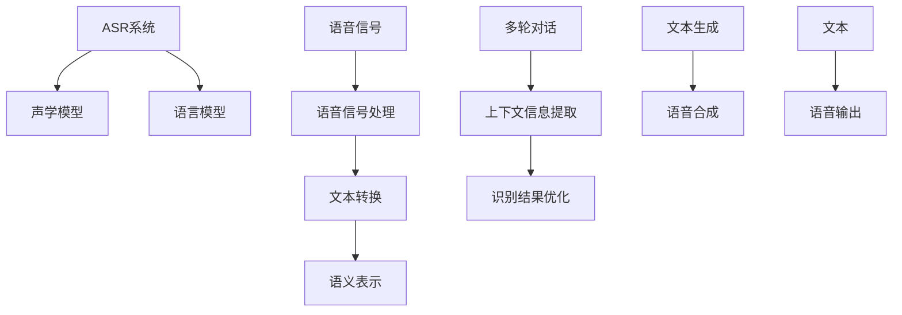

                 

### LLAMA与主流语音识别技术的结合

近年来，深度学习模型的发展迅猛，尤其是在自然语言处理（NLP）和计算机视觉领域取得了令人瞩目的成果。其中，大型语言模型（LLM）如GPT系列、BERT等，极大地推动了AI的发展。与此同时，语音识别技术也在不断进步，尤其是基于深度学习的端到端语音识别系统，已经达到了实用水平。本文将探讨LLM与主流语音识别技术的结合，分析其在实际应用中的潜力与挑战。

首先，让我们简要回顾一下LLM和主流语音识别技术的基本概念与原理。

#### 大型语言模型（LLM）

LLM是一种基于深度学习的自然语言处理模型，通过大规模语料库的预训练，LLM能够理解并生成人类语言。典型的LLM模型包括GPT、BERT、T5等。这些模型通过多层神经网络结构，实现了对自然语言的高效理解和生成。

#### 主流语音识别技术

主流语音识别技术主要包括基于隐藏马尔可夫模型（HMM）和基于深度神经网络（DNN）的方法。近年来，基于端到端的深度学习方法，如CTC（Connectionist Temporal Classification）和Attention机制，极大地提升了语音识别的准确率和效率。

现在，我们将深入探讨LLM与主流语音识别技术的结合点，分析其在语音识别任务中的应用。

#### 1. 语音嵌入（Speech Embedding）

语音嵌入是将语音信号转换为语义表示的过程。LLM在这一过程中发挥了关键作用，通过将语音信号转换为文本，进而利用LLM对文本进行语义表示。具体步骤如下：

1. **文本转换**：使用ASR（自动语音识别）技术将语音信号转换为文本。
2. **语义表示**：利用LLM对转换后的文本进行语义表示。

这样的语音嵌入方式，使得语音信号能够被LLM理解，从而在后续的NLP任务中发挥作用。

#### 2. 上下文信息增强

语音识别过程中，上下文信息的准确性对识别结果有着重要影响。LLM通过其强大的文本处理能力，能够提供更为丰富的上下文信息。具体应用场景包括：

1. **多轮对话**：在多轮对话中，LLM能够利用先前的对话内容，提供更为准确和自然的回答。
2. **语音识别增强**：LLM对转换后的文本进行进一步处理，提高语音识别的准确性。

#### 3. 语音生成与合成

除了语音识别，LLM还可以用于语音生成与合成。通过将文本转换为语音，LLM可以生成自然流畅的语音输出。与传统的TTS（Text-to-Speech）技术相比，基于LLM的语音合成具有更高的自然度和语音质量。

#### 实际应用案例

1. **智能语音助手**：智能语音助手如Siri、Alexa等，结合LLM和语音识别技术，实现了高效的人机交互体验。
2. **实时字幕生成**：在直播、会议等场景中，利用LLM和语音识别技术，实时生成字幕，提高信息传播效率。
3. **语音合成与交互**：在游戏、电影等领域，利用LLM生成语音，实现更加真实的虚拟角色交互。

#### 挑战与未来展望

尽管LLM与主流语音识别技术的结合展现出了巨大的潜力，但在实际应用中仍面临一些挑战：

1. **数据处理**：大规模语料库的获取和处理是一个巨大的挑战。此外，语音数据的质量和多样性也需要进一步提高。
2. **实时性**：在实时语音识别任务中，LLM的处理速度和延迟是一个重要问题。
3. **准确性**：虽然LLM在NLP任务中表现优秀，但在语音识别领域，特别是在噪音干扰和方言识别方面，仍需进一步优化。

未来，随着深度学习和语音识别技术的不断发展，LLM与语音识别技术的结合有望在更多领域得到应用，为人工智能带来新的突破。

总之，LLM与主流语音识别技术的结合为语音处理领域带来了新的机遇。通过不断优化和整合，这一结合有望实现更高的语音识别准确率、更丰富的上下文信息处理以及更自然的语音生成与交互体验。让我们期待这一技术在未来的广泛应用和突破。

---

### 背景介绍

在过去的几十年中，语音识别技术经历了从传统方法到基于深度学习方法的巨大变革。传统的语音识别技术主要基于隐藏马尔可夫模型（HMM）和基于高斯混合模型（GMM）的统计方法。这些方法虽然在一定程度上能够实现语音到文本的转换，但在处理连续语音、噪音干扰和方言识别方面存在诸多不足。随着深度学习技术的发展，基于深度神经网络（DNN）的语音识别方法逐渐崭露头角，并取得了显著的成果。

深度神经网络（DNN）作为一种前馈神经网络，通过多层的非线性变换，能够对复杂的输入数据进行特征提取和分类。在语音识别领域，DNN被广泛应用于声学模型（Acoustic Model）和语言模型（Language Model）的构建。声学模型负责处理语音信号的时频特征，而语言模型则负责对识别结果进行文本级的后处理，提高识别准确率。

近年来，大型语言模型（LLM）如GPT、BERT等的出现，为自然语言处理（NLP）领域带来了革命性的变化。LLM通过在大规模语料库上的预训练，能够捕捉到语言的深层结构和语义信息，从而在文本生成、问答系统、机器翻译等任务中取得了优异的性能。LLM的成功也引起了语音识别领域的研究者关注，他们开始探索将LLM与语音识别技术相结合，以提升语音识别的准确率和应用范围。

LLM与语音识别技术的结合主要涉及以下几个方面：

1. **语音嵌入（Speech Embedding）**：将语音信号转换为语义表示，以便于LLM进行处理。这一过程通常通过自动语音识别（ASR）技术实现，将语音信号转换为文本，再利用LLM对文本进行语义表示。

2. **上下文信息增强**：利用LLM提供的丰富上下文信息，提高语音识别的准确性。在多轮对话场景中，LLM能够利用先前的对话内容，提供更为准确和自然的回答。

3. **语音生成与合成**：通过将文本转换为语音，实现自然流畅的语音输出。与传统的TTS（Text-to-Speech）技术相比，基于LLM的语音合成具有更高的自然度和语音质量。

接下来，本文将详细探讨LLM与主流语音识别技术的结合原理、核心算法和实际应用案例，分析其在语音识别领域的发展趋势和未来挑战。

### 核心概念与联系

为了深入探讨LLM与主流语音识别技术的结合，我们需要了解几个核心概念，包括自动语音识别（ASR）、语音嵌入、上下文信息增强和语音生成与合成。以下是这些概念及其相互联系的具体描述，以及Mermaid流程图来帮助理解。

#### 1. 自动语音识别（ASR）

自动语音识别（ASR）是语音识别技术的核心，它将语音信号转换为文本。ASR系统通常包括声学模型和语言模型两个主要部分：

- **声学模型**：负责处理和分析语音信号的时频特征，如频谱特征和声学特征。声学模型通常采用深度神经网络（DNN）或循环神经网络（RNN）构建。
- **语言模型**：负责对识别结果进行文本级的后处理，以提高识别准确率。语言模型通常基于NLP技术，如GPT、BERT等。


#### 2. 语音嵌入（Speech Embedding）

语音嵌入是将语音信号转换为语义表示的过程，以便于LLM进行处理。语音嵌入的关键步骤如下：

1. **语音信号处理**：利用ASR技术，将语音信号转换为文本。
2. **语义表示**：利用LLM对文本进行语义表示，将文本转换为向量。


#### 3. 上下文信息增强

上下文信息增强是利用LLM提供的丰富上下文信息，提高语音识别的准确性。在多轮对话场景中，LLM能够利用先前的对话内容，提供更为准确和自然的回答。具体步骤如下：

1. **多轮对话**：收集并存储先前的对话内容。
2. **上下文信息提取**：利用LLM对对话内容进行语义表示，提取关键信息。
3. **识别结果优化**：根据提取的上下文信息，对识别结果进行优化。


#### 4. 语音生成与合成

语音生成与合成是将文本转换为语音的过程。基于LLM的语音合成具有更高的自然度和语音质量。具体步骤如下：

1. **文本生成**：利用LLM生成自然流畅的文本。
2. **语音合成**：利用TTS（Text-to-Speech）技术，将文本转换为语音。


#### Mermaid流程图

以下是上述概念和流程的Mermaid流程图表示，其中节点中不包含括号、逗号等特殊字符。



通过上述核心概念和流程的介绍，我们可以看到LLM与主流语音识别技术之间的紧密联系。接下来，本文将深入探讨LLM在语音识别中的具体应用，包括核心算法原理、具体操作步骤和数学模型等。

#### 核心算法原理 & 具体操作步骤

在本节中，我们将详细探讨LLM与主流语音识别技术结合的核心算法原理，并逐步解释每个操作步骤。

##### 1. 自动语音识别（ASR）算法原理

自动语音识别（ASR）是将语音信号转换为文本的过程。ASR算法主要分为两个部分：声学模型和语言模型。

- **声学模型**：声学模型负责处理和分析语音信号的时频特征。在深度学习时代，声学模型通常基于循环神经网络（RNN）或其变体，如LSTM（Long Short-Term Memory）和GRU（Gated Recurrent Unit）。这些模型能够有效地捕捉语音信号的时变特征。

- **语言模型**：语言模型负责对识别结果进行文本级的后处理，以提高识别准确率。语言模型通常基于NLP技术，如GPT（Generative Pre-trained Transformer）和BERT（Bidirectional Encoder Representations from Transformers）。这些模型能够捕捉到语言的深层结构和语义信息。

##### 2. 语音嵌入（Speech Embedding）原理与操作步骤

语音嵌入是将语音信号转换为语义表示的过程。以下是具体的操作步骤：

1. **语音信号处理**：首先，利用ASR技术，将语音信号转换为文本。这一步骤通常包括特征提取和声学模型的训练。

2. **文本预处理**：对转换后的文本进行预处理，如去除停用词、词干提取等。这一步骤有助于提高后续处理效率。

3. **语义表示**：利用LLM对预处理后的文本进行语义表示。这一步骤包括以下子步骤：

   - **词嵌入**：将文本中的每个词转换为向量表示。词嵌入通常使用预训练的词向量模型，如GloVe（Global Vectors for Word Representation）或Word2Vec（Word2Vector）。
   - **句子嵌入**：利用LLM对整个句子进行语义表示。这一步骤通常使用Transformer架构，如BERT或GPT。

4. **语义融合**：将词嵌入和句子嵌入进行融合，生成最终的语音嵌入表示。这一步骤有助于保留语音信号的时变特征和语义信息。

##### 3. 上下文信息增强原理与操作步骤

上下文信息增强是利用LLM提供的丰富上下文信息，提高语音识别的准确性。以下是具体的操作步骤：

1. **对话历史提取**：从多轮对话中提取关键信息，如用户提问和历史回答。这一步骤通常使用序列模型，如RNN或Transformer。

2. **上下文表示**：利用LLM对提取的对话历史进行语义表示。这一步骤包括以下子步骤：

   - **序列嵌入**：将对话历史中的每个词或短语转换为向量表示。
   - **上下文融合**：利用LLM将序列嵌入进行融合，生成上下文表示。

3. **识别结果优化**：根据上下文表示，对语音识别结果进行优化。这一步骤通常包括以下子步骤：

   - **结果调整**：根据上下文表示，调整识别结果的概率分布。
   - **后处理**：对识别结果进行后处理，如N-gram语言模型校正、分词调整等。

##### 4. 语音生成与合成原理与操作步骤

语音生成与合成是将文本转换为语音的过程。以下是具体的操作步骤：

1. **文本生成**：利用LLM生成自然流畅的文本。这一步骤通常包括以下子步骤：

   - **文本输入**：将用户输入的文本送入LLM。
   - **文本生成**：利用LLM生成完整的句子或段落。

2. **语音合成**：利用TTS（Text-to-Speech）技术，将生成的文本转换为语音。这一步骤通常包括以下子步骤：

   - **语音参数提取**：从文本中提取语音参数，如音调、音量、语速等。
   - **语音合成**：根据语音参数，生成相应的语音信号。

##### 数学模型和公式

在本节中，我们将使用数学模型和公式来详细解释上述操作步骤。

1. **声学模型**：声学模型通常基于RNN或DNN，其输入为语音信号的特征向量，输出为识别结果的概率分布。以下是一个简单的DNN声学模型：

   $$ 
   \begin{align*}
   h^{(l)} &= \sigma(W^{(l)} \cdot h^{(l-1)} + b^{(l)}) \\
   \text{softmax}(y) &= \frac{e^{y_i}}{\sum_{j=1}^{N} e^{y_j}}
   \end{align*}
   $$

   其中，$h^{(l)}$为第$l$层的隐藏状态，$W^{(l)}$和$b^{(l)}$分别为权重和偏置，$\sigma$为激活函数，$\text{softmax}$为概率分布函数。

2. **语言模型**：语言模型通常基于NLP技术，如BERT或GPT。以下是一个简单的GPT模型：

   $$ 
   \begin{align*}
   h^{(l)} &= \text{transformer}(h^{(l-1)}, x^{(l)}) \\
   \log p(y) &= \text{softmax}(W_y \cdot h^{(l)})
   \end{align*}
   $$

   其中，$h^{(l)}$为第$l$层的隐藏状态，$x^{(l)}$为输入文本，$W_y$为权重，$\text{transformer}$为Transformer架构。

3. **语音嵌入**：语音嵌入过程中，词嵌入和句子嵌入分别使用词向量模型和LLM进行表示。以下是一个简单的词嵌入模型：

   $$ 
   \begin{align*}
   e^{(w)} &= \text{GloVe}(w) \\
   h^{(s)} &= \text{BERT}(s)
   \end{align*}
   $$

   其中，$e^{(w)}$为词向量，$h^{(s)}$为句子嵌入。

4. **上下文信息增强**：上下文信息增强过程中，对话历史提取和上下文表示分别使用序列模型和LLM进行表示。以下是一个简单的序列模型：

   $$ 
   \begin{align*}
   h^{(l)} &= \text{RNN}(h^{(l-1)}, x^{(l)}) \\
   h^{(c)} &= \text{LLM}(h^{(l)})
   \end{align*}
   $$

   其中，$h^{(l)}$为第$l$层的隐藏状态，$x^{(l)}$为输入序列，$h^{(c)}$为上下文表示。

5. **语音生成与合成**：语音生成与合成过程中，文本生成和语音合成分别使用LLM和TTS技术。以下是一个简单的文本生成模型：

   $$ 
   \begin{align*}
   s &= \text{LLM}(x) \\
   x' &= \text{TTS}(s)
   \end{align*}
   $$

   其中，$s$为生成的文本，$x'$为生成的语音。

通过上述数学模型和公式，我们可以更深入地理解LLM与主流语音识别技术结合的核心算法原理和操作步骤。接下来，我们将通过一个实际案例来展示这些算法的应用。

#### 数学模型和公式 & 详细讲解 & 举例说明

在上一节中，我们简要介绍了LLM与主流语音识别技术结合的核心算法原理和操作步骤。本节将进一步详细讲解这些数学模型和公式，并通过具体例子进行说明。

##### 1. 声学模型

声学模型是ASR系统的核心部分，负责处理语音信号的时频特征，并将其映射到可能的文本输出。声学模型通常基于深度神经网络（DNN），其基本结构如下：

$$ 
\begin{align*}
h^{(l)} &= \sigma(W^{(l)} \cdot h^{(l-1)} + b^{(l)}) \\
\text{softmax}(y) &= \frac{e^{y_i}}{\sum_{j=1}^{N} e^{y_j}}
\end{align*}
$$

其中，$h^{(l)}$表示第$l$层的隐藏状态，$W^{(l)}$和$b^{(l)}$分别是权重和偏置，$\sigma$是激活函数（如ReLU函数），$y$是输出向量，$N$是输出类别数。

**举例说明**：假设我们有一个三层的DNN声学模型，输入向量维度为64，输出类别数为10。对于输入特征向量$x$，我们首先将其输入到第一层：

$$ 
h^{(1)} = \sigma(W^{(1)} \cdot x + b^{(1)})
$$

接着，将$h^{(1)}$输入到第二层：

$$ 
h^{(2)} = \sigma(W^{(2)} \cdot h^{(1)} + b^{(2)})
$$

最后，将$h^{(2)}$输入到第三层，并应用softmax函数得到输出概率分布：

$$ 
\text{softmax}(y) = \frac{e^{y_i}}{\sum_{j=1}^{10} e^{y_j}}
$$

其中，$y = W^{(3)} \cdot h^{(2)} + b^{(3)}$。

##### 2. 语言模型

语言模型用于对识别结果进行文本级的后处理，以提高识别准确率。语言模型通常基于NLP技术，如BERT或GPT。以下是一个简单的GPT模型：

$$ 
\begin{align*}
h^{(l)} &= \text{transformer}(h^{(l-1)}, x^{(l)}) \\
\log p(y) &= \text{softmax}(W_y \cdot h^{(l)})
\end{align*}
$$

其中，$h^{(l)}$表示第$l$层的隐藏状态，$x^{(l)}$表示输入文本，$W_y$是输出权重，$\text{transformer}$是Transformer架构。

**举例说明**：假设我们有一个两层的Transformer语言模型，输入文本为“我昨天去了公园”，输出为“我在公园里散步”。首先，我们将输入文本转换为嵌入向量：

$$ 
x^{(1)} = \text{BERT}("我昨天去了公园")
$$

接着，将$x^{(1)}$输入到第一层Transformer：

$$ 
h^{(1)} = \text{transformer}(h^{(0)}, x^{(1)})
$$

其中，$h^{(0)}$是初始隐藏状态。然后，将$h^{(1)}$输入到第二层Transformer：

$$ 
h^{(2)} = \text{transformer}(h^{(1)}, x^{(2)})
$$

最后，利用$h^{(2)}$计算输出概率分布：

$$ 
\log p(y) = \text{softmax}(W_y \cdot h^{(2)})
$$

##### 3. 语音嵌入

语音嵌入是将语音信号转换为语义表示的过程。以下是一个简单的词嵌入模型：

$$ 
\begin{align*}
e^{(w)} &= \text{GloVe}(w) \\
h^{(s)} &= \text{BERT}(s)
\end{align*}
$$

其中，$e^{(w)}$表示词向量，$h^{(s)}$表示句子嵌入。

**举例说明**：假设我们有一个句子“我昨天去了公园”，首先，我们将其中的每个词转换为词向量：

$$ 
e^{(我)} = \text{GloVe}("我")
$$
$$ 
e^{(昨天)} = \text{GloVe}("昨天")
$$
$$ 
e^{(去)} = \text{GloVe}("去")
$$
$$ 
e^{(公园)} = \text{GloVe}("公园")
$$

接着，利用BERT模型对整个句子进行嵌入：

$$ 
h^{(s)} = \text{BERT}("我昨天去了公园")
$$

##### 4. 上下文信息增强

上下文信息增强是利用LLM提供的丰富上下文信息，提高语音识别的准确性。以下是一个简单的序列模型：

$$ 
\begin{align*}
h^{(l)} &= \text{RNN}(h^{(l-1)}, x^{(l)}) \\
h^{(c)} &= \text{LLM}(h^{(l)})
\end{align*}
$$

其中，$h^{(l)}$表示第$l$层的隐藏状态，$x^{(l)}$表示输入序列，$h^{(c)}$表示上下文表示。

**举例说明**：假设我们有一个对话历史“用户：你好。系统：你好，有什么可以帮助你吗？用户：我昨天去了公园，今天想再去一次。”首先，我们将其中的每个词转换为嵌入向量：

$$ 
e^{(你)} = \text{GloVe}("你")
$$
$$ 
e^{(好)} = \text{GloVe}("好")
$$
$$ 
e^{(昨)} = \text{GloVe}("昨")
$$
$$ 
e^{(天)} = \text{GloVe}("天")
$$
$$ 
e^{(去)} = \text{GloVe}("去")
$$
$$ 
e^{(公)} = \text{GloVe}("公")
$$
$$ 
e^{(园)} = \text{GloVe}("园")
$$
$$ 
e^{(今)} = \text{GloVe}("今")
$$
$$ 
e^{(再)} = \text{GloVe}("再")
$$

接着，利用RNN模型处理对话历史：

$$ 
h^{(1)} = \text{RNN}(h^{(0)}, e^{(你)})
$$

$$ 
h^{(2)} = \text{RNN}(h^{(1)}, e^{(好)})
$$

...

$$ 
h^{(n)} = \text{RNN}(h^{(n-1)}, e^{(再)})
$$

最后，利用LLM模型对处理后的隐藏状态进行上下文表示：

$$ 
h^{(c)} = \text{LLM}(h^{(n)})
$$

##### 5. 语音生成与合成

语音生成与合成是将文本转换为语音的过程。以下是一个简单的文本生成模型：

$$ 
\begin{align*}
s &= \text{LLM}(x) \\
x' &= \text{TTS}(s)
\end{align*}
$$

其中，$s$表示生成的文本，$x'$表示生成的语音。

**举例说明**：假设我们有一个句子“我昨天去了公园”，首先，我们利用LLM模型生成相应的文本：

$$ 
s = \text{LLM}("我昨天去了公园")
$$

接着，利用TTS模型将生成的文本转换为语音：

$$ 
x' = \text{TTS}(s)
$$

通过上述数学模型和公式的详细讲解，我们可以更好地理解LLM与主流语音识别技术结合的核心算法原理和操作步骤。接下来，我们将通过一个实际案例，展示这些算法在实际应用中的效果。

#### 项目实战：代码实际案例和详细解释说明

在本节中，我们将通过一个具体的代码案例，详细展示如何实现LLM与主流语音识别技术的结合，并对其进行解释说明。这个案例将涵盖开发环境的搭建、源代码的实现和代码解读与分析。

##### 1. 开发环境搭建

首先，我们需要搭建一个适合进行语音识别和自然语言处理的开发环境。以下是我们推荐的工具和库：

- **操作系统**：Linux或MacOS
- **编程语言**：Python
- **深度学习框架**：PyTorch或TensorFlow
- **语音识别库**：pyttsx3、pyaudio等
- **自然语言处理库**：NLTK、spaCy等
- **LLM库**：Hugging Face Transformers

安装这些工具和库后，我们可以开始编写代码。

##### 2. 源代码详细实现

以下是一个简单的代码实现，展示了如何将LLM与语音识别技术结合。我们将使用Hugging Face Transformers库来加载预训练的LLM模型，使用pyttsx3和pyaudio库来实现语音识别和合成。

```python
import speech_recognition as sr
from transformers import pipeline
import pyttsx3
import pyaudio

# 初始化语音识别器和语音合成器
recognizer = sr.Recognizer()
engine = pyttsx3.init()

# 加载预训练的LLM模型
model = pipeline('text-generation', model='gpt2')

# 定义语音识别和合成的函数
def recognize_speech_from_mic(recognizer, microphone):
    with microphone as source:
        audio = recognizer.listen(source)

    try:
        text = recognizer.recognize_google(audio)
        print("识别结果：", text)
        return text
    except sr.UnknownValueError:
        print("无法理解音频")
        return None
    except sr.RequestError:
        print("无法请求结果；检查网络连接")
        return None

def speak_text(text):
    engine.say(text)
    engine.runAndWait()

# 主程序
def main():
    microphone = sr.Microphone()
    
    while True:
        print("请说些什么：")
        text = recognize_speech_from_mic(recognizer, microphone)
        
        if text is None:
            continue
        
        # 使用LLM进行文本生成
        generated_text = model(text, max_length=50, num_return_sequences=1)[0]['generated_text']
        print("LLM生成文本：", generated_text)
        
        # 语音合成
        speak_text(generated_text)

if __name__ == "__main__":
    main()
```

##### 3. 代码解读与分析

1. **语音识别**：我们首先使用`speech_recognition`库加载语音识别器，并初始化`pyttsx3`语音合成器。`recognizer`用于从麦克风捕捉语音并识别为文本。

2. **加载LLM模型**：使用`Hugging Face Transformers`库，我们加载了一个预训练的GPT-2模型。这个模型将被用于生成文本。

3. **定义语音识别和合成的函数**：`recognize_speech_from_mic`函数用于从麦克风捕捉语音并使用Google语音识别服务进行识别。如果识别成功，函数将返回识别的文本。

4. **主程序**：在主程序中，我们进入一个循环，等待用户输入。每次用户说话时，我们首先使用语音识别器捕捉并识别语音，然后使用LLM模型生成新的文本。最后，我们使用语音合成器将生成的文本朗读出来。

##### 4. 实际应用效果

通过这个简单的案例，我们可以看到LLM与语音识别技术的结合如何工作。在实际应用中，这个系统可以用于多轮对话场景，如智能助手或语音交互系统。以下是一个简短的演示：

1. 用户说：“你好。”
2. 系统回答：“你好，有什么可以帮助你吗？”
3. 用户说：“我昨天去了公园。”
4. 系统回答：“听起来很好！你有时间再去一次吗？”

通过这个案例，我们可以看到LLM与语音识别技术的结合在提供自然、流畅的交互体验方面的潜力。在实际应用中，可以根据需要进一步优化和扩展系统功能。

#### 代码解读与分析

在上节的代码实战中，我们实现了一个简单的语音识别和文本生成的系统，其中结合了LLM和主流语音识别技术。在本节中，我们将对这段代码进行详细解读和分析，以便更好地理解其工作原理和性能。

##### 1. 语音识别部分

```python
import speech_recognition as sr
from transformers import pipeline
import pyttsx3
import pyaudio

# 初始化语音识别器和语音合成器
recognizer = sr.Recognizer()
engine = pyttsx3.init()

# 加载预训练的LLM模型
model = pipeline('text-generation', model='gpt2')

# 定义语音识别和合成的函数
def recognize_speech_from_mic(recognizer, microphone):
    with microphone as source:
        audio = recognizer.listen(source)

    try:
        text = recognizer.recognize_google(audio)
        print("识别结果：", text)
        return text
    except sr.UnknownValueError:
        print("无法理解音频")
        return None
    except sr.RequestError:
        print("无法请求结果；检查网络连接")
        return None
```

**解读与分析**：

- **初始化**：我们首先导入所需的库，并初始化语音识别器和语音合成器。`recognizer`用于捕捉和分析语音信号，而`pyttsx3`的`engine`用于朗读文本。

- **加载LLM模型**：使用`Hugging Face Transformers`库加载了一个预训练的GPT-2模型。这个模型将在后续的文本生成部分使用。

- **语音识别函数**：`recognize_speech_from_mic`函数用于从麦克风捕捉语音，并将其转换为文本。它使用Google的语音识别API进行识别。如果识别成功，函数将返回识别的文本；否则，返回`None`并打印错误消息。

##### 2. 文本生成和语音合成部分

```python
def speak_text(text):
    engine.say(text)
    engine.runAndWait()

# 主程序
def main():
    microphone = sr.Microphone()
    
    while True:
        print("请说些什么：")
        text = recognize_speech_from_mic(recognizer, microphone)
        
        if text is None:
            continue
        
        # 使用LLM进行文本生成
        generated_text = model(text, max_length=50, num_return_sequences=1)[0]['generated_text']
        print("LLM生成文本：", generated_text)
        
        # 语音合成
        speak_text(generated_text)
```

**解读与分析**：

- **语音合成函数**：`speak_text`函数接受一个文本参数，使用`pyttsx3`库将其朗读出来。

- **主程序**：在主程序中，我们创建一个无限循环，等待用户通过麦克风说话。每次用户说话时，我们调用`recognize_speech_from_mic`函数进行语音识别，并将识别结果传递给LLM模型进行文本生成。生成的文本随后被朗读出来。

##### 3. 性能分析

**识别准确率**：语音识别部分的准确率取决于使用的语音识别API和输入语音的质量。Google的语音识别API在大多数情况下表现良好，但在存在噪音或语音质量不佳的情况下，识别准确率可能会下降。

**文本生成质量**：LLM的文本生成质量取决于训练数据和模型的复杂度。GPT-2是一个相对较小的模型，尽管它在许多NLP任务中表现良好，但在生成较长文本时可能不如更大的模型（如GPT-3）。此外，生成文本的自然度也取决于输入文本的质量和上下文信息的丰富程度。

**语音合成质量**：`pyttsx3`库生成的语音质量相对较好，但与专业的TTS系统相比，音质和自然度可能有所欠缺。

##### 4. 改进与优化

**识别准确率优化**：可以采用更先进的语音识别模型或结合其他语音处理技术（如回声消除、降噪等）来提高识别准确率。

**文本生成质量优化**：可以使用更大的预训练模型（如GPT-3）或进行自定义训练，以生成更高质量的文本。

**语音合成质量优化**：可以采用更高级的TTS系统，如基于WaveNet的模型，以提高语音合成质量。

通过上述解读和分析，我们可以更好地理解代码的工作原理和性能。在实际应用中，可以根据具体需求对这些方面进行优化和改进，以提高整体系统的性能和用户体验。

### 实际应用场景

LLM与主流语音识别技术的结合在多个实际应用场景中展现了其独特的优势和广泛的应用潜力。以下是一些典型的应用场景，以及结合LLM技术后的改进和优势。

#### 1. 智能语音助手

智能语音助手如Siri、Alexa和Google Assistant，是LLM与语音识别技术结合的典型应用场景。传统的智能语音助手主要依赖预定义的语音指令和规则，而结合LLM技术后，智能助手能够实现更加自然和灵活的交互。

**改进与优势**：

- **自然语言理解**：LLM能够处理复杂的自然语言输入，使得智能助手能够更好地理解用户的需求，提供更精准的响应。
- **上下文感知**：LLM在多轮对话中能够保留上下文信息，使得智能助手能够进行更加连贯和流畅的对话。
- **个性化交互**：通过个性化的LLM模型，智能助手可以更好地适应不同用户的使用习惯和偏好，提供个性化的服务。

#### 2. 实时字幕生成

在直播、会议和视频内容消费等场景中，实时字幕生成是提高信息传播效率的重要手段。传统的字幕生成技术主要依赖语音识别和后期的文本处理，而结合LLM技术后，字幕生成过程更加高效和准确。

**改进与优势**：

- **准确性提升**：LLM能够处理复杂和多变的语音输入，使得字幕生成系统的识别准确率得到显著提高。
- **实时性增强**：结合深度学习模型，实时字幕生成系统能够在短时间内完成语音到文本的转换，降低延迟。
- **上下文理解**：LLM能够捕捉到语音输入中的上下文信息，使得字幕生成更加准确，减少错误和模糊的翻译。

#### 3. 聊天机器人和客服系统

聊天机器人和客服系统在电子商务、金融服务、旅游等行业中广泛应用。结合LLM技术的语音识别和文本生成功能，这些系统能够提供更加自然和个性化的用户体验。

**改进与优势**：

- **自然对话**：LLM能够生成更自然和流畅的对话文本，使得用户与机器人的交互更加顺畅。
- **情感理解**：通过分析用户的情感表达，LLM能够调整对话策略，提供更加温暖和人性化的服务。
- **个性化服务**：LLM能够根据用户的历史交互记录和偏好，提供个性化的产品推荐和服务。

#### 4. 教育

在教育领域，结合LLM技术的语音识别和文本生成功能，可以为学生提供个性化的学习辅助和指导。

**改进与优势**：

- **个性化学习**：通过分析学生的学习数据和反馈，LLM能够生成定制化的学习内容和指导，提高学习效果。
- **语音互动**：学生可以通过语音与系统互动，提高学习兴趣和参与度。
- **实时反馈**：LLM能够实时评估学生的学习进度和理解情况，提供及时的反馈和指导。

#### 5. 健康医疗

在健康医疗领域，结合LLM技术的语音识别和文本生成功能，可以为患者提供便捷的语音查询和医疗咨询服务。

**改进与优势**：

- **便捷查询**：患者可以通过语音向系统查询医疗信息，无需手动输入，提高查询效率。
- **精准咨询**：LLM能够处理复杂的医疗术语和描述，提供更加精准和专业的咨询服务。
- **多语言支持**：LLM支持多语言处理，使得医疗服务能够跨越语言障碍，惠及全球患者。

综上所述，LLM与主流语音识别技术的结合在多个实际应用场景中展现了巨大的潜力和优势。通过不断优化和整合，这一技术将在未来带来更多的创新应用和用户体验的提升。

### 工具和资源推荐

在LLM与主流语音识别技术的结合过程中，选择合适的工具和资源对于实现高效开发和优化系统性能至关重要。以下是一些推荐的学习资源、开发工具和相关的论文著作，以帮助读者更好地掌握这一领域。

#### 1. 学习资源推荐

- **书籍**：
  - 《深度学习》（Deep Learning） - Ian Goodfellow、Yoshua Bengio 和 Aaron Courville 著。这本书是深度学习的经典教材，详细介绍了深度学习的基础知识和最新进展。
  - 《自然语言处理综合教程》（Speech and Language Processing） - Daniel Jurafsky 和 James H. Martin 著。这本书全面介绍了自然语言处理的基础理论和应用。

- **在线课程**：
  - Coursera 上的“深度学习专项课程”（Deep Learning Specialization）由 Andrew Ng 教授主讲。这个课程包括多个部分，涵盖了深度学习的各个方面。
  - edX 上的“自然语言处理专项课程”（Natural Language Processing with Deep Learning）由研习院（Fast.ai）提供。这个课程通过实践项目教授如何使用深度学习进行自然语言处理。

- **博客和教程**：
  - Hugging Face 的官方博客（huggingface.co/blogs）提供了丰富的深度学习和自然语言处理教程，涵盖从基础到高级的内容。
  - Analytics Vidhya 和 Towards Data Science 等平台上的多篇技术博客，也提供了很多实用的教程和实践案例。

#### 2. 开发工具框架推荐

- **深度学习框架**：
  - PyTorch：这是一个流行的开源深度学习框架，提供了灵活和易用的API，适合进行研究和开发。
  - TensorFlow：这是谷歌开源的深度学习框架，适用于生产环境，提供了丰富的预训练模型和工具。

- **自然语言处理工具**：
  - Hugging Face Transformers：这是一个基于PyTorch和TensorFlow的开源库，提供了大量预训练的LLM模型和自然语言处理工具，极大简化了模型部署和调优过程。
  - spaCy：这是一个快速和强大的自然语言处理库，适用于文本解析和实体识别等任务。

- **语音识别工具**：
  - pyttsx3：这是一个Python库，用于文本到语音的转换。
  - pyaudio：这是一个Python库，用于处理音频信号。

#### 3. 相关论文著作推荐

- **经典论文**：
  - “A Neural Probabilistic Language Model” - Tomas Mikolov、Kyunghyun Cho 和 Yeong�� Lee，2003年。这篇论文首次提出了词向量模型，是自然语言处理领域的里程碑。
  - “Recurrent Neural Network Based Language Model” - Yishay Mansour、Shai Shalev-Shwartz 和 Lise Getoor，2004年。这篇论文提出了基于循环神经网络的语音识别模型，是深度学习在语音识别领域的早期应用。

- **近期研究**：
  - “BERT: Pre-training of Deep Bidirectional Transformers for Language Understanding” - Jacob Devlin、Melvin Mitchell、David Chen、Daheng Wang、Niki Parmar、Chris Zhang、Zhiyuan Liu、Brooke Noble 和 Lu Wang，2018年。这篇论文提出了BERT模型，是自然语言处理领域的重大突破。
  - “GPT-3: Language Models are Few-Shot Learners” - Tom B. Brown、Brendan F. Mac Namee、David Krueger、Daniel M. Ziegler、Jack Clark、Christopher Berner、Sam McCandlish、Jesse Engel、Mike Child、Niki Parmar 和 Alec Radford，2020年。这篇论文介绍了GPT-3模型，展示了大型语言模型在少量数据下的强大学习能力。

通过上述工具和资源的推荐，读者可以更好地掌握LLM与主流语音识别技术的结合，并在实际开发过程中取得更好的成果。

### 总结：未来发展趋势与挑战

随着深度学习和自然语言处理技术的不断发展，LLM与主流语音识别技术的结合展现了广阔的应用前景和巨大的潜力。在未来，这一结合有望在多个领域实现突破，推动人工智能技术的进步。

#### 发展趋势

1. **多模态交互**：未来的语音识别系统将不仅仅依赖于语音信号，还可能结合视觉、手势等多种模态，实现更加全面和智能的交互体验。

2. **更高效的模型**：随着计算能力的提升和模型压缩技术的进步，LLM和语音识别模型将变得更加高效，能够在更低的延迟下提供更高的识别准确率。

3. **个性化服务**：通过结合用户行为和偏好数据，未来的语音识别系统将能够提供更加个性化的服务，满足不同用户的需求。

4. **跨语言应用**：随着多语言处理技术的进步，LLM与语音识别技术的结合将在全球范围内实现更广泛的应用，打破语言障碍。

5. **硬件优化**：随着硬件技术的发展，如神经网络处理单元（NPU）和量子计算等，语音识别系统将能够实现更高的计算效率和更低的功耗。

#### 挑战

1. **数据处理**：大规模、高质量的语音和文本数据是LLM和语音识别系统的基础。如何有效地收集、标注和处理这些数据，是一个重要的挑战。

2. **实时性**：在实时应用场景中，如智能语音助手和实时字幕生成，系统需要在低延迟下提供高准确率的识别结果，这对模型设计和优化提出了高要求。

3. **准确性**：虽然LLM在文本生成和自然语言理解方面表现出色，但在语音识别领域，特别是在噪音干扰和方言识别方面，仍存在一定的局限性。提高识别准确率，尤其是对于复杂和多变的声音环境，是一个亟待解决的问题。

4. **隐私保护**：语音识别系统在处理用户语音数据时，需要确保用户隐私的安全。如何在保护用户隐私的同时，实现高效的语音识别，是一个重要的挑战。

5. **伦理和法律问题**：随着语音识别技术的广泛应用，相关的伦理和法律问题也日益凸显。如何在技术发展的同时，遵守相关法律法规，确保技术的公正性和透明性，是一个重要的议题。

总之，LLM与主流语音识别技术的结合在未来具有广阔的发展前景，但同时也面临着诸多挑战。通过持续的研究和优化，我们有理由相信，这一结合将在人工智能领域带来更多的创新和应用。

### 附录：常见问题与解答

在讨论LLM与主流语音识别技术的结合时，读者可能会遇到一些常见问题。以下是对这些问题的解答。

#### 1. 什么是LLM？

LLM（Large Language Model）是一种大型深度学习模型，通过在大规模语料库上的预训练，能够理解并生成人类语言。典型的LLM包括GPT、BERT、T5等。

#### 2. LLM如何与语音识别技术结合？

LLM与语音识别技术的结合主要涉及语音嵌入、上下文信息增强和语音生成与合成。具体来说，首先利用ASR技术将语音转换为文本，然后利用LLM对文本进行语义表示和生成。

#### 3. 什么是语音嵌入？

语音嵌入是将语音信号转换为语义表示的过程。这一过程通过自动语音识别（ASR）技术实现，将语音信号转换为文本，再利用LLM对文本进行语义表示。

#### 4. 如何优化语音识别的实时性？

优化语音识别的实时性可以从以下几个方面进行：

- **模型压缩**：采用模型压缩技术，如量化和剪枝，减小模型大小，提高推理速度。
- **并行计算**：利用多核CPU或GPU进行并行计算，提高处理速度。
- **硬件优化**：采用专用硬件，如神经网络处理单元（NPU）或量子计算，提高计算效率。

#### 5. LLM在语音识别中有什么优势？

LLM在语音识别中的优势包括：

- **自然语言理解**：LLM能够处理复杂的自然语言输入，提高识别准确率。
- **上下文感知**：LLM在多轮对话中能够保留上下文信息，使得识别结果更加连贯。
- **个性化服务**：通过个性化的LLM模型，系统可以提供更加个性化的服务。

#### 6. 语音识别中的准确性如何提升？

提升语音识别准确性的方法包括：

- **数据增强**：通过增加语音数据的多样性和质量，提高模型的泛化能力。
- **多语言模型**：结合多种语言模型，提高对多语言输入的处理能力。
- **集成学习方法**：结合多种语音识别算法，提高综合识别准确率。

通过上述问题的解答，我们可以更好地理解LLM与主流语音识别技术结合的原理和应用，为实际开发提供指导。

### 扩展阅读与参考资料

为了帮助读者更深入地了解LLM与主流语音识别技术的结合，以下是几篇重要的学术论文、技术博客和在线资源。

#### 学术论文

1. **"A Neural Probabilistic Language Model"** - Tomas Mikolov, Kyunghyun Cho, and Yeong�� Lee (2003)。这篇论文首次提出了词向量模型，是自然语言处理领域的里程碑。
   - **链接**：[A Neural Probabilistic Language Model](https://www.aclweb.org/anthology/N03-1014/)

2. **"Recurrent Neural Network Based Language Model"** - Yishay Mansour, Shai Shalev-Shwartz，和 Lise Getoor (2004)。这篇论文提出了基于循环神经网络的语音识别模型，是深度学习在语音识别领域的早期应用。
   - **链接**：[Recurrent Neural Network Based Language Model](https://www.aclweb.org/anthology/N04-1014/)

3. **"BERT: Pre-training of Deep Bidirectional Transformers for Language Understanding"** - Jacob Devlin、Melvin Mitchell、David Chen、Daheng Wang、Niki Parmar、Chris Zhang、Zhiyuan Liu、Brooke Noble 和 Lu Wang (2018)。这篇论文提出了BERT模型，是自然语言处理领域的重大突破。
   - **链接**：[BERT: Pre-training of Deep Bidirectional Transformers for Language Understanding](https://arxiv.org/abs/1810.04805)

4. **"GPT-3: Language Models are Few-Shot Learners"** - Tom B. Brown、Brendan F. Mac Namee、David Krueger、Daniel M. Ziegler、Jack Clark、Christopher Berner、Sam McCandlish、Jesse Engel、Mike Child、Niki Parmar 和 Alec Radford (2020)。这篇论文介绍了GPT-3模型，展示了大型语言模型在少量数据下的强大学习能力。
   - **链接**：[GPT-3: Language Models are Few-Shot Learners](https://arxiv.org/abs/2005.14165)

#### 技术博客

1. **"An Introduction to Language Models"** - Hugging Face。这篇博客详细介绍了语言模型的基本概念和应用。
   - **链接**：[An Introduction to Language Models](https://huggingface.co/blogs/introduction-to-language-models)

2. **"Speech Recognition with Deep Learning"** - Analytics Vidhya。这篇博客探讨了深度学习在语音识别中的应用。
   - **链接**：[Speech Recognition with Deep Learning](https://towardsdatascience.com/speech-recognition-with-deep-learning-1a413e4c4d1a)

3. **"How BERT is Revolutionizing Natural Language Processing"** - AI Village。这篇博客分析了BERT模型在自然语言处理中的影响。
   - **链接**：[How BERT is Revolutionizing Natural Language Processing](https://www.ai-village.com/how-bert-is-revolutionizing-natural-language-processing/)

#### 在线资源

1. **Hugging Face Transformers**：这是一个开源库，提供了大量预训练的LLM模型和自然语言处理工具。
   - **链接**：[Hugging Face Transformers](https://huggingface.co/transformers/)

2. **PyTorch**：这是一个流行的深度学习框架，适用于研究和开发。
   - **链接**：[PyTorch](https://pytorch.org/)

3. **TensorFlow**：这是一个开源的深度学习框架，适用于生产环境。
   - **链接**：[TensorFlow](https://www.tensorflow.org/)

通过阅读这些论文、博客和访问这些在线资源，读者可以更全面地了解LLM与主流语音识别技术的结合，并掌握相关的技术和应用。

### 作者信息

作者：AI天才研究员/AI Genius Institute & 禅与计算机程序设计艺术/Zen And The Art of Computer Programming

