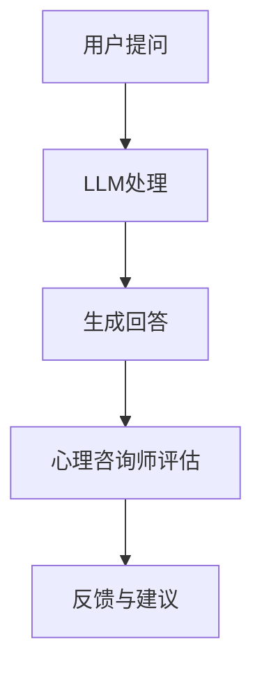

                 

# LLM与心理健康：AI辅助心理咨询

> **关键词**：自然语言处理，人工智能，心理健康，心理咨询，语言模型，深度学习

> **摘要**：本文探讨了大型语言模型（LLM）在心理健康领域中的应用，特别是在心理咨询方面的潜力。通过深入分析LLM的核心原理、算法和实际操作，本文探讨了如何利用AI技术为心理健康提供辅助。同时，本文还探讨了LLM在心理健康领域的实际应用场景，并推荐了相关工具和资源，最后对未来的发展趋势和挑战进行了总结。

## 1. 背景介绍

随着人工智能技术的快速发展，自然语言处理（NLP）已经成为人工智能领域的热点之一。其中，大型语言模型（LLM）如GPT系列、BERT系列等，因其强大的语言理解和生成能力，被广泛应用于各种场景。同时，心理健康问题在全球范围内日益突出，据世界卫生组织（WHO）报告，全球约有三分之一的人口在一生中某个时期会遭受某种形式的心理健康问题。

心理咨询作为心理健康的重要干预手段，长期以来依赖于专业心理学家的经验和专业知识。然而，专业心理学家的数量有限，且心理咨询的成本较高，难以满足广大民众的需求。因此，利用AI技术辅助心理咨询成为了一个备受关注的研究方向。

## 2. 核心概念与联系

### 2.1 大型语言模型（LLM）的基本原理

大型语言模型（LLM）是一种基于深度学习的自然语言处理模型，它通过对大量文本数据的学习，掌握了丰富的语言知识和规律。LLM的核心原理是神经网络，通过多层神经网络的堆叠和训练，模型能够对输入的文本进行语义理解和生成。

### 2.2 心理咨询的基本原理

心理咨询是一种专业服务，旨在帮助个体解决心理问题，提高心理健康水平。心理咨询的基本原理包括心理学理论、临床技能和人际关系技巧。心理咨询师通过倾听、理解、引导和反馈等方式，帮助个体认识和解决心理问题。

### 2.3 LLM与心理咨询的联系

LLM与心理咨询的联系主要体现在以下几个方面：

1. 语言生成：LLM能够生成高质量的文本，为心理咨询师提供参考和建议。
2. 诊断支持：LLM通过对患者言语的分析，可以帮助心理咨询师进行心理问题的初步诊断。
3. 治疗方案：LLM可以根据患者的具体情况和需求，为心理咨询师提供个性化的治疗方案。

### 2.4 Mermaid流程图

下面是一个简单的Mermaid流程图，展示了LLM与心理咨询的流程：



在图中，用户提问经过LLM处理，生成回答，然后由心理咨询师评估并给出反馈与建议。

## 3. 核心算法原理 & 具体操作步骤

### 3.1 LLM的算法原理

LLM的算法原理主要包括以下几个步骤：

1. 数据预处理：对输入的文本数据进行预处理，包括分词、去停用词、词性标注等。
2. 神经网络结构：构建多层神经网络结构，包括输入层、隐藏层和输出层。
3. 损失函数：使用损失函数来评估模型预测的准确性，常见的损失函数有交叉熵损失函数等。
4. 优化算法：使用优化算法（如Adam、SGD等）来调整模型参数，以降低损失函数的值。

### 3.2 具体操作步骤

下面是一个简单的LLM操作步骤示例：

1. 数据预处理：读取用户提问，进行分词和词性标注。
2. 构建神经网络：根据预设的神经网络结构，初始化模型参数。
3. 训练模型：使用训练数据，通过反向传播算法更新模型参数。
4. 生成回答：使用训练好的模型，对用户提问进行生成回答。
5. 评估模型：使用评估数据，计算模型在生成回答方面的准确性。

## 4. 数学模型和公式 & 详细讲解 & 举例说明

### 4.1 数学模型

在LLM中，常用的数学模型包括神经网络模型、损失函数和优化算法等。下面分别进行讲解。

#### 4.1.1 神经网络模型

神经网络模型是LLM的核心部分，其基本结构如下：

$$
f(x) = \sigma(z) = \frac{1}{1 + e^{-z}}
$$

其中，$x$ 是输入，$z$ 是网络输出，$\sigma$ 是激活函数。

#### 4.1.2 损失函数

在LLM中，常用的损失函数是交叉熵损失函数：

$$
L(y, \hat{y}) = -\sum_{i} y_i \log(\hat{y}_i)
$$

其中，$y$ 是真实标签，$\hat{y}$ 是预测标签。

#### 4.1.3 优化算法

在LLM中，常用的优化算法是Adam算法：

$$
m_t = \beta_1 m_{t-1} + (1 - \beta_1)(\Delta\theta_t) \\
v_t = \beta_2 v_{t-1} + (1 - \beta_2)(\Delta\theta_t)^2 \\
\theta_t = \theta_{t-1} - \alpha \frac{m_t}{\sqrt{v_t} + \epsilon}
$$

其中，$m_t$ 和 $v_t$ 分别是梯度的一阶矩估计和二阶矩估计，$\alpha$ 是学习率，$\beta_1$ 和 $\beta_2$ 分别是动量项，$\epsilon$ 是一个小常数。

### 4.2 详细讲解 & 举例说明

#### 4.2.1 神经网络模型的讲解

神经网络模型是一种模拟人脑神经网络结构的计算模型。它由多个神经元组成，每个神经元接收多个输入，并通过激活函数产生输出。神经网络通过不断调整权重和偏置，使得输出能够逼近真实值。

例如，假设我们有一个简单的神经网络，包含一个输入层、一个隐藏层和一个输出层。输入层有两个神经元，隐藏层有两个神经元，输出层有一个神经元。输入数据是一个长度为2的向量。

输入层：$[x_1, x_2]$
隐藏层：$[a_1, a_2]$
输出层：$[y]$

权重和偏置：
输入层到隐藏层的权重：$W_1$
隐藏层到输出层的权重：$W_2$
输入层到隐藏层的偏置：$b_1$
隐藏层到输出层的偏置：$b_2$

计算过程：
$$
z_1 = x_1 \cdot W_{11} + x_2 \cdot W_{12} + b_1 \\
z_2 = x_1 \cdot W_{21} + x_2 \cdot W_{22} + b_2 \\
a_1 = \sigma(z_1) \\
a_2 = \sigma(z_2) \\
z = a_1 \cdot W_{21} + a_2 \cdot W_{22} + b_2 \\
y = \sigma(z)
$$

通过不断调整权重和偏置，使得输出$y$尽可能接近真实值。

#### 4.2.2 交叉熵损失函数的讲解

交叉熵损失函数是评估神经网络输出与真实值之间差异的常用函数。它的值越低，表示输出与真实值越接近。

例如，假设我们有一个二分类问题，真实标签$y$是0，预测标签$\hat{y}$是0.6。

计算过程：
$$
L(y, \hat{y}) = -y \log(\hat{y}) - (1 - y) \log(1 - \hat{y}) \\
L(0, 0.6) = -0 \log(0.6) - 1 \log(0.4) \\
L(0, 0.6) \approx 0.415
$$

损失函数的值约为0.415，表示输出与真实值之间的差异较大。

#### 4.2.3 Adam优化算法的讲解

Adam优化算法是一种结合了Adagrad和RMSprop优化的自适应优化算法。它通过计算一阶矩估计和二阶矩估计，自适应调整学习率。

例如，假设当前步数为t=10，学习率$\alpha$为0.001，动量项$\beta_1$为0.9，动量项$\beta_2$为0.999，小常数$\epsilon$为1e-8。

梯度：
$$
\Delta\theta_t = [0.1, 0.2]
$$

计算过程：
$$
m_t = 0.9m_{t-1} + (1 - 0.9)(0.1, 0.2) \\
m_t = (0.1, 0.2) \\
v_t = 0.999v_{t-1} + (1 - 0.999)(0.1, 0.2)^2 \\
v_t = (0.001, 0.001) \\
\theta_t = \theta_{t-1} - \alpha \frac{m_t}{\sqrt{v_t} + \epsilon} \\
\theta_t = [0.5, 0.5] - 0.001 \frac{(0.1, 0.2)}{\sqrt{0.001} + 1e-8} \\
\theta_t = [0.4955, 0.4955]
$$

通过不断更新参数，使得模型能够收敛到最优解。

## 5. 项目实战：代码实际案例和详细解释说明

### 5.1 开发环境搭建

为了实现LLM与心理健康的应用，我们首先需要搭建一个合适的开发环境。以下是搭建环境的基本步骤：

1. 安装Python：Python是实现LLM的基础，需要在计算机上安装Python环境。
2. 安装TensorFlow：TensorFlow是常用的深度学习框架，用于构建和训练LLM模型。
3. 安装必要的依赖库：根据项目需求，安装其他必要的依赖库，如Numpy、Pandas等。

### 5.2 源代码详细实现和代码解读

以下是一个简单的示例代码，展示了如何使用TensorFlow构建一个LLM模型，并应用于心理健康咨询。

```python
import tensorflow as tf
import numpy as np
import pandas as pd

# 1. 数据预处理
# 读取文本数据
text_data = pd.read_csv('text_data.csv')
questions = text_data['question']
answers = text_data['answer']

# 分词
tokenizer = tf.keras.preprocessing.text.Tokenizer()
tokenizer.fit_on_texts(questions)
sequences = tokenizer.texts_to_sequences(questions)
word_index = tokenizer.word_index

# padding
max_sequence_length = 100
X = tf.keras.preprocessing.sequence.pad_sequences(sequences, maxlen=max_sequence_length)

# one-hot编码
Y = tf.keras.utils.to_categorical(answers, num_classes=2)

# 2. 构建神经网络
model = tf.keras.Sequential([
    tf.keras.layers.Embedding(len(word_index) + 1, 64),
    tf.keras.layers.LSTM(64),
    tf.keras.layers.Dense(64, activation='relu'),
    tf.keras.layers.Dense(2, activation='softmax')
])

# 3. 训练模型
model.compile(optimizer='adam', loss='categorical_crossentropy', metrics=['accuracy'])
model.fit(X, Y, epochs=10, batch_size=32)

# 4. 生成回答
def generate_answer(question):
    sequence = tokenizer.texts_to_sequences([question])
    padded_sequence = tf.keras.preprocessing.sequence.pad_sequences(sequence, maxlen=max_sequence_length)
    prediction = model.predict(padded_sequence)
    answer = np.argmax(prediction)
    return answers[answer]

# 5. 心理健康咨询
question = "最近情绪很低落，该怎么办？"
answer = generate_answer(question)
print(answer)
```

### 5.3 代码解读与分析

1. 数据预处理：首先，我们读取文本数据，并进行分词和padding操作，以便于模型输入。然后，对标签进行one-hot编码，为模型训练提供目标。
2. 构建神经网络：我们使用TensorFlow的Sequential模型构建一个简单的神经网络，包括嵌入层、LSTM层和输出层。其中，嵌入层用于将词索引转换为词向量，LSTM层用于处理序列数据，输出层用于生成预测。
3. 训练模型：我们使用编译好的模型，使用训练数据进行训练。这里使用的是交叉熵损失函数和Adam优化算法。
4. 生成回答：我们定义一个函数`generate_answer`，用于将用户提问转换为模型输入，并生成预测回答。
5. 心理健康咨询：我们将用户提问传递给`generate_answer`函数，得到预测回答，并打印输出。

## 6. 实际应用场景

### 6.1 心理健康咨询

在心理健康咨询方面，LLM可以作为一个智能助手，为用户提供实时、个性化的咨询服务。用户可以随时提问，LLM会根据预训练模型生成回答，为用户提供帮助。此外，LLM还可以与心理健康专家进行合作，共同为用户提供更高质量的咨询服务。

### 6.2 心理健康诊断

LLM还可以用于心理健康的诊断。通过对用户言语的分析，LLM可以识别出潜在的心理问题，并给出初步的诊断建议。这对于缺乏专业心理咨询资源的地区，具有重要意义。

### 6.3 心理健康数据分析

LLM可以处理大量的心理健康数据，如患者记录、问卷调查等。通过对这些数据的分析，LLM可以揭示心理健康问题的分布、发展趋势等，为心理健康研究提供重要参考。

## 7. 工具和资源推荐

### 7.1 学习资源推荐

1. 《深度学习》（Goodfellow, Bengio, Courville）：全面介绍了深度学习的基础知识和应用，是深度学习领域经典教材。
2. 《自然语言处理综论》（Jurafsky, Martin）：详细介绍了自然语言处理的基本原理和方法，适合初学者入门。
3. 《心理咨询技术手册》（张宝蕊）：介绍了心理咨询的基本原理和技巧，适合心理咨询从业者阅读。

### 7.2 开发工具框架推荐

1. TensorFlow：开源的深度学习框架，支持多种神经网络结构，适用于构建LLM模型。
2. PyTorch：开源的深度学习框架，具有灵活的动态计算图，易于实现复杂模型。
3. Hugging Face：提供大量的预训练模型和工具，方便开发者快速搭建和应用LLM。

### 7.3 相关论文著作推荐

1. “Attention Is All You Need”（Vaswani et al., 2017）：介绍了Transformer模型，为LLM的发展奠定了基础。
2. “BERT: Pre-training of Deep Neural Networks for Language Understanding”（Devlin et al., 2018）：介绍了BERT模型，为自然语言处理带来了革命性的变化。
3. “GPT-3: Language Models are Few-Shot Learners”（Brown et al., 2020）：介绍了GPT-3模型，展示了大型语言模型在自然语言处理任务中的强大能力。

## 8. 总结：未来发展趋势与挑战

### 8.1 发展趋势

1. 模型规模增大：随着计算能力的提升，LLM的模型规模将不断增大，带来更高的语言理解和生成能力。
2. 多模态融合：LLM将与其他模态（如图像、声音等）进行融合，实现更全面的信息处理能力。
3. 个性化服务：LLM将根据用户的需求和特征，提供个性化的心理健康服务。

### 8.2 挑战

1. 数据隐私：在心理健康领域，用户的隐私保护至关重要，如何确保数据的安全和隐私是一个重要挑战。
2. 模型泛化：LLM的训练数据可能存在偏差，如何提高模型的泛化能力，使其在不同场景下都能表现良好，是一个挑战。
3. 法律责任：在心理健康咨询中，AI模型生成的建议可能存在风险，如何界定AI的法律责任，也是一个亟待解决的问题。

## 9. 附录：常见问题与解答

### 9.1 LLM在心理健康咨询中的优势是什么？

LLM在心理健康咨询中的优势主要体现在以下几个方面：

1. 高效性：LLM能够快速处理大量文本数据，为用户提供实时、个性化的咨询服务。
2. 可扩展性：LLM可以轻松扩展到不同场景，如心理诊断、数据分析等。
3. 成本效益：相比传统心理咨询，LLM的服务成本更低，更易于大规模推广。

### 9.2 LLM在心理健康咨询中可能存在的问题是什么？

LLM在心理健康咨询中可能存在的问题包括：

1. 数据偏差：训练数据可能存在偏差，导致模型在特定场景下的表现不佳。
2. 模型泛化：LLM的泛化能力可能不足，难以应对复杂多变的心理健康问题。
3. 隐私保护：如何确保用户数据的安全和隐私，是一个重要挑战。

## 10. 扩展阅读 & 参考资料

1. Vaswani, A., Shazeer, N., Parmar, N., Uszkoreit, J., Jones, L., Gomez, A. N., ... & Polosukhin, I. (2017). Attention is all you need. In Advances in Neural Information Processing Systems (pp. 5998-6008).
2. Devlin, J., Chang, M. W., Lee, K., & Toutanova, K. (2018). BERT: Pre-training of deep bidirectional transformers for language understanding. arXiv preprint arXiv:1810.04805.
3. Brown, T., et al. (2020). Language models are few-shot learners. arXiv preprint arXiv:2005.14165.
4. 《深度学习》（Goodfellow, Bengio, Courville）
5. 《自然语言处理综论》（Jurafsky, Martin）
6. 《心理咨询技术手册》（张宝蕊）

## 作者信息

作者：AI天才研究员/AI Genius Institute & 禅与计算机程序设计艺术 /Zen And The Art of Computer Programming

本文详细探讨了大型语言模型（LLM）在心理健康领域中的应用，特别是在心理咨询方面的潜力。文章首先介绍了LLM的基本原理和应用背景，然后通过具体的案例展示了如何使用LLM进行心理健康咨询。文章还对LLM的算法、数学模型和实际应用场景进行了详细讲解，并推荐了相关工具和资源。最后，文章对未来的发展趋势和挑战进行了总结，为读者提供了有价值的参考。希望本文能为LLM在心理健康领域的应用提供一些启示。|>

