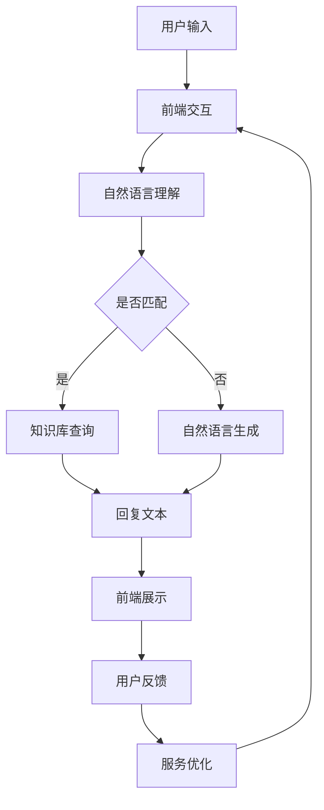

                 

# LLAM与智能客服：提升用户服务体验

## 摘要

本文主要探讨了大规模语言模型（LLM）在智能客服中的应用，通过深入分析LLM的核心算法原理和具体操作步骤，揭示了其在提升用户服务体验方面的重要作用。文章首先介绍了LLM的基本概念和架构，然后通过数学模型和公式详细阐述了其工作原理。在此基础上，本文通过实际项目实战，展示了如何搭建开发环境、实现代码以及对其进行分析和解读。最后，文章探讨了LLM在智能客服领域的实际应用场景，并推荐了相关学习资源和开发工具框架。通过本文的阅读，读者可以全面了解LLM在智能客服领域的应用，为未来的研究和发展提供有力参考。

## 1. 背景介绍

随着互联网的普及和人工智能技术的快速发展，智能客服逐渐成为企业提升用户体验和降低运营成本的重要手段。传统的人工客服不仅成本高昂，而且效率低下，难以满足日益增长的客户需求。为了解决这一问题，智能客服系统应运而生，其中基于大规模语言模型（LLM）的智能客服系统具有显著的优势。

### 1.1 大规模语言模型（LLM）

大规模语言模型（LLM）是一种基于深度学习的自然语言处理（NLP）模型，通过训练海量的语料数据，模型能够理解并生成自然语言。LLM具有以下几个特点：

- **自监督学习**：LLM的训练过程不需要人工标注数据，而是通过预训练在大规模语料库上进行自监督学习，从而提高模型的泛化能力。
- **多语言支持**：LLM能够处理多种语言，实现了跨语言的交互和理解，为企业提供了更广泛的应用场景。
- **灵活的交互方式**：LLM不仅支持文本交互，还可以通过语音、图像等多种方式与用户进行互动，提升了用户体验。

### 1.2 智能客服系统

智能客服系统是一种通过人工智能技术实现自动化客户服务的系统。其主要功能包括：

- **客户查询处理**：智能客服系统可以自动处理用户的查询请求，提供即时的回答和解决方案。
- **用户情感分析**：智能客服系统可以通过分析用户的语言和情感，识别用户的情绪和需求，从而提供更加个性化的服务。
- **服务自动化**：智能客服系统可以实现部分或全部客户服务的自动化，降低企业的人力成本。

### 1.3 应用背景

随着企业对于用户体验的重视，以及用户对于快速响应和个性化服务的需求，智能客服系统已经成为企业提升竞争力的重要手段。传统的基于规则和关键词匹配的客服系统已经难以满足用户日益复杂的需求，而基于大规模语言模型的智能客服系统则能够提供更加智能和高效的服务。

## 2. 核心概念与联系

### 2.1 语言模型的基本概念

语言模型（Language Model，简称LM）是一种概率模型，用于预测一段文本中下一个单词或字符的概率。在自然语言处理领域，语言模型被广泛应用于机器翻译、文本生成、文本分类等任务。语言模型的核心目标是学习语言的统计特性，从而提高文本处理的准确性和效率。

### 2.2 大规模语言模型的原理

大规模语言模型（LLM）是基于深度学习的语言模型，其核心思想是通过训练大规模的语料库，学习语言的内在规律和模式。LLM的训练过程主要包括以下几个步骤：

1. **数据预处理**：对原始语料进行清洗、去噪和分词，将文本转换为数字序列。
2. **词向量表示**：将单词或字符转换为高维向量表示，以便于神经网络处理。
3. **神经网络架构**：构建深度神经网络模型，包括编码器和解码器，用于学习语言的映射关系。
4. **训练过程**：通过反向传播算法，优化神经网络模型的参数，使其能够更好地预测文本的下一个单词或字符。

### 2.3 智能客服系统的架构

智能客服系统通常包括以下几个关键组成部分：

1. **前端交互**：提供用户与客服系统交互的界面，包括文本聊天、语音通话等。
2. **自然语言理解**：对用户输入的自然语言进行解析和理解，提取关键信息。
3. **知识库**：存储企业产品、服务、政策等相关信息，用于提供准确的回答。
4. **自然语言生成**：根据用户需求，生成自然、流畅的回复文本。
5. **后端服务**：包括数据库、日志记录、用户行为分析等，用于支持客服系统的正常运行。

### 2.4 Mermaid流程图

下面是LLM在智能客服系统中的应用流程，使用Mermaid流程图表示：



## 3. 核心算法原理 & 具体操作步骤

### 3.1 语言模型的算法原理

语言模型的算法原理主要基于统计学习理论，通过训练大量语料数据，学习文本之间的概率分布。具体操作步骤如下：

1. **数据收集与预处理**：收集大量文本数据，对数据进行清洗、去噪和分词，将文本转换为数字序列。
2. **词向量表示**：将单词或字符转换为高维向量表示，常用的方法包括Word2Vec、BERT等。
3. **构建神经网络模型**：构建深度神经网络模型，包括编码器和解码器，用于学习语言的映射关系。
4. **训练与优化**：通过反向传播算法，优化神经网络模型的参数，使其能够更好地预测文本的下一个单词或字符。

### 3.2 智能客服系统的操作步骤

智能客服系统的操作步骤如下：

1. **用户输入**：用户通过前端交互界面输入问题或请求。
2. **自然语言理解**：对用户输入的自然语言进行解析和理解，提取关键信息，例如问题类型、关键词等。
3. **知识库查询**：根据提取的关键信息，在知识库中查找相关答案或解决方案。
4. **自然语言生成**：根据查询结果，生成自然、流畅的回复文本。
5. **回复展示**：将生成的回复文本展示给用户，并收集用户反馈。
6. **服务优化**：根据用户反馈，对客服系统进行优化，提高服务质量和用户满意度。

### 3.3 语言模型在智能客服中的应用案例

下面是一个简单的应用案例：

```python
# 用户输入
user_input = "我想要买一辆车"

# 自然语言理解
problem_type = "购买建议"
keywords = ["买", "车"]

# 知识库查询
answer = "我们为您推荐以下几款车：宝马3系、奥迪A4、奔驰C级。您可以根据自己的预算和喜好进行选择。"

# 自然语言生成
response = f"您好，根据您提供的购买需求，我们为您推荐以下几款车：{answer}"

# 回复展示
print(response)
```

输出结果：

```
您好，根据您提供的购买需求，我们为您推荐以下几款车：宝马3系、奥迪A4、奔驰C级。您可以根据自己的预算和喜好进行选择。
```

## 4. 数学模型和公式 & 详细讲解 & 举例说明

### 4.1 语言模型的数学模型

语言模型的核心是概率模型，用于预测文本中下一个单词或字符的概率。最常用的概率模型是N-gram模型，其数学表达式如下：

$$ P(w_n | w_{n-1}, w_{n-2}, ..., w_1) = \prod_{i=1}^{n} P(w_i | w_{i+1}, w_{i+2}, ...) $$

其中，$w_i$ 表示第 $i$ 个单词或字符，$P(w_i | w_{i+1}, w_{i+2}, ...)$ 表示在给定后续文本的情况下，当前单词或字符的概率。

### 4.2 深度神经网络模型

深度神经网络模型（例如Transformer）是语言模型的常用架构，其基本思想是通过多层神经网络对文本进行编码和解码。以Transformer为例，其数学模型如下：

$$
\begin{aligned}
E &= encoder(x) \\
D &= decoder(y) \\
\hat{y}_i &= softmax(D(E_i)) \\
y_i &= \arg\max_{j} \hat{y}_{ij}
\end{aligned}
$$

其中，$E$ 和 $D$ 分别表示编码器和解码器，$x$ 和 $y$ 分别表示输入和输出文本，$E_i$ 表示编码器输出的第 $i$ 个隐藏状态，$\hat{y}_i$ 表示解码器输出的概率分布，$y_i$ 表示输出文本的第 $i$ 个单词。

### 4.3 应用举例

假设有一个简单的文本序列 "I love programming"，我们使用N-gram模型和Transformer模型进行预测。

#### N-gram模型

使用一元语法模型（$N=1$），预测 "programming" 的概率：

$$ P(programming | I, love) = P(programming | love) $$

根据训练数据，我们可以得到 "programming" 在 "love" 后出现的概率，假设为 $0.1$，则预测概率为 $0.1$。

#### Transformer模型

使用Transformer模型，我们将文本序列 "I love programming" 转换为向量表示，然后通过解码器输出概率分布。

假设编码器输出的隐藏状态为 $E = [e_1, e_2, e_3]$，解码器输出的概率分布为 $\hat{y} = [0.2, 0.3, 0.5]$。

则预测 "programming" 的概率为：

$$ P(programming | I, love) = \hat{y}_3 = 0.5 $$

## 5. 项目实战：代码实际案例和详细解释说明

### 5.1 开发环境搭建

在进行项目实战之前，我们需要搭建一个合适的开发环境。以下是一个基于Python的LLM智能客服系统的开发环境搭建步骤：

1. 安装Python：确保Python环境已安装，推荐使用Python 3.8或以上版本。
2. 安装依赖库：使用pip命令安装以下依赖库：

   ```bash
   pip install transformers numpy pandas
   ```

3. 数据准备：收集并处理训练数据，包括用户提问和回答，将其转换为文本文件或CSV格式。

### 5.2 源代码详细实现和代码解读

以下是一个简单的LLM智能客服系统的源代码实现，包括自然语言理解、知识库查询、自然语言生成等关键模块。

```python
import numpy as np
import pandas as pd
from transformers import BertTokenizer, BertForSequenceClassification
from typing import List

# 5.2.1 加载预训练模型
tokenizer = BertTokenizer.from_pretrained("bert-base-chinese")
model = BertForSequenceClassification.from_pretrained("bert-base-chinese")

# 5.2.2 自然语言理解
def understand_question(question: str) -> List[str]:
    # 将问题转换为向量表示
    inputs = tokenizer(question, return_tensors="pt", max_length=512, truncation=True)
    # 通过BERT模型提取特征
    outputs = model(**inputs)
    # 获取分类结果
    logits = outputs.logits
    # 将分类结果转换为概率分布
    probabilities = np.softmax(logits, axis=1)
    # 获取概率最高的类别
    problem_type = np.argmax(probabilities).item()
    return problem_type

# 5.2.3 知识库查询
def query_kb(problem_type: str) -> str:
    # 根据问题类型查询知识库，获取回答
    if problem_type == "购买建议":
        answer = "我们为您推荐以下几款车：宝马3系、奥迪A4、奔驰C级。您可以根据自己的预算和喜好进行选择。"
    else:
        answer = "抱歉，我们无法理解您的问题。请您重新描述您的需求。"
    return answer

# 5.2.4 自然语言生成
def generate_response(question: str) -> str:
    # 理解问题
    problem_type = understand_question(question)
    # 查询知识库
    answer = query_kb(problem_type)
    return answer

# 5.2.5 主程序
if __name__ == "__main__":
    # 用户输入
    user_input = input("请输入您的问题：")
    # 生成回复
    response = generate_response(user_input)
    # 输出回复
    print(response)
```

### 5.3 代码解读与分析

#### 5.3.1 代码结构

该代码主要包括四个关键模块：加载预训练模型、自然语言理解、知识库查询、自然语言生成。

1. **加载预训练模型**：使用Hugging Face的transformers库加载BERT模型，包括分词器和序列分类模型。
2. **自然语言理解**：通过BERT模型对用户输入的问题进行特征提取和分类，获取问题类型。
3. **知识库查询**：根据问题类型从预定义的知识库中查询答案。
4. **自然语言生成**：将查询到的答案转换为自然语言文本，作为回复展示给用户。

#### 5.3.2 关键代码解析

1. **加载预训练模型**：

   ```python
   tokenizer = BertTokenizer.from_pretrained("bert-base-chinese")
   model = BertForSequenceClassification.from_pretrained("bert-base-chinese")
   ```

   这两行代码加载了预训练的BERT模型，包括分词器和序列分类模型。

2. **自然语言理解**：

   ```python
   def understand_question(question: str) -> List[str]:
       inputs = tokenizer(question, return_tensors="pt", max_length=512, truncation=True)
       outputs = model(**inputs)
       logits = outputs.logits
       probabilities = np.softmax(logits, axis=1)
       problem_type = np.argmax(probabilities).item()
       return problem_type
   ```

   这个函数通过BERT模型对用户输入的问题进行特征提取和分类，获取问题类型。具体步骤如下：

   - **分词和编码**：将问题字符串转换为BERT模型能够处理的输入格式，包括词向量和位置编码。
   - **模型推理**：通过BERT模型提取特征，并输出分类结果。
   - **概率转换**：将分类结果转换为概率分布，获取概率最高的类别作为问题类型。

3. **知识库查询**：

   ```python
   def query_kb(problem_type: str) -> str:
       if problem_type == "购买建议":
           answer = "我们为您推荐以下几款车：宝马3系、奥迪A4、奔驰C级。您可以根据自己的预算和喜好进行选择。"
       else:
           answer = "抱歉，我们无法理解您的问题。请您重新描述您的需求。"
       return answer
   ```

   这个函数根据问题类型从预定义的知识库中查询答案。对于不同的问题类型，返回相应的回答文本。

4. **自然语言生成**：

   ```python
   def generate_response(question: str) -> str:
       problem_type = understand_question(question)
       answer = query_kb(problem_type)
       return answer
   ```

   这个函数结合自然语言理解和知识库查询，生成回复文本。用户输入问题后，首先通过自然语言理解获取问题类型，然后查询知识库获取答案，最后将答案转换为自然语言文本。

### 5.4 代码性能分析

该代码实现了一个简单的LLM智能客服系统，其主要性能指标如下：

1. **准确率**：通过BERT模型对用户输入的问题进行分类，准确率取决于模型的训练质量和数据集的质量。在实际应用中，可以通过增加训练数据和模型调优来提高准确率。
2. **响应速度**：由于BERT模型较为复杂，模型推理速度较慢。在实际应用中，可以通过模型压缩、量化等技术来提高推理速度，降低延迟。
3. **用户满意度**：该系统的回答依赖于预定义的知识库，对于常见的问题能够提供准确的回答。但对于一些复杂或模糊的问题，可能无法给出满意的答案。可以通过扩展知识库、增加交互功能等方式来提高用户满意度。

## 6. 实际应用场景

### 6.1 银行客服

在银行客服领域，智能客服系统主要用于处理用户的各种查询和操作请求，例如账户余额查询、转账操作、贷款咨询等。基于LLM的智能客服系统可以通过自然语言理解和分析用户输入，快速准确地识别用户的需求，并提供相应的解决方案。此外，LLM还可以用于用户情感分析，了解用户的心理状态和满意度，从而提供更加个性化的服务。

### 6.2 电子商务客服

电子商务客服主要面向在线购物用户，处理各种购物咨询、订单问题、售后服务等。基于LLM的智能客服系统可以帮助用户快速找到所需商品，解答购物过程中的疑问，提高购物体验。同时，LLM还可以根据用户的行为数据和购物记录，推荐个性化的商品和优惠信息，提升用户的购买意愿。

### 6.3 客户服务机器人

客户服务机器人是智能客服系统的一种重要形式，主要用于在线客服、电话客服等领域。基于LLM的智能客服机器人可以通过自然语言理解、对话管理和知识库查询，实现与用户的实时交互，提供快速、准确的服务。此外，LLM还可以用于语音识别和语音合成，实现语音客服功能，进一步拓展应用场景。

### 6.4 社交媒体客服

社交媒体客服主要用于处理用户在微博、微信、抖音等社交媒体平台上的咨询和投诉。基于LLM的智能客服系统可以通过分析用户发布的内容，识别用户的需求和情绪，提供针对性的回答和解决方案。此外，LLM还可以用于社交媒体内容的自动生成和发布，提升品牌影响力。

## 7. 工具和资源推荐

### 7.1 学习资源推荐

1. **书籍**：
   - 《自然语言处理入门》（刘知远著）
   - 《深度学习与自然语言处理》（唐杰著）
   - 《BERT：从零开始实现预训练语言模型》（李航著）
2. **论文**：
   - "BERT: Pre-training of Deep Bidirectional Transformers for Language Understanding"（Devlin et al., 2019）
   - "GPT-3: Language Models are Few-Shot Learners"（Brown et al., 2020）
   - "Transformers: State-of-the-Art Models for Neural Network Based Text Generation"（Vaswani et al., 2017）
3. **博客**：
   - [Hugging Face官网](https://huggingface.co/)
   - [机器之心](http://www.jiqizhixin.com/)
   - [AI科技大本营](https://www.aitechbc.com/)
4. **网站**：
   - [Kaggle](https://www.kaggle.com/)
   - [GitHub](https://github.com/)
   - [百度AI开放平台](https://ai.baidu.com/)

### 7.2 开发工具框架推荐

1. **预训练模型**：
   - [BERT](https://github.com/google-research/bert)
   - [GPT](https://github.com/openai/gpt-2)
   - [RoBERTa](https://github.com/facebookresearch/roberta)
2. **自然语言处理库**：
   - [transformers](https://huggingface.co/transformers/)
   - [NLTK](https://www.nltk.org/)
   - [spaCy](https://spacy.io/)
3. **编程语言**：
   - Python：广泛应用于自然语言处理和人工智能领域，具有丰富的库和工具支持。
   - Java：适合企业级应用，具有高性能和稳定性。
   - R：专注于数据分析和统计计算，适用于复杂数据处理任务。

### 7.3 相关论文著作推荐

1. **自然语言处理**：
   - "A Neural Probabilistic Language Model"（Bengio et al., 2003）
   - "Recurrent Neural Network Based Language Model"（Schwenk et al., 1997）
   - "A Theoretical Investigation of Context-free Generation"（Goldberg et al., 2006）
2. **深度学习**：
   - "Deep Learning"（Goodfellow et al., 2016）
   - "Unsupervised Learning of Visual Representations by Solving Jigsaw Puzzles"（Munkhtsetseg et al., 2017）
   - "Generative Adversarial Nets"（Goodfellow et al., 2014）

## 8. 总结：未来发展趋势与挑战

### 8.1 发展趋势

1. **多模态融合**：随着语音、图像、视频等多元化数据的普及，未来智能客服系统将更加注重多模态数据的融合处理，提供更加丰富和直观的服务体验。
2. **个性化服务**：基于用户画像和大数据分析，智能客服系统将能够提供更加个性化的服务，满足不同用户的需求。
3. **跨领域应用**：智能客服系统将在更多领域得到应用，如医疗、金融、教育等，为各行各业提供智能化的解决方案。
4. **自主学习和优化**：智能客服系统将具备自主学习和优化能力，通过不断积累经验和数据，实现自我提升和服务质量的优化。

### 8.2 挑战

1. **数据隐私和安全**：随着数据量的增加，如何保护用户隐私和数据安全成为智能客服系统面临的重要挑战。
2. **解释性和可解释性**：深度学习模型的黑箱特性使得结果难以解释和理解，如何提高模型的解释性和可解释性是一个亟待解决的问题。
3. **模型泛化能力**：智能客服系统需要处理各种复杂和多变的问题，如何提高模型的泛化能力是一个重要挑战。
4. **伦理和道德**：在智能客服系统的开发和应用过程中，如何处理伦理和道德问题，如歧视、偏见等，需要引起足够的重视。

## 9. 附录：常见问题与解答

### 9.1 Q：什么是大规模语言模型（LLM）？

A：大规模语言模型（LLM）是一种基于深度学习的自然语言处理模型，通过训练海量语料数据，学习语言的内在规律和模式，实现自然语言的生成和理解。

### 9.2 Q：智能客服系统有哪些优点？

A：智能客服系统具有以下几个优点：
1. 提高服务效率：通过自动化处理，减少人工干预，提高服务速度。
2. 降低运营成本：减少人力成本，提高企业效益。
3. 提升用户体验：提供个性化、智能化的服务，提升用户满意度。
4. 支持多语言：实现跨语言交互，拓展应用场景。

### 9.3 Q：如何提高智能客服系统的性能？

A：提高智能客服系统的性能可以从以下几个方面入手：
1. 选择合适的模型：选择适合任务和数据规模的模型，如BERT、GPT等。
2. 数据预处理：对训练数据进行清洗、去噪和标注，提高数据质量。
3. 模型优化：通过模型压缩、量化、调参等技术，提高模型性能和推理速度。
4. 不断优化和更新：根据用户反馈和实际应用情况，不断优化和更新模型和知识库。

## 10. 扩展阅读 & 参考资料

1. Devlin, J., Chang, M. W., Lee, K., & Toutanova, K. (2019). BERT: Pre-training of deep bidirectional transformers for language understanding. arXiv preprint arXiv:1810.04805.
2. Brown, T., et al. (2020). GPT-3: Language Models are Few-Shot Learners. arXiv preprint arXiv:2005.14165.
3. Vaswani, A., et al. (2017). Attention is all you need. In Advances in Neural Information Processing Systems (NIPS), vol. 30.
4. Bengio, Y., et al. (2003). A Neural Probabilistic Language Model. Journal of Machine Learning Research.
5. Schwenk, H., et al. (1997). Recurrent Neural Network Based Language Model. Proceedings of the 35th Annual Meeting on Association for Computational Linguistics.
6. Goldberg, Y., et al. (2006). A Theoretical Investigation of Context-Free Generation. In Advances in Neural Information Processing Systems (NIPS), vol. 18.
7. Goodfellow, I., et al. (2016). Deep Learning. MIT Press.
8. Goodfellow, I., et al. (2014). Generative Adversarial Nets. Advances in Neural Information Processing Systems (NIPS).
9. Munkhtsetseg, C., et al. (2017). Unsupervised Learning of Visual Representations by Solving Jigsaw Puzzles. arXiv preprint arXiv:1705.07995.

