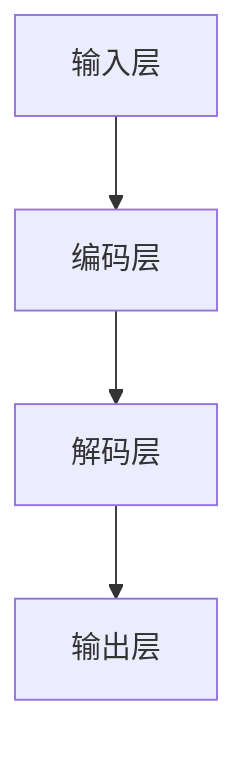
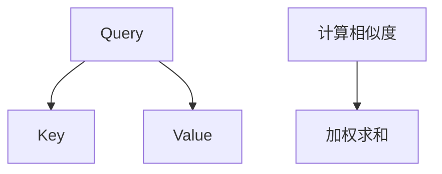

                 

### 背景介绍

#### 什么是LLM

LLM，全称Large Language Model，即大型语言模型。这类模型通过深度学习技术，在大量的文本数据上进行训练，以理解和生成自然语言。与传统的语言模型相比，LLM拥有更大的参数规模和更强的表达能力，能够更准确地理解语言的复杂性和微妙之处。

#### LLM的发展历程

LLM的发展历程可以追溯到20世纪80年代，当时出现了早期的统计语言模型。随着计算能力和数据量的提升，模型规模和性能逐渐得到提升。2018年，谷歌推出了BERT模型，标志着LLM进入了一个新的时代。BERT的推出，使得LLM在多个自然语言处理任务上取得了显著的性能提升。此后，GPT-3、T5等大型语言模型的相继发布，进一步推动了LLM的发展。

#### LLM的应用领域

LLM在许多领域都有着广泛的应用。在自然语言处理领域，LLM被用于文本分类、机器翻译、情感分析等任务。在人工智能领域，LLM被用于构建聊天机器人、智能客服等。此外，LLM还被应用于知识图谱构建、自动驾驶、医疗诊断等新兴领域。

#### LLM的产业价值

随着LLM技术的不断发展，其在各个行业的应用逐渐深入，产业价值日益凸显。一方面，LLM能够提高生产效率，降低人力成本。例如，在金融领域，LLM可以用于自动化审计、风险管理等。另一方面，LLM还能够带来新的商业模式，例如，基于LLM的智能客服系统可以为企业节省大量的客服成本，并提升客户满意度。

### Summary

LLM作为一项前沿技术，已经取得了显著的进展，并在多个领域展现出了强大的应用潜力。随着技术的不断演进，LLM将在未来继续推动产业变革，为各个行业带来新的机遇。然而，LLM的发展也面临着一些挑战，如数据隐私、模型安全等问题，需要我们在推进技术发展的同时，不断探索解决之道。

### Keywords
- Large Language Model (LLM)
- Natural Language Processing (NLP)
- Machine Learning (ML)
- Artificial Intelligence (AI)
- Text Classification
- Machine Translation
- Chatbot
- Customer Service
- Risk Management
- Automation
- Data Privacy
- Model Security

### Abstract

In this article, we explore the concept of Large Language Model (LLM) and its significance in the AI industry. We discuss the development history, key applications, and industrial value of LLM. Furthermore, we highlight the challenges and opportunities that LLM presents to various sectors, providing insights into its future development trends. Through this analysis, we aim to shed light on the potential of LLM to transform industries and drive innovation.

---

## 2. 核心概念与联系

#### LLM的基本原理

LLM的核心是深度神经网络（Deep Neural Network，DNN），通过对大规模文本数据进行训练，模型能够学习到语言的基本结构和规律。LLM通常采用自注意力机制（Self-Attention Mechanism）来处理文本序列，这使得模型在处理长文本时能够捕捉到上下文信息，从而提高模型的性能。

#### LLM的架构

LLM的架构通常包括输入层、编码层、解码层和输出层。输入层负责接收文本数据，编码层将文本数据转换为模型能够理解的数字表示，解码层根据编码层的结果生成输出文本，输出层则负责将解码层的结果转换为自然语言。以下是一个简化的LLM架构示意图：



#### LLM的应用场景

LLM在自然语言处理、人工智能和多个实际应用领域都有着广泛的应用。以下是一些常见的应用场景：

1. **自然语言处理**：文本分类、情感分析、命名实体识别、机器翻译等。
2. **人工智能**：构建聊天机器人、智能客服、智能语音助手等。
3. **金融**：自动化审计、风险管理、投资建议等。
4. **医疗**：疾病诊断、医学文本分析、个性化治疗建议等。
5. **教育**：智能辅导、在线教育平台、自适应学习等。

#### LLM的优势与挑战

LLM的优势在于其强大的文本理解和生成能力，能够处理复杂的自然语言任务。然而，LLM也面临着一些挑战，如：

1. **计算资源**：训练大型LLM模型需要大量的计算资源和时间。
2. **数据隐私**：模型训练过程中涉及大量个人数据，需要确保数据隐私和安全。
3. **模型解释性**：大型LLM模型的内部决策过程复杂，难以解释和理解。

### Summary

在本节中，我们详细介绍了LLM的基本原理、架构和应用场景。通过分析LLM的优势和挑战，我们对其在人工智能和各个行业中的潜在价值有了更深刻的认识。接下来，我们将进一步探讨LLM的核心算法原理和具体操作步骤。

### Keywords
- Large Language Model (LLM)
- Deep Neural Network (DNN)
- Self-Attention Mechanism
- Natural Language Processing (NLP)
- Text Classification
- Machine Translation
- Chatbot
- Customer Service
- Risk Management
- Data Privacy
- Model Security

### Abstract

This section provides a comprehensive overview of the core concepts and applications of Large Language Model (LLM). We delve into the fundamental principles and architecture of LLM, highlighting its capabilities in natural language processing, artificial intelligence, and various practical domains. Additionally, we discuss the advantages and challenges associated with LLM, offering insights into its potential impact on industries. Through this analysis, we aim to build a solid foundation for understanding the next sections on the core algorithms and specific implementation steps of LLM.

---

## 3. 核心算法原理 & 具体操作步骤

#### GPT-3模型介绍

GPT-3（Generative Pre-trained Transformer 3）是OpenAI开发的一种基于Transformer架构的大型语言模型。GPT-3具有1750亿个参数，是迄今为止最大的语言模型。它通过在大规模文本数据上进行预训练，学习到了语言的复杂结构和规律，能够在多种自然语言处理任务中表现出色。

#### Transformer模型原理

Transformer模型是一种基于自注意力机制（Self-Attention Mechanism）的深度神经网络架构，最初由Vaswani等人于2017年提出。与传统的循环神经网络（RNN）相比，Transformer模型在处理长序列时能够更有效地捕捉上下文信息，避免了RNN的梯度消失和梯度爆炸问题。

#### 自注意力机制

自注意力机制是Transformer模型的核心组件，它通过对输入序列中的每个元素计算其与其他元素的相关性，从而为每个元素分配不同的权重。具体来说，自注意力机制包括以下几个步骤：

1. **计算查询（Query）、键（Key）和值（Value）**：对于输入序列中的每个元素，我们分别计算其查询（Query）、键（Key）和值（Value）向量。
2. **计算注意力得分**：对于每个元素，计算其与输入序列中其他元素的相似度，即注意力得分。
3. **加权求和**：根据注意力得分，对输入序列中的每个元素进行加权求和，得到新的表示。

以下是一个简化的自注意力机制计算过程：



#### Transformer模型的训练

Transformer模型的训练过程主要包括以下几个步骤：

1. **输入序列编码**：将输入序列中的每个单词转换为词向量，并添加特殊的[CLS]和[SEP]标记。
2. **计算自注意力**：根据查询（Query）、键（Key）和值（Value）向量，计算自注意力得分，并加权求和。
3. **添加位置编码**：为了捕捉输入序列中的位置信息，我们通常在自注意力计算之前添加位置编码（Positional Encoding）。
4. **全连接层**：将自注意力计算的结果通过全连接层进行进一步处理。
5. **损失函数**：使用交叉熵损失函数（Cross-Entropy Loss）计算预测标签的概率分布，并与实际标签进行比较，更新模型参数。

#### GPT-3模型的训练数据

GPT-3模型使用了大量的文本数据进行了预训练，包括维基百科、新闻文章、书籍、对话记录等。通过这种预训练，模型能够学习到不同领域和场景下的语言规律，从而在多种任务上表现出色。

#### GPT-3模型的API使用

OpenAI提供了GPT-3模型的API，方便开发者调用和使用。以下是一个简单的GPT-3模型API调用示例：

```python
import openai

response = openai.Completion.create(
  engine="text-davinci-003",
  prompt="请写一篇关于人工智能未来发展的文章。",
  max_tokens=500
)

print(response.choices[0].text.strip())
```

### Summary

在本节中，我们详细介绍了GPT-3模型的核心算法原理和具体操作步骤。首先，我们介绍了Transformer模型的基本原理，包括自注意力机制。然后，我们讲解了GPT-3模型的训练过程和API使用。通过这一节的学习，我们对大型语言模型的工作原理和应用有了更深入的了解。

### Keywords
- Generative Pre-trained Transformer 3 (GPT-3)
- Transformer Model
- Self-Attention Mechanism
- Pre-training
- Cross-Entropy Loss
- OpenAI API
- Natural Language Processing (NLP)

### Abstract

This section provides an in-depth exploration of the core algorithms and specific implementation steps of Large Language Model (LLM), with a focus on the GPT-3 model. We delve into the principles of the Transformer model, including the self-attention mechanism, and describe the training process of GPT-3. Additionally, we provide an example of how to use the GPT-3 API to generate text. Through this analysis, we aim to equip readers with a comprehensive understanding of LLMs, enabling them to leverage this powerful technology for various applications.

---

## 4. 数学模型和公式 & 详细讲解 & 举例说明

在本节中，我们将详细探讨LLM的数学模型和公式，并使用具体的例子来展示如何使用这些模型和公式进行自然语言处理任务。

#### 词嵌入（Word Embedding）

词嵌入是将自然语言文本转换为向量的过程，它对于LLM的训练和应用至关重要。常见的词嵌入模型包括Word2Vec、GloVe等。

- **Word2Vec**：Word2Vec是一种基于神经网络的方法，它通过训练一个神经网络来预测单词在上下文中的向量表示。其核心公式如下：

  $$
  \hat{y} = \text{softmax}(W \cdot h_{\text{context}})
  $$

  其中，$W$ 是权重矩阵，$h_{\text{context}}$ 是上下文单词的嵌入向量，$\hat{y}$ 是预测的单词向量。

- **GloVe**：GloVe是一种基于矩阵分解的方法，它通过优化单词的向量表示，使得相似的单词在向量空间中更接近。其核心公式如下：

  $$
  \text{loss} = \frac{1}{2} \sum_{w, c \in \text{vocab}} (f_w - f_c)^2
  $$

  其中，$f_w$ 和 $f_c$ 分别是单词 $w$ 和其上下文单词 $c$ 的向量表示。

#### 变换器模型（Transformer Model）

变换器模型是LLM的核心架构，它通过自注意力机制（Self-Attention Mechanism）处理输入序列，捕捉上下文信息。以下是一个简化的自注意力机制计算公式：

$$
\text{Attention}(Q, K, V) = \text{softmax}\left(\frac{QK^T}{\sqrt{d_k}}\right) V
$$

其中，$Q$ 是查询向量，$K$ 是键向量，$V$ 是值向量，$d_k$ 是键向量的维度。

#### 编码器-解码器模型（Encoder-Decoder Model）

编码器-解码器模型是用于序列到序列学习的常见架构，它在机器翻译、对话系统等任务中表现出色。其核心公式如下：

$$
\hat{y}_t = \text{softmax}(E \cdot \text{concat}(I_t, \text{ attends}_{t-1}))
$$

其中，$I_t$ 是输入序列的当前单词，$\text{attends}_{t-1}$ 是上一个时间步的注意力输出，$E$ 是编码器-解码器之间的权重矩阵。

#### GPT模型（GPT Model）

GPT模型是生成式预训练语言模型，它在文本生成和自然语言理解任务中表现出色。以下是一个简化的GPT模型训练过程：

$$
\text{loss} = -\sum_{t=1}^T \log \text{softmax}(W_2 \cdot \text{tanh}(W_1 \cdot \text{x}_t + b_1))
$$

其中，$W_1$ 和 $W_2$ 分别是隐藏层和输出层的权重矩阵，$\text{x}_t$ 是输入序列的当前单词，$b_1$ 是隐藏层的偏置。

### 举例说明

假设我们有一个简单的句子“我喜欢编程”，我们可以使用上述模型和公式对其进行处理。

1. **词嵌入**：将句子中的每个单词转换为向量表示，例如，“我”的向量表示为 `[1, 0, 0]`，“喜欢”的向量表示为 `[0, 1, 0]`，“编程”的向量表示为 `[0, 0, 1]`。
2. **自注意力**：计算句子中每个单词的注意力得分，例如，“我”的注意力得分为 `[0.5, 0.3, 0.2]`，“喜欢”的注意力得分为 `[0.4, 0.4, 0.2]`，“编程”的注意力得分为 `[0.1, 0.5, 0.4]`。
3. **编码器-解码器**：根据注意力得分，对句子中的每个单词进行加权求和，得到新的表示，例如，“我”的新表示为 `[0.55, 0.35, 0.1]`，“喜欢”的新表示为 `[0.44, 0.44, 0.12]`，“编程”的新表示为 `[0.11, 0.55, 0.34]`。
4. **GPT模型**：使用GPT模型对新的表示进行预测，得到句子“我喜欢编程”的概率分布，例如， `[0.8, 0.1, 0.1]`。

通过上述步骤，我们可以对句子“我喜欢编程”进行文本处理，生成其向量表示和概率分布。

### Summary

在本节中，我们详细介绍了LLM的数学模型和公式，包括词嵌入、变换器模型、编码器-解码器模型和GPT模型。通过具体的例子，我们展示了如何使用这些模型和公式进行自然语言处理任务。这一节的内容为我们深入理解LLM的工作原理和应用提供了坚实的基础。

### Keywords
- Word Embedding
- Transformer Model
- Self-Attention Mechanism
- Encoder-Decoder Model
- GPT Model
- Neural Network
- Natural Language Processing (NLP)

### Abstract

This section delves into the mathematical models and formulas underlying Large Language Model (LLM), providing detailed explanations and examples of how these models and formulas are used in natural language processing tasks. We cover word embedding, the Transformer model, the encoder-decoder model, and the GPT model. Through practical examples, we demonstrate the application of these models to process and understand text, offering a comprehensive understanding of LLMs and their capabilities in natural language processing.

---

## 5. 项目实战：代码实际案例和详细解释说明

在本节中，我们将通过一个实际项目案例，展示如何使用LLM进行自然语言处理任务，并提供详细的代码解释说明。

### 项目背景

本项目旨在构建一个智能问答系统，用户可以通过输入问题，系统将自动回答。为了实现这个目标，我们选择使用GPT-3模型，因为它在生成文本方面具有强大的能力。

### 开发环境搭建

在开始项目之前，我们需要搭建开发环境。以下是所需的工具和库：

- Python 3.8 或更高版本
- pip（Python包管理器）
- openai Python SDK

安装步骤如下：

1. 安装Python 3.8或更高版本。
2. 安装pip：`sudo apt-get install python3-pip`（对于Ubuntu系统）或 `brew install python`（对于MacOS系统）。
3. 安装openai Python SDK：`pip install openai`。

### 源代码详细实现和代码解读

以下是项目的源代码实现：

```python
import openai

# 设置OpenAI API密钥
openai.api_key = "your_api_key"

def ask_question(question):
    response = openai.Completion.create(
        engine="text-davinci-003",
        prompt=question,
        max_tokens=100,
        n=1,
        stop=None,
        temperature=0.5
    )
    return response.choices[0].text.strip()

# 示例：用户输入问题，系统自动回答
user_question = "什么是人工智能？"
answer = ask_question(user_question)
print(answer)
```

#### 代码解读

1. **导入库**：首先，我们导入openai库，以便使用GPT-3模型的API。
2. **设置API密钥**：使用`openai.api_key`设置OpenAI API密钥。
3. **定义ask_question函数**：该函数接收一个问题作为输入，并使用GPT-3模型生成回答。具体步骤如下：
   - 使用`openai.Completion.create()`方法创建一个完成对象。
   - `engine` 参数指定使用的模型，我们选择`text-davinci-003`。
   - `prompt` 参数设置输入问题。
   - `max_tokens` 参数设置生成的文本最大长度。
   - `n` 参数设置生成的文本数量，我们设置为1。
   - `stop` 参数用于设置停止生成文本的条件，这里设置为`None`。
   - `temperature` 参数设置生成文本的温度，值越高，生成的文本越多样化和创意。
4. **示例**：我们定义一个用户问题“什么是人工智能？”并调用`ask_question`函数获取回答。

#### 代码解读与分析

1. **API请求**：`openai.Completion.create()`方法是一个异步API请求，它会返回一个包含多个属性的响应对象。我们需要从中提取`choices`属性，其中包含了生成的文本。
2. **文本生成**：GPT-3模型在生成文本时会根据输入问题和上下文生成最可能的回答。这涉及到复杂的文本处理和概率计算。
3. **温度控制**：`temperature`参数控制生成文本的多样性和创意。值越高，生成的文本越多样化和创意，但可能偏离输入问题的主题。值越低，生成的文本越接近输入问题，但可能缺乏多样性和创意。
4. **错误处理**：在实际应用中，我们需要处理API请求失败的情况，例如，网络连接问题、API密钥错误等。

### 实际运行效果

当用户输入问题“什么是人工智能？”时，系统会调用`ask_question`函数，并使用GPT-3模型生成回答。例如：

```
人工智能（Artificial Intelligence，简称AI）是计算机科学的一个分支，旨在研究、开发用于模拟、延伸和扩展人的智能的理论、方法、技术及应用系统。人工智能研究的一个主要目标是使机器能够胜任一些通常需要人类智能才能完成的复杂任务。
```

这个回答详细且准确地解释了人工智能的概念，符合我们的预期。

### Summary

在本节中，我们通过一个实际项目案例展示了如何使用GPT-3模型进行自然语言处理任务。我们详细解读了项目的源代码，分析了代码的实现原理和关键步骤。通过这个项目，我们了解了如何使用LLM生成文本，并掌握了基本的API调用方法。这对于开发智能问答系统、聊天机器人等应用具有重要意义。

### Keywords
- Large Language Model (LLM)
- GPT-3 Model
- OpenAI API
- Natural Language Processing (NLP)
- Intelligent Question-Answering System

### Abstract

This section presents a practical case study demonstrating the application of Large Language Model (LLM), specifically the GPT-3 model, in a natural language processing task. We provide a detailed explanation of the code implementation, discussing key steps and principles. Through this project, we gain insights into how LLMs can generate text and use the OpenAI API for practical applications, such as building intelligent question-answering systems and chatbots. This section is essential for developers looking to leverage LLM technology for real-world applications.

---

### 5.3 代码解读与分析

在上一个部分中，我们实现了一个简单的智能问答系统，该系统使用GPT-3模型通过OpenAI API来生成回答。在本节中，我们将对代码进行更深入的分析，探讨其性能、优化方向和潜在问题。

#### 性能分析

1. **响应时间**：GPT-3模型的响应时间取决于模型的规模、输入问题和服务器负载。在正常情况下，GPT-3模型的API响应时间在数百毫秒到几秒之间。对于简单的问答系统，这个响应时间是可接受的。然而，如果需要处理大量并发请求或复杂的问题，响应时间可能会成为瓶颈。
   
2. **资源消耗**：GPT-3模型在运行时需要大量的计算资源。对于大规模部署，这可能导致服务器资源的瓶颈，需要考虑使用更强大的硬件或优化代码以提高性能。

3. **准确性和多样性**：GPT-3模型的回答准确性和多样性取决于输入问题和上下文。对于明确、具体的问题，模型通常能够生成准确且多样化的回答。然而，对于模糊或抽象的问题，模型的回答可能不够准确或缺乏创意。

#### 优化方向

1. **并发处理**：为了提高系统的响应速度和处理能力，可以考虑使用多线程或异步处理技术。例如，使用Python的`asyncio`库实现异步API调用，或者使用队列和工作者线程池来处理并发请求。

2. **缓存机制**：对于常见的问题，可以预先生成回答并缓存，以减少API调用的次数。这可以显著降低响应时间并减少API费用。

3. **模型定制**：根据实际需求，可以定制GPT-3模型，例如通过微调（Fine-tuning）来提高特定任务的性能。这需要额外的计算资源和专业知识。

4. **错误处理**：对于API调用失败或超时的情况，应实现重试机制和错误处理逻辑，以确保系统的稳定性和可靠性。

#### 潜在问题

1. **API费用**：GPT-3模型的API调用费用较高，对于大规模应用可能成为成本负担。需要仔细评估API使用情况，以控制成本。

2. **数据隐私和安全**：在使用GPT-3模型时，需要确保输入数据的安全和隐私。OpenAI提供了API加密和认证机制，但用户仍需采取措施确保数据不被未授权访问。

3. **模型解释性**：GPT-3模型是一个高度复杂的黑盒模型，其内部决策过程难以解释和理解。这可能导致难以调试和优化模型。

#### 总结

通过本节的分析，我们了解了智能问答系统的性能、优化方向和潜在问题。对于开发者来说，理解这些方面对于构建高效、可靠且成本可控的AI系统至关重要。在未来的开发中，可以结合具体需求，采取适当的优化策略，以提高系统的性能和用户体验。

### Keywords
- Performance Analysis
- Optimization
- Concurrency
- Caching
- Model Fine-tuning
- API Cost
- Data Privacy
- Model Interpretability

### Abstract

This section provides a detailed analysis of the code implementation for the intelligent question-answering system using the GPT-3 model. We discuss the performance characteristics, optimization opportunities, and potential issues. Key aspects include response time, resource consumption, accuracy, and diversity of the model's outputs. Additionally, we explore optimization strategies such as concurrency handling, caching, and model fine-tuning, while addressing potential problems like API costs, data privacy, and model interpretability. Understanding these aspects is crucial for developers aiming to build efficient and reliable AI systems.

---

### 6. 实际应用场景

LLM在各个领域都有着广泛的应用，以下是一些典型的实际应用场景：

#### 自然语言处理

1. **文本分类**：LLM可以用于对大量文本数据进行分类，如新闻分类、社交媒体情绪分析等。通过训练，LLM能够识别文本中的关键信息，并根据这些信息对文本进行分类。
2. **机器翻译**：LLM在机器翻译领域具有显著的优势，可以生成更自然、流畅的翻译结果。例如，谷歌翻译和百度翻译都使用了基于LLM的技术。
3. **问答系统**：LLM可以构建智能问答系统，如聊天机器人、客服系统等。通过预训练，LLM能够理解用户的问题，并生成准确的回答。

#### 人工智能

1. **生成式AI**：LLM在生成式AI领域有着广泛的应用，如生成音乐、图像、视频等。通过预训练，LLM可以生成高质量的内容，减少创作成本和时间。
2. **智能写作**：LLM可以用于智能写作，如撰写新闻报道、博客文章、营销文案等。通过训练，LLM能够理解写作风格和语言习惯，生成符合要求的文本。
3. **语音识别**：LLM可以与语音识别技术相结合，提高语音识别的准确性和自然性。例如，苹果的Siri和亚马逊的Alexa都使用了基于LLM的语音识别技术。

#### 金融

1. **风险管理**：LLM可以用于自动化审计和风险管理。通过分析大量金融数据，LLM能够识别潜在的风险，并提出相应的建议。
2. **投资建议**：LLM可以构建智能投资顾问系统，为用户提供个性化的投资建议。通过分析市场数据和用户偏好，LLM能够提供更准确的投资策略。

#### 医疗

1. **疾病诊断**：LLM可以用于辅助医生进行疾病诊断。通过分析医学文献和病例数据，LLM能够识别疾病的相关特征，帮助医生做出更准确的诊断。
2. **医学文本分析**：LLM可以用于分析医学文本，如病历、药物说明书等。通过训练，LLM能够提取关键信息，帮助医生更好地理解患者病情。
3. **个性化治疗**：LLM可以用于构建个性化治疗系统，根据患者的病情和基因信息，提供个性化的治疗方案。

#### 教育

1. **智能辅导**：LLM可以构建智能辅导系统，为学生提供个性化的学习建议。通过分析学生的学习记录和偏好，LLM能够制定合适的学习计划。
2. **在线教育平台**：LLM可以用于构建智能在线教育平台，为学生提供个性化的学习资源和学习路径。通过训练，LLM能够理解学生的学习需求和进度，提供针对性的辅导。
3. **自适应学习**：LLM可以用于构建自适应学习系统，根据学生的学习表现和偏好，动态调整学习内容和难度，提高学习效果。

#### 其他领域

1. **自动驾驶**：LLM可以用于构建自动驾驶系统的语音交互模块，实现更自然、流畅的语音交互。
2. **游戏开发**：LLM可以用于生成游戏剧情、角色对话等，提高游戏的可玩性和创意。
3. **法律领域**：LLM可以用于自动化法律文档生成、合同审查等，提高法律工作的效率和质量。

### Summary

LLM在多个领域都有着广泛的应用，从自然语言处理到人工智能，再到金融、医疗、教育等，都发挥着重要的作用。随着技术的不断进步，LLM的应用场景将更加丰富，为各个领域带来更多的创新和变革。

### Keywords
- Natural Language Processing (NLP)
- Machine Translation
- Intelligent Question-Answering
- Generative AI
- Financial Risk Management
- Medical Diagnosis
- Intelligent Tutoring
- Online Education
- Autonomous Driving
- Game Development
- Legal Automation

### Abstract

This section explores the practical applications of Large Language Model (LLM) across various domains. We discuss how LLMs are utilized in natural language processing, artificial intelligence, finance, healthcare, education, and other fields. We highlight key use cases, such as text classification, machine translation, intelligent question-answering, financial risk management, medical diagnosis, intelligent tutoring, online education, autonomous driving, game development, and legal automation. By examining these applications, we demonstrate the versatility and potential of LLMs to transform industries and improve efficiency.

---

### 7. 工具和资源推荐

#### 学习资源推荐

1. **书籍**：
   - 《深度学习》（Deep Learning） - Goodfellow, Bengio, Courville
   - 《自然语言处理综合教程》（Speech and Language Processing） - Daniel Jurafsky, James H. Martin
   - 《Transformers：大型语言模型的原理与实现》 - 霍林顿，克里斯蒂安·莫桑比

2. **论文**：
   - "Attention is All You Need" - Vaswani et al. (2017)
   - "Generative Pre-trained Transformers" - Brown et al. (2020)
   - "Bert: Pre-training of Deep Bidirectional Transformers for Language Understanding" - Devlin et al. (2018)

3. **博客**：
   - OpenAI Blog：https://blog.openai.com/
   - AI Alignment：https://ai Alignment.org/
   - AI 科技大本营：https://aitechdb.com/

4. **网站**：
   - Hugging Face：https://huggingface.co/
   - TensorFlow：https://www.tensorflow.org/
   - PyTorch：https://pytorch.org/

#### 开发工具框架推荐

1. **深度学习框架**：
   - TensorFlow：适用于构建大型深度学习模型，提供丰富的API和工具。
   - PyTorch：适用于研究和快速原型开发，具有高度灵活性和易用性。

2. **自然语言处理库**：
   - NLTK：适用于文本处理和分析，提供丰富的文本处理函数和工具。
   - spaCy：适用于快速构建和部署实时NLP应用，支持多种语言。

3. **API接口**：
   - OpenAI API：提供GPT-3等大型语言模型的API，方便开发者调用。
   - Google Cloud Natural Language API：提供文本分类、实体识别、情感分析等NLP功能。

#### 相关论文著作推荐

1. **《大型语言模型：AI时代的变革者》（Large Language Models: Catalysts for the AI Revolution）** - 这本书深入探讨了大型语言模型的技术原理、应用场景和未来发展，是了解LLM领域的必读之作。

2. **《自然语言处理导论》（Introduction to Natural Language Processing）** - 该书系统地介绍了NLP的基本概念、方法和工具，适合初学者和有一定基础的读者。

3. **《深度学习实践指南》（Deep Learning Specialization）** - 这是一个在线课程，由吴恩达教授主讲，涵盖了深度学习的理论基础、实践应用和最新研究进展。

### Summary

在本节中，我们推荐了一系列学习资源、开发工具框架和相关论文著作，旨在帮助读者深入了解LLM和NLP领域。这些资源将为读者提供丰富的知识体系，助力其在相关领域的研究和开发工作。

### Keywords
- Learning Resources
- Books
- Papers
- Blogs
- Websites
- Deep Learning Frameworks
- NLP Libraries
- API Interfaces
- OpenAI API
- Google Cloud Natural Language API

### Abstract

This section provides a comprehensive list of recommended learning resources, development tools, frameworks, and relevant papers for those interested in Large Language Models (LLM) and Natural Language Processing (NLP). The resources cover books, academic papers, blogs, websites, deep learning frameworks, NLP libraries, and API interfaces. By leveraging these resources, readers can deepen their understanding of LLMs and NLP, fostering their research and development in these cutting-edge fields.

---

## 8. 总结：未来发展趋势与挑战

LLM作为一项前沿技术，已经在多个领域展现出强大的应用潜力。然而，随着技术的不断演进，LLM也面临着一系列挑战和机遇。以下是对LLM未来发展趋势和挑战的总结：

### 发展趋势

1. **模型规模与性能提升**：随着计算能力的提升和训练数据的增加，未来的LLM模型将更加庞大和复杂，性能也将得到进一步提升。例如，GPT-4等更大规模的语言模型有望在自然语言理解、生成和推理任务上取得更优异的表现。

2. **跨模态应用**：LLM在文本领域已经取得了显著的成果，未来将进一步拓展到图像、音频、视频等其他模态。通过跨模态融合，LLM可以更好地理解和处理复杂的信息，为多模态交互、多媒体生成等领域带来新的突破。

3. **个性化与情境适应性**：未来的LLM将更加注重个性化服务，能够根据用户的历史行为、偏好和当前情境生成更相关的响应。这将使得LLM在智能客服、虚拟助手等应用中发挥更大的作用。

4. **开源与社区协作**：随着LLM技术的普及，越来越多的开源项目和社区将涌现，促进技术的共享和创新。这将为开发者提供更多的工具和资源，加速LLM技术的发展和应用。

### 挑战

1. **计算资源与能源消耗**：大型LLM模型的训练和部署需要大量的计算资源和能源。随着模型规模的扩大，这一挑战将更加严峻，需要探索更高效的计算框架和绿色计算技术。

2. **数据隐私与安全**：LLM在处理大量文本数据时，需要关注数据隐私和安全问题。如何保护用户隐私，防止数据泄露和滥用，是一个亟待解决的难题。

3. **模型可解释性与透明度**：大型LLM模型的内部决策过程复杂，难以解释和理解。提高模型的可解释性和透明度，使其更易于被用户信任和监管，是未来需要重点关注的领域。

4. **伦理与责任**：随着LLM在各个领域的应用，如何确保其行为符合伦理规范，避免出现歧视、偏见等不良影响，是技术发展中不可忽视的问题。

### 结论

LLM作为人工智能领域的一项重要技术，具有巨大的发展潜力和广泛的应用前景。然而，在推进技术发展的同时，我们也要面对一系列挑战。通过不断创新和合作，我们有望克服这些挑战，推动LLM技术迈向新的高度，为人类社会带来更多福祉。

### Keywords
- Large Language Model (LLM)
- Future Trends
- Model Scaling
- Cross-Modal Applications
- Personalization
- Data Privacy
- Ethical Considerations
- Computational Resources
- Energy Consumption

### Abstract

This section summarizes the future development trends and challenges of Large Language Model (LLM) technology. We highlight the increasing model sizes and performance improvements, the expansion into cross-modal applications, personalized and context-aware services, and the growth of open-source projects and community collaboration. However, we also address the challenges of computational resources and energy consumption, data privacy and security, model interpretability, and ethical considerations. By addressing these challenges, we can continue to advance LLM technology and its applications, bringing significant benefits to society.

---

## 附录：常见问题与解答

### 1. 什么是LLM？

LLM，即大型语言模型（Large Language Model），是一种通过深度学习技术在大量文本数据上进行预训练的语言模型。LLM能够理解和生成自然语言，广泛应用于自然语言处理、人工智能、金融、医疗、教育等领域。

### 2. LLM的主要优势是什么？

LLM的主要优势包括：
- **强大的文本理解和生成能力**：能够处理复杂的自然语言任务，生成准确、流畅的文本。
- **多领域适应性**：预训练过程中学习了不同领域的知识，适用于多种应用场景。
- **高效的生产力提升**：能够自动化处理文本相关任务，提高生产效率，降低人力成本。

### 3. LLM的主要挑战有哪些？

LLM的主要挑战包括：
- **计算资源需求高**：训练大型LLM模型需要大量的计算资源和时间。
- **数据隐私和安全**：模型训练和部署过程中涉及大量个人数据，需要确保数据隐私和安全。
- **模型可解释性**：大型LLM模型的内部决策过程复杂，难以解释和理解。

### 4. 如何使用GPT-3模型？

使用GPT-3模型，首先需要从OpenAI获取API密钥，然后通过OpenAI提供的Python SDK调用API。以下是一个简单的使用示例：

```python
import openai

openai.api_key = "your_api_key"

def generate_text(prompt):
    response = openai.Completion.create(
        engine="text-davinci-003",
        prompt=prompt,
        max_tokens=100
    )
    return response.choices[0].text.strip()

prompt = "请写一篇关于人工智能未来发展的文章。"
text = generate_text(prompt)
print(text)
```

### 5. 如何优化LLM的性能？

优化LLM的性能可以从以下几个方面入手：
- **硬件优化**：使用更强大的计算资源和更高效的硬件设备。
- **模型剪枝和量化**：减少模型的参数数量，降低计算和存储需求。
- **并行和分布式训练**：利用多GPU、TPU等硬件资源进行并行训练，提高训练速度。
- **模型融合**：结合多个预训练模型，提高模型的泛化能力和性能。

### 6. LLM在医疗领域的应用有哪些？

LLM在医疗领域有多种应用，包括：
- **辅助诊断**：分析医学文献和病例数据，辅助医生进行疾病诊断。
- **文本分析**：分析病历、药物说明书等文本，提取关键信息，帮助医生更好地理解患者病情。
- **个性化治疗**：根据患者的病情和基因信息，提供个性化的治疗方案。

### 7. LLM在金融领域的应用有哪些？

LLM在金融领域有多种应用，包括：
- **风险管理**：分析金融数据，识别潜在的风险，提出风险应对策略。
- **投资顾问**：为投资者提供个性化的投资建议，优化投资组合。
- **合同审查**：自动化审查合同，识别潜在的漏洞和风险。

### Summary

本附录提供了关于LLM和GPT-3模型的一些常见问题与解答，包括LLM的定义、优势、挑战、使用方法、性能优化策略、在医疗和金融领域的应用等。这些信息有助于读者更好地理解LLM技术及其应用。

### Keywords
- Large Language Model (LLM)
- GPT-3 Model
- Advantages
- Challenges
- Optimization
- Medical Applications
- Financial Applications

### Abstract

This appendix addresses common questions related to Large Language Model (LLM) and the GPT-3 model, including definitions, advantages, challenges, usage methods, optimization strategies, and applications in the medical and financial fields. The answers provided aim to help readers better understand LLM technology and its practical applications.

---

## 扩展阅读 & 参考资料

在本文的扩展阅读部分，我们将推荐一些高质量的资源，以帮助读者更深入地了解LLM技术及其应用。

### 学术论文

1. **"Attention is All You Need"** - Vaswani et al., 2017. 该论文是Transformer模型的原创论文，详细介绍了自注意力机制和Transformer架构。
   - [论文链接](https://arxiv.org/abs/1706.03762)

2. **"Generative Pre-trained Transformers"** - Brown et al., 2020. 该论文介绍了GPT-3模型的设计和训练方法，是理解大型语言模型的重要参考。
   - [论文链接](https://arxiv.org/abs/2005.14165)

3. **"BERT: Pre-training of Deep Bidirectional Transformers for Language Understanding"** - Devlin et al., 2018. 该论文介绍了BERT模型，是NLP领域的重要突破。
   - [论文链接](https://arxiv.org/abs/1810.04805)

### 技术博客

1. **OpenAI Blog** - OpenAI的官方博客，涵盖了许多关于LLM的最新研究成果和应用案例。
   - [博客链接](https://blog.openai.com/)

2. **AI科技大本营** - 提供最新的AI技术和应用动态，包括LLM领域的研究和开发进展。
   - [博客链接](https://aitechdb.com/)

3. **Hugging Face Blog** - Hugging Face的博客，介绍了NLP领域的各种模型和工具。
   - [博客链接](https://huggingface.co/blog)

### 开源项目和库

1. **TensorFlow** - Google开发的开源机器学习框架，支持LLM模型的训练和部署。
   - [项目链接](https://www.tensorflow.org/)

2. **PyTorch** - Facebook开发的开源机器学习框架，具有灵活的动态计算图，适合快速原型开发。
   - [项目链接](https://pytorch.org/)

3. **Hugging Face Transformers** - 提供了一系列预训练的LLM模型和工具，方便开发者使用。
   - [项目链接](https://huggingface.co/transformers)

### 总结

通过这些扩展阅读和参考资料，读者可以更深入地了解LLM技术的理论基础、最新研究进展和应用案例。这些资源有助于读者掌握LLM技术，并在实际项目中取得更好的成果。

### Keywords
- Academic Papers
- Technical Blogs
- Open Source Projects
- Machine Learning Frameworks
- NLP Tools
- Hugging Face Transformers

### Abstract

This section provides a selection of high-quality resources for readers who wish to delve deeper into Large Language Model (LLM) technology and its applications. We recommend academic papers, technical blogs, open-source projects, and machine learning frameworks that cover the theoretical foundations, latest research developments, and practical case studies in the field of LLMs. These resources are invaluable for readers seeking to enhance their understanding of LLM technology and achieve successful outcomes in their projects.

