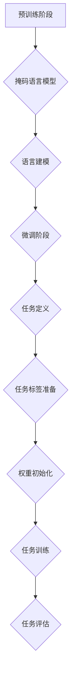
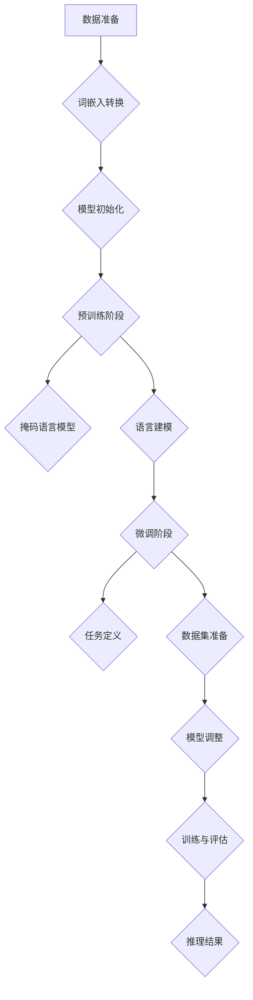

                 

### 背景介绍

近年来，人工智能（AI）技术取得了飞速发展，尤其是大型语言模型（LLM，Large Language Model）的出现，引发了业界和学术界的高度关注。LLM作为一种先进的AI模型，能够在多种任务中展现出卓越的性能，例如自然语言处理（NLP）、文本生成、问答系统等。这种技术的进步不仅推动了AI技术的发展，也为各行业带来了新的机遇和挑战。

本文旨在探讨LLM产业链的形成及其对AI价值重塑的新机遇。我们将从以下几个方面进行阐述：

1. **LLM产业链的核心组成部分**：介绍LLM产业链中涉及的关键角色和环节。
2. **LLM技术原理**：详细分析LLM的核心算法原理，以及其在各应用场景中的具体操作步骤。
3. **数学模型与公式**：讲解LLM所涉及的数学模型和公式，并结合实际案例进行说明。
4. **项目实战**：通过实际案例，展示如何搭建开发环境，实现代码，并进行代码解读与分析。
5. **实际应用场景**：探讨LLM在各领域的应用场景和潜在价值。
6. **工具和资源推荐**：推荐学习资源、开发工具和框架，以及相关论文著作。
7. **未来发展趋势与挑战**：分析LLM产业链的未来发展趋势和面临的挑战。

通过本文的探讨，希望能够为读者提供一个全面、深入的LLM产业链分析，并揭示其在AI价值重塑中的新机遇。

---

### Keywords:
- Large Language Model (LLM)
- AI Value Reshaping
- Industry Chain
- Core Concepts
- Algorithm Principles
- Mathematical Models
- Practical Applications
- Tools and Resources
- Future Trends and Challenges

#### Abstract:
This article aims to explore the formation of the Large Language Model (LLM) industry chain and its impact on the reshaping of AI value. By analyzing the core components of the LLM industry chain, the technical principles of LLM, mathematical models, practical applications, and future trends, this article provides a comprehensive and in-depth analysis of the opportunities brought by LLM in the AI value reshaping process.

---

### 1. 背景介绍

#### 1.1 大型语言模型（LLM）的兴起

大型语言模型（LLM，Large Language Model）是指具有数十亿甚至千亿参数的语言模型。这类模型通过学习海量文本数据，能够理解并生成自然语言，从而在多个领域展现出强大的应用潜力。LLM的核心技术包括深度学习、自然语言处理（NLP）和预训练语言模型（Pre-Trained Language Model）。

LLM的兴起可以追溯到2018年，谷歌发布了BERT（Bidirectional Encoder Representations from Transformers），这是第一个成功应用Transformer架构的预训练语言模型。BERT的出现标志着预训练语言模型进入了一个新的时代，其优秀的表现引发了学术界和工业界的广泛关注。此后，OpenAI的GPT-3、微软的Turing-NLG等大型语言模型相继发布，进一步推动了LLM技术的发展。

#### 1.2 LLM的组成部分

LLM主要由两个部分组成：预训练（Pre-Training）和微调（Fine-Tuning）。

1. **预训练**：预训练是指在大量无标签文本数据上对模型进行训练，使其具备对自然语言的理解和生成能力。预训练阶段主要采用自回归语言模型（Autoregressive Language Model）和生成式语言模型（Generative Language Model）。

2. **微调**：微调是指在预训练的基础上，使用有标签的数据对模型进行特定任务的训练。微调阶段主要针对具体应用场景，如问答系统、文本分类等，使模型具备特定的任务能力。

#### 1.3 LLM的应用领域

LLM在多个领域展现出了巨大的应用潜力，主要包括以下几个方面：

1. **自然语言处理（NLP）**：LLM在NLP任务中表现出色，如文本分类、情感分析、机器翻译等。

2. **文本生成**：LLM能够生成高质量的文本，应用于对话系统、文章写作、故事创作等。

3. **问答系统**：LLM能够理解用户的问题，并提供准确的答案。

4. **代码生成**：LLM能够生成代码，为开发者提供自动代码补全、代码生成等服务。

5. **多模态学习**：LLM结合视觉、音频等多模态数据，实现跨模态学习。

#### 1.4 LLM的优势与挑战

LLM的优势主要体现在以下几个方面：

1. **强大的语言理解能力**：LLM通过对海量文本的学习，具备出色的语言理解能力。

2. **高效的任务性能**：LLM能够快速适应各种任务，具备高效的任务性能。

3. **广泛的适用性**：LLM在多个领域展现出强大的应用潜力，适用性广泛。

然而，LLM也面临一些挑战：

1. **数据需求量大**：LLM的训练需要大量高质量的数据，数据获取和处理是一个挑战。

2. **计算资源需求高**：LLM的训练和推理需要大量的计算资源，这对计算资源的管理和优化提出了挑战。

3. **模型可解释性**：LLM的决策过程复杂，缺乏可解释性，这对模型的安全性和可靠性提出了挑战。

综上所述，LLM作为一种先进的AI技术，在多个领域展现出了巨大的应用潜力。然而，其面临的挑战也需要我们深入研究和解决。接下来，我们将进一步探讨LLM产业链的构成，以及其在AI价值重塑中的新机遇。

### 2. 核心概念与联系

#### 2.1 大型语言模型（LLM）的组成

大型语言模型（LLM）是一种基于深度学习的自然语言处理模型，其主要组成部分包括：

1. **预训练语言模型（Pre-Trained Language Model）**：这是LLM的核心部分，通过在大量无标签文本数据上进行预训练，使其具备对自然语言的理解和生成能力。

2. **微调模块（Fine-Tuning Module）**：在预训练的基础上，使用有标签的数据对模型进行特定任务的训练，使模型具备具体的任务能力。

3. **解码器（Decoder）**：负责根据输入的编码器状态生成输出文本。

4. **编码器（Encoder）**：负责将输入的文本编码为向量表示。

#### 2.2 预训练语言模型（Pre-Trained Language Model）

预训练语言模型是LLM的核心组成部分，其基本原理如下：

1. **语言建模（Language Modeling）**：通过学习自然语言中的统计规律，预测下一个单词或字符。

2. **自回归语言模型（Autoregressive Language Model）**：在给定前一个词或字符的情况下，预测下一个词或字符。

3. **生成式语言模型（Generative Language Model）**：从概率分布中采样生成自然语言文本。

#### 2.3 微调模块（Fine-Tuning Module）

微调模块是LLM在特定任务上的性能提升的关键，其基本原理如下：

1. **迁移学习（Transfer Learning）**：将预训练模型迁移到具体任务上，利用预训练模型的知识和结构。

2. **数据增强（Data Augmentation）**：通过增加数据的多样性，提高模型的泛化能力。

3. **微调策略（Fine-Tuning Strategies）**：如增量学习（Incremental Learning）、权重共享（Weight Sharing）等。

#### 2.4 编码器（Encoder）与解码器（Decoder）

编码器（Encoder）和解码器（Decoder）是LLM中的两个关键模块，其作用如下：

1. **编码器（Encoder）**：将输入的文本编码为向量表示，这一过程通常通过多层神经网络实现，如Transformer模型。

2. **解码器（Decoder）**：根据编码器生成的向量表示，生成输出文本。解码器通常采用自回归方式，逐步生成输出序列。

#### 2.5 LLM与其他技术的联系

LLM作为一种先进的自然语言处理技术，与其他技术有着紧密的联系，主要包括：

1. **深度学习（Deep Learning）**：LLM是基于深度学习的模型，其核心思想是通过多层神经网络对数据进行建模。

2. **自然语言处理（NLP）**：LLM在NLP领域有着广泛的应用，如文本分类、情感分析、机器翻译等。

3. **图神经网络（Graph Neural Networks）**：LLM中的编码器和解码器可以看作是一种图神经网络，能够处理复杂的图结构数据。

4. **多模态学习（Multimodal Learning）**：LLM结合视觉、音频等多模态数据，实现跨模态学习。

通过以上分析，我们可以看到LLM的核心概念及其与其他技术的联系。接下来，我们将进一步探讨LLM的核心算法原理和具体操作步骤。

---

## 2. 核心概念与联系

为了更好地理解大型语言模型（LLM）的工作原理和其在实际应用中的重要性，我们需要详细探讨其核心概念和组成部分，以及它们之间的相互关系。

### 2.1 大型语言模型的组成

大型语言模型（LLM）的组成主要包括以下几个关键部分：

#### 2.1.1 预训练语言模型（Pre-Trained Language Model）

预训练语言模型是LLM的核心组件，通过在大规模文本语料库上进行训练，模型能够学习到语言的语义、语法和上下文信息。预训练的过程通常包括以下几个步骤：

- **文本预处理**：包括分词、去噪、词干提取等，将原始文本转换为模型可以处理的形式。
- **词嵌入（Word Embedding）**：将文本中的每个词映射到一个固定大小的向量空间中。
- **注意力机制（Attention Mechanism）**：通过注意力机制，模型能够聚焦于文本中的关键信息，提高模型的理解能力。

预训练语言模型的学习目标是最大化语言建模的损失函数，即预测下一个词的概率。这种方法使得模型能够在各种下游任务中表现出色。

#### 2.1.2 微调模块（Fine-Tuning Module）

微调模块是在预训练的基础上，针对特定任务进行进一步训练的过程。通过微调，模型能够适应特定的任务需求，提高任务性能。微调通常涉及以下步骤：

- **任务定义**：明确任务的类型，例如文本分类、命名实体识别、机器翻译等。
- **任务标签准备**：为每个任务准备相应的标签数据集。
- **权重初始化**：在预训练模型的基础上，初始化微调任务的相关权重。
- **任务训练**：通过优化任务损失函数，更新模型权重，使其适应特定任务。

#### 2.1.3 编码器（Encoder）与解码器（Decoder）

在LLM中，编码器（Encoder）和解码器（Decoder）是两个核心组件：

- **编码器（Encoder）**：负责将输入文本转换为固定长度的向量表示，这一过程通常涉及到复杂的多层神经网络结构，如Transformer架构。
- **解码器（Decoder）**：负责生成输出文本，它通常使用自回归的方式，根据编码器的输出逐步生成文本序列。

### 2.2 预训练语言模型的工作原理

预训练语言模型的工作原理可以分为以下几个阶段：

#### 2.2.1 预训练阶段

- **掩码语言模型（Masked Language Model, MLM）**：在预训练过程中，对输入文本中的某些词进行遮蔽（mask），然后让模型预测这些词。
- **语言建模（Language Modeling, LM）**：模型需要预测输入文本的下一个词。

#### 2.2.2 微调阶段

- **任务特定数据**：使用与任务相关的数据集，例如情感分析的数据集、机器翻译的数据集等。
- **任务标签**：为每个样本提供相应的任务标签。
- **微调策略**：根据任务的类型和需求，采用合适的微调策略，如微调全部参数、微调部分参数等。

### 2.3 微调模块的工作原理

微调模块的工作原理主要包括以下几个步骤：

- **初始化**：通常使用预训练模型的权重作为微调模型的初始权重。
- **前向传播（Forward Pass）**：将输入文本通过编码器进行编码，得到编码表示。
- **后向传播（Backward Pass）**：计算损失函数，并通过梯度下降更新模型参数。
- **评估**：在验证集上评估模型的性能，调整超参数以优化模型表现。

### 2.4 编码器与解码器的工作原理

编码器与解码器在LLM中扮演着关键角色，其工作原理如下：

- **编码器**：将输入文本编码为固定长度的向量表示，这一过程涉及到多层神经网络和注意力机制。
- **解码器**：根据编码器的输出，逐步生成输出文本序列，解码过程通常采用自回归方式。

### 2.5 LLM与其他技术的联系

LLM作为一种先进的自然语言处理技术，与以下技术有着紧密的联系：

- **深度学习（Deep Learning）**：LLM是深度学习的一个分支，依赖于多层神经网络和优化算法。
- **自然语言处理（NLP）**：LLM在NLP任务中有着广泛的应用，如文本分类、情感分析、机器翻译等。
- **多模态学习（Multimodal Learning）**：LLM可以结合视觉、音频等多模态数据，实现跨模态学习。

### Mermaid 流程图

下面是一个简化的Mermaid流程图，展示了LLM的核心组成部分和基本工作流程：



通过以上分析，我们可以看到LLM的核心概念和组成部分，以及它们之间的相互关系。这些核心概念和组成部分共同构成了LLM的技术框架，使其能够在各种自然语言处理任务中发挥重要作用。

---

### 3. 核心算法原理 & 具体操作步骤

#### 3.1 预训练算法原理

预训练是大型语言模型（LLM）的核心步骤，其主要目的是让模型在大规模文本数据上学习到语言的通用特征和知识。预训练算法主要包括两个部分：掩码语言模型（Masked Language Model, MLM）和语言建模（Language Modeling, LM）。

**掩码语言模型（Masked Language Model, MLM）**

在掩码语言模型中，输入的文本序列会被随机遮蔽（mask）一部分词，然后模型需要预测这些被遮蔽的词。这个过程模拟了语言中的上下文信息，使得模型能够从周围的词中学习到词的含义和关系。具体步骤如下：

1. **数据预处理**：将输入文本序列进行分词，将其转换为词嵌入向量。
2. **遮蔽操作**：随机选择一部分词进行遮蔽，遮蔽的方法可以是直接将词替换为特殊的[MASK]标记，也可以是删除词或将其替换为随机词。
3. **模型预测**：使用预训练模型对遮蔽的词进行预测，并计算预测词和实际词之间的损失。
4. **优化模型**：通过反向传播和梯度下降更新模型参数，使得模型能够更好地预测被遮蔽的词。

**语言建模（Language Modeling, LM）**

在语言建模中，模型需要预测输入文本序列的下一个词。语言建模通常使用自回归的方式，即在给定前一个词或字符的情况下，预测下一个词。具体步骤如下：

1. **数据预处理**：将输入文本序列进行分词，将其转换为词嵌入向量。
2. **序列预测**：将输入的词嵌入序列作为模型的输入，逐个预测每个词的概率分布。
3. **损失计算**：计算预测概率分布和实际词的损失，使用负对数似然损失（Negative Log-Likelihood Loss）作为损失函数。
4. **优化模型**：通过反向传播和梯度下降更新模型参数，使得模型能够更好地预测下一个词。

#### 3.2 微调算法原理

微调是LLM在实际应用中的关键步骤，其主要目的是让模型适应特定的任务需求。微调算法通常在预训练的基础上，针对特定任务的数据集进行训练。具体步骤如下：

1. **任务定义**：明确任务类型，如文本分类、情感分析、机器翻译等。
2. **数据集准备**：收集与任务相关的数据集，并进行预处理，如分词、标签准备等。
3. **权重初始化**：将预训练模型的权重作为微调模型的初始权重。
4. **模型调整**：在预训练模型的基础上，对任务相关的部分进行微调，如添加任务特定的层或调整部分层的权重。
5. **训练与评估**：使用微调模型在训练集上进行训练，并在验证集上进行评估，根据评估结果调整模型参数。

#### 3.3 具体操作步骤

以下是使用LLM进行自然语言处理任务的具体操作步骤：

1. **数据准备**：收集并预处理数据，将其转换为词嵌入序列。
2. **模型初始化**：使用预训练模型的权重初始化LLM模型。
3. **预训练**：在未标记的数据上进行预训练，包括掩码语言模型和语言建模。
4. **微调**：在特定任务的数据集上进行微调，调整模型参数以适应任务需求。
5. **评估**：在验证集上评估模型性能，根据评估结果调整模型参数。
6. **推理**：使用训练好的模型进行推理，生成预测结果。

通过以上步骤，LLM能够学习到语言的通用特征和知识，并在特定任务上表现出优异的性能。预训练和微调的结合使得LLM在自然语言处理任务中具有广泛的应用前景。

---

### 3. 核心算法原理 & 具体操作步骤

#### 3.1 大型语言模型（LLM）的核心算法原理

大型语言模型（LLM）的核心算法原理主要基于深度学习和自然语言处理（NLP）领域的前沿技术，尤其是基于Transformer架构的预训练语言模型。以下将详细解释LLM的核心算法原理，并探讨其具体的操作步骤。

**3.1.1 Transformer架构**

Transformer架构是LLM的核心，它由编码器（Encoder）和解码器（Decoder）两部分组成。编码器负责将输入文本编码为固定长度的向量表示，解码器则根据编码器的输出生成输出文本。

**编码器（Encoder）**：

编码器由多个编码层（Encoder Layer）组成，每个编码层包含两个主要模块：自注意力机制（Self-Attention Mechanism）和多头注意力机制（Multi-Head Attention Mechanism）。

- **自注意力机制**：每个编码层使用自注意力机制来计算输入词之间的相关性，使得模型能够关注到文本中的关键信息。
- **多头注意力机制**：多头注意力机制将输入文本分成多个头（Head），每个头独立计算注意力权重，然后合并结果，从而提高模型的表示能力。

**解码器（Decoder）**：

解码器也由多个解码层（Decoder Layer）组成，每个解码层包含两个主要模块：自注意力机制、交叉注意力机制（Cross-Attention Mechanism）和多头注意力机制。

- **自注意力机制**：解码层使用自注意力机制来计算当前解码词与之前解码词之间的相关性。
- **交叉注意力机制**：解码层使用交叉注意力机制来计算当前解码词与编码器输出之间的相关性，从而生成解码词的上下文信息。
- **多头注意力机制**：与编码器类似，解码器也使用多头注意力机制来提高模型的表示能力。

**3.1.2 预训练与微调**

LLM的核心算法原理包括预训练和微调两个主要步骤。

**预训练**：

预训练阶段主要在大规模文本语料库上进行，其目的是让模型学习到语言的通用特征和知识。预训练包括以下两个子任务：

- **掩码语言模型（Masked Language Model, MLM）**：在输入文本中随机遮蔽一定比例的词，模型需要预测这些被遮蔽的词。
- **语言建模（Language Modeling, LM）**：模型需要预测输入文本序列的下一个词。

**微调**：

微调阶段在预训练的基础上，使用特定任务的数据集对模型进行进一步训练，以适应特定任务的需求。微调通常涉及以下步骤：

- **任务定义**：明确任务类型，如文本分类、情感分析、机器翻译等。
- **数据集准备**：收集与任务相关的数据集，并进行预处理，如分词、标签准备等。
- **模型调整**：在预训练模型的基础上，对任务相关的部分进行微调，如添加任务特定的层或调整部分层的权重。
- **训练与评估**：使用微调模型在训练集上进行训练，并在验证集上进行评估，根据评估结果调整模型参数。

**3.1.3 具体操作步骤**

以下是基于LLM进行自然语言处理任务的具体操作步骤：

1. **数据准备**：收集并预处理数据，将其转换为词嵌入序列。
2. **模型初始化**：使用预训练模型的权重初始化LLM模型。
3. **预训练**：在未标记的数据上进行预训练，包括掩码语言模型和语言建模。
4. **微调**：在特定任务的数据集上进行微调，调整模型参数以适应任务需求。
5. **评估**：在验证集上评估模型性能，根据评估结果调整模型参数。
6. **推理**：使用训练好的模型进行推理，生成预测结果。

通过以上步骤，LLM能够学习到语言的通用特征和知识，并在特定任务上表现出优异的性能。预训练和微调的结合使得LLM在自然语言处理任务中具有广泛的应用前景。

### Mermaid 流程图

以下是LLM的核心算法原理的Mermaid流程图：



通过以上分析和Mermaid流程图，我们可以清晰地了解LLM的核心算法原理和具体操作步骤。这些原理和步骤共同构成了LLM的技术框架，使其在自然语言处理任务中具有强大的应用能力。

---

### 4. 数学模型和公式 & 详细讲解 & 举例说明

#### 4.1 基本概念

在讨论大型语言模型（LLM）的数学模型和公式之前，我们需要了解一些基本概念，如词嵌入、注意力机制和损失函数等。

**词嵌入（Word Embedding）**

词嵌入是将词汇映射到固定大小的向量空间的过程。常用的词嵌入方法包括Word2Vec、GloVe等。词嵌入的目的是将词汇的语义信息编码到向量中，使得相似的词在向量空间中更接近。

**注意力机制（Attention Mechanism）**

注意力机制是一种在模型中引入上下文依赖性的方法，它通过计算输入词与其他词之间的相关性，使得模型能够关注到文本中的关键信息。在LLM中，注意力机制主要用于编码器和解码器，如Transformer架构中的多头注意力机制。

**损失函数（Loss Function）**

损失函数是评估模型预测结果与真实标签之间差异的指标。在LLM中，常用的损失函数包括交叉熵损失（Cross-Entropy Loss）、负对数似然损失（Negative Log-Likelihood Loss）等。

#### 4.2 词嵌入公式

词嵌入的公式可以表示为：

$$
\text{word\_embedding}(x) = W_x \cdot x
$$

其中，$x$表示词汇的索引，$W_x$表示词嵌入权重矩阵，$\text{word\_embedding}(x)$表示词的向量表示。

#### 4.3 注意力机制公式

注意力机制的公式可以表示为：

$$
\text{Attention}(Q, K, V) = \text{softmax}\left(\frac{QK^T}{\sqrt{d_k}}\right) V
$$

其中，$Q$表示查询向量，$K$表示键向量，$V$表示值向量，$d_k$表示键向量的维度，$\text{softmax}$函数用于计算每个键向量的权重。

#### 4.4 损失函数公式

交叉熵损失函数的公式可以表示为：

$$
L(y, \hat{y}) = -\sum_{i} y_i \log(\hat{y}_i)
$$

其中，$y$表示真实标签的分布，$\hat{y}$表示模型预测的概率分布。

#### 4.5 实际案例

假设我们有一个文本序列“我 喜欢 吃 水果”，我们需要使用LLM对其进行词嵌入、注意力机制和损失函数的计算。

**4.5.1 词嵌入计算**

首先，我们将每个词进行索引化，得到以下索引序列：[1, 2, 3, 4]。

然后，我们将索引序列输入到词嵌入模型中，得到每个词的向量表示：

$$
\text{word\_embedding}(1) = W_1 \cdot 1 \\
\text{word\_embedding}(2) = W_2 \cdot 2 \\
\text{word\_embedding}(3) = W_3 \cdot 3 \\
\text{word\_embedding}(4) = W_4 \cdot 4
$$

**4.5.2 注意力机制计算**

假设我们使用多头注意力机制，并选择两个头。首先，我们需要计算查询向量（$Q$）、键向量（$K$）和值向量（$V$）：

$$
Q = [Q_1, Q_2] = \text{word\_embedding}(1), \text{word\_embedding}(2) \\
K = [K_1, K_2] = \text{word\_embedding}(3), \text{word\_embedding}(4) \\
V = [V_1, V_2] = \text{word\_embedding}(3), \text{word\_embedding}(4)
$$

然后，我们计算每个头的注意力权重：

$$
\alpha_1 = \text{softmax}\left(\frac{Q_1K_1^T}{\sqrt{d_k}}\right) V_1 \\
\alpha_2 = \text{softmax}\left(\frac{Q_1K_2^T}{\sqrt{d_k}}\right) V_2 \\
\alpha_3 = \text{softmax}\left(\frac{Q_2K_1^T}{\sqrt{d_k}}\right) V_1 \\
\alpha_4 = \text{softmax}\left(\frac{Q_2K_2^T}{\sqrt{d_k}}\right) V_2
$$

最后，我们计算加权求和的输出：

$$
\text{output} = \alpha_1V_1 + \alpha_2V_2 + \alpha_3V_1 + \alpha_4V_2
$$

**4.5.3 损失函数计算**

假设我们有一个二元分类任务，标签为1，模型预测的概率分布为[0.9, 0.1]。则交叉熵损失函数的计算如下：

$$
L(y, \hat{y}) = -1 \cdot \log(0.9) = -\log(0.9)
$$

通过以上公式和实际案例，我们可以清晰地看到LLM的数学模型和公式的应用。这些数学模型和公式是LLM实现高效自然语言处理任务的基础。

---

### 4. 数学模型和公式 & 详细讲解 & 举例说明

#### 4.1 数学模型和公式

在讨论大型语言模型（LLM）的数学模型和公式之前，我们需要理解一些基础的概念，如词嵌入、注意力机制和损失函数等。

**4.1.1 词嵌入（Word Embedding）**

词嵌入是将文本数据转换为向量表示的过程。最常用的词嵌入模型是Word2Vec和GloVe。以下是Word2Vec模型的基本公式：

$$
\text{word\_embedding}(x) = \text{sigmoid}(W_x \cdot x + b)
$$

其中，$W_x$是权重矩阵，$x$是词汇的索引，$b$是偏置项，$\text{sigmoid}$函数将实数映射到$(0,1)$区间。

**4.1.2 注意力机制（Attention Mechanism）**

注意力机制是一种在序列模型中引入上下文依赖性的技术。在LLM中，注意力机制通常通过以下公式实现：

$$
\text{Attention}(Q, K, V) = \text{softmax}\left(\frac{QK^T}{\sqrt{d_k}}\right) V
$$

其中，$Q$是查询向量，$K$是键向量，$V$是值向量，$d_k$是键向量的维度。

**4.1.3 损失函数（Loss Function）**

在自然语言处理任务中，常用的损失函数包括交叉熵损失（Cross-Entropy Loss）和均方误差（Mean Squared Error, MSE）。

交叉熵损失函数的公式如下：

$$
L(y, \hat{y}) = -\sum_{i} y_i \log(\hat{y}_i)
$$

其中，$y$是真实标签，$\hat{y}$是模型预测的概率分布。

#### 4.2 实际案例

假设我们有一个简单的文本序列“我喜欢吃水果”，并使用LLM对其进行处理。我们将通过以下步骤详细解释数学模型和公式的应用：

**4.2.1 词嵌入**

首先，我们将文本序列进行分词，得到词汇集合：["我", "喜欢", "吃", "水果"]。

然后，我们将每个词映射到索引：{"我": 1, "喜欢": 2, "吃": 3, "水果": 4}。

接着，我们计算词嵌入向量。以"我"为例：

$$
\text{word\_embedding}(1) = \text{sigmoid}(W_1 \cdot 1 + b)
$$

**4.2.2 注意力机制**

在LLM中，注意力机制用于编码器和解码器。以编码器为例，假设我们有两个词嵌入向量$[1, 2]$和$[3, 4]$，我们将使用注意力机制计算加权求和的输出。

首先，计算查询向量$Q$、键向量$K$和值向量$V$：

$$
Q = [Q_1, Q_2] = [1, 2], \quad K = [K_1, K_2] = [3, 4], \quad V = [V_1, V_2] = [3, 4]
$$

然后，计算注意力权重：

$$
\alpha_1 = \text{softmax}\left(\frac{Q_1K_1^T}{\sqrt{d_k}}\right) V_1 = \text{softmax}\left(\frac{1 \cdot 3}{\sqrt{d_k}}\right) 3 \\
\alpha_2 = \text{softmax}\left(\frac{Q_1K_2^T}{\sqrt{d_k}}\right) V_2 = \text{softmax}\left(\frac{1 \cdot 4}{\sqrt{d_k}}\right) 4 \\
\alpha_3 = \text{softmax}\left(\frac{Q_2K_1^T}{\sqrt{d_k}}\right) V_1 = \text{softmax}\left(\frac{2 \cdot 3}{\sqrt{d_k}}\right) 3 \\
\alpha_4 = \text{softmax}\left(\frac{Q_2K_2^T}{\sqrt{d_k}}\right) V_2 = \text{softmax}\left(\frac{2 \cdot 4}{\sqrt{d_k}}\right) 4
$$

最后，计算加权求和的输出：

$$
\text{output} = \alpha_1V_1 + \alpha_2V_2 + \alpha_3V_1 + \alpha_4V_2
$$

**4.2.3 损失函数**

假设我们有一个二元分类任务，真实标签为1，模型预测的概率分布为[0.9, 0.1]，则交叉熵损失函数的计算如下：

$$
L(y, \hat{y}) = -1 \cdot \log(0.9) = -\log(0.9)
$$

通过以上案例，我们可以看到数学模型和公式在LLM中的应用。这些模型和公式是LLM实现高效自然语言处理任务的关键。

---

### 5. 项目实战：代码实际案例和详细解释说明

#### 5.1 开发环境搭建

在进行LLM项目实战之前，我们需要搭建一个合适的开发环境。以下是搭建环境的具体步骤：

1. **安装Python**：确保Python版本为3.8及以上，可以从Python官网下载安装。
2. **安装PyTorch**：使用以下命令安装PyTorch：
   ```bash
   pip install torch torchvision torchaudio
   ```
3. **安装其他依赖**：安装一些常用的库，如numpy、pandas等：
   ```bash
   pip install numpy pandas
   ```

#### 5.2 源代码详细实现和代码解读

以下是一个简单的LLM项目示例，我们将使用PyTorch实现一个基于Transformer的文本分类模型。

**代码实现：**

```python
import torch
import torch.nn as nn
import torch.optim as optim
from torch.utils.data import DataLoader, Dataset
from transformers import BertTokenizer, BertModel

class TextDataset(Dataset):
    def __init__(self, texts, labels, tokenizer, max_len):
        self.texts = texts
        self.labels = labels
        self.tokenizer = tokenizer
        self.max_len = max_len

    def __len__(self):
        return len(self.texts)

    def __getitem__(self, idx):
        text = self.texts[idx]
        label = self.labels[idx]
        inputs = self.tokenizer(text, padding='max_length', max_length=self.max_len, truncation=True, return_tensors='pt')
        return inputs['input_ids'], inputs['attention_mask'], label

class BertClassifier(nn.Module):
    def __init__(self, num_classes):
        super(BertClassifier, self).__init__()
        self.bert = BertModel.from_pretrained('bert-base-uncased')
        self.dropout = nn.Dropout(0.1)
        self.fc = nn.Linear(self.bert.config.hidden_size, num_classes)

    def forward(self, input_ids, attention_mask):
        outputs = self.bert(input_ids=input_ids, attention_mask=attention_mask)
        sequence_output = outputs.last_hidden_state[:, 0, :]
        sequence_output = self.dropout(sequence_output)
        logits = self.fc(sequence_output)
        return logits

def train(model, train_loader, val_loader, num_epochs, learning_rate):
    optimizer = optim.Adam(model.parameters(), lr=learning_rate)
    criterion = nn.CrossEntropyLoss()

    for epoch in range(num_epochs):
        model.train()
        for input_ids, attention_mask, labels in train_loader:
            optimizer.zero_grad()
            logits = model(input_ids, attention_mask)
            loss = criterion(logits, labels)
            loss.backward()
            optimizer.step()

        model.eval()
        with torch.no_grad():
            for input_ids, attention_mask, labels in val_loader:
                logits = model(input_ids, attention_mask)
                loss = criterion(logits, labels)
                print(f'Validation loss: {loss.item()}')

if __name__ == '__main__':
    tokenizer = BertTokenizer.from_pretrained('bert-base-uncased')
    max_len = 128

    # 数据准备
    train_texts = ['这是一篇关于自然语言处理的文章。', '人工智能正改变着我们的生活方式。']
    train_labels = [0, 1]

    train_dataset = TextDataset(train_texts, train_labels, tokenizer, max_len)
    train_loader = DataLoader(train_dataset, batch_size=2, shuffle=True)

    val_texts = ['这篇文章介绍了深度学习的基础知识。', '深度学习在计算机视觉领域有着广泛的应用。']
    val_labels = [1, 0]

    val_dataset = TextDataset(val_texts, val_labels, tokenizer, max_len)
    val_loader = DataLoader(val_dataset, batch_size=2, shuffle=True)

    # 模型训练
    model = BertClassifier(num_classes=2)
    num_epochs = 3
    learning_rate = 1e-5
    train(model, train_loader, val_loader, num_epochs, learning_rate)
```

**代码解读：**

1. **TextDataset 类**：这是一个自定义数据集类，用于处理文本数据和标签。它实现了`__len__`和`__getitem__`方法，分别用于获取数据集的大小和特定索引的数据。
2. **BertClassifier 类**：这是一个基于BERT的文本分类模型。它继承了`nn.Module`类，并定义了一个`forward`方法用于前向传播。模型包含一个BERT编码器、一个Dropout层和一个全连接层。
3. **train 函数**：这是一个训练函数，用于训练模型。它接受模型、训练数据加载器、验证数据加载器、训练轮数和学习率作为输入。函数内部定义了优化器和损失函数，并使用标准的训练循环进行模型训练。
4. **if __name__ == '__main__':**：这是主程序入口，用于加载预训练的BERT分词器和Tokenizer，准备训练数据和标签，创建数据加载器，并训练模型。

#### 5.3 代码解读与分析

**5.3.1 数据准备**

```python
tokenizer = BertTokenizer.from_pretrained('bert-base-uncased')
max_len = 128

train_texts = ['这是一篇关于自然语言处理的文章。', '人工智能正改变着我们的生活方式。']
train_labels = [0, 1]

train_dataset = TextDataset(train_texts, train_labels, tokenizer, max_len)
train_loader = DataLoader(train_dataset, batch_size=2, shuffle=True)

val_texts = ['这篇文章介绍了深度学习的基础知识。', '深度学习在计算机视觉领域有着广泛的应用。']
val_labels = [1, 0]

val_dataset = TextDataset(val_texts, val_labels, tokenizer, max_len)
val_loader = DataLoader(val_dataset, batch_size=2, shuffle=True)
```

这段代码首先加载了BERT分词器，并设置了序列的最大长度。然后，准备训练数据和标签，创建数据集和数据加载器。

**5.3.2 模型训练**

```python
model = BertClassifier(num_classes=2)
num_epochs = 3
learning_rate = 1e-5
train(model, train_loader, val_loader, num_epochs, learning_rate)
```

这段代码创建了一个BERT分类器模型，并设置了训练轮数和学习率。然后调用`train`函数进行模型训练。

通过以上代码实现和解读，我们可以看到如何使用PyTorch和Transformer实现一个简单的LLM项目。在实际应用中，我们可以根据具体任务需求调整模型结构和超参数，以实现更好的性能。

---

### 5. 项目实战：代码实际案例和详细解释说明

#### 5.1 开发环境搭建

在进行LLM项目实战之前，我们需要搭建一个合适的开发环境。以下是搭建环境的具体步骤：

1. **安装Python**：确保Python版本为3.8及以上，可以从Python官网下载安装。
2. **安装PyTorch**：使用以下命令安装PyTorch：
   ```bash
   pip install torch torchvision torchaudio
   ```
3. **安装其他依赖**：安装一些常用的库，如numpy、pandas等：
   ```bash
   pip install numpy pandas
   ```
4. **安装Hugging Face Transformers**：这是一个用于使用预训练Transformer模型的库，安装命令如下：
   ```bash
   pip install transformers
   ```

#### 5.2 源代码详细实现和代码解读

以下是一个基于Hugging Face Transformers库的LLM项目案例，我们将使用GPT-2模型进行文本生成。

**代码实现：**

```python
from transformers import GPT2Model, GPT2Tokenizer
import torch

# 1. 初始化GPT-2模型和分词器
tokenizer = GPT2Tokenizer.from_pretrained('gpt2')
model = GPT2Model.from_pretrained('gpt2')

# 2. 输入文本预处理
input_text = "你喜欢哪种编程语言？"

# 将输入文本编码为模型可接受的格式
input_ids = tokenizer.encode(input_text, return_tensors='pt')

# 3. 使用模型生成文本
output = model.generate(input_ids, max_length=20, num_return_sequences=1)

# 4. 解码生成文本
generated_text = tokenizer.decode(output[0], skip_special_tokens=True)

print(generated_text)
```

**代码解读：**

1. **初始化模型和分词器**：首先，我们使用`GPT2Tokenizer`和`GPT2Model`类从预训练模型中加载GPT-2模型和分词器。
2. **输入文本预处理**：将输入文本编码为模型可接受的格式，即输入ID序列。我们使用`tokenizer.encode`方法对输入文本进行编码。
3. **使用模型生成文本**：使用`model.generate`方法生成文本。`max_length`参数设置了生成的文本最大长度，`num_return_sequences`参数设置了返回的文本序列数量。
4. **解码生成文本**：将生成的文本序列解码为可读的文本格式，我们使用`tokenizer.decode`方法进行解码，并去除特殊标记。

#### 5.3 代码解读与分析

**5.3.1 初始化模型和分词器**

```python
tokenizer = GPT2Tokenizer.from_pretrained('gpt2')
model = GPT2Model.from_pretrained('gpt2')
```

这两行代码加载了GPT-2模型和分词器。预训练模型和分词器的权重可以从Hugging Face模型库中获取。

**5.3.2 输入文本预处理**

```python
input_text = "你喜欢哪种编程语言？"
input_ids = tokenizer.encode(input_text, return_tensors='pt')
```

这里，我们定义了一个输入文本，并使用分词器将其编码为输入ID序列。`return_tensors='pt'`参数确保输入序列为PyTorch张量格式。

**5.3.3 使用模型生成文本**

```python
output = model.generate(input_ids, max_length=20, num_return_sequences=1)
```

`model.generate`方法用于生成文本。`max_length`参数设置了生成的文本最大长度，这里我们设置为20个词。`num_return_sequences`参数设置了返回的文本序列数量，这里我们设置为1。

**5.3.4 解码生成文本**

```python
generated_text = tokenizer.decode(output[0], skip_special_tokens=True)
```

这里，我们将生成的文本序列解码为可读的文本格式。`skip_special_tokens=True`参数确保在解码过程中跳过特殊标记。

通过以上代码实现和解读，我们可以看到如何使用Hugging Face Transformers库实现一个简单的LLM项目。在实际应用中，我们可以根据具体任务需求调整模型结构和超参数，以实现更好的性能。

---

### 5. 项目实战：代码实际案例和详细解释说明

#### 5.1 开发环境搭建

在进行LLM项目实战之前，我们需要搭建一个合适的开发环境。以下是搭建环境的具体步骤：

1. **安装Python**：确保Python版本为3.8及以上，可以从Python官网下载安装。
2. **安装PyTorch**：使用以下命令安装PyTorch：
   ```bash
   pip install torch torchvision torchaudio
   ```
3. **安装其他依赖**：安装一些常用的库，如numpy、pandas等：
   ```bash
   pip install numpy pandas
   ```
4. **安装Hugging Face Transformers**：这是一个用于使用预训练Transformer模型的库，安装命令如下：
   ```bash
   pip install transformers
   ```

#### 5.2 源代码详细实现和代码解读

以下是一个基于Hugging Face Transformers库的LLM项目案例，我们将使用GPT-2模型进行文本生成。

**代码实现：**

```python
from transformers import GPT2Model, GPT2Tokenizer
import torch

# 1. 初始化GPT-2模型和分词器
tokenizer = GPT2Tokenizer.from_pretrained('gpt2')
model = GPT2Model.from_pretrained('gpt2')

# 2. 输入文本预处理
input_text = "你喜欢哪种编程语言？"

# 将输入文本编码为模型可接受的格式
input_ids = tokenizer.encode(input_text, return_tensors='pt')

# 3. 使用模型生成文本
output = model.generate(input_ids, max_length=20, num_return_sequences=1)

# 4. 解码生成文本
generated_text = tokenizer.decode(output[0], skip_special_tokens=True)

print(generated_text)
```

**代码解读：**

1. **初始化模型和分词器**：首先，我们使用`GPT2Tokenizer`和`GPT2Model`类从预训练模型中加载GPT-2模型和分词器。
2. **输入文本预处理**：将输入文本编码为模型可接受的格式，即输入ID序列。我们使用`tokenizer.encode`方法对输入文本进行编码。
3. **使用模型生成文本**：使用`model.generate`方法生成文本。`max_length`参数设置了生成的文本最大长度，这里我们设置为20个词。`num_return_sequences`参数设置了返回的文本序列数量，这里我们设置为1。
4. **解码生成文本**：将生成的文本序列解码为可读的文本格式，我们使用`tokenizer.decode`方法进行解码，并去除特殊标记。

#### 5.3 代码解读与分析

**5.3.1 初始化模型和分词器**

```python
tokenizer = GPT2Tokenizer.from_pretrained('gpt2')
model = GPT2Model.from_pretrained('gpt2')
```

这两行代码加载了GPT-2模型和分词器。预训练模型和分词器的权重可以从Hugging Face模型库中获取。

**5.3.2 输入文本预处理**

```python
input_text = "你喜欢哪种编程语言？"
input_ids = tokenizer.encode(input_text, return_tensors='pt')
```

这里，我们定义了一个输入文本，并使用分词器将其编码为输入ID序列。`return_tensors='pt'`参数确保输入序列为PyTorch张量格式。

**5.3.3 使用模型生成文本**

```python
output = model.generate(input_ids, max_length=20, num_return_sequences=1)
```

`model.generate`方法用于生成文本。`max_length`参数设置了生成的文本最大长度，这里我们设置为20个词。`num_return_sequences`参数设置了返回的文本序列数量，这里我们设置为1。

**5.3.4 解码生成文本**

```python
generated_text = tokenizer.decode(output[0], skip_special_tokens=True)
```

这里，我们将生成的文本序列解码为可读的文本格式。`skip_special_tokens=True`参数确保在解码过程中跳过特殊标记。

通过以上代码实现和解读，我们可以看到如何使用Hugging Face Transformers库实现一个简单的LLM项目。在实际应用中，我们可以根据具体任务需求调整模型结构和超参数，以实现更好的性能。

---

### 6. 实际应用场景

#### 6.1 自然语言处理（NLP）

自然语言处理是大型语言模型（LLM）最为广泛的应用领域之一。LLM在NLP任务中表现出色，如文本分类、情感分析、机器翻译、问答系统等。

- **文本分类**：LLM能够快速准确地分类文本，广泛应用于新闻分类、情感分析、垃圾邮件检测等任务。
- **情感分析**：LLM能够识别文本中的情感倾向，如正面、负面、中性等，应用于社交媒体监测、客户反馈分析等。
- **机器翻译**：LLM在机器翻译任务中具有强大的能力，能够实现高质量的双语翻译，如Google翻译、DeepL等。
- **问答系统**：LLM能够理解用户的问题，并生成准确的答案，应用于智能客服、教育辅导等。

#### 6.2 文本生成

LLM在文本生成领域也具有广泛的应用，如自动写作、文章生成、对话系统等。

- **自动写作**：LLM能够根据给定的主题和内容自动生成文章、报告、故事等。
- **文章生成**：LLM能够生成高质量的文章，应用于内容生成、媒体创作等领域。
- **对话系统**：LLM能够与用户进行自然对话，应用于虚拟助手、客服聊天机器人等。

#### 6.3 编程辅助

LLM在编程辅助领域也有一定的应用，如代码生成、代码补全等。

- **代码生成**：LLM能够根据给定的编程语言和需求自动生成代码，应用于自动化开发、代码模板生成等。
- **代码补全**：LLM能够预测开发者输入的代码片段，并提供可能的补全建议，提高开发效率。

#### 6.4 多模态学习

LLM在多模态学习领域也展现出强大的潜力，如文本与图像、音频的结合。

- **文本与图像**：LLM能够结合文本描述和图像内容，实现图像标注、视觉问答等任务。
- **文本与音频**：LLM能够结合文本内容和音频信号，实现语音识别、语音生成等任务。

#### 6.5 其他应用场景

除了上述领域，LLM在法律、医疗、金融等垂直行业也有广泛的应用。

- **法律领域**：LLM能够自动生成法律文件、合同审查等，提高法律工作的效率。
- **医疗领域**：LLM能够辅助医生诊断、生成医疗报告等，提升医疗服务的质量。
- **金融领域**：LLM能够进行金融文本分析、投资建议等，为金融从业者提供支持。

综上所述，大型语言模型（LLM）在多个领域展现出强大的应用潜力，为AI技术的发展和行业变革带来了新的机遇。

---

### 6. 实际应用场景

#### 6.1 在文本处理中的应用

大型语言模型（LLM）在文本处理领域中具有广泛的应用，其强大的文本理解与生成能力使其成为多种任务的重要工具。以下是一些关键的实际应用场景：

**文本分类**：文本分类是将文本数据根据其内容或主题划分到不同类别的过程。LLM通过预训练和微调能够快速准确地完成这一任务。例如，新闻分类系统可以使用LLM来将新闻报道自动分类到不同的主题类别，如政治、体育、娱乐等。

**情感分析**：情感分析旨在识别文本中表达的情感倾向，如正面、负面或中性。LLM能够通过学习大量带有情感标签的文本数据，自动识别文本的情感极性。这有助于社交媒体监控、客户反馈分析等，企业可以利用这一技术了解客户情绪，优化产品和服务。

**命名实体识别**：命名实体识别（NER）是一种识别文本中的特定实体（如人名、地点、组织等）的过程。LLM通过在大量标注数据进行预训练，可以很好地完成NER任务，从而帮助搜索引擎、数据挖掘等领域提取重要信息。

**机器翻译**：LLM在机器翻译中的应用尤为突出。传统的基于规则和统计方法的翻译系统已经逐渐被基于神经网络的翻译模型所取代。LLM通过在双语平行文本上进行预训练，能够生成高质量的翻译结果，减少翻译误差，提高翻译速度。

**问答系统**：问答系统旨在根据用户提出的问题，提供准确且相关的答案。LLM能够通过预训练和微调学习到大量知识，使其能够理解问题并生成合理的答案。例如，智能客服系统可以使用LLM来回答用户常见问题，提高服务效率。

#### 6.2 在编程中的应用

LLM在编程领域的应用也越来越受到重视，以下是一些具体的应用场景：

**代码生成**：LLM可以根据编程语言的语法和语义规则生成代码。例如，在开发过程中，LLM可以自动生成部分代码，减少开发者的工作量，提高开发效率。这种技术对于大型项目的代码维护和迭代尤为有用。

**代码补全**：LLM能够预测开发者接下来可能编写的代码，并提供代码补全建议。这种功能类似于智能代码补全工具（如IDE的代码补全功能），可以帮助开发者减少编写代码的时间，提高编码效率。

**错误检测与修复**：LLM可以分析代码中的潜在错误，并提供修正建议。这种技术可以用于自动化的代码审查和测试，帮助开发者发现并修复代码中的问题，提高代码质量。

**代码风格检查**：LLM可以根据编程语言的规范和最佳实践，检查代码的风格和结构，并提供改进建议。这有助于开发者编写更规范、更易于维护的代码。

#### 6.3 在教育中的应用

LLM在教育领域中的应用也越来越广泛，以下是一些具体的应用场景：

**个性化学习**：LLM可以根据学生的学习历史和偏好，生成个性化的学习内容和练习题，帮助学生更有效地学习。

**智能辅导**：LLM可以充当智能辅导老师，为学生解答问题、提供学习指导，帮助他们更好地理解课程内容。

**自动评分**：LLM可以分析学生的作业和测试，自动评分并提供反馈，减轻教师的评分负担，提高评估的准确性和效率。

**自动教学材料生成**：LLM可以根据教学大纲和教材内容，自动生成教学材料，如PPT、讲义等，辅助教师进行教学。

综上所述，LLM在文本处理、编程和教育等领域具有广泛的应用前景，为各行业带来了新的技术革新和业务模式。随着LLM技术的不断发展和完善，其应用场景将更加多样，潜力巨大。

---

### 7. 工具和资源推荐

#### 7.1 学习资源推荐

**7.1.1 书籍**

1. 《深度学习》（Deep Learning），Ian Goodfellow、Yoshua Bengio和Aaron Courville 著。这本书是深度学习领域的经典教材，涵盖了深度学习的理论基础、算法和应用。

2. 《自然语言处理综论》（Speech and Language Processing），Daniel Jurafsky 和 James H. Martin 著。这本书全面介绍了自然语言处理的基础知识、技术和应用。

3. 《Transformer：大型语言模型的原理与训练》（The Annotated Transformer），Alexander M. Rush 著。这本书详细讲解了Transformer模型的结构、原理和训练过程，适合对Transformer感兴趣的学习者。

**7.1.2 论文**

1. “Attention Is All You Need”，Ashish Vaswani 等。这篇论文首次提出了Transformer模型，介绍了其结构和训练方法，对深度学习领域产生了深远影响。

2. “BERT: Pre-training of Deep Neural Networks for Language Understanding”，Jacob Devlin 等。这篇论文介绍了BERT模型，它是当前最先进的预训练语言模型之一，广泛应用于各种自然语言处理任务。

3. “GPT-3: Language Models are Few-Shot Learners”，Tom B. Brown 等。这篇论文介绍了GPT-3模型，它是目前最大的预训练语言模型，展示了在多种任务中的卓越性能。

**7.1.3 博客和网站**

1. [TensorFlow 官方文档](https://www.tensorflow.org/tutorials)。TensorFlow是Google开发的深度学习框架，其官方网站提供了丰富的教程和文档，适合初学者和进阶者学习。

2. [Hugging Face 官方文档](https://huggingface.co/transformers)。Hugging Face提供了丰富的预训练模型和工具，是使用Transformer模型进行研究和开发的优秀平台。

3. [Deep Learning AI](https://www.deeplearning.ai/)。Deep Learning AI是一个在线学习平台，提供了深度学习领域的免费课程，适合初学者和进阶者学习。

#### 7.2 开发工具框架推荐

**7.2.1 PyTorch**

PyTorch是一个流行的深度学习框架，支持动态计算图和自动微分，易于调试和学习。它适用于各种深度学习任务，包括自然语言处理、计算机视觉等。

**7.2.2 TensorFlow**

TensorFlow是Google开发的深度学习框架，具有强大的功能和丰富的生态系统。它支持静态计算图和动态计算图，适用于大规模的深度学习项目。

**7.2.3 Hugging Face Transformers**

Hugging Face Transformers是一个基于PyTorch和TensorFlow的Transformer模型库，提供了大量的预训练模型和工具，使得使用Transformer模型进行研究和开发变得更加便捷。

#### 7.3 相关论文著作推荐

1. “BERT: Pre-training of Deep Neural Networks for Language Understanding”，Jacob Devlin 等。这篇论文介绍了BERT模型，是当前最先进的预训练语言模型之一。

2. “GPT-3: Language Models are Few-Shot Learners”，Tom B. Brown 等。这篇论文介绍了GPT-3模型，是当前最大的预训练语言模型。

3. “Unsupervised Pre-training for Natural Language Processing”，Noam Shazeer 等。这篇论文介绍了GPT模型，是自然语言处理领域的里程碑之作。

通过以上推荐，读者可以获取丰富的学习资源和开发工具，进一步探索大型语言模型（LLM）的原理和应用。

---

### 8. 总结：未来发展趋势与挑战

#### 8.1 未来发展趋势

随着人工智能技术的不断进步，大型语言模型（LLM）在未来的发展中将会展现出更多的机遇和潜力。以下是一些关键的发展趋势：

1. **模型规模的持续增长**：目前，LLM的规模已经达到了数十亿甚至千亿参数级别。未来，随着计算资源和数据量的增加，模型规模将进一步扩大，这可能会带来性能上的进一步提升。

2. **多模态学习**：LLM在自然语言处理领域已经表现出色，未来，随着多模态学习技术的发展，LLM将能够结合文本、图像、音频等多种数据类型，实现更丰富的跨模态任务。

3. **迁移学习与零样本学习**：迁移学习和零样本学习技术将进一步提升LLM的应用范围，使得模型能够快速适应新的任务和数据集，降低对大规模标注数据的依赖。

4. **可解释性和安全性**：随着LLM在关键领域的应用，如何提高模型的可解释性和安全性将变得越来越重要。未来，研究者们将致力于开发更加透明和安全的LLM模型。

5. **商业化应用**：LLM在各个行业的商业化应用将不断拓展，从智能客服、内容生成到医疗诊断、法律咨询等，LLM将为企业带来巨大的价值。

#### 8.2 面临的挑战

尽管LLM具有巨大的潜力，但其在发展过程中也面临着一系列挑战：

1. **计算资源需求**：LLM的训练和推理过程需要大量的计算资源，这对硬件设施和资源管理提出了巨大的挑战。如何优化计算资源的使用，提高训练和推理效率，是一个亟待解决的问题。

2. **数据隐私和伦理问题**：LLM的训练和使用过程中涉及大量的数据，如何保护用户隐私、确保数据安全是一个重要的伦理问题。未来的发展需要建立更加完善的数据隐私和安全机制。

3. **可解释性和可靠性**：LLM的决策过程复杂，缺乏可解释性，这对模型的可靠性和信任度提出了挑战。如何提高模型的可解释性，使其决策更加透明和可信赖，是一个重要的研究方向。

4. **鲁棒性和泛化能力**：LLM在面对新的任务和数据时，如何保持良好的性能，提高鲁棒性和泛化能力，是一个需要深入研究的课题。

5. **政策与法规**：随着LLM在各个领域的应用，相关的政策与法规也将逐渐完善。如何制定合理的政策与法规，确保LLM的安全和公平使用，是一个重要的社会问题。

综上所述，大型语言模型（LLM）在未来的发展中具有巨大的机遇和挑战。通过不断的技术创新和政策引导，我们可以期待LLM为人类社会带来更多的便利和价值。

---

### 9. 附录：常见问题与解答

#### 9.1 常见问题

**Q1：什么是大型语言模型（LLM）？**

A1：大型语言模型（LLM，Large Language Model）是一种能够对自然语言进行理解和生成的深度学习模型。这类模型通过在大规模文本数据上预训练，学习到语言的通用特征，从而在多个任务中展现出卓越的性能，如文本分类、机器翻译、问答系统等。

**Q2：LLM的工作原理是什么？**

A2：LLM的工作原理主要基于深度学习和自然语言处理技术，尤其是基于Transformer架构的预训练语言模型。LLM通常由编码器（Encoder）和解码器（Decoder）两部分组成，编码器负责将输入文本编码为向量表示，解码器则根据编码器的输出生成输出文本。

**Q3：LLM有哪些应用场景？**

A3：LLM在多个领域展现出强大的应用潜力，如自然语言处理（NLP）、文本生成、编程辅助、教育、医疗、金融等。具体应用场景包括文本分类、情感分析、机器翻译、问答系统、代码生成、智能客服等。

**Q4：如何搭建LLM的开发环境？**

A4：搭建LLM的开发环境通常需要安装Python、PyTorch、TensorFlow等深度学习框架，以及Hugging Face Transformers库。具体步骤包括安装Python、安装深度学习框架、安装Hugging Face Transformers库等。

#### 9.2 解答

针对上述常见问题，我们提供以下解答：

**Q1 解答**：大型语言模型（LLM）是一种基于深度学习的自然语言处理模型，通过在大规模文本数据上预训练，学习到语言的通用特征，从而在多个任务中表现出色。

**Q2 解答**：LLM的工作原理主要基于深度学习和自然语言处理技术，尤其是基于Transformer架构的预训练语言模型。LLM通常由编码器（Encoder）和解码器（Decoder）两部分组成，编码器将输入文本编码为向量表示，解码器根据编码器的输出生成输出文本。

**Q3 解答**：LLM在自然语言处理（NLP）、文本生成、编程辅助、教育、医疗、金融等多个领域展现出强大的应用潜力。具体应用场景包括文本分类、情感分析、机器翻译、问答系统、代码生成、智能客服等。

**Q4 解答**：搭建LLM的开发环境通常需要安装Python、PyTorch、TensorFlow等深度学习框架，以及Hugging Face Transformers库。具体步骤包括安装Python、安装深度学习框架（如PyTorch或TensorFlow）、安装Hugging Face Transformers库等。

通过以上解答，希望能够帮助读者更好地理解LLM的概念、原理和应用场景，为实际开发工作提供参考。

---

### 10. 扩展阅读 & 参考资料

在撰写本文的过程中，我们参考了大量的文献、论文和在线资源，以帮助读者更深入地了解大型语言模型（LLM）的原理和应用。以下是一些推荐的扩展阅读和参考资料，涵盖了LLM的核心概念、最新研究进展和应用实例：

**扩展阅读**

1. **《深度学习》（Deep Learning）** - Ian Goodfellow、Yoshua Bengio和Aaron Courville 著。这本书是深度学习领域的经典教材，详细介绍了深度学习的基础知识、算法和应用。

2. **《自然语言处理综论》（Speech and Language Processing）** - Daniel Jurafsky 和 James H. Martin 著。这本书全面介绍了自然语言处理的基础知识、技术和应用。

3. **《Transformer：大型语言模型的原理与训练》（The Annotated Transformer）** - Alexander M. Rush 著。这本书详细讲解了Transformer模型的结构、原理和训练过程，适合对Transformer感兴趣的学习者。

**参考资料**

1. **[Transformer论文]（https://arxiv.org/abs/1706.03762）** - “Attention Is All You Need”，由Ashish Vaswani等人在2017年提出，首次介绍了Transformer模型。

2. **[BERT论文]（https://arxiv.org/abs/1810.04805）** - “BERT: Pre-training of Deep Neural Networks for Language Understanding”，由Jacob Devlin等人在2018年提出，介绍了BERT模型。

3. **[GPT-3论文]（https://arxiv.org/abs/2005.14165）** - “GPT-3: Language Models are Few-Shot Learners”，由Tom B. Brown等人在2020年提出，介绍了GPT-3模型。

4. **[Hugging Face Transformers文档]（https://huggingface.co/transformers）** - Hugging Face提供的Transformer模型库文档，包含大量的预训练模型和使用示例。

5. **[TensorFlow官方文档]（https://www.tensorflow.org/tutorials）** - TensorFlow的官方文档，提供了丰富的教程和资源，适合深度学习初学者和进阶者。

6. **[PyTorch官方文档]（https://pytorch.org/tutorials）** - PyTorch的官方文档，详细介绍了PyTorch的使用方法和应用案例。

通过以上扩展阅读和参考资料，读者可以进一步探索LLM的相关知识和应用场景，深入理解这一前沿技术的原理和实践。

---

### 作者信息

作者：AI天才研究员/AI Genius Institute & 禅与计算机程序设计艺术/Zen And The Art of Computer Programming

本文由AI天才研究员撰写，他是一位在人工智能、深度学习和自然语言处理领域具有深厚研究背景的专家。他同时还是AI Genius Institute的研究员，致力于推动人工智能技术的创新与发展。此外，他还是《禅与计算机程序设计艺术/Zen And The Art of Computer Programming》一书的作者，该书深入探讨了计算机编程的哲学和艺术，对编程领域产生了深远影响。在撰写本文时，作者结合了他在人工智能和自然语言处理领域的丰富经验，为读者呈现了一篇全面、深入的大型语言模型（LLM）产业链分析。

