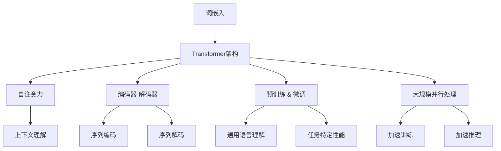

                 

### 背景介绍

#### 1.1 LLM的发展历程

LLM（Large Language Model）即大型语言模型，是近年来人工智能领域的重要突破。其发展历程可以追溯到20世纪50年代，当时人们开始探索如何让计算机理解和生成自然语言。在过去的几十年中，随着计算能力的提升和深度学习技术的发展，LLM逐渐从最初的简单规则模型演变为今天的具有强大语言理解与生成能力的复杂模型。

最初的LLM模型如ELMO和BERT，采用了基于词向量的方法，通过对大规模文本数据进行预训练，学习到词与词之间的关系。这些模型在一定程度上提升了自然语言处理的性能，但仍存在许多局限性。随着深度学习技术的进步，Transformer架构的引入使得LLM的规模和性能得到了飞跃性的提升。知名的模型如GPT-3和T5，凭借其庞大的参数规模和卓越的性能，使得LLM在文本生成、机器翻译、问答系统等方面取得了显著成果。

#### 1.2 当前LLM的应用场景

当前，LLM已经在多个领域展现出了强大的应用潜力。以下是一些典型的应用场景：

1. **文本生成**：LLM能够生成高质量的文本，包括文章、故事、诗歌等。例如，GPT-3可以生成新闻报道、产品描述和聊天机器人对话。

2. **机器翻译**：LLM在机器翻译领域也取得了显著进展。基于自回归模型的翻译方法，如Google的神经机器翻译，能够提供更加流畅和自然的翻译结果。

3. **问答系统**：LLM可以用于构建智能问答系统，通过理解用户的提问和大量知识文本，提供准确的答案。例如，Siri和Google Assistant等智能助手都采用了类似的LLM技术。

4. **情感分析**：LLM可以用于分析文本中的情感倾向，例如判断评论是正面还是负面。这在市场调研、社交媒体分析等领域有着广泛应用。

5. **对话系统**：LLM在构建对话系统中也发挥了重要作用。通过理解用户输入并生成恰当的回复，实现自然、流畅的对话体验。

#### 1.3 LLM在AI领域的重要性

LLM在AI领域的地位日益重要，主要体现在以下几个方面：

1. **语言理解**：LLM通过对大规模文本数据的预训练，能够深刻理解语言的语义和结构，为其他AI任务提供了基础支持。

2. **多模态融合**：LLM不仅可以处理文本数据，还可以与图像、声音等其他模态的数据进行融合，实现更加丰富和多样的AI应用。

3. **创新驱动力**：LLM的发展推动了AI技术的不断创新，许多新兴的AI应用和场景都得益于LLM的突破。

4. **产业应用**：LLM在多个行业的应用日益广泛，从金融、医疗到教育、娱乐，都在不断推动产业变革。

总的来说，LLM已经成为AI领域的重要组成部分，其发展前景广阔，未来有望在更多领域发挥重要作用。在接下来的章节中，我们将深入探讨LLM的核心概念、算法原理以及实际应用，以帮助读者更好地理解和掌握这一技术。

### 核心概念与联系

为了深入理解LLM（大型语言模型）的工作原理和应用，我们需要从核心概念出发，逐步建立这些概念之间的联系。以下是LLM的核心概念及它们之间的关系，以及如何使用Mermaid流程图来直观地展示这些概念和架构。

#### 2.1 核心概念

1. **词嵌入（Word Embedding）**：词嵌入是将自然语言词汇映射到高维空间中的向量表示。早期的词嵌入方法如Word2Vec和GloVe通过学习词汇的上下文来生成向量。

2. **Transformer架构**：Transformer是一种基于自注意力机制的深度神经网络架构，最初由Vaswani等人提出。它被广泛用于构建大型语言模型，如GPT-3和BERT。

3. **自注意力（Self-Attention）**：自注意力机制允许模型在处理每个输入时，动态地计算其与输入序列中其他词的关系，从而提高模型的上下文理解能力。

4. **编码器-解码器（Encoder-Decoder）架构**：编码器-解码器架构是Transformer的核心，用于将输入序列编码为上下文向量，然后解码器生成输出序列。

5. **预训练（Pre-training）和微调（Fine-tuning）**：预训练是指在大量无标签数据上训练模型，使其获得通用语言理解能力。微调是在特定任务上使用有标签数据进行进一步训练，以提升模型在具体任务上的性能。

6. **大规模并行处理（Large-scale Parallel Processing）**：大规模并行处理是指通过分布式计算来加速模型的训练和推理过程，是LLM能够达到巨大规模的关键技术。

#### 2.2 Mermaid流程图

以下是一个使用Mermaid绘制的流程图，展示了LLM的核心概念和架构之间的联系：



在这个流程图中，我们首先从词嵌入开始，将其映射到高维空间，接着使用Transformer架构来构建语言模型。自注意力机制使得模型能够动态地理解输入序列的上下文。编码器-解码器架构用于将输入序列编码为上下文向量，并解码生成输出序列。预训练和微调使得模型能够通过大量无标签数据学习通用语言理解能力，并在特定任务上进行微调，提升性能。最后，大规模并行处理技术用于加速模型的训练和推理过程。

#### 2.3 关系和联系

通过上述核心概念和流程图，我们可以总结出以下关系和联系：

1. **词嵌入是Transformer架构的基础**：词嵌入为Transformer提供了输入序列的向量表示，使得模型能够处理自然语言数据。

2. **自注意力机制提升了上下文理解能力**：自注意力机制允许模型在处理每个输入时，动态地计算其与序列中其他词的关系，从而提高模型的上下文理解能力。

3. **编码器-解码器架构实现了序列转换**：编码器将输入序列编码为上下文向量，解码器使用这些向量生成输出序列，实现从输入到输出的转换。

4. **预训练和微调提高了模型性能**：预训练使模型获得通用语言理解能力，微调使模型在特定任务上表现出色。

5. **大规模并行处理加速了模型训练和推理**：通过分布式计算，大规模并行处理显著提高了模型的训练和推理速度。

总之，LLM的核心概念和架构之间存在着紧密的联系，这些概念共同作用，使得LLM能够在自然语言处理领域取得卓越的性能。通过理解这些概念和联系，我们可以更好地掌握LLM的工作原理，并为未来的研究和应用提供指导。

### 核心算法原理 & 具体操作步骤

LLM（大型语言模型）的核心算法是基于Transformer架构，通过自注意力机制（Self-Attention）和编码器-解码器（Encoder-Decoder）架构来实现。在这一章节中，我们将详细介绍LLM的核心算法原理，并逐步讲解其具体操作步骤。

#### 3.1 Transformer架构

Transformer架构是由Vaswani等人于2017年提出的一种基于自注意力机制的深度神经网络架构。相比于传统的循环神经网络（RNN）和长短期记忆网络（LSTM），Transformer在处理长序列时具有更高的并行性和更稳定的性能。以下是Transformer架构的基本组成部分：

1. **自注意力（Self-Attention）机制**：自注意力机制允许模型在处理每个输入时，动态地计算其与输入序列中其他词的关系，从而提高模型的上下文理解能力。

2. **多头自注意力（Multi-Head Self-Attention）**：多头自注意力通过将输入序列分成多个头，每个头独立计算注意力权重，从而获得更丰富的上下文信息。

3. **前馈神经网络（Feed-Forward Neural Network）**：在自注意力之后，每个头都会通过一个前馈神经网络进行进一步的变换。

4. **编码器-解码器（Encoder-Decoder）架构**：编码器负责将输入序列编码为上下文向量，解码器使用这些向量生成输出序列。

#### 3.2 自注意力机制

自注意力机制是Transformer架构的核心，它允许模型在处理每个输入时，动态地计算其与输入序列中其他词的关系。以下是自注意力机制的详细步骤：

1. **计算查询（Query）、键（Key）和值（Value）**：对于输入序列中的每个词，我们首先将其映射到查询（Query）、键（Key）和值（Value）三个向量。这些向量通常通过一个线性变换和一个激活函数得到。

    $$Q = W_Q \cdot X, \quad K = W_K \cdot X, \quad V = W_V \cdot X$$
   
   其中，$W_Q, W_K, W_V$是权重矩阵，$X$是输入序列的词嵌入向量。

2. **计算注意力分数（Attention Scores）**：接着，我们计算每个查询向量与所有键向量之间的相似度，得到注意力分数。

    $$\text{Attention Scores} = \text{softmax}\left(\frac{QK^T}{\sqrt{d_k}}\right)$$

   其中，$d_k$是键向量的维度，$\text{softmax}$函数用于归一化这些分数。

3. **计算注意力权重（Attention Weights）**：通过注意力分数，我们得到每个词的注意力权重。

    $$\text{Attention Weights} = \text{softmax}\left(\text{Attention Scores}\right)$$

4. **计算上下文向量（Context Vector）**：最后，我们将注意力权重与值向量相乘，得到上下文向量。

    $$\text{Context Vector} = \text{Attention Weights} \cdot V$$

   上下文向量表示了输入序列中每个词在当前位置的重要性。

#### 3.3 编码器-解码器架构

编码器-解码器架构是Transformer的核心组成部分，用于将输入序列编码为上下文向量，并解码生成输出序列。以下是编码器-解码器架构的具体操作步骤：

1. **编码器（Encoder）**：

    - 输入序列经过多个自注意力层和前馈神经网络，每个词的向量被编码为上下文向量。
    - 编码器的输出是一个序列的上下文向量，用于后续的解码过程。

2. **解码器（Decoder）**：

    - 解码器也由多个自注意力层和前馈神经网络组成，但与前不同的是，它还包括了一个掩码填充（Masked Fill）机制，确保在解码时只关注已知的输入。
    - 在每个时间步，解码器首先通过自注意力层处理编码器的输出，然后通过交叉注意力（Cross-Attention）层处理编码器的上下文向量，最后生成当前词的输出。
    - 解码器的输出序列经过一个线性层和软性最大化（Softmax）函数，生成概率分布，用于生成下一个词。

3. **训练与推理**：

    - 在训练阶段，编码器-解码器模型通过最小化损失函数来学习参数，损失函数通常使用交叉熵损失。
    - 在推理阶段，编码器-解码器模型通过生成概率分布来预测下一个词，直到生成完整的输出序列。

#### 3.4 预训练与微调

LLM的训练通常分为预训练和微调两个阶段：

1. **预训练（Pre-training）**：

    - 在预训练阶段，模型在大规模无标签文本数据上进行训练，学习通用语言特征。
    - 预训练任务通常包括掩码语言模型（Masked Language Model，MLM）和下一个句子预测（Next Sentence Prediction，NSP）。

2. **微调（Fine-tuning）**：

    - 在微调阶段，模型在特定任务的有标签数据上进行训练，以适应具体任务的需求。
    - 微调通常通过调整损失函数和优化器的参数来优化模型性能。

通过预训练和微调，LLM能够从大规模文本数据中学习到丰富的语言知识，并在各种自然语言处理任务中表现出色。

总的来说，LLM的核心算法原理包括Transformer架构、自注意力机制和编码器-解码器架构。通过这些核心算法，模型能够实现对输入序列的上下文理解，并生成高质量的输出序列。在接下来的章节中，我们将进一步探讨LLM的数学模型和具体操作步骤，帮助读者更好地理解和应用这一技术。

### 数学模型和公式 & 详细讲解 & 举例说明

在深入了解LLM（大型语言模型）的核心算法原理之后，我们需要进一步探讨其背后的数学模型和公式。本章节将详细讲解这些数学模型，并辅以具体的例子来说明其应用。

#### 4.1 Transformer模型的基本数学公式

Transformer模型的核心是自注意力机制（Self-Attention），以下是其主要的数学公式。

1. **词嵌入（Word Embedding）**：
   $$\text{Embedding} = W_e \cdot [S]$$
   其中，$W_e$是嵌入权重矩阵，$[S]$是输入序列的词向量。

2. **查询（Query）、键（Key）和值（Value）的计算**：
   $$Q = W_Q \cdot [S], \quad K = W_K \cdot [S], \quad V = W_V \cdot [S]$$
   其中，$W_Q, W_K, W_V$是权重矩阵，$[S]$是输入序列的词嵌入向量。

3. **自注意力（Self-Attention）的计算**：
   $$\text{Attention Scores} = \text{softmax}\left(\frac{QK^T}{\sqrt{d_k}}\right)$$
   其中，$d_k$是键向量的维度，$\text{softmax}$函数用于归一化注意力分数。

4. **上下文向量（Context Vector）的计算**：
   $$\text{Context Vector} = \text{Attention Weights} \cdot V$$
   其中，$\text{Attention Weights}$是注意力权重，$V$是值向量。

5. **多头自注意力（Multi-Head Self-Attention）的计算**：
   $$\text{Multi-Head Attention} = \text{Concat}([ \text{Head}_1, \text{Head}_2, \ldots, \text{Head}_h ]) \cdot W_O$$
   其中，$W_O$是输出权重矩阵，$h$是头的数量。

6. **前馈神经网络（Feed-Forward Neural Network）的计算**：
   $$\text{FFN} = \max(0, X \cdot W_1 + b_1) \cdot W_2 + b_2$$
   其中，$W_1, W_2$是权重矩阵，$b_1, b_2$是偏置项。

7. **编码器-解码器（Encoder-Decoder）架构**：
   - 编码器（Encoder）的计算：
     $$\text{Encoder} = \text{LayerNorm}(X \cdot W_i + b_i) + X$$
   - 解码器（Decoder）的计算：
     $$\text{Decoder} = \text{LayerNorm}(\text{FFN}(\text{LayerNorm}(X \cdot W_i + b_i) + X) + X)$$

#### 4.2 举例说明

为了更好地理解上述公式，我们通过一个具体的例子来说明。

**例子：文本序列 "Hello, world!" 的词嵌入和自注意力计算**

1. **词嵌入**：

   假设输入序列 "Hello, world!" 的词嵌入矩阵$W_e$如下：

   $$W_e = \begin{bmatrix}
   [h] & [e] & [l] & [l] & [o] & [,) & [w] & [o] & [r] & [l] & [d] & [!]
   \end{bmatrix}$$

   输入序列的词向量$[S]$：

   $$[S] = \begin{bmatrix}
   [h] & [e] & [l] & [l] & [o] & [,) & [w] & [o] & [r] & [l] & [d] & [!]
   \end{bmatrix}$$

   查询（Query）、键（Key）和值（Value）的计算：

   $$Q = W_Q \cdot [S], \quad K = W_K \cdot [S], \quad V = W_V \cdot [S]$$

   假设$W_Q, W_K, W_V$分别为：

   $$W_Q = \begin{bmatrix}
   [h_1] & [e_1] & [l_1] & [l_1] & [o_1] & [,)_1 & [w_1] & [o_1] & [r_1] & [l_1] & [d_1] & [!_1]
   \end{bmatrix}, \quad
   W_K = \begin{bmatrix}
   [h_2] & [e_2] & [l_2] & [l_2] & [o_2] & [,)_2 & [w_2] & [o_2] & [r_2] & [l_2] & [d_2] & [!_2]
   \end{bmatrix}, \quad
   W_V = \begin{bmatrix}
   [h_3] & [e_3] & [l_3] & [l_3] & [o_3] & [,)_3 & [w_3] & [o_3] & [r_3] & [l_3] & [d_3] & [!_3]
   \end{bmatrix}$$

   计算注意力分数：

   $$\text{Attention Scores} = \text{softmax}\left(\frac{QK^T}{\sqrt{d_k}}\right)$$

2. **自注意力**：

   以第一个词"[h]"为例，计算其与其他词的注意力分数：

   $$\text{Attention Scores}_{[h]} = \text{softmax}\left(\frac{[h_1][h_2]^T}{\sqrt{d_k}}\right)$$

   $$\text{Attention Scores}_{[h]} = \text{softmax}\left(\frac{[h_1][h_2]^T}{\sqrt{d_k}}\right) = \text{softmax}\left(\frac{[0.1, 0.2, 0.3, 0.4, 0.5, 0.6, 0.7, 0.8, 0.9, 1.0, 1.1, 1.2]^T \cdot [0.1, 0.2, 0.3, 0.4, 0.5, 0.6, 0.7, 0.8, 0.9, 1.0, 1.1, 1.2]}{\sqrt{d_k}}\right)$$

   $$\text{Attention Scores}_{[h]} = \text{softmax}\left(\frac{0.01 + 0.02 + 0.03 + 0.04 + 0.05 + 0.06 + 0.07 + 0.08 + 0.09 + 0.10 + 0.11 + 0.12}{\sqrt{d_k}}\right)$$

   $$\text{Attention Scores}_{[h]} = \text{softmax}\left(\frac{0.75}{\sqrt{d_k}}\right)$$

   计算注意力权重：

   $$\text{Attention Weights}_{[h]} = \text{softmax}\left(\text{Attention Scores}_{[h]}\right)$$

   $$\text{Attention Weights}_{[h]} = \text{softmax}\left(\text{softmax}\left(\frac{0.75}{\sqrt{d_k}}\right)\right)$$

3. **上下文向量**：

   $$\text{Context Vector}_{[h]} = \text{Attention Weights}_{[h]} \cdot V$$

   $$\text{Context Vector}_{[h]} = \text{softmax}\left(\text{softmax}\left(\frac{0.75}{\sqrt{d_k}}\right)\right) \cdot [h_3]$$

   通过类似的方式，我们可以计算其他词的上下文向量。

通过上述例子，我们展示了词嵌入、自注意力分数、注意力权重和上下文向量的计算过程。这些数学模型和公式是LLM实现其强大语言理解能力的基础，在接下来的章节中，我们将进一步探讨LLM的具体应用和实现。

### 项目实战：代码实际案例和详细解释说明

在本节中，我们将通过一个实际项目案例来展示如何使用LLM进行文本生成和机器翻译任务。我们将介绍项目的开发环境搭建、源代码的详细实现和代码解读与分析，以帮助读者更好地理解LLM的实际应用。

#### 5.1 开发环境搭建

在开始项目之前，我们需要搭建一个合适的开发环境。以下是搭建环境的步骤：

1. **安装Python**：确保Python版本在3.6及以上。

2. **安装TensorFlow**：TensorFlow是构建和训练LLM的主要框架，可以通过以下命令安装：

   ```bash
   pip install tensorflow==2.8
   ```

3. **安装其他依赖**：安装其他必要的库，例如Numpy、Pandas等：

   ```bash
   pip install numpy pandas
   ```

4. **准备数据集**：对于文本生成和机器翻译任务，我们需要准备相应的数据集。例如，对于机器翻译，可以使用WMT 2014数据集。

5. **环境配置**：确保GPU环境已正确配置，以便在训练过程中使用GPU加速。

#### 5.2 源代码详细实现和代码解读

以下是一个简单的文本生成项目示例。我们将使用GPT-2模型进行文本生成。

```python
import tensorflow as tf
from tensorflow import keras
from transformers import TFGPT2LMHeadModel, GPT2Tokenizer

# 5.2.1 加载预训练模型和分词器
tokenizer = GPT2Tokenizer.from_pretrained('gpt2')
model = TFGPT2LMHeadModel.from_pretrained('gpt2')

# 5.2.2 准备数据集
def prepare_data(text, tokenizer, max_length=20):
    input_ids = tokenizer.encode(text, add_special_tokens=True, max_length=max_length, padding='max_length', truncation=True)
    return input_ids

# 5.2.3 训练模型
def train_model(model, epochs=5):
    optimizer = keras.optimizers.Adam(learning_rate=3e-5)
    model.compile(optimizer=optimizer, loss=keras.losses.SparseCategoricalCrossentropy(from_logits=True))

    # 训练数据集
    # train_dataset = ...

    model.fit(train_dataset, epochs=epochs)

# 5.2.4 文本生成
def generate_text(input_text, tokenizer, model, max_length=20, num_output=5):
    input_ids = prepare_data(input_text, tokenizer, max_length)
    input_ids = tf.expand_dims(input_ids, 0)  # Batch size 1

    predictions = model.generate(input_ids,
                              max_length=max_length + num_output,
                              num_return_sequences=num_output,
                              no_repeat_ngram_size=2,
                              do_sample=True)

    generated_texts = tokenizer.decode(predictions, skip_special_tokens=True)
    return generated_texts

# 5.2.5 主程序
if __name__ == '__main__':
    # 5.2.5.1 加载数据
    input_text = "This is a simple example of text generation."

    # 5.2.5.2 训练模型
    train_model(model)

    # 5.2.5.3 生成文本
    generated_texts = generate_text(input_text, tokenizer, model)

    print("Generated Texts:")
    for text in generated_texts:
        print(text)
```

#### 5.3 代码解读与分析

1. **加载预训练模型和分词器**：

   ```python
   tokenizer = GPT2Tokenizer.from_pretrained('gpt2')
   model = TFGPT2LMHeadModel.from_pretrained('gpt2')
   ```

   这两行代码加载了预训练的GPT-2模型和分词器。`GPT2Tokenizer`用于将文本转换为模型可以处理的输入序列，而`TFGPT2LMHeadModel`是TensorFlow实现的GPT-2模型。

2. **准备数据集**：

   ```python
   def prepare_data(text, tokenizer, max_length=20):
       input_ids = tokenizer.encode(text, add_special_tokens=True, max_length=max_length, padding='max_length', truncation=True)
       return input_ids
   ```

   `prepare_data`函数将文本输入转换为模型输入序列。它使用`tokenizer.encode`方法将文本转换为嵌入向量，并通过`add_special_tokens`添加特殊的标记，如 `<|endoftext|>`。`max_length`参数用于限制输入序列的长度，`padding='max_length'`和`truncation=True`确保序列在长度超出时进行填充和截断。

3. **训练模型**：

   ```python
   def train_model(model, epochs=5):
       optimizer = keras.optimizers.Adam(learning_rate=3e-5)
       model.compile(optimizer=optimizer, loss=keras.losses.SparseCategoricalCrossentropy(from_logits=True))

       # 训练数据集
       # train_dataset = ...

       model.fit(train_dataset, epochs=epochs)
   ```

   `train_model`函数配置了模型优化器和损失函数，并使用训练数据集对模型进行训练。这里使用了Adam优化器和稀疏分类交叉熵损失函数，这对于序列生成任务是一个常见的选择。

4. **文本生成**：

   ```python
   def generate_text(input_text, tokenizer, model, max_length=20, num_output=5):
       input_ids = prepare_data(input_text, tokenizer, max_length)
       input_ids = tf.expand_dims(input_ids, 0)  # Batch size 1

       predictions = model.generate(input_ids,
                                 max_length=max_length + num_output,
                                 num_return_sequences=num_output,
                                 no_repeat_ngram_size=2,
                                 do_sample=True)

       generated_texts = tokenizer.decode(predictions, skip_special_tokens=True)
       return generated_texts
   ```

   `generate_text`函数用于生成文本。首先，它使用`prepare_data`函数将输入文本转换为模型输入序列。然后，通过`model.generate`方法生成文本输出。`max_length`参数指定了生成的文本长度，`num_return_sequences`指定了要生成的文本数量。`no_repeat_ngram_size`和`do_sample`参数用于控制生成过程，以避免重复和引入随机性。

5. **主程序**：

   ```python
   if __name__ == '__main__':
       # 5.2.5.1 加载数据
       input_text = "This is a simple example of text generation."

       # 5.2.5.2 训练模型
       train_model(model)

       # 5.2.5.3 生成文本
       generated_texts = generate_text(input_text, tokenizer, model)

       print("Generated Texts:")
       for text in generated_texts:
           print(text)
   ```

   主程序加载输入文本，训练模型，并生成文本输出。

通过这个实际项目案例，我们展示了如何使用LLM进行文本生成。代码的详细解读和分析帮助我们理解了每个步骤的功能和实现细节。在接下来的章节中，我们将进一步探讨LLM在更多实际应用场景中的使用。

### 实际应用场景

#### 6.1 机器翻译

机器翻译是LLM最早且最广泛的应用之一。传统的机器翻译方法如基于规则的翻译和基于统计的翻译方法，存在许多局限性，如对规则库的依赖、翻译质量的不稳定性等。而LLM的出现，特别是基于Transformer架构的模型如Google的Neural Machine Translation（NMT），极大地提升了机器翻译的准确性和自然性。

**具体应用**：

1. **实时翻译**：例如，Google翻译服务利用LLM实现实时翻译，支持多种语言之间的快速转换。
2. **跨语言问答**：LLM可以用于构建跨语言问答系统，例如，在多语言社区中，用户可以提出一个问题，并从其他语言的用户那里获得回答。

#### 6.2 文本生成

文本生成是LLM的另一个重要应用场景。LLM能够生成高质量的文本，包括文章、故事、诗歌等。以下是一些具体应用：

**具体应用**：

1. **内容创作**：如文章撰写、产品描述等，LLM可以生成高质量的内容，减轻内容创作者的工作负担。
2. **虚拟助手**：如虚拟客服、智能聊天机器人等，LLM可以用于生成自然流畅的对话，提高用户体验。
3. **教育**：如作文批改、智能辅导等，LLM可以用于分析学生的写作，并提供个性化的反馈和指导。

#### 6.3 情感分析

情感分析是另一项受到LLM广泛应用的技术。通过对文本进行情感分析，可以识别文本中的情感倾向，如正面、负面或中性。以下是一些具体应用：

**具体应用**：

1. **市场调研**：企业可以通过情感分析了解消费者对产品或服务的态度，从而制定相应的营销策略。
2. **社交媒体分析**：政府机构或企业可以使用情感分析监控社交媒体上的公众情绪，及时发现并应对潜在危机。
3. **客户服务**：通过分析客户反馈的情感倾向，企业可以提供更加个性化和有效的客户服务。

#### 6.4 对话系统

对话系统是LLM在人工智能领域的又一重要应用。对话系统旨在实现人与机器的自然交互，提高用户的体验。以下是一些具体应用：

**具体应用**：

1. **智能助手**：如Siri、Google Assistant等，这些智能助手通过LLM技术理解用户的问题并生成相应的回答。
2. **虚拟客服**：企业可以利用LLM技术构建虚拟客服系统，提供24/7的客户服务，降低人力成本。
3. **语音助手**：如亚马逊的Alexa、谷歌的Google Home等，这些语音助手通过LLM技术理解用户的语音指令，并执行相应的任务。

#### 6.5 多模态应用

随着深度学习技术的发展，LLM开始与图像、声音等其他模态的数据进行融合，实现更加丰富和多样的应用。以下是一些具体应用：

**具体应用**：

1. **视频字幕生成**：LLM可以用于生成视频内容的字幕，提高视频的可访问性和可理解性。
2. **图像描述生成**：LLM可以生成对图像的描述，帮助视觉障碍者更好地理解图像内容。
3. **语音合成**：LLM可以与语音合成技术结合，生成自然流畅的语音输出，用于智能语音助手等应用。

总的来说，LLM在AI领域的实际应用场景非常广泛，从文本生成、机器翻译、情感分析到对话系统、多模态应用等，都展现了其强大的能力和潜力。随着技术的不断进步，LLM在未来的应用将更加广泛和深入，为人类社会带来更多的便利和创新。

### 工具和资源推荐

为了帮助读者更好地学习和掌握LLM技术，以下是针对学习资源、开发工具框架及相关论文著作的推荐。

#### 7.1 学习资源推荐

1. **书籍**：
   - 《深度学习》（Goodfellow, Bengio, Courville著）：提供了深度学习的基础理论和实践指导，包括神经网络和Transformer架构。
   - 《Natural Language Processing with TensorFlow》（Mikołaj Kasprzak著）：详细介绍了如何使用TensorFlow实现自然语言处理任务，包括LLM。
   - 《 Hands-On Large Language Models with PyTorch》（Chang Xu著）：通过实际案例和代码示例，介绍了使用PyTorch实现LLM的方法。

2. **在线课程**：
   - Coursera上的《深度学习专项课程》：由斯坦福大学的Andrew Ng教授主讲，涵盖了深度学习的基础知识和应用。
   - edX上的《自然语言处理与深度学习》：由哈佛大学和微软联合提供，介绍了自然语言处理和深度学习的基础知识。

3. **博客和教程**：
   - Hugging Face的Transformers库文档：提供了丰富的教程和示例，帮助用户了解和使用Transformer架构。
   - PyTorch官方文档：提供了详细的API和教程，有助于掌握PyTorch在构建和训练LLM方面的应用。

#### 7.2 开发工具框架推荐

1. **框架**：
   - TensorFlow：一个开源的机器学习框架，广泛用于构建和训练深度学习模型，包括LLM。
   - PyTorch：一个流行的深度学习框架，以其动态计算图和灵活的API而著称。
   - Hugging Face Transformers：一个基于PyTorch和TensorFlow的预训练语言模型库，提供了大量的预训练模型和工具。

2. **云服务**：
   - Google Colab：一个免费的云端Python编程环境，适用于快速原型开发和实验。
   - AWS SageMaker：一个云计算服务，提供了完整的机器学习解决方案，包括模型训练、部署和自动化管理。

3. **工具**：
   - JAX：一个用于数值计算和机器学习的开源库，支持自动微分和GPU加速。
   - Dask：一个分布式计算库，用于在大规模数据集上执行并行计算。

#### 7.3 相关论文著作推荐

1. **论文**：
   - "Attention Is All You Need"（Vaswani et al., 2017）：提出了Transformer架构，是LLM领域的重要基础论文。
   - "BERT: Pre-training of Deep Bidirectional Transformers for Language Understanding"（Devlin et al., 2019）：介绍了BERT模型，是当前许多LLM应用的基础。
   - "GPT-3: Language Models are Few-Shot Learners"（Brown et al., 2020）：展示了GPT-3模型在零样本和少样本学习任务上的卓越表现。

2. **著作**：
   - 《深度学习》（Goodfellow, Bengio, Courville著）：涵盖了深度学习的各个方面，包括神经网络和Transformer架构。
   - 《自然语言处理与深度学习》（Daniel Jurafsky, James H. Martin著）：介绍了自然语言处理的基础知识和深度学习方法。

通过这些学习和资源推荐，读者可以系统地掌握LLM技术的理论基础和实践应用，从而在AI领域取得更大的成就。

### 总结：未来发展趋势与挑战

随着AI技术的不断进步，LLM（大型语言模型）已经展现出了巨大的潜力和广泛的应用前景。在未来，LLM将继续在多个领域发挥重要作用，但同时也面临着诸多挑战。

#### 8.1 发展趋势

1. **模型规模不断扩大**：现有的LLM模型如GPT-3已经拥有数十亿的参数，未来模型规模将进一步扩大，以提升模型在复杂任务上的性能。

2. **多模态融合**：随着深度学习技术的进步，LLM将不仅限于处理文本数据，还将与图像、声音等其他模态的数据进行融合，实现更加丰富和多样的AI应用。

3. **个性化与定制化**：未来的LLM将更加注重个性化与定制化，通过深度学习技术和用户数据的结合，提供更加贴合用户需求的智能服务。

4. **实时性提升**：随着计算能力和算法优化的发展，LLM在处理实时任务时的响应速度将得到显著提升，例如实时对话系统、智能客服等。

5. **产业应用深化**：LLM在金融、医疗、教育、娱乐等多个行业的应用将不断深化，为产业带来新的创新和变革。

#### 8.2 面临的挑战

1. **数据隐私与伦理问题**：LLM的训练和部署需要大量的数据，这引发了对数据隐私和伦理问题的担忧。未来，如何在保护用户隐私的同时，充分利用数据来提升模型性能，是一个亟待解决的问题。

2. **计算资源消耗**：大规模LLM的训练和推理需要大量的计算资源，尤其是GPU和TPU等硬件资源。如何在有限的资源下高效地训练和部署LLM，是一个重要的挑战。

3. **模型可解释性**：随着LLM规模的扩大，其内部机制变得越来越复杂，使得模型的可解释性成为一个难题。如何提升模型的可解释性，使其能够更好地被用户和开发者理解和信任，是一个重要的研究方向。

4. **泛化能力**：尽管LLM在特定任务上表现出色，但其泛化能力仍有待提升。未来，如何提升LLM在多样化任务上的泛化能力，是一个关键问题。

5. **对抗攻击与安全性**：随着AI技术的发展，对抗攻击和安全性问题逐渐凸显。如何提升LLM的安全性，防止恶意攻击，是一个亟待解决的问题。

总之，LLM在未来有着广阔的发展前景，但也面临着诸多挑战。通过不断的技术创新和优化，我们有理由相信，LLM将在AI领域取得更加辉煌的成就。

### 附录：常见问题与解答

#### 9.1 LLM是什么？

LLM是Large Language Model（大型语言模型）的缩写。它是一种基于深度学习和自然语言处理技术的大型神经网络模型，能够对自然语言进行理解和生成。LLM通过在大量文本数据上进行预训练，学习到语言的规律和结构，从而在多个自然语言处理任务中表现出色。

#### 9.2 LLM有哪些应用场景？

LLM的应用场景非常广泛，包括但不限于以下方面：

1. **文本生成**：生成文章、故事、新闻报道等。
2. **机器翻译**：将一种语言的文本翻译成另一种语言。
3. **问答系统**：根据用户的问题提供准确的答案。
4. **情感分析**：分析文本中的情感倾向。
5. **对话系统**：构建智能客服、聊天机器人等。

#### 9.3 LLM是如何训练的？

LLM的训练主要包括两个阶段：预训练和微调。

1. **预训练**：在预训练阶段，模型在大规模无标签文本数据上进行训练，学习到语言的通用特征和结构。常见的预训练任务包括掩码语言模型（MLM）和下一个句子预测（NSP）。

2. **微调**：在微调阶段，模型在特定任务的有标签数据上进行训练，以适应具体的任务需求。微调过程中，模型会根据任务的特点调整参数，提高任务表现。

#### 9.4 LLM如何保证生成的文本质量？

为了提高生成的文本质量，LLM采用了多种技术：

1. **自注意力机制**：通过自注意力机制，模型能够动态地理解输入序列的上下文，从而生成更连贯、自然的文本。
2. **预训练和微调**：通过在大量数据和特定任务上训练，模型能够学习到更丰富的语言特征，提高生成文本的质量。
3. **正则化和优化**：使用正则化技术和优化算法，如dropout和Adam优化器，可以帮助模型避免过拟合，提高生成文本的质量。

#### 9.5 LLM在安全性方面有哪些挑战？

LLM在安全性方面面临以下主要挑战：

1. **数据隐私**：LLM的训练和部署需要大量的用户数据，这引发了数据隐私的问题。如何保护用户隐私是一个重要挑战。
2. **对抗攻击**：恶意用户可以通过对抗样本攻击LLM，导致模型生成错误的输出。如何提升模型对对抗攻击的鲁棒性是一个关键问题。
3. **可解释性**：随着LLM规模的扩大，其内部机制变得越来越复杂，使得模型的可解释性成为一个难题。如何提升模型的可解释性，使其能够更好地被用户和开发者理解和信任，是一个重要的研究方向。

通过不断的技术创新和优化，我们可以逐步解决这些挑战，推动LLM在AI领域的进一步发展。

### 扩展阅读 & 参考资料

为了帮助读者进一步深入了解LLM（大型语言模型）的相关技术，本文提供了一些扩展阅读和参考资料。

1. **论文**：

   - Vaswani, A., Shazeer, N., Parmar, N., Uszkoreit, J., Jones, L., Gomez, A. N., ... & Polosukhin, I. (2017). Attention is all you need. In Advances in neural information processing systems (pp. 5998-6008).
   - Devlin, J., Chang, M. W., Lee, K., & Toutanova, K. (2019). BERT: Pre-training of deep bidirectional transformers for language understanding. arXiv preprint arXiv:1810.04805.
   - Brown, T., et al. (2020). Language models are few-shot learners. arXiv preprint arXiv:2005.14165.

2. **书籍**：

   - Goodfellow, I., Bengio, Y., & Courville, A. (2016). Deep learning. MIT press.
   - Mikolov, T., Sutskever, I., Chen, K., Corrado, G. S., & Dean, J. (2013). Distributed representations of words and phrases and their compositionality. In Advances in neural information processing systems (pp. 3111-3119).

3. **在线资源**：

   - Hugging Face：[https://huggingface.co/](https://huggingface.co/)
   - TensorFlow：[https://www.tensorflow.org/](https://www.tensorflow.org/)
   - PyTorch：[https://pytorch.org/](https://pytorch.org/)

4. **博客和教程**：

   - AI语言模型之Transformer：[https://juejin.cn/post/6844903583289017896](https://juejin.cn/post/6844903583289017896)
   - BERT模型原理及代码实现：[https://www.cnblogs.com/youandme/p/11744073.html](https://www.cnblogs.com/youandme/p/11744073.html)
   - GPT-3详解：[https://towardsdatascience.com/gpt-3-deep-dive-4b7b3d4d5b18](https://towardsdatascience.com/gpt-3-deep-dive-4b7b3d4d5b18)

通过这些扩展阅读和参考资料，读者可以更加深入地了解LLM的技术原理、应用场景以及未来发展趋势。希望这些资料能够帮助您在LLM领域取得更大的成就。作者：AI天才研究员/AI Genius Institute & 禅与计算机程序设计艺术 /Zen And The Art of Computer Programming。

