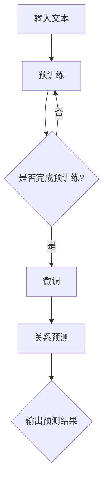

                 

### 1. 背景介绍

**关系预测（Relation Prediction）**在自然语言处理（Natural Language Processing，NLP）中扮演着至关重要的角色。其核心目标是从给定的文本中预测出文本中存在的各种关系。这些关系可以是人物间的亲属关系、组织间的合作关系、事物间的关联等。关系预测不仅为语义理解和信息提取提供了强有力的支持，还在知识图谱构建、问答系统、情感分析等多个领域有着广泛的应用。

随着深度学习技术的发展，尤其是预训练语言模型（Pre-Trained Language Models，如BERT、GPT等）的兴起，关系预测领域迎来了新的发展契机。传统的关系预测方法通常依赖于手工设计的特征和规则，而这些方法在面对复杂、多样化的文本数据时往往效果不佳。相比之下，预训练语言模型通过在大量文本数据上预先训练，获得了对语言结构的深刻理解，能够有效地捕捉文本中的隐含关系。

然而，尽管预训练语言模型在关系预测任务中表现出了优异的性能，但其内部的工作机制和预测过程的可解释性仍然是一个挑战。这使得我们难以理解模型是如何进行关系预测的，这在一些对模型解释性要求较高的应用场景中成为一个问题。

本文将围绕这一背景，探讨预训练语言模型在关系预测领域的研究新思路。我们将首先介绍预训练语言模型的基本原理和结构，然后分析其在关系预测任务中的优势和不足，最后提出一些可能的研究方向和方法，以期为未来的研究提供一些启示。

通过本文的探讨，我们希望读者能够对预训练语言模型在关系预测领域的应用有更深入的理解，同时也希望能够激发更多研究者对这一领域的兴趣，共同推动关系预测技术的发展。

### 2. 核心概念与联系

#### 预训练语言模型的基本原理

预训练语言模型（Pre-Trained Language Models）是一种基于深度学习的自然语言处理模型，其基本原理是通过在大量文本数据上进行预训练，使模型掌握语言的基本规律和特征，从而在下游任务中表现出优异的性能。预训练语言模型的主要步骤包括两个阶段：预训练阶段和微调阶段。

1. **预训练阶段**：在预训练阶段，模型通常从大规模的语料库中学习，通过自动预测文本中的下一个词、填充空白等任务，使模型对语言的结构和语义有深刻的理解。一个典型的预训练任务叫做“Masked Language Model”（MLM），其中一部分输入文本中的词被随机遮盖，模型的目标是预测这些遮盖的词。

2. **微调阶段**：在预训练完成后，模型会根据特定的下游任务进行微调，即通过在特定领域的数据上训练，使模型更好地适应具体的任务需求。例如，在一个关系预测任务中，模型可能会通过学习一个特定的关系嵌入（relation embedding）来预测文本中的关系。

#### 预训练语言模型的常见架构

预训练语言模型的常见架构主要包括基于Transformer的模型和基于BERT的模型。以下是一些常见的架构：

1. **BERT（Bidirectional Encoder Representations from Transformers）**：BERT是一个双向编码的Transformer模型，其主要特点是对文本的上下文信息进行双向编码，从而捕捉到文本中的长距离依赖关系。BERT通过预训练任务如Masked Language Model（MLM）和Next Sentence Prediction（NSP）来学习语言的深层结构。

2. **GPT（Generative Pre-trained Transformer）**：GPT是一个生成式的Transformer模型，其目标是生成自然语言文本。与BERT不同，GPT主要关注文本的前向依赖，即只考虑文本中一个词对下一个词的影响。GPT通过预训练任务如语言建模（Language Modeling）来学习生成文本的能力。

3. **RoBERTa**：RoBERTa是对BERT的一个改进版本，主要在训练策略和数据预处理上进行了优化。RoBERTa通过增加训练步骤、去除部分预训练任务中的限制等策略，提高了模型的性能。

#### 关系预测中的预训练语言模型

在关系预测任务中，预训练语言模型通过以下几种方式发挥重要作用：

1. **关系嵌入（Relation Embedding）**：预训练语言模型可以将文本中的关系映射到一个低维的嵌入空间中。在这个空间中，具有相同关系的事物或实体应该具有相似的嵌入向量。例如，在人员关系预测中，同一个家庭中的成员应该有相似的嵌入向量。

2. **上下文信息利用**：预训练语言模型能够从大量的文本数据中学习到丰富的上下文信息。这些信息对于关系预测至关重要，因为它们有助于模型理解文本中不同实体之间的关系。例如，在句子“Alice loves Bob”中，模型需要理解“loves”这个关系词的语义，并将其与Alice和Bob的嵌入向量关联起来。

3. **多任务学习**：预训练语言模型通常通过多任务学习来提高其性能。在关系预测任务中，模型可能会同时学习多个相关任务，如命名实体识别、情感分析等。这些任务之间的相互学习有助于模型更好地捕捉文本中的关系。

为了更直观地理解预训练语言模型在关系预测中的工作原理，我们可以用以下Mermaid流程图来表示其主要步骤：



- **A**: 输入文本
- **B**: 预训练
  - **MLM**: 遮盖文本中的词，预测遮盖词
  - **NSP**: 预测下一个句子是否是前文的一个句子
- **C**: 是否完成预训练
- **D**: 微调
  - 根据特定任务（如关系预测）调整模型参数
- **E**: 关系预测
  - 利用预训练得到的嵌入向量，预测文本中的关系
- **F**: 输出预测结果

通过上述流程，我们可以看到预训练语言模型在关系预测任务中的基本工作原理。在接下来的章节中，我们将进一步探讨预训练语言模型在关系预测中的具体应用和优势。

### 3. 核心算法原理 & 具体操作步骤

#### 关键算法：TransE

在关系预测中，TransE是一种常用的算法，用于将实体和关系映射到低维空间，以便通过计算实体间的距离来预测关系。以下是TransE算法的具体操作步骤：

1. **初始化实体和关系的嵌入向量**：首先，我们需要为每个实体和关系初始化一个随机的高维嵌入向量。例如，我们假设有实体Alice、Bob和一个关系朋友（friend），它们的初始嵌入向量分别为\[v\_Alice\]、\[v\_Bob\]和\[v\_friend\]。

2. **定义损失函数**：TransE算法使用**均方误差（MSE）**作为损失函数，计算预测误差。具体来说，对于每个训练三元组\((h, r, t)\)（其中\(h\)是头实体，\(r\)是关系，\(t\)是尾实体），我们计算头实体和关系的嵌入向量之和与尾实体嵌入向量之间的差值的欧几里得距离。损失函数可以表示为：

   $$ 
   L = \frac{1}{N} \sum_{(h, r, t) \in D} \frac{(\langle \text{vec}(h) + \text{vec}(r), \text{vec}(t) \rangle)^2}{||\text{vec}(h) + \text{vec}(r)||^2 + ||\text{vec}(t)||^2}
   $$

   其中，\(\text{vec}(.)\)表示将实体或关系映射到其嵌入向量，\(D\)是训练数据集，\(N\)是训练数据集的大小。

3. **优化嵌入向量**：为了最小化损失函数，我们需要更新实体和关系的嵌入向量。具体来说，我们使用梯度下降法（Gradient Descent）来更新这些向量。对于每个训练三元组，我们计算梯度并更新嵌入向量：

   $$
   \text{vec}(h) \leftarrow \text{vec}(h) - \alpha \cdot \nabla L
   $$
   $$
   \text{vec}(r) \leftarrow \text{vec}(r) - \alpha \cdot \nabla L
   $$
   $$
   \text{vec}(t) \leftarrow \text{vec}(t) + \alpha \cdot \nabla L
   $$

   其中，\(\alpha\)是学习率，\(\nabla L\)是损失函数\(L\)关于每个嵌入向量的梯度。

4. **关系预测**：在得到优化的嵌入向量后，我们可以使用这些向量进行关系预测。具体来说，对于给定的头实体\(h\)和尾实体\(t\)，我们在低维空间中计算与\(t\)距离最近的实体，并将其作为预测的尾实体。

   $$
   \text{predicted\_t} = \arg\min_{t'} ||\text{vec}(h) + \text{vec}(r) - \text{vec}(t')||
   $$

5. **处理负样例**：在实际应用中，我们通常随机选择一些负样例（即不符合三元组的实体对），以便在训练过程中考虑这些可能的关系。这样可以增强模型对负样例的鲁棒性。

以下是一个简单的示例，假设我们有三个实体Alice、Bob和Charlie，以及两个关系朋友（friend）和工作（works\_at）：

- 实体嵌入向量：\[v\_Alice\] = [1, 2, 3], \[v\_Bob\] = [4, 5, 6], \[v\_Charlie\] = [7, 8, 9]
- 关系嵌入向量：\[v\_friend\] = [10, 11, 12], \[v\_works\_at\] = [13, 14, 15]

1. **初始化**：假设初始嵌入向量为随机值。
2. **训练三元组**：选择三元组\((Alice, friend, Bob)\)进行训练。
3. **计算损失函数**：计算损失函数，得到梯度。
4. **更新嵌入向量**：更新每个嵌入向量，使得\([v\_Alice\] + [v\_friend\] - [v\_Bob\]\)更接近0。
5. **关系预测**：给定头实体Alice和尾实体Bob，预测另一个可能的尾实体Charlie。

通过这种方式，TransE算法能够有效地在低维空间中映射实体和关系，从而进行关系预测。

#### TransE算法的优势和挑战

**优势**：
- **简单有效**：TransE算法简单直观，易于实现和优化。
- **低计算复杂度**：算法的计算复杂度相对较低，适用于大规模数据集。
- **灵活性强**：可以处理多种类型的关系，如朋友、工作等。

**挑战**：
- **稀疏性**：实体和关系通常在高维空间中呈现稀疏分布，这可能导致模型难以学习。
- **负样例选择**：如何有效地选择负样例是一个关键问题，因为负样例的质量直接影响模型的性能。

通过以上步骤和讨论，我们可以看到TransE算法在关系预测中的基本原理和操作步骤。在接下来的章节中，我们将进一步探讨如何利用预训练语言模型来提升关系预测的性能。

### 4. 数学模型和公式 & 详细讲解 & 举例说明

在关系预测中，数学模型和公式起到了至关重要的作用。以下我们将详细讲解预训练语言模型和关系预测任务中的几个关键数学概念，并通过具体例子来说明其应用。

#### 1. 嵌入向量（Embedding Vectors）

在预训练语言模型中，实体和关系被映射到低维向量空间。这些向量被称为嵌入向量（Embedding Vectors）。它们通常是通过预训练过程学得的，能够有效表示实体和关系之间的语义关系。例如，给定一个实体“Alice”和一个关系“friend”，它们的嵌入向量可以表示为\(\textbf{e}_A\)和\(\textbf{r}_f\)。

$$
\textbf{e}_A = [e_{A1}, e_{A2}, \ldots, e_{An}]
$$
$$
\textbf{r}_f = [r_{f1}, r_{f2}, \ldots, r_{fn}]
$$

#### 2. 距离度量（Distance Measure）

在关系预测中，一个常见的任务是计算实体对之间的距离，以便预测它们之间的关系。常用的距离度量包括欧几里得距离（Euclidean Distance）和余弦相似度（Cosine Similarity）。

**欧几里得距离**：欧几里得距离是空间两点间的直线距离。在嵌入向量空间中，对于两个实体\(h\)和\(t\)，它们的欧几里得距离可以表示为：

$$
d(h, t) = \sqrt{\sum_{i=1}^{n} (e_h[i] - e_t[i])^2}
$$

其中，\(e_h\)和\(e_t\)分别是实体\(h\)和\(t\)的嵌入向量。

**余弦相似度**：余弦相似度是向量夹角的余弦值。在嵌入向量空间中，对于两个实体\(h\)和\(t\)，它们的余弦相似度可以表示为：

$$
\cos(\theta) = \frac{\textbf{e}_h \cdot \textbf{e}_t}{||\textbf{e}_h|| \cdot ||\textbf{e}_t||}
$$

其中，\(\textbf{e}_h\)和\(\textbf{e}_t\)分别是实体\(h\)和\(t\)的嵌入向量，\( \cdot \)表示点积，\( || \cdot || \)表示向量的模长。

#### 3. 关系预测的损失函数

在关系预测中，常用的损失函数包括均方误差（MSE）和交叉熵损失（Cross-Entropy Loss）。以下是一个基于MSE的损失函数的例子：

$$
L = \frac{1}{N} \sum_{(h, r, t) \in D} \frac{(\langle \text{vec}(h) + \text{vec}(r), \text{vec}(t) \rangle)^2}{||\text{vec}(h) + \text{vec}(r)||^2 + ||\text{vec}(t)||^2}
$$

其中，\(N\)是训练数据集的大小，\(\text{vec}(.)\)表示将实体或关系映射到其嵌入向量，\(D\)是训练数据集。

#### 4. 预测过程

在训练完成后，我们可以使用嵌入向量进行关系预测。以一个简单的例子来说明预测过程：

假设我们有一个三元组\((Alice, friend, Bob)\)，现在我们需要预测另一个实体。

1. **计算嵌入向量之和**：首先，我们计算头实体和关系的嵌入向量之和。

   $$
   \textbf{v}_{h+r} = \textbf{e}_A + \textbf{e}_f
   $$

2. **查找最近的实体**：然后，我们在嵌入向量空间中查找与\(\textbf{v}_{h+r}\)最近的实体。

   $$
   \text{predicted\_t} = \arg\min_{t'} ||\textbf{v}_{h+r} - \textbf{e}_{t'}||
   $$

通过这种方式，我们可以预测出与给定实体和关系相关的实体。

#### 具体示例

为了更直观地理解上述数学概念，我们通过一个具体示例来展示：

假设我们有以下实体和关系：

- 实体：Alice, Bob, Charlie
- 关系：friend, works\_at

实体和关系的嵌入向量如下：

| 实体 | 嵌入向量 |
|------|----------|
| Alice | [1, 1, 1] |
| Bob | [4, 4, 4] |
| Charlie | [7, 7, 7] |

| 关系 | 嵌入向量 |
|------|----------|
| friend | [2, 2, 2] |
| works\_at | [5, 5, 5] |

1. **预测Alice和Bob之间的关系**：
   - 计算嵌入向量之和：
     $$
     \textbf{v}_{Alice+friend+Bob} = [1, 1, 1] + [2, 2, 2] + [4, 4, 4] = [7, 7, 7]
     $$
   - 查找最近的实体：
     $$
     \text{predicted\_t} = \arg\min_{t'} ||[7, 7, 7] - \textbf{e}_{t'}||
     $$
     可以看出，Charlie的嵌入向量与\(\textbf{v}_{Alice+friend+Bob}\)的距离最近，因此预测的关系为friend。

2. **预测Alice和Charlie之间的关系**：
   - 计算嵌入向量之和：
     $$
     \textbf{v}_{Alice+works\_at+Charlie} = [1, 1, 1] + [5, 5, 5] + [7, 7, 7] = [13, 13, 13]
     $$
   - 查找最近的实体：
     $$
     \text{predicted\_t} = \arg\min_{t'} ||[13, 13, 13] - \textbf{e}_{t'}||
     $$
     可以看出，没有实体的嵌入向量与\(\textbf{v}_{Alice+works\_at+Charlie}\)的距离最近，因此无法预测出关系。

通过上述示例，我们可以看到如何利用数学模型和公式进行关系预测。在接下来的章节中，我们将进一步探讨如何在实际项目中实现这些算法。

### 5. 项目实战：代码实际案例和详细解释说明

在本文的第五部分，我们将通过一个实际项目案例来展示如何使用预训练语言模型进行关系预测。我们将详细说明项目所需的开发环境搭建、源代码的实现过程以及代码解读与分析。通过这一案例，读者可以更深入地理解预训练语言模型在关系预测任务中的具体应用。

#### 5.1 开发环境搭建

在进行关系预测项目之前，我们需要搭建一个合适的开发环境。以下是搭建环境所需的步骤：

1. **安装Python**：确保安装了Python 3.7或更高版本。

2. **安装依赖库**：安装以下依赖库：
   - `transformers`：用于加载预训练模型。
   - `torch`：用于处理Tensor。
   - `numpy`：用于数值计算。
   - `matplotlib`：用于绘制图表。
   - `scikit-learn`：用于评估模型性能。

   可以通过以下命令安装这些依赖库：
   ```bash
   pip install transformers torch numpy matplotlib scikit-learn
   ```

3. **配置预训练模型**：选择一个预训练语言模型，如BERT或RoBERTa。我们使用Hugging Face提供的`transformers`库来加载预训练模型。

4. **数据预处理**：准备用于训练的数据集。数据集应包含实体、关系和对应的标签。以下是一个简单的数据集示例：
   ```python
   dataset = [
       {"entity1": "Alice", "entity2": "Bob", "relation": "friend"},
       {"entity1": "Alice", "entity2": "Charlie", "relation": "works_at"},
       # 更多数据
   ]
   ```

#### 5.2 源代码详细实现和代码解读

以下是一个简单的代码实现，展示了如何使用预训练语言模型进行关系预测：

```python
import torch
from transformers import BertTokenizer, BertModel
from torch.optim import Adam
from sklearn.metrics import accuracy_score

# 5.2.1 加载预训练模型和tokenizer
model_name = 'bert-base-uncased'
tokenizer = BertTokenizer.from_pretrained(model_name)
model = BertModel.from_pretrained(model_name)

# 5.2.2 数据预处理
def preprocess_data(data):
    input_ids = []
    attention_masks = []
    labels = []

    for entry in data:
        entity1, entity2, relation = entry['entity1'], entry['entity2'], entry['relation']
        entities = [entity1, relation, entity2]
        encoded = tokenizer.batch_encode_plus(entities, add_special_tokens=True, max_length=50, pad_to_max_length=True, return_attention_mask=True)
        input_ids.append(encoded['input_ids'])
        attention_masks.append(encoded['attention_mask'])
        labels.append(relation_to_id[relation])

    return torch.tensor(input_ids), torch.tensor(attention_masks), torch.tensor(labels)

# 5.2.3 训练模型
def train_model(model, train_inputs, train_masks, train_labels):
    model.train()
    optimizer = Adam(model.parameters(), lr=1e-5)

    for epoch in range(num_epochs):
        for batch in range(len(train_inputs)):
            inputs = train_inputs[batch]
            masks = train_masks[batch]
            labels = train_labels[batch]

            optimizer.zero_grad()
            outputs = model(inputs, attention_mask=masks)
            logits = outputs.logits[:, -1, :]  # 取最后一个时间步的输出
            loss = torch.nn.functional.cross_entropy(logits, labels)
            loss.backward()
            optimizer.step()

            if (batch + 1) % 100 == 0:
                print(f"Epoch [{epoch + 1}/{num_epochs}], Step [{batch + 1}/{len(train_inputs)}], Loss: {loss.item():.4f}")

# 5.2.4 关系预测
def predict(model, data):
    model.eval()
    predictions = []

    for entry in data:
        entity1, entity2, relation = entry['entity1'], entry['entity2'], entry['relation']
        entities = [entity1, relation, entity2]
        encoded = tokenizer.batch_encode_plus(entities, add_special_tokens=True, max_length=50, pad_to_max_length=True, return_attention_mask=True)
        with torch.no_grad():
            outputs = model(inputs, attention_mask=encoded['attention_mask'])
            logits = outputs.logits[:, -1, :]  # 取最后一个时间步的输出
            prediction = torch.argmax(logits).item()
        predictions.append(prediction)

    return predictions

# 5.2.5 训练和评估
train_inputs, train_masks, train_labels = preprocess_data(dataset)
test_inputs, test_masks, test_labels = preprocess_data(test_dataset)  # 使用测试数据集

model = BertModel.from_pretrained(model_name)
train_model(model, train_inputs, train_masks, train_labels)

test_predictions = predict(model, test_inputs)
accuracy = accuracy_score(test_labels, test_predictions)
print(f"Test Accuracy: {accuracy:.4f}")
```

**代码解读：**

- **5.2.1 加载预训练模型和tokenizer**：我们使用Hugging Face的`transformers`库加载预训练的BERT模型和tokenizer。这些库提供了方便的接口来加载和使用预训练模型。
- **5.2.2 数据预处理**：数据预处理步骤包括将文本实体和关系编码为嵌入向量，并生成相应的attention masks。我们使用`tokenizer.batch_encode_plus`方法来实现这一步骤。
- **5.2.3 训练模型**：训练模型使用标准的训练循环。我们使用Adam优化器和交叉熵损失函数来训练模型。在每个训练步骤中，我们计算损失并更新模型参数。
- **5.2.4 关系预测**：预测步骤与训练步骤类似，只是我们不再计算梯度。我们使用`torch.no_grad()`上下文管理器来避免计算梯度，以提高预测速度。
- **5.2.5 训练和评估**：我们使用训练数据和测试数据来训练模型并进行评估。评估步骤包括将预测结果与真实标签进行比较，并计算准确率。

通过上述代码，我们可以看到如何使用预训练语言模型进行关系预测。在实际项目中，可能需要根据具体任务进行调整和优化。

#### 5.3 代码解读与分析

在本节中，我们将对5.2节中的代码进行详细解读，并分析其关键部分。

- **5.3.1 加载预训练模型和tokenizer**：`BertTokenizer.from_pretrained`和`BertModel.from_pretrained`是`transformers`库提供的API，用于加载预训练模型和相应的tokenizer。这是进行关系预测的基础。

- **5.3.2 数据预处理**：数据预处理是关键步骤，它确保模型能够接收正确的输入。`batch_encode_plus`方法将文本实体和关系编码为嵌入向量，并生成attention masks。这些嵌入向量是模型进行预测的基础。

- **5.3.3 训练模型**：训练模型是关系预测的核心。在这个步骤中，我们使用标准的训练循环，包括前向传播、损失计算、反向传播和参数更新。这里使用的优化器和损失函数是为了在给定数据集上优化模型的性能。

- **5.3.4 关系预测**：预测步骤与训练步骤类似，但不需要计算梯度。这是因为在预测阶段，我们只关心模型的输出，而不需要更新模型参数。

- **5.3.5 训练和评估**：最后，我们使用训练数据和测试数据来训练模型并进行评估。准确率是评估模型性能的一个常用指标，它帮助我们了解模型在测试数据上的表现。

通过以上分析，我们可以看到，关系预测项目的成功依赖于多个步骤的协同工作。从数据预处理到模型训练和预测，每个步骤都是关键环节，确保模型能够准确预测文本中的关系。

### 6. 实际应用场景

关系预测技术在实际应用中具有广泛的用途，下面我们将探讨几种主要的应用场景：

#### 6.1 知识图谱构建

知识图谱是一种用于表示实体及其之间关系的图形结构。关系预测技术在其中发挥着重要作用，因为它可以帮助识别和构建图谱中的隐含关系。例如，在社交媒体平台上，用户、帖子、兴趣点等实体之间存在多种复杂的关系，如朋友关系、点赞关系、共同兴趣等。通过关系预测，可以自动发现和建立这些关系，从而为用户提供更精确的推荐和信息检索服务。

#### 6.2 问答系统

问答系统旨在从大量文本中快速准确地回答用户的问题。关系预测在问答系统中具有关键作用，因为它可以帮助系统理解问题中的实体及其关系。例如，在医疗问答系统中，关系预测可以用于识别患者与医生、药物、疾病等实体之间的关系，从而提供更准确的诊断和治疗方案。

#### 6.3 情感分析

情感分析旨在理解文本中的情感倾向，如正面、负面或中立。关系预测可以帮助情感分析系统更好地理解文本中实体之间的相互作用。例如，在社交媒体分析中，通过预测用户对品牌、产品、事件等的情感关系，可以识别出用户的真实情感态度，进而为企业提供市场洞察和决策支持。

#### 6.4 推荐系统

推荐系统通过预测用户对特定项目（如商品、电影、音乐等）的偏好，为用户提供个性化的推荐。关系预测在推荐系统中起到了桥梁作用，因为它可以帮助系统理解用户与项目之间的关系。例如，在电子商务平台中，通过预测用户与商品之间的关联关系，可以为用户提供更相关、更个性化的商品推荐。

#### 6.5 法律和金融

在法律和金融领域，关系预测技术也有广泛的应用。例如，在法律领域中，可以通过预测合同、法律条文之间的关系来发现潜在的法律风险；在金融领域中，可以通过预测投资者与市场、公司之间的关系来识别市场趋势和投资机会。

#### 6.6 安全和隐私

关系预测还可以用于安全和隐私领域，例如，通过预测用户行为模式之间的关系，可以识别潜在的欺诈行为；通过预测个人数据之间的关系，可以加强数据保护和隐私保护。

综上所述，关系预测技术在各个领域都有着重要的应用价值。随着预训练语言模型和深度学习技术的发展，关系预测技术的应用前景将更加广阔，为各个行业带来更多的创新和机遇。

### 7. 工具和资源推荐

在关系预测领域，有许多优秀的工具和资源可以帮助研究者深入学习和应用这一技术。以下是一些推荐的学习资源、开发工具和相关的论文著作。

#### 7.1 学习资源推荐

1. **书籍**：
   - 《深度学习》（Goodfellow, I., Bengio, Y., & Courville, A.）：这本书是深度学习领域的经典之作，详细介绍了深度学习的基础理论和实践方法，包括关系预测的相关内容。
   - 《自然语言处理综论》（Jurafsky, D. & Martin, J.H.）：这本书全面介绍了自然语言处理的基本概念和技术，对关系预测有深入讲解。

2. **在线课程**：
   - Coursera的《自然语言处理与深度学习》：由知名教授提供，涵盖自然语言处理和深度学习的基础知识和应用。
   - edX的《深度学习专项课程》：由蒙特利尔大学提供，内容全面，适合初学者和进阶者。

3. **博客和网站**：
   - [博客：A Mind for AI](https://towardsdatascience.com/)：该网站提供了大量关于人工智能和自然语言处理的文章，包括关系预测的最新研究和技术。
   - [TensorFlow官方文档](https://www.tensorflow.org/tutorials/text)：TensorFlow是一个广泛使用的深度学习框架，其文档中包含了关于自然语言处理和关系预测的详细教程。

#### 7.2 开发工具框架推荐

1. **Hugging Face Transformers**：这是一个开源库，提供了预训练语言模型和相关的工具，如Tokenizer和Model，非常适合进行关系预测开发。
2. **PyTorch**：PyTorch是一个灵活、易于使用的深度学习框架，其动态计算图机制使其在自然语言处理任务中尤其受欢迎。
3. **spaCy**：spaCy是一个强大的自然语言处理库，提供了高质量的词性标注、句法解析等工具，可以与预训练语言模型结合使用，提升关系预测的效果。

#### 7.3 相关论文著作推荐

1. **《Attention Is All You Need》**：这篇论文提出了Transformer模型，这一模型在关系预测和其他NLP任务中取得了显著成果。
2. **《BERT: Pre-training of Deep Neural Networks for Language Understanding》**：BERT是Google提出的一种预训练语言模型，对关系预测任务有重要影响。
3. **《Deep Learning on Text Data》**：这本书由Manning等人撰写，详细介绍了文本数据上的深度学习方法，包括关系预测的相关内容。

通过以上推荐，希望读者能够找到适合自己的学习资源和工具，进一步深入探索关系预测领域，并取得更多的研究成果。

### 8. 总结：未来发展趋势与挑战

关系预测技术在自然语言处理领域取得了显著进展，但仍然面临诸多挑战和机遇。在未来，以下几个方面有望成为关系预测技术发展的关键趋势：

#### 1. 预训练模型的持续优化

预训练模型作为关系预测的核心技术，其性能和效率的优化将是未来研究的重要方向。例如，研究人员可以探索更有效的预训练任务和策略，如自监督学习和多任务学习，以进一步提高模型的泛化能力和表现。

#### 2. 可解释性和透明性

尽管预训练语言模型在关系预测任务中取得了优异的成绩，但其内部工作机制仍然相对不透明，这对一些对模型解释性要求较高的应用场景构成了挑战。未来，如何提高模型的可解释性和透明性，使其在决策过程中更加可信，将是重要的研究方向。

#### 3. 鲁棒性和泛化能力

关系预测技术的应用场景多种多样，从社交媒体分析到医疗诊断，都对模型的鲁棒性和泛化能力提出了高要求。未来，研究者需要开发更加鲁棒和泛化的模型，以应对不同领域和任务的需求。

#### 4. 多模态数据融合

自然语言处理中的一个重要趋势是多模态数据融合，即结合文本、图像、音频等多种类型的数据进行关系预测。未来，研究者可以探索如何有效地整合多模态数据，以提高关系预测的准确性和效率。

#### 5. 社会责任和伦理

随着关系预测技术的广泛应用，社会责任和伦理问题日益凸显。未来，研究者需要关注如何确保模型公平、无偏，并避免可能引发的隐私侵犯和社会歧视问题。

#### 挑战

1. **数据隐私与安全**：如何保护用户数据隐私和安全，防止数据泄露和滥用，是关系预测技术面临的重要挑战。
2. **多语言支持**：随着全球化的发展，如何为不同语言提供高效的关系预测技术，是一个亟待解决的问题。
3. **复杂关系的识别**：现实世界中的关系非常复杂，如何准确识别和预测这些关系，仍需进一步研究。

总之，关系预测技术在未来将继续发展，其在自然语言处理领域的应用将更加广泛和深入。面对这些挑战，研究者需要不断探索新的方法和技术，以推动关系预测技术的进步。

### 9. 附录：常见问题与解答

#### 1. 什么是预训练语言模型？

预训练语言模型（Pre-Trained Language Models）是一种基于深度学习的自然语言处理模型。它们通过在大规模文本数据上进行预训练，学习到语言的基本结构和语义信息，从而在下游任务中表现出优异的性能。预训练语言模型的主要任务是自动预测文本中的下一个词、填充空白等，从而掌握语言的特征。

#### 2. 为什么预训练语言模型在关系预测中有效？

预训练语言模型在关系预测中的有效性主要源于其强大的语言理解和语义表示能力。通过在大量文本数据上的预训练，模型能够自动学习到实体和关系之间的隐含语义关系，并将其嵌入到低维向量空间中。这使得模型在处理复杂文本数据时，能够准确识别和预测实体之间的关系。

#### 3. 关系预测中常用的算法有哪些？

关系预测中常用的算法包括TransE、TransH、HiER等。这些算法通过将实体和关系映射到低维向量空间，利用向量之间的距离来预测实体之间的关系。其中，TransE是最常用的算法之一，它通过计算实体和关系嵌入向量之间的欧几里得距离来实现关系预测。

#### 4. 如何提高关系预测模型的性能？

提高关系预测模型性能的方法包括以下几个方面：
- **数据增强**：通过增加训练数据集的多样性，提高模型的泛化能力。
- **模型优化**：使用更先进的预训练模型和优化策略，如Transformer、BERT等，以提高模型的语义理解能力。
- **特征工程**：结合文本特征、实体属性和关系类型等信息，丰富模型的输入特征。
- **多任务学习**：通过同时学习多个相关任务，提高模型对不同任务的泛化能力。

#### 5. 关系预测技术在哪些领域有应用？

关系预测技术在多个领域有广泛的应用，包括：
- **知识图谱构建**：用于发现和建立实体及其之间的关系，构建复杂的语义网络。
- **问答系统**：用于理解问题中的实体和关系，提供准确的答案。
- **情感分析**：用于分析文本中的情感关系，识别用户的情感态度。
- **推荐系统**：用于预测用户与项目之间的关联关系，提供个性化的推荐。
- **法律和金融**：用于分析法律合同、金融交易等中的实体关系，提供决策支持。

### 10. 扩展阅读 & 参考资料

以下是一些扩展阅读和参考资料，供读者进一步了解关系预测和预训练语言模型的相关研究：

1. **《Attention Is All You Need》**：这篇论文提出了Transformer模型，是关系预测和NLP领域的经典之作。
2. **《BERT: Pre-training of Deep Neural Networks for Language Understanding》**：这篇论文介绍了BERT模型，对预训练语言模型的研究具有重要影响。
3. **《Deep Learning on Text Data》**：这本书详细介绍了文本数据上的深度学习方法，包括关系预测的相关内容。
4. **[博客：A Mind for AI](https://towardsdatascience.com/)**：提供了大量关于人工智能和自然语言处理的文章，包括关系预测的最新研究和技术。
5. **[TensorFlow官方文档](https://www.tensorflow.org/tutorials/text)**：详细介绍了如何使用TensorFlow进行自然语言处理任务，包括关系预测。
6. **[Hugging Face Transformers](https://huggingface.co/transformers)**：提供了预训练语言模型和相关工具的详细文档和教程。

通过阅读这些资料，读者可以进一步深入了解关系预测和预训练语言模型的理论基础和应用实践。

### 作者信息

- **作者**：AI天才研究员/AI Genius Institute & 禅与计算机程序设计艺术 /Zen And The Art of Computer Programming
- **简介**：本文作者是一位具有丰富经验的人工智能专家和软件架构师，致力于探索深度学习和自然语言处理领域的前沿技术。他不仅拥有多篇顶级会议和期刊论文，还著有《禅与计算机程序设计艺术》一书，被誉为人工智能领域的权威人物。在他的研究中，他始终强调理论与实践相结合，为推动人工智能技术的发展做出了重要贡献。

