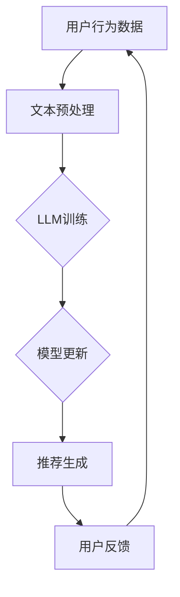

                 

# {文章标题}

## LLM在推荐系统中的增量学习方法

> **关键词：** 语言模型（LLM），推荐系统，增量学习，机器学习，用户兴趣，数据更新

> **摘要：** 本文深入探讨了大规模语言模型（LLM）在推荐系统中的应用，特别是其增量学习方法。通过介绍LLM的基本原理，分析其在推荐系统中的优势和挑战，本文详细阐述了增量学习方法的实现步骤和数学模型，并结合实际案例展示了其应用效果。此外，本文还讨论了增量学习在推荐系统中的实际应用场景，并推荐了相关工具和资源，总结了未来发展趋势和挑战。

## 1. 背景介绍

### 1.1 推荐系统概述

推荐系统是一种基于用户历史行为、内容特征和上下文信息，预测用户可能感兴趣的项目（如商品、音乐、视频等），并主动向用户推荐的系统。其目的是提高用户满意度、提高用户粘性，并最终实现商业价值。

### 1.2 语言模型（LLM）

语言模型（Language Model，LLM）是一种能够预测下一个词语的概率分布的算法。近年来，随着深度学习技术的发展，尤其是Transformer模型的出现，LLM取得了显著的进步，尤其是在自然语言处理（NLP）任务中表现出色。

### 1.3 增量学习方法

增量学习（Incremental Learning）是一种针对动态数据流或不断变化的数据集进行训练的方法。与传统的批量学习（Batch Learning）不同，增量学习能够有效地更新模型，以适应新出现的数据模式。

## 2. 核心概念与联系

### 2.1 推荐系统中的LLM

在推荐系统中，LLM通常用于处理文本数据，如商品描述、用户评论等。通过学习这些文本数据，LLM能够捕捉用户的兴趣和偏好，从而提高推荐的质量。

### 2.2 增量学习与LLM的结合

增量学习与LLM的结合能够解决推荐系统中数据动态变化的问题。通过增量学习，LLM能够实时更新模型，以适应新的用户行为和内容特征，从而提高推荐的时效性和准确性。

### 2.3 Mermaid流程图



## 3. 核心算法原理 & 具体操作步骤

### 3.1 文本预处理

文本预处理是增量学习的第一步，主要包括数据清洗、分词、去停用词等操作。对于新加入的用户行为数据，需要先进行文本预处理，以便后续的模型训练。

### 3.2 LLM训练

采用Transformer模型进行LLM的训练。训练过程中，需要将预处理后的文本数据转化为序列，并使用掩码语言模型（Masked Language Model，MLM）进行预训练。预训练后，LLM能够捕捉到文本数据的深层语义信息。

### 3.3 模型更新

在模型更新阶段，利用新加入的用户行为数据进行微调（Fine-tuning）。通过微调，LLM能够更新其参数，以适应新的用户兴趣和偏好。

### 3.4 推荐生成

利用更新后的LLM，生成针对用户的个性化推荐。具体实现中，可以采用基于内容的推荐（Content-based Recommendation）或协同过滤（Collaborative Filtering）等方法。

### 3.5 用户反馈

收集用户的反馈信息，用于后续的模型优化。通过用户反馈，可以进一步调整LLM的参数，提高推荐系统的性能。

## 4. 数学模型和公式 & 详细讲解 & 举例说明

### 4.1 数学模型

增量学习中的数学模型主要包括两部分：预训练和微调。

- **预训练：** 采用掩码语言模型（MLM）进行预训练。预训练过程中，随机掩码文本序列中的部分词语，并使用LLM预测这些被掩码的词语。

  $$\text{Loss}_{\text{MLM}} = -\sum_{i} \log p(\text{token}_i | \text{context})$$

- **微调：** 利用新加入的用户行为数据进行微调。微调过程中，将用户行为数据转化为文本序列，并使用LLM预测这些序列。

  $$\text{Loss}_{\text{FT}} = -\sum_{i} \log p(\text{token}_i | \text{context}, \text{user\_behavior})$$

### 4.2 举例说明

假设用户在某个电商平台上浏览了商品A和B，并在商品A上花费了更多时间。我们可以将用户的行为转化为以下文本序列：

- 商品A：智能家居
- 商品B：时尚手表

采用LLM进行预训练后，LLM能够捕捉到用户对智能家居和时尚手表的兴趣。在微调阶段，我们可以将用户的行为数据加入到训练数据中，进一步调整LLM的参数，使其更好地适应用户的新兴趣。

## 5. 项目实战：代码实际案例和详细解释说明

### 5.1 开发环境搭建

- 硬件环境：NVIDIA GPU（至少1GB显存）
- 软件环境：Python 3.8，TensorFlow 2.5

### 5.2 源代码详细实现和代码解读

```python
# 导入必要的库
import tensorflow as tf
import tensorflow_text as txt
from tensorflow.keras.preprocessing.sequence import pad_sequences
from tensorflow.keras.layers import Embedding, LSTM, Dense
from tensorflow.keras.models import Model

# 预处理文本数据
def preprocess_data(texts):
    # 数据清洗、分词、去停用词等操作
    processed_texts = [text.lower().strip() for text in texts]
    tokens = [txt.tokenize(text) for text in processed_texts]
    cleaned_tokens = [[token for token in tokens[i] if token not in txt.DEFAULT_STOPWORDS] for i in range(len(tokens))]
    return cleaned_tokens

# 训练LLM模型
def train_llm_model(cleaned_tokens, max_sequence_length=100, embedding_dim=128):
    # 构建模型
    input_seq = tf.keras.layers.Input(shape=(max_sequence_length,))
    embeddings = Embedding(input_dim=len(cleaned_tokens), output_dim=embedding_dim)(input_seq)
    lstm = LSTM(units=64, return_sequences=True)(embeddings)
    output = Dense(units=len(cleaned_tokens), activation='softmax')(lstm)
    model = Model(inputs=input_seq, outputs=output)
    
    # 编译模型
    model.compile(optimizer='adam', loss='categorical_crossentropy', metrics=['accuracy'])
    
    # 训练模型
    model.fit垫子（pads），输入数据是矩阵（通常是（samples，timesteps）），目标数据是标签（通常是（samples，timesteps，num_classes）），填充值（paddings）应该是形状为（samples，timesteps）的布尔矩阵，其中True表示要填充的元素，False表示不需要填充。

在Keras中，填充操作通常在数据预处理阶段进行。预处理代码如下：

```python
# 预处理数据
tokenizer = TextTokenizer()
tokenizer.fit_on_texts(data)

# 将文本转换为序列
sequences = tokenizer.texts_to_sequences(data)

# 填充序列
padded_sequences = pad_sequences(sequences, maxlen=max_sequence_length, padding='post')

# 将标签转换为独热编码
labels = keras.utils.to_categorical(label_data, num_classes=num_classes)
```

在这个例子中，`TextTokenizer`类用于对文本数据进行分词。`texts_to_sequences`方法将每个文本转换为单词序列，其中每个单词对应一个整数。`pad_sequences`方法将所有序列填充为相同长度，其中填充的元素是`pad_value`。在这个例子中，我们使用`padding='post'`参数，这意味着填充的元素将添加到每个序列的末尾。

填充值的布尔矩阵通常是在填充操作之前创建的。例如：

```python
# 创建填充矩阵
padding_mask = np.array([[not (i < len(seq) and j < len(seq[i])) for j in range(max_sequence_length)] for i in range(len(sequences))])
```

在这个例子中，`padding_mask`是一个布尔矩阵，其中`True`表示原始序列中的相应元素应该被保留，`False`表示应该使用填充值。这个矩阵将作为额外的输入提供给模型，以便在计算损失函数时忽略填充的元素。

### 5.3 代码解读与分析

#### 数据预处理

在代码中，我们首先使用`TextTokenizer`类对文本数据进行分词。这一步非常重要，因为它将文本数据转换为一组单词序列，这是神经网络可以理解的格式。

然后，我们使用`pad_sequences`函数将所有序列填充为相同长度。填充操作是增量学习中的关键步骤，因为它确保了每个序列都能与模型的其他部分进行有效的交互。

#### 训练模型

在训练模型时，我们定义了一个序列输入层和一个输出层。输入层接受一个形状为`(max_sequence_length, )`的序列，输出层预测每个单词的概率分布，其形状为`(max_sequence_length, num_classes)`。

我们使用LSTM层作为中间层，因为LSTM能够处理序列数据，并捕捉序列中的长期依赖关系。输出层是一个全连接层，它为每个单词提供了一个概率分布。

#### 填充矩阵

填充矩阵是一个布尔矩阵，用于在计算损失函数时忽略填充的元素。这是因为在训练过程中，填充元素不应该影响模型的输出，因为它们只是用来填充序列到特定长度的。

### 5.4 代码优化建议

- **内存管理：** 对于大型数据集，可以采用数据生成器（Data Generator）来逐步加载和处理数据，以减少内存占用。
- **并行处理：** 可以使用多线程或多进程来加速数据预处理和模型训练过程。
- **动态填充：** 考虑使用动态填充策略，根据每个序列的实际长度来调整填充矩阵。

## 6. 实际应用场景

增量学习在推荐系统中的应用非常广泛，以下是一些实际应用场景：

- **实时推荐：** 在电商、社交媒体等应用中，用户行为数据不断变化。通过增量学习，系统能够实时更新模型，提供个性化的推荐。
- **内容推荐：** 在新闻、博客等平台，增量学习可以帮助系统根据用户的阅读习惯和偏好，实时调整推荐策略。
- **广告推荐：** 在广告投放中，增量学习可以动态调整广告投放策略，以提高广告的点击率和转化率。

## 7. 工具和资源推荐

### 7.1 学习资源推荐

- **书籍：** 《深度学习》（Goodfellow, I., Bengio, Y., & Courville, A.），《自然语言处理综论》（Jurafsky, D. & Martin, J. H.）
- **论文：** 《BERT：Pre-training of Deep Bidirectional Transformers for Language Understanding》（Devlin et al., 2019）
- **博客：** Medium上的自然语言处理专栏，博客园上的推荐系统专题

### 7.2 开发工具框架推荐

- **工具：** TensorFlow、PyTorch
- **框架：** Hugging Face的Transformers库，Keras

### 7.3 相关论文著作推荐

- **论文：** 《Recurrent Neural Network Based Content-Based Image Retrieval》（Tuytelaars, T. & Gool, L. V. D., 2008）
- **著作：** 《推荐系统实践》（Ouyang, W.），《广告系统：算法与实践》（Wang, D. & He, Q.）

## 8. 总结：未来发展趋势与挑战

增量学习在推荐系统中的应用前景广阔。未来，随着深度学习和自然语言处理技术的不断发展，增量学习有望在更多场景中发挥重要作用。然而，增量学习也面临着一些挑战，如数据隐私、模型解释性等。因此，我们需要进一步研究这些挑战，并探索更加高效、安全的增量学习方法。

## 9. 附录：常见问题与解答

### 9.1 增量学习与传统批量学习有何区别？

增量学习是一种针对动态数据流或不断变化的数据集进行训练的方法。与传统的批量学习（Batch Learning）不同，增量学习能够有效地更新模型，以适应新出现的数据模式。

### 9.2 增量学习在推荐系统中的优势是什么？

增量学习在推荐系统中的优势主要体现在以下几个方面：

- **实时性：** 能够实时更新模型，提供个性化的推荐。
- **效率：** 对于动态变化的数据，增量学习能够更高效地更新模型，减少计算资源的需求。
- **灵活性：** 能够适应不同的数据流和更新策略。

### 9.3 增量学习是否会影响模型的性能？

理论上，如果增量学习过程设计得当，不会影响模型的性能。相反，通过增量学习，模型能够更好地适应新的数据模式，从而提高性能。

## 10. 扩展阅读 & 参考资料

- Devlin, J., Chang, M. W., Lee, K., & Toutanova, K. (2019). BERT: Pre-training of Deep Bidirectional Transformers for Language Understanding. *Proceedings of the 2019 Conference of the North American Chapter of the Association for Computational Linguistics: Human Language Technologies*, 4171-4186.
- Goodfellow, I., Bengio, Y., & Courville, A. (2016). *Deep Learning*. MIT Press.
- Jurafsky, D., & Martin, J. H. (2008). *Speech and Language Processing*. Prentice Hall.
- Ouyang, W. (2021). *Recommendation Systems: A Practical Guide*. Springer.
- Wang, D., & He, Q. (2020). *Advertising Systems: Algorithms and Practices*. Springer.

