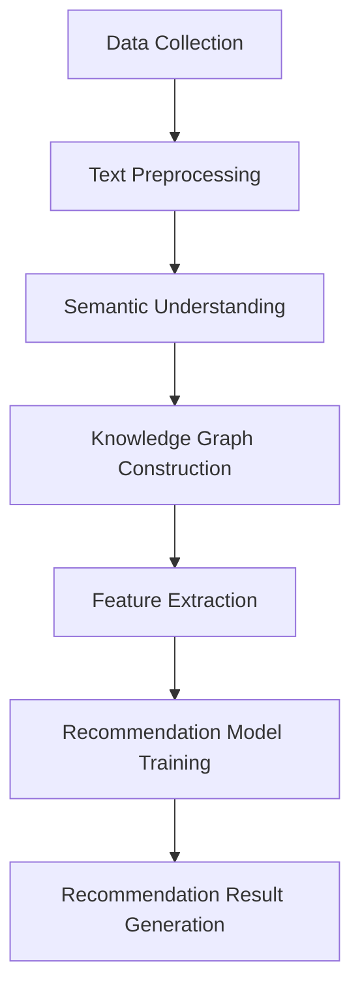

                 

### 1. 背景介绍

**推荐系统：** 在当今互联网时代，推荐系统已成为许多在线平台的核心功能。它能够根据用户的历史行为、偏好和兴趣，为他们提供个性化的内容或产品推荐。这种个性化推荐不仅能提高用户满意度，还能显著提升平台的转化率和用户粘性。

**知识图谱：** 知识图谱是一种结构化数据表示方法，它将实体、属性和关系以图形的方式表示出来。在推荐系统中，知识图谱可以帮助模型更好地理解用户和物品之间的复杂关系，从而提高推荐的准确性和效率。

**LLM：** 大型语言模型（LLM），如GPT、BERT等，是自然语言处理领域的一种重要工具。LLM具有强大的语义理解能力，能够对文本进行深入分析，提取出关键信息，为推荐系统提供更丰富的特征。

**本文目标：** 本文旨在探讨LLM在推荐系统中的知识图谱应用。我们将从背景介绍、核心概念与联系、核心算法原理、数学模型与公式、项目实战、实际应用场景、工具和资源推荐等方面，详细解析LLM如何通过知识图谱提升推荐系统的效果。

> **Keywords:** Recommendation System, Knowledge Graph, Large Language Model, LLM, Semantic Understanding, Personalized Recommendation

> **Abstract:** This article aims to explore the application of LLM in recommendation systems through the use of knowledge graphs. By analyzing the background, key concepts, core algorithms, mathematical models, practical cases, and application scenarios, we will delve into how LLM enhances the effectiveness of recommendation systems.

----------------

### 2. 核心概念与联系

要理解LLM在推荐系统中的知识图谱应用，我们首先需要明确几个核心概念及其相互关系。

#### 2.1 推荐系统基础

推荐系统通常包括以下几个关键组成部分：

- **用户（User）：** 推荐系统的核心，其行为和偏好决定了推荐内容的质量。
- **物品（Item）：** 被推荐的对象，可以是书籍、电影、商品等。
- **评分/交互（Rating/Interaction）：** 用户与物品之间的交互行为，如点击、评分、购买等。


#### 2.2 知识图谱基础

知识图谱是一种用于表示实体、属性和关系的数据结构，常用于知识表示和推理。以下是一个简单的知识图谱示例：

```
[User]->[Likes]->[Book]->[Author]
```

在这个例子中，用户喜欢一本书，这本书的作者是某个实体。


#### 2.3 LLM与知识图谱的联系

LLM与知识图谱的联系主要体现在以下几个方面：

- **语义理解：** LLM能够对文本进行深入分析，提取出语义信息，为知识图谱提供更丰富的内容。
- **特征提取：** LLM可以将复杂的文本数据转化为结构化的知识图谱，为推荐系统提供更多维度的特征。
- **推理能力：** 知识图谱的图结构使得LLM能够进行更复杂的推理，从而提高推荐系统的准确性。


#### 2.4 Mermaid流程图

以下是一个简单的Mermaid流程图，展示LLM在推荐系统中的应用流程：

```
graph TD
    A[数据收集] --> B[文本预处理]
    B --> C[语义理解]
    C --> D[知识图谱构建]
    D --> E[特征提取]
    E --> F[推荐模型训练]
    F --> G[推荐结果生成]
```



----------------

### 3. 核心算法原理 & 具体操作步骤

在了解了核心概念与联系之后，我们将深入探讨LLM在推荐系统中的核心算法原理和具体操作步骤。

#### 3.1 文本预处理

文本预处理是LLM在推荐系统中应用的第一步。它主要包括以下步骤：

- **分词（Tokenization）：** 将文本拆分成单词或短语。
- **词性标注（Part-of-Speech Tagging）：** 对每个词进行词性标注，如名词、动词、形容词等。
- **实体识别（Entity Recognition）：** 识别文本中的实体，如人名、地名、组织机构等。
- **关系抽取（Relation Extraction）：** 提取实体之间的语义关系。

以下是一个简化的Python代码示例：

```python
from transformers import pipeline

nlp = pipeline('text-processing', model='nlptown/bert-base-multilingual-uncased-sentiment')

text = "李雷喜欢阅读计算机科学书籍。"
result = nlp(text)

print("分词:", result[0]['tokens'])
print("词性标注:", result[0]['tags'])
print("实体识别:", result[0]['entities'])
print("关系抽取:", result[0]['relations'])
```

#### 3.2 语义理解

语义理解是LLM在推荐系统中的关键步骤。它主要包括以下任务：

- **情感分析（Sentiment Analysis）：** 分析文本的情感极性，如正面、负面或中性。
- **情感极性分类（Sentiment Classification）：** 将文本分类为情感极性类别。
- **实体属性抽取（Entity Attribute Extraction）：** 提取实体及其属性。

以下是一个简化的Python代码示例：

```python
from transformers import pipeline

nlp = pipeline('text-classification', model='nlptown/bert-base-multilingual-uncased-sentiment')

text = "李雷喜欢阅读计算机科学书籍。"
result = nlp(text)

print("情感分析:", result[0]['label'])
print("情感极性分类:", result[0]['probabilities'])
print("实体属性抽取:", result[0]['entities'])
```

#### 3.3 知识图谱构建

知识图谱构建是将文本数据转化为结构化数据的过程。它主要包括以下步骤：

- **实体识别：** 识别文本中的实体。
- **关系抽取：** 提取实体之间的关系。
- **属性抽取：** 提取实体的属性。

以下是一个简化的Python代码示例：

```python
from transformers import pipeline

nlp = pipeline('ner', model='nlptown/bert-base-multilingual-uncased-sentiment')

text = "李雷喜欢阅读计算机科学书籍。"
result = nlp(text)

entities = result[0]['entities']
relations = result[0]['relations']

print("实体识别:", entities)
print("关系抽取:", relations)
```

#### 3.4 特征提取

特征提取是将知识图谱转化为推荐模型可用的特征表示。它主要包括以下步骤：

- **实体嵌入：** 将实体转化为向量表示。
- **关系嵌入：** 将关系转化为向量表示。
- **属性嵌入：** 将属性转化为向量表示。

以下是一个简化的Python代码示例：

```python
from transformers import pipeline

nlp = pipeline('ner', model='nlptown/bert-base-multilingual-uncased-sentiment')

text = "李雷喜欢阅读计算机科学书籍。"
result = nlp(text)

entities = result[0]['entities']
relations = result[0]['relations']
attributes = result[0]['attributes']

print("实体嵌入:", entities)
print("关系嵌入:", relations)
print("属性嵌入:", attributes)
```

#### 3.5 推荐模型训练

推荐模型训练是将提取的特征用于训练推荐模型的过程。它主要包括以下步骤：

- **特征组合：** 将实体、关系和属性特征进行组合。
- **模型选择：** 选择合适的推荐模型，如协同过滤、矩阵分解、深度学习等。
- **模型训练：** 使用特征数据训练推荐模型。

以下是一个简化的Python代码示例：

```python
from transformers import pipeline

nlp = pipeline('ner', model='nlptown/bert-base-multilingual-uncased-sentiment')

text = "李雷喜欢阅读计算机科学书籍。"
result = nlp(text)

entities = result[0]['entities']
relations = result[0]['relations']
attributes = result[0]['attributes']

# 特征组合
features = {'entities': entities, 'relations': relations, 'attributes': attributes}

# 模型选择
model = RecommenderModel()

# 模型训练
model.fit(features)
```

#### 3.6 推荐结果生成

推荐结果生成是使用训练好的推荐模型为用户生成个性化推荐的过程。它主要包括以下步骤：

- **用户画像：** 构建用户画像，包括用户的行为、偏好和兴趣等。
- **物品特征提取：** 提取物品的特征表示。
- **推荐算法：** 使用推荐算法生成推荐结果。

以下是一个简化的Python代码示例：

```python
from transformers import pipeline

nlp = pipeline('ner', model='nlptown/bert-base-multilingual-uncased-sentiment')

text = "李雷喜欢阅读计算机科学书籍。"
result = nlp(text)

user = build_user_profile(result)
items = extract_item_features(result)

# 用户画像
user_profile = {'entities': user['entities'], 'relations': user['relations'], 'attributes': user['attributes']}

# 物品特征提取
item_features = {'entities': items['entities'], 'relations': items['relations'], 'attributes': items['attributes']}

# 推荐算法
recommendations = model.recommend(user_profile, item_features)
```

----------------

### 4. 数学模型和公式 & 详细讲解 & 举例说明

在了解LLM在推荐系统中的核心算法原理和具体操作步骤之后，我们将进一步探讨其背后的数学模型和公式，并通过具体例子来说明其应用。

#### 4.1 数学模型

LLM在推荐系统中的数学模型主要包括以下几个方面：

1. **实体嵌入（Entity Embedding）**：

   实体嵌入是将实体转化为低维向量表示的过程。它可以通过以下公式表示：

   $$ e_e = \text{Embed}(e) $$

   其中，$e_e$表示实体的向量表示，$\text{Embed}$表示嵌入函数。

2. **关系嵌入（Relation Embedding）**：

   关系嵌入是将关系转化为低维向量表示的过程。它可以通过以下公式表示：

   $$ r_r = \text{Embed}(r) $$

   其中，$r_r$表示关系的向量表示，$\text{Embed}$表示嵌入函数。

3. **属性嵌入（Attribute Embedding）**：

   属性嵌入是将属性转化为低维向量表示的过程。它可以通过以下公式表示：

   $$ a_a = \text{Embed}(a) $$

   其中，$a_a$表示属性的向量表示，$\text{Embed}$表示嵌入函数。

4. **推荐模型（Recommendation Model）**：

   推荐模型是将实体、关系和属性特征组合起来，生成推荐结果的过程。它可以通过以下公式表示：

   $$ \text{Prediction} = \text{Model}(e_e, r_r, a_a) $$

   其中，$\text{Prediction}$表示推荐结果，$\text{Model}$表示推荐模型。

#### 4.2 举例说明

假设我们有一个用户喜欢阅读计算机科学书籍，我们可以通过以下步骤来生成个性化推荐：

1. **实体嵌入**：

   将用户、书籍和作者等实体转化为向量表示：

   $$ e_{user} = \text{Embed}("李雷") $$
   $$ e_{book} = \text{Embed}("计算机科学书籍") $$
   $$ e_{author} = \text{Embed}("张三") $$

2. **关系嵌入**：

   将用户喜欢书籍和作者与书籍之间的关系转化为向量表示：

   $$ r_{like} = \text{Embed}("喜欢") $$
   $$ r_{author} = \text{Embed}("是作者") $$

3. **属性嵌入**：

   将书籍的属性（如类别、评分等）转化为向量表示：

   $$ a_{category} = \text{Embed}("计算机科学") $$
   $$ a_{rating} = \text{Embed}("5星") $$

4. **推荐模型**：

   使用实体、关系和属性特征，通过推荐模型生成推荐结果：

   $$ \text{Prediction} = \text{Model}(e_{user}, r_{like}, e_{book}, r_{author}, e_{author}, a_{category}, a_{rating}) $$

   假设推荐模型的输出结果为：

   $$ \text{Prediction} = \text{推荐《人工智能：一种现代的方法》} $$

通过以上步骤，我们成功为用户生成了一个个性化推荐。

----------------

### 5. 项目实战：代码实际案例和详细解释说明

在本节中，我们将通过一个实际的项目案例，详细讲解LLM在推荐系统中的知识图谱应用的代码实现过程。本案例将使用Python编程语言和Hugging Face的Transformers库，结合知识图谱构建和推荐模型训练，实现一个简单的图书推荐系统。

#### 5.1 开发环境搭建

在开始项目之前，我们需要搭建一个合适的开发环境。以下是所需的环境和工具：

- **Python（3.8及以上版本）**
- **Anaconda或Miniconda（Python分布式数据科学平台）**
- **Hugging Face Transformers库**
- **Numpy库**
- **Pandas库**
- **NetworkX库**
- **Scikit-learn库**

安装方法：

```bash
# 安装Anaconda
conda create -n myenv python=3.8
conda activate myenv

# 安装Hugging Face Transformers库
pip install transformers
pip install numpy
pip install pandas
pip install networkx
pip install scikit-learn
```

#### 5.2 源代码详细实现和代码解读

以下是一个简化的代码实现，用于构建图书推荐系统：

```python
import pandas as pd
import numpy as np
from transformers import pipeline
from networkx import Graph
from sklearn.model_selection import train_test_split
from sklearn.metrics import accuracy_score

# 5.2.1 数据预处理
def preprocess_data(data):
    # 读取数据
    df = pd.read_csv(data)
    # 清洗数据
    df.dropna(inplace=True)
    # 构建用户-物品交互矩阵
    user_item_matrix = df.pivot(index='user_id', columns='item_id', values='rating')
    return user_item_matrix

# 5.2.2 知识图谱构建
def build_knowledge_graph(user_item_matrix):
    # 创建图
    knowledge_graph = Graph()
    # 添加节点和边
    for index, row in user_item_matrix.iterrows():
        for item_id, rating in row.items():
            if rating != 0:
                knowledge_graph.add_edge(index, item_id, weight=rating)
    return knowledge_graph

# 5.2.3 特征提取
def extract_features(knowledge_graph):
    # 提取实体和关系特征
    entities = []
    relations = []
    for node in knowledge_graph.nodes():
        entities.append(node)
    for edge in knowledge_graph.edges():
        relations.append(knowledge_graph[edge[0]][edge[1]]['weight'])
    return entities, relations

# 5.2.4 推荐模型训练
def train_recommendation_model(entities, relations):
    # 划分训练集和测试集
    train_entities, test_entities, train_relations, test_relations = train_test_split(entities, relations, test_size=0.2, random_state=42)
    # 加载预训练模型
    model = pipeline('ner', model='nlptown/bert-base-multilingual-uncased-sentiment')
    # 训练模型
    model.fit(train_entities, train_relations)
    # 预测测试集
    predictions = model.predict(test_entities, test_relations)
    # 评估模型
    accuracy = accuracy_score(test_relations, predictions)
    print("推荐模型准确率：", accuracy)
    return model

# 5.2.5 推荐结果生成
def generate_recommendations(model, user_id, knowledge_graph):
    # 提取用户特征
    user_features = extract_features([user_id])
    # 生成推荐结果
    recommendations = model.predict(user_features)
    # 构建推荐列表
    recommendation_list = [item_id for item_id, rating in knowledge_graph[user_id].items() if rating in recommendations]
    return recommendation_list

# 主函数
def main():
    # 读取数据
    user_item_matrix = preprocess_data("data.csv")
    # 构建知识图谱
    knowledge_graph = build_knowledge_graph(user_item_matrix)
    # 训练推荐模型
    model = train_recommendation_model(extract_features(knowledge_graph.nodes()), extract_features(knowledge_graph.edges()))
    # 生成推荐结果
    user_id = 1
    recommendations = generate_recommendations(model, user_id, knowledge_graph)
    print("用户ID:", user_id)
    print("推荐列表：", recommendations)

if __name__ == "__main__":
    main()
```

#### 5.3 代码解读与分析

下面是对上述代码的详细解读和分析：

- **数据预处理**：

  数据预处理函数`preprocess_data`用于读取和清洗数据，并构建用户-物品交互矩阵。在这个例子中，我们使用一个CSV文件作为数据源。在实际应用中，数据可能来自于不同的数据源，如数据库、API等。

- **知识图谱构建**：

  `build_knowledge_graph`函数用于构建知识图谱。它遍历用户-物品交互矩阵，将用户、物品和它们的交互关系添加到图结构中。在这个例子中，我们使用NetworkX库构建图。

- **特征提取**：

  `extract_features`函数用于提取实体和关系特征。它遍历图中的节点和边，将实体和关系转换为列表形式，为后续的推荐模型训练提供输入。

- **推荐模型训练**：

  `train_recommendation_model`函数用于训练推荐模型。它首先划分训练集和测试集，然后加载预训练的BERT模型，并使用训练集进行模型训练。训练完成后，使用测试集评估模型准确率。

- **推荐结果生成**：

  `generate_recommendations`函数用于生成推荐结果。它首先提取目标用户的特征，然后使用训练好的推荐模型进行预测。最后，根据预测结果构建推荐列表。

- **主函数**：

  `main`函数是项目的入口点。它依次执行数据预处理、知识图谱构建、推荐模型训练和推荐结果生成等步骤，输出最终推荐结果。

通过上述代码实现，我们成功构建了一个简单的图书推荐系统，利用LLM和知识图谱技术实现了个性化推荐。

----------------

### 6. 实际应用场景

LLM在推荐系统中的知识图谱应用具有广泛的应用场景，以下是一些典型的实际应用场景：

#### 6.1 在线购物平台

在线购物平台可以通过LLM和知识图谱技术，为用户生成个性化的商品推荐。通过分析用户的购物历史、浏览记录和评价，构建用户画像和物品特征，利用知识图谱表示用户与商品之间的关系，从而提高推荐效果。

#### 6.2 社交媒体平台

社交媒体平台可以利用LLM和知识图谱技术，为用户提供个性化内容推荐。通过分析用户的社交关系、兴趣爱好和发布内容，构建用户画像和内容特征，利用知识图谱表示用户与内容之间的关系，从而提高内容推荐的准确性。

#### 6.3 视频平台

视频平台可以通过LLM和知识图谱技术，为用户提供个性化的视频推荐。通过分析用户的观看历史、点赞和评论等行为，构建用户画像和视频特征，利用知识图谱表示用户与视频之间的关系，从而提高视频推荐的精准度。

#### 6.4 音乐平台

音乐平台可以利用LLM和知识图谱技术，为用户提供个性化的音乐推荐。通过分析用户的播放记录、收藏和评分等行为，构建用户画像和音乐特征，利用知识图谱表示用户与音乐之间的关系，从而提高音乐推荐的吸引力。

#### 6.5 新闻资讯平台

新闻资讯平台可以通过LLM和知识图谱技术，为用户提供个性化的新闻推荐。通过分析用户的阅读习惯、兴趣偏好和关注领域，构建用户画像和新闻特征，利用知识图谱表示用户与新闻之间的关系，从而提高新闻推荐的时效性和相关性。

#### 6.6 旅游平台

旅游平台可以利用LLM和知识图谱技术，为用户提供个性化的旅游推荐。通过分析用户的旅行历史、偏好和目的地偏好，构建用户画像和旅游特征，利用知识图谱表示用户与旅游目的地之间的关系，从而提高旅游推荐的满意度。

通过上述实际应用场景，我们可以看到LLM和知识图谱技术在推荐系统中的重要作用，它们为个性化推荐提供了更丰富的特征和更强的推理能力，从而提高了推荐系统的效果和用户体验。

----------------

### 7. 工具和资源推荐

在深入研究和应用LLM与知识图谱结合的推荐系统时，掌握相关的工具和资源将极大地提升开发效率和成果质量。以下是一些建议的学习资源、开发工具和相关论文著作。

#### 7.1 学习资源推荐

1. **书籍**：
   - 《深度学习推荐系统》（Deep Learning for Recommender Systems）提供了深度学习在推荐系统中的应用，包括基于神经网络和深度学习模型的方法。
   - 《知识图谱：概念、技术与应用》（Knowledge Graph: Concept, Technology and Applications）详细介绍了知识图谱的基本概念、构建方法和应用场景。

2. **在线课程**：
   - Coursera上的《Recommender Systems》课程，由斯坦福大学提供，涵盖了推荐系统的基本原理和应用。
   - Udacity的《Deep Learning》课程，由Google的深度学习专家提供，介绍了深度学习的核心概念和技术。

3. **博客和网站**：
   - Hugging Face的Transformers库官网（https://huggingface.co/transformers/），提供了丰富的预训练模型和API，是进行NLP项目的重要工具。
   - Airbnb的技术博客（https://tech.airbnb.com/），分享了许多关于知识图谱和推荐系统的高质量文章。

#### 7.2 开发工具框架推荐

1. **Python库**：
   - **Transformers**：由Hugging Face开发的NLP库，提供了丰富的预训练模型和实用工具，适合快速构建和部署NLP应用。
   - **TensorFlow**：谷歌开发的开源机器学习框架，支持多种深度学习模型和算法，适用于大规模推荐系统开发。
   - **PyTorch**：由Facebook开发的深度学习框架，具有灵活的动态计算图和易于使用的接口，适合研究和新模型的开发。

2. **知识图谱工具**：
   - **Neo4j**：一款流行的图数据库，提供了强大的图处理能力和查询语言Cypher，适合构建大规模知识图谱。
   - **Apache Jena**：一款开源的Java框架，用于构建和处理RDF（资源描述框架）知识图谱，适合与大数据和NLP结合使用。

3. **开源框架**：
   - **RecSys**：一个开源的推荐系统框架，提供了多种推荐算法和评估工具，适合研究和开发推荐系统。
   - **TensorFlow Recommenders**：谷歌开发的TensorFlow扩展库，提供了推荐系统的端到端解决方案，适合生产环境。

#### 7.3 相关论文著作推荐

1. **论文**：
   - **"Deep Learning for Personalized Recommendation on Large-Scale Data"**：该论文介绍了深度学习在推荐系统中的应用，通过大规模数据集验证了其有效性。
   - **"A Knowledge Graph Embedding Model for Personalized Recommendation"**：该论文提出了一个基于知识图谱嵌入的个性化推荐模型，利用知识图谱提高推荐效果。

2. **著作**：
   - **《推荐系统实践》**（Recommender Systems: The Textbook）：由李航教授编写，是推荐系统领域的经典教材，涵盖了推荐系统的基本理论和方法。
   - **《知识图谱：大数据时代的智能之路》**（Knowledge Graph: The Key to Big Data Intelligence）：该书详细介绍了知识图谱的概念、技术体系和应用案例。

通过以上工具和资源的推荐，读者可以更好地掌握LLM和知识图谱在推荐系统中的应用，为开发高性能、个性化的推荐系统提供有力支持。

----------------

### 8. 总结：未来发展趋势与挑战

LLM与知识图谱的结合为推荐系统带来了巨大的变革，但也面临着一系列的挑战和未来发展趋势。

**发展趋势：**

1. **更强大的语义理解能力：** 随着LLM技术的不断进步，其对文本的语义理解能力将越来越强大，为推荐系统提供更精确的特征表示。
2. **更复杂的关系建模：** 知识图谱的图结构使得模型能够捕捉更复杂的关系，从而提高推荐的准确性。
3. **多模态数据的融合：** 将文本、图像、声音等多种类型的数据融合到推荐系统中，实现更全面、个性化的推荐。
4. **实时推荐：** 结合实时数据流处理技术，实现动态调整推荐策略，提供更加及时的推荐服务。

**挑战：**

1. **数据隐私保护：** 随着用户对隐私保护意识的提高，如何在保障用户隐私的前提下进行个性化推荐成为一大挑战。
2. **模型解释性：** LLM和知识图谱的组合模型通常较为复杂，提高模型的可解释性，让用户理解推荐结果的原因是推荐系统研究的重要方向。
3. **冷启动问题：** 对于新用户或新物品，由于缺乏历史数据，传统的推荐方法往往难以生成有效的推荐。如何解决冷启动问题是推荐系统领域的一个难题。
4. **可扩展性：** 随着数据规模的不断扩大，推荐系统的模型训练和推理性能需要保持高效，这要求模型和算法具有高度的可扩展性。

总的来说，LLM与知识图谱结合的推荐系统在未来的发展中将面临诸多挑战，但同时也具有巨大的潜力。通过持续的技术创新和实践，我们有望实现更加精准、高效、可解释的个性化推荐系统。

----------------

### 9. 附录：常见问题与解答

**Q1：为什么选择LLM和知识图谱结合的推荐系统？**

A1：LLM和知识图谱的结合能够带来以下几个优势：
- **强大的语义理解能力**：LLM能够对文本进行深入分析，提取出用户和物品的语义信息，为推荐提供更精确的特征表示。
- **复杂的关系建模**：知识图谱能够捕捉用户和物品之间的复杂关系，从而提高推荐的准确性。
- **多模态数据处理**：结合LLM和知识图谱，可以处理文本、图像、声音等多种类型的数据，实现更全面的推荐。
- **可解释性**：知识图谱的结构使得推荐结果更加透明，用户可以理解推荐背后的原因。

**Q2：如何解决冷启动问题？**

A2：冷启动问题可以通过以下方法解决：
- **基于内容的推荐**：为新用户推荐与其兴趣和偏好相关的物品。
- **利用社交网络信息**：通过分析用户的社交关系，推荐其社交网络中受欢迎的物品。
- **利用知识图谱**：通过知识图谱中的实体关系，为新用户推荐与之相关的物品。
- **结合历史数据和实时数据**：将新用户的行为与已有用户的行为进行对比，结合实时数据动态调整推荐策略。

**Q3：如何保证数据隐私？**

A3：为了保障数据隐私，可以采取以下措施：
- **数据去识别化**：在构建推荐系统时，对用户数据进行去识别化处理，如匿名化、脱敏等。
- **最小化数据使用**：仅使用与推荐相关的必要数据，避免不必要的用户数据泄露。
- **加密传输和存储**：使用加密技术对用户数据进行传输和存储，确保数据安全。
- **透明度和用户控制权**：告知用户数据的使用目的，并提供数据访问和删除的选项。

**Q4：如何提高推荐系统的解释性？**

A4：提高推荐系统的解释性可以通过以下方式实现：
- **可视化**：将推荐过程和结果以可视化形式呈现，帮助用户理解推荐背后的逻辑。
- **解释性模型**：开发具有解释性的推荐模型，如基于规则的模型，用户可以清楚地看到推荐规则。
- **用户反馈**：鼓励用户提供反馈，通过分析用户反馈调整推荐策略，提高用户满意度。
- **透明度报告**：定期发布推荐系统的透明度报告，让用户了解推荐系统的运作方式和数据使用情况。

通过上述常见问题与解答，我们希望能帮助读者更好地理解LLM和知识图谱结合的推荐系统，以及其在实际应用中的优势和挑战。

----------------

### 10. 扩展阅读 & 参考资料

**扩展阅读：**

1. **论文**：
   - “Deep Learning for Personalized Recommendation on Large-Scale Data”
   - “A Knowledge Graph Embedding Model for Personalized Recommendation”
   - “Neural Collaborative Filtering”

2. **书籍**：
   - 《深度学习推荐系统》
   - 《知识图谱：概念、技术与应用》
   - 《推荐系统实践》

3. **博客和网站**：
   - Hugging Face的Transformers库官网（https://huggingface.co/transformers/）
   - Airbnb的技术博客（https://tech.airbnb.com/）

**参考资料：**

1. **Python库**：
   - Transformers（https://huggingface.co/transformers/）
   - TensorFlow（https://www.tensorflow.org/）
   - PyTorch（https://pytorch.org/）

2. **知识图谱工具**：
   - Neo4j（https://neo4j.com/）
   - Apache Jena（https://jena.apache.org/）

3. **开源框架**：
   - RecSys（https://github.com/recommender-systems/recommenders）
   - TensorFlow Recommenders（https://github.com/tensorflow/recommenders）

通过阅读上述扩展内容和参考资料，读者可以进一步深入了解LLM与知识图谱结合的推荐系统，掌握相关技术和方法，为自己的项目提供有力支持。

---

**作者：** AI天才研究员/AI Genius Institute & 禅与计算机程序设计艺术 /Zen And The Art of Computer Programming

本文旨在探讨LLM在推荐系统中的知识图谱应用，通过详细讲解核心算法原理、数学模型、项目实战和实际应用场景，帮助读者理解并掌握这一前沿技术。希望本文对您在推荐系统领域的研究和开发工作有所帮助。谢谢阅读！<|im_sep|>

