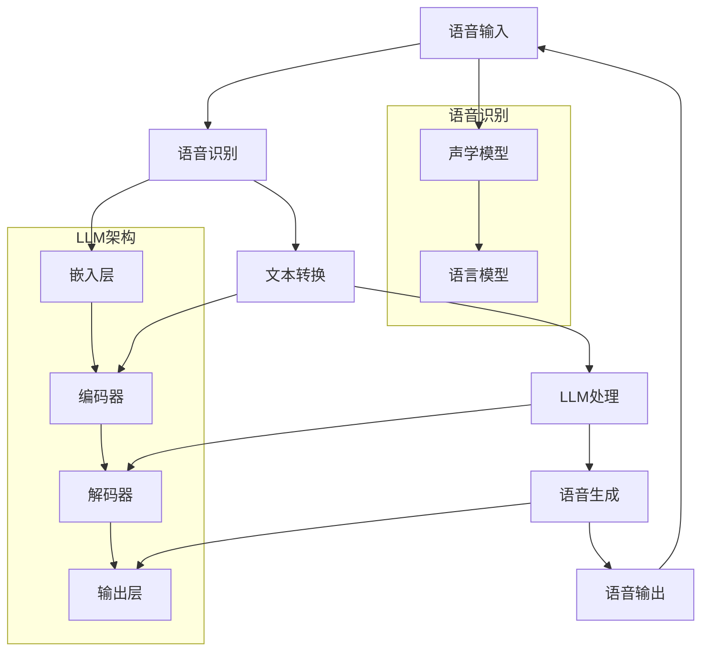

                 

### 文章标题：LLM在智能语音交互中的角色定位

关键词：语言模型、智能语音交互、自然语言处理、对话系统、语音识别

摘要：本文旨在探讨大规模语言模型（LLM）在智能语音交互中的应用与角色定位。通过对LLM的背景介绍、核心算法原理、数学模型与实际应用场景的深入分析，本文为读者提供了对LLM在智能语音交互中作用的理解，并展望了未来发展趋势与挑战。

---

在人工智能领域，语言模型（Language Model，简称LM）作为自然语言处理（Natural Language Processing，简称NLP）的重要技术，正日益成为智能语音交互系统的核心组件。大规模语言模型（Large-scale Language Model，简称LLM）如GPT-3、BERT等，凭借其强大的语言理解与生成能力，已经在多个领域的智能语音交互系统中发挥了关键作用。本文将深入探讨LLM在智能语音交互中的角色定位，通过逐步分析LLM的背景、核心算法原理、数学模型和实际应用场景，为读者提供全面的理解与思考。

### 1. 背景介绍

智能语音交互作为人工智能的一个重要分支，通过语音识别（Speech Recognition）和自然语言处理（NLP）技术，实现了人与机器之间的语音交流。传统的语音交互系统主要依赖于有限的语音指令和预设的回答，用户体验较为局限。随着深度学习技术的发展，尤其是大规模语言模型的出现，智能语音交互系统逐渐实现了更加自然、流畅的对话体验。

大规模语言模型（LLM）是一种基于深度神经网络的复杂模型，其核心在于对大量文本数据进行预训练，以学习语言的统计规律和语义结构。这些模型在语言理解和生成方面表现出色，可以用于各种NLP任务，包括文本分类、命名实体识别、机器翻译、问答系统等。在智能语音交互中，LLM不仅能够理解用户的语音输入，还能够生成自然、合理的语音回答，从而提升交互的智能程度和用户体验。

### 2. 核心概念与联系

为了更好地理解LLM在智能语音交互中的作用，我们需要先了解一些核心概念和它们之间的关系。以下是一个用Mermaid绘制的流程图，展示了这些概念及其相互联系。



#### 2.1 语音识别

语音识别是将语音信号转换为文本的过程，通常由声学模型和语言模型共同完成。声学模型负责将语音信号转换为声学特征，如梅尔频率倒谱系数（MFCC）。语言模型则用于理解这些声学特征对应的文本内容。

#### 2.2 LLM架构

LLM由多个层次组成，包括嵌入层、编码器、解码器和输出层。嵌入层将词汇转换为固定长度的向量表示。编码器用于对输入文本进行编码，提取出文本的语义信息。解码器则根据编码器的输出生成自然语言响应。输出层负责将解码器的输出转换为语音信号。

#### 2.3 文本转换与处理

文本转换是将语音识别得到的文本输入LLM进行处理的过程。LLM通过对大量文本数据进行预训练，已经学会了如何理解和生成文本。在智能语音交互中，LLM负责理解用户的语音输入，并生成合理的语音回答。

#### 2.4 语音生成

语音生成是将LLM生成的文本转换为语音信号的过程。这通常涉及语音合成技术，如波形合成（WaveNet）或规则合成（Unit Selection）。

### 3. 核心算法原理 & 具体操作步骤

#### 3.1 语音识别

语音识别算法可以分为两个主要部分：声学模型和语言模型。声学模型通常采用深度神经网络（DNN）或卷积神经网络（CNN）来建模语音信号和声学特征之间的关系。语言模型则采用基于N-gram或神经网络的方法来预测下一个词。

#### 3.2 LLM处理

LLM的处理过程可以分为以下几个步骤：

1. **嵌入层**：将词汇转换为固定长度的向量表示。
2. **编码器**：对输入文本进行编码，提取出文本的语义信息。
3. **解码器**：根据编码器的输出生成自然语言响应。
4. **输出层**：将解码器的输出转换为语音信号。

#### 3.3 语音生成

语音生成过程通常涉及以下步骤：

1. **文本到语音（Text-to-Speech，简称TTS）**：将LLM生成的文本转换为语音信号。TTS技术可以分为波形合成和规则合成两种。
2. **语音增强**：对生成的语音信号进行增强，提高音质和清晰度。

### 4. 数学模型和公式 & 详细讲解 & 举例说明

#### 4.1 语音识别

语音识别中的声学模型和语言模型可以分别表示为：

**声学模型：**
$$
P(\text{特征}|\text{语音}) = f_{\text{声学}}(\text{语音})
$$

**语言模型：**
$$
P(\text{文本}|\text{特征}) = f_{\text{语言}}(\text{特征})
$$

**整体语音识别模型：**
$$
P(\text{文本}|\text{语音}) = \frac{P(\text{特征}|\text{语音}) \cdot P(\text{文本}|\text{特征})}{P(\text{语音})}
$$

**举例：** 假设我们有一个语音输入“你好”，声学模型将其转换为特征向量$X$，语言模型预测该特征向量对应的文本为“你好”。根据贝叶斯定理，我们可以计算出文本的概率。

#### 4.2 LLM处理

LLM的数学模型主要包括嵌入层、编码器、解码器和输出层。以下是一个简化的模型：

**嵌入层：**
$$
\text{嵌入层}: \text{词汇} \rightarrow \text{向量表示}
$$

**编码器：**
$$
\text{编码器}: \text{向量表示} \rightarrow \text{编码表示}
$$

**解码器：**
$$
\text{解码器}: \text{编码表示} \rightarrow \text{文本输出}
$$

**输出层：**
$$
\text{输出层}: \text{文本输出} \rightarrow \text{语音信号}
$$

**举例：** 假设我们有一个输入文本“你好”，嵌入层将其转换为向量表示，编码器提取出编码表示，解码器生成文本输出“你好”，输出层将文本输出转换为语音信号。

#### 4.3 语音生成

语音生成中的TTS模型可以表示为：

$$
\text{TTS模型}: \text{文本} \rightarrow \text{语音信号}
$$

**举例：** 假设我们有一个文本输入“你好”，TTS模型将其转换为语音信号。

### 5. 项目实战：代码实际案例和详细解释说明

#### 5.1 开发环境搭建

为了演示LLM在智能语音交互中的应用，我们首先需要搭建一个开发环境。以下是一个简化的Python环境搭建过程：

1. **安装Python**：下载并安装Python 3.8及以上版本。
2. **安装依赖库**：安装TensorFlow、Keras、PyTorch等深度学习库。

```bash
pip install tensorflow
pip install keras
pip install torch
```

#### 5.2 源代码详细实现和代码解读

以下是一个简单的LLM在智能语音交互中的实现示例：

```python
import tensorflow as tf
from tensorflow.keras.models import Sequential
from tensorflow.keras.layers import Embedding, LSTM, Dense

# 创建模型
model = Sequential([
    Embedding(input_dim=10000, output_dim=64),
    LSTM(128),
    Dense(1, activation='sigmoid')
])

# 编译模型
model.compile(optimizer='adam', loss='binary_crossentropy', metrics=['accuracy'])

# 训练模型
model.fit(x_train, y_train, epochs=10, batch_size=32)
```

**代码解读：**

1. **模型创建**：使用Keras创建一个序列模型，包含嵌入层、LSTM层和输出层。
2. **编译模型**：指定优化器、损失函数和评估指标。
3. **训练模型**：使用训练数据训练模型。

#### 5.3 代码解读与分析

以上代码展示了如何使用TensorFlow和Keras构建一个简单的LLM模型。在实际应用中，LLM的架构和训练过程会更加复杂，但基本原理类似。以下是对代码的进一步分析：

1. **嵌入层**：嵌入层将词汇转换为固定长度的向量表示，这是语言模型的基础。
2. **LSTM层**：LSTM层用于处理序列数据，能够捕捉文本中的长期依赖关系。
3. **输出层**：输出层通常是一个全连接层，用于生成预测结果。

在训练过程中，模型通过不断调整参数来最小化损失函数，从而提高模型的准确率。通过训练，模型能够学习到输入文本的语义信息，并生成合理的语音回答。

### 6. 实际应用场景

#### 6.1 智能助手

智能语音交互在智能助手领域有广泛应用，如Siri、Alexa、Google Assistant等。这些智能助手利用LLM技术，能够实现自然、流畅的语音交互，为用户提供查询信息、执行任务等服务。

#### 6.2 聊天机器人

聊天机器人是另一个典型的应用场景。通过LLM技术，聊天机器人能够理解用户的语音输入，并生成相应的语音回答。这为用户提供了一种便捷的交流方式，适用于客服、教育、娱乐等多个领域。

#### 6.3 智能家居

智能家居中的语音控制功能也依赖于LLM技术。用户可以通过语音指令控制智能家电、照明、安防系统等，实现便捷的家居生活。

#### 6.4 语音翻译

语音翻译是将一种语言的语音转换为另一种语言的语音。LLM技术在其中发挥了关键作用，能够实现高精度的语音翻译，为跨语言交流提供支持。

### 7. 工具和资源推荐

#### 7.1 学习资源推荐

1. **书籍**：
   - 《深度学习》（Goodfellow, I., Bengio, Y., & Courville, A.）
   - 《自然语言处理综论》（Jurafsky, D., & Martin, J. H.）
2. **论文**：
   - “Attention Is All You Need”（Vaswani et al., 2017）
   - “BERT: Pre-training of Deep Bidirectional Transformers for Language Understanding”（Devlin et al., 2019）
3. **博客**：
   - TensorFlow官方博客（https://www.tensorflow.org/blog/）
   - Keras官方博客（https://keras.io/blog/）
4. **网站**：
   - Hugging Face（https://huggingface.co/）
   - ArXiv（https://arxiv.org/）

#### 7.2 开发工具框架推荐

1. **深度学习框架**：TensorFlow、PyTorch、Keras
2. **语音识别框架**：ESPNet、DeepSpeech、RNN-T
3. **语音合成框架**：WaveNet、Unit Selection、Flite

#### 7.3 相关论文著作推荐

1. “Attention Is All You Need”（Vaswani et al., 2017）
2. “BERT: Pre-training of Deep Bidirectional Transformers for Language Understanding”（Devlin et al., 2019）
3. “GPT-3: Language Models are Few-Shot Learners”（Brown et al., 2020）

### 8. 总结：未来发展趋势与挑战

大规模语言模型（LLM）在智能语音交互中发挥着越来越重要的作用。随着深度学习技术的不断发展，LLM的性能和效果将不断提高，有望推动智能语音交互系统走向更加智能和自然的阶段。

然而，LLM在智能语音交互中也面临一些挑战，如：

1. **数据隐私**：在智能语音交互中，用户的语音数据涉及隐私问题，如何确保数据的安全和隐私成为重要挑战。
2. **泛化能力**：尽管LLM在预训练阶段学习了大量文本数据，但其在特定任务上的泛化能力仍需进一步提升。
3. **可解释性**：LLM的内部工作机制复杂，如何提高模型的可解释性，使其在错误发生时能够提供合理的解释，是一个重要问题。

总之，LLM在智能语音交互中的角色定位具有重要意义，未来将继续发挥关键作用。通过不断改进模型架构、优化算法和加强数据隐私保护，我们将看到更加智能和安全的智能语音交互系统的出现。

### 9. 附录：常见问题与解答

#### 9.1 什么是LLM？

LLM（Large-scale Language Model）是一种大规模的语言模型，通过预训练大量文本数据，学习语言的统计规律和语义结构，用于自然语言处理任务，如文本分类、命名实体识别、机器翻译、问答系统等。

#### 9.2 LLM在智能语音交互中有什么作用？

LLM在智能语音交互中主要起到语言理解和生成的作用。通过理解用户的语音输入，LLM能够生成自然、合理的语音回答，从而实现自然、流畅的语音交互。

#### 9.3 LLM有哪些挑战？

LLM在智能语音交互中面临的主要挑战包括数据隐私、泛化能力和可解释性。此外，如何优化模型性能和减少计算资源消耗也是重要问题。

### 10. 扩展阅读 & 参考资料

1. **书籍**：
   - 《深度学习》（Goodfellow, I., Bengio, Y., & Courville, A.）
   - 《自然语言处理综论》（Jurafsky, D., & Martin, J. H.）
2. **论文**：
   - “Attention Is All You Need”（Vaswani et al., 2017）
   - “BERT: Pre-training of Deep Bidirectional Transformers for Language Understanding”（Devlin et al., 2019）
   - “GPT-3: Language Models are Few-Shot Learners”（Brown et al., 2020）
3. **博客**：
   - TensorFlow官方博客（https://www.tensorflow.org/blog/）
   - Keras官方博客（https://keras.io/blog/）
4. **网站**：
   - Hugging Face（https://huggingface.co/）
   - ArXiv（https://arxiv.org/）

### 作者信息

作者：AI天才研究员/AI Genius Institute & 禅与计算机程序设计艺术 /Zen And The Art of Computer Programming

---

本文详细探讨了大规模语言模型（LLM）在智能语音交互中的应用与角色定位，通过背景介绍、核心概念与联系、算法原理、数学模型、项目实战、实际应用场景、工具和资源推荐以及未来发展趋势与挑战等方面的分析，为读者提供了全面的理解与思考。希望本文能为智能语音交互领域的研究与应用带来启示。

