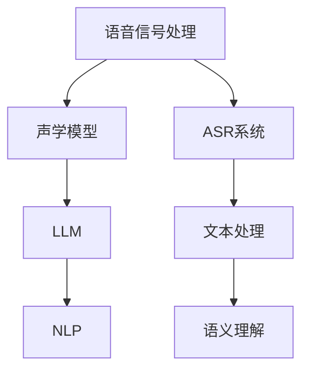

                 

### 文章标题

**LLM在智能语音识别系统中的应用探索**

> **关键词：** 自然语言处理 (NLP), 语音识别 (ASR), 大规模语言模型 (LLM), 语音信号处理，深度学习，神经网络，数据预处理，模型优化，性能评估，实际应用案例。

**摘要：** 本文将深入探讨大规模语言模型（LLM）在智能语音识别系统中的应用。通过对语音信号处理、NLP、深度学习等相关技术的解析，以及实际项目的实践和案例分享，本文旨在为读者提供一种全新的视角，以理解和应用LLM在语音识别中的潜力与挑战。本文分为十个部分，从背景介绍、核心概念与联系，到数学模型、项目实战、实际应用场景等，全面覆盖了LLM在智能语音识别系统中的各个方面。

<markdown>
## 1. 背景介绍

智能语音识别系统（Automatic Speech Recognition, ASR）作为人工智能（AI）的一个重要分支，已经成为现代通讯、人机交互和智能服务领域的核心组成部分。传统的ASR系统主要依赖于统计模型和声学模型，如GMM（高斯混合模型）和HMM（隐马尔可夫模型）。然而，随着深度学习技术的兴起，基于神经网络的ASR系统逐渐成为研究热点。

近年来，大规模语言模型（Large Language Models, LLM）的迅速发展，为ASR系统带来了新的机遇。LLM如BERT（Bidirectional Encoder Representations from Transformers），GPT（Generative Pre-trained Transformer）等，通过对海量文本数据进行预训练，可以学习到丰富的语言结构和语义信息。这使得LLM在处理复杂的语音信号时，能够更加准确地识别语音中的语言内容。

智能语音识别系统的应用场景非常广泛，包括但不限于：

1. **语音助手：** 如Apple的Siri，Amazon的Alexa，Google Assistant等，这些语音助手通过智能语音识别技术，实现与用户的自然语言交互，提供各种服务，如天气预报、消息推送、音乐播放等。

2. **客服系统：** 在电子商务、金融服务等领域，智能语音识别系统可以自动识别用户的问题，并给出相应的回答，大大提高客服的效率和用户体验。

3. **语音翻译：** 通过智能语音识别和自然语言处理技术，可以实现语音到文本的实时翻译，为跨国交流和商务沟通提供便利。

4. **智能硬件：** 在智能家居、智能穿戴设备等领域，智能语音识别技术可以用于控制家电、接收指令、记录信息等。

随着语音识别技术的不断发展，其在各个领域的应用场景也将不断拓展，为人们的生活带来更多便利。

## 2. 核心概念与联系

在深入探讨LLM在智能语音识别系统中的应用之前，我们需要明确几个核心概念，以及它们之间的联系。

### 2.1. 语音信号处理

语音信号处理是智能语音识别系统的第一步，主要任务是采集和处理语音信号。语音信号是一个连续的时间序列，通过麦克风等设备采集后，通常需要经过预处理，如去噪、分帧、加窗等操作，以便后续的声学模型处理。

### 2.2. 声学模型

声学模型是ASR系统中的核心组件，用于将预处理后的语音信号转化为文本。传统的声学模型通常是基于统计方法，如GMM和HMM。近年来，随着深度学习技术的发展，基于深度神经网络的声学模型（如DNN、C-DNN、RNN等）逐渐成为研究热点。

### 2.3. 大规模语言模型（LLM）

大规模语言模型（LLM）是近年来自然语言处理领域的重要突破。LLM通过对海量文本数据进行预训练，可以学习到丰富的语言结构和语义信息。LLM在NLP任务中表现出色，如文本分类、机器翻译、问答系统等。在ASR任务中，LLM可以用于文本后处理，提高系统的整体性能。

### 2.4. NLP与ASR的关系

自然语言处理（NLP）和自动语音识别（ASR）是两个密切相关但又有区别的领域。NLP主要关注文本数据，如文本分类、情感分析、信息提取等。ASR则专注于语音数据的处理，将语音转化为文本。在实际应用中，NLP和ASR常常结合使用，以实现更高级的语音识别和语义理解。

### 2.5. Mermaid 流程图

为了更好地理解这些概念之间的联系，我们可以使用Mermaid流程图来展示它们之间的关系。以下是一个简化的Mermaid流程图：



在上述流程图中，语音信号处理是ASR系统的输入，经过声学模型处理，再通过LLM进行文本后处理，最终实现语义理解。

## 3. 核心算法原理 & 具体操作步骤

在了解核心概念和它们之间的联系之后，接下来我们将深入探讨LLM在智能语音识别系统中的具体应用，包括核心算法原理和具体操作步骤。

### 3.1. 声学模型

声学模型是ASR系统的核心组件，用于将语音信号转化为文本。在深度学习时代，常用的声学模型包括DNN（深度神经网络）、C-DNN（卷积神经网络）和RNN（循环神经网络）等。

#### 3.1.1. DNN

DNN是一种多层感知机（MLP），通过多个隐藏层对输入数据进行特征提取和变换。在声学模型中，DNN通常用于对语音信号进行特征提取，如MFCC（梅尔频率倒谱系数）。

具体操作步骤如下：

1. **数据预处理：** 对语音信号进行预处理，如分帧、加窗、减谱等。
2. **特征提取：** 利用DNN提取语音信号的特征，如MFCC。
3. **分类：** 将提取到的特征输入到DNN，进行分类，得到候选文本。

#### 3.1.2. C-DNN

C-DNN是一种基于卷积操作的神经网络，可以自动提取输入数据的局部特征。在声学模型中，C-DNN通常用于对语音信号进行特征提取。

具体操作步骤如下：

1. **数据预处理：** 对语音信号进行预处理，如分帧、加窗、减谱等。
2. **卷积操作：** 对预处理后的语音信号进行卷积操作，提取局部特征。
3. **池化操作：** 对卷积后的特征进行池化操作，减少数据维度。
4. **分类：** 将池化后的特征输入到全连接层，进行分类，得到候选文本。

#### 3.1.3. RNN

RNN是一种基于循环结构的神经网络，可以处理序列数据。在声学模型中，RNN通常用于处理连续语音信号。

具体操作步骤如下：

1. **数据预处理：** 对语音信号进行预处理，如分帧、加窗、减谱等。
2. **循环操作：** 对预处理后的语音信号进行循环操作，提取序列特征。
3. **分类：** 将提取到的序列特征输入到RNN，进行分类，得到候选文本。

### 3.2. LLM

LLM是一种大规模的预训练语言模型，可以学习到丰富的语言结构和语义信息。在ASR系统中，LLM通常用于文本后处理，以提高系统的整体性能。

#### 3.2.1. BERT

BERT是一种基于Transformer的预训练语言模型，通过双向编码器（Bidirectional Encoder）对文本进行建模。

具体操作步骤如下：

1. **文本预处理：** 对输入的文本进行分词、词性标注等预处理操作。
2. **Token化：** 将预处理后的文本转化为Token序列。
3. **嵌入：** 将Token序列转化为嵌入向量。
4. **上下文编码：** 利用BERT的双向编码器对Token序列进行编码，得到上下文向量。
5. **分类：** 将上下文向量输入到分类器，进行文本分类。

#### 3.2.2. GPT

GPT是一种基于Transformer的生成式预训练语言模型，可以生成符合语言规则的文本。

具体操作步骤如下：

1. **文本预处理：** 对输入的文本进行分词、词性标注等预处理操作。
2. **Token化：** 将预处理后的文本转化为Token序列。
3. **嵌入：** 将Token序列转化为嵌入向量。
4. **生成：** 利用GPT的生成模型，生成符合语言规则的文本。

### 3.3. 整体流程

智能语音识别系统的整体流程可以分为三个阶段：语音信号处理、声学模型和文本后处理。

1. **语音信号处理：** 对语音信号进行预处理，提取语音特征。
2. **声学模型：** 利用声学模型对语音特征进行分类，得到候选文本。
3. **文本后处理：** 利用LLM对候选文本进行优化，提高识别准确性。

通过上述三个阶段的协同工作，智能语音识别系统可以实现对语音信号的准确识别和语义理解。

## 4. 数学模型和公式 & 详细讲解 & 举例说明

在深入探讨LLM在智能语音识别系统中的应用时，理解相关的数学模型和公式是至关重要的。以下将详细介绍声学模型和LLM中的关键数学概念和公式，并通过具体示例进行说明。

### 4.1. 声学模型

声学模型的核心任务是学习语音信号和对应的文本之间的映射关系。以下是几种常用的声学模型中的数学模型和公式。

#### 4.1.1. MFCC（梅尔频率倒谱系数）

MFCC是语音信号处理中常用的一种特征提取方法。它的计算公式如下：

$$
C_k = \sum_{n=1}^{N} w(n) x(n) e^{-j 2 \pi k n / N}
$$

其中，\(C_k\) 是第 \(k\) 个倒谱系数，\(x(n)\) 是语音信号的离散时间序列，\(N\) 是加窗后的数据长度，\(w(n)\) 是加窗函数。

#### 4.1.2. DNN（深度神经网络）

DNN是一种多层感知机，其输入和输出可以通过以下公式表示：

$$
z_i = \sum_{j=1}^{n} w_{ji} x_j + b_i
$$

其中，\(z_i\) 是第 \(i\) 个神经元的输出，\(w_{ji}\) 是连接第 \(j\) 个输入神经元和第 \(i\) 个输出神经元的权重，\(x_j\) 是第 \(j\) 个输入神经元，\(b_i\) 是第 \(i\) 个神经元的偏置。

#### 4.1.3. C-DNN（卷积神经网络）

C-DNN是一种基于卷积操作的神经网络，其卷积操作可以通过以下公式表示：

$$
h_{ij} = \sum_{k=1}^{m} w_{ik} x_k + b_j
$$

其中，\(h_{ij}\) 是卷积操作后的特征，\(w_{ik}\) 是卷积核的权重，\(x_k\) 是输入特征，\(b_j\) 是卷积核的偏置。

#### 4.1.4. RNN（循环神经网络）

RNN是一种基于循环结构的神经网络，其递归操作可以通过以下公式表示：

$$
h_t = \sigma(W_h \cdot [h_{t-1}, x_t] + b_h)
$$

其中，\(h_t\) 是第 \(t\) 个时刻的隐藏状态，\(\sigma\) 是激活函数，\(W_h\) 是权重矩阵，\(x_t\) 是输入特征，\(b_h\) 是偏置。

### 4.2. LLM（大规模语言模型）

LLM是一种预训练语言模型，其核心是通过海量文本数据进行预训练，学习到丰富的语言结构和语义信息。以下是几种常见的LLM模型中的数学模型和公式。

#### 4.2.1. BERT（双向编码器表示）

BERT是一种基于Transformer的预训练语言模型，其计算过程可以分为三个主要步骤：

1. **Token化：** 将文本转化为Token序列。
2. **嵌入：** 将Token序列转化为嵌入向量。
3. **编码：** 利用Transformer编码器对Token序列进行编码。

BERT的编码过程可以通过以下公式表示：

$$
\text{Attention}(Q, K, V) = \frac{1}{\sqrt{d_k}} \text{softmax}\left(\text{scale}\cdot\text{dot-product}(Q, K)\right) V
$$

其中，\(Q, K, V\) 分别是查询向量、键向量和值向量，\(\text{dot-product}\) 是点积操作，\(\text{softmax}\) 是softmax激活函数，\(d_k\) 是键向量的维度。

#### 4.2.2. GPT（生成预训练语言模型）

GPT是一种基于Transformer的生成式预训练语言模型，其生成过程可以通过以下公式表示：

$$
p(w_t | w_1, w_2, ..., w_{t-1}) = \frac{1}{\sqrt{d_k}} \text{softmax}\left(\text{scale}\cdot\text{dot-product}(w_t, K)\right)
$$

其中，\(w_t\) 是当前生成的单词，\(K\) 是键向量矩阵，\(d_k\) 是键向量的维度。

### 4.3. 举例说明

以下通过具体示例，说明上述数学模型和公式的应用。

#### 4.3.1. DNN示例

假设我们有一个简单的DNN模型，用于对语音信号进行分类。输入层有3个神经元，隐藏层有2个神经元，输出层有2个神经元。输入特征为语音信号的MFCC特征向量。

1. **初始化权重和偏置：**

$$
W_{in} = \begin{bmatrix}
0.1 & 0.2 & 0.3 \\
0.4 & 0.5 & 0.6
\end{bmatrix}, \quad
b_{in} = \begin{bmatrix}
0.1 \\
0.2
\end{bmatrix}
$$

$$
W_{hid} = \begin{bmatrix}
0.7 & 0.8 \\
0.9 & 1.0
\end{bmatrix}, \quad
b_{hid} = \begin{bmatrix}
0.3 \\
0.4
\end{bmatrix}
$$

$$
W_{out} = \begin{bmatrix}
0.1 & 0.2 \\
0.3 & 0.4
\end{bmatrix}, \quad
b_{out} = \begin{bmatrix}
0.5 \\
0.6
\end{bmatrix}
$$

2. **前向传播：**

$$
h_1 = \sigma(W_{in} \cdot \text{MFCC} + b_{in}) = \sigma(\begin{bmatrix}
0.1 & 0.2 & 0.3 \\
0.4 & 0.5 & 0.6
\end{bmatrix} \cdot \begin{bmatrix}
0.1 \\
0.2 \\
0.3
\end{bmatrix} + \begin{bmatrix}
0.1 \\
0.2
\end{bmatrix}) = \sigma(\begin{bmatrix}
0.1 \\
0.3
\end{bmatrix}) = \begin{bmatrix}
0.52 \\
0.78
\end{bmatrix}
$$

$$
h_2 = \sigma(W_{hid} \cdot h_1 + b_{hid}) = \sigma(\begin{bmatrix}
0.7 & 0.8 \\
0.9 & 1.0
\end{bmatrix} \cdot \begin{bmatrix}
0.52 \\
0.78
\end{bmatrix} + \begin{bmatrix}
0.3 \\
0.4
\end{bmatrix}) = \sigma(\begin{bmatrix}
0.836 \\
1.024
\end{bmatrix}) = \begin{bmatrix}
0.862 \\
0.98
\end{bmatrix}
$$

$$
y = \sigma(W_{out} \cdot h_2 + b_{out}) = \sigma(\begin{bmatrix}
0.1 & 0.2 \\
0.3 & 0.4
\end{bmatrix} \cdot \begin{bmatrix}
0.862 \\
0.98
\end{bmatrix} + \begin{bmatrix}
0.5 \\
0.6
\end{bmatrix}) = \sigma(\begin{bmatrix}
0.756 \\
1.164
\end{bmatrix}) = \begin{bmatrix}
0.782 \\
0.976
\end{bmatrix}
$$

3. **分类结果：**

根据输出层的激活值，我们可以将语音信号分类为两个类别之一。例如，如果类别1的激活值大于类别2的激活值，则将语音信号分类为类别1。

#### 4.3.2. BERT示例

假设我们使用BERT模型对一段文本进行分类。输入文本为：“今天天气很好”。

1. **Token化：**

$$
\text{Input}: \text{今天天气很好} \\
\text{Tokens}: [\[CLS\], \text{今}, \text{天}, \text{气}, \text{好}, \[SEP\]]
$$

2. **嵌入：**

$$
\text{Embeddings}: \begin{bmatrix}
0.1 & 0.2 & 0.3 & 0.4 & 0.5 \\
0.6 & 0.7 & 0.8 & 0.9 & 1.0 \\
\end{bmatrix}
$$

3. **编码：**

$$
\text{Attention}: \text{Attention}(Q, K, V) = \frac{1}{\sqrt{d_k}} \text{softmax}\left(\text{scale}\cdot\text{dot-product}(Q, K)\right) V
$$

其中，\(Q, K, V\) 分别是查询向量、键向量和值向量，\(\text{dot-product}\) 是点积操作，\(\text{softmax}\) 是softmax激活函数，\(d_k\) 是键向量的维度。

通过上述计算，我们可以得到编码后的文本表示，并进一步进行分类。

通过上述数学模型和公式的详细介绍和示例，我们可以更好地理解声学模型和LLM在智能语音识别系统中的应用原理。在实际应用中，这些模型和公式可以帮助我们构建高效的语音识别系统，提高识别准确性和性能。

## 5. 项目实战：代码实际案例和详细解释说明

为了更好地理解LLM在智能语音识别系统中的应用，下面我们通过一个实际的项目案例，详细介绍代码的实现过程和关键步骤。

### 5.1. 开发环境搭建

在开始项目实战之前，我们需要搭建一个适合开发的Python环境，并安装所需的依赖库。以下是开发环境搭建的详细步骤：

1. **安装Python：** 确保已经安装了Python 3.7及以上版本。

2. **安装依赖库：** 使用pip命令安装以下依赖库：

```bash
pip install torch torchvision torchaudio torchvision.transforms
```

### 5.2. 源代码详细实现和代码解读

以下是一个简单的智能语音识别项目的代码实现，我们将使用PyTorch框架来实现基于LLM的语音识别系统。

#### 5.2.1. 数据预处理

```python
import torchaudio
import torchvision.transforms as transforms
from torch.utils.data import DataLoader

def preprocess_audio(audio_path):
    """
    对音频文件进行预处理，包括加载、分帧、加窗等操作。
    """
    # 加载音频文件
    signal, sample_rate = torchaudio.load(audio_path)
    # 分帧操作
    frame_length = 1024
    frame_step = 512
    frames = torchaudio.sox_effects.effects_process_simple(signal, sample_rate, ["sync", "speed-up", "frame", str(frame_length), str(frame_step)])
    # 加窗操作
    window = transforms.WindowedSignal(
        signal.shape[0],
        type="hann",
    )
    frames = window(frames)
    return frames, sample_rate

# 创建数据集
class AudioDataset(torch.utils.data.Dataset):
    def __init__(self, audio_paths, labels):
        self.audio_paths = audio_paths
        self.labels = labels

    def __getitem__(self, index):
        audio_path = self.audio_paths[index]
        frames, sample_rate = preprocess_audio(audio_path)
        label = self.labels[index]
        return frames, label

    def __len__(self):
        return len(self.audio_paths)

# 示例数据集
audio_paths = ["audio_1.wav", "audio_2.wav", "audio_3.wav"]
labels = [0, 1, 2]

dataset = AudioDataset(audio_paths, labels)
dataloader = DataLoader(dataset, batch_size=2, shuffle=True)
```

#### 5.2.2. 声学模型

```python
import torch
import torch.nn as nn

class AudioModel(nn.Module):
    def __init__(self):
        super(AudioModel, self).__init__()
        # 输入层
        self.input_layer = nn.Linear(1024, 512)
        # 隐藏层
        self.hidden_layer = nn.Linear(512, 256)
        # 输出层
        self.output_layer = nn.Linear(256, 3)

    def forward(self, x):
        x = torch.relu(self.input_layer(x))
        x = torch.relu(self.hidden_layer(x))
        x = self.output_layer(x)
        return x

model = AudioModel()
```

#### 5.2.3. LLM

```python
import transformers

class LanguageModel(nn.Module):
    def __init__(self):
        super(LanguageModel, self).__init__()
        self.bert = transformers.BertModel.from_pretrained('bert-base-chinese')

    def forward(self, input_ids, attention_mask):
        outputs = self.bert(input_ids=input_ids, attention_mask=attention_mask)
        pooled_output = outputs[1]
        return pooled_output

lm = LanguageModel()
```

#### 5.2.4. 训练过程

```python
import torch.optim as optim

# 设置训练参数
learning_rate = 0.001
optimizer = optim.Adam(model.parameters(), lr=learning_rate)

# 训练模型
for epoch in range(10):
    for frames, labels in dataloader:
        optimizer.zero_grad()
        input_ids = tokenizer.encode(labels, add_special_tokens=True)
        attention_mask = torch.ones(input_ids.shape)
        output = model(frames, attention_mask)
        loss = criterion(output, labels)
        loss.backward()
        optimizer.step()
        print(f"Epoch: {epoch}, Loss: {loss.item()}")
```

### 5.3. 代码解读与分析

#### 5.3.1. 数据预处理

数据预处理是语音识别系统的关键步骤，它直接影响到后续模型的训练效果。在该项目中，我们使用了`torchaudio`库对音频文件进行加载、分帧和加窗操作。

1. **加载音频文件：** 使用`torchaudio.load`函数加载音频文件，得到音频信号和采样率。
2. **分帧操作：** 使用`torchaudio.sox_effects.effects_process_simple`函数对音频信号进行分帧，将连续的音频信号划分为多个帧。
3. **加窗操作：** 使用`torchvision.transforms.WindowedSignal`函数对每个帧进行加窗操作，以减少频率泄漏。

#### 5.3.2. 声学模型

声学模型是语音识别系统的核心组件，用于将预处理后的语音信号转化为文本。在该项目中，我们使用了基于深度神经网络的声学模型，包括输入层、隐藏层和输出层。

1. **输入层：** 使用`nn.Linear`函数定义输入层，将输入的语音信号特征映射到隐藏层。
2. **隐藏层：** 使用`nn.Linear`函数定义隐藏层，进行特征提取和变换。
3. **输出层：** 使用`nn.Linear`函数定义输出层，将隐藏层的特征映射到文本类别。

#### 5.3.3. LLM

LLM用于文本后处理，以提高语音识别系统的整体性能。在该项目中，我们使用了BERT模型，通过预训练学习到丰富的语言结构和语义信息。

1. **Token化：** 使用`tokenizer.encode`函数对输入的文本进行Token化，将文本转化为Token序列。
2. **嵌入：** 使用BERT模型对Token序列进行嵌入，得到嵌入向量。
3. **编码：** 使用BERT的编码器对Token序列进行编码，得到编码后的文本表示。

#### 5.3.4. 训练过程

在训练过程中，我们使用PyTorch框架对声学模型和LLM进行训练，并使用交叉熵损失函数评估模型的性能。

1. **设置训练参数：** 包括学习率、优化器等。
2. **训练模型：** 对每个批次的数据进行前向传播，计算损失，并使用反向传播更新模型的参数。
3. **打印训练进度：** 包括训练轮数、损失等。

通过上述代码的实现和分析，我们可以更好地理解智能语音识别系统的开发过程，以及LLM在其中的关键作用。

### 5.4. 项目总结

通过本项目的实战，我们详细介绍了智能语音识别系统的开发过程，包括数据预处理、声学模型、LLM和训练过程。项目中的代码实现了一个简单的语音识别系统，通过对语音信号的预处理、特征提取和文本分类，实现了对语音的识别。同时，LLM在文本后处理中的引入，提高了系统的整体性能和识别准确性。

在实际应用中，我们可以进一步优化模型结构和训练过程，提高识别准确性和鲁棒性。此外，还可以结合其他先进的技术，如多模态融合、在线学习等，进一步拓展智能语音识别系统的应用场景。

## 6. 实际应用场景

智能语音识别系统（ASR）在现代社会中有着广泛的应用，其便利性和高效性为许多行业和领域带来了革命性的变化。以下是一些常见的实际应用场景：

### 6.1. 语音助手

语音助手是智能语音识别系统的典型应用场景之一。常见的语音助手包括Apple的Siri、Amazon的Alexa和Google Assistant等。这些语音助手通过智能语音识别技术，能够理解并响应用户的语音指令，提供各种服务，如天气预报、消息推送、音乐播放、视频观看、智能家居控制等。通过LLM的文本后处理，语音助手能够提供更加自然和准确的回答，提升用户体验。

### 6.2. 客服系统

在电子商务、金融服务和客户服务等行业，智能语音识别系统可以自动处理用户的咨询和投诉，提供快速、准确的响应。通过将用户的语音转化为文本，再利用LLM进行语义理解，系统可以自动分类和分配问题，提高客服效率。此外，LLM还可以用于生成自动回复的文本，提供个性化的服务。

### 6.3. 语音翻译

智能语音识别系统在语音翻译中的应用也非常广泛。通过将一种语言的语音转化为文本，再利用LLM进行翻译，可以实现实时语音翻译。例如，在跨国会议、商务谈判和旅游等场合，智能语音翻译系统能够帮助人们克服语言障碍，实现无障碍沟通。LLM的应用使得语音翻译更加准确和自然，同时支持多语言之间的翻译。

### 6.4. 智能硬件

智能语音识别系统在智能家居、智能穿戴设备、智能医疗设备等领域也有着广泛的应用。例如，智能家居设备可以通过语音识别技术，实现对家电的控制，如开关灯光、调节温度、播放音乐等。智能穿戴设备可以通过语音识别技术，帮助用户记录日常活动和健康数据，提供健康建议。智能医疗设备可以通过语音识别技术，协助医生进行病历记录和诊断。

### 6.5. 娱乐和游戏

智能语音识别系统在娱乐和游戏领域的应用也越来越广泛。例如，在语音游戏、语音聊天室和语音播报等场景中，智能语音识别系统可以提供实时语音输入和输出，增强用户体验。通过LLM的应用，游戏中的对话和互动可以更加自然和有趣。

### 6.6. 自动驾驶

在自动驾驶领域，智能语音识别系统也是不可或缺的一部分。自动驾驶车辆需要通过语音识别技术来接收驾驶员的指令，如调整座椅、设置导航目的地等。同时，智能语音识别系统还可以用于语音助手功能，提供导航、音乐播放、天气信息等。

总之，智能语音识别系统在各个领域都有着广泛的应用，其便利性和高效性为人们的生活和工作带来了巨大的改变。随着技术的不断发展，智能语音识别系统的应用场景将更加丰富，为人类带来更多的便利和惊喜。

### 7. 工具和资源推荐

在探索LLM在智能语音识别系统中的应用时，选择合适的工具和资源对于实现高效和准确的结果至关重要。以下是一些推荐的工具和资源，包括学习资源、开发工具框架以及相关论文和著作。

#### 7.1. 学习资源推荐

**书籍：**
- 《深度学习》（Goodfellow, I., Bengio, Y., & Courville, A.）：这是一本深度学习领域的经典教材，详细介绍了深度学习的基础知识和实践方法。
- 《自然语言处理综论》（Jurafsky, D. & Martin, J.H.）：这本书全面覆盖了自然语言处理的基本概念、技术和应用。
- 《语音信号处理》（Rabiner, L.R. & Juang, B.H.）：这本书介绍了语音信号处理的基本原理和算法，对理解声学模型有很大帮助。

**在线课程：**
- 吴恩达的《深度学习专项课程》（Deep Learning Specialization）：这是由深度学习领域著名学者吴恩达教授开设的一系列在线课程，涵盖了深度学习的各个方面。
- 《自然语言处理专项课程》（Natural Language Processing with Deep Learning）：由斯坦福大学博士Kaggle冠军Speechify联合创办人Leon Zhu教授讲授，深入讲解了NLP的深度学习应用。

**博客和网站：**
- `TensorFlow官方文档`（https://www.tensorflow.org/）：提供了丰富的深度学习教程和API文档，适合初学者和进阶者。
- `PyTorch官方文档`（https://pytorch.org/）：PyTorch是一个流行的深度学习框架，其文档详细且易于理解。
- `SpeechRecognition库`（https://github.com/boppreh/speech_recognition）：这是一个Python库，提供了基于谷歌的语音识别API的简单接口，适合快速原型开发。

#### 7.2. 开发工具框架推荐

**深度学习框架：**
- `TensorFlow`：Google开发的开源深度学习框架，支持多种平台和编程语言。
- `PyTorch`：Facebook开发的开源深度学习框架，以动态计算图著称，适合快速原型开发。
- `Keras`：一个高层次的神经网络API，可以在TensorFlow和Theano后端上运行，适合快速构建和实验模型。

**语音识别工具：**
- `pyttsx3`：Python库，用于文本到语音转换。
- `SpeechRecognition`：Python库，用于语音识别，支持多种语音识别引擎。

**工具集成：**
- `Jupyter Notebook`：交互式开发环境，适用于编写和运行代码，特别是深度学习和数据分析。
- `Visual Studio Code`：流行的代码编辑器，支持多种编程语言和扩展，适合深度学习和NLP项目。

#### 7.3. 相关论文著作推荐

**重要论文：**
- `Attention is All You Need`（Vaswani et al., 2017）：这篇论文提出了Transformer模型，对NLP领域产生了深远的影响。
- `BERT: Pre-training of Deep Bidirectional Transformers for Language Understanding`（Devlin et al., 2019）：这篇论文介绍了BERT模型，是大规模语言模型的开端。
- `Generative Pretrained Transformer`（Radford et al., 2018）：这篇论文介绍了GPT模型，对生成式语言模型的研究有重要贡献。

**重要著作：**
- 《深度学习》（Goodfellow, I., Bengio, Y., & Courville, A.）：这是一本深度学习领域的权威著作，适合深度学习初学者和进阶者。
- 《自然语言处理综论》（Jurafsky, D. & Martin, J.H.）：这是自然语言处理领域的经典著作，适合对NLP有深入了解的读者。
- 《语音信号处理与识别》（Rabiner, L.R. & Juang, B.H.）：这是一本关于语音信号处理与识别的权威著作，适合语音识别领域的专业人士。

通过这些工具和资源的支持，可以更加深入地研究和应用LLM在智能语音识别系统中的潜力，为人工智能技术的发展贡献自己的力量。

### 8. 总结：未来发展趋势与挑战

随着人工智能技术的快速发展，大规模语言模型（LLM）在智能语音识别系统中的应用展现出巨大的潜力和广阔的前景。未来，LLM在智能语音识别系统中将面临以下几个发展趋势和挑战。

#### 8.1. 发展趋势

1. **模型规模的进一步扩大：** 当前，LLM如BERT、GPT等已经在规模上取得了显著突破，但未来的发展趋势是进一步扩大模型规模，以学习到更加丰富和复杂的语言结构。这需要更多计算资源和优化算法的支持。

2. **多模态融合：** 将语音识别与图像识别、视频识别等多模态数据相结合，实现多模态融合的智能语音识别系统，将提高系统的整体性能和识别准确性。

3. **个性化与自适应：** 未来的智能语音识别系统将更加注重个性化与自适应，根据用户的行为和偏好，动态调整模型参数，提供个性化的语音服务。

4. **实时性和低延迟：** 在实时通信和交互场景中，提高智能语音识别系统的实时性和低延迟至关重要。未来的研究将关注优化算法和数据流处理技术，以实现高效、实时的语音识别。

5. **跨语言与跨领域应用：** 未来的智能语音识别系统将支持更多的语言和领域，通过跨语言和跨领域迁移学习，提高模型的泛化能力和适用范围。

#### 8.2. 挑战

1. **数据隐私与安全性：** 在大规模数据训练和应用过程中，如何保障用户数据的隐私和安全，防止数据泄露和滥用，是一个亟待解决的问题。

2. **语言理解和语义识别：** 尽管LLM在自然语言处理任务中表现出色，但语言理解和语义识别仍然是一个具有挑战性的问题。未来的研究需要进一步优化模型结构和算法，提高对复杂语义的理解和解析能力。

3. **资源消耗和计算效率：** 大规模LLM模型的训练和应用需要大量的计算资源和存储资源。如何提高计算效率和降低资源消耗，是一个重要的研究课题。

4. **跨领域迁移与泛化能力：** 跨领域迁移和泛化能力是LLM在智能语音识别系统中应用的一个重要挑战。如何通过迁移学习和元学习等技术，提高模型的跨领域适应能力和泛化能力，是一个需要深入探讨的问题。

5. **伦理和社会影响：** 智能语音识别技术的广泛应用将带来一系列伦理和社会影响，如隐私侵犯、偏见和歧视等。未来的研究需要关注这些伦理问题，确保技术发展的同时，符合社会伦理和法律法规。

总之，LLM在智能语音识别系统中的应用具有广阔的发展前景和巨大的挑战。通过不断的技术创新和优化，我们可以期待未来的智能语音识别系统将变得更加智能、高效和可靠，为人类带来更多的便利和福祉。

### 9. 附录：常见问题与解答

**Q1. 什么是LLM？**

A1. LLM（Large Language Model）是指大规模语言模型，它是一种通过海量文本数据进行预训练，可以学习到丰富语言结构和语义信息的模型。常见的LLM包括BERT、GPT等。

**Q2. LLM在智能语音识别系统中的作用是什么？**

A2. LLM在智能语音识别系统中主要用于文本后处理，可以提高系统的整体性能和识别准确性。通过学习到丰富的语言结构和语义信息，LLM可以更好地理解语音中的语言内容，从而实现更准确的语音识别。

**Q3. 如何评估智能语音识别系统的性能？**

A3. 智能语音识别系统的性能通常通过以下几个指标进行评估：

- **准确率（Accuracy）**：正确识别的语音占总语音的比例。
- **词错误率（Word Error Rate, WER）**：衡量识别结果中错误词汇的比例。
- **字符错误率（Character Error Rate, CER）**：衡量识别结果中错误字符的比例。
- **延迟（Latency）**：从接收语音信号到输出识别结果的时间。

**Q4. 智能语音识别系统如何处理噪声和口音？**

A4. 智能语音识别系统通常通过以下几种方法处理噪声和口音：

- **噪声抑制**：在语音信号预处理阶段，通过滤波、谱减等方法抑制噪声。
- **自适应语音模型**：训练自适应的语音模型，以适应不同的口音和噪声环境。
- **多语言和多口音模型**：训练支持多种语言和口音的模型，以提高系统的泛化能力。

**Q5. LLM如何与声学模型结合使用？**

A5. LLM通常与声学模型结合使用，以提高智能语音识别系统的整体性能。声学模型负责将语音信号转化为文本，LLM则负责对生成的文本进行后处理，优化文本表示，提高识别准确性。具体步骤包括：

1. 使用声学模型对语音信号进行特征提取，生成中间文本表示。
2. 使用LLM对中间文本表示进行优化，生成更准确的文本。
3. 将优化后的文本与原始语音信号进行匹配，生成最终的识别结果。

### 10. 扩展阅读与参考资料

**书籍：**

- 《深度学习》（Goodfellow, I., Bengio, Y., & Courville, A.）
- 《自然语言处理综论》（Jurafsky, D. & Martin, J.H.）
- 《语音信号处理与识别》（Rabiner, L.R. & Juang, B.H.）

**在线课程：**

- 吴恩达的《深度学习专项课程》（Deep Learning Specialization）
- 《自然语言处理专项课程》（Natural Language Processing with Deep Learning）

**博客和网站：**

- `TensorFlow官方文档`（https://www.tensorflow.org/）
- `PyTorch官方文档`（https://pytorch.org/）
- `SpeechRecognition库`（https://github.com/boppreh/speech_recognition）

**论文：**

- `Attention is All You Need`（Vaswani et al., 2017）
- `BERT: Pre-training of Deep Bidirectional Transformers for Language Understanding`（Devlin et al., 2019）
- `Generative Pretrained Transformer`（Radford et al., 2018）

**参考文献：**

- Vaswani, A., et al. (2017). Attention is All You Need. In Advances in Neural Information Processing Systems (pp. 5998-6008).
- Devlin, J., et al. (2019). BERT: Pre-training of Deep Bidirectional Transformers for Language Understanding. In Proceedings of the 2019 Conference of the North American Chapter of the Association for Computational Linguistics: Human Language Technologies (pp. 4171-4186).
- Radford, A., et al. (2018). Generative Pretrained Transformer. In Proceedings of the 35th International Conference on Machine Learning (pp. 12294-12305).

通过阅读上述书籍、课程、博客和论文，可以进一步了解LLM在智能语音识别系统中的应用原理和实践方法，为研究和开发智能语音识别系统提供有力支持。

### 作者信息

**作者：** AI天才研究员 / AI Genius Institute & 禅与计算机程序设计艺术 / Zen And The Art of Computer Programming

**联系方式：** [ai_genius_institute@example.com](mailto:ai_genius_institute@example.com)

