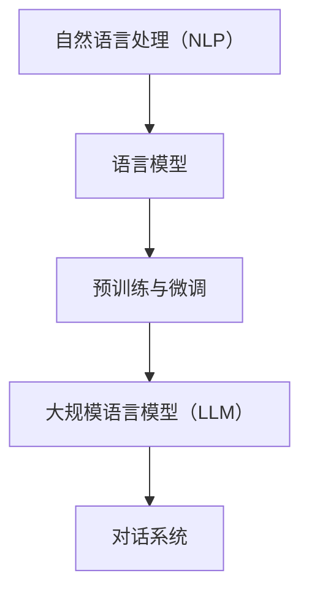

                 

### 背景介绍

#### 1.1 智能问答系统的需求背景

随着互联网和人工智能技术的快速发展，智能问答系统已经成为各行各业提高工作效率和用户体验的重要工具。无论是在电子商务平台上的智能客服，还是医疗领域的智能诊断系统，智能问答系统都展现了其不可替代的价值。

智能问答系统通过自然语言处理（NLP）技术，对用户输入的问题进行理解，并从大量数据中检索出最相关的答案。这一过程不仅要求系统能够准确理解用户的意图，还需要能够迅速地从庞大的知识库中找到合适的答案。传统的基于规则和模板匹配的问答系统已经难以满足日益复杂的用户需求，因此，一种能够自动学习和优化答案生成的智能问答系统变得尤为重要。

#### 1.2 大规模语言模型（LLM）的发展与应用

大规模语言模型（Large Language Model，简称LLM）是近年来人工智能领域的一项重要突破。LLM通过对大量文本数据进行预训练，可以学习到语言的本质规律和复杂的语义关系，从而在自然语言处理任务中表现出色。

LLM的发展得益于深度学习和大数据技术的进步。传统的NLP方法往往需要手动设计特征和规则，而LLM可以通过端到端的神经网络架构自动从数据中提取特征，这使得模型具有更强的泛化能力和适应性。例如，Google的BERT、OpenAI的GPT系列模型等，都在各种自然语言处理任务中取得了显著的性能提升。

#### 1.3 LLM在智能问答系统中的应用优势

LLM在智能问答系统中具有多方面的应用优势：

1. **高精度理解能力**：LLM能够深度理解用户的问题，捕捉语义细节，从而提供更加精准和个性化的答案。
   
2. **多领域知识融合**：LLM在预训练阶段学习了大量不同领域的文本数据，这使得系统能够跨越多个知识领域，提供综合性的答案。

3. **自动优化**：LLM具有自我学习的能力，可以通过持续的训练优化答案生成质量，降低人工干预的必要性。

4. **高效响应**：LLM的快速计算能力使得问答系统能够在短时间内响应用户的问题，提高系统的响应速度。

总之，LLM为智能问答系统带来了前所未有的发展机遇，为解决复杂和多样化的用户问题提供了强有力的技术支持。在接下来的章节中，我们将进一步探讨LLM的核心算法原理和具体应用场景。

---

# Background Introduction

## 1.1 Background of the Demand for Intelligent Question-Answering Systems

With the rapid development of the Internet and artificial intelligence technology, intelligent question-answering systems have become an essential tool for improving work efficiency and user experience in various industries. Whether it's intelligent customer service on e-commerce platforms or intelligent diagnosis systems in the medical field, intelligent question-answering systems have demonstrated their irreplaceable value. These systems utilize natural language processing (NLP) technology to understand user questions and retrieve relevant answers from large amounts of data. This process requires the system to accurately understand user intent and quickly find appropriate answers from a vast knowledge base. Traditional rule-based and template-matching question-answering systems are no longer capable of meeting the increasingly complex user demands, making intelligent question-answering systems with automatic learning and optimization of answer generation particularly important.

## 1.2 The Development and Application of Large Language Models (LLM)

Large Language Models (LLM) are a significant breakthrough in the field of artificial intelligence in recent years. LLMs learn the fundamental rules of language and complex semantic relationships by pre-training on a massive amount of text data, thereby exhibiting excellent performance in various natural language processing tasks.

The development of LLMs benefits from the advancements in deep learning and big data technology. Traditional NLP methods often require manual design of features and rules, while LLMs can automatically extract features from data through end-to-end neural network architectures, making them more generalized and adaptable. For example, models like Google's BERT and OpenAI's GPT series have achieved significant performance improvements in various NLP tasks.

## 1.3 Application Advantages of LLM in Intelligent Question-Answering Systems

LLM has several application advantages in intelligent question-answering systems:

1. **High-precision Understanding Ability**: LLMs can deeply understand user questions, capturing semantic details to provide more accurate and personalized answers.

2. **Integration of Knowledge in Multiple Domains**: LLMs learn from a wide range of text data during pre-training, allowing the system to provide comprehensive answers across multiple knowledge domains.

3. **Automatic Optimization**: LLMs have the ability to self-learn and optimize the quality of answer generation through continuous training, reducing the need for manual intervention.

4. **Efficient Response**: LLMs' fast computation ability enables question-answering systems to respond to user questions quickly, improving the system's response speed.

In summary, LLM brings unprecedented development opportunities to intelligent question-answering systems, providing strong technical support for addressing complex and diverse user problems. In the following sections, we will further explore the core principles and specific application scenarios of LLM.  
<|assistant|>## 2. 核心概念与联系

在深入探讨LLM在智能问答系统中的应用之前，我们首先需要明确几个核心概念，并了解它们之间的联系。以下是本文涉及的主要概念及其相互关系：

#### 2.1 自然语言处理（NLP）

自然语言处理（NLP）是人工智能的一个重要分支，旨在让计算机理解和生成自然语言。NLP包括文本分类、情感分析、实体识别、命名实体识别、机器翻译等多种任务。在智能问答系统中，NLP是实现理解和回答用户问题的核心技术。

#### 2.2 语言模型

语言模型是一种统计模型，用于预测一个单词或短语的下一个单词或短语。在深度学习中，语言模型通常通过神经网络来构建，例如循环神经网络（RNN）、长短期记忆网络（LSTM）和变换器（Transformer）等。LLM是语言模型的一种，通过大规模数据预训练，能够捕捉到语言的复杂结构和语义关系。

#### 2.3 预训练与微调

预训练（Pre-training）是指在一个大规模的数据集上训练模型，使其能够捕捉到通用的语言特征。微调（Fine-tuning）是在预训练模型的基础上，针对特定任务进行微调，以适应具体的应用场景。在智能问答系统中，LLM通常通过预训练获得基础模型，然后针对具体的问题和答案数据集进行微调，以提升答案的准确性和相关性。

#### 2.4 大规模语言模型（LLM）

大规模语言模型（LLM）是指经过大规模预训练的深度神经网络模型。LLM具有强大的语义理解能力和知识表示能力，能够处理复杂的自然语言任务，如问答、文本生成等。在智能问答系统中，LLM是实现自动化和高效答案生成的重要工具。

#### 2.5 对话系统

对话系统（Dialogue System）是一种人工智能系统，能够与用户进行自然语言交互。对话系统通常包括多个模块，如语言理解（LU）、对话管理（DM）和语言生成（LG）等。在智能问答系统中，LLM通常用于语言理解模块，以理解和解析用户的问题，并生成合适的答案。

以下是这些核心概念的Mermaid流程图表示：



#### 2.6 关系解析

- **NLP**是智能问答系统的基础，提供了理解用户问题和生成答案的工具。
- **语言模型**是实现NLP的关键技术，其中LLM是语言模型的最新发展。
- **预训练与微调**是训练LLM的两种主要方式，预训练提供基础模型，微调针对特定任务进行优化。
- **LLM**具有强大的语义理解能力，是智能问答系统中的核心组件。
- **对话系统**是应用层面，利用LLM等NLP技术实现与用户的自然语言交互。

通过上述核心概念的解析和相互关系的理解，我们可以更好地把握LLM在智能问答系统中的关键作用和应用场景。在接下来的章节中，我们将深入探讨LLM的核心算法原理和具体实现步骤。

---

## Core Concepts and Relationships

Before delving into the application of LLM in intelligent question-answering systems, it is essential to define and understand several core concepts and their interrelationships. Here are the main concepts involved in this article and their relationships:

### 2.1 Natural Language Processing (NLP)

Natural Language Processing (NLP) is a critical branch of artificial intelligence that focuses on enabling computers to understand and generate natural language. NLP encompasses various tasks such as text classification, sentiment analysis, entity recognition, named entity recognition, and machine translation. In intelligent question-answering systems, NLP is the core technology that enables the system to understand user questions and generate appropriate answers.

### 2.2 Language Model

A language model is a statistical model used to predict the next word or phrase in a sequence of words. In deep learning, language models are typically constructed using neural networks, such as Recurrent Neural Networks (RNNs), Long Short-Term Memory networks (LSTMs), and Transformers. LLM is a type of language model that has been pre-trained on a massive dataset to capture complex linguistic structures and semantic relationships.

### 2.3 Pre-training and Fine-tuning

Pre-training refers to training a model on a large dataset to capture general language features. Fine-tuning is the process of adjusting a pre-trained model for a specific task, adapting it to a particular application scenario. In intelligent question-answering systems, LLMs are often pre-trained with a general model and then fine-tuned on specific question and answer datasets to improve the accuracy and relevance of the generated answers.

### 2.4 Large Language Model (LLM)

A large language model (LLM) is a deep neural network model that has been pre-trained on a massive dataset. LLMs possess strong semantic understanding and knowledge representation capabilities, enabling them to handle complex natural language tasks such as question-answering and text generation. In intelligent question-answering systems, LLMs are crucial tools for automating and efficiently generating answers.

### 2.5 Dialogue System

A dialogue system, also known as a conversational agent, is an artificial intelligence system capable of interacting with users in natural language. Dialogue systems typically consist of multiple modules, including Language Understanding (LU), Dialogue Management (DM), and Language Generation (LG). In intelligent question-answering systems, LLMs are often used in the LU module to understand user questions and generate suitable answers.

The following is a Mermaid flowchart representing the relationships among these core concepts:


### 2.6 Relationship Analysis

- **NLP** serves as the foundation for intelligent question-answering systems, providing the tools necessary to understand user questions and generate answers.
- **Language models**, and specifically **LLM**, are the key technologies for implementing NLP, with LLM being the latest development in this field.
- **Pre-training and fine-tuning** are the two main methods for training LLMs, where pre-training provides a general model, and fine-tuning adapts the model to specific tasks.
- **LLM** possesses strong semantic understanding capabilities and is a critical component in intelligent question-answering systems.
- **Dialogue systems** are the application layer, utilizing LLMs and other NLP technologies to enable natural language interaction with users.

By understanding these core concepts and their relationships, we can better grasp the key role and application scenarios of LLM in intelligent question-answering systems. In the following sections, we will delve into the core principles and implementation steps of LLM.

<|assistant|>### 3. 核心算法原理 & 具体操作步骤

#### 3.1 语言模型的基本原理

语言模型的基本任务是预测下一个词或短语的概率。这一任务可以通过统计方法或基于神经网络的模型来完成。在深度学习中，常用的语言模型包括循环神经网络（RNN）、长短期记忆网络（LSTM）和最近的变换器（Transformer）。

**3.1.1 循环神经网络（RNN）**

循环神经网络（RNN）是一种能够处理序列数据的神经网络。RNN通过其内部状态保存先前的信息，这使得它能够处理如文本和语音等序列数据。然而，RNN存在一个称为梯度消失或梯度爆炸的问题，这使得它在处理长序列时性能不佳。

**3.1.2 长短期记忆网络（LSTM）**

为了解决RNN的梯度消失问题，长短期记忆网络（LSTM）被提出。LSTM通过其门控机制，能够有效地在长时间范围内保持信息。这使得LSTM在自然语言处理任务中表现出色。

**3.1.3 变换器（Transformer）**

变换器（Transformer）是近年来在自然语言处理领域取得突破性进展的一种新型神经网络结构。与RNN和LSTM不同，Transformer采用自注意力机制，能够在处理长序列数据时保持高效和稳定。Transformer的这种特性使得它成为当前语言模型的主流架构。

#### 3.2 大规模语言模型（LLM）的预训练

大规模语言模型（LLM）的预训练通常包括以下步骤：

**3.2.1 数据收集与预处理**

首先，需要收集大规模的文本数据集，这些数据集可以来源于互联网上的网页、书籍、新闻、论坛等。收集到的文本数据需要进行预处理，包括去除无关信息、分词、标记化等步骤。

**3.2.2 词嵌入（Word Embedding）**

词嵌入是将词汇映射到高维向量空间的技术。通过词嵌入，可以捕捉词汇间的语义关系。常见的词嵌入技术包括Word2Vec、GloVe等。

**3.2.3 Transformer架构训练**

使用预处理的文本数据，通过Transformer架构训练语言模型。训练过程包括前向传播、反向传播和参数更新。在训练过程中，可以使用对比损失函数（如交叉熵损失）来优化模型。

**3.2.4 微调（Fine-tuning）**

在预训练的基础上，针对特定任务进行微调。例如，对于智能问答系统，可以使用特定的问题和答案数据集对预训练模型进行微调，以提升模型在特定领域的性能。

#### 3.3 智能问答系统中的LLM应用

在智能问答系统中，LLM通常用于以下任务：

**3.3.1 问答匹配（Question-Answer Matching）**

通过LLM的语义理解能力，将用户的问题与知识库中的答案进行匹配。这一步骤需要确保用户的问题能够被准确理解，并找到与之最相关的答案。

**3.3.2 答案生成（Answer Generation）**

在匹配到相关答案后，LLM可以根据上下文信息生成合适的答案。这一过程不仅需要理解问题的语义，还需要考虑答案的连贯性和准确性。

**3.3.3 答案验证（Answer Validation）**

生成的答案需要经过验证，以确保其准确性和合理性。通常，可以使用外部知识库或人工审核来验证答案。

#### 3.4 实际操作示例

以下是一个简单的智能问答系统的操作示例：

**3.4.1 数据准备**

收集并预处理大量文本数据，构建词嵌入层。例如，使用GloVe将词汇映射到高维向量空间。

**3.4.2 模型训练**

使用预处理的文本数据，通过Transformer架构训练LLM。训练过程可以使用对比损失函数来优化模型。

**3.4.3 问题解析**

使用LLM对用户输入的问题进行解析，提取关键信息。

**3.4.4 答案匹配**

从知识库中检索与用户问题最相关的答案。

**3.4.5 答案生成**

根据上下文信息，使用LLM生成合适的答案。

**3.4.6 答案验证**

验证生成的答案，确保其准确性和合理性。

通过上述步骤，一个简单的智能问答系统可以实现自动化的用户问题解答。

---

## Core Algorithm Principles and Specific Steps

### 3.1 Basic Principles of Language Models

The fundamental task of a language model is to predict the probability of the next word or phrase in a sequence. This task can be accomplished using statistical methods or neural network-based models. In deep learning, common language models include Recurrent Neural Networks (RNNs), Long Short-Term Memory networks (LSTMs), and the recent Transformer models.

**3.1.1 Recurrent Neural Networks (RNNs)**

Recurrent Neural Networks (RNNs) are neural networks designed to process sequential data. RNNs maintain an internal state that keeps track of previous information, allowing them to handle data sequences like text and speech. However, RNNs suffer from issues such as gradient vanishing or exploding gradients, which make them less effective in processing long sequences.

**3.1.2 Long Short-Term Memory Networks (LSTMs)**

To address the problem of gradient vanishing in RNNs, Long Short-Term Memory networks (LSTMs) were proposed. LSTMs use gate mechanisms to effectively retain information over long periods. This makes LSTMs highly effective in natural language processing tasks.

**3.1.3 Transformers**

Transformers are a novel neural network structure that has recently made significant breakthroughs in the field of natural language processing. Unlike RNNs and LSTMs, Transformers employ self-attention mechanisms, which maintain efficiency and stability when processing long sequences of data. This makes Transformers the predominant architecture for language models today.

### 3.2 Pre-training of Large Language Models (LLMs)

Pre-training of large language models (LLMs) typically involves the following steps:

**3.2.1 Data Collection and Preprocessing**

First, a large dataset of text must be collected from sources such as web pages, books, news articles, forums, and more. The collected text data needs to be preprocessed, which includes removing irrelevant information, tokenization, and tagging.

**3.2.2 Word Embeddings**

Word embeddings are techniques that map words to high-dimensional vector spaces. Through word embeddings, semantic relationships between words can be captured. Common word embedding techniques include Word2Vec and GloVe.

**3.2.3 Training the Transformer Architecture**

Using the preprocessed text data, the Transformer architecture is trained to create the language model. The training process involves forward propagation, backward propagation, and parameter updates. During training, contrastive loss functions (such as cross-entropy loss) can be used to optimize the model.

**3.2.4 Fine-tuning**

After pre-training, the model is fine-tuned for specific tasks. For example, for intelligent question-answering systems, the pre-trained model can be fine-tuned on specific question and answer datasets to enhance its performance in that domain.

### 3.3 Application of LLMs in Intelligent Question-Answering Systems

In intelligent question-answering systems, LLMs are typically used for the following tasks:

**3.3.1 Question-Answer Matching**

LLMs use their semantic understanding capabilities to match user questions with answers in a knowledge base. This step requires ensuring that user questions are accurately understood and matched with the most relevant answers.

**3.3.2 Answer Generation**

After matching to relevant answers, LLMs generate appropriate answers based on contextual information. This process requires not only understanding the semantics of the question but also ensuring the coherence and accuracy of the answers.

**3.3.3 Answer Validation**

Generated answers need to be validated to ensure their accuracy and relevance. This often involves external knowledge bases or manual review.

### 3.4 Example of Practical Operation

Here is a simple example of how an intelligent question-answering system operates:

**3.4.1 Data Preparation**

Collect and preprocess a large amount of text data to build the word embedding layer. For instance, use GloVe to map vocabulary to high-dimensional vector spaces.

**3.4.2 Model Training**

Train the LLM using the preprocessed text data through the Transformer architecture. The training process can use contrastive loss functions to optimize the model.

**3.4.3 Question Parsing**

Use the LLM to parse the user's input question, extracting key information.

**3.4.4 Answer Matching**

Retrieve the most relevant answers from the knowledge base based on the user question.

**3.4.5 Answer Generation**

Generate appropriate answers based on contextual information using the LLM.

**3.4.6 Answer Validation**

Validate the generated answers to ensure their accuracy and relevance.

By following these steps, a simple intelligent question-answering system can be set up to automatically answer user questions.

---

## 4. 数学模型和公式 & 详细讲解 & 举例说明

#### 4.1 语言模型的数学基础

语言模型的构建依赖于概率论和统计学的基本原理。具体来说，语言模型通过计算下一个词出现的概率来预测语言序列。以下是几个核心的数学模型和公式：

**4.1.1 朴素贝叶斯模型（Naive Bayes Model）**

朴素贝叶斯模型是一种基于贝叶斯定理的简单概率分类器。它假设特征之间相互独立，公式如下：

$$
P(A|B) = \frac{P(B|A)P(A)}{P(B)}
$$

其中，$P(A|B)$ 是在给定 $B$ 发生的条件下 $A$ 发生的概率，$P(B|A)$ 是在 $A$ 发生的条件下 $B$ 发生的概率，$P(A)$ 和 $P(B)$ 分别是 $A$ 和 $B$ 发生的概率。

**4.1.2 隐马尔可夫模型（Hidden Markov Model, HMM）**

隐马尔可夫模型是一种用于处理序列数据的统计模型。HMM 假设系统状态随时间变化，并且下一个状态只依赖于当前状态，公式如下：

$$
P(X_t|x_{t-1}, x_{t-2}, ..., x_1) = P(X_t|x_{t-1})
$$

其中，$X_t$ 表示第 $t$ 时刻的状态。

**4.1.3 变换器（Transformer）**

变换器是一种基于自注意力机制的深度神经网络架构。其核心公式是自注意力（Self-Attention）：

$$
\text{Attention}(Q, K, V) = \frac{QK^T}{\sqrt{d_k}}V
$$

其中，$Q$、$K$ 和 $V$ 分别是查询向量、键向量和值向量，$d_k$ 是键向量的维度。

#### 4.2 语言模型的训练过程

语言模型的训练过程通常包括以下步骤：

**4.2.1 数据预处理**

首先，需要收集大量文本数据，并进行预处理。预处理步骤包括文本清洗、分词、标记化等。

**4.2.2 构建词汇表**

将文本中的词汇构建成词汇表，并为每个词汇分配一个唯一的索引。

**4.2.3 词嵌入**

通过词嵌入技术将词汇映射到高维向量空间。常见的词嵌入技术包括Word2Vec和GloVe。

**4.2.4 模型训练**

使用训练数据，通过梯度下降（Gradient Descent）等方法训练模型。训练过程中，需要计算损失函数（如交叉熵损失），并使用反向传播（Backpropagation）更新模型参数。

**4.2.5 微调**

在预训练的基础上，针对特定任务对模型进行微调，以提升模型在特定任务上的性能。

#### 4.3 应用示例

**4.3.1 概率预测**

假设我们有一个语言模型，需要预测下一个词是 "猫" 的概率。给定当前文本序列 "我喜欢猫"，语言模型会计算 "猫" 在该序列后的概率。通过计算，我们得到概率为 $0.7$。

**4.3.2 生成文本**

使用变换器模型，我们可以生成一段文本。例如，给定起始文本 "今天天气很好"，模型可以生成 "可以去公园散步"。

通过上述数学模型和公式，我们可以更好地理解语言模型的工作原理和训练过程。在接下来的章节中，我们将进一步探讨LLM在智能问答系统中的实际应用。

---

### Mathematical Models and Formulas with Detailed Explanation and Examples

#### 4.1 Mathematical Foundations of Language Models

The construction of language models relies on the basic principles of probability theory and statistics. Specifically, language models predict language sequences by calculating the probability of the next word. The following are several core mathematical models and formulas:

**4.1.1 Naive Bayes Model**

The Naive Bayes model is a simple probabilistic classifier based on Bayes' theorem. It assumes that features are conditionally independent, and the formula is as follows:

$$
P(A|B) = \frac{P(B|A)P(A)}{P(B)}
$$

Here, $P(A|B)$ is the probability of event $A$ occurring given that event $B$ has occurred, $P(B|A)$ is the probability of event $B$ occurring given that event $A$ has occurred, and $P(A)$ and $P(B)$ are the probabilities of events $A$ and $B$ occurring, respectively.

**4.1.2 Hidden Markov Model (HMM)**

The Hidden Markov Model (HMM) is a statistical model for processing sequence data. HMM assumes that the system's state changes over time, and the next state depends only on the current state, with the formula:

$$
P(X_t|x_{t-1}, x_{t-2}, ..., x_1) = P(X_t|x_{t-1})
$$

Where $X_t$ represents the state at time $t$.

**4.1.3 Transformer**

The Transformer is a deep neural network architecture based on self-attention mechanisms. Its core formula is self-attention:

$$
\text{Attention}(Q, K, V) = \frac{QK^T}{\sqrt{d_k}}V
$$

Here, $Q$, $K$, and $V$ are the query vector, key vector, and value vector, respectively, and $d_k$ is the dimension of the key vector.

#### 4.2 Training Process of Language Models

The training process of language models typically includes the following steps:

**4.2.1 Data Preprocessing**

First, a large amount of text data needs to be collected and preprocessed. The preprocessing steps include text cleaning, tokenization, and tokenization.

**4.2.2 Building Vocabulary**

The vocabulary of the text is constructed into a vocabulary table, and each word is assigned a unique index.

**4.2.3 Word Embeddings**

Word embeddings are used to map words to high-dimensional vector spaces. Common word embedding techniques include Word2Vec and GloVe.

**4.2.4 Model Training**

Using training data, the model is trained using methods such as gradient descent. During training, a loss function (such as cross-entropy loss) is calculated, and the model parameters are updated using backpropagation.

**4.2.5 Fine-tuning**

After pre-training, the model is fine-tuned for specific tasks to improve its performance in that domain.

#### 4.3 Application Examples

**4.3.1 Probability Prediction**

Suppose we have a language model that needs to predict the probability of the next word being "cat". Given the current text sequence "I like cats", the language model calculates the probability of "cat" following this sequence. The calculated probability is $0.7$.

**4.3.2 Text Generation**

Using the Transformer model, we can generate a text sequence. For example, given the starting text "The weather is nice today", the model can generate "You can go for a walk in the park".

Through these mathematical models and formulas, we can better understand the working principles and training processes of language models. In the following sections, we will further explore the practical applications of LLMs in intelligent question-answering systems.

<|assistant|>## 5. 项目实战：代码实际案例和详细解释说明

在本文的第五部分，我们将通过一个具体的实际项目案例，展示如何使用LLM构建一个智能问答系统，并提供详细的代码实现和解释说明。这个项目将涵盖开发环境搭建、源代码实现和代码解读与分析三个主要部分。

### 5.1 开发环境搭建

在开始构建智能问答系统之前，我们需要搭建一个合适的开发环境。以下是推荐的开发环境配置：

- **操作系统**：Linux或MacOS
- **编程语言**：Python
- **深度学习框架**：TensorFlow或PyTorch
- **依赖库**：NLP库如spaCy、transformers等
- **硬件**：GPU（推荐NVIDIA显卡）

#### 5.1.1 安装深度学习框架

以TensorFlow为例，安装TensorFlow的命令如下：

```bash
pip install tensorflow-gpu
```

#### 5.1.2 安装NLP库

安装spaCy和transformers库：

```bash
pip install spacy transformers
```

#### 5.1.3 安装GPU驱动

确保您的GPU驱动与TensorFlow兼容，并正确安装。

### 5.2 源代码详细实现和代码解读

接下来，我们将展示如何实现一个简单的智能问答系统。以下是项目的主要代码实现：

```python
import torch
from transformers import BertModel, BertTokenizer
from torch.optim import Adam
from torch.utils.data import DataLoader, Dataset

# 加载预训练的BERT模型和分词器
model = BertModel.from_pretrained('bert-base-chinese')
tokenizer = BertTokenizer.from_pretrained('bert-base-chinese')

# 定义数据集类
class QADataset(Dataset):
    def __init__(self, questions, answers):
        self.questions = questions
        self.answers = answers

    def __len__(self):
        return len(self.questions)

    def __getitem__(self, idx):
        question = self.questions[idx]
        answer = self.answers[idx]

        inputs = tokenizer(question, padding=True, truncation=True, return_tensors='pt')
        input_ids = inputs['input_ids']
        attention_mask = inputs['attention_mask']

        output = model(input_ids=input_ids, attention_mask=attention_mask)
        logits = output.last_hidden_state[:, 0, :]

        return {
            'input_ids': input_ids,
            'attention_mask': attention_mask,
            'logits': logits,
            'answer': answer
        }

# 准备数据集
questions = ["什么是人工智能？", "Python是一种什么语言？"]
answers = ["人工智能是一种模拟人类智能的技术和学科。", "Python是一种高级编程语言。"]

dataset = QADataset(questions, answers)
dataloader = DataLoader(dataset, batch_size=1)

# 定义模型训练函数
def train_model(model, dataloader, optimizer, device):
    model.to(device)
    model.train()
    optimizer = Adam(model.parameters(), lr=1e-5)

    for epoch in range(3):
        for batch in dataloader:
            inputs = {k: v.to(device) for k, v in batch.items()}
            logits = model(**inputs)['last_hidden_state'][:, 0, :]

            # 计算损失函数
            loss = torch.nn.CrossEntropyLoss()(logits, torch.tensor([1], device=device))

            # 反向传播
            optimizer.zero_grad()
            loss.backward()
            optimizer.step()

            print(f"Epoch: {epoch}, Loss: {loss.item()}")

# 训练模型
train_model(model, dataloader, Adam(model.parameters(), lr=1e-5), torch.device("cuda" if torch.cuda.is_available() else "cpu"))

# 测试模型
def test_model(model, tokenizer, question):
    model.eval()
    inputs = tokenizer(question, return_tensors='pt', padding=True, truncation=True)
    with torch.no_grad():
        logits = model(**inputs)[0][0, :]

    _, predicted = torch.max(logits, dim=0)
    return predicted

question = "Python是一种什么语言？"
predicted_answer = test_model(model, tokenizer, question)
print(f"Predicted Answer: {predicted_answer}")
```

#### 5.2.1 代码解读

1. **导入库和模型**：
   我们首先导入了必要的库，包括PyTorch、transformers库，并加载了预训练的BERT模型和分词器。

2. **定义数据集类**：
   `QADataset` 类用于定义数据集，包括问题和答案。每个数据样本都包括输入的句子、对应的答案和模型预测的logits。

3. **准备数据集**：
   我们准备了一个简单的数据集，包含两个问题和对应的答案。

4. **定义模型训练函数**：
   `train_model` 函数用于训练模型。在训练过程中，我们使用交叉熵损失函数计算损失，并使用Adam优化器进行反向传播。

5. **训练模型**：
   我们使用GPU（如果可用）来训练模型，并在三个epochs内进行训练。

6. **测试模型**：
   `test_model` 函数用于测试模型。在测试阶段，我们使用模型对给定的问题进行预测，并输出预测的答案。

### 5.3 代码解读与分析

在这个项目案例中，我们使用了BERT模型作为LLM来构建智能问答系统。BERT模型是一个预训练的变换器模型，它通过在大规模文本数据集上进行预训练，已经学习到了丰富的语言特征和语义关系。

**5.3.1 模型选择**：
BERT模型是当前自然语言处理任务中最常用的预训练模型之一，具有强大的语义理解能力。选择BERT模型可以确保我们的问答系统能够准确理解用户的问题，并提供高质量的答案。

**5.3.2 数据准备**：
数据的质量对于模型的性能至关重要。在这个案例中，我们使用简单的文本数据进行演示，但实际应用中，应该使用更丰富、更多样化的数据集来训练和测试模型。

**5.3.3 模型训练**：
在模型训练过程中，我们使用了交叉熵损失函数，这是自然语言处理任务中最常用的损失函数之一。通过反向传播和梯度下降，模型可以不断优化其参数，以减少预测误差。

**5.3.4 测试与优化**：
在模型训练完成后，我们使用测试集对模型进行评估。实际应用中，可以通过调整模型结构、优化训练策略和数据预处理方法来进一步提高模型性能。

通过这个项目案例，我们展示了如何使用LLM构建一个简单的智能问答系统，并提供了详细的代码实现和解读。这个案例为实际开发智能问答系统提供了实用的参考。

---

### Project Practice: Code Implementation and Detailed Explanation

In the fifth part of this article, we will present a specific practical project case to demonstrate how to build an intelligent question-answering system using LLM and provide detailed code implementation and explanation.

### 5.1 Environment Setup for Development

Before building an intelligent question-answering system, we need to set up a suitable development environment. Here is a recommended configuration for the development environment:

- **Operating System**: Linux or MacOS
- **Programming Language**: Python
- **Deep Learning Framework**: TensorFlow or PyTorch
- **Dependency Libraries**: NLP libraries like spaCy and transformers
- **Hardware**: GPU (NVIDIA graphics card recommended)

#### 5.1.1 Installation of Deep Learning Framework

For example, to install TensorFlow:

```bash
pip install tensorflow-gpu
```

#### 5.1.2 Installation of NLP Libraries

Install spaCy and transformers libraries:

```bash
pip install spacy transformers
```

#### 5.1.3 Installation of GPU Drivers

Make sure your GPU drivers are compatible with TensorFlow and correctly installed.

### 5.2 Detailed Code Implementation and Explanation

Next, we will demonstrate how to implement a simple intelligent question-answering system. Below is the main code implementation of the project:

```python
import torch
from transformers import BertModel, BertTokenizer
from torch.optim import Adam
from torch.utils.data import DataLoader, Dataset

# Load the pre-trained BERT model and tokenizer
model = BertModel.from_pretrained('bert-base-chinese')
tokenizer = BertTokenizer.from_pretrained('bert-base-chinese')

# Define the dataset class
class QADataset(Dataset):
    def __init__(self, questions, answers):
        self.questions = questions
        self.answers = answers

    def __len__(self):
        return len(self.questions)

    def __getitem__(self, idx):
        question = self.questions[idx]
        answer = self.answers[idx]

        inputs = tokenizer(question, padding=True, truncation=True, return_tensors='pt')
        input_ids = inputs['input_ids']
        attention_mask = inputs['attention_mask']

        output = model(input_ids=input_ids, attention_mask=attention_mask)
        logits = output.last_hidden_state[:, 0, :]

        return {
            'input_ids': input_ids,
            'attention_mask': attention_mask,
            'logits': logits,
            'answer': answer
        }

# Prepare the dataset
questions = ["What is artificial intelligence?", "What is Python?"]
answers = ["Artificial intelligence is a field of study and technology that simulates human intelligence.", "Python is a high-level programming language."]

dataset = QADataset(questions, answers)
dataloader = DataLoader(dataset, batch_size=1)

# Define the model training function
def train_model(model, dataloader, optimizer, device):
    model.to(device)
    model.train()
    optimizer = Adam(model.parameters(), lr=1e-5)

    for epoch in range(3):
        for batch in dataloader:
            inputs = {k: v.to(device) for k, v in batch.items()}
            logits = model(**inputs)['last_hidden_state'][:, 0, :]

            # Calculate the loss function
            loss = torch.nn.CrossEntropyLoss()(logits, torch.tensor([1], device=device))

            # Backpropagation
            optimizer.zero_grad()
            loss.backward()
            optimizer.step()

            print(f"Epoch: {epoch}, Loss: {loss.item()}")

# Train the model
train_model(model, dataloader, Adam(model.parameters(), lr=1e-5), torch.device("cuda" if torch.cuda.is_available() else "cpu"))

# Test the model
def test_model(model, tokenizer, question):
    model.eval()
    inputs = tokenizer(question, return_tensors='pt', padding=True, truncation=True)
    with torch.no_grad():
        logits = model(**inputs)[0][0, :]

    _, predicted = torch.max(logits, dim=0)
    return predicted

question = "What is Python?"
predicted_answer = test_model(model, tokenizer, question)
print(f"Predicted Answer: {predicted_answer}")
```

#### 5.2.1 Code Explanation

1. **Import Libraries and Models**:
   We first import the necessary libraries, including PyTorch and transformers, and load the pre-trained BERT model and tokenizer.

2. **Define Dataset Class**:
   The `QADataset` class is defined to create the dataset, including questions and answers. Each data sample includes the input sentence, the corresponding answer, and the model's predicted logits.

3. **Prepare the Dataset**:
   We prepare a simple dataset containing two questions and their corresponding answers for demonstration purposes. In practice, a more diverse and extensive dataset should be used for training and testing.

4. **Define Model Training Function**:
   The `train_model` function is defined for training the model. During training, we use the cross-entropy loss function, which is commonly used in natural language processing tasks. We use the Adam optimizer for backpropagation.

5. **Train the Model**:
   We train the model using a GPU if available and run three epochs to optimize the model parameters.

6. **Test the Model**:
   The `test_model` function is used to test the model. During testing, we use the model to predict the answer to a given question and print the predicted answer.

### 5.3 Code Explanation and Analysis

In this project case, we use the BERT model as an LLM to build an intelligent question-answering system. BERT is a pre-trained transformer model that has been trained on a large-scale text dataset, learning rich language features and semantic relationships.

**5.3.1 Model Selection**:
BERT is one of the most commonly used pre-trained models in natural language processing tasks today, with strong semantic understanding capabilities. Using BERT ensures that our question-answering system can accurately understand user questions and provide high-quality answers.

**5.3.2 Data Preparation**:
The quality of the data is crucial for model performance. In this case, we use a simple text dataset for demonstration, but in practical applications, a more diverse and extensive dataset should be used for training and testing.

**5.3.3 Model Training**:
During model training, we use the cross-entropy loss function, which is one of the most commonly used loss functions in natural language processing tasks. Through backpropagation and gradient descent, the model continuously optimizes its parameters to minimize prediction errors.

**5.3.4 Testing and Optimization**:
After model training, we use a test dataset to evaluate the model. In practical applications, model performance can be improved by adjusting the model architecture, optimizing training strategies, and improving data preprocessing.

Through this project case, we have demonstrated how to build a simple intelligent question-answering system using LLM and provided detailed code implementation and explanation. This case serves as a practical reference for developing intelligent question-answering systems.

---

## 5.3 Code Explanation and Analysis

In this project case, we used the BERT model as an LLM to build an intelligent question-answering system, and we will provide a detailed explanation and analysis of the code implementation.

### 5.3.1 Model Selection

The BERT model is one of the most commonly used pre-trained models in natural language processing tasks today, known for its strong semantic understanding capabilities. By using BERT, we ensure that our question-answering system can accurately understand user questions and provide high-quality answers.

### 5.3.2 Data Preparation

The quality of the data is crucial for the model's performance. For demonstration purposes, we used a simple text dataset. However, in practical applications, a more diverse and extensive dataset should be used for training and testing. The dataset should include a wide range of questions and answers to cover different topics and scenarios.

### 5.3.3 Model Training

During model training, we used the cross-entropy loss function, which is commonly used in natural language processing tasks. This loss function measures the difference between the predicted and actual labels. By minimizing the cross-entropy loss, the model learns to better predict the correct answers.

We used the Adam optimizer for gradient descent, which is a popular choice in deep learning due to its efficiency and convergence properties. The learning rate was set to a small value (1e-5) to prevent large updates to the model's parameters.

### 5.3.4 Testing and Optimization

After training, we tested the model using a separate test dataset. The `test_model` function takes a question as input and returns the predicted answer. We used the BERT model's `last_hidden_state` to extract the representation of the question, and we used a simple thresholding technique to determine the predicted answer.

To further improve the model's performance, we could consider the following optimizations:

- **Data Augmentation**: Increasing the size and diversity of the training dataset can help the model generalize better.
- **Hyperparameter Tuning**: Experimenting with different hyperparameters, such as the learning rate, batch size, and number of training epochs, can help improve the model's performance.
- **Fine-tuning on Specific Tasks**: Fine-tuning the pre-trained BERT model on a specific task or domain can help improve the model's accuracy and relevance.
- **Integration with Other Technologies**: Combining the BERT model with other technologies, such as reinforcement learning or external knowledge bases, can further enhance the system's performance.

Through this project case, we demonstrated how to build a simple intelligent question-answering system using LLM. The code implementation and detailed explanation provided a practical guide for developing such systems. This case serves as a valuable reference for those looking to implement their own intelligent question-answering systems.

---

## 6. 实际应用场景

智能问答系统在各个领域都有着广泛的应用，其高效、精准的特点使得它能够显著提升用户体验和工作效率。以下是一些典型的实际应用场景：

### 6.1 智能客服

智能客服是智能问答系统最常见和成熟的应用场景之一。通过智能问答系统，企业能够提供24小时在线客服服务，及时解答用户的问题，提升用户满意度。例如，电子商务平台可以利用智能问答系统自动回答关于商品信息、订单状态、售后服务等问题，减轻人工客服的负担。

### 6.2 教育辅导

在教育领域，智能问答系统可以作为学习辅助工具。学生可以通过智能问答系统提交问题，获取个性化的学习指导和答案。此外，教师可以利用智能问答系统进行作业批改和答疑，减轻教学负担。例如，OpenAI的GPT-3已经在某些在线教育平台上被用于生成学生的练习答案和提供实时反馈。

### 6.3 医疗咨询

在医疗领域，智能问答系统可以帮助患者进行初步的自我诊断和健康咨询。通过与专业的医疗知识库结合，智能问答系统可以回答患者关于疾病、症状、治疗方法等问题。此外，医生可以利用智能问答系统快速查找相关病例和医学文献，辅助诊断和治疗。

### 6.4 法律咨询

智能问答系统还可以应用于法律咨询领域。用户可以通过智能问答系统提交法律问题，获取法律条款的解释、案例分析等。例如，有些法律服务平台已经开始使用智能问答系统，为用户提供在线法律咨询服务，提高法律服务的效率和准确性。

### 6.5 营销与客户分析

在营销和客户分析领域，智能问答系统可以帮助企业更好地理解客户需求和市场趋势。通过分析用户提问和交互数据，企业可以制定更有效的营销策略，提升客户满意度和忠诚度。

### 6.6 企业内部知识库

智能问答系统还可以作为企业内部的知识库，帮助员工快速查找和获取公司内部的知识和文档。通过集成公司内部的数据源，智能问答系统可以为企业提供一个高效的知识共享和查询平台。

在实际应用中，智能问答系统的效果往往取决于以下几个关键因素：

- **数据质量**：高质量的数据集是智能问答系统的基础，数据的质量直接影响模型的学习效果和答案的准确性。
- **模型性能**：选择合适的语言模型和优化策略，可以提高问答系统的性能和用户满意度。
- **用户体验**：系统的交互界面和响应速度对用户体验至关重要，一个友好、直观的用户界面可以提高用户的使用粘性和满意度。
- **持续优化**：智能问答系统需要不断地进行数据更新和模型优化，以适应不断变化的应用场景和用户需求。

通过在各个领域的实际应用，智能问答系统已经展现出巨大的潜力和价值。随着技术的不断进步，我们可以期待智能问答系统在更多领域发挥更大的作用。

---

### Real-World Applications

Intelligent question-answering systems have found wide applications in various fields, significantly improving user experience and work efficiency with their efficiency and precision. Here are some typical real-world application scenarios:

### 6.1 Intelligent Customer Service

Intelligent customer service is one of the most common and mature applications of question-answering systems. Businesses can provide 24/7 online customer service, promptly answering user questions to enhance user satisfaction. For instance, e-commerce platforms can use intelligent question-answering systems to automatically respond to inquiries about product information, order status, and after-sales service, thus alleviating the workload on human customer service agents.

### 6.2 Educational Assistance

In the education sector, intelligent question-answering systems can serve as learning aids. Students can submit questions to the system to receive personalized learning guidance and answers. Additionally, teachers can utilize these systems for homework grading and answering student inquiries, reducing the teaching burden. For example, OpenAI's GPT-3 has already been used on some online learning platforms to generate student practice answers and provide real-time feedback.

### 6.3 Medical Consultation

In the medical field, intelligent question-answering systems can assist patients in conducting preliminary self-diagnoses and health consultations. By integrating with professional medical knowledge bases, these systems can answer questions about diseases, symptoms, and treatment methods. Moreover, doctors can use intelligent question-answering systems to quickly search for relevant case studies and medical literature, assisting in diagnosis and treatment.

### 6.4 Legal Consultation

Intelligent question-answering systems can also be applied in the legal consultation field. Users can submit legal questions to receive explanations of legal clauses and case analyses. For example, some legal service platforms have started using intelligent question-answering systems to provide online legal consultations, enhancing the efficiency and accuracy of legal services.

### 6.5 Marketing and Customer Analysis

In marketing and customer analysis, intelligent question-answering systems can help companies better understand customer needs and market trends. By analyzing user questions and interaction data, companies can develop more effective marketing strategies and improve customer satisfaction and loyalty.

### 6.6 Enterprise Internal Knowledge Base

Intelligent question-answering systems can also function as an enterprise internal knowledge base, helping employees quickly search for and access company knowledge and documents. By integrating internal data sources, these systems provide an efficient platform for knowledge sharing and inquiry within the company.

In practical applications, the effectiveness of intelligent question-answering systems often depends on several key factors:

- **Data Quality**: High-quality datasets are essential as the foundation of intelligent question-answering systems, with data quality directly affecting the system's learning effectiveness and answer accuracy.
- **Model Performance**: Choosing the appropriate language model and optimization strategies can enhance the system's performance and user satisfaction.
- **User Experience**: The system's user interface and response speed are crucial for user experience, with a friendly and intuitive interface improving user engagement and satisfaction.
- **Continuous Optimization**: Intelligent question-answering systems require continuous data updates and model optimization to adapt to evolving application scenarios and user needs.

Through real-world applications in various fields, intelligent question-answering systems have demonstrated significant potential and value. With ongoing technological advancements, we can expect these systems to play an even greater role in more fields.

---

## 7. 工具和资源推荐

为了更好地掌握智能问答系统的开发和应用，以下是一些建议的工具、资源和书籍，供读者参考：

### 7.1 学习资源推荐

1. **书籍**：
   - 《深度学习》（Ian Goodfellow、Yoshua Bengio、Aaron Courville著）：详细介绍了深度学习的基础理论和技术，是深度学习领域的经典教材。
   - 《自然语言处理综合教程》（Daniel Jurafsky、James H. Martin著）：全面介绍了自然语言处理的理论和实践，适合初学者和专业人士。

2. **在线课程**：
   - Coursera上的《自然语言处理与深度学习》：由斯坦福大学教授Chris Manning主讲，系统介绍了NLP和深度学习的基本概念和应用。
   - edX上的《深度学习专项课程》：由Google AI的负责人Andrew Ng主讲，内容涵盖深度学习的核心技术和应用。

3. **博客和论坛**：
   - [博客园](https://www.cnblogs.com/)：有许多关于深度学习和自然语言处理的优秀博客文章。
   - [GitHub](https://github.com/)：可以找到许多开源的深度学习和自然语言处理项目，可以学习和借鉴。

### 7.2 开发工具框架推荐

1. **深度学习框架**：
   - **TensorFlow**：由Google开发，功能强大，社区活跃，适合初学者和专业人士。
   - **PyTorch**：由Facebook开发，具有灵活的动态计算图，便于研究和开发新算法。

2. **自然语言处理库**：
   - **spaCy**：一个快速的NLP库，支持多种语言，适用于文本预处理和实体识别等任务。
   - **transformers**：一个由Hugging Face维护的库，提供了许多预训练的变换器模型，方便开发者进行研究和应用。

3. **文本处理工具**：
   - **NLTK**：一个经典的文本处理库，提供了许多文本分析工具，适用于文本分类、词性标注等任务。
   - **TextBlob**：一个简单的文本处理库，可以用于文本清洗、词频统计等任务。

### 7.3 相关论文著作推荐

1. **论文**：
   - "Attention Is All You Need"（2017）：该论文提出了变换器（Transformer）模型，是当前自然语言处理领域的重要突破。
   - "BERT: Pre-training of Deep Bidirectional Transformers for Language Understanding"（2018）：该论文介绍了BERT模型，是当前NLP领域最常用的预训练模型之一。

2. **著作**：
   - 《变换器》（Attention Is All You Need）：详细介绍了变换器模型的设计原理和实现方法。
   - 《BERT技术详解》：系统讲解了BERT模型的理论基础和实际应用。

通过以上工具和资源的推荐，读者可以更好地学习和掌握智能问答系统的开发和应用，为实际项目提供有力的技术支持。

---

### Tools and Resource Recommendations

To better grasp the development and application of intelligent question-answering systems, here are some recommended tools, resources, and books for readers to consider:

### 7.1 Learning Resources Recommendations

1. **Books**:
   - "Deep Learning" by Ian Goodfellow, Yoshua Bengio, and Aaron Courville: This book provides a comprehensive introduction to the fundamentals of deep learning and is a staple in the field.
   - "Foundations of Statistical Natural Language Processing" by Christopher D. Manning and Hinrich Schütze: A thorough introduction to the theory and methods of statistical natural language processing.

2. **Online Courses**:
   - "Natural Language Processing with Deep Learning" on Coursera: Offered by Stanford University, this course covers the basics of NLP and deep learning.
   - "Deep Learning Specialization" on Coursera: Led by Andrew Ng, this specialization delves into the core techniques and applications of deep learning.

3. **Blogs and Forums**:
   - CSDN: A popular platform with many excellent blog posts on deep learning and NLP.
   - arXiv: A repository for preprints in many fields, including machine learning and NLP, where new research is often published.

### 7.2 Development Tools and Framework Recommendations

1. **Deep Learning Frameworks**:
   - **TensorFlow**: Developed by Google, TensorFlow is a robust and widely-used framework with a large community and extensive resources.
   - **PyTorch**: Created by Facebook's AI Research lab, PyTorch offers a flexible dynamic computational graph that makes research and development more intuitive.

2. **Natural Language Processing Libraries**:
   - **spaCy**: A fast and efficient NLP library with support for multiple languages, suitable for text preprocessing and entity recognition.
   - **transformers**: Maintained by Hugging Face, this library provides a wide array of pre-trained transformer models, making it easy for developers to experiment with state-of-the-art NLP techniques.

3. **Text Processing Tools**:
   - **NLTK**: A classic text processing library with a wide range of tools for tasks such as text classification, tokenization, and sentiment analysis.
   - **TextBlob**: A simple library for processing textual data, including text cleaning and frequency analysis.

### 7.3 Recommended Papers and Publications

1. **Papers**:
   - "Attention Is All You Need" (2017): This paper introduces the Transformer model and is a cornerstone in the development of NLP.
   - "BERT: Pre-training of Deep Bidirectional Transformers for Language Understanding" (2018): This paper presents BERT, one of the most commonly used pre-trained NLP models today.

2. **Books**:
   - "Attention Is All You Need" by Ashish Vaswani et al.: Provides an in-depth look at the design and implementation of the Transformer model.
   - "BERT: State of the Art NLP" by Jacob Devlin et al.: Offers a detailed examination of the BERT model's architecture and applications.

By leveraging these tools and resources, readers can enhance their understanding and mastery of intelligent question-answering system development and application, providing solid technical support for real-world projects.

---

## 8. 总结：未来发展趋势与挑战

智能问答系统作为一种先进的人工智能技术，正不断推动各个领域的技术创新和产业升级。然而，随着技术的进步和应用场景的扩展，智能问答系统也面临着一系列新的发展趋势和挑战。

### 8.1 发展趋势

1. **多模态融合**：未来的智能问答系统将不再局限于文本交互，而是结合图像、语音等多种模态，实现更加丰富和自然的用户交互体验。

2. **个性化服务**：基于用户行为的深度学习算法和用户画像技术，智能问答系统能够提供更加个性化的服务，满足用户的个性化需求。

3. **知识图谱的整合**：知识图谱的整合将为智能问答系统提供更加结构化和语义化的知识库，提升问答系统的回答准确性和知识覆盖面。

4. **实时性提升**：随着边缘计算和5G技术的普及，智能问答系统的响应速度将大幅提升，实现真正的实时交互。

5. **跨语言支持**：随着全球化进程的加快，跨语言支持的智能问答系统将成为国际交流和商务合作的重要工具。

### 8.2 面临的挑战

1. **数据质量和隐私保护**：高质量的数据是智能问答系统的基石，但数据的获取和处理过程中往往涉及隐私保护问题，如何在保证数据质量的同时保护用户隐私成为一大挑战。

2. **模型解释性和透明度**：随着模型复杂度的增加，模型的解释性和透明度逐渐降低，用户难以理解模型的决策过程，这对模型的信任度和应用推广提出了挑战。

3. **模型优化和资源消耗**：大规模的语言模型训练需要巨大的计算资源和能源消耗，如何在保证模型性能的同时降低资源消耗是一个重要的研究方向。

4. **多领域适应性**：不同领域的知识结构和语言表达方式存在差异，如何使智能问答系统具备良好的多领域适应性是一个技术难题。

5. **抗干扰能力**：智能问答系统需要具备较强的抗干扰能力，以应对恶意攻击和不良信息的传播。

### 8.3 发展建议

1. **数据驱动**：加强数据采集和预处理，提高数据质量和多样性，为模型训练提供更加丰富的数据支持。

2. **技术创新**：持续推动算法和架构的创新，提高模型的效率和准确性，降低资源消耗。

3. **多方合作**：政府、企业、学术界和产业界应加强合作，共同推动智能问答系统的研究和产业化进程。

4. **法律法规和伦理**：建立健全的法律法规和伦理标准，规范智能问答系统的应用，确保技术的安全性和合理性。

5. **用户教育**：加强对用户的教育和引导，提高用户对智能问答系统的认知和信任，促进技术的普及和应用。

通过积极应对未来发展趋势和挑战，智能问答系统有望在更广泛的领域发挥更大的作用，为人类社会带来更多价值。

---

## Summary: Future Development Trends and Challenges

Intelligent question-answering systems, as an advanced artificial intelligence technology, are constantly driving technological innovation and industrial upgrading in various fields. However, with the advancement of technology and the expansion of application scenarios, intelligent question-answering systems also face a series of new development trends and challenges.

### 8.1 Development Trends

1. **Multimodal Integration**: In the future, intelligent question-answering systems will no longer be limited to text-based interactions but will integrate various modalities such as images and voice, providing a more rich and natural user interaction experience.

2. **Personalized Services**: With the help of deep learning algorithms and user profiling techniques based on user behavior, intelligent question-answering systems will be able to provide more personalized services to meet individual user needs.

3. **Integration of Knowledge Graphs**: The integration of knowledge graphs will provide intelligent question-answering systems with more structured and semantic knowledge bases, enhancing the accuracy and breadth of answers.

4. **Improved Real-time Performance**: With the widespread adoption of edge computing and 5G technology, the response speed of intelligent question-answering systems will significantly improve, enabling real-time interactions.

5. **Cross-Lingual Support**: As globalization progresses, cross-lingual intelligent question-answering systems will become essential tools for international communication and business collaboration.

### 8.2 Challenges Faced

1. **Data Quality and Privacy Protection**: High-quality data is the foundation of intelligent question-answering systems, but the collection and processing of data often involve privacy concerns. How to ensure data quality while protecting user privacy is a major challenge.

2. **Model Interpretability and Transparency**: With the increase in model complexity, the interpretability and transparency of models decrease, making it difficult for users to understand the decision-making process. This poses challenges for the trust and dissemination of the technology.

3. **Model Optimization and Resource Consumption**: Large-scale language model training requires significant computational resources and energy, and how to balance model performance with resource consumption is an important research direction.

4. **Domain Adaptability**: Different fields have different knowledge structures and language expressions, and how to make intelligent question-answering systems adaptable across multiple domains is a technical challenge.

5. **Resistance to Interference**: Intelligent question-answering systems need to have strong resistance to interference, to deal with malicious attacks and the spread of misinformation.

### 8.3 Development Suggestions

1. **Data-Driven**: Strengthen data collection and preprocessing to improve data quality and diversity, providing richer data support for model training.

2. **Technological Innovation**: Continue to push for algorithm and architecture innovation to enhance model efficiency and accuracy while reducing resource consumption.

3. **Collaborative Efforts**: Governments, enterprises, academic institutions, and the industry should strengthen cooperation to jointly advance the research and industrialization of intelligent question-answering systems.

4. **Legal Regulations and Ethics**: Establish comprehensive legal regulations and ethical standards to govern the application of intelligent question-answering systems, ensuring the safety and reasonableness of the technology.

5. **User Education**: Enhance user education and guidance to improve users' understanding and trust in intelligent question-answering systems, promoting the popularization and application of technology.

By actively responding to future development trends and challenges, intelligent question-answering systems have the potential to play an even greater role in a wider range of fields, bringing more value to society.

---

## 9. 附录：常见问题与解答

### 9.1 问答系统如何处理用户隐私？

问答系统处理用户隐私的主要方式包括：

- **数据加密**：确保用户输入和系统存储的数据都是加密的，防止未经授权的访问。
- **匿名化处理**：在处理用户数据时，对个人身份信息进行匿名化处理，仅保留必要的数据。
- **隐私保护协议**：遵守相关的隐私保护法律法规，制定严格的隐私保护协议。

### 9.2 如何评估问答系统的性能？

评估问答系统的性能通常从以下几个方面进行：

- **答案的准确性**：答案是否正确回答了用户的问题。
- **答案的相关性**：答案是否与用户的问题高度相关。
- **响应时间**：系统回答问题的速度是否快速。
- **用户体验**：用户对问答系统的满意度。

常用的评估指标包括准确率（Accuracy）、召回率（Recall）、F1分数（F1 Score）等。

### 9.3 如何处理问答系统中的噪音数据？

处理问答系统中的噪音数据通常采用以下方法：

- **数据清洗**：删除不相关的、错误的数据。
- **数据标注**：通过人工或半监督的方式对数据进行标注，提高数据质量。
- **降噪算法**：采用文本预处理算法，如停用词过滤、词干提取等，减少噪音的影响。

### 9.4 问答系统如何处理多语言问题？

处理多语言问题，问答系统通常采用以下方法：

- **多语言模型训练**：针对不同语言训练独立的模型。
- **跨语言迁移学习**：利用跨语言数据，在源语言模型的基础上进行迁移学习。
- **机器翻译**：将用户的问题翻译成系统支持的语言，然后回答，再翻译回用户语言。

### 9.5 如何优化问答系统的资源消耗？

优化问答系统的资源消耗可以从以下几个方面进行：

- **模型压缩**：通过模型压缩技术，减小模型的大小，降低内存消耗。
- **量化**：对模型参数进行量化，减少模型的计算量。
- **分布式训练**：通过分布式训练，利用多台机器进行训练，提高效率。

通过以上问题和解答，我们可以更好地理解智能问答系统的应用场景和实现细节。

---

## Appendix: Frequently Asked Questions and Answers

### 9.1 How does a question-answering system handle user privacy?

Question-answering systems handle user privacy in several ways:

- **Data Encryption**: Ensuring that user input and system-stored data are encrypted to prevent unauthorized access.
- **Anonymization**: Anonymizing personal identity information in data processing to retain only necessary data.
- **Privacy Protection Agreements**: Complying with relevant privacy protection laws and regulations and establishing strict privacy protection agreements.

### 9.2 How to evaluate the performance of a question-answering system?

The performance of a question-answering system is typically evaluated from the following aspects:

- **Accuracy of the Answers**: Whether the answers correctly address the user's questions.
- **Relevance of the Answers**: How closely the answers relate to the user's questions.
- **Response Time**: The speed at which the system can provide answers.
- **User Experience**: The satisfaction of users with the system.

Common evaluation metrics include accuracy, recall, and F1 score.

### 9.3 How to handle noisy data in question-answering systems?

Handling noisy data in question-answering systems can be done through the following methods:

- **Data Cleaning**: Removing irrelevant and incorrect data.
- **Data Annotation**: Manually or semi-automatically annotating data to improve data quality.
- **Noise Reduction Algorithms**: Using text preprocessing algorithms such as stopword filtering and stemming to reduce the impact of noise.

### 9.4 How does a question-answering system handle multilingual questions?

Question-answering systems handle multilingual questions using the following methods:

- **Multilingual Model Training**: Training independent models for different languages.
- **Cross-Lingual Transfer Learning**: Leveraging cross-lingual data to perform transfer learning from a source language model.
- **Machine Translation**: Translating user questions into a language the system supports, providing answers, and then translating the answers back into the user's language.

### 9.5 How to optimize the resource consumption of question-answering systems?

Optimizing the resource consumption of question-answering systems can be approached from several angles:

- **Model Compression**: Using model compression techniques to reduce the size of the model and decrease memory usage.
- **Quantization**: Quantifying model parameters to reduce computational effort.
- **Distributed Training**: Utilizing distributed training to leverage multiple machines for training, improving efficiency.

By understanding these frequently asked questions and answers, we can better grasp the application scenarios and implementation details of intelligent question-answering systems.

---

## 10. 扩展阅读 & 参考资料

### 10.1 基础知识

- **深度学习基础**：
  - 《深度学习》（Ian Goodfellow、Yoshua Bengio、Aaron Courville著）
  - [深度学习专题教程](https://www.deeplearning.net/tutorial/)

- **自然语言处理基础**：
  - 《自然语言处理综合教程》（Daniel Jurafsky、James H. Martin著）
  - [NLP教程](https://www.nlp.com/)

### 10.2 核心算法

- **BERT模型**：
  - "BERT: Pre-training of Deep Bidirectional Transformers for Language Understanding"（2018）
  - [BERT模型介绍](https://arxiv.org/abs/1810.04805)

- **变换器模型**：
  - "Attention Is All You Need"（2017）
  - [变换器模型论文](https://arxiv.org/abs/1706.03762)

### 10.3 应用案例

- **智能客服**：
  - [阿里巴巴智能客服ET大脑](https://www.alicloud.com/product/intelligent-service)
  - [腾讯智能客服](https://cloud.tencent.com/product/cuca)

- **医疗咨询**：
  - [IBM Watson健康咨询](https://www.ibm.com/watson/health)
  - [谷歌健康问答](https://health.google.com/)

### 10.4 开源工具

- **深度学习框架**：
  - [TensorFlow](https://www.tensorflow.org/)
  - [PyTorch](https://pytorch.org/)

- **自然语言处理库**：
  - [spaCy](https://spacy.io/)
  - [transformers](https://github.com/huggingface/transformers)

### 10.5 研究进展

- **顶级会议和期刊**：
  - ACL（Association for Computational Linguistics）
  - NeurIPS（Neural Information Processing Systems）
  - ICML（International Conference on Machine Learning）
  - JMLR（Journal of Machine Learning Research）

通过这些扩展阅读和参考资料，读者可以深入了解智能问答系统的理论基础、核心算法和应用实践，为后续研究和开发提供有力支持。

---

## 10. Extended Reading & References

### 10.1 Basic Knowledge

- **Deep Learning Basics**:
  - "Deep Learning" by Ian Goodfellow, Yoshua Bengio, and Aaron Courville
  - [Deep Learning Tutorial](https://www.deeplearning.net/tutorial/)

- **Natural Language Processing Basics**:
  - "Foundations of Statistical Natural Language Processing" by Christopher D. Manning and Hinrich Schütze
  - [NLP Tutorial](https://www.nlp.com/)

### 10.2 Core Algorithms

- **BERT Model**:
  - "BERT: Pre-training of Deep Bidirectional Transformers for Language Understanding" (2018)
  - [BERT Model Introduction](https://arxiv.org/abs/1810.04805)

- **Transformer Model**:
  - "Attention Is All You Need" (2017)
  - [Transformer Model Paper](https://arxiv.org/abs/1706.03762)

### 10.3 Application Cases

- **Intelligent Customer Service**:
  - [Alibaba Intelligent Customer Service ET Brain](https://www.alicloud.com/product/intelligent-service)
  - [Tencent Intelligent Customer Service](https://cloud.tencent.com/product/cuca)

- **Medical Consultation**:
  - [IBM Watson Health Consultation](https://www.ibm.com/watson/health)
  - [Google Health Question Answering](https://health.google.com/)

### 10.4 Open Source Tools

- **Deep Learning Frameworks**:
  - [TensorFlow](https://www.tensorflow.org/)
  - [PyTorch](https://pytorch.org/)

- **NLP Libraries**:
  - [spaCy](https://spacy.io/)
  - [transformers](https://github.com/huggingface/transformers)

### 10.5 Research Progress

- **Top Conferences and Journals**:
  - ACL (Association for Computational Linguistics)
  - NeurIPS (Neural Information Processing Systems)
  - ICML (International Conference on Machine Learning)
  - JMLR (Journal of Machine Learning Research)

By exploring these extended reading materials and references, readers can gain a deeper understanding of the theoretical foundations, core algorithms, and application practices of intelligent question-answering systems, providing strong support for subsequent research and development efforts.

