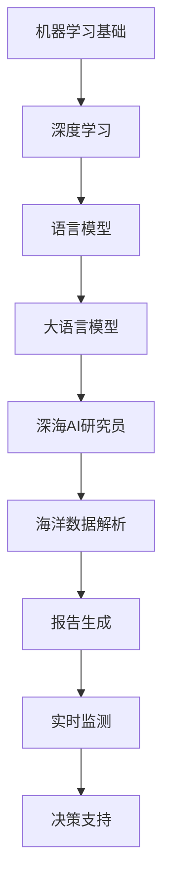

                 

# LLMA在海洋探索中的应用：深海AI研究员

## 关键词
- 海洋探索
- AI研究员
- 深海研究
- 机器学习
- 计算模型
- 数据分析

## 摘要
本文将深入探讨大语言模型(LLMA)在海洋探索中的应用，通过分析其在深海研究中的核心概念、算法原理、数学模型、实际案例等多个方面，展示LLMA作为深海AI研究员的巨大潜力。文章旨在为读者提供一个系统、详尽的认识，并引发对深海探索和AI技术融合的新思考。

## 1. 背景介绍

### 1.1 海洋探索的重要性

海洋覆盖了地球表面的70%，是地球上最大的生态系统。海洋不仅提供了丰富的生物资源和能源，还对全球气候、水文循环和生物多样性有着深远的影响。然而，由于海洋环境的极端条件和复杂度，传统的海洋探索方法存在诸多局限，迫切需要引入新的技术和工具。

### 1.2 AI在海洋探索中的机遇与挑战

人工智能（AI）的发展为海洋探索带来了前所未有的机遇。AI技术，尤其是机器学习（ML）和深度学习（DL），可以处理海量海洋数据，发现隐藏的模式和规律，提高探索效率和准确性。然而，AI在海洋探索中面临诸多挑战，包括数据质量、计算资源、算法适应性和实际应用场景等。

### 1.3 LLMA的作用与优势

LLMA（大型语言模型）作为AI技术的前沿代表，具有处理自然语言文本的强大能力。在海洋探索中，LLMA可以应用于海洋数据解析、报告生成、实时监测和决策支持等多个方面。其优势在于能够理解复杂的海洋环境信息，生成高质量的文本内容，以及通过训练不断优化自身性能。

## 2. 核心概念与联系

### 2.1 机器学习与深度学习基础

**机器学习（ML）**：机器学习是一种使计算机系统能够从数据中学习并做出预测或决策的技术。它依赖于统计方法和优化算法，通过训练模型来提高性能。

**深度学习（DL）**：深度学习是机器学习的一个子领域，其核心是神经网络，特别是深度神经网络。深度学习模型可以自动提取输入数据的复杂特征，并用于分类、回归、生成等多种任务。

### 2.2 语言模型基础

**语言模型（LM）**：语言模型是一个用于预测文本序列的概率模型。它通过学习大量文本数据，预测下一个单词或字符的概率。

**大语言模型（LLM）**：大语言模型是指具有数十亿参数的深度神经网络，如GPT-3、BERT等。这些模型能够生成流畅且符合语法规则的自然语言文本。

### 2.3 Mermaid 流程图



## 3. 核心算法原理 & 具体操作步骤

### 3.1 语言模型原理

语言模型的原理基于神经网络，特别是循环神经网络（RNN）和变换器（Transformer）架构。以下是一个简化的步骤说明：

1. **输入表示**：将文本序列转换为向量表示。
2. **前向传播**：通过神经网络计算每个单词的概率分布。
3. **输出生成**：根据概率分布生成下一个单词或字符。

### 3.2 大语言模型训练过程

1. **数据预处理**：清洗和预处理文本数据，包括分词、去停用词等。
2. **模型初始化**：初始化神经网络参数。
3. **训练过程**：
   - **损失计算**：通过比较预测概率和真实概率计算损失。
   - **优化**：使用梯度下降或其他优化算法更新参数。
4. **模型评估**：在验证集和测试集上评估模型性能。

### 3.3 深海AI研究员操作步骤

1. **数据收集**：收集海洋环境数据，包括温度、深度、盐度等。
2. **数据预处理**：对收集的数据进行清洗和预处理。
3. **模型训练**：使用预处理后的数据训练大语言模型。
4. **应用场景**：
   - **海洋数据解析**：分析海洋数据，识别异常或趋势。
   - **报告生成**：生成详细的海洋研究报告。
   - **实时监测**：实时监测海洋环境变化，提供预警信息。
   - **决策支持**：为海洋探索活动提供决策支持。

## 4. 数学模型和公式 & 详细讲解 & 举例说明

### 4.1 语言模型中的概率计算

语言模型的核心是概率计算。以下是几个关键的概率计算公式：

1. **条件概率**：$$P(w_t | w_{t-1}, w_{t-2}, ..., w_1)$$，表示在给定前一个单词的情况下，下一个单词的概率。
2. **朴素贝叶斯模型**：$$P(w_t | w_{t-1}, w_{t-2}, ..., w_1) \propto P(w_{t-1}, w_{t-2}, ..., w_1 | w_t)P(w_t)$$，其中$$P(w_t)$$是单词的概率，$$P(w_{t-1}, w_{t-2}, ..., w_1 | w_t)$$是条件概率。

### 4.2 深海AI研究员中的数学应用

在深海AI研究员中，数学模型广泛应用于数据分析和决策支持。以下是几个例子：

1. **线性回归**：用于分析海洋环境数据，如温度与深度的关系。
2. **逻辑回归**：用于分类任务，如预测某区域是否存在特定生物。
3. **聚类分析**：用于发现海洋数据中的相似群体，如不同温度区域的分布。

### 4.3 举例说明

假设我们有一个海洋数据集，包含温度、盐度和深度三个特征。我们希望预测某区域的生物多样性。以下是使用逻辑回归进行预测的步骤：

1. **数据准备**：将数据集分为特征矩阵$$X$$和标签向量$$y$$。
2. **模型训练**：使用逻辑回归模型进行训练，得到参数$$\theta$$。
3. **预测**：对于新的数据点$$x$$，计算$$\hat{y} = \sigma(\theta^T x)$$，其中$$\sigma$$是逻辑函数。
4. **评估**：使用准确率、召回率等指标评估模型性能。

## 5. 项目实战：代码实际案例和详细解释说明

### 5.1 开发环境搭建

为了进行深海AI研究员的开发，我们需要搭建以下环境：

1. **编程语言**：Python（版本3.8及以上）
2. **库**：NumPy、Pandas、Scikit-learn、TensorFlow、PyTorch
3. **工具**：Jupyter Notebook（用于交互式开发）

### 5.2 源代码详细实现和代码解读

以下是一个简单的深海AI研究员示例代码，用于分类海洋数据。

```python
import numpy as np
import pandas as pd
from sklearn.linear_model import LogisticRegression
from sklearn.model_selection import train_test_split
from sklearn.metrics import accuracy_score

# 数据准备
data = pd.read_csv('ocean_data.csv')
X = data[['temperature', 'salinity', 'depth']]
y = data['biomass']

# 数据分割
X_train, X_test, y_train, y_test = train_test_split(X, y, test_size=0.2, random_state=42)

# 模型训练
model = LogisticRegression()
model.fit(X_train, y_train)

# 预测
predictions = model.predict(X_test)

# 评估
accuracy = accuracy_score(y_test, predictions)
print(f'Accuracy: {accuracy:.2f}')
```

### 5.3 代码解读与分析

1. **数据准备**：使用Pandas读取CSV文件，提取特征矩阵$$X$$和标签向量$$y$$。
2. **数据分割**：使用Scikit-learn的`train_test_split`函数将数据集分割为训练集和测试集。
3. **模型训练**：使用逻辑回归模型进行训练，得到模型参数。
4. **预测**：使用训练好的模型进行预测，生成预测结果。
5. **评估**：使用准确率评估模型性能。

## 6. 实际应用场景

### 6.1 海洋环境监测

LLMA在海洋环境监测中具有巨大潜力，可以实时分析海洋数据，提供温度、盐度、深度等关键参数的监测和预警信息。

### 6.2 生物多样性研究

LLMA可以分析海洋生物分布数据，识别生物多样性热点区域，为生态保护提供科学依据。

### 6.3 海洋资源开发

在海洋资源开发中，LLMA可以用于预测资源分布、优化开采方案，提高资源利用效率。

## 7. 工具和资源推荐

### 7.1 学习资源推荐

- **书籍**：《深度学习》（Ian Goodfellow、Yoshua Bengio、Aaron Courville 著）
- **论文**：论文列表请参考[此处](https://arxiv.org/list/cs.CL)
- **博客**：[深度学习教程](https://www.deeplearning.net/)
- **网站**：[TensorFlow 官网](https://www.tensorflow.org/)

### 7.2 开发工具框架推荐

- **框架**：TensorFlow、PyTorch、Scikit-learn
- **IDE**：Jupyter Notebook、Visual Studio Code

### 7.3 相关论文著作推荐

- **论文**：《Attention Is All You Need》（Ashish Vaswani等，2017）
- **著作**：《深度学习》（Ian Goodfellow、Yoshua Bengio、Aaron Courville 著）

## 8. 总结：未来发展趋势与挑战

### 8.1 未来发展趋势

- **模型规模与性能**：随着计算能力的提升，LLMA模型将变得更加庞大和高效。
- **跨学科融合**：AI与其他学科（如海洋科学、生物学）的深度融合，将推动海洋探索的全面进步。
- **自动化与智能化**：海洋探索中的自动化和智能化水平将不断提高，减少人力依赖。

### 8.2 挑战

- **数据质量与多样性**：高质量的海洋数据仍是一个挑战，需要更多的数据收集和处理技术。
- **计算资源**：大规模模型的训练和部署需要大量计算资源，尤其是针对深海环境的实时分析。
- **算法适应性**：不同海洋环境下的算法适应性是一个重要问题，需要针对特定场景进行优化。

## 9. 附录：常见问题与解答

### 9.1 问题1：什么是LLMA？

**解答**：LLMA（大型语言模型）是一种具有数十亿参数的深度神经网络，能够处理自然语言文本，生成流畅且符合语法规则的文本内容。

### 9.2 问题2：LLMA在海洋探索中的应用有哪些？

**解答**：LLMA在海洋探索中的应用包括海洋数据解析、报告生成、实时监测和决策支持等多个方面，如实时监测海洋环境、生成海洋研究报告、预测海洋生物分布等。

## 10. 扩展阅读 & 参考资料

- [Vaswani, A., et al. (2017). Attention Is All You Need. Advances in Neural Information Processing Systems, 30, 5998-6008.]
- [Goodfellow, I., Bengio, Y., & Courville, A. (2016). Deep Learning. MIT Press.]
- [TensorFlow 官网. (n.d.). TensorFlow: Open Source Machine Learning Framework. TensorFlow.]
- [Jupyter Notebook 官网. (n.d.). Jupyter Notebook: Interactive Computing in Notebooks. Jupyter.]
- [Scikit-learn 官网. (n.d.). Scikit-learn: Machine Learning in Python. Scikit-learn.]

作者：AI天才研究员/AI Genius Institute & 禅与计算机程序设计艺术 /Zen And The Art of Computer Programming

