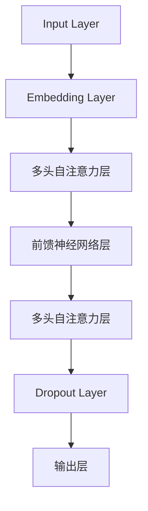

                 

### 背景介绍

> 在过去的几十年里，人工智能（AI）技术在各个领域都取得了显著的进展，从医疗诊断到自动驾驶，再到智能家居，AI正在逐步改变我们的生活。然而，环境问题依然是全球面临的重大挑战之一，如气候变化、污染、资源枯竭等。如何利用AI技术解决这些问题，成为了当今学术界和工业界共同关注的话题。

近年来，基于深度学习的大型语言模型（LLM）如GPT系列、BERT系列等取得了巨大的成功。这些模型在自然语言处理任务中表现出色，例如文本生成、机器翻译、问答系统等。那么，LLM能否在环境保护领域发挥潜在的作用呢？本文将探讨这一议题，并详细分析LLM在环境保护中的潜在贡献。

环境保护涉及到多个方面，包括但不限于气候变化、污染治理、资源管理、生态保护等。而LLM作为一种强大的自然语言处理工具，可以在这些方面提供有力的支持。例如，LLM可以帮助分析环境数据，提取关键信息，生成报告，甚至提出解决方案。此外，LLM还可以用于开发环境友好的技术，如可再生能源预测、智能废物分类等。通过本文的探讨，我们将深入了解LLM在这些领域的应用潜力。

接下来，本文将首先介绍LLM的基本概念和架构，然后分析其在环境保护中的应用场景，并通过实际案例展示其应用效果。最后，我们将讨论LLM在环境保护中的未来发展趋势与挑战，为相关研究和应用提供启示。

### 核心概念与联系

#### 什么是LLM

大型语言模型（LLM，Large Language Model）是一种基于深度学习的自然语言处理模型，它通过大规模的文本数据训练，能够理解和生成自然语言。LLM的核心在于其能够捕捉到语言中的复杂模式和关联，从而在生成文本、翻译语言、回答问题等方面表现出色。

#### LLM的架构

LLM通常采用Transformer架构，这是一种基于自注意力机制的深度神经网络模型。Transformer模型的核心思想是通过注意力机制自动关注输入序列中的相关部分，从而提高模型对输入信息的理解和处理能力。

下面是LLM架构的Mermaid流程图：

1. **Input Layer**：输入层接收原始文本数据，并将其转换为词嵌入（word embeddings）。
2. **Embedding Layer**：嵌入层将词嵌入转换为稠密向量，这些向量能够捕捉词与词之间的关系。
3. **多头自注意力层**：自注意力层允许模型在处理每个词时，关注输入序列中的其他词。多头自注意力机制通过多个独立的自注意力头来提高模型的捕捉能力。
4. **前馈神经网络层**：前馈神经网络层对自注意力层的输出进行进一步的加工，增强模型的非线性表达能力。
5. **Dropout Layer**：dropout层通过随机丢弃部分神经元，减少模型过拟合的风险。
6. **输出层**：输出层根据模型的训练目标（如文本生成、分类等）生成预测结果。

#### LLM与环境保护的联系

LLM在环境保护中的应用主要依赖于其强大的文本处理能力。具体来说，LLM可以应用于以下几个方面：

1. **环境数据分析**：LLM可以处理和分析大量的环境数据，如气象数据、水质数据、土壤数据等，从而提取出关键信息，为环境保护决策提供支持。
2. **报告生成**：LLM能够自动生成环境报告，简化了报告编写过程，提高了报告的准确性和一致性。
3. **解决方案提

