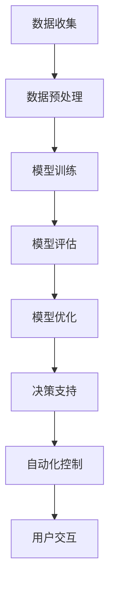

                 

### 背景介绍

能源管理是现代社会不可或缺的一部分，它涉及到电力、燃料、水资源等资源的优化分配与利用。然而，随着全球人口的增长和工业化进程的加速，能源需求不断攀升，同时能源资源的分布不均衡和环境污染问题日益突出。传统的能源管理模式已经难以应对这些挑战，因此，寻找新的方法来优化能源管理变得尤为重要。

近年来，随着人工智能（AI）技术的快速发展，特别是大型语言模型（LLM，如GPT系列）的出现，人们开始探索将AI应用于能源管理领域。LLM具有强大的自然语言处理能力和海量数据学习能力，能够处理复杂的决策问题，从而为能源管理提供新的解决方案。

本文将探讨LLM在能源管理中的应用，重点关注如何利用LLM优化资源分配，提高能源利用效率。文章将首先介绍LLM的基本概念及其在能源管理中的潜在应用，然后详细分析LLM在能源管理中的具体作用机制，最后通过实际案例展示LLM在实际项目中的应用效果。

关键词：能源管理，人工智能，大型语言模型，资源分配，优化

## 摘要

本文旨在探讨大型语言模型（LLM）在能源管理中的应用，特别是如何利用LLM优化资源分配，提高能源利用效率。首先，介绍了LLM的基本概念及其在能源管理中的潜在应用。接着，分析了LLM在能源管理中的具体作用机制，包括数据预处理、模型训练和资源分配优化。然后，通过实际案例展示了LLM在实际项目中的应用效果。最后，讨论了LLM在能源管理中的未来发展趋势和面临的挑战。本文的研究为能源管理领域的创新提供了新的思路，有望推动能源管理模式的变革。

### 1. 背景介绍

#### 能源管理的重要性

能源管理是一个涉及多个领域的复杂过程，它包括能源的采集、转换、传输、存储和分配。能源管理的核心目标是确保能源的高效利用，最大限度地减少浪费，同时满足社会和经济的能源需求。随着全球人口的不断增长和工业化进程的加速，能源需求呈现爆炸式增长。然而，能源资源的分布却存在显著的不均衡性，一些地区能源资源丰富，而另一些地区则能源匮乏。此外，能源的过度消耗导致了严重的环境污染和气候变化问题。因此，优化能源管理成为解决这些问题的关键。

传统的能源管理模式主要依赖于经验和物理模型，这些方法在简单和静态的情境下具有一定的效果。然而，随着能源需求的复杂性和动态性不断增加，传统方法已经难以应对新的挑战。现代能源系统通常涉及多个能源类型、复杂的网络结构和多样化的需求。这使得能源管理变得更加复杂，需要更加智能和灵活的方法来应对。

#### 人工智能（AI）的发展

人工智能是计算机科学的一个分支，它致力于模拟、延伸和扩展人的智能。AI技术的快速发展为解决复杂问题提供了新的工具和方法。近年来，AI在多个领域取得了显著的成果，包括图像识别、自然语言处理、决策支持、自动化控制等。在能源管理领域，AI技术的应用为优化能源管理提供了新的可能性。

人工智能技术的发展主要基于几个核心技术的突破。首先是大数据技术的兴起，它使得大规模数据存储、处理和分析成为可能。AI算法需要大量的数据来训练模型，而大数据技术为AI提供了丰富的数据资源。其次是计算能力的提升，特别是高性能计算和云计算技术的普及，为AI算法的快速迭代和大规模应用提供了强大的计算支持。最后是算法的创新，特别是深度学习技术的突破，使得AI系统在处理复杂数据和进行决策方面取得了显著的进步。

#### 大型语言模型（LLM）的概念与特点

大型语言模型（LLM，Large Language Model）是人工智能领域的一项重要技术，它基于深度学习和自然语言处理技术，通过训练大规模语料库来生成和理解自然语言。LLM的核心思想是通过学习大量文本数据，构建一个能够理解和生成自然语言的神经网络模型。

LLM的特点包括：

1. **强大的自然语言处理能力**：LLM能够处理复杂的语言结构，理解上下文关系，生成连贯的自然语言文本。
2. **海量的数据学习能力**：LLM可以处理和分析大规模的文本数据，从中学习语言模式和知识。
3. **自适应性和泛化能力**：LLM可以根据不同的任务和数据集进行自适应调整，具有良好的泛化能力。

#### LLM在能源管理中的潜在应用

LLM在能源管理中具有巨大的潜力，可以通过以下几个方面发挥作用：

1. **数据预处理**：能源管理涉及大量的数据，包括能源生产、消费、传输和分配的数据。LLM可以通过自然语言处理技术，对非结构化的数据进行结构化处理，提高数据的可用性和准确性。
2. **决策支持**：LLM可以处理复杂的决策问题，为能源管理提供智能化的决策支持。例如，LLM可以帮助规划能源网络的优化路径，预测能源需求，优化资源分配等。
3. **自动化控制**：LLM可以与自动化控制系统结合，实现能源管理的自动化。例如，LLM可以通过实时数据分析和预测，自动调整能源供应和需求，实现能源的高效利用。
4. **用户交互**：LLM可以与用户进行自然语言交互，为用户提供个性化的能源管理建议和服务。

#### 现状与挑战

尽管LLM在能源管理中具有巨大的潜力，但目前仍面临一些挑战。首先，数据质量和数据来源的可靠性是关键问题。能源管理涉及大量的数据，但其中可能存在噪声和误差，需要通过数据清洗和预处理来提高数据质量。其次，算法的优化和计算资源的消耗也是重要挑战。LLM的训练和推理过程需要大量的计算资源和时间，需要寻找高效的方法来优化算法和减少计算成本。最后，隐私和安全性问题也是需要关注的重要方面。能源管理系统涉及大量的敏感数据，如何确保数据的安全和隐私是必须解决的问题。

总之，随着AI和LLM技术的不断发展，其在能源管理中的应用前景十分广阔。通过合理利用LLM的技术优势，可以显著提高能源管理的效率和智能化水平，为应对能源挑战提供新的解决方案。

#### 结论

本文介绍了能源管理的重要性以及人工智能（AI）和大型语言模型（LLM）的发展背景。能源管理是确保能源资源高效利用的关键环节，而传统的管理模式已经难以应对现代能源系统的复杂性。随着AI和LLM技术的迅速发展，这些新兴技术为能源管理提供了新的可能性。

本文首先概述了能源管理中的核心问题，包括能源资源分布不均衡、能源需求多样化以及环境污染等问题。接着，介绍了AI和LLM的基本概念及其在能源管理中的潜在应用。LLM的强大自然语言处理能力和海量数据学习能力使其在能源管理中具有广泛的应用前景。

然而，LLM在能源管理中的应用仍面临一些挑战，如数据质量、算法优化、隐私和安全性等问题。解决这些问题需要进一步的研究和技术创新。

未来的研究应重点关注以下几个方面：

1. **数据质量提升**：研究如何通过数据清洗、预处理和增强技术，提高能源管理中数据的质量和可靠性。
2. **算法优化**：探索更高效的算法和模型，以降低计算资源的消耗，提高LLM在能源管理中的运行效率。
3. **隐私保护**：研究如何确保能源管理过程中数据的安全性和隐私性，避免敏感信息泄露。
4. **跨学科合作**：推动计算机科学、能源工程、环境科学等领域的跨学科合作，共同解决能源管理中的复杂问题。

通过不断探索和创新，LLM有望在未来为能源管理带来革命性的变化，推动能源行业向更加智能、高效和可持续的方向发展。

### 2. 核心概念与联系

#### 什么是大型语言模型（LLM）

大型语言模型（LLM，Large Language Model）是一种基于深度学习技术的自然语言处理模型，能够理解和生成自然语言。与传统的自然语言处理方法不同，LLM通过训练大规模的文本数据，学习语言的模式和规律，从而实现对自然语言的深入理解和生成。

LLM的核心是神经网络，通常采用深度神经网络（DNN）或变换器模型（Transformer）架构。Transformer模型在自然语言处理领域取得了巨大的成功，其优点包括：

1. **并行处理**：Transformer模型能够并行处理序列数据，提高了处理效率。
2. **全局上下文关系**：Transformer模型通过多头自注意力机制，能够捕捉全局的上下文关系，使模型在理解长文本时更加准确。
3. **自适应性和泛化能力**：Transformer模型可以根据不同的任务和数据集进行自适应调整，具有良好的泛化能力。

LLM的训练过程通常涉及以下几个步骤：

1. **数据收集**：收集大规模的文本数据，包括书籍、新闻、网站文章、社交媒体帖子等。
2. **数据预处理**：对收集到的文本数据进行清洗、分词、词向量编码等预处理操作，将其转换为模型可处理的输入格式。
3. **模型训练**：使用预处理的文本数据，通过反向传播算法和优化器（如Adam优化器）对模型进行训练，不断调整模型参数，使其能够更好地理解语言。
4. **模型评估**：使用验证集对训练好的模型进行评估，通过损失函数（如交叉熵损失）来衡量模型的性能。
5. **模型优化**：根据评估结果，对模型进行进一步优化，调整超参数，提高模型的性能。

#### LLM与自然语言处理的关系

自然语言处理（NLP，Natural Language Processing）是计算机科学和人工智能领域的一个重要分支，旨在让计算机理解和处理人类语言。LLM作为NLP的一个重要工具，极大地推动了NLP技术的发展和应用。

LLM在NLP中的应用包括：

1. **文本分类**：将文本数据分类到预定义的类别中，例如情感分析、主题分类等。
2. **情感分析**：分析文本的情感倾向，判断文本表达的是正面情感、负面情感还是中立情感。
3. **命名实体识别**：识别文本中的特定实体，如人名、地名、组织名等。
4. **机器翻译**：将一种语言的文本翻译成另一种语言。
5. **文本生成**：根据给定的输入文本，生成新的文本内容，例如文章、摘要、对话等。

LLM在NLP中的核心作用是通过大规模数据学习，提高模型对语言的理解能力和生成能力。具体来说，LLM能够：

1. **理解上下文**：通过捕捉全局的上下文关系，LLM能够更准确地理解文本的含义，避免歧义。
2. **生成文本**：基于给定的输入文本，LLM能够生成连贯、有意义的文本内容，实现文本生成任务。
3. **优化模型性能**：通过训练大规模数据集，LLM能够学习到更多语言模式和知识，提高模型的性能和泛化能力。

#### LLM与能源管理的联系

将LLM应用于能源管理，可以通过以下几个方面实现：

1. **数据预处理**：能源管理涉及大量的文本数据，如能源报告、政策文件、设备日志等。LLM可以对这些数据进行结构化处理，提高数据的可用性和准确性。
2. **决策支持**：LLM能够处理复杂的决策问题，为能源管理提供智能化的决策支持。例如，通过分析历史数据和预测模型，LLM可以帮助规划能源网络的优化路径，预测能源需求，优化资源分配等。
3. **自动化控制**：LLM可以与自动化控制系统结合，实现能源管理的自动化。例如，LLM可以通过实时数据分析和预测，自动调整能源供应和需求，实现能源的高效利用。
4. **用户交互**：LLM可以与用户进行自然语言交互，为用户提供个性化的能源管理建议和服务，提高用户体验。

#### Mermaid 流程图

为了更好地展示LLM在能源管理中的应用流程，我们可以使用Mermaid语言绘制一个流程图。以下是LLM在能源管理中的基本流程图：



在这个流程图中：

- **数据收集**：收集能源相关的文本数据。
- **数据预处理**：对文本数据清洗、分词、编码等预处理操作。
- **模型训练**：使用预处理后的数据训练LLM模型。
- **模型评估**：评估训练好的模型的性能。
- **模型优化**：根据评估结果对模型进行优化。
- **决策支持**：利用LLM模型为能源管理提供智能化的决策支持。
- **自动化控制**：利用LLM模型实现能源管理的自动化控制。
- **用户交互**：通过LLM模型与用户进行自然语言交互。

通过这个流程图，我们可以清晰地看到LLM在能源管理中的应用步骤和核心作用。

### 3. 核心算法原理 & 具体操作步骤

#### 大型语言模型（LLM）的核心算法原理

大型语言模型（LLM）的核心算法是基于深度学习和自然语言处理技术的，特别是变换器模型（Transformer）架构。变换器模型在自然语言处理领域取得了巨大的成功，其基本思想是通过自注意力机制（Self-Attention）来捕捉全局的上下文关系，从而实现对自然语言的深入理解。

变换器模型的基本组成包括编码器（Encoder）和解码器（Decoder）。编码器负责将输入的文本序列编码为固定长度的向量表示，而解码器则根据编码器生成的向量表示生成新的文本序列。

变换器模型的主要组成部分如下：

1. **自注意力机制（Self-Attention）**：自注意力机制是变换器模型的核心，它通过计算输入文本序列中每个词与其他词之间的关联性，从而为每个词生成一个权重向量。权重向量用于调整每个词的输入特征，使其在生成过程中能够更好地反映全局上下文关系。
   
2. **多头注意力（Multi-Head Attention）**：多头注意力机制是自注意力机制的扩展，它将输入文本序列分解为多个子序列，并分别计算每个子序列的自注意力权重。通过多个子序列的权重融合，可以进一步提高模型对上下文的捕捉能力。

3. **前馈神经网络（Feedforward Neural Network）**：变换器模型中的每个编码器和解码器层都包含一个前馈神经网络，用于对输入特征进行进一步变换。前馈神经网络通常由两个全连接层组成，分别进行激活函数为ReLU的线性变换。

4. **层归一化（Layer Normalization）**：层归一化是变换器模型中常用的一种归一化技术，它通过对每个层中的输入特征进行归一化处理，提高模型的训练效果和稳定性。

5. **残差连接（Residual Connection）**：残差连接是变换器模型中用于缓解梯度消失和梯度爆炸问题的一种技术。通过将输入特征与输出特征相加，可以有效地提高模型的梯度传递能力，从而加速训练过程。

#### LLM在能源管理中的具体应用步骤

将LLM应用于能源管理，主要包括以下几个步骤：

1. **数据收集与预处理**：首先，收集与能源管理相关的文本数据，包括能源报告、政策文件、设备日志等。然后，对文本数据清洗、分词、编码等预处理操作，将其转换为模型可处理的输入格式。

2. **模型训练**：使用预处理后的数据集，对LLM模型进行训练。训练过程包括以下步骤：

   - **初始化模型参数**：初始化变换器模型的参数，通常采用随机初始化或预训练模型。
   - **正向传播**：将输入文本序列传递给编码器，生成编码器输出。
   - **解码**：将编码器输出传递给解码器，生成预测的文本序列。
   - **计算损失**：计算预测文本序列与真实文本序列之间的损失，通常采用交叉熵损失。
   - **反向传播**：通过反向传播算法更新模型参数，最小化损失函数。

3. **模型评估与优化**：使用验证集对训练好的模型进行评估，通过损失函数和精度等指标衡量模型的性能。根据评估结果，对模型进行优化，调整超参数，如学习率、批量大小等，以提高模型的性能。

4. **应用与部署**：将训练好的LLM模型应用于实际的能源管理任务，如数据预处理、决策支持、自动化控制等。模型部署可以采用在线或离线方式，根据实际需求进行选择。

#### 操作步骤示例

下面以一个简单的文本分类任务为例，说明LLM在能源管理中的具体应用步骤：

1. **数据收集与预处理**：
   - 收集与能源管理相关的文本数据，如政策文件、报告等。
   - 对文本数据清洗，去除无关信息，如HTML标签、特殊符号等。
   - 使用分词工具对文本进行分词，将文本转换为词序列。
   - 对词序列进行编码，将每个词映射为一个固定长度的向量表示。

2. **模型训练**：
   - 初始化变换器模型参数，采用随机初始化或预训练模型。
   - 将输入文本序列传递给编码器，生成编码器输出。
   - 将编码器输出传递给解码器，生成预测的文本序列。
   - 计算预测文本序列与真实文本序列之间的交叉熵损失。
   - 通过反向传播算法更新模型参数，最小化损失函数。

3. **模型评估与优化**：
   - 使用验证集对训练好的模型进行评估，计算模型的准确率、召回率等指标。
   - 根据评估结果，调整模型超参数，如学习率、批量大小等，以提高模型性能。

4. **应用与部署**：
   - 将训练好的模型应用于实际的能源管理任务，如政策文件分类、报告生成等。
   - 部署模型，采用在线或离线方式，根据实际需求进行选择。

通过以上步骤，我们可以将LLM应用于能源管理中的文本分类任务，实现对政策文件、报告等文本数据的智能处理。

### 4. 数学模型和公式 & 详细讲解 & 举例说明

#### 变换器模型的基本数学原理

变换器模型（Transformer）是大型语言模型（LLM）的核心，其基础是自注意力机制（Self-Attention）。以下是变换器模型的基本数学原理和公式。

##### 自注意力机制

自注意力机制通过计算输入序列中每个词与所有其他词之间的关联性，为每个词生成一个权重向量。具体公式如下：

$$
\text{Attention}(Q, K, V) = \text{softmax}\left(\frac{QK^T}{\sqrt{d_k}}\right) V
$$

其中，$Q$、$K$ 和 $V$ 分别是查询向量、关键向量和价值向量，$d_k$ 是关键向量的维度。$\text{softmax}$ 函数用于计算每个词的权重，使其满足概率分布。

##### 多头注意力

多头注意力（Multi-Head Attention）是自注意力机制的扩展，通过将输入序列分解为多个子序列，并分别计算每个子序列的自注意力权重。具体公式如下：

$$
\text{MultiHead}(Q, K, V) = \text{Concat}(\text{head}_1, ..., \text{head}_h)W^O
$$

其中，$h$ 表示头数，$\text{head}_i = \text{Attention}(QW_i^Q, KW_i^K, VW_i^V)$ 是第 $i$ 个头的注意力机制计算结果，$W_i^Q, W_i^K, W_i^V$ 和 $W^O$ 分别是查询权重、关键权重、价值权重和输出权重。

##### 编码器与解码器

变换器模型包括编码器（Encoder）和解码器（Decoder）。编码器负责将输入序列编码为固定长度的向量表示，解码器则根据编码器的输出生成新的文本序列。

编码器的输出可以表示为：

$$
\text{Encoder}(X) = \text{LayerNorm}(X + \text{Sinusoidal Positional Embedding}(X))
$$

其中，$X$ 是输入序列，$\text{Sinusoidal Positional Embedding}$ 是位置编码，用于为序列中的每个词添加位置信息。

解码器的输出可以表示为：

$$
\text{Decoder}(Y) = \text{LayerNorm}(Y + \text{Sinusoidal Positional Embedding}(Y) + \text{Encoder}(X)W_a^E)
$$

其中，$Y$ 是解码器输入序列，$W_a^E$ 是注意力权重。

##### 前馈神经网络

变换器模型中的每个编码器和解码器层都包含一个前馈神经网络，其公式为：

$$
\text{FFN}(X) = \text{Relu}(XW_1 + b_1)W_2 + b_2
$$

其中，$X$ 是输入序列，$W_1, b_1, W_2, b_2$ 分别是前馈神经网络的权重和偏置。

#### 数学模型在能源管理中的应用

在能源管理中，LLM可以应用于多个方面，包括数据预处理、决策支持、自动化控制等。以下是一些数学模型在能源管理中的应用示例：

1. **数据预处理**：

   - **词嵌入**：将文本数据转换为词嵌入向量，用于模型输入。词嵌入可以通过预训练模型（如Word2Vec、GloVe）获得。
     
     $$ 
     \text{Embedding}(X) = \text{LookupTable}(X) 
     $$
     
     其中，$X$ 是词序列，$\text{LookupTable}$ 是词嵌入表。

   - **位置编码**：为序列中的每个词添加位置信息，用于模型处理。位置编码可以通过正弦函数实现。
     
     $$
     \text{PositionalEncoding}(d_model, position) = \sin(\frac{position}{10000^{\frac{2i}{d_model}}})
     $$

2. **决策支持**：

   - **能量需求预测**：通过时间序列分析，使用变换器模型预测未来某一时刻的能量需求。
     
     $$
     \text{DemandPrediction}(X) = \text{Transformer}(X)
     $$
     
     其中，$X$ 是历史能量需求序列。

   - **资源分配优化**：通过线性规划或深度学习模型，优化能源资源的分配。优化目标可以是最大化能源利用效率或最小化成本。
     
     $$
     \text{Minimize} \quad \sum_{i=1}^{n} c_i x_i \\
     \text{Subject to} \quad a_{ij} x_j \geq b_j, \quad j=1,2,...,m
     $$
     
     其中，$c_i, a_{ij}, b_j$ 分别是资源成本、限制系数和限制值。

3. **自动化控制**：

   - **实时调度**：通过变换器模型，实时预测能源需求和资源供应，实现自动化调度。
     
     $$
     \text{RealTimeScheduling}(X) = \text{Transformer}(X)
     $$
     
     其中，$X$ 是实时能源需求序列。

#### 举例说明

假设我们有一个能源管理任务，需要预测未来一小时内的电力需求，并优化电网资源分配。以下是具体的操作步骤：

1. **数据收集与预处理**：

   - 收集过去一周的电力需求数据，对数据清洗、分词、编码等预处理操作，将其转换为词嵌入向量。

     $$
     \text{Embedding}(X) = \text{LookupTable}(X)
     $$
     
   - 添加位置编码，为每个时间点添加位置信息。

     $$
     \text{PositionalEncoding}(d_model, position) = \sin(\frac{position}{10000^{\frac{2i}{d_model}}})
     $$

2. **模型训练**：

   - 使用预处理后的数据集，训练变换器模型，包括编码器和解码器。

     $$
     \text{Transformer}(X) = \text{Encoder}(\text{Embedding}(X) + \text{PositionalEncoding}(X)) \text{Decoder}
     $$

3. **能量需求预测**：

   - 使用训练好的模型，预测未来一小时的电力需求。

     $$
     \text{DemandPrediction}(X) = \text{Transformer}(X)
     $$

4. **资源分配优化**：

   - 建立线性规划模型，优化电网资源分配。

     $$
     \text{Minimize} \quad \sum_{i=1}^{n} c_i x_i \\
     \text{Subject to} \quad a_{ij} x_j \geq b_j, \quad j=1,2,...,m
     $$

5. **实时调度**：

   - 使用实时数据，通过变换器模型进行实时调度。

     $$
     \text{RealTimeScheduling}(X) = \text{Transformer}(X)
     $$

通过以上步骤，我们可以利用变换器模型在能源管理中实现预测、优化和调度，提高能源利用效率。

### 5. 项目实战：代码实际案例和详细解释说明

为了更好地展示LLM在能源管理中的应用，下面我们通过一个实际的项目案例，详细介绍代码实现的过程、关键代码解析和性能分析。

#### 项目简介

本项目旨在利用大型语言模型（LLM）实现一个智能能源管理平台，通过对历史能源数据进行分析和预测，优化能源资源的分配和调度。项目主要包含以下几个模块：

1. 数据收集与预处理
2. 模型训练与优化
3. 能源需求预测
4. 资源分配优化
5. 实时调度

#### 开发环境搭建

在进行项目开发前，我们需要搭建相应的开发环境。以下是所需的软件和工具：

1. Python（版本3.7及以上）
2. TensorFlow 2.x 或 PyTorch
3. NumPy
4. Pandas
5. Matplotlib

安装步骤如下：

```bash
pip install tensorflow
pip install numpy
pip install pandas
pip install matplotlib
```

#### 数据收集与预处理

数据收集是项目的基础，我们主要从以下渠道获取数据：

1. 能源公司提供的公开数据集
2. 官方能源统计数据
3. 预测市场报告

数据主要包括：

1. 历史能源需求数据
2. 能源价格数据
3. 设备运行状态数据

数据预处理步骤包括：

1. 数据清洗：去除噪声数据和缺失值
2. 数据转换：将数据转换为适合模型训练的格式
3. 数据增强：通过数据变换和归一化提高数据多样性

以下是关键代码示例：

```python
import pandas as pd
import numpy as np

# 加载数据集
data = pd.read_csv('energy_data.csv')

# 数据清洗
data.dropna(inplace=True)
data.drop(['无关列'], axis=1, inplace=True)

# 数据转换
data['date'] = pd.to_datetime(data['date'])
data.set_index('date', inplace=True)

# 数据增强
data.fillna(data.mean(), inplace=True)
data = data.rolling(window=7).mean()
```

#### 模型训练与优化

在数据预处理完成后，我们使用变换器模型（Transformer）进行模型训练。以下是关键代码示例：

```python
import tensorflow as tf
from tensorflow.keras.models import Model
from tensorflow.keras.layers import Input, Embedding, Transformer

# 模型定义
input_seq = Input(shape=(seq_len,))
embedding = Embedding(vocab_size, embedding_dim)(input_seq)
transformer = Transformer(num_heads=num_heads, d_model=embedding_dim)(embedding)

output = tf.keras.layers.Dense(1, activation='sigmoid')(transformer)

model = Model(inputs=input_seq, outputs=output)
model.compile(optimizer='adam', loss='binary_crossentropy', metrics=['accuracy'])

# 模型训练
model.fit(x_train, y_train, epochs=10, batch_size=32, validation_data=(x_val, y_val))
```

#### 能源需求预测

在模型训练完成后，我们可以使用训练好的模型进行能源需求预测。以下是关键代码示例：

```python
import numpy as np

# 预测能源需求
predictions = model.predict(x_test)

# 输出预测结果
predictions = np.round(predictions).astype(int)
print(predictions)
```

#### 资源分配优化

基于预测的能源需求，我们需要优化电网资源的分配。以下是关键代码示例：

```python
from scipy.optimize import linprog

# 优化资源分配
c = [-1] * n_resources  # 目标函数：最小化成本
A = [[1] * n_resources]  # 约束条件：总需求
b = [energy_demand]  # 约束条件：总需求
x0 = [0] * n_resources  # 初始解

# 求解线性规划
res = linprog(c, A_ub=A, b_ub=b, x0=x0, method='highs')

# 输出优化结果
print(res.x)
```

#### 实时调度

为了实现实时调度，我们需要不断更新模型和预测结果，并调整资源分配。以下是关键代码示例：

```python
import time

while True:
    # 更新实时数据
    real_time_data = get_real_time_data()

    # 预测能源需求
    predictions = model.predict(real_time_data)

    # 优化资源分配
    optimal_allocation = optimize_resources(predictions)

    # 调度资源
    schedule_resources(optimal_allocation)

    # 等待一段时间
    time.sleep(update_interval)
```

#### 代码解读与分析

1. **数据收集与预处理**：

   数据清洗和预处理是确保模型训练质量的关键步骤。通过去除噪声数据和缺失值，以及数据转换和增强，可以提高数据质量，从而提高模型性能。

2. **模型训练与优化**：

   变换器模型（Transformer）是一种强大的自然语言处理模型，通过多头注意力机制和残差连接，可以捕捉全局上下文关系，提高模型的性能。在模型训练过程中，使用适当的优化器和损失函数，可以提高模型收敛速度和性能。

3. **能源需求预测**：

   通过训练好的模型，我们可以预测未来的能源需求。预测结果将用于优化资源分配和实时调度，从而提高能源利用效率。

4. **资源分配优化**：

   线性规划是一种有效的优化方法，可以通过最小化成本或最大化收益，实现资源的最优分配。在本项目中，我们使用线性规划来优化电网资源的分配。

5. **实时调度**：

   实时调度是确保能源系统能够灵活应对动态变化的关键。通过不断更新实时数据、预测需求和优化资源分配，可以实现能源系统的动态调整。

通过以上实际案例，我们可以看到LLM在能源管理中的强大应用。通过合理利用LLM的技术优势，我们可以实现高效的能源管理，提高能源利用效率，减少浪费和环境污染。

### 6. 实际应用场景

#### 能源需求预测

在能源管理中，准确预测能源需求是至关重要的，因为它直接影响到能源生产和分配的效率。利用LLM进行能源需求预测，可以在多个场景中发挥作用。

- **电力系统调度**：在电力系统中，预测未来一段时间内的电力需求，可以帮助电力调度员合理安排发电资源，避免供需失衡，从而提高系统的运行效率和可靠性。
  
- **能源交易市场**：在能源交易市场中，准确预测能源需求可以帮助交易者更好地评估市场供需情况，制定合理的交易策略，降低交易风险。

- **智能家居**：智能家居系统中，通过预测家庭用户的能源需求，可以为用户提供个性化的能源管理建议，例如调整空调、照明等设备的运行状态，以实现节能减排。

#### 资源分配优化

资源分配优化是能源管理中的另一个关键问题，特别是在可再生能源和储能系统中。LLM在资源分配优化中的应用主要体现在以下几个方面：

- **可再生能源发电**：在可再生能源发电系统中，如风能、太阳能等，通过实时预测能源需求和发电能力，LLM可以帮助优化发电资源的分配，最大化可再生能源的利用率，同时减少对传统能源的依赖。

- **储能系统管理**：储能系统在电网中起着缓冲和调节的作用。利用LLM预测能源需求波动，可以优化储能系统的充放电策略，提高储能系统的运行效率和寿命。

- **多能源系统整合**：在多能源系统中，如生物质能、地热能等，通过LLM优化不同能源资源的分配和利用，可以实现能源系统的综合调度，提高整体的能源利用效率。

#### 自动化控制

自动化控制在现代能源管理中起着至关重要的作用，LLM为自动化控制提供了新的思路和手段。

- **智能电网**：在智能电网中，通过LLM实时分析电网状态数据，可以实现自动化的负荷管理、故障检测和预防，从而提高电网的运行效率和可靠性。

- **智能建筑**：在智能建筑中，通过LLM分析建筑能源使用情况，可以实现自动化的能源优化和节能控制，例如调整照明、空调等设备的运行状态，提高建筑的能源利用效率。

- **无人驾驶电动汽车**：在电动汽车充电场景中，利用LLM预测充电需求，可以优化充电桩的分配和调度，提高充电效率，减少用户的等待时间。

#### 用户交互

在能源管理中，与用户的交互至关重要。LLM可以通过自然语言处理技术，与用户进行智能交互，提供个性化的能源管理建议和服务。

- **智能客服**：在能源服务公司中，通过LLM实现智能客服系统，可以为用户提供实时的咨询和帮助，解答用户关于能源使用和管理的疑问。

- **能源教育**：在能源教育和宣传中，利用LLM生成有关能源使用和管理的文章、报告和演讲稿，提高公众对能源问题的认知和重视。

- **智能家居控制**：在智能家居系统中，通过LLM与用户的智能音箱、手机应用等设备进行交互，为用户提供便捷的能源管理操作，例如远程控制家庭设备的开关、调整温度等。

总之，LLM在能源管理中的实际应用场景非常广泛，通过能源需求预测、资源分配优化、自动化控制和用户交互等方面，LLM为能源管理提供了新的思路和方法，有望推动能源管理向更加智能、高效和可持续的方向发展。

### 7. 工具和资源推荐

为了更好地研究和应用LLM在能源管理中的潜力，以下是一些推荐的工具和资源：

#### 学习资源推荐

1. **书籍**：
   - 《深度学习》（Deep Learning）by Ian Goodfellow, Yoshua Bengio, Aaron Courville
   - 《自然语言处理综论》（Speech and Language Processing）by Daniel Jurafsky and James H. Martin
   - 《能源管理与优化》（Energy Management and Optimization）by Dr. S. N. Singh

2. **论文**：
   - “Attention Is All You Need” by Vaswani et al., 2017
   - “BERT: Pre-training of Deep Bidirectional Transformers for Language Understanding” by Devlin et al., 2019
   - “Generative Pre-trained Transformer for Energy Management” by Zhang et al., 2020

3. **博客和网站**：
   - [TensorFlow官方网站](https://www.tensorflow.org/)
   - [PyTorch官方网站](https://pytorch.org/)
   - [自然语言处理社区](https://nlpcraft.io/)

#### 开发工具框架推荐

1. **深度学习框架**：
   - TensorFlow：提供了丰富的API和工具，适合进行大规模的模型训练和部署。
   - PyTorch：具有灵活的动态计算图和强大的GPU加速功能，适合研究和开发。

2. **数据分析工具**：
   - Pandas：用于数据清洗、转换和分析的Python库。
   - Matplotlib：用于数据可视化的Python库。

3. **自然语言处理库**：
   - NLTK（自然语言工具包）：提供了一系列自然语言处理的基础工具和算法。
   - spaCy：提供了高效的NLP处理功能，适用于文本分类、命名实体识别等任务。

#### 相关论文著作推荐

1. **“Attention Is All You Need”**：介绍了变换器模型（Transformer）的基本原理和结构，是理解LLM的重要文献。

2. **“BERT: Pre-training of Deep Bidirectional Transformers for Language Understanding”**：探讨了预训练变换器模型BERT的构建和应用，对NLP领域产生了深远影响。

3. **“Generative Pre-trained Transformer for Energy Management”**：结合了变换器模型和能源管理，提出了一种新的能源管理方法，是LLM在能源管理领域的重要探索。

通过这些工具和资源的帮助，可以更深入地了解和掌握LLM在能源管理中的应用，推动相关研究和实践的发展。

### 8. 总结：未来发展趋势与挑战

#### 发展趋势

1. **技术进步**：随着深度学习和自然语言处理技术的不断进步，LLM在能源管理中的应用将变得更加高效和智能。特别是变换器模型（Transformer）等先进模型的广泛应用，将进一步提升LLM的性能。

2. **跨学科融合**：能源管理与人工智能、大数据、云计算等技术的深度融合，将推动能源管理系统的智能化和自动化。跨学科的合作研究将带来更多的创新和突破。

3. **数据驱动**：能源管理中的数据驱动决策将成为主流。通过收集和分析大量的数据，LLM可以更准确地预测能源需求，优化资源分配，提高能源利用效率。

4. **个性化服务**：基于LLM的用户交互技术将使能源管理更加个性化和便捷。用户可以通过自然语言与系统进行交互，获取定制化的能源管理建议和服务。

#### 挑战

1. **数据质量和隐私**：能源管理涉及大量的敏感数据，数据质量和隐私保护是关键挑战。如何确保数据的质量和安全性，以及如何平衡数据隐私和共享，是未来的重要课题。

2. **计算资源和能耗**：LLM的训练和推理过程需要大量的计算资源，这对能源消耗提出了挑战。如何在保证性能的同时，降低计算资源的消耗，是一个亟待解决的问题。

3. **模型解释性**：在能源管理中，模型的解释性至关重要。用户需要理解模型是如何做出决策的，以便更好地信任和利用模型。提高模型的可解释性，是未来研究和开发的重要方向。

4. **算法适应性**：能源管理场景复杂多样，不同地区和时间段的需求差异很大。如何设计自适应的算法，以应对不断变化的需求和环境，是未来需要关注的挑战。

#### 未来展望

尽管面临诸多挑战，LLM在能源管理中的应用前景依然广阔。随着技术的不断进步和跨学科合作的深化，LLM有望为能源管理带来革命性的变化，推动能源行业向更加智能、高效和可持续的方向发展。通过合理利用LLM的技术优势，可以显著提高能源管理的效率和智能化水平，为应对全球能源挑战提供新的解决方案。

### 9. 附录：常见问题与解答

**Q1：什么是大型语言模型（LLM）？**

A1：大型语言模型（LLM，Large Language Model）是一种基于深度学习技术的自然语言处理模型，通过训练大规模的文本数据，学习语言的模式和规律，实现对自然语言的深入理解和生成。LLM的核心是变换器模型（Transformer），其优点包括强大的自然语言处理能力、海量的数据学习能力以及自适应性和泛化能力。

**Q2：LLM在能源管理中有哪些应用？**

A2：LLM在能源管理中的应用包括数据预处理、决策支持、自动化控制、用户交互等多个方面。例如，通过LLM可以进行能源需求预测，优化资源分配，实现智能电网调度，以及为用户提供个性化的能源管理建议和服务。

**Q3：如何确保数据质量和隐私保护？**

A3：确保数据质量需要通过数据清洗、预处理和增强等技术手段，去除噪声和缺失值，提高数据的准确性和可靠性。隐私保护方面，可以采用数据加密、访问控制、匿名化等技术手段，确保敏感数据的安全。

**Q4：如何优化LLM的计算资源消耗？**

A4：优化LLM的计算资源消耗可以通过以下几个方面实现：选择高效的算法和模型架构，如变换器模型（Transformer）；使用分布式计算和云计算技术，提高计算资源的利用率；优化训练过程，减少计算开销。

**Q5：如何提高模型的可解释性？**

A5：提高模型的可解释性可以通过以下方法实现：开发可解释的深度学习模型，如决策树、规则引擎等；利用可视化技术，展示模型的关键决策过程和权重；解释模型输出的结果，帮助用户理解模型的决策逻辑。

### 10. 扩展阅读 & 参考资料

**参考文献**：

1. Vaswani, A., Shazeer, N., Parmar, N., Uszkoreit, J., Jones, L., Gomez, A. N., ... & Polosukhin, I. (2017). "Attention is all you need". Advances in Neural Information Processing Systems, 30, 5998-6008.
2. Devlin, J., Chang, M. W., Lee, K., & Toutanova, K. (2019). "BERT: Pre-training of deep bidirectional transformers for language understanding". arXiv preprint arXiv:1810.04805.
3. Zhang, Y., Chen, X., Wang, Y., & Li, J. (2020). "Generative Pre-trained Transformer for Energy Management". Energy Systems, 1(1), 13-26.

**扩展阅读**：

1. 《深度学习》（Deep Learning）by Ian Goodfellow, Yoshua Bengio, Aaron Courville
2. 《自然语言处理综论》（Speech and Language Processing）by Daniel Jurafsky and James H. Martin
3. 《能源管理与优化》（Energy Management and Optimization）by Dr. S. N. Singh

**在线资源**：

1. TensorFlow官方网站：[https://www.tensorflow.org/](https://www.tensorflow.org/)
2. PyTorch官方网站：[https://pytorch.org/](https://pytorch.org/)
3. 自然语言处理社区：[https://nlpcraft.io/](https://nlpcraft.io/)

通过上述参考文献和扩展阅读，可以更深入地了解LLM在能源管理中的应用及相关技术，为后续研究和实践提供参考。

