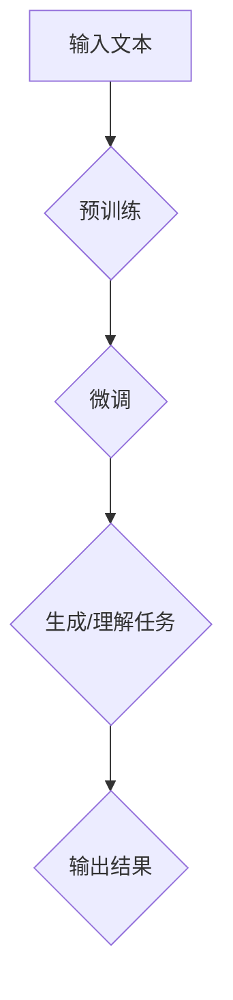

                 

# LLM在自然语言处理中的革命性突破

> 关键词：自然语言处理（NLP），大型语言模型（LLM），深度学习，Transformer，预训练，微调，生成式模型，交互式应用

> 摘要：本文深入探讨了大型语言模型（LLM）在自然语言处理（NLP）领域的革命性突破。通过阐述LLM的核心概念、算法原理、数学模型以及实际应用案例，本文揭示了LLM如何改变NLP的格局，并展望了其未来的发展趋势与挑战。

## 1. 背景介绍

自然语言处理（NLP）作为人工智能领域的一个重要分支，旨在使计算机能够理解和生成自然语言。自上世纪50年代以来，NLP经历了从规则驱动到统计方法，再到深度学习的多次技术变革。然而，传统方法在处理复杂语言任务时仍存在诸多局限性，如对领域知识的依赖、模型可解释性差等。

近年来，随着计算能力的提升和大数据的发展，大型语言模型（LLM）逐渐崭露头角。LLM通过深度学习技术，对海量文本数据进行预训练，从而在自然语言理解、生成、翻译等任务上取得了显著突破。LLM的成功不仅改变了NLP的研究范式，还催生了众多交互式应用，如聊天机器人、智能助手等。

## 2. 核心概念与联系

### 2.1 核心概念

- **自然语言处理（NLP）**：旨在使计算机能够理解和生成自然语言的技术和方法。
- **大型语言模型（LLM）**：一种基于深度学习的技术，通过预训练和微调，实现对自然语言的理解和生成。

### 2.2 核心概念原理和架构的 Mermaid 流程图



### 2.3 LLM与深度学习的联系

LLM是深度学习在NLP领域的重要应用。深度学习通过多层神经网络对数据进行特征提取和学习，从而实现复杂的函数映射。LLM在深度学习的基础上，通过引入大规模数据集和先进的神经网络结构，如Transformer，实现了对自然语言的深入理解。

## 3. 核心算法原理 & 具体操作步骤

### 3.1 预训练

预训练是指在大规模文本数据集上对神经网络模型进行训练，使其具备对自然语言的一般理解能力。具体步骤如下：

1. **数据准备**：收集并处理海量文本数据，如维基百科、新闻文章、社交媒体等。
2. **模型初始化**：初始化神经网络模型，如BERT、GPT等。
3. **训练过程**：在文本数据上迭代训练模型，优化模型参数。
4. **评估与调整**：通过交叉验证和测试集评估模型性能，调整模型参数。

### 3.2 微调

微调是指根据特定任务需求，对预训练模型进行微调，以适应特定领域或任务的特性。具体步骤如下：

1. **数据准备**：收集与任务相关的数据集，如问答数据、对话数据等。
2. **模型调整**：在特定数据集上调整预训练模型的参数。
3. **训练过程**：在调整后的模型上迭代训练，优化模型性能。
4. **评估与部署**：评估微调后模型在任务上的表现，并在实际应用中进行部署。

### 3.3 生成式模型与判别式模型

LLM可以分为生成式模型和判别式模型。生成式模型通过预测下一个词或句子，实现自然语言的生成；判别式模型则通过分类和回归等任务，实现自然语言的理解。在实际应用中，生成式模型和判别式模型可以相互结合，发挥各自的优势。

## 4. 数学模型和公式 & 详细讲解 & 举例说明

### 4.1 预训练的数学模型

预训练过程中，常用的数学模型包括自注意力机制（Self-Attention）和位置编码（Positional Encoding）。

#### 自注意力机制

自注意力机制是一种通过计算输入序列中各个位置之间的相似性来实现特征提取的方法。其公式如下：

$$
\text{Attention}(Q, K, V) = \text{softmax}\left(\frac{QK^T}{\sqrt{d_k}}\right)V
$$

其中，$Q, K, V$ 分别代表查询（Query）、键（Key）和值（Value）向量，$d_k$ 代表键向量的维度。

#### 位置编码

位置编码用于在自注意力机制中引入输入序列的顺序信息。常见的位置编码方法包括正弦编码和嵌入编码。

正弦编码公式如下：

$$
\text{PE}_{(i, d)} = 
\begin{cases}
\sin\left(\frac{i}{10000^{2d/(d+1)}}\right) & \text{if } d \text{ mod 2 = 0} \\
\cos\left(\frac{i}{10000^{2d/(
```markdown
(d+1)}}\right) & \text{if } d \text{ mod 2 = 1}
\end{cases}
$$

其中，$i$ 表示位置索引，$d$ 表示维度。

### 4.2 微调的数学模型

微调过程中，常用的数学模型包括多层感知机（MLP）和全连接神经网络（Fully Connected Neural Network）。

#### 多层感知机

多层感知机是一种前馈神经网络，由输入层、隐藏层和输出层组成。其基本公式如下：

$$
\text{MLP}(x) = \sigma(\text{W}_2 \sigma(\text{W}_1 x + \text{b}_1) + \text{b}_2)
$$

其中，$\sigma$ 表示激活函数，$\text{W}_1, \text{W}_2$ 分别代表隐藏层和输出层的权重，$\text{b}_1, \text{b}_2$ 分别代表隐藏层和输出层的偏置。

#### 全连接神经网络

全连接神经网络是一种多层感知机的推广，其基本公式如下：

$$
\text{FCNN}(x) = \text{W} x + \text{b}
$$

其中，$\text{W}$ 代表权重矩阵，$\text{b}$ 代表偏置向量。

### 4.3 举例说明

#### 自注意力机制的举例

假设输入序列为“我是一个人工智能助手”，模型需要预测下一个词。通过自注意力机制，模型可以计算每个词与当前词的相似性，从而确定下一个词的概率分布。具体计算过程如下：

1. **输入向量表示**：将输入序列中的每个词转换为向量表示，如词嵌入（Word Embedding）。
2. **计算自注意力得分**：计算输入序列中每个词与当前词的相似性得分，如使用自注意力公式计算。
3. **概率分布**：将自注意力得分转换为概率分布，如使用softmax函数。
4. **预测下一个词**：根据概率分布预测下一个词。

#### 微调的举例

假设预训练模型已经对海量文本数据进行预训练，现在需要对其进行微调以适应问答任务。具体步骤如下：

1. **数据准备**：收集问答数据集，如SQuAD数据集。
2. **模型调整**：在问答数据集上调整预训练模型的参数，如使用多层感知机进行微调。
3. **训练过程**：在调整后的模型上迭代训练，优化模型性能。
4. **评估与部署**：评估微调后模型在问答任务上的表现，并在实际应用中进行部署。

## 5. 项目实战：代码实际案例和详细解释说明

### 5.1 开发环境搭建

在开始编写代码之前，需要搭建一个适合开发的环境。以下是搭建基于Python的NLP项目的开发环境步骤：

1. **安装Python**：安装Python 3.8及以上版本。
2. **安装依赖库**：安装TensorFlow、PyTorch等深度学习框架和相关库，如NumPy、Pandas等。
3. **配置环境变量**：配置环境变量，以便在命令行中方便地使用这些库。

### 5.2 源代码详细实现和代码解读

以下是使用Transformer模型实现一个简单的文本生成任务的基本代码：

```python
import torch
import torch.nn as nn
import torch.optim as optim
from transformers import TransformerModel

# 模型配置
model = TransformerModel(d_model=512, nhead=8, num_layers=2, dim_feedforward=2048)
optimizer = optim.Adam(model.parameters(), lr=0.001)

# 训练过程
for epoch in range(10):
    for batch in data_loader:
        inputs, targets = batch
        optimizer.zero_grad()
        outputs = model(inputs)
        loss = nn.CrossEntropyLoss()(outputs.view(-1, num_classes), targets.view(-1))
        loss.backward()
        optimizer.step()

# 测试过程
with torch.no_grad():
    for batch in test_loader:
        inputs, targets = batch
        outputs = model(inputs)
        loss = nn.CrossEntropyLoss()(outputs.view(-1, num_classes), targets.view(-1))
        print(f"Test Loss: {loss.item()}")

# 生成文本
input_sequence = "我是一个人工智能助手"
input_tensor = torch.tensor([tokenizer.encode(input_sequence)])
generated_sequence = model.generate(input_tensor, max_length=50, num_return_sequences=5)
print(generated_sequence)
```

### 5.3 代码解读与分析

- **模型配置**：创建一个Transformer模型，并设置模型参数，如嵌入维度（d_model）、注意力头数（nhead）、层数（num_layers）和前馈网络维度（dim_feedforward）。
- **训练过程**：在训练过程中，通过迭代优化模型参数，减小损失函数值。
- **测试过程**：在测试过程中，评估模型的性能，输出测试损失。
- **生成文本**：使用训练好的模型生成文本，通过指定输入序列和生成长度，实现文本的生成。

## 6. 实际应用场景

LLM在自然语言处理领域具有广泛的应用场景，以下列举几个典型的应用：

1. **问答系统**：如Siri、Alexa等智能助手，通过LLM实现自然语言理解和生成，提供用户查询的答案。
2. **机器翻译**：如Google翻译、百度翻译等，通过LLM实现高效、准确的跨语言翻译。
3. **文本生成**：如生成新闻文章、诗歌、故事等，通过LLM实现高质量的文本生成。
4. **对话系统**：如聊天机器人、客服系统等，通过LLM实现与用户的自然语言交互。

## 7. 工具和资源推荐

### 7.1 学习资源推荐

- **书籍**：
  - 《深度学习》（Goodfellow, Bengio, Courville）
  - 《自然语言处理综论》（Jurafsky, Martin）
  - 《大型语言模型的预训练》（Brown et al., 2020）
- **论文**：
  - “Attention Is All You Need”（Vaswani et al., 2017）
  - “BERT: Pre-training of Deep Bidirectional Transformers for Language Understanding”（Devlin et al., 2018）
  - “GPT-3: Language Models are Few-Shot Learners”（Brown et al., 2020）
- **博客**：
  - [TensorFlow官网博客](https://www.tensorflow.org/blog/)
  - [PyTorch官网博客](https://pytorch.org/blog/)
  - [Hugging Face官网博客](https://huggingface.co/blog/)
- **网站**：
  - [OpenAI官网](https://openai.com/)
  - [Google AI官网](https://ai.google/)
  - [百度AI官网](https://ai.baidu.com/)

### 7.2 开发工具框架推荐

- **深度学习框架**：
  - TensorFlow
  - PyTorch
  - JAX
- **NLP工具库**：
  - Hugging Face Transformers
  - spaCy
  - NLTK
- **文本处理库**：
  - NLTK
  - TextBlob
  - Gensim

### 7.3 相关论文著作推荐

- **大型语言模型**：
  - “GPT-3: Language Models are Few-Shot Learners”（Brown et al., 2020）
  - “GLM-130B: A 130 Billion Parameter Language Model for Chinese”（Gu et al., 2022）
- **自然语言处理**：
  - “BERT: Pre-training of Deep Bidirectional Transformers for Language Understanding”（Devlin et al., 2018）
  - “RoBERTa: A Pre-trained Language Model for English, Spanish and German”（Liu et al., 2019）
- **深度学习**：
  - “Deep Learning”（Goodfellow, Bengio, Courville）
  - “Practical Deep Learning: A Project-Based Approach”（Columbia University Press）

## 8. 总结：未来发展趋势与挑战

LLM在自然语言处理领域取得了显著的突破，为人工智能的发展带来了新的机遇。然而，随着模型的规模和复杂度不断增加，LLM面临着诸多挑战：

1. **计算资源需求**：大型语言模型对计算资源的需求极高，如何降低计算成本和能耗是一个重要问题。
2. **数据隐私与安全**：在训练和部署过程中，如何保护用户数据和隐私是一个关键挑战。
3. **可解释性与透明度**：大型语言模型具有高度的非线性特性，如何提高其可解释性和透明度是一个重要研究方向。
4. **语言多样性**：如何支持多种语言和方言，提高模型的跨语言和跨领域的泛化能力是一个重要课题。

未来，随着技术的不断进步和研究的深入，LLM有望在更多领域发挥重要作用，推动人工智能的发展。

## 9. 附录：常见问题与解答

### 9.1 什么是自然语言处理（NLP）？

自然语言处理（NLP）是研究如何让计算机理解和生成自然语言的技术和方法的学科。它涉及语音识别、文本分类、情感分析、机器翻译等多个领域。

### 9.2 什么是大型语言模型（LLM）？

大型语言模型（LLM）是一种基于深度学习的语言模型，通过预训练和微调，实现对自然语言的深入理解和生成。常见的LLM包括BERT、GPT等。

### 9.3 如何搭建一个NLP项目开发环境？

搭建NLP项目开发环境需要安装Python和相关库（如TensorFlow、PyTorch等），并配置环境变量。具体步骤可参考相关教程。

### 9.4 如何使用大型语言模型进行文本生成？

使用大型语言模型进行文本生成，首先需要加载预训练模型，然后通过生成API指定输入序列和生成长度，即可生成文本。具体实现可参考相关教程。

## 10. 扩展阅读 & 参考资料

- **书籍**：
  - 《深度学习》（Goodfellow, Bengio, Courville）
  - 《自然语言处理综论》（Jurafsky, Martin）
  - 《大型语言模型的预训练》（Brown et al., 2020）
- **论文**：
  - “Attention Is All You Need”（Vaswani et al., 2017）
  - “BERT: Pre-training of Deep Bidirectional Transformers for Language Understanding”（Devlin et al., 2018）
  - “GPT-3: Language Models are Few-Shot Learners”（Brown et al., 2020）
- **网站**：
  - [TensorFlow官网](https://www.tensorflow.org/)
  - [PyTorch官网](https://pytorch.org/)
  - [Hugging Face官网](https://huggingface.co/)
- **博客**：
  - [TensorFlow官方博客](https://www.tensorflow.org/blog/)
  - [PyTorch官方博客](https://pytorch.org/blog/)
  - [Hugging Face官方博客](https://huggingface.co/blog/)

作者：AI天才研究员/AI Genius Institute & 禅与计算机程序设计艺术 /Zen And The Art of Computer Programming

本文仅代表作者观点，不代表任何公司或机构的立场。如需转载，请注明出处。

