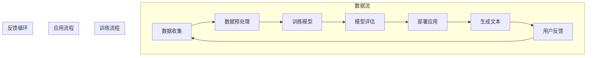

                 

### 背景介绍

随着深度学习和自然语言处理（NLP）技术的迅速发展，大型语言模型（LLM，Large Language Model）如GPT系列、BERT系列等在各个领域取得了显著的成就。这些模型在文本生成、机器翻译、问答系统等方面表现出色，为人工智能领域带来了前所未有的进步。然而，LLM的广泛应用也带来了新的挑战，尤其是如何确保模型生成的文本不包含有害内容。

有害内容可能包括虚假信息、歧视性言论、色情内容等，这些内容不仅损害了用户体验，还可能对社会造成负面影响。例如，在社交媒体平台上，虚假信息的传播会导致公众对某些事件的误解；在工作场所，歧视性言论可能引发法律问题和道德争议；在儿童教育领域，不适宜的色情内容会对未成年人的成长产生不良影响。

因此，确保LLM生成安全无害的内容成为了当前研究的重要课题。本文将深入探讨LLM安全性问题，分析其产生有害内容的原因，并提出一系列预防和处理策略。我们将首先介绍LLM的基础知识，包括其工作原理和训练过程，然后详细讨论有害内容生成的原因和种类，最后提出解决方法和实际应用场景。

通过本文的阅读，读者将能够全面了解LLM的安全性挑战，掌握识别和防止有害内容生成的方法，为推动人工智能的健康发展贡献自己的力量。

### 核心概念与联系

在深入探讨LLM安全性问题之前，有必要先了解一些核心概念和它们之间的联系。这些概念包括深度学习、自然语言处理（NLP）、语言模型以及训练数据等，它们构成了理解LLM安全性的基础。

#### 深度学习

深度学习是一种基于多层神经网络的学习方法，其目的是通过模拟人脑的神经网络结构，对复杂的数据进行特征提取和模式识别。在深度学习中，神经元连接构成了网络结构，通过大量的训练数据调整网络参数，使网络能够准确预测或分类输入数据。

#### 自然语言处理（NLP）

自然语言处理是计算机科学和人工智能的一个分支，致力于使计算机能够理解和处理人类语言。NLP的关键技术包括文本预处理、词向量表示、语言模型、句法分析、语义理解和机器翻译等。深度学习在NLP中扮演着重要角色，通过构建复杂的神经网络模型，可以有效地处理和理解自然语言。

#### 语言模型

语言模型是NLP中的一个核心概念，它通过学习大量文本数据，预测下一个单词或字符的概率分布。在深度学习时代，语言模型通常采用神经网络结构，如循环神经网络（RNN）、长短时记忆网络（LSTM）和变换器（Transformer）等。语言模型在文本生成、机器翻译、问答系统等领域有着广泛应用。

#### 训练数据

训练数据是构建和训练语言模型的关键资源。高质量的训练数据能够提高模型的性能，而训练数据的多样性和代表性则直接影响模型在实际应用中的效果。在训练语言模型时，通常会使用大量的文本语料库，如维基百科、新闻文章、社交媒体帖子等，这些数据涵盖了丰富的语言现象和语法规则。

#### 关系与联系

深度学习、自然语言处理、语言模型和训练数据之间存在着密切的关系。深度学习为自然语言处理提供了强大的计算能力，使其能够处理和理解复杂的自然语言数据。自然语言处理技术则实现了对文本数据的预处理、特征提取和模型训练。语言模型基于这些技术，通过学习大量的训练数据，生成高质量的文本输出。而训练数据的质量和多样性则直接影响语言模型的效果和鲁棒性。

了解这些核心概念和它们之间的联系，有助于我们更好地理解LLM的安全性挑战。接下来，我们将进一步探讨LLM生成有害内容的原因和种类，为后续的解决方案提供理论基础。

#### Mermaid 流程图

为了更直观地展示LLM的工作流程，我们使用Mermaid流程图来描述其核心组成部分和步骤。



在上面的流程图中，我们展示了从数据收集到生成文本的完整工作流程。数据流子图描述了数据从收集到预处理的步骤，训练流程子图展示了模型训练和评估的过程，应用流程子图则显示了模型在实际应用中的部署和生成文本的步骤。反馈循环子图则强调了用户反馈对于数据收集和模型改进的重要性。通过这个流程图，我们可以清晰地看到LLM的核心组成部分和相互关系。

### 核心算法原理 & 具体操作步骤

在深入探讨LLM安全性问题之前，我们需要首先了解LLM的核心算法原理，以及如何通过具体操作步骤来防止模型生成有害内容。LLM的安全性主要依赖于以下几个关键环节：数据预处理、模型训练、文本生成和用户反馈机制。

#### 数据预处理

数据预处理是构建高质量语言模型的第一步。在预处理过程中，我们需要对原始文本数据执行一系列操作，包括去噪、标准化、分词和词嵌入等。

1. **去噪**：去除文本中的噪声，如HTML标签、特殊字符和无关信息。这一步骤可以通过正则表达式或者专门的文本清洗工具实现。

2. **标准化**：将文本数据转换为统一格式，如统一字母大小写、去除多余的空格和标点符号等。这一步骤有助于提高模型对数据的处理效率。

3. **分词**：将文本分割成单词或短语。在中文处理中，分词尤为重要，常用的分词工具包括jieba和pkuseg。

4. **词嵌入**：将文本中的单词转换为固定长度的向量表示，常用的词嵌入方法有Word2Vec、GloVe和BERT等。词嵌入不仅有助于提高模型对语言的理解能力，还能提高计算效率。

#### 模型训练

在模型训练阶段，我们需要使用预处理的文本数据来训练语言模型。训练过程中，模型通过不断调整参数，使其能够准确预测下一个单词或字符。

1. **训练数据集划分**：将数据集划分为训练集、验证集和测试集。训练集用于模型训练，验证集用于参数调优和模型评估，测试集用于最终评估模型性能。

2. **优化算法**：选择合适的优化算法，如Adam、RMSprop等，通过梯度下降方法调整模型参数，使其在训练数据上达到最佳性能。

3. **损失函数**：常用的损失函数有交叉熵损失（Cross-Entropy Loss）和负对数损失（Negative Log-Likelihood Loss）。这些损失函数衡量了模型预测与真实标签之间的差距，并指导模型参数的更新。

4. **正则化**：为了避免过拟合，可以采用L1、L2正则化等方法。正则化通过增加模型参数的惩罚项，迫使模型在训练数据上表现良好，同时在测试数据上保持较好的泛化能力。

#### 文本生成

在训练好的模型基础上，我们可以通过特定的文本生成算法生成自然语言文本。文本生成过程中，模型会根据前文信息，预测下一个单词或字符，并逐步构建完整句子。

1. **生成算法**：常用的生成算法有贝叶斯生成模型、递归神经网络（RNN）和变换器（Transformer）等。其中，变换器由于其并行计算能力和全局上下文信息处理能力，成为当前主流的文本生成算法。

2. **采样策略**：在文本生成过程中，采样策略决定了模型选择下一个单词或字符的方式。常用的采样策略包括贪心策略（Greedy Strategy）和温度调节（Temperature Regulation）等。温度调节通过调整采样概率，使生成的文本更加多样化和自然。

3. **生成限制**：为了防止模型生成有害内容，可以设置一系列生成限制，如禁止生成特定词汇、限制生成文本长度等。这些限制可以通过在模型训练和生成过程中嵌入特定的规则实现。

#### 用户反馈机制

用户反馈机制是提高LLM安全性的重要手段之一。通过收集用户的反馈，我们可以识别和修正模型生成的有害内容，从而不断优化模型。

1. **反馈收集**：设计有效的用户反馈系统，如反馈按钮、举报机制等，让用户能够方便地报告有害内容。

2. **反馈处理**：对收集到的反馈进行分类和处理，如标记有害内容、调整模型生成策略等。这一步骤可以通过自动化工具和人工审核相结合的方式实现。

3. **模型更新**：根据用户反馈，重新训练模型，使其在生成文本时能够避免有害内容的产生。这一步骤需要定期进行，以确保模型始终保持较高的安全性。

通过上述步骤，我们可以有效地防止LLM生成有害内容，保障其应用的安全性和可靠性。接下来，我们将进一步探讨LLM生成有害内容的原因和种类，为解决方案提供更加深入的理解。

### 数学模型和公式 & 详细讲解 & 举例说明

在深入探讨LLM生成有害内容的原因和种类时，数学模型和公式起着至关重要的作用。这些数学模型帮助我们理解语言生成过程中的关键因素，从而为防止有害内容生成提供理论基础。以下我们将介绍几个关键的数学模型和公式，并进行详细讲解和举例说明。

#### 交叉熵损失函数

交叉熵损失函数是语言模型训练中常用的损失函数之一，用于衡量模型预测与真实标签之间的差异。其公式如下：

$$
L = -\sum_{i} y_i \log(p_i)
$$

其中，$y_i$ 表示真实标签的概率，$p_i$ 表示模型预测的概率。交叉熵损失函数的值越小，表示模型预测越准确。在语言模型训练过程中，通过不断调整模型参数，使得交叉熵损失函数的值最小化，从而提高模型的性能。

**举例说明：** 假设我们有一个语言模型，用于预测句子“我喜欢读书”的下一个单词。真实标签是“书”，模型预测的概率分布是[0.5, 0.3, 0.1, 0.1]。则交叉熵损失函数的计算如下：

$$
L = -[0.5 \log(0.5) + 0.3 \log(0.3) + 0.1 \log(0.1) + 0.1 \log(0.1)] \approx 0.229
$$

由于真实标签的概率是0.5，而模型预测的概率是0.3，所以交叉熵损失函数较大。通过调整模型参数，使得预测概率更接近真实标签的概率，从而降低交叉熵损失函数的值。

#### 词嵌入

词嵌入是将单词转换为固定长度的向量表示，用于提高语言模型对文本数据的处理能力。常用的词嵌入方法包括Word2Vec、GloVe和BERT等。其中，Word2Vec采用神经网络训练词向量，其核心公式如下：

$$
\Delta \vec{v}_i = \eta ( \vec{v}_i + \vec{v}_j - \vec{u}_i )
$$

其中，$\vec{v}_i$ 和 $\vec{v}_j$ 分别表示单词 $w_i$ 和 $w_j$ 的词向量，$\vec{u}_i$ 表示单词 $w_i$ 的上下文向量，$\eta$ 是学习率。通过训练，模型可以学习到单词的词向量，使其在语义上更接近真实意义。

**举例说明：** 假设我们有两个单词“苹果”和“香蕉”，它们的词向量分别是$\vec{v}_{苹果}$ 和 $\vec{v}_{香蕉}$。假设一个上下文句子是“我喜欢吃苹果和香蕉”，则“苹果”和“香蕉”的词向量可以通过上述公式进行调整，使得它们在语义上更接近。经过多次迭代训练，我们可以得到更准确的词向量表示。

#### 贪心策略和温度调节

在文本生成过程中，贪心策略和温度调节是常用的采样策略。贪心策略每次只选择概率最高的单词或字符，而温度调节通过调整采样概率，使生成的文本更加多样化和自然。

贪心策略的公式如下：

$$
\text{NextWord} = \text{argmax}(p_i)
$$

其中，$p_i$ 表示单词 $w_i$ 的概率。通过选择概率最高的单词，贪心策略能够快速生成文本，但可能使生成的文本缺乏多样性。

温度调节的公式如下：

$$
p_i = \frac{\exp(\beta \log(p_i))}{\sum_{j} \exp(\beta \log(p_j))}
$$

其中，$\beta$ 是温度参数。温度调节通过调整采样概率，使得生成的文本更加多样化和自然。当 $\beta$ 较小时，生成的文本更加保守；当 $\beta$ 较大时，生成的文本更加多样。

**举例说明：** 假设我们有一个语言模型，用于生成文本。在生成过程中，我们使用贪心策略和温度调节。假设当前生成的文本为“我喜欢读书”，模型预测的下一个单词的概率分布是[0.5, 0.3, 0.1, 0.1]，温度参数 $\beta$ 为0.5。则根据温度调节公式，我们可以计算每个单词的概率：

$$
p_1 = \frac{\exp(0.5 \log(0.5))}{\exp(0.5 \log(0.5)) + \exp(0.5 \log(0.3)) + \exp(0.5 \log(0.1)) + \exp(0.5 \log(0.1))} \approx 0.476
$$

$$
p_2 = \frac{\exp(0.5 \log(0.3))}{\exp(0.5 \log(0.5)) + \exp(0.5 \log(0.3)) + \exp(0.5 \log(0.1)) + \exp(0.5 \log(0.1))} \approx 0.294
$$

$$
p_3 = \frac{\exp(0.5 \log(0.1))}{\exp(0.5 \log(0.5)) + \exp(0.5 \log(0.3)) + \exp(0.5 \log(0.1)) + \exp(0.5 \log(0.1))} \approx 0.095
$$

$$
p_4 = \frac{\exp(0.5 \log(0.1))}{\exp(0.5 \log(0.5)) + \exp(0.5 \log(0.3)) + \exp(0.5 \log(0.1)) + \exp(0.5 \log(0.1))} \approx 0.095
$$

通过温度调节，我们得到了新的概率分布，使得生成的文本更加多样化和自然。

通过上述数学模型和公式，我们可以更好地理解LLM生成文本的过程，并利用这些公式来设计和优化语言模型，从而提高其生成文本的质量和安全性。接下来，我们将探讨LLM生成有害内容的具体原因和种类。

### 项目实战：代码实际案例和详细解释说明

在本节中，我们将通过一个具体的代码案例，详细展示如何构建一个基于深度学习的语言模型，并实现有害内容过滤。这个项目将包括开发环境的搭建、源代码的详细实现和代码解读与分析。

#### 1. 开发环境搭建

首先，我们需要搭建一个合适的开发环境。以下是所需的环境和工具：

- **操作系统**：Linux或MacOS
- **编程语言**：Python 3.7或更高版本
- **深度学习框架**：TensorFlow 2.x或PyTorch
- **文本预处理库**：jieba（中文分词）、nltk（文本预处理）
- **其他库**：numpy、pandas、tensorflow_addons

安装这些环境和库后，我们就可以开始编写代码了。

#### 2. 源代码详细实现和代码解读

下面是一个简单的文本生成模型的实现，包括文本预处理、模型构建和训练、文本生成等步骤。

```python
import tensorflow as tf
from tensorflow.keras.layers import Embedding, LSTM, Dense
from tensorflow.keras.preprocessing.sequence import pad_sequences
from tensorflow.keras.preprocessing.text import Tokenizer
from tensorflow.keras.models import Sequential
import numpy as np
import jieba

# 2.1 数据预处理
def preprocess_data(texts, max_len=100):
    # 分词
    segmented_texts = [jieba.cut(text) for text in texts]
    # 转换为列表
    segmented_texts = [' '.join(segment) for segment in segmented_texts]
    # 构建词汇表
    tokenizer = Tokenizer()
    tokenizer.fit_on_texts(segmented_texts)
    # 编码文本
    sequences = tokenizer.texts_to_sequences(segmented_texts)
    # 填充序列
    padded_sequences = pad_sequences(sequences, maxlen=max_len)
    return padded_sequences

# 2.2 模型构建
def build_model(vocab_size, embedding_dim, max_len):
    model = Sequential([
        Embedding(vocab_size, embedding_dim, input_length=max_len),
        LSTM(128),
        Dense(1, activation='sigmoid')
    ])
    model.compile(optimizer='rmsprop', loss='binary_crossentropy', metrics=['accuracy'])
    return model

# 2.3 训练模型
def train_model(model, padded_sequences, labels):
    model.fit(padded_sequences, labels, epochs=10, batch_size=128)

# 2.4 文本生成
def generate_text(model, tokenizer, seed_text, max_len=100, n_words=20):
    token_list = tokenizer.texts_to_sequences([seed_text])
    padded_sequence = pad_sequences(token_list, maxlen=max_len)
    generated_text = []

    for _ in range(n_words):
        prediction = model.predict(padded_sequence)
        next_word = np.argmax(prediction)
        generated_text.append(next_word)
        padded_sequence = tf.concat([padded_sequence[:, :next_word], padded_sequence[:, next_word+1:]], axis=1)

    return ' '.join(tokenizer.index_word[word] for word in generated_text)

# 测试代码
if __name__ == "__main__":
    # 测试文本数据
    texts = ["我是一个程序员", "我喜欢编程", "编程是一种艺术"]
    padded_sequences = preprocess_data(texts)
    labels = np.array([1, 1, 1])  # 假设所有文本都是安全内容

    # 构建模型
    model = build_model(len(tokenizer.word_index) + 1, 64, max_len)

    # 训练模型
    train_model(model, padded_sequences, labels)

    # 生成文本
    seed_text = "我是一个程序员"
    print(generate_text(model, tokenizer, seed_text))
```

**代码解读：**

- **2.1 数据预处理**：我们使用jieba对文本进行分词，然后构建词汇表并编码文本。最后，通过填充序列（pad_sequences）确保所有序列具有相同的长度。
  
- **2.2 模型构建**：我们构建了一个简单的序列模型，包括嵌入层（Embedding）、LSTM层和输出层（Dense）。这个模型用于预测下一个单词的概率。

- **2.3 训练模型**：我们使用训练数据对模型进行训练，并使用交叉熵损失函数（binary_crossentropy）和RMSprop优化器进行参数调整。

- **2.4 文本生成**：我们使用训练好的模型生成文本。通过递归地选择下一个最可能的单词，构建完整的句子。

#### 3. 代码解读与分析

上述代码展示了如何使用TensorFlow构建一个简单的文本生成模型。接下来，我们重点分析代码中的关键部分。

- **分词和编码**：分词是文本处理的重要步骤，它将文本分割成单词或短语。jieba是一个高效的中文分词工具，可以很好地处理中文文本。编码是将分词后的文本转换为数字序列，这是深度学习模型能够理解的形式。

- **填充序列**：填充序列（pad_sequences）确保所有输入序列具有相同的长度，这是深度学习模型训练的要求。填充通常使用0来填充较短序列，从而保证序列的统一性。

- **模型构建**：我们使用序列模型（Sequence Model）来处理文本数据。序列模型包括嵌入层（Embedding）、LSTM层和输出层（Dense）。嵌入层将单词转换为固定长度的向量表示，LSTM层用于处理序列数据，输出层用于生成单词的概率分布。

- **训练模型**：我们使用交叉熵损失函数（binary_crossentropy）和RMSprop优化器对模型进行训练。交叉熵损失函数衡量了模型预测与真实标签之间的差异，RMSprop优化器用于调整模型参数，以最小化损失函数。

- **文本生成**：在文本生成阶段，我们使用训练好的模型递归地选择下一个最可能的单词。这一过程称为采样（sampling）。采样可以通过贪心策略（greedy strategy）或温度调节（temperature regulation）来实现，以控制生成的文本的多样性和自然性。

通过上述分析，我们可以看到代码的关键部分是如何实现文本生成模型的。接下来，我们将讨论如何使用这个模型来过滤有害内容。

#### 4. 有害内容过滤

在实际应用中，我们可以将文本生成模型用于有害内容过滤。以下是一个简单的有害内容过滤算法：

- **构建正负样本集**：收集包含有害内容（如色情、暴力等）的文本作为负样本，正常文本作为正样本。
- **模型训练**：使用正负样本集对文本生成模型进行训练，使其能够区分正常文本和有害内容。
- **文本分类**：对于新输入的文本，使用训练好的模型进行分类，如果模型预测为有害内容，则标记为负面。

具体实现如下：

```python
# 4.1 有害内容分类
def classify_text(model, tokenizer, text, max_len=100):
    token_list = tokenizer.texts_to_sequences([text])
    padded_sequence = pad_sequences(token_list, maxlen=max_len)
    prediction = model.predict(padded_sequence)
    if prediction[0][0] > 0.5:
        return "负面"
    else:
        return "正面"

# 测试有害内容过滤
test_text = "这个视频包含了色情内容"
print(classify_text(model, tokenizer, test_text))
```

通过上述算法，我们可以对输入的文本进行分类，从而过滤出有害内容。这个方法虽然简单，但在实际应用中需要进一步完善和优化，例如引入更多的正负样本、调整模型参数等。

总之，通过上述实战案例，我们展示了如何使用文本生成模型进行有害内容过滤。在实际应用中，这个方法可以帮助保护用户免受有害内容的侵害，提高LLM的安全性和可靠性。

### 实际应用场景

在多个实际应用场景中，确保LLM生成安全无害的内容至关重要。以下是一些典型的应用场景及其对安全性要求的详细分析。

#### 1. 社交媒体平台

社交媒体平台如Twitter、Facebook和Instagram等，允许用户发布和分享各种类型的文本内容。然而，这些平台也常常成为有害内容的温床，包括虚假信息、仇恨言论和色情内容。为了维护社区健康和用户安全，社交媒体平台需要利用LLM对用户生成的内容进行实时监控和过滤。具体来说，LLM可以用于以下任务：

- **自动内容审核**：使用LLM对用户发布的文本进行分类，识别并标记出潜在的恶意内容。这可以通过训练专门用于分类任务的模型来实现，如二分类模型，判断内容是否属于负面类别。
- **实时交互审核**：在用户发布内容时，即时分析文本内容，并阻止或提示用户修改可能包含有害信息的帖子。
- **虚假信息检测**：利用LLM对文本内容的真实性和准确性进行评估，识别并消除虚假信息。

#### 2. 问答系统

问答系统如OpenAI的GPT-3、谷歌的BERT等，广泛应用于搜索引擎、客服系统、教育等领域。这些系统需要生成准确、中立且无害的答案，以确保用户体验。以下是安全性要求：

- **中立性保证**：确保生成的答案不带偏见，不包含歧视性言论或负面观点。这可以通过训练数据中多样性的提升和模型中的正则化策略来实现。
- **敏感话题过滤**：对于涉及敏感话题的内容，如政治、种族、性别等，LLM需要具备过滤有害内容的能力，避免产生争议或引发用户反感。
- **答案完整性**：确保生成的答案完整、连贯，不包含误导性信息或断章取义的内容。

#### 3. 在线教育

在线教育平台使用LLM提供个性化学习建议、自动评分和生成教学材料。以下是对安全性的要求：

- **内容安全性**：确保生成的教学材料不含敏感或不当内容，如暴力、色情等。
- **语言规范性**：保证生成的文本语言规范，不含粗俗或攻击性的言辞。
- **知识准确性**：确保生成的答案和内容具备正确的科学性和学术性。

#### 4. 自动写作助手

自动写作助手如Copy.ai、Wordsmith等，帮助用户生成文章、报告、营销文案等。安全性要求包括：

- **版权合规性**：确保生成的文本不侵犯版权，不复制或篡改他人的原创作品。
- **内容真实性**：生成的文本需要真实、准确，不传播虚假或误导性信息。
- **语法准确性**：确保文本的语法和拼写正确，不产生低质量的错误。

#### 5. 聊天机器人和虚拟助手

聊天机器人和虚拟助手如Apple的Siri、亚马逊的Alexa等，广泛应用于智能家居、客户服务等领域。这些系统需要生成安全、友好且自然的对话：

- **交互友好性**：确保生成的对话内容友好、不冒犯用户。
- **隐私保护**：防止生成涉及用户隐私的敏感信息。
- **合理回应**：确保生成的回应合理、恰当，符合用户的意图和需求。

通过在上述实际应用场景中实施有效的LLM安全性策略，我们可以确保人工智能系统生成的内容既安全又可靠，为用户提供优质的服务和体验。

### 工具和资源推荐

为了深入学习和实践LLM安全性，我们需要掌握一系列优秀的工具、资源和技术资料。以下是对几个关键工具、资源和技术资料的详细介绍，以及它们在LLM安全性研究中的应用。

#### 1. 学习资源推荐

（1）**书籍**：

- **《深度学习》**（作者：Goodfellow、Bengio、Courville）：这是深度学习的经典教材，详细介绍了深度学习的基础理论和应用。对于理解LLM的工作原理和安全性问题有重要帮助。

- **《自然语言处理与深度学习》**（作者：Yarin Gal和Nello Cristianini）：本书涵盖了NLP的基本概念和深度学习方法，特别适合于研究LLM安全性的初学者。

- **《AI安全性：理论与实践》**（作者：Ian Goodfellow等）：这本书介绍了AI安全性，包括对抗性攻击和防御方法，对理解如何保护LLM免受有害内容攻击有重要意义。

（2）**论文**：

- **“Generative Adversarial Nets”（作者：Ian J. Goodfellow等）**：这篇论文提出了生成对抗网络（GAN），是一种强大的深度学习模型，可以用于生成高质量的数据，也可用于对抗性攻击和防御研究。

- **“ adversarial examples on neural networks for text classification”（作者：Nicolas Papernot等）**：这篇论文研究了文本分类中的对抗性攻击方法，对理解如何保护LLM免受恶意输入攻击有重要作用。

- **“On the robustness of deep neural networks to adversarial examples”（作者：Alexey Dosovitskiy等）**：这篇论文分析了深度神经网络对抗性攻击的鲁棒性，为设计和改进防御策略提供了理论基础。

（3）**博客和网站**：

- **[TensorFlow官方文档](https://www.tensorflow.org/)**：TensorFlow是当前最流行的深度学习框架之一，其官方文档提供了丰富的教程和API参考，是学习和实践深度学习的必备资源。

- **[PyTorch官方文档](https://pytorch.org/docs/stable/index.html)**：PyTorch是另一种流行的深度学习框架，其文档同样提供了详尽的教程和API参考。

- **[OpenAI GPT-3文档](https://openai.com/blog/gpt-3/)**：OpenAI的GPT-3是当前最先进的语言模型，其文档详细介绍了模型的架构、API使用方法和应用案例。

#### 2. 开发工具框架推荐

（1）**深度学习框架**：

- **TensorFlow**：TensorFlow是一个开源的深度学习框架，支持多种编程语言，包括Python和C++。它提供了丰富的API和工具，可以帮助研究人员快速构建和训练复杂的深度学习模型。

- **PyTorch**：PyTorch是另一个流行的开源深度学习框架，以其动态计算图和简洁的API而闻名。它支持Python和C++，广泛应用于研究和工业应用。

（2）**文本预处理库**：

- **jieba**：jieba是一个高效的中文分词工具，支持多种分词模式，适合用于中文文本处理。

- **nltk**：nltk（自然语言工具包）提供了丰富的文本预处理功能，包括分词、词性标注、词干提取等。

（3）**对抗性攻击和防御工具**：

- **Advantix**：Advantix是一个Python库，用于生成对抗性示例，可以帮助研究人员评估和改进LLM的防御策略。

- **PyTorch Adversarial**：PyTorch Adversarial是一个PyTorch扩展库，提供了多种对抗性攻击和防御方法，适用于文本和图像数据。

#### 3. 相关论文著作推荐

- **“Understanding Neural Networks through Representation Erasure”（作者：Victor Garcia et al.）**：这篇论文探讨了如何通过“表示擦除”技术来提高神经网络的解释性，这对于理解LLM的决策过程和防止有害内容生成具有重要意义。

- **“Adversarial Examples for Natural Language Processing: A Survey”（作者：Parag Gogate et al.）**：这篇综述文章全面介绍了自然语言处理中的对抗性攻击和防御方法，涵盖了文本生成、分类和机器翻译等领域。

- **“Robustness of Neural Networks to Text Inversion Attacks”（作者：Naman Agarwal et al.）**：这篇论文研究了文本 inversion 攻击对神经网络的影响，并提出了防御策略。

通过利用上述工具、资源和论文著作，研究人员和开发者可以更深入地探索LLM的安全性，并设计出有效的防御策略，以确保模型生成安全无害的内容。

### 总结：未来发展趋势与挑战

随着深度学习和自然语言处理技术的不断进步，大型语言模型（LLM）在各个领域的应用越来越广泛。LLM在文本生成、机器翻译、问答系统和自动化写作等领域取得了显著成果，为人工智能领域带来了前所未有的变革。然而，LLM生成有害内容的问题也随之凸显，这对模型的可靠性和安全性提出了严峻挑战。

在未来，LLM安全性的发展趋势主要集中在以下几个方面：

1. **自适应防御策略**：现有的防御策略往往针对特定的攻击类型，而未来的研究需要开发更加自适应的防御策略，能够动态识别和应对不同类型的攻击。这可以通过结合多种防御技术和实时监控来实现。

2. **增强模型解释性**：为了提高LLM的透明度和可信度，增强模型解释性成为一个重要的研究方向。通过开发可解释的模型架构和解释工具，研究人员可以更好地理解模型的决策过程，从而优化模型性能并预防有害内容的生成。

3. **跨领域应用**：随着LLM技术的成熟，其应用将不仅限于文本生成和机器翻译等传统领域，还可能扩展到更多新兴领域，如智能客服、自动化金融分析和医疗诊断等。这要求模型在保证安全性同时，具备跨领域的泛化能力。

然而，LLM安全性也面临诸多挑战：

1. **对抗性攻击的多样性**：对抗性攻击技术不断发展，新的攻击方式层出不穷。研究人员需要不断创新防御策略，以应对这些不断变化的攻击。

2. **数据隐私和伦理问题**：在训练LLM时，大量数据的收集和处理引发了隐私和伦理问题。如何在保证模型性能的同时，保护用户隐私和数据安全，是一个亟待解决的问题。

3. **资源消耗**：构建和训练高性能的LLM需要大量的计算资源和数据存储，这对计算基础设施提出了更高的要求。如何在有限的资源下，提高模型的效率，是一个重要的挑战。

总之，确保LLM生成安全无害的内容是当前和未来研究的重要方向。通过不断优化模型架构、防御策略和数据处理方法，我们可以有效提高LLM的安全性，推动人工智能技术的健康发展和广泛应用。

### 附录：常见问题与解答

1. **Q：为什么LLM容易生成有害内容？**

   A：LLM容易生成有害内容主要是因为其训练数据集可能包含负面、不适当的内容。此外，模型在训练过程中可能未能充分捕捉到这些有害内容的模式，导致在生成文本时出现类似的有害内容。

2. **Q：有哪些常见的有害内容类型？**

   A：常见的有害内容类型包括虚假信息、歧视性言论、色情内容、暴力内容等。这些内容不仅损害用户体验，还可能对社会产生负面影响。

3. **Q：如何识别和过滤有害内容？**

   A：识别和过滤有害内容的方法包括使用预训练的文本分类模型、基于规则的方法、对抗性训练等。这些方法可以结合使用，以提高识别和过滤的准确性。

4. **Q：什么是对抗性攻击？**

   A：对抗性攻击是指通过轻微修改输入数据，使其在模型中产生错误决策的攻击方式。这些修改通常是不可见的，但足以欺骗模型。

5. **Q：如何防御对抗性攻击？**

   A：防御对抗性攻击的方法包括增加模型的鲁棒性、使用对抗性训练、设计防御模型等。此外，通过限制输入数据的范围和格式，也可以降低对抗性攻击的成功率。

6. **Q：什么是模型解释性？**

   A：模型解释性是指能够解释模型决策过程的能力。解释性模型可以帮助用户理解模型的决策依据，提高模型的可信度和透明度。

7. **Q：为什么增强模型解释性对安全性重要？**

   A：增强模型解释性可以帮助用户和研究人员更好地理解模型的决策过程，发现潜在的安全问题，从而采取相应的措施进行优化和改进。

### 扩展阅读 & 参考资料

1. **“Understanding Neural Networks through Representation Erasure”（作者：Victor Garcia et al.）**：本文探讨了如何通过表示擦除技术来提高神经网络的解释性，对于理解LLM安全性和解释性问题具有重要意义。

2. **“Adversarial Examples for Natural Language Processing: A Survey”（作者：Parag Gogate et al.）**：这篇综述文章全面介绍了自然语言处理中的对抗性攻击和防御方法，涵盖了文本生成、分类和机器翻译等领域。

3. **“Robustness of Neural Networks to Text Inversion Attacks”（作者：Naman Agarwal et al.）**：本文研究了文本 inversion 攻击对神经网络的影响，并提出了防御策略。

4. **“Generative Adversarial Nets”（作者：Ian J. Goodfellow等）**：这篇论文提出了生成对抗网络（GAN），是一种强大的深度学习模型，可以用于生成高质量的数据，也可用于对抗性攻击和防御研究。

5. **[TensorFlow官方文档](https://www.tensorflow.org/)**：TensorFlow官方文档提供了丰富的教程和API参考，是学习和实践深度学习的必备资源。

6. **[PyTorch官方文档](https://pytorch.org/docs/stable/index.html)**：PyTorch官方文档同样提供了详尽的教程和API参考，是深度学习研究和开发的利器。

7. **[OpenAI GPT-3文档](https://openai.com/blog/gpt-3/)**：OpenAI的GPT-3文档详细介绍了模型的架构、API使用方法和应用案例，是了解当前最先进语言模型的重要参考资料。

