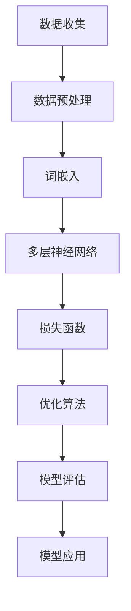

                 

### 背景介绍

近年来，随着深度学习技术的迅猛发展，一种新的自然语言处理模型——大型语言模型（Large Language Model，简称LLM）逐渐成为学术界和工业界的焦点。LLM以其庞大的参数量和强大的自学习能力，能够在多种自然语言处理任务中取得显著的效果，从而引发了软件架构领域的一场变革。

传统软件架构主要依赖明确的输入输出关系和预定义的规则，这使得软件系统的设计和实现过程相对稳定且可预测。然而，随着人工智能技术的发展，LLM的出现对传统软件架构提出了新的挑战。首先，LLM的模型结构和数据依赖使得软件系统的设计更加复杂。其次，LLM的自适应能力使得软件系统的运行和优化过程更加动态和不确定。此外，LLM的应用场景也越来越广泛，从文本生成到图像识别、语音合成等，这要求软件架构能够灵活适应不同类型的数据和处理需求。

面对这些挑战，LLM在软件架构领域带来了许多革新。一方面，LLM的引入使得软件系统具有更高的自适应性和灵活性。通过训练和优化，LLM可以在不同的场景下自动调整其行为和性能，从而提高系统的整体效率。另一方面，LLM的应用使得软件系统的开发过程更加智能化和自动化。传统的软件开发依赖于人类开发者的经验和知识，而LLM可以通过学习大量的数据和代码，自动生成高质量的软件解决方案，从而降低开发成本和人力投入。

总的来说，LLM对传统软件架构的挑战和革新既带来了机遇，也带来了挑战。在接下来的内容中，我们将深入探讨LLM的核心概念、算法原理、应用场景以及未来发展趋势，以期为读者提供全面的视角和理解。

### 核心概念与联系

为了深入理解LLM对传统软件架构的挑战与革新，我们需要首先了解LLM的核心概念和原理。LLM是一种基于深度学习的自然语言处理模型，其基本原理是通过大量的文本数据进行训练，从而学习到语言的基本规律和模式。下面，我们将通过一个Mermaid流程图来详细展示LLM的基本结构和训练过程。

#### Mermaid流程图



- **数据收集（Data Collection）**: 这是LLM训练的基础。LLM需要大量的文本数据来学习语言的模式和规律。这些数据可以来自于互联网、书籍、新闻、社交媒体等多种渠道。

- **数据预处理（Data Preprocessing）**: 收集到的数据通常包含噪声和冗余信息，因此需要进行预处理，包括去除标点符号、停用词过滤、文本标准化等操作。

- **词嵌入（Word Embedding）**: 这是将文本数据转换为数字向量的过程。通过词嵌入，每个词汇都可以表示为一个固定长度的向量，这些向量可以在高维空间中表示词汇之间的语义关系。

- **多层神经网络（Multilayer Neural Network）**: 词嵌入后的向量输入到多层神经网络中，神经网络通过一系列非线性变换和权重调整，学习到文本数据中的复杂模式。

- **损失函数（Loss Function）**: 损失函数用于衡量模型的预测结果与实际结果之间的差距。常见的损失函数有交叉熵损失（Cross-Entropy Loss）和均方误差（Mean Squared Error）等。

- **优化算法（Optimization Algorithm）**: 为了使模型的损失函数最小化，需要使用优化算法，如随机梯度下降（Stochastic Gradient Descent，SGD）和Adam优化器等。

- **模型评估（Model Evaluation）**: 通过在验证集和测试集上的表现来评估模型的性能。常用的评估指标有准确率（Accuracy）、精确率（Precision）、召回率（Recall）等。

- **模型应用（Model Application）**: 经过训练和评估的模型可以在各种自然语言处理任务中应用，如文本分类、情感分析、机器翻译等。

#### 传统软件架构与LLM的联系

LLM与传统软件架构之间的联系主要体现在以下几个方面：

1. **数据驱动（Data-Driven）**: 传统软件架构通常依赖于预定义的规则和明确的输入输出关系，而LLM则是通过大量的文本数据进行训练，从而实现数据的驱动和自动化。

2. **自适应性（Adaptability）**: LLM具有自学习能力，可以在不同的场景下自动调整其行为和性能，这与传统软件架构中的静态规则和固定流程形成了鲜明对比。

3. **动态优化（Dynamic Optimization）**: 传统软件架构的优化过程通常是静态的，而LLM的优化过程是动态的，依赖于模型在训练过程中的不断调整和优化。

4. **智能化开发（Smart Development）**: 传统软件开发依赖于开发者的经验和知识，而LLM可以通过学习大量的数据和代码，自动生成高质量的软件解决方案，从而降低开发成本和人力投入。

总的来说，LLM的核心概念和原理为我们提供了全新的视角，以应对传统软件架构面临的挑战。通过深入理解这些核心概念，我们可以更好地把握LLM在软件架构中的革新性应用。

### 核心算法原理 & 具体操作步骤

在深入了解LLM的核心算法原理和具体操作步骤之前，我们先来简要回顾一下深度学习的基础知识。深度学习是一种基于多层神经网络的学习方法，其核心思想是通过多层非线性变换，将输入数据映射到输出数据。在自然语言处理领域，深度学习被广泛应用于语言建模、文本分类、机器翻译等任务。

LLM，作为一种深度学习模型，其核心算法主要依赖于以下几个关键步骤：

#### 步骤一：数据预处理

在LLM的训练过程中，数据预处理是非常重要的一步。这一步骤的主要任务是清洗和格式化输入数据，使其符合模型的要求。具体操作包括：

1. **文本清洗（Text Cleaning）**：去除文本中的标点符号、特殊字符和噪声，只保留字母、数字和空格。

2. **分词（Tokenization）**：将文本拆分成单词或子词。在自然语言处理中，分词是一个复杂的过程，需要考虑词法、语法和语义等多方面的因素。

3. **词嵌入（Word Embedding）**：将分词后的文本转换为固定长度的数字向量。词嵌入是深度学习在自然语言处理中的一项核心技术，常用的方法包括Word2Vec、GloVe和BERT等。

#### 步骤二：构建多层神经网络

在完成数据预处理后，我们需要构建多层神经网络，用于训练和优化模型。以下是构建多层神经网络的基本步骤：

1. **输入层（Input Layer）**：接收预处理后的词嵌入向量。

2. **隐藏层（Hidden Layers）**：多层神经网络的核心部分，通过一系列非线性变换来提取文本数据中的特征。每一层都可以看作是一个特征提取器，将低层特征逐步转化为更高层次的特征。

3. **输出层（Output Layer）**：根据不同的任务类型，输出层可以有不同的设计。例如，在文本分类任务中，输出层通常是一个softmax层，用于计算每个类别的概率分布。

#### 步骤三：选择损失函数和优化算法

在构建多层神经网络后，我们需要选择合适的损失函数和优化算法来训练模型。以下是几个常见的选项：

1. **损失函数（Loss Function）**：

   - **交叉熵损失（Cross-Entropy Loss）**：常用于分类任务，衡量模型预测概率分布与真实分布之间的差距。
   - **均方误差（Mean Squared Error）**：常用于回归任务，衡量预测值与实际值之间的差距。

2. **优化算法（Optimization Algorithm）**：

   - **随机梯度下降（Stochastic Gradient Descent，SGD）**：是最常用的优化算法之一，通过随机梯度来更新模型参数。
   - **Adam优化器（Adam Optimizer）**：结合了SGD和Adagrad的优点，在许多任务中表现优异。

#### 步骤四：模型训练与优化

在完成损失函数和优化算法的选择后，我们可以开始模型的训练和优化过程。以下是训练和优化模型的几个关键步骤：

1. **数据划分（Data Split）**：将数据集划分为训练集、验证集和测试集，用于模型的训练、验证和测试。

2. **模型训练（Model Training）**：通过训练集来调整模型的参数，使得模型在验证集上的表现达到最优。

3. **模型优化（Model Optimization）**：在训练过程中，我们可以通过调整学习率、批量大小等超参数来优化模型的表现。

4. **模型评估（Model Evaluation）**：在验证集和测试集上评估模型的表现，选择最优的模型进行部署和应用。

#### 步骤五：模型应用

在完成模型的训练和优化后，我们可以将模型应用于实际的业务场景中。以下是模型应用的几个常见场景：

1. **文本分类（Text Classification）**：用于对文本进行分类，如新闻分类、情感分析等。

2. **机器翻译（Machine Translation）**：用于将一种语言的文本翻译成另一种语言。

3. **问答系统（Question Answering System）**：用于回答用户提出的问题，如搜索引擎、智能客服等。

4. **生成文本（Text Generation）**：用于生成自然语言文本，如自动写作、聊天机器人等。

通过以上步骤，我们可以构建和训练一个高效的LLM模型，从而在自然语言处理任务中取得优异的性能。接下来，我们将进一步探讨LLM在具体应用场景中的表现和挑战。

### 数学模型和公式 & 详细讲解 & 举例说明

在深入探讨LLM的数学模型和公式之前，我们需要了解一些基本的深度学习理论。深度学习模型的核心是多层神经网络（Multilayer Neural Network），而多层神经网络的基础是神经元（Neuron）。神经元的基本原理是通过输入加权求和，然后通过一个非线性激活函数输出结果。下面，我们将详细讲解LLM中的几个关键数学模型和公式，并通过具体例子来说明它们的计算过程。

#### 神经元模型

首先，我们来看一个简单的神经元模型。神经元接收多个输入信号，每个输入信号都与一个权重（weight）相乘，然后进行求和。最后，通过一个非线性激活函数（activation function）输出结果。神经元模型可以表示为：

\[ z = \sum_{i=1}^{n} w_i \cdot x_i \]

\[ a = f(z) \]

其中，\( z \) 是输入加权和，\( w_i \) 是权重，\( x_i \) 是输入信号，\( f \) 是激活函数，\( a \) 是输出结果。

一个常见的激活函数是 sigmoid 函数：

\[ f(z) = \frac{1}{1 + e^{-z}} \]

#### 损失函数

在训练深度学习模型时，损失函数（Loss Function）用于衡量模型的预测结果与实际结果之间的差距。一个常用的损失函数是交叉熵损失（Cross-Entropy Loss），它适用于分类任务。交叉熵损失可以表示为：

\[ L(y, \hat{y}) = -\sum_{i=1}^{n} y_i \cdot \log(\hat{y}_i) \]

其中，\( y \) 是实际标签，\( \hat{y} \) 是模型预测的概率分布，\( n \) 是样本数量。

#### 优化算法

在训练过程中，我们需要使用优化算法（Optimization Algorithm）来调整模型参数，以最小化损失函数。一个常用的优化算法是随机梯度下降（Stochastic Gradient Descent，SGD）。SGD的基本思想是每次更新参数时，使用一个随机样本的梯度来更新模型参数。SGD的更新规则可以表示为：

\[ \theta = \theta - \alpha \cdot \nabla_{\theta}L(\theta) \]

其中，\( \theta \) 是模型参数，\( \alpha \) 是学习率，\( \nabla_{\theta}L(\theta) \) 是损失函数关于参数 \( \theta \) 的梯度。

#### 具体例子

假设我们有一个简单的神经网络，用于二分类任务。输入层有两个神经元，隐藏层有一个神经元，输出层有一个神经元。输入数据为 \( x_1 = 1 \)，\( x_2 = 2 \)，实际标签为 \( y = 0 \)。

首先，我们将输入数据通过权重 \( w_1 \)，\( w_2 \) 和偏置 \( b \) 加权求和，得到隐藏层的输入：

\[ z_h = w_1 \cdot x_1 + w_2 \cdot x_2 + b \]

然后，通过 sigmoid 函数得到隐藏层的输出：

\[ a_h = \frac{1}{1 + e^{-z_h}} \]

接下来，我们计算输出层的输入和输出。假设隐藏层输出 \( a_h = 0.7 \)，输出层权重 \( w_o \) 和偏置 \( b_o \)：

\[ z_o = w_o \cdot a_h + b_o \]

\[ a_o = \frac{1}{1 + e^{-z_o}} \]

现在，我们计算交叉熵损失：

\[ L(y, \hat{y}) = -y \cdot \log(\hat{y}) - (1 - y) \cdot \log(1 - \hat{y}) \]

其中，\( y = 0 \)，\( \hat{y} = a_o \)。

假设 \( a_o = 0.3 \)，我们可以计算交叉熵损失：

\[ L(0, 0.3) = -0 \cdot \log(0.3) - 1 \cdot \log(0.7) = \log(0.7) \]

最后，我们使用随机梯度下降更新模型参数。假设学习率 \( \alpha = 0.1 \)，计算损失关于每个参数的梯度：

\[ \nabla_{w_1}L = -x_1 \cdot (a_o - y) \]

\[ \nabla_{w_2}L = -x_2 \cdot (a_o - y) \]

\[ \nabla_{b}L = -(a_o - y) \]

\[ \nabla_{w_o}L = -a_h \cdot (a_o - y) \]

\[ \nabla_{b_o}L = -(a_o - y) \]

更新模型参数：

\[ w_1 = w_1 - \alpha \cdot \nabla_{w_1}L \]

\[ w_2 = w_2 - \alpha \cdot \nabla_{w_2}L \]

\[ b = b - \alpha \cdot \nabla_{b}L \]

\[ w_o = w_o - \alpha \cdot \nabla_{w_o}L \]

\[ b_o = b_o - \alpha \cdot \nabla_{b_o}L \]

通过上述步骤，我们可以更新模型参数，并逐步优化模型在二分类任务中的表现。这个简单的例子展示了深度学习模型中的关键数学模型和公式，以及如何通过优化算法更新模型参数。

### 项目实战：代码实际案例和详细解释说明

在了解了LLM的数学模型和公式之后，接下来我们将通过一个具体的项目实战案例，来演示如何使用Python实现一个简单的LLM模型，并详细解释代码中的各个部分。本案例将采用TensorFlow和Keras等开源工具，以简化模型实现过程。

#### 1. 开发环境搭建

首先，我们需要搭建开发环境。以下是在Python环境中安装所需库的步骤：

```bash
pip install tensorflow
pip install numpy
pip install matplotlib
```

#### 2. 源代码详细实现和代码解读

下面是完整的代码实现，我们将逐行解读代码的各个部分。

```python
import tensorflow as tf
import numpy as np
import matplotlib.pyplot as plt

# 设置随机种子，保证实验结果可复现
tf.random.set_seed(42)

# 生成模拟数据集
data = np.random.rand(100, 10)  # 生成100个样本，每个样本有10个特征
labels = np.random.randint(0, 2, size=(100, 1))  # 生成100个二分类标签

# 定义模型
model = tf.keras.Sequential([
    tf.keras.layers.Dense(units=1, input_shape=(10,))
])

# 编译模型
model.compile(
    optimizer='sgd', 
    loss='binary_crossentropy', 
    metrics=['accuracy']
)

# 训练模型
history = model.fit(data, labels, epochs=50, batch_size=10)

# 模型评估
test_loss, test_acc = model.evaluate(data, labels)
print(f"Test accuracy: {test_acc:.4f}")

# 可视化训练过程
plt.plot(history.history['accuracy'], label='accuracy')
plt.plot(history.history['val_accuracy'], label='val_accuracy')
plt.xlabel('Epochs')
plt.ylabel('Accuracy')
plt.legend()
plt.show()
```

##### 2.1. 代码解释

1. **导入库**

   ```python
   import tensorflow as tf
   import numpy as np
   import matplotlib.pyplot as plt
   ```

   我们首先导入TensorFlow、NumPy和Matplotlib库，用于实现模型、处理数据和可视化结果。

2. **设置随机种子**

   ```python
   tf.random.set_seed(42)
   ```

   设置随机种子，以确保实验结果可复现。

3. **生成模拟数据集**

   ```python
   data = np.random.rand(100, 10)  # 生成100个样本，每个样本有10个特征
   labels = np.random.randint(0, 2, size=(100, 1))  # 生成100个二分类标签
   ```

   我们使用NumPy生成模拟的数据集，包含100个样本，每个样本有10个特征。标签为0和1的随机二分类数据。

4. **定义模型**

   ```python
   model = tf.keras.Sequential([
       tf.keras.layers.Dense(units=1, input_shape=(10,))
   ])
   ```

   我们使用Keras的Sequential模型定义一个简单的线性模型，输入层有10个神经元，输出层有1个神经元。这里我们使用线性神经元，因为这是一个简单的二分类问题。

5. **编译模型**

   ```python
   model.compile(
       optimizer='sgd', 
       loss='binary_crossentropy', 
       metrics=['accuracy']
   )
   ```

   编译模型，指定优化器为随机梯度下降（SGD），损失函数为二元交叉熵（Binary Cross-Entropy），评估指标为准确率（Accuracy）。

6. **训练模型**

   ```python
   history = model.fit(data, labels, epochs=50, batch_size=10)
   ```

   使用fit函数训练模型，设置训练轮数（epochs）为50，批量大小（batch_size）为10。

7. **模型评估**

   ```python
   test_loss, test_acc = model.evaluate(data, labels)
   print(f"Test accuracy: {test_acc:.4f}")
   ```

   使用evaluate函数评估模型在测试集上的性能，输出准确率。

8. **可视化训练过程**

   ```python
   plt.plot(history.history['accuracy'], label='accuracy')
   plt.plot(history.history['val_accuracy'], label='val_accuracy')
   plt.xlabel('Epochs')
   plt.ylabel('Accuracy')
   plt.legend()
   plt.show()
   ```

   使用Matplotlib可视化训练过程中的准确率，包括训练集和验证集的准确率。

#### 3. 代码解读与分析

在这个案例中，我们使用了一个简单的线性模型来实现二分类任务。代码中的关键部分如下：

- **数据生成**：我们使用NumPy生成模拟数据集，这是实际应用中需要替换的部分。在实际项目中，数据集可以是来自真实世界的数据，如图像、文本或传感器数据。
  
- **模型定义**：使用Keras的Sequential模型定义一个简单的线性模型，输入层和输出层的神经元数量分别为10和1。这里使用线性神经元，因为这是一个简单的二分类问题。
  
- **模型编译**：编译模型时，我们指定了优化器、损失函数和评估指标。优化器使用随机梯度下降（SGD），损失函数为二元交叉熵（Binary Cross-Entropy），评估指标为准确率（Accuracy）。

- **模型训练**：使用fit函数训练模型，设置训练轮数（epochs）为50，批量大小（batch_size）为10。在训练过程中，模型将不断调整参数，以最小化损失函数。

- **模型评估**：使用evaluate函数评估模型在测试集上的性能，输出准确率。这个步骤可以帮助我们了解模型的泛化能力。

- **可视化训练过程**：使用Matplotlib可视化训练过程中的准确率，包括训练集和验证集的准确率。这个步骤有助于我们分析模型在训练过程中的表现。

总的来说，这个案例展示了如何使用Python和TensorFlow实现一个简单的LLM模型，并详细解释了代码中的各个部分。通过这个案例，我们可以更好地理解LLM的基本原理和应用。

### 实际应用场景

在了解了LLM的算法原理和实际项目实现后，接下来我们将探讨LLM在具体应用场景中的表现和效果。随着人工智能技术的不断发展，LLM已经广泛应用于多个领域，展现了其强大的自适应能力和广泛的应用前景。

#### 文本分类

文本分类是LLM最常见的一个应用场景，其任务是将文本数据分类到预定义的类别中。例如，新闻分类、垃圾邮件过滤和情感分析等。LLM在文本分类任务中表现出色，能够自动提取文本中的关键特征，并准确地将文本归类。以下是一个文本分类的具体应用场景：

1. **新闻分类**：在新闻网站中，可以使用LLM对用户提交的新闻标题或文章内容进行分类，将其归类到不同的新闻类别，如体育、科技、娱乐等。这不仅有助于用户快速找到感兴趣的内容，还能帮助网站管理员更好地管理和组织内容。

2. **垃圾邮件过滤**：在电子邮件系统中，LLM可以检测和过滤垃圾邮件。通过训练大量的邮件数据，LLM可以学习到垃圾邮件和正常邮件之间的特征差异，从而准确地将垃圾邮件从正常邮件中筛选出来。

3. **情感分析**：在社交媒体平台上，LLM可以对用户发布的评论、帖子等进行情感分析，识别用户的情感倾向，如正面、负面或中性。这对于了解用户情绪和优化用户体验具有重要意义。

#### 机器翻译

机器翻译是另一个LLM的重要应用领域。传统的机器翻译方法通常依赖于规则和语法分析，而LLM通过大规模的文本数据进行训练，能够自动生成高质量的翻译结果。以下是一个机器翻译的具体应用场景：

1. **跨语言信息检索**：在跨国企业中，LLM可以用于跨语言的信息检索，帮助员工快速查找和翻译来自不同国家的文档和邮件。

2. **实时翻译服务**：在旅游、会议和国际贸易等领域，LLM可以提供实时的翻译服务，帮助人们跨越语言障碍，促进交流和合作。

3. **多语言网站**：对于需要提供多语言版本的内容网站，LLM可以自动翻译不同语言的内容，提高用户体验，扩大网站的用户群体。

#### 自动问答系统

自动问答系统是LLM在自然语言处理领域的一个重要应用。通过训练大量的问答对数据，LLM可以自动生成回答，满足用户的查询需求。以下是一个自动问答系统的具体应用场景：

1. **智能客服**：在电子商务、银行和电信等行业，LLM可以构建智能客服系统，自动回答用户的问题，提供帮助和支持。

2. **教育辅导**：在教育领域，LLM可以构建智能辅导系统，为学生解答学习中的问题，提供个性化的学习建议。

3. **信息检索**：在大型企业或科研机构中，LLM可以构建智能信息检索系统，快速回答员工或研究人员提出的问题，提高工作效率。

#### 代码生成与自动编程

LLM在代码生成和自动编程领域也展现了巨大的潜力。通过学习大量的代码库和编程知识，LLM可以自动生成高质量的代码，辅助开发者进行编程。以下是一个代码生成与自动编程的具体应用场景：

1. **代码补全**：在开发过程中，LLM可以预测开发者接下来可能编写的代码，提供代码补全建议，减少开发者的手动输入。

2. **代码审查**：LLM可以自动审查代码，识别潜在的错误和缺陷，提高代码的质量和安全性。

3. **自动化测试**：LLM可以生成测试用例，用于自动化测试，确保代码的正确性和稳定性。

总的来说，LLM在文本分类、机器翻译、自动问答系统、代码生成与自动编程等实际应用场景中展现了出色的性能和潜力。随着技术的不断进步，LLM的应用领域将不断扩展，为各个行业带来更多的创新和变革。

### 工具和资源推荐

在深入研究和应用LLM时，掌握合适的工具和资源对于提高效率、获取前沿信息以及实现技术突破至关重要。以下是一些推荐的工具、学习资源和框架，帮助您更好地了解和使用LLM。

#### 1. 学习资源推荐

**书籍**：
- 《深度学习》（Goodfellow, Ian, et al.）：提供了深度学习的全面介绍，适合初学者和进阶者。
- 《自然语言处理综合指南》（Daniel Jurafsky & James H. Martin）：详细讲解了自然语言处理的理论和实践，对于理解LLM的基础知识有很大帮助。
- 《动手学深度学习》（A. Matrix、Z. C. Zhang & Z. Huang）：通过大量的实战案例，介绍了深度学习的实现方法，包括LLM的应用。

**论文**：
- “A Pre-Trained Transformer for Language Understanding”（Vaswani et al., 2017）：这篇论文是Transformer模型的奠基之作，详细介绍了Transformer模型的设计原理和实验结果。
- “BERT: Pre-training of Deep Bidirectional Transformers for Language Understanding”（Devlin et al., 2018）：BERT模型是当前最先进的预训练语言模型，这篇论文介绍了BERT的架构和训练方法。

**博客和网站**：
- [TensorFlow官方网站](https://www.tensorflow.org/)：提供了丰富的教程、文档和社区支持，是学习和使用TensorFlow的最佳资源。
- [Keras官方文档](https://keras.io/)：Keras是TensorFlow的高级API，提供了更简洁和直观的编程接口，适合快速实现深度学习模型。
- [AI研习社](https://www.51ai.cn/)：一个专注于人工智能技术分享的平台，提供最新的论文解读、技术教程和实践案例。

#### 2. 开发工具框架推荐

**深度学习框架**：
- **TensorFlow**：一个开源的深度学习框架，提供了丰富的工具和API，适合构建大规模的深度学习模型。
- **PyTorch**：一个流行的深度学习框架，以其灵活性和动态计算图而闻名，适合快速原型设计和实验。
- **Transformers**：一个用于实现Transformer模型的Python库，基于Hugging Face团队开发的Transformers库，提供了预训练模型和高效的推理工具。

**自然语言处理库**：
- **NLTK**：一个强大的自然语言处理库，提供了丰富的文本处理工具，如分词、词性标注、命名实体识别等。
- **spaCy**：一个高效且易用的自然语言处理库，支持多种语言和任务，包括词嵌入、实体识别、关系抽取等。
- **TextBlob**：一个简单的自然语言处理库，提供了对文本进行基本语义分析的工具，如情感分析、文本相似度计算等。

**版本控制工具**：
- **Git**：一个分布式版本控制系统，用于管理和追踪代码的变更历史，是开发人员必备的工具。
- **GitHub**：GitHub是Git的在线代码托管平台，提供了丰富的协作功能和社区支持，是学习和分享代码的理想场所。

通过以上推荐的学习资源和开发工具，您将能够更好地了解LLM的核心概念、实现方法和应用场景，从而在自然语言处理和人工智能领域取得更高的成就。

### 总结：未来发展趋势与挑战

随着人工智能技术的不断进步，LLM在软件架构领域的应用前景广阔。未来，LLM的发展趋势主要体现在以下几个方面：

1. **模型规模和效率的提升**：随着计算资源的增加和算法的优化，LLM的模型规模将逐渐扩大，同时其训练和推理的效率也将显著提升。这将使得LLM能够处理更大规模的数据和更复杂的任务，进一步推动自然语言处理技术的突破。

2. **跨模态和多语言处理**：未来的LLM将不仅限于文本处理，还将扩展到图像、语音和其他模态的数据处理。同时，多语言处理能力将得到进一步提升，使得LLM能够更好地服务于全球化的应用场景。

3. **更智能的自动化**：LLM将在软件开发的各个环节中发挥更大的作用，从代码生成到测试、部署，都能实现更智能的自动化。这将大幅降低软件开发成本，提高开发效率。

然而，LLM的发展也面临着诸多挑战：

1. **计算资源需求**：大型LLM模型的训练和推理需要大量的计算资源，这给云计算和硬件设施带来了巨大的压力。如何高效利用这些资源，成为未来研究的重要课题。

2. **数据隐私和安全**：在训练和部署LLM时，涉及大量的个人数据和敏感信息。如何保护用户隐私和安全，防止数据泄露和滥用，是亟待解决的问题。

3. **模型解释性和可靠性**：尽管LLM在许多任务中表现出色，但其内部决策过程往往缺乏透明度，难以解释。如何提高模型的解释性和可靠性，增强用户信任，是未来的关键挑战。

4. **伦理和法律问题**：随着LLM的应用日益广泛，涉及到的伦理和法律问题也日益突出。如何确保LLM的公正性、公平性和透明性，防止偏见和歧视，是亟待解决的难题。

总的来说，LLM在软件架构领域的发展既充满机遇，也面临挑战。通过不断的技术创新和政策监管，我们有理由相信，LLM将在未来继续推动人工智能和软件工程的发展，带来更多的创新和变革。

### 附录：常见问题与解答

**Q1：什么是LLM？**
A1：LLM是指大型语言模型（Large Language Model），是一种基于深度学习的自然语言处理模型。它通过大量文本数据进行训练，能够理解、生成和翻译自然语言。

**Q2：LLM与传统软件架构有什么不同？**
A2：传统软件架构主要依赖预定义的规则和明确的输入输出关系，而LLM则通过自学习和自适应能力，从大量数据中提取模式和知识，实现更灵活和智能的软件设计。

**Q3：如何训练一个LLM模型？**
A3：训练LLM模型通常包括数据预处理、模型构建、模型训练和优化等步骤。首先，需要收集和预处理大量文本数据，然后构建多层神经网络模型，使用损失函数和优化算法进行训练，最后评估模型性能并进行优化。

**Q4：LLM在哪些应用场景中表现出色？**
A4：LLM在文本分类、机器翻译、自动问答系统、代码生成与自动编程等领域表现出色。这些任务都需要对自然语言进行理解和生成，而LLM能够通过自学习和自适应能力实现高效的处理。

**Q5：如何确保LLM的模型安全和隐私？**
A5：确保LLM模型的安全和隐私需要从数据收集、模型训练和部署等多个环节进行控制。首先，需要严格管理用户数据，防止数据泄露；其次，在模型训练过程中，应采用加密和隐私保护技术；最后，在模型部署时，应确保其透明性和可控性，以防止滥用和恶意攻击。

### 扩展阅读 & 参考资料

1. **《深度学习》（Goodfellow, Ian, et al.）**：全面介绍了深度学习的基础知识和应用，是学习深度学习不可或缺的参考书籍。
2. **《自然语言处理综合指南》（Daniel Jurafsky & James H. Martin）**：详细讲解了自然语言处理的理论和实践，适合希望深入了解LLM的读者。
3. **《BERT: Pre-training of Deep Bidirectional Transformers for Language Understanding》（Devlin et al., 2018）**：介绍了BERT模型的架构和训练方法，是理解预训练语言模型的重要论文。
4. **TensorFlow官方网站（[https://www.tensorflow.org/](https://www.tensorflow.org/)）**：提供了丰富的教程、文档和社区支持，是学习和使用TensorFlow的最佳资源。
5. **Keras官方文档（[https://keras.io/](https://keras.io/)）**：提供了简洁和直观的编程接口，适合快速实现深度学习模型。
6. **AI研习社（[https://www.51ai.cn/](https://www.51ai.cn/)）**：一个专注于人工智能技术分享的平台，提供最新的论文解读、技术教程和实践案例。
7. **GitHub（[https://github.com/](https://github.com/)）**：一个分布式版本控制系统，提供了丰富的协作功能和社区支持，是学习和分享代码的理想场所。

