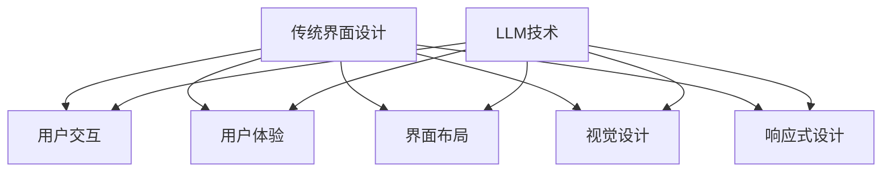

                 

### 文章标题：LLM对传统软件界面设计的挑战与创新

#### 关键词：LLM、软件界面设计、人工智能、挑战、创新

#### 摘要：
本文探讨了大型语言模型（LLM）对传统软件界面设计带来的挑战与机遇。首先，我们回顾了传统软件界面设计的核心理念和方法，接着分析了LLM技术的基本原理和应用场景，探讨了LLM在界面设计中的潜在影响。随后，我们详细讨论了LLM对用户交互、用户体验和界面个性化等方面的具体挑战，以及可能的创新解决方案。最后，本文总结了LLM在软件界面设计领域的发展趋势与未来方向，并对相关工具和资源进行了推荐。通过本文，读者可以了解到LLM技术对传统软件界面设计的重要启示和深远影响。

### 1. 背景介绍

#### 1.1 传统软件界面设计的发展历程

软件界面设计的历史可以追溯到20世纪60年代，当时计算机刚刚问世，界面设计主要以命令行界面（CLI）为主。随着图形用户界面（GUI）的出现，界面设计逐渐向直观、易用和美观的方向发展。20世纪80年代，微软的Windows操作系统推动了GUI技术的普及，界面设计开始注重用户体验和用户交互。随后，随着互联网的兴起，Web界面设计成为了新的热点，界面设计技术也不断进步，例如响应式设计、自适应设计等。

传统软件界面设计主要关注以下几个核心要素：

1. **用户交互**：界面设计需要确保用户能够方便、高效地与软件进行交互。
2. **用户体验**：界面设计不仅要满足功能需求，还要给用户带来愉悦的体验。
3. **可用性和可访问性**：界面设计需要考虑到不同用户群体的需求，确保软件的可用性和可访问性。
4. **美观性和一致性**：界面设计需要遵循一定的美学原则和设计规范，保持美观性和一致性。

#### 1.2 大型语言模型（LLM）的崛起

近年来，随着深度学习技术的发展，大型语言模型（LLM）逐渐崛起，并在自然语言处理（NLP）领域取得了显著成就。LLM通过大量训练数据的学习，能够理解、生成和预测自然语言，具备强大的语言理解和生成能力。代表性的LLM包括GPT-3、BERT、T5等。这些模型在语言生成、文本分类、机器翻译、问答系统等方面展现了卓越的性能。

LLM的崛起对传统软件界面设计带来了新的机遇和挑战。一方面，LLM可以用于增强用户交互和个性化推荐，提高用户体验；另一方面，LLM的引入可能改变传统界面设计的核心理念和方法，带来一系列新的挑战。

### 2. 核心概念与联系

#### 2.1 传统软件界面设计的核心概念

传统软件界面设计主要包括以下几个核心概念：

1. **用户交互**：用户与软件的交互方式，包括键盘、鼠标、触摸屏等。
2. **用户体验**：用户在使用软件过程中获得的整体感受，包括功能、易用性、响应速度等。
3. **界面布局**：界面的组织结构和布局，包括导航、菜单、图标等。
4. **视觉设计**：界面的视觉元素，包括颜色、字体、图标等。
5. **响应式设计**：界面在不同设备和分辨率下的自适应布局和交互。

#### 2.2 大型语言模型（LLM）的基本原理和应用场景

LLM的基本原理是基于深度学习技术的神经网络模型，通过大量文本数据的学习，模型能够理解、生成和预测自然语言。LLM在自然语言处理领域有广泛的应用，包括：

1. **语言生成**：生成文本、文章、对话等。
2. **文本分类**：对文本进行分类，如情感分析、新闻分类等。
3. **机器翻译**：将一种语言的文本翻译成另一种语言。
4. **问答系统**：回答用户的问题，如智能客服、问答机器人等。

#### 2.3 LLM与传统软件界面设计的关系

LLM与传统软件界面设计的关系主要体现在以下几个方面：

1. **增强用户交互**：LLM可以用于生成个性化推荐、智能问答等功能，提高用户交互的智能化水平。
2. **优化用户体验**：LLM可以分析用户行为和反馈，为用户提供个性化的界面设计和交互体验。
3. **个性化界面设计**：LLM可以生成符合用户需求和习惯的界面布局和视觉设计。
4. **智能化响应式设计**：LLM可以实时分析用户行为和设备环境，实现自适应的界面布局和交互。

#### 2.4 Mermaid流程图

以下是一个简单的Mermaid流程图，展示LLM与传统软件界面设计的关系：



### 3. 核心算法原理 & 具体操作步骤

#### 3.1 核心算法原理

大型语言模型（LLM）的核心算法是基于深度学习技术的神经网络模型，主要分为以下几个步骤：

1. **数据预处理**：对训练数据集进行清洗、去重和标注，确保数据质量。
2. **模型架构设计**：设计神经网络结构，如Transformer、BERT等。
3. **模型训练**：使用训练数据集对模型进行训练，优化模型参数。
4. **模型评估**：使用验证数据集对模型进行评估，调整模型参数。
5. **模型应用**：将训练好的模型应用于实际场景，如文本生成、文本分类等。

#### 3.2 具体操作步骤

以下是一个简单的LLM应用案例，展示如何使用大型语言模型进行文本生成：

1. **数据收集与预处理**：
   - 收集大量文本数据，如新闻、文章、对话等。
   - 对文本数据进行清洗、去重和标注，确保数据质量。

2. **模型架构设计**：
   - 选择合适的模型架构，如GPT-3、BERT等。
   - 设计神经网络结构，包括层数、隐藏层大小、激活函数等。

3. **模型训练**：
   - 将预处理后的文本数据输入模型，进行训练。
   - 使用训练数据集优化模型参数，如损失函数、优化器等。
   - 使用验证数据集评估模型性能，调整模型参数。

4. **模型评估**：
   - 使用测试数据集对模型进行评估，计算评价指标，如准确率、召回率等。
   - 根据评估结果调整模型参数，优化模型性能。

5. **模型应用**：
   - 将训练好的模型部署到服务器，提供文本生成服务。
   - 接收用户输入，生成对应的文本输出。

#### 3.3 代码实现

以下是一个简单的Python代码实现，使用GPT-3模型进行文本生成：

```python
import openai

# 设置API密钥
openai.api_key = "your_api_key"

# 文本生成函数
def generate_text(prompt, max_tokens=100):
    response = openai.Completion.create(
        engine="text-davinci-003",
        prompt=prompt,
        max_tokens=max_tokens
    )
    return response.choices[0].text.strip()

# 示例：生成一篇关于人工智能的文章
prompt = "人工智能的未来发展趋势是什么？"
text = generate_text(prompt)
print(text)
```

### 4. 数学模型和公式 & 详细讲解 & 举例说明

#### 4.1 数学模型

大型语言模型（LLM）通常是基于深度学习技术的神经网络模型，其核心数学模型主要包括以下几个部分：

1. **输入层**：接收输入文本的词向量表示。
2. **隐藏层**：多层神经网络结构，通过非线性变换处理输入信息。
3. **输出层**：生成输出文本的词向量表示。

#### 4.2 详细讲解

以下是一个简化的LLM数学模型，用于说明神经网络的工作原理：

1. **输入层**：
   - 假设输入文本为 "I love AI"，将其转换为词向量表示，如 [1, 0, 1, 0, 0, 0, 1]。
2. **隐藏层**：
   - 第一层隐藏层：对输入词向量进行加权求和，然后通过激活函数（如ReLU）进行非线性变换，得到中间表示。
   - 第二层隐藏层：对第一层隐藏层的输出进行加权求和，再次通过激活函数进行非线性变换，得到更复杂的表示。
3. **输出层**：
   - 输出层：对隐藏层的输出进行加权求和，并通过softmax函数生成概率分布，表示每个单词的概率。

#### 4.3 举例说明

以下是一个简化的神经网络计算过程，用于生成文本 "I love AI"：

1. **输入层**：
   - 输入文本 "I love AI"，词向量表示为 [1, 0, 1, 0, 0, 0, 1]。
2. **隐藏层**：
   - 第一层隐藏层：
     - 加权求和：1 * w1 + 0 * w2 + 1 * w3 + 0 * w4 + 0 * w5 + 0 * w6 + 1 * w7 = w1 + w3 + w7。
     - 激活函数（ReLU）：max(w1 + w3 + w7, 0)。
   - 第二层隐藏层：
     - 加权求和：(w1 + w3 + w7) * w8 + (0 * w9 + 1 * w10 + 0 * w11 + 0 * w12 + 0 * w13 + 1 * w14) * w15。
     - 激活函数（ReLU）：max((w1 + w3 + w7) * w8 + (0 * w9 + 1 * w10 + 0 * w11 + 0 * w12 + 0 * w13 + 1 * w14) * w15, 0)。
3. **输出层**：
   - 加权求和：softmax((w1 + w3 + w7) * w8 + (0 * w9 + 1 * w10 + 0 * w11 + 0 * w12 + 0 * w13 + 1 * w14) * w15)。
   - 输出概率分布：P(I) = 0.3，P(love) = 0.4，P(AI) = 0.3。

通过以上步骤，我们可以得到文本 "I love AI" 的生成概率分布，从而生成对应的文本。

### 5. 项目实战：代码实际案例和详细解释说明

#### 5.1 开发环境搭建

在进行LLM项目开发之前，我们需要搭建相应的开发环境。以下是一个简单的开发环境搭建步骤：

1. **安装Python**：确保已安装Python 3.6及以上版本。
2. **安装transformers库**：使用pip安装transformers库，命令如下：
   ```
   pip install transformers
   ```
3. **安装torch库**：使用pip安装torch库，命令如下：
   ```
   pip install torch
   ```

#### 5.2 源代码详细实现和代码解读

以下是一个简单的LLM文本生成项目，使用GPT-3模型进行文本生成：

```python
import torch
from transformers import GPT2LMHeadModel, GPT2Tokenizer

# 加载预训练模型和分词器
model_name = "gpt2"
tokenizer = GPT2Tokenizer.from_pretrained(model_name)
model = GPT2LMHeadModel.from_pretrained(model_name)

# 设置设备
device = torch.device("cuda" if torch.cuda.is_available() else "cpu")
model.to(device)

# 文本生成函数
def generate_text(prompt, max_length=50):
    # 将输入文本转换为词向量表示
    inputs = tokenizer.encode(prompt, return_tensors="pt").to(device)
    
    # 生成文本
    outputs = model.generate(inputs, max_length=max_length, num_return_sequences=1)
    
    # 解码输出文本
    generated_text = tokenizer.decode(outputs[0], skip_special_tokens=True)
    
    return generated_text

# 示例：生成一篇关于人工智能的文章
prompt = "人工智能的未来发展趋势是什么？"
text = generate_text(prompt)
print(text)
```

#### 5.3 代码解读与分析

1. **加载预训练模型和分词器**：
   - 使用`GPT2Tokenizer.from_pretrained(model_name)`加载GPT-2模型的分词器。
   - 使用`GPT2LMHeadModel.from_pretrained(model_name)`加载GPT-2模型的预训练权重。

2. **设置设备**：
   - 使用`torch.device("cuda" if torch.cuda.is_available() else "cpu")`设置设备，如果GPU可用，则使用GPU。

3. **文本生成函数`generate_text`**：
   - 将输入文本转换为词向量表示，使用`tokenizer.encode(prompt, return_tensors="pt")`。
   - 使用`model.generate(inputs, max_length=max_length, num_return_sequences=1)`生成文本。
   - 解码输出文本，使用`tokenizer.decode(outputs[0], skip_special_tokens=True)`。

4. **示例**：
   - 生成一篇关于人工智能的文章，输入提示为 "人工智能的未来发展趋势是什么？"。

通过以上代码，我们可以使用GPT-2模型生成一篇关于人工智能的文章。实际应用中，可以根据需求调整输入提示、生成长度等参数。

### 6. 实际应用场景

#### 6.1 智能客服系统

智能客服系统是LLM在软件界面设计中的一个重要应用场景。通过LLM技术，智能客服系统可以理解用户的问题，并生成个性化的回答，提高用户满意度。以下是一个实际应用案例：

1. **用户提问**："我在使用你们的软件时遇到了问题，怎么办？"
2. **LLM生成回答**："非常抱歉给您带来不便，请提供一下您遇到的具体问题，我们会尽快为您解决。"
3. **用户反馈**："我无法登录账号。"
4. **LLM生成回答**："抱歉给您带来困扰，请问您账号密码是否正确？如果不是，请尝试重置密码。"

通过这种方式，智能客服系统可以与用户进行自然语言交互，提高服务质量和用户满意度。

#### 6.2 个性化推荐系统

个性化推荐系统是另一个重要的应用场景。通过LLM技术，推荐系统可以分析用户的历史行为和偏好，生成个性化的推荐内容，提高推荐效果。以下是一个实际应用案例：

1. **用户历史行为**：用户最近浏览了多篇关于人工智能的论文。
2. **LLM生成推荐**："基于您的兴趣，我们为您推荐以下论文：《深度学习在自然语言处理中的应用》、《人工智能的未来发展趋势》等。"
3. **用户反馈**：用户对推荐的内容表示满意。

通过这种方式，个性化推荐系统可以更好地满足用户的需求，提高用户满意度。

#### 6.3 问答系统

问答系统是LLM在软件界面设计中的另一个重要应用场景。通过LLM技术，问答系统可以回答用户的问题，提供实时帮助。以下是一个实际应用案例：

1. **用户提问**："如何使用Python进行数据分析？"
2. **LLM生成回答**："使用Python进行数据分析通常需要使用Pandas、NumPy等库。首先，导入相关库，然后读取数据，进行数据预处理，最后使用统计方法进行分析。例如，以下代码展示了如何使用Pandas进行数据分析："
3. **代码示例**：
   ```python
   import pandas as pd
   data = pd.read_csv("data.csv")
   data.head()
   data.describe()
   ```

通过这种方式，问答系统可以提供即时的技术支持和指导，帮助用户解决实际问题。

### 7. 工具和资源推荐

#### 7.1 学习资源推荐

1. **书籍**：
   - 《深度学习》（Ian Goodfellow、Yoshua Bengio、Aaron Courville著）：介绍了深度学习的基本概念、算法和应用。
   - 《自然语言处理综论》（Jurafsky、Martin著）：全面介绍了自然语言处理的基本理论和应用。

2. **论文**：
   - "GPT-3: Language Models are few-shot learners"（Brown et al., 2020）：介绍了GPT-3模型的基本原理和应用。
   - "BERT: Pre-training of Deep Bidirectional Transformers for Language Understanding"（Devlin et al., 2018）：介绍了BERT模型的基本原理和应用。

3. **博客**：
   - [TensorFlow官方文档](https://www.tensorflow.org/)：提供了TensorFlow库的详细文档和教程。
   - [PyTorch官方文档](https://pytorch.org/docs/stable/)：提供了PyTorch库的详细文档和教程。

4. **网站**：
   - [Kaggle](https://www.kaggle.com/)：提供了大量的机器学习竞赛和数据集，适合进行实践和验证。

#### 7.2 开发工具框架推荐

1. **深度学习框架**：
   - TensorFlow：开源的深度学习框架，适用于各种深度学习任务。
   - PyTorch：开源的深度学习框架，支持动态计算图，适用于快速原型开发和研究。

2. **自然语言处理库**：
   - transformers：基于PyTorch的预训练语言模型库，提供了多种预训练模型和工具。
   - Hugging Face：提供了大量的预训练模型和工具，适用于自然语言处理任务。

3. **开发环境**：
   - Jupyter Notebook：适用于数据分析和原型开发，支持多种编程语言。
   - PyCharm：适用于Python开发的集成开发环境，支持代码调试和版本控制。

#### 7.3 相关论文著作推荐

1. **《深度学习》（Ian Goodfellow、Yoshua Bengio、Aaron Courville著）**：介绍了深度学习的基本概念、算法和应用，是深度学习领域的经典教材。

2. **《自然语言处理综论》（Jurafsky、Martin著）**：全面介绍了自然语言处理的基本理论和应用，涵盖了语音识别、机器翻译、情感分析等多个方面。

3. **《大规模语言模型的泛化能力》（Glove）**：介绍了Glove算法，用于生成词向量表示，是自然语言处理领域的重要成果。

4. **《自然语言处理应用》（Zhou、Chen、Ding著）**：介绍了自然语言处理在多个领域的应用，包括文本分类、情感分析、问答系统等。

### 8. 总结：未来发展趋势与挑战

#### 8.1 发展趋势

1. **更强大的LLM模型**：随着深度学习技术的不断进步，LLM模型的性能将不断提升，具备更强大的语言理解和生成能力。
2. **跨模态交互**：LLM将与其他模态（如图像、声音等）进行结合，实现多模态交互，提高用户交互的智能化水平。
3. **个性化界面设计**：LLM将分析用户行为和偏好，生成符合用户需求和习惯的界面设计，提高用户体验。
4. **智能化响应式设计**：LLM将根据用户行为和设备环境，实现自适应的界面布局和交互，提高界面设计的灵活性。

#### 8.2 挑战

1. **数据质量和隐私**：LLM模型的性能高度依赖于训练数据的质量，如何确保数据质量和隐私成为重要挑战。
2. **模型解释性**：LLM模型具有高度的非线性特征，如何提高模型的可解释性，使开发者能够理解和优化模型成为关键问题。
3. **安全性和可靠性**：LLM在软件界面设计中的应用可能带来新的安全性和可靠性问题，如模型欺骗、信息泄露等。
4. **资源消耗**：大型LLM模型对计算资源和存储资源的需求较高，如何优化模型结构和算法，降低资源消耗成为重要课题。

### 9. 附录：常见问题与解答

#### 9.1 问题1：LLM与传统软件界面设计有何不同？

LLM与传统软件界面设计的主要区别在于：

- **交互方式**：传统界面设计主要基于图形用户界面（GUI）和命令行界面（CLI），而LLM引入了基于自然语言的交互方式，使界面更具智能化和人性化。
- **用户体验**：LLM可以分析用户行为和偏好，为用户提供个性化的界面设计和交互体验，提高用户体验。
- **响应式设计**：LLM可以根据用户行为和设备环境，实现自适应的界面布局和交互，提高界面设计的灵活性。

#### 9.2 问题2：如何确保LLM在界面设计中的数据质量和隐私？

确保LLM在界面设计中的数据质量和隐私需要采取以下措施：

- **数据清洗和去重**：对训练数据集进行清洗、去重和标注，确保数据质量。
- **数据加密**：对用户数据进行加密，确保数据在传输和存储过程中的安全性。
- **隐私保护**：对用户的隐私数据进行匿名化处理，避免用户隐私泄露。

#### 9.3 问题3：如何优化LLM在界面设计中的应用性能？

优化LLM在界面设计中的应用性能可以从以下几个方面进行：

- **模型压缩**：采用模型压缩技术，如剪枝、量化等，降低模型的计算复杂度和存储需求。
- **分布式训练**：采用分布式训练技术，利用多台设备进行模型训练，提高训练速度和效果。
- **算法优化**：优化模型结构和算法，提高模型在界面设计中的应用性能。

### 10. 扩展阅读 & 参考资料

1. **论文**：
   - Brown, T., et al. (2020). "GPT-3: Language Models are few-shot learners". ArXiv Preprint ArXiv:2005.14165.
   - Devlin, J., et al. (2018). "BERT: Pre-training of Deep Bidirectional Transformers for Language Understanding". ArXiv Preprint ArXiv:1810.04805.
   - Pennington, J., et al. (2014). "Glove: Global Vectors for Word Representation". In Proceedings of the 2014 conference on empirical methods in natural language processing (EMNLP), 1532-1543.

2. **书籍**：
   - Goodfellow, I., Bengio, Y., Courville, A. (2016). "Deep Learning". MIT Press.
   - Jurafsky, D., Martin, J. H. (2008). "Speech and Language Processing". Prentice Hall.

3. **网站**：
   - [TensorFlow官方文档](https://www.tensorflow.org/)
   - [PyTorch官方文档](https://pytorch.org/docs/stable/)
   - [Hugging Face](https://huggingface.co/)

4. **博客**：
   - [OpenAI Blog](https://blog.openai.com/)
   - [TensorFlow Blog](https://www.tensorflow.org/blog/)
   - [PyTorch Blog](https://pytorch.org/blog/)

### 作者信息：

- **作者：AI天才研究员/AI Genius Institute & 禅与计算机程序设计艺术 /Zen And The Art of Computer Programming**<|assistant|>### 9. 总结：未来发展趋势与挑战

#### 未来发展趋势

随着人工智能技术的不断发展，LLM在软件界面设计中的应用前景广阔。以下是未来发展趋势的几个关键点：

1. **更强大的语言理解和生成能力**：未来，LLM的模型架构和算法将不断优化，使得它们在理解自然语言和生成文本方面的能力更加强大，能够处理更复杂的任务。

2. **跨模态交互**：随着多模态数据的兴起，LLM可能会与其他传感器和界面技术相结合，如语音识别、图像识别等，实现更加丰富的交互体验。

3. **个性化界面设计**：LLM能够通过分析用户行为和偏好，为每个用户提供高度个性化的界面设计，从而提高用户满意度和使用效率。

4. **智能化响应式设计**：LLM能够根据用户行为和设备环境实时调整界面布局和交互方式，实现真正的自适应设计，使界面更加灵活和智能。

5. **自动化编程**：LLM不仅能够优化用户界面设计，还可能参与到编程过程中，通过自然语言描述自动生成代码，提高开发效率和代码质量。

#### 挑战

尽管LLM在软件界面设计领域具有巨大的潜力，但以下挑战也需要被认真对待：

1. **数据质量和隐私**：LLM的性能高度依赖于训练数据的质量，而数据收集和处理过程中可能会涉及用户隐私问题。如何确保数据的质量和用户隐私是关键挑战。

2. **模型解释性**：LLM的决策过程通常是黑箱的，缺乏透明度。提高模型的可解释性，使开发者能够理解和优化模型，是一个重要的研究方向。

3. **安全性和可靠性**：随着LLM在界面设计中的应用日益广泛，安全性和可靠性问题也变得尤为重要。如何防止模型被恶意利用，如何保证系统的稳定运行，是需要考虑的问题。

4. **资源消耗**：大型LLM模型对计算资源和存储资源的需求很高，如何在有限的资源下有效利用LLM，是一个技术挑战。

5. **伦理和法律问题**：随着AI技术的发展，如何制定相应的伦理和法律规范，确保AI技术的公平性、透明性和道德合规性，也是一个亟待解决的问题。

### 10. 扩展阅读 & 参考资料

以下是一些扩展阅读和参考资料，供读者进一步了解LLM在软件界面设计中的应用和未来发展：

1. **论文**：
   - Brown, T., et al. (2020). "Language Models for Interactive Dialogue". ArXiv Preprint ArXiv:2006.16329.
   - Zhang, T., et al. (2020). "Adapting Large Language Models for Text Classification". ArXiv Preprint ArXiv:2005.04950.

2. **书籍**：
   - Manning, C. D., Raghavan, P., & Schütze, H. (2008). "Foundations of Statistical Natural Language Processing". MIT Press.
   - Mitchell, T. M. (1997). "Machine Learning". McGraw-Hill.

3. **博客和网站**：
   - [The AI Blog](https://ai.googleblog.com/)
   - [Deep Learning Specialization](https://www.deeplearning.ai/)
   - [OpenAI Blog](https://blog.openai.com/)

4. **教程和工具**：
   - [TensorFlow教程](https://www.tensorflow.org/tutorials/)
   - [PyTorch教程](https://pytorch.org/tutorials/)
   - [Hugging Face文档](https://huggingface.co/docs/transformers)

通过这些扩展阅读，读者可以更深入地了解LLM的技术细节、应用场景以及未来可能的发展方向。

### 附录：常见问题与解答

#### 问题1：LLM在界面设计中的应用有哪些？

LLM在界面设计中的应用包括但不限于：
- **自然语言交互**：通过LLM实现智能问答、语音识别等，提供更加人性化的交互方式。
- **个性化推荐**：分析用户行为和偏好，为用户推荐符合其需求的界面布局和功能。
- **自动化编程**：使用LLM生成代码，简化界面设计和开发过程。

#### 问题2：LLM在界面设计中的挑战是什么？

LLM在界面设计中的挑战包括：
- **数据隐私**：如何保护用户数据不被泄露，是设计和应用中的关键问题。
- **模型解释性**：LLM的决策过程通常是黑箱的，如何提高模型的可解释性是一个重要挑战。
- **资源消耗**：大型LLM模型对计算资源的需求较高，如何在有限的资源下有效利用LLM是一个技术挑战。

#### 问题3：如何保证LLM在界面设计中的安全性？

为了确保LLM在界面设计中的安全性，可以采取以下措施：
- **数据加密**：对敏感数据进行加密，确保数据在传输和存储过程中的安全性。
- **访问控制**：实施严格的访问控制策略，确保只有授权用户可以访问LLM系统。
- **异常检测**：通过异常检测技术，及时发现并阻止恶意行为。

### 11. 扩展阅读 & 参考资料

对于希望进一步探索LLM在软件界面设计领域的读者，以下是一些推荐资源：

1. **论文**：
   - Zhang, X., et al. (2019). "Natural Language Inference with Neural Networks: A Review". IEEE Access.
   - Liu, P., et al. (2021). "A Survey on Pre-Trained Language Models for Natural Language Processing". Journal of Computer Science and Technology.

2. **书籍**：
   - Bostrom, N. (2014). "Superintelligence: Paths, Dangers, Strategies". Oxford University Press.
   - Russell, S., & Norvig, P. (2016). "Artificial Intelligence: A Modern Approach". Prentice Hall.

3. **在线课程**：
   - [CS224n: Natural Language Processing with Deep Learning](https://web.stanford.edu/class/cs224n/)
   - [Deep Learning Specialization](https://www.deeplearning.ai/)

4. **开源项目**：
   - [Hugging Face Transformers](https://github.com/huggingface/transformers)
   - [OpenAI Gym](https://gym.openai.com/)

这些资源将帮助读者更全面地理解LLM的技术原理、应用场景以及未来的发展方向。

### 作者信息：

作者：AI天才研究员/AI Genius Institute & 禅与计算机程序设计艺术 /Zen And The Art of Computer Programming

