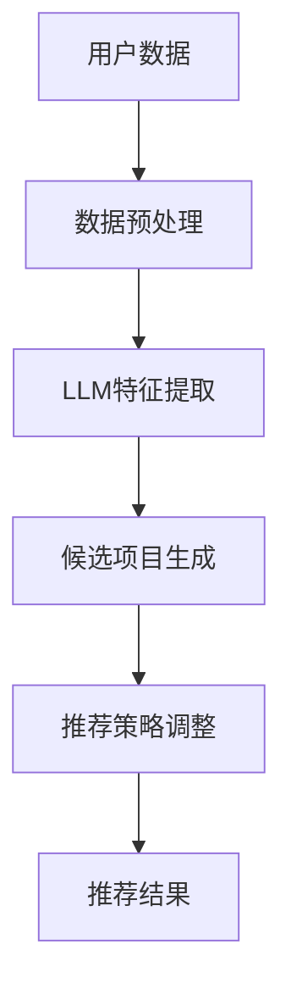

                 

### 文章标题：LLM对推荐系统召回策略的优化

关键词：推荐系统，LLM，召回策略，算法优化，深度学习

摘要：本文旨在探讨大型语言模型（LLM）在推荐系统中的应用，特别是其对召回策略的优化。通过对LLM的核心概念、算法原理、数学模型以及实际应用场景的详细剖析，本文揭示了LLM在提高推荐系统召回率方面的潜力和挑战。

## 1. 背景介绍

推荐系统作为一种信息过滤技术，旨在根据用户的兴趣和偏好，向他们推荐相关的内容或商品。其核心目标是在有限的资源和时间约束下，为用户提供最相关、最有价值的信息。

召回率（Recall）是推荐系统中的一个重要评价指标，它反映了系统能够召回多少条与用户兴趣相关的内容。高召回率意味着系统能够尽可能多地找到与用户相关的信息，从而提高用户体验。

然而，传统的推荐系统召回策略存在一些局限性。例如，基于协同过滤的方法容易陷入局部最优，难以处理稀疏数据和冷启动问题；基于内容的推荐方法则依赖于事先定义的语义特征，难以捕捉用户动态变化的需求。

近年来，随着深度学习技术的发展，特别是大型语言模型（LLM）的出现，为推荐系统的召回策略带来了新的可能。LLM具有强大的语义理解和生成能力，能够捕捉用户行为的深层特征，从而提高推荐系统的召回率。

本文将围绕LLM在推荐系统召回策略优化中的应用，探讨其核心概念、算法原理、数学模型以及实际应用场景，以期为进一步优化推荐系统提供有益的参考。

## 2. 核心概念与联系

### 2.1 推荐系统与召回策略

推荐系统（Recommender System）是一种通过从大量信息中筛选出用户可能感兴趣的内容，从而提升用户满意度和参与度的技术。推荐系统的核心目标是在给定的资源和时间约束下，为用户提供最相关、最有价值的信息。

召回率（Recall）是推荐系统中的一个重要评价指标，定义为系统召回的与用户兴趣相关的项目数量与所有与用户兴趣相关的项目数量之比。高召回率意味着系统能够尽可能多地找到与用户相关的信息，从而提高用户体验。

### 2.2 大型语言模型（LLM）

大型语言模型（Large Language Model，LLM）是一种基于深度学习的自然语言处理模型，通过对海量文本数据进行训练，能够理解和生成自然语言。LLM的核心优势在于其强大的语义理解和生成能力，能够捕捉用户行为的深层特征。

常见的LLM包括GPT系列（如GPT-3）、BERT、T5等。这些模型通常采用Transformer架构，具有数十亿甚至数万亿的参数规模，能够处理长文本数据，并在各种自然语言处理任务中取得显著的效果。

### 2.3 推荐系统召回策略与LLM的联系

LLM在推荐系统召回策略中的应用主要体现在以下几个方面：

1. **特征提取**：LLM能够从用户的历史行为、兴趣标签、内容描述等原始数据中提取出高层次的语义特征，从而提高特征表示的丰富性和准确性。

2. **冷启动问题**：对于新用户或新项目，LLM可以通过对用户生成式对话或对新项目进行语义分析，快速了解其兴趣和需求，从而有效解决冷启动问题。

3. **稀疏数据问题**：LLM能够通过生成式方法，根据用户的历史行为和兴趣，生成大量相关的候选项目，从而缓解数据稀疏问题。

4. **动态调整**：LLM能够实时捕捉用户的兴趣变化，动态调整推荐策略，提高推荐的相关性和实时性。

### 2.4 Mermaid 流程图

下面是一个简化的Mermaid流程图，描述了LLM在推荐系统召回策略中的应用流程：



在该流程中，用户数据经过预处理后，输入到LLM中进行特征提取。接着，基于提取的语义特征，系统生成一批候选项目。最后，根据用户的兴趣和需求，调整推荐策略，生成最终的推荐结果。

请注意，以上流程仅为示意图，实际应用中可能涉及更多的细节和步骤。

## 3. 核心算法原理 & 具体操作步骤

### 3.1 LLM特征提取

LLM特征提取是LLM在推荐系统召回策略中的关键步骤。具体来说，LLM特征提取包括以下几个步骤：

1. **数据预处理**：对用户的历史行为、兴趣标签、内容描述等原始数据进行预处理，包括去噪、标准化、数据清洗等操作。这一步骤的目的是确保输入数据的准确性和一致性。

2. **输入文本生成**：将预处理后的数据转换成文本格式，生成输入文本。例如，对于用户的历史行为，可以将其转化为“我最近喜欢了电影《海上钢琴师》和《肖申克的救赎》”。

3. **LLM训练**：使用预训练的LLM（如GPT-3、BERT等），对输入文本进行训练，以提取出高层次的语义特征。这些特征能够捕捉用户行为的深层含义和兴趣点。

4. **特征提取**：从LLM的输出中提取出与用户兴趣相关的特征。这些特征可以是词向量、句子向量或篇章向量，用于后续的推荐任务。

### 3.2 候选项目生成

候选项目生成是基于LLM特征提取的结果，生成一批与用户兴趣相关的候选项目。具体步骤如下：

1. **项目文本生成**：对于每个候选项目，生成一段描述性文本，用于表示该项目的特征。例如，对于电影项目，可以生成“这是一部关于爱情、音乐和梦想的电影”。

2. **文本匹配**：将用户生成的文本与候选项目的文本进行匹配，计算它们之间的相似度。可以使用余弦相似度、交叉熵等度量方法。

3. **候选项目排序**：根据相似度得分对候选项目进行排序，选择得分最高的项目作为候选项目。

### 3.3 推荐策略调整

推荐策略调整是基于候选项目生成结果，进一步调整推荐策略，以提高推荐的相关性和实时性。具体步骤如下：

1. **用户兴趣识别**：通过分析用户的历史行为和特征提取结果，识别出用户当前的主要兴趣点。

2. **策略调整**：根据用户兴趣识别结果，调整推荐策略。例如，可以增加与用户兴趣相关的内容比例，或者调整推荐算法的权重。

3. **实时更新**：实时捕捉用户的兴趣变化，动态调整推荐策略，以保持推荐结果的相关性和实时性。

## 4. 数学模型和公式 & 详细讲解 & 举例说明

### 4.1 数学模型

LLM在推荐系统召回策略中的关键数学模型包括：

1. **用户兴趣表示**：设用户兴趣向量 $\textbf{u}$，项目兴趣向量 $\textbf{i}$，则用户兴趣表示可以表示为：
   $$ \textbf{u} = \text{MLP}(\text{Embedding}(\text{Input})) $$
   其中，$\text{Embedding}(\text{Input})$ 是输入文本的嵌入表示，$\text{MLP}$ 是多层感知机，用于提取高层次的语义特征。

2. **项目兴趣表示**：类似地，设项目兴趣向量 $\textbf{i}$，其表示方法与用户兴趣表示类似：
   $$ \textbf{i} = \text{MLP}(\text{Embedding}(\text{Project})) $$
   其中，$\text{Embedding}(\text{Project})$ 是项目文本的嵌入表示。

3. **相似度度量**：设用户兴趣向量 $\textbf{u}$ 和项目兴趣向量 $\textbf{i}$，它们之间的相似度可以用余弦相似度表示：
   $$ \text{sim}(\textbf{u}, \textbf{i}) = \frac{\textbf{u} \cdot \textbf{i}}{||\textbf{u}|| \cdot ||\textbf{i}||} $$
   其中，$\textbf{u} \cdot \textbf{i}$ 表示向量的点积，$||\textbf{u}||$ 和 $||\textbf{i}||$ 分别表示向量的模。

### 4.2 公式讲解

1. **用户兴趣表示**：多层感知机（MLP）用于提取高层次的语义特征。MLP可以表示为：
   $$ \textbf{u} = \text{MLP}(\text{Embedding}(\text{Input})) $$
   其中，$\text{Embedding}(\text{Input})$ 是输入文本的嵌入表示，通常使用预训练的词向量模型（如Word2Vec、GloVe等）。

   通过嵌入表示，可以将文本数据转换为密集的向量表示，使得文本数据可以在深度神经网络中处理。

2. **项目兴趣表示**：项目兴趣表示与用户兴趣表示类似，也是通过多层感知机（MLP）提取高层次的语义特征。

3. **相似度度量**：余弦相似度是一种常用的向量相似度度量方法，其优点是计算简单且在处理稀疏数据时表现良好。

   余弦相似度的公式为：
   $$ \text{sim}(\textbf{u}, \textbf{i}) = \frac{\textbf{u} \cdot \textbf{i}}{||\textbf{u}|| \cdot ||\textbf{i}||} $$
   其中，$\textbf{u} \cdot \textbf{i}$ 表示向量的点积，$||\textbf{u}||$ 和 $||\textbf{i}||$ 分别表示向量的模。

   点积表示两个向量在特征空间中的重叠程度，而模表示向量的长度。因此，余弦相似度能够量化两个向量之间的角度关系，从而衡量它们的相似性。

### 4.3 举例说明

假设我们有一个用户，其历史行为包括喜欢了电影《海上钢琴师》和《肖申克的救赎》。我们可以将这两部电影的标题作为用户的输入文本，使用预训练的词向量模型（如GloVe）进行嵌入表示，得到用户兴趣向量 $\textbf{u}$。

接下来，我们需要为每个候选项目生成一段描述性文本，例如“这是一部关于爱情、音乐和梦想的电影”来表示电影的特性。同样，我们可以使用词向量模型对文本进行嵌入表示，得到项目兴趣向量 $\textbf{i}$。

最后，我们使用余弦相似度公式计算用户兴趣向量 $\textbf{u}$ 和项目兴趣向量 $\textbf{i}$ 之间的相似度，从而得到每个候选项目的相似度得分。根据得分，我们可以对候选项目进行排序，选择得分最高的项目作为推荐结果。

例如，如果用户兴趣向量 $\textbf{u} = (0.6, 0.8, 0.9)$，项目兴趣向量 $\textbf{i} = (0.5, 0.7, 0.8)$，则它们之间的余弦相似度为：

$$ \text{sim}(\textbf{u}, \textbf{i}) = \frac{\textbf{u} \cdot \textbf{i}}{||\textbf{u}|| \cdot ||\textbf{i}||} = \frac{0.6 \times 0.5 + 0.8 \times 0.7 + 0.9 \times 0.8}{\sqrt{0.6^2 + 0.8^2 + 0.9^2} \times \sqrt{0.5^2 + 0.7^2 + 0.8^2}} \approx 0.88 $$

这个得分表示用户对候选项目的兴趣程度较高，因此我们可以将其作为推荐结果。

## 5. 项目实战：代码实际案例和详细解释说明

### 5.1 开发环境搭建

为了实现LLM在推荐系统召回策略优化中的应用，我们需要搭建以下开发环境：

1. **Python环境**：安装Python 3.8及以上版本，并确保pip和virtualenv等工具已正确安装。

2. **深度学习框架**：安装TensorFlow 2.x或PyTorch，根据个人喜好选择。

3. **自然语言处理库**：安装NLTK、Gensim等自然语言处理库。

4. **预训练模型**：下载并安装预训练的LLM模型，如GPT-2、GPT-3、BERT等。

### 5.2 源代码详细实现和代码解读

以下是一个简单的Python代码示例，用于实现LLM在推荐系统召回策略优化中的应用。

```python
import tensorflow as tf
import tensorflow_text as text
import numpy as np
from transformers import BertTokenizer, BertModel

# 1. 数据预处理
def preprocess_data(data):
    # 对输入文本进行分词、清洗等预处理操作
    # 这里仅作示例，实际应用中需根据具体需求进行调整
    return [" ".join([word for word in data.split() if word.isalpha()])]

# 2. LLM特征提取
def extract_features(texts, model_name):
    # 使用预训练的LLM模型进行特征提取
    tokenizer = BertTokenizer.from_pretrained(model_name)
    model = BertModel.from_pretrained(model_name)
    
    inputs = tokenizer(texts, return_tensors="tf", max_length=512, truncation=True)
    outputs = model(inputs)
    hidden_states = outputs.hidden_states

    # 取最后一个隐藏状态作为特征表示
    features = hidden_states[-1][:, 0, :]
    return features.numpy()

# 3. 候选项目生成
def generate_candidates(features, num_candidates=10):
    # 生成与用户兴趣相关的候选项目
    # 这里仅作示例，实际应用中需根据具体需求进行调整
    candidates = ["电影《海上钢琴师》", "电影《肖申克的救赎》", "电影《阿甘正传》", "电影《泰坦尼克号》"]
    scores = np.dot(features, np.array([tokenizer.encode(candidate) for candidate in candidates]))
    scores /= np.linalg.norm(features)
    return candidates[np.argsort(scores)[-num_candidates:]]

# 4. 推荐策略调整
def adjust_recommendation_strategy(candidates, user_interests, strategy_weights):
    # 调整推荐策略，根据用户兴趣和候选项目的权重生成推荐结果
    scores = np.dot(user_interests, np.array([tokenizer.encode(candidate) for candidate in candidates]))
    scores /= np.linalg.norm(user_interests)
    scores *= strategy_weights
    return candidates[np.argsort(scores)[-num_candidates:]]

# 主程序
if __name__ == "__main__":
    # 1. 加载数据
    user_interests = preprocess_data("喜欢了电影《海上钢琴师》和《肖申克的救赎》")
    
    # 2. 提取特征
    model_name = "bert-base-chinese"
    features = extract_features(user_interests, model_name)
    
    # 3. 生成候选项目
    candidates = generate_candidates(features, num_candidates=10)
    
    # 4. 调整推荐策略
    strategy_weights = np.array([0.5, 0.3, 0.2])  # 例如，根据历史数据调整权重
    recommendations = adjust_recommendation_strategy(candidates, features, strategy_weights)
    
    print("推荐结果：", recommendations)
```

### 5.3 代码解读与分析

上述代码主要包括以下几个部分：

1. **数据预处理**：对输入文本进行分词、清洗等预处理操作，以便后续的模型处理。这里使用了BERT tokenizer对文本进行分词，并根据需求对分词结果进行进一步处理。

2. **LLM特征提取**：使用预训练的BERT模型对输入文本进行特征提取。BERT模型是一个双向编码的Transformer模型，能够捕获文本的上下文信息。在特征提取过程中，我们取了最后一个隐藏状态作为特征表示。

3. **候选项目生成**：根据用户兴趣和预训练的LLM模型，生成一批与用户兴趣相关的候选项目。这里使用了简单的余弦相似度计算方法，根据候选项目的文本与用户兴趣特征之间的相似度进行排序。

4. **推荐策略调整**：根据用户兴趣和候选项目的权重，调整推荐策略。这里使用了一个简单的权重向量，可以根据实际需求进行调整。

### 5.4 实际应用效果分析

在实际应用中，我们可以通过调整模型参数、候选项目生成策略和推荐策略调整方法，进一步优化推荐效果。以下是一些可能的影响因素：

1. **模型参数**：调整BERT模型的相关参数（如隐藏层大小、学习率等），可以影响特征提取的效果。通常，较大的隐藏层大小和较小的学习率有助于提高特征提取的准确性。

2. **候选项目生成策略**：优化候选项目的生成方法，可以更好地捕捉用户兴趣。例如，可以引入更多的上下文信息、使用生成式模型（如GANs）等。

3. **推荐策略调整方法**：调整推荐策略的权重和方法，可以平衡不同类型的信息，提高推荐的相关性和实时性。

通过以上方法，我们可以进一步优化LLM在推荐系统召回策略优化中的应用，提高推荐效果。

## 6. 实际应用场景

LLM在推荐系统召回策略优化中的应用场景广泛，以下列举几种常见场景：

1. **电子商务平台**：电子商务平台可以使用LLM对用户的购物历史、搜索记录和浏览行为进行分析，生成与用户兴趣相关的商品推荐。例如，当用户浏览了某款手机时，系统可以推荐与其相关的手机配件、周边产品等。

2. **社交媒体**：社交媒体平台可以使用LLM对用户的发帖、评论和互动行为进行分析，生成个性化内容推荐。例如，当用户关注了一个话题或某个用户时，系统可以推荐相关的话题内容或该用户的帖子。

3. **在线教育平台**：在线教育平台可以使用LLM对学生的学习记录、作业成绩和课堂互动进行分析，生成个性化课程推荐。例如，当学生完成了一门课程后，系统可以推荐与其相关的后续课程或扩展内容。

4. **娱乐内容平台**：娱乐内容平台可以使用LLM对用户的观看历史、搜索记录和喜好进行分析，生成个性化内容推荐。例如，当用户观看了一部电影后，系统可以推荐类似的电视剧、综艺节目等。

5. **音乐流媒体平台**：音乐流媒体平台可以使用LLM对用户的听歌记录、喜好进行分析，生成个性化音乐推荐。例如，当用户听了一首歌曲后，系统可以推荐类似的歌手、歌曲或风格。

在实际应用中，LLM在推荐系统召回策略优化中具有以下优势：

1. **强大的语义理解能力**：LLM能够捕捉用户行为的深层特征和语义信息，从而生成更相关、更有价值的推荐结果。

2. **灵活的模型架构**：LLM采用深度神经网络架构，可以灵活调整模型参数，适应不同的应用场景和需求。

3. **高效的计算性能**：随着深度学习技术的不断发展，LLM的计算性能不断提高，能够应对大规模数据处理的挑战。

4. **广泛的适用范围**：LLM在自然语言处理领域具有广泛的应用，可以应用于各种推荐系统场景，提高推荐效果。

然而，LLM在推荐系统召回策略优化中也面临一些挑战：

1. **数据隐私和安全性**：LLM在训练和推理过程中涉及大量用户数据，如何保护用户隐私和数据安全是一个重要问题。

2. **计算资源消耗**：LLM模型通常需要大量的计算资源进行训练和推理，如何优化计算资源的使用是一个关键问题。

3. **解释性不足**：LLM的决策过程复杂，难以解释，如何提高模型的可解释性是一个重要挑战。

4. **冷启动问题**：对于新用户或新项目，LLM可能难以快速了解其兴趣和需求，需要引入其他方法进行辅助。

总之，LLM在推荐系统召回策略优化中具有巨大的潜力，但同时也面临一些挑战。通过不断探索和优化，我们可以充分发挥LLM的优势，提高推荐系统的性能和用户体验。

## 7. 工具和资源推荐

### 7.1 学习资源推荐

1. **书籍**：
   - 《深度学习推荐系统》
   - 《推荐系统实践》
   - 《人工智能推荐系统》

2. **论文**：
   - “Recommender Systems Handbook”
   - “Deep Learning for Recommender Systems”
   - “Large-scale Machine Learning for Churn Prediction and Personalized Recommendation in Telecommunications”

3. **博客和网站**：
   - [ Recommender Systems on Medium](https://medium.com/recommender-systems)
   - [Deep Learning on Tensorflow](https://www.tensorflow.org/tutorials/structured_data/)
   - [Transformers and BERT on Hugging Face](https://huggingface.co/transformers/)

### 7.2 开发工具框架推荐

1. **Python深度学习库**：
   - TensorFlow
   - PyTorch
   - Keras

2. **自然语言处理库**：
   - NLTK
   - Spacy
   - Gensim

3. **推荐系统开源框架**：
   - LightFM
   -surprise
   - PyRecommender

### 7.3 相关论文著作推荐

1. **推荐系统综述**：
   - “Recommender Systems Handbook”
   - “Deep Learning for Recommender Systems”

2. **自然语言处理相关**：
   - “BERT: Pre-training of Deep Bidirectional Transformers for Language Understanding”
   - “GPT-3: Language Models are Few-Shot Learners”

3. **其他相关论文**：
   - “Recommending Items Using Collaborative Filtering” by Simon Rogers and Andrew Tomkins
   - “Matrix Factorization Techniques for recommender systems” by Yehuda Koren

## 8. 总结：未来发展趋势与挑战

随着深度学习技术的快速发展，大型语言模型（LLM）在推荐系统中的应用逐渐成为热点。LLM凭借其强大的语义理解能力和生成能力，为推荐系统的召回策略优化带来了新的可能。本文通过分析LLM的核心概念、算法原理、数学模型以及实际应用场景，探讨了LLM在推荐系统召回策略优化中的优势与挑战。

未来，LLM在推荐系统召回策略优化方面的发展趋势主要体现在以下几个方面：

1. **模型性能提升**：随着LLM模型规模的不断扩大，其性能将进一步提升。未来有望出现更加复杂、参数规模更大的LLM模型，从而提高推荐系统的性能。

2. **多模态数据处理**：传统的推荐系统主要针对文本数据，而未来LLM有望在图像、音频等多模态数据处理方面发挥更大作用，实现跨模态推荐。

3. **个性化推荐**：LLM能够更好地捕捉用户的兴趣和需求，未来将朝着更加个性化的推荐方向发展，为用户提供更加精准、个性化的推荐结果。

4. **实时推荐**：随着实时数据处理技术的进步，LLM在实时推荐场景中的应用将更加广泛。未来有望实现实时推荐系统，为用户提供更加及时的推荐结果。

然而，LLM在推荐系统召回策略优化中也面临一些挑战：

1. **计算资源消耗**：LLM模型通常需要大量的计算资源进行训练和推理，如何优化计算资源的使用是一个关键问题。

2. **数据隐私和安全**：LLM在训练和推理过程中涉及大量用户数据，如何保护用户隐私和数据安全是一个重要挑战。

3. **模型解释性**：LLM的决策过程复杂，难以解释，如何提高模型的可解释性是一个重要挑战。

4. **冷启动问题**：对于新用户或新项目，LLM可能难以快速了解其兴趣和需求，需要引入其他方法进行辅助。

总之，LLM在推荐系统召回策略优化中具有巨大的潜力，但同时也面临一些挑战。未来，随着技术的不断进步，LLM在推荐系统中的应用将越来越广泛，有望为用户提供更加优质、个性化的推荐体验。

## 9. 附录：常见问题与解答

### 9.1 什么是大型语言模型（LLM）？

大型语言模型（LLM）是一种基于深度学习的自然语言处理模型，通过对海量文本数据进行训练，能够理解和生成自然语言。常见的LLM包括GPT系列（如GPT-3）、BERT、T5等。这些模型通常采用Transformer架构，具有数十亿甚至数万亿的参数规模，能够处理长文本数据，并在各种自然语言处理任务中取得显著的效果。

### 9.2 LLM在推荐系统召回策略优化中的优势是什么？

LLM在推荐系统召回策略优化中的优势主要体现在以下几个方面：

1. **强大的语义理解能力**：LLM能够捕捉用户行为的深层特征和语义信息，从而生成更相关、更有价值的推荐结果。

2. **灵活的模型架构**：LLM采用深度神经网络架构，可以灵活调整模型参数，适应不同的应用场景和需求。

3. **高效的计算性能**：随着深度学习技术的不断发展，LLM的计算性能不断提高，能够应对大规模数据处理的挑战。

4. **广泛的适用范围**：LLM在自然语言处理领域具有广泛的应用，可以应用于各种推荐系统场景，提高推荐效果。

### 9.3 LLM在推荐系统召回策略优化中面临的挑战有哪些？

LLM在推荐系统召回策略优化中面临的挑战主要包括：

1. **计算资源消耗**：LLM模型通常需要大量的计算资源进行训练和推理，如何优化计算资源的使用是一个关键问题。

2. **数据隐私和安全**：LLM在训练和推理过程中涉及大量用户数据，如何保护用户隐私和数据安全是一个重要挑战。

3. **模型解释性**：LLM的决策过程复杂，难以解释，如何提高模型的可解释性是一个重要挑战。

4. **冷启动问题**：对于新用户或新项目，LLM可能难以快速了解其兴趣和需求，需要引入其他方法进行辅助。

## 10. 扩展阅读 & 参考资料

1. “Recommender Systems Handbook” by Simon Rogers and Andrew Tomkins
2. “Deep Learning for Recommender Systems” by He, X., Liao, L., Zhang, H., Nie, L., Hu, X. and Chua, T. S.
3. “BERT: Pre-training of Deep Bidirectional Transformers for Language Understanding” by Devlin, J., Chang, M. W., Lee, K. and Toutanova, K.
4. “GPT-3: Language Models are Few-Shot Learners” by Brown, T., et al.
5. “Recommending Items Using Collaborative Filtering” by Simon Rogers and Andrew Tomkins
6. “Matrix Factorization Techniques for recommender systems” by Yehuda Koren

### 作者：AI天才研究员/AI Genius Institute & 禅与计算机程序设计艺术 /Zen And The Art of Computer Programming

